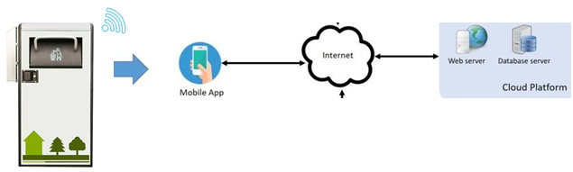

<html xmlns:v="urn:schemas-microsoft-com:vml"
xmlns:o="urn:schemas-microsoft-com:office:office"
xmlns:w="urn:schemas-microsoft-com:office:word"
xmlns:m="http://schemas.microsoft.com/office/2004/12/omml"
xmlns="http://www.w3.org/TR/REC-html40">

<head>
<meta http-equiv=Content-Type content="text/html; charset=utf-8">
<meta name=ProgId content=Word.Document>
<meta name=Generator content="Microsoft Word 15">
<meta name=Originator content="Microsoft Word 15">
<link rel=File-List href="SmartThrashCollector_file/filelist.xml">
<link rel=Preview href="SmartThrashCollector_file/preview.wmf">
<link rel=Edit-Time-Data href="SmartThrashCollector_file/editdata.mso">
<!--[if !mso]>

<![endif]-->
 
<!--[if gte mso 9]><xml>
 <o:DocumentProperties>
  <o:Author>Zachariadis Georgios</o:Author>
  <o:LastAuthor>Zachariadis Georgios</o:LastAuthor>
  <o:Revision>2</o:Revision>
  <o:TotalTime>13</o:TotalTime>
  <o:Created>2022-06-21T12:59:00Z</o:Created>
  <o:LastSaved>2022-06-21T12:59:00Z</o:LastSaved>
  <o:Pages>15</o:Pages>
  <o:Words>1266</o:Words>
  <o:Characters>7220</o:Characters>
  <o:Lines>60</o:Lines>
  <o:Paragraphs>16</o:Paragraphs>
  <o:CharactersWithSpaces>8470</o:CharactersWithSpaces>
  <o:Version>16.00</o:Version>
 </o:DocumentProperties>
 <o:OfficeDocumentSettings>
  <o:AllowPNG/>
 </o:OfficeDocumentSettings>
</xml><![endif]-->
<link rel=dataStoreItem href="SmartThrashCollector_file/item0001.xml"
target="SmartThrashCollector_file/props002.xml">
<link rel=themeData href="SmartThrashCollector_file/themedata.thmx">
<link rel=colorSchemeMapping
href="SmartThrashCollector_file/colorschememapping.xml">
<!--[if gte mso 9]><xml>
 <w:WordDocument>
  <w:SpellingState>Clean</w:SpellingState>
  <w:GrammarState>Clean</w:GrammarState>
  <w:TrackMoves>false</w:TrackMoves>
  <w:TrackFormatting/>
  <w:HyphenationZone>14</w:HyphenationZone>
  <w:PunctuationKerning/>
  <w:ValidateAgainstSchemas/>
  <w:SaveIfXMLInvalid>false</w:SaveIfXMLInvalid>
  <w:IgnoreMixedContent>false</w:IgnoreMixedContent>
  <w:AlwaysShowPlaceholderText>false</w:AlwaysShowPlaceholderText>
  <w:DoNotPromoteQF/>
  <w:LidThemeOther>IT</w:LidThemeOther>
  <w:LidThemeAsian>X-NONE</w:LidThemeAsian>
  <w:LidThemeComplexScript>X-NONE</w:LidThemeComplexScript>
  <w:Compatibility>
   <w:BreakWrappedTables/>
   <w:SnapToGridInCell/>
   <w:WrapTextWithPunct/>
   <w:UseAsianBreakRules/>
   <w:DontGrowAutofit/>
   <w:SplitPgBreakAndParaMark/>
   <w:EnableOpenTypeKerning/>
   <w:DontFlipMirrorIndents/>
   <w:OverrideTableStyleHps/>
  </w:Compatibility>
  <m:mathPr>
   <m:mathFont m:val="Cambria Math"/>
   <m:brkBin m:val="before"/>
   <m:brkBinSub m:val="&#45;-"/>
   <m:smallFrac m:val="off"/>
   <m:dispDef/>
   <m:lMargin m:val="0"/>
   <m:rMargin m:val="0"/>
   <m:defJc m:val="centerGroup"/>
   <m:wrapIndent m:val="1440"/>
   <m:intLim m:val="subSup"/>
   <m:naryLim m:val="undOvr"/>
  </m:mathPr></w:WordDocument>
</xml><![endif]--><!--[if gte mso 9]><xml>
 <w:LatentStyles DefLockedState="false" DefUnhideWhenUsed="false"
  DefSemiHidden="false" DefQFormat="false" DefPriority="99"
  LatentStyleCount="375">
  <w:LsdException Locked="false" Priority="0" QFormat="true" Name="Normal"/>
  <w:LsdException Locked="false" Priority="9" QFormat="true" Name="heading 1"/>
  <w:LsdException Locked="false" Priority="9" SemiHidden="true"
   UnhideWhenUsed="true" QFormat="true" Name="heading 2"/>
  <w:LsdException Locked="false" Priority="9" SemiHidden="true"
   UnhideWhenUsed="true" QFormat="true" Name="heading 3"/>
  <w:LsdException Locked="false" Priority="9" SemiHidden="true"
   UnhideWhenUsed="true" QFormat="true" Name="heading 4"/>
  <w:LsdException Locked="false" Priority="9" SemiHidden="true"
   UnhideWhenUsed="true" QFormat="true" Name="heading 5"/>
  <w:LsdException Locked="false" Priority="9" SemiHidden="true"
   UnhideWhenUsed="true" QFormat="true" Name="heading 6"/>
  <w:LsdException Locked="false" Priority="9" SemiHidden="true"
   UnhideWhenUsed="true" QFormat="true" Name="heading 7"/>
  <w:LsdException Locked="false" Priority="9" SemiHidden="true"
   UnhideWhenUsed="true" QFormat="true" Name="heading 8"/>
  <w:LsdException Locked="false" Priority="9" SemiHidden="true"
   UnhideWhenUsed="true" QFormat="true" Name="heading 9"/>
  <w:LsdException Locked="false" SemiHidden="true" UnhideWhenUsed="true"
   Name="index 1"/>
  <w:LsdException Locked="false" SemiHidden="true" UnhideWhenUsed="true"
   Name="index 2"/>
  <w:LsdException Locked="false" SemiHidden="true" UnhideWhenUsed="true"
   Name="index 3"/>
  <w:LsdException Locked="false" SemiHidden="true" UnhideWhenUsed="true"
   Name="index 4"/>
  <w:LsdException Locked="false" SemiHidden="true" UnhideWhenUsed="true"
   Name="index 5"/>
  <w:LsdException Locked="false" SemiHidden="true" UnhideWhenUsed="true"
   Name="index 6"/>
  <w:LsdException Locked="false" SemiHidden="true" UnhideWhenUsed="true"
   Name="index 7"/>
  <w:LsdException Locked="false" SemiHidden="true" UnhideWhenUsed="true"
   Name="index 8"/>
  <w:LsdException Locked="false" SemiHidden="true" UnhideWhenUsed="true"
   Name="index 9"/>
  <w:LsdException Locked="false" Priority="39" SemiHidden="true"
   UnhideWhenUsed="true" Name="toc 1"/>
  <w:LsdException Locked="false" Priority="39" SemiHidden="true"
   UnhideWhenUsed="true" Name="toc 2"/>
  <w:LsdException Locked="false" Priority="39" SemiHidden="true"
   UnhideWhenUsed="true" Name="toc 3"/>
  <w:LsdException Locked="false" Priority="39" SemiHidden="true"
   UnhideWhenUsed="true" Name="toc 4"/>
  <w:LsdException Locked="false" Priority="39" SemiHidden="true"
   UnhideWhenUsed="true" Name="toc 5"/>
  <w:LsdException Locked="false" Priority="39" SemiHidden="true"
   UnhideWhenUsed="true" Name="toc 6"/>
  <w:LsdException Locked="false" Priority="39" SemiHidden="true"
   UnhideWhenUsed="true" Name="toc 7"/>
  <w:LsdException Locked="false" Priority="39" SemiHidden="true"
   UnhideWhenUsed="true" Name="toc 8"/>
  <w:LsdException Locked="false" Priority="39" SemiHidden="true"
   UnhideWhenUsed="true" Name="toc 9"/>
  <w:LsdException Locked="false" SemiHidden="true" UnhideWhenUsed="true"
   Name="Normal Indent"/>
  <w:LsdException Locked="false" SemiHidden="true" UnhideWhenUsed="true"
   Name="footnote text"/>
  <w:LsdException Locked="false" SemiHidden="true" UnhideWhenUsed="true"
   Name="annotation text"/>
  <w:LsdException Locked="false" SemiHidden="true" UnhideWhenUsed="true"
   Name="header"/>
  <w:LsdException Locked="false" SemiHidden="true" UnhideWhenUsed="true"
   Name="footer"/>
  <w:LsdException Locked="false" SemiHidden="true" UnhideWhenUsed="true"
   Name="index heading"/>
  <w:LsdException Locked="false" Priority="35" SemiHidden="true"
   UnhideWhenUsed="true" QFormat="true" Name="caption"/>
  <w:LsdException Locked="false" SemiHidden="true" UnhideWhenUsed="true"
   Name="table of figures"/>
  <w:LsdException Locked="false" SemiHidden="true" UnhideWhenUsed="true"
   Name="envelope address"/>
  <w:LsdException Locked="false" SemiHidden="true" UnhideWhenUsed="true"
   Name="envelope return"/>
  <w:LsdException Locked="false" SemiHidden="true" UnhideWhenUsed="true"
   Name="footnote reference"/>
  <w:LsdException Locked="false" SemiHidden="true" UnhideWhenUsed="true"
   Name="annotation reference"/>
  <w:LsdException Locked="false" SemiHidden="true" UnhideWhenUsed="true"
   Name="line number"/>
  <w:LsdException Locked="false" SemiHidden="true" UnhideWhenUsed="true"
   Name="page number"/>
  <w:LsdException Locked="false" SemiHidden="true" UnhideWhenUsed="true"
   Name="endnote reference"/>
  <w:LsdException Locked="false" SemiHidden="true" UnhideWhenUsed="true"
   Name="endnote text"/>
  <w:LsdException Locked="false" SemiHidden="true" UnhideWhenUsed="true"
   Name="table of authorities"/>
  <w:LsdException Locked="false" SemiHidden="true" UnhideWhenUsed="true"
   Name="macro"/>
  <w:LsdException Locked="false" SemiHidden="true" UnhideWhenUsed="true"
   Name="toa heading"/>
  <w:LsdException Locked="false" SemiHidden="true" UnhideWhenUsed="true"
   Name="List"/>
  <w:LsdException Locked="false" SemiHidden="true" UnhideWhenUsed="true"
   Name="List Bullet"/>
  <w:LsdException Locked="false" SemiHidden="true" UnhideWhenUsed="true"
   Name="List Number"/>
  <w:LsdException Locked="false" SemiHidden="true" UnhideWhenUsed="true"
   Name="List 2"/>
  <w:LsdException Locked="false" SemiHidden="true" UnhideWhenUsed="true"
   Name="List 3"/>
  <w:LsdException Locked="false" SemiHidden="true" UnhideWhenUsed="true"
   Name="List 4"/>
  <w:LsdException Locked="false" SemiHidden="true" UnhideWhenUsed="true"
   Name="List 5"/>
  <w:LsdException Locked="false" SemiHidden="true" UnhideWhenUsed="true"
   Name="List Bullet 2"/>
  <w:LsdException Locked="false" SemiHidden="true" UnhideWhenUsed="true"
   Name="List Bullet 3"/>
  <w:LsdException Locked="false" SemiHidden="true" UnhideWhenUsed="true"
   Name="List Bullet 4"/>
  <w:LsdException Locked="false" SemiHidden="true" UnhideWhenUsed="true"
   Name="List Bullet 5"/>
  <w:LsdException Locked="false" SemiHidden="true" UnhideWhenUsed="true"
   Name="List Number 2"/>
  <w:LsdException Locked="false" SemiHidden="true" UnhideWhenUsed="true"
   Name="List Number 3"/>
  <w:LsdException Locked="false" SemiHidden="true" UnhideWhenUsed="true"
   Name="List Number 4"/>
  <w:LsdException Locked="false" SemiHidden="true" UnhideWhenUsed="true"
   Name="List Number 5"/>
  <w:LsdException Locked="false" Priority="10" QFormat="true" Name="Title"/>
  <w:LsdException Locked="false" SemiHidden="true" UnhideWhenUsed="true"
   Name="Closing"/>
  <w:LsdException Locked="false" SemiHidden="true" UnhideWhenUsed="true"
   Name="Signature"/>
  <w:LsdException Locked="false" Priority="1" SemiHidden="true"
   UnhideWhenUsed="true" Name="Default Paragraph Font"/>
  <w:LsdException Locked="false" SemiHidden="true" UnhideWhenUsed="true"
   Name="Body Text"/>
  <w:LsdException Locked="false" SemiHidden="true" UnhideWhenUsed="true"
   Name="Body Text Indent"/>
  <w:LsdException Locked="false" SemiHidden="true" UnhideWhenUsed="true"
   Name="List Continue"/>
  <w:LsdException Locked="false" SemiHidden="true" UnhideWhenUsed="true"
   Name="List Continue 2"/>
  <w:LsdException Locked="false" SemiHidden="true" UnhideWhenUsed="true"
   Name="List Continue 3"/>
  <w:LsdException Locked="false" SemiHidden="true" UnhideWhenUsed="true"
   Name="List Continue 4"/>
  <w:LsdException Locked="false" SemiHidden="true" UnhideWhenUsed="true"
   Name="List Continue 5"/>
  <w:LsdException Locked="false" SemiHidden="true" UnhideWhenUsed="true"
   Name="Message Header"/>
  <w:LsdException Locked="false" Priority="11" QFormat="true" Name="Subtitle"/>
  <w:LsdException Locked="false" SemiHidden="true" UnhideWhenUsed="true"
   Name="Salutation"/>
  <w:LsdException Locked="false" SemiHidden="true" UnhideWhenUsed="true"
   Name="Date"/>
  <w:LsdException Locked="false" SemiHidden="true" UnhideWhenUsed="true"
   Name="Body Text First Indent"/>
  <w:LsdException Locked="false" SemiHidden="true" UnhideWhenUsed="true"
   Name="Body Text First Indent 2"/>
  <w:LsdException Locked="false" SemiHidden="true" UnhideWhenUsed="true"
   Name="Note Heading"/>
  <w:LsdException Locked="false" SemiHidden="true" UnhideWhenUsed="true"
   Name="Body Text 2"/>
  <w:LsdException Locked="false" SemiHidden="true" UnhideWhenUsed="true"
   Name="Body Text 3"/>
  <w:LsdException Locked="false" SemiHidden="true" UnhideWhenUsed="true"
   Name="Body Text Indent 2"/>
  <w:LsdException Locked="false" SemiHidden="true" UnhideWhenUsed="true"
   Name="Body Text Indent 3"/>
  <w:LsdException Locked="false" SemiHidden="true" UnhideWhenUsed="true"
   Name="Block Text"/>
  <w:LsdException Locked="false" SemiHidden="true" UnhideWhenUsed="true"
   Name="Hyperlink"/>
  <w:LsdException Locked="false" SemiHidden="true" UnhideWhenUsed="true"
   Name="FollowedHyperlink"/>
  <w:LsdException Locked="false" Priority="22" QFormat="true" Name="Strong"/>
  <w:LsdException Locked="false" Priority="20" QFormat="true" Name="Emphasis"/>
  <w:LsdException Locked="false" SemiHidden="true" UnhideWhenUsed="true"
   Name="Document Map"/>
  <w:LsdException Locked="false" SemiHidden="true" UnhideWhenUsed="true"
   Name="Plain Text"/>
  <w:LsdException Locked="false" SemiHidden="true" UnhideWhenUsed="true"
   Name="E-mail Signature"/>
  <w:LsdException Locked="false" SemiHidden="true" UnhideWhenUsed="true"
   Name="HTML Top of Form"/>
  <w:LsdException Locked="false" SemiHidden="true" UnhideWhenUsed="true"
   Name="HTML Bottom of Form"/>
  <w:LsdException Locked="false" SemiHidden="true" UnhideWhenUsed="true"
   Name="Normal (Web)"/>
  <w:LsdException Locked="false" SemiHidden="true" UnhideWhenUsed="true"
   Name="HTML Acronym"/>
  <w:LsdException Locked="false" SemiHidden="true" UnhideWhenUsed="true"
   Name="HTML Address"/>
  <w:LsdException Locked="false" SemiHidden="true" UnhideWhenUsed="true"
   Name="HTML Cite"/>
  <w:LsdException Locked="false" SemiHidden="true" UnhideWhenUsed="true"
   Name="HTML Code"/>
  <w:LsdException Locked="false" SemiHidden="true" UnhideWhenUsed="true"
   Name="HTML Definition"/>
  <w:LsdException Locked="false" SemiHidden="true" UnhideWhenUsed="true"
   Name="HTML Keyboard"/>
  <w:LsdException Locked="false" SemiHidden="true" UnhideWhenUsed="true"
   Name="HTML Preformatted"/>
  <w:LsdException Locked="false" SemiHidden="true" UnhideWhenUsed="true"
   Name="HTML Sample"/>
  <w:LsdException Locked="false" SemiHidden="true" UnhideWhenUsed="true"
   Name="HTML Typewriter"/>
  <w:LsdException Locked="false" SemiHidden="true" UnhideWhenUsed="true"
   Name="HTML Variable"/>
  <w:LsdException Locked="false" SemiHidden="true" UnhideWhenUsed="true"
   Name="Normal Table"/>
  <w:LsdException Locked="false" SemiHidden="true" UnhideWhenUsed="true"
   Name="annotation subject"/>
  <w:LsdException Locked="false" SemiHidden="true" UnhideWhenUsed="true"
   Name="No List"/>
  <w:LsdException Locked="false" SemiHidden="true" UnhideWhenUsed="true"
   Name="Outline List 1"/>
  <w:LsdException Locked="false" SemiHidden="true" UnhideWhenUsed="true"
   Name="Outline List 2"/>
  <w:LsdException Locked="false" SemiHidden="true" UnhideWhenUsed="true"
   Name="Outline List 3"/>
  <w:LsdException Locked="false" SemiHidden="true" UnhideWhenUsed="true"
   Name="Table Simple 1"/>
  <w:LsdException Locked="false" SemiHidden="true" UnhideWhenUsed="true"
   Name="Table Simple 2"/>
  <w:LsdException Locked="false" SemiHidden="true" UnhideWhenUsed="true"
   Name="Table Simple 3"/>
  <w:LsdException Locked="false" SemiHidden="true" UnhideWhenUsed="true"
   Name="Table Classic 1"/>
  <w:LsdException Locked="false" SemiHidden="true" UnhideWhenUsed="true"
   Name="Table Classic 2"/>
  <w:LsdException Locked="false" SemiHidden="true" UnhideWhenUsed="true"
   Name="Table Classic 3"/>
  <w:LsdException Locked="false" SemiHidden="true" UnhideWhenUsed="true"
   Name="Table Classic 4"/>
  <w:LsdException Locked="false" SemiHidden="true" UnhideWhenUsed="true"
   Name="Table Colorful 1"/>
  <w:LsdException Locked="false" SemiHidden="true" UnhideWhenUsed="true"
   Name="Table Colorful 2"/>
  <w:LsdException Locked="false" SemiHidden="true" UnhideWhenUsed="true"
   Name="Table Colorful 3"/>
  <w:LsdException Locked="false" SemiHidden="true" UnhideWhenUsed="true"
   Name="Table Columns 1"/>
  <w:LsdException Locked="false" SemiHidden="true" UnhideWhenUsed="true"
   Name="Table Columns 2"/>
  <w:LsdException Locked="false" SemiHidden="true" UnhideWhenUsed="true"
   Name="Table Columns 3"/>
  <w:LsdException Locked="false" SemiHidden="true" UnhideWhenUsed="true"
   Name="Table Columns 4"/>
  <w:LsdException Locked="false" SemiHidden="true" UnhideWhenUsed="true"
   Name="Table Columns 5"/>
  <w:LsdException Locked="false" SemiHidden="true" UnhideWhenUsed="true"
   Name="Table Grid 1"/>
  <w:LsdException Locked="false" SemiHidden="true" UnhideWhenUsed="true"
   Name="Table Grid 2"/>
  <w:LsdException Locked="false" SemiHidden="true" UnhideWhenUsed="true"
   Name="Table Grid 3"/>
  <w:LsdException Locked="false" SemiHidden="true" UnhideWhenUsed="true"
   Name="Table Grid 4"/>
  <w:LsdException Locked="false" SemiHidden="true" UnhideWhenUsed="true"
   Name="Table Grid 5"/>
  <w:LsdException Locked="false" SemiHidden="true" UnhideWhenUsed="true"
   Name="Table Grid 6"/>
  <w:LsdException Locked="false" SemiHidden="true" UnhideWhenUsed="true"
   Name="Table Grid 7"/>
  <w:LsdException Locked="false" SemiHidden="true" UnhideWhenUsed="true"
   Name="Table Grid 8"/>
  <w:LsdException Locked="false" SemiHidden="true" UnhideWhenUsed="true"
   Name="Table List 1"/>
  <w:LsdException Locked="false" SemiHidden="true" UnhideWhenUsed="true"
   Name="Table List 2"/>
  <w:LsdException Locked="false" SemiHidden="true" UnhideWhenUsed="true"
   Name="Table List 3"/>
  <w:LsdException Locked="false" SemiHidden="true" UnhideWhenUsed="true"
   Name="Table List 4"/>
  <w:LsdException Locked="false" SemiHidden="true" UnhideWhenUsed="true"
   Name="Table List 5"/>
  <w:LsdException Locked="false" SemiHidden="true" UnhideWhenUsed="true"
   Name="Table List 6"/>
  <w:LsdException Locked="false" SemiHidden="true" UnhideWhenUsed="true"
   Name="Table List 7"/>
  <w:LsdException Locked="false" SemiHidden="true" UnhideWhenUsed="true"
   Name="Table List 8"/>
  <w:LsdException Locked="false" SemiHidden="true" UnhideWhenUsed="true"
   Name="Table 3D effects 1"/>
  <w:LsdException Locked="false" SemiHidden="true" UnhideWhenUsed="true"
   Name="Table 3D effects 2"/>
  <w:LsdException Locked="false" SemiHidden="true" UnhideWhenUsed="true"
   Name="Table 3D effects 3"/>
  <w:LsdException Locked="false" SemiHidden="true" UnhideWhenUsed="true"
   Name="Table Contemporary"/>
  <w:LsdException Locked="false" SemiHidden="true" UnhideWhenUsed="true"
   Name="Table Elegant"/>
  <w:LsdException Locked="false" SemiHidden="true" UnhideWhenUsed="true"
   Name="Table Professional"/>
  <w:LsdException Locked="false" SemiHidden="true" UnhideWhenUsed="true"
   Name="Table Subtle 1"/>
  <w:LsdException Locked="false" SemiHidden="true" UnhideWhenUsed="true"
   Name="Table Subtle 2"/>
  <w:LsdException Locked="false" SemiHidden="true" UnhideWhenUsed="true"
   Name="Table Web 1"/>
  <w:LsdException Locked="false" SemiHidden="true" UnhideWhenUsed="true"
   Name="Table Web 2"/>
  <w:LsdException Locked="false" SemiHidden="true" UnhideWhenUsed="true"
   Name="Table Web 3"/>
  <w:LsdException Locked="false" SemiHidden="true" UnhideWhenUsed="true"
   Name="Balloon Text"/>
  <w:LsdException Locked="false" Priority="39" Name="Table Grid"/>
  <w:LsdException Locked="false" SemiHidden="true" UnhideWhenUsed="true"
   Name="Table Theme"/>
  <w:LsdException Locked="false" SemiHidden="true" Name="Placeholder Text"/>
  <w:LsdException Locked="false" Priority="1" QFormat="true" Name="No Spacing"/>
  <w:LsdException Locked="false" Priority="60" Name="Light Shading"/>
  <w:LsdException Locked="false" Priority="61" Name="Light List"/>
  <w:LsdException Locked="false" Priority="62" Name="Light Grid"/>
  <w:LsdException Locked="false" Priority="63" Name="Medium Shading 1"/>
  <w:LsdException Locked="false" Priority="64" Name="Medium Shading 2"/>
  <w:LsdException Locked="false" Priority="65" Name="Medium List 1"/>
  <w:LsdException Locked="false" Priority="66" Name="Medium List 2"/>
  <w:LsdException Locked="false" Priority="67" Name="Medium Grid 1"/>
  <w:LsdException Locked="false" Priority="68" Name="Medium Grid 2"/>
  <w:LsdException Locked="false" Priority="69" Name="Medium Grid 3"/>
  <w:LsdException Locked="false" Priority="70" Name="Dark List"/>
  <w:LsdException Locked="false" Priority="71" Name="Colorful Shading"/>
  <w:LsdException Locked="false" Priority="72" Name="Colorful List"/>
  <w:LsdException Locked="false" Priority="73" Name="Colorful Grid"/>
  <w:LsdException Locked="false" Priority="60" Name="Light Shading Accent 1"/>
  <w:LsdException Locked="false" Priority="61" Name="Light List Accent 1"/>
  <w:LsdException Locked="false" Priority="62" Name="Light Grid Accent 1"/>
  <w:LsdException Locked="false" Priority="63" Name="Medium Shading 1 Accent 1"/>
  <w:LsdException Locked="false" Priority="64" Name="Medium Shading 2 Accent 1"/>
  <w:LsdException Locked="false" Priority="65" Name="Medium List 1 Accent 1"/>
  <w:LsdException Locked="false" SemiHidden="true" Name="Revision"/>
  <w:LsdException Locked="false" Priority="34" QFormat="true"
   Name="List Paragraph"/>
  <w:LsdException Locked="false" Priority="29" QFormat="true" Name="Quote"/>
  <w:LsdException Locked="false" Priority="30" QFormat="true"
   Name="Intense Quote"/>
  <w:LsdException Locked="false" Priority="66" Name="Medium List 2 Accent 1"/>
  <w:LsdException Locked="false" Priority="67" Name="Medium Grid 1 Accent 1"/>
  <w:LsdException Locked="false" Priority="68" Name="Medium Grid 2 Accent 1"/>
  <w:LsdException Locked="false" Priority="69" Name="Medium Grid 3 Accent 1"/>
  <w:LsdException Locked="false" Priority="70" Name="Dark List Accent 1"/>
  <w:LsdException Locked="false" Priority="71" Name="Colorful Shading Accent 1"/>
  <w:LsdException Locked="false" Priority="72" Name="Colorful List Accent 1"/>
  <w:LsdException Locked="false" Priority="73" Name="Colorful Grid Accent 1"/>
  <w:LsdException Locked="false" Priority="60" Name="Light Shading Accent 2"/>
  <w:LsdException Locked="false" Priority="61" Name="Light List Accent 2"/>
  <w:LsdException Locked="false" Priority="62" Name="Light Grid Accent 2"/>
  <w:LsdException Locked="false" Priority="63" Name="Medium Shading 1 Accent 2"/>
  <w:LsdException Locked="false" Priority="64" Name="Medium Shading 2 Accent 2"/>
  <w:LsdException Locked="false" Priority="65" Name="Medium List 1 Accent 2"/>
  <w:LsdException Locked="false" Priority="66" Name="Medium List 2 Accent 2"/>
  <w:LsdException Locked="false" Priority="67" Name="Medium Grid 1 Accent 2"/>
  <w:LsdException Locked="false" Priority="68" Name="Medium Grid 2 Accent 2"/>
  <w:LsdException Locked="false" Priority="69" Name="Medium Grid 3 Accent 2"/>
  <w:LsdException Locked="false" Priority="70" Name="Dark List Accent 2"/>
  <w:LsdException Locked="false" Priority="71" Name="Colorful Shading Accent 2"/>
  <w:LsdException Locked="false" Priority="72" Name="Colorful List Accent 2"/>
  <w:LsdException Locked="false" Priority="73" Name="Colorful Grid Accent 2"/>
  <w:LsdException Locked="false" Priority="60" Name="Light Shading Accent 3"/>
  <w:LsdException Locked="false" Priority="61" Name="Light List Accent 3"/>
  <w:LsdException Locked="false" Priority="62" Name="Light Grid Accent 3"/>
  <w:LsdException Locked="false" Priority="63" Name="Medium Shading 1 Accent 3"/>
  <w:LsdException Locked="false" Priority="64" Name="Medium Shading 2 Accent 3"/>
  <w:LsdException Locked="false" Priority="65" Name="Medium List 1 Accent 3"/>
  <w:LsdException Locked="false" Priority="66" Name="Medium List 2 Accent 3"/>
  <w:LsdException Locked="false" Priority="67" Name="Medium Grid 1 Accent 3"/>
  <w:LsdException Locked="false" Priority="68" Name="Medium Grid 2 Accent 3"/>
  <w:LsdException Locked="false" Priority="69" Name="Medium Grid 3 Accent 3"/>
  <w:LsdException Locked="false" Priority="70" Name="Dark List Accent 3"/>
  <w:LsdException Locked="false" Priority="71" Name="Colorful Shading Accent 3"/>
  <w:LsdException Locked="false" Priority="72" Name="Colorful List Accent 3"/>
  <w:LsdException Locked="false" Priority="73" Name="Colorful Grid Accent 3"/>
  <w:LsdException Locked="false" Priority="60" Name="Light Shading Accent 4"/>
  <w:LsdException Locked="false" Priority="61" Name="Light List Accent 4"/>
  <w:LsdException Locked="false" Priority="62" Name="Light Grid Accent 4"/>
  <w:LsdException Locked="false" Priority="63" Name="Medium Shading 1 Accent 4"/>
  <w:LsdException Locked="false" Priority="64" Name="Medium Shading 2 Accent 4"/>
  <w:LsdException Locked="false" Priority="65" Name="Medium List 1 Accent 4"/>
  <w:LsdException Locked="false" Priority="66" Name="Medium List 2 Accent 4"/>
  <w:LsdException Locked="false" Priority="67" Name="Medium Grid 1 Accent 4"/>
  <w:LsdException Locked="false" Priority="68" Name="Medium Grid 2 Accent 4"/>
  <w:LsdException Locked="false" Priority="69" Name="Medium Grid 3 Accent 4"/>
  <w:LsdException Locked="false" Priority="70" Name="Dark List Accent 4"/>
  <w:LsdException Locked="false" Priority="71" Name="Colorful Shading Accent 4"/>
  <w:LsdException Locked="false" Priority="72" Name="Colorful List Accent 4"/>
  <w:LsdException Locked="false" Priority="73" Name="Colorful Grid Accent 4"/>
  <w:LsdException Locked="false" Priority="60" Name="Light Shading Accent 5"/>
  <w:LsdException Locked="false" Priority="61" Name="Light List Accent 5"/>
  <w:LsdException Locked="false" Priority="62" Name="Light Grid Accent 5"/>
  <w:LsdException Locked="false" Priority="63" Name="Medium Shading 1 Accent 5"/>
  <w:LsdException Locked="false" Priority="64" Name="Medium Shading 2 Accent 5"/>
  <w:LsdException Locked="false" Priority="65" Name="Medium List 1 Accent 5"/>
  <w:LsdException Locked="false" Priority="66" Name="Medium List 2 Accent 5"/>
  <w:LsdException Locked="false" Priority="67" Name="Medium Grid 1 Accent 5"/>
  <w:LsdException Locked="false" Priority="68" Name="Medium Grid 2 Accent 5"/>
  <w:LsdException Locked="false" Priority="69" Name="Medium Grid 3 Accent 5"/>
  <w:LsdException Locked="false" Priority="70" Name="Dark List Accent 5"/>
  <w:LsdException Locked="false" Priority="71" Name="Colorful Shading Accent 5"/>
  <w:LsdException Locked="false" Priority="72" Name="Colorful List Accent 5"/>
  <w:LsdException Locked="false" Priority="73" Name="Colorful Grid Accent 5"/>
  <w:LsdException Locked="false" Priority="60" Name="Light Shading Accent 6"/>
  <w:LsdException Locked="false" Priority="61" Name="Light List Accent 6"/>
  <w:LsdException Locked="false" Priority="62" Name="Light Grid Accent 6"/>
  <w:LsdException Locked="false" Priority="63" Name="Medium Shading 1 Accent 6"/>
  <w:LsdException Locked="false" Priority="64" Name="Medium Shading 2 Accent 6"/>
  <w:LsdException Locked="false" Priority="65" Name="Medium List 1 Accent 6"/>
  <w:LsdException Locked="false" Priority="66" Name="Medium List 2 Accent 6"/>
  <w:LsdException Locked="false" Priority="67" Name="Medium Grid 1 Accent 6"/>
  <w:LsdException Locked="false" Priority="68" Name="Medium Grid 2 Accent 6"/>
  <w:LsdException Locked="false" Priority="69" Name="Medium Grid 3 Accent 6"/>
  <w:LsdException Locked="false" Priority="70" Name="Dark List Accent 6"/>
  <w:LsdException Locked="false" Priority="71" Name="Colorful Shading Accent 6"/>
  <w:LsdException Locked="false" Priority="72" Name="Colorful List Accent 6"/>
  <w:LsdException Locked="false" Priority="73" Name="Colorful Grid Accent 6"/>
  <w:LsdException Locked="false" Priority="19" QFormat="true"
   Name="Subtle Emphasis"/>
  <w:LsdException Locked="false" Priority="21" QFormat="true"
   Name="Intense Emphasis"/>
  <w:LsdException Locked="false" Priority="31" QFormat="true"
   Name="Subtle Reference"/>
  <w:LsdException Locked="false" Priority="32" QFormat="true"
   Name="Intense Reference"/>
  <w:LsdException Locked="false" Priority="33" QFormat="true" Name="Book Title"/>
  <w:LsdException Locked="false" Priority="37" SemiHidden="true"
   UnhideWhenUsed="true" Name="Bibliography"/>
  <w:LsdException Locked="false" Priority="39" SemiHidden="true"
   UnhideWhenUsed="true" QFormat="true" Name="TOC Heading"/>
  <w:LsdException Locked="false" Priority="41" Name="Plain Table 1"/>
  <w:LsdException Locked="false" Priority="42" Name="Plain Table 2"/>
  <w:LsdException Locked="false" Priority="43" Name="Plain Table 3"/>
  <w:LsdException Locked="false" Priority="44" Name="Plain Table 4"/>
  <w:LsdException Locked="false" Priority="45" Name="Plain Table 5"/>
  <w:LsdException Locked="false" Priority="40" Name="Grid Table Light"/>
  <w:LsdException Locked="false" Priority="46" Name="Grid Table 1 Light"/>
  <w:LsdException Locked="false" Priority="47" Name="Grid Table 2"/>
  <w:LsdException Locked="false" Priority="48" Name="Grid Table 3"/>
  <w:LsdException Locked="false" Priority="49" Name="Grid Table 4"/>
  <w:LsdException Locked="false" Priority="50" Name="Grid Table 5 Dark"/>
  <w:LsdException Locked="false" Priority="51" Name="Grid Table 6 Colorful"/>
  <w:LsdException Locked="false" Priority="52" Name="Grid Table 7 Colorful"/>
  <w:LsdException Locked="false" Priority="46"
   Name="Grid Table 1 Light Accent 1"/>
  <w:LsdException Locked="false" Priority="47" Name="Grid Table 2 Accent 1"/>
  <w:LsdException Locked="false" Priority="48" Name="Grid Table 3 Accent 1"/>
  <w:LsdException Locked="false" Priority="49" Name="Grid Table 4 Accent 1"/>
  <w:LsdException Locked="false" Priority="50" Name="Grid Table 5 Dark Accent 1"/>
  <w:LsdException Locked="false" Priority="51"
   Name="Grid Table 6 Colorful Accent 1"/>
  <w:LsdException Locked="false" Priority="52"
   Name="Grid Table 7 Colorful Accent 1"/>
  <w:LsdException Locked="false" Priority="46"
   Name="Grid Table 1 Light Accent 2"/>
  <w:LsdException Locked="false" Priority="47" Name="Grid Table 2 Accent 2"/>
  <w:LsdException Locked="false" Priority="48" Name="Grid Table 3 Accent 2"/>
  <w:LsdException Locked="false" Priority="49" Name="Grid Table 4 Accent 2"/>
  <w:LsdException Locked="false" Priority="50" Name="Grid Table 5 Dark Accent 2"/>
  <w:LsdException Locked="false" Priority="51"
   Name="Grid Table 6 Colorful Accent 2"/>
  <w:LsdException Locked="false" Priority="52"
   Name="Grid Table 7 Colorful Accent 2"/>
  <w:LsdException Locked="false" Priority="46"
   Name="Grid Table 1 Light Accent 3"/>
  <w:LsdException Locked="false" Priority="47" Name="Grid Table 2 Accent 3"/>
  <w:LsdException Locked="false" Priority="48" Name="Grid Table 3 Accent 3"/>
  <w:LsdException Locked="false" Priority="49" Name="Grid Table 4 Accent 3"/>
  <w:LsdException Locked="false" Priority="50" Name="Grid Table 5 Dark Accent 3"/>
  <w:LsdException Locked="false" Priority="51"
   Name="Grid Table 6 Colorful Accent 3"/>
  <w:LsdException Locked="false" Priority="52"
   Name="Grid Table 7 Colorful Accent 3"/>
  <w:LsdException Locked="false" Priority="46"
   Name="Grid Table 1 Light Accent 4"/>
  <w:LsdException Locked="false" Priority="47" Name="Grid Table 2 Accent 4"/>
  <w:LsdException Locked="false" Priority="48" Name="Grid Table 3 Accent 4"/>
  <w:LsdException Locked="false" Priority="49" Name="Grid Table 4 Accent 4"/>
  <w:LsdException Locked="false" Priority="50" Name="Grid Table 5 Dark Accent 4"/>
  <w:LsdException Locked="false" Priority="51"
   Name="Grid Table 6 Colorful Accent 4"/>
  <w:LsdException Locked="false" Priority="52"
   Name="Grid Table 7 Colorful Accent 4"/>
  <w:LsdException Locked="false" Priority="46"
   Name="Grid Table 1 Light Accent 5"/>
  <w:LsdException Locked="false" Priority="47" Name="Grid Table 2 Accent 5"/>
  <w:LsdException Locked="false" Priority="48" Name="Grid Table 3 Accent 5"/>
  <w:LsdException Locked="false" Priority="49" Name="Grid Table 4 Accent 5"/>
  <w:LsdException Locked="false" Priority="50" Name="Grid Table 5 Dark Accent 5"/>
  <w:LsdException Locked="false" Priority="51"
   Name="Grid Table 6 Colorful Accent 5"/>
  <w:LsdException Locked="false" Priority="52"
   Name="Grid Table 7 Colorful Accent 5"/>
  <w:LsdException Locked="false" Priority="46"
   Name="Grid Table 1 Light Accent 6"/>
  <w:LsdException Locked="false" Priority="47" Name="Grid Table 2 Accent 6"/>
  <w:LsdException Locked="false" Priority="48" Name="Grid Table 3 Accent 6"/>
  <w:LsdException Locked="false" Priority="49" Name="Grid Table 4 Accent 6"/>
  <w:LsdException Locked="false" Priority="50" Name="Grid Table 5 Dark Accent 6"/>
  <w:LsdException Locked="false" Priority="51"
   Name="Grid Table 6 Colorful Accent 6"/>
  <w:LsdException Locked="false" Priority="52"
   Name="Grid Table 7 Colorful Accent 6"/>
  <w:LsdException Locked="false" Priority="46" Name="List Table 1 Light"/>
  <w:LsdException Locked="false" Priority="47" Name="List Table 2"/>
  <w:LsdException Locked="false" Priority="48" Name="List Table 3"/>
  <w:LsdException Locked="false" Priority="49" Name="List Table 4"/>
  <w:LsdException Locked="false" Priority="50" Name="List Table 5 Dark"/>
  <w:LsdException Locked="false" Priority="51" Name="List Table 6 Colorful"/>
  <w:LsdException Locked="false" Priority="52" Name="List Table 7 Colorful"/>
  <w:LsdException Locked="false" Priority="46"
   Name="List Table 1 Light Accent 1"/>
  <w:LsdException Locked="false" Priority="47" Name="List Table 2 Accent 1"/>
  <w:LsdException Locked="false" Priority="48" Name="List Table 3 Accent 1"/>
  <w:LsdException Locked="false" Priority="49" Name="List Table 4 Accent 1"/>
  <w:LsdException Locked="false" Priority="50" Name="List Table 5 Dark Accent 1"/>
  <w:LsdException Locked="false" Priority="51"
   Name="List Table 6 Colorful Accent 1"/>
  <w:LsdException Locked="false" Priority="52"
   Name="List Table 7 Colorful Accent 1"/>
  <w:LsdException Locked="false" Priority="46"
   Name="List Table 1 Light Accent 2"/>
  <w:LsdException Locked="false" Priority="47" Name="List Table 2 Accent 2"/>
  <w:LsdException Locked="false" Priority="48" Name="List Table 3 Accent 2"/>
  <w:LsdException Locked="false" Priority="49" Name="List Table 4 Accent 2"/>
  <w:LsdException Locked="false" Priority="50" Name="List Table 5 Dark Accent 2"/>
  <w:LsdException Locked="false" Priority="51"
   Name="List Table 6 Colorful Accent 2"/>
  <w:LsdException Locked="false" Priority="52"
   Name="List Table 7 Colorful Accent 2"/>
  <w:LsdException Locked="false" Priority="46"
   Name="List Table 1 Light Accent 3"/>
  <w:LsdException Locked="false" Priority="47" Name="List Table 2 Accent 3"/>
  <w:LsdException Locked="false" Priority="48" Name="List Table 3 Accent 3"/>
  <w:LsdException Locked="false" Priority="49" Name="List Table 4 Accent 3"/>
  <w:LsdException Locked="false" Priority="50" Name="List Table 5 Dark Accent 3"/>
  <w:LsdException Locked="false" Priority="51"
   Name="List Table 6 Colorful Accent 3"/>
  <w:LsdException Locked="false" Priority="52"
   Name="List Table 7 Colorful Accent 3"/>
  <w:LsdException Locked="false" Priority="46"
   Name="List Table 1 Light Accent 4"/>
  <w:LsdException Locked="false" Priority="47" Name="List Table 2 Accent 4"/>
  <w:LsdException Locked="false" Priority="48" Name="List Table 3 Accent 4"/>
  <w:LsdException Locked="false" Priority="49" Name="List Table 4 Accent 4"/>
  <w:LsdException Locked="false" Priority="50" Name="List Table 5 Dark Accent 4"/>
  <w:LsdException Locked="false" Priority="51"
   Name="List Table 6 Colorful Accent 4"/>
  <w:LsdException Locked="false" Priority="52"
   Name="List Table 7 Colorful Accent 4"/>
  <w:LsdException Locked="false" Priority="46"
   Name="List Table 1 Light Accent 5"/>
  <w:LsdException Locked="false" Priority="47" Name="List Table 2 Accent 5"/>
  <w:LsdException Locked="false" Priority="48" Name="List Table 3 Accent 5"/>
  <w:LsdException Locked="false" Priority="49" Name="List Table 4 Accent 5"/>
  <w:LsdException Locked="false" Priority="50" Name="List Table 5 Dark Accent 5"/>
  <w:LsdException Locked="false" Priority="51"
   Name="List Table 6 Colorful Accent 5"/>
  <w:LsdException Locked="false" Priority="52"
   Name="List Table 7 Colorful Accent 5"/>
  <w:LsdException Locked="false" Priority="46"
   Name="List Table 1 Light Accent 6"/>
  <w:LsdException Locked="false" Priority="47" Name="List Table 2 Accent 6"/>
  <w:LsdException Locked="false" Priority="48" Name="List Table 3 Accent 6"/>
  <w:LsdException Locked="false" Priority="49" Name="List Table 4 Accent 6"/>
  <w:LsdException Locked="false" Priority="50" Name="List Table 5 Dark Accent 6"/>
  <w:LsdException Locked="false" Priority="51"
   Name="List Table 6 Colorful Accent 6"/>
  <w:LsdException Locked="false" Priority="52"
   Name="List Table 7 Colorful Accent 6"/>
  <w:LsdException Locked="false" SemiHidden="true" UnhideWhenUsed="true"
   Name="Mention"/>
  <w:LsdException Locked="false" SemiHidden="true" UnhideWhenUsed="true"
   Name="Smart Hyperlink"/>
  <w:LsdException Locked="false" SemiHidden="true" UnhideWhenUsed="true"
   Name="Hashtag"/>
  <w:LsdException Locked="false" SemiHidden="true" UnhideWhenUsed="true"
   Name="Unresolved Mention"/>
 </w:LatentStyles>
</xml><![endif]-->

<!--[if gte mso 10]>

<![endif]--><!--[if gte mso 9]><xml>
 <o:shapedefaults v:ext="edit" spidmax="1042"/>
</xml><![endif]--><!--[if gte mso 9]><xml>
 <o:shapelayout v:ext="edit">
  <o:idmap v:ext="edit" data="1"/>
 </o:shapelayout></xml><![endif]-->
</head>

<body lang=IT link="#0563C1" vlink="#954F72" style='tab-interval:35.4pt'>

<w:Sdt SdtDocPart="t" DocPartType="Table of Contents"
 DocPartUnique="t" ID="1855532020">
 
Περιεχόμενα<o:p></o:p><w:sdtPr></w:sdtPr>

 
<!--[if supportFields]> TOC \o &quot;1-3&quot; \h \z \u <![endif]--><a href="#_Toc106719377">ΣΕΝΑΡΙΟ ΧΡΗΣΗΣ. <!--[if supportFields]> PAGEREF _Toc106719377 \h <![endif]-->1<!--[if gte mso 9]><xml>
  <w:data>08D0C9EA79F9BACE118C8200AA004BA90B02000000080000000E0000005F0054006F0063003100300036003700310039003300370037000000</w:data>
 </xml><![endif]--><!--[if supportFields]><![endif]--></a><o:p></o:p>

 
<a href="#_Toc106719378">ΣΤΟΧΟΣ ΕΦΑΡΜΟΓΗΣ. <!--[if supportFields]> PAGEREF _Toc106719378 \h <![endif]-->1<!--[if gte mso 9]><xml>
  <w:data>08D0C9EA79F9BACE118C8200AA004BA90B02000000080000000E0000005F0054006F0063003100300036003700310039003300370038000000</w:data>
 </xml><![endif]--><!--[if supportFields]><![endif]--></a><o:p></o:p>

 
<a href="#_Toc106719379">Εισαγωγή. <!--[if supportFields]> PAGEREF _Toc106719379 \h <![endif]-->2<!--[if gte mso 9]><xml>
  <w:data>08D0C9EA79F9BACE118C8200AA004BA90B02000000080000000E0000005F0054006F0063003100300036003700310039003300370039000000</w:data>
 </xml><![endif]--><!--[if supportFields]><![endif]--></a><o:p></o:p>

 
<a href="#_Toc106719380">Σενάριο Δραστηριότητας. <!--[if supportFields]> PAGEREF _Toc106719380 \h <![endif]-->2<!--[if gte mso 9]><xml>
  <w:data>08D0C9EA79F9BACE118C8200AA004BA90B02000000080000000E0000005F0054006F0063003100300036003700310039003300380030000000</w:data>
 </xml><![endif]--><!--[if supportFields]><![endif]--></a><o:p></o:p>

 
<a href="#_Toc106719381">Φάση Προετοιμασίας. <!--[if supportFields]> PAGEREF _Toc106719381 \h <![endif]-->2<!--[if gte mso 9]><xml>
  <w:data>08D0C9EA79F9BACE118C8200AA004BA90B02000000080000000E0000005F0054006F0063003100300036003700310039003300380031000000</w:data>
 </xml><![endif]--><!--[if supportFields]><![endif]--></a><o:p></o:p>

 
<a href="#_Toc106719382">Σχεδιασμός. <!--[if supportFields]> PAGEREF _Toc106719382 \h <![endif]-->3<!--[if gte mso 9]><xml>
  <w:data>08D0C9EA79F9BACE118C8200AA004BA90B02000000080000000E0000005F0054006F0063003100300036003700310039003300380032000000</w:data>
 </xml><![endif]--><!--[if supportFields]><![endif]--></a><o:p></o:p>

 
<a href="#_Toc106719383">Υλοποίηση. <!--[if supportFields]> PAGEREF _Toc106719383 \h <![endif]-->3<!--[if gte mso 9]><xml>
  <w:data>08D0C9EA79F9BACE118C8200AA004BA90B02000000080000000E0000005F0054006F0063003100300036003700310039003300380033000000</w:data>
 </xml><![endif]--><!--[if supportFields]><![endif]--></a><o:p></o:p>

 
<a href="#_Toc106719384">Φάση&nbsp;δοκιμών. <!--[if supportFields]> PAGEREF _Toc106719384 \h <![endif]-->3<!--[if gte mso 9]><xml>
  <w:data>08D0C9EA79F9BACE118C8200AA004BA90B02000000080000000E0000005F0054006F0063003100300036003700310039003300380034000000</w:data>
 </xml><![endif]--><!--[if supportFields]><![endif]--></a><o:p></o:p>

 
<a href="#_Toc106719385">ΠΛΑΤΦΟΡΜΕΣ ΠΟΥ ΧΡΗΣΙΜΟΠΟΙΗΘΗΚΑΝ.. <!--[if supportFields]> PAGEREF _Toc106719385 \h <![endif]-->3<!--[if gte mso 9]><xml>
  <w:data>08D0C9EA79F9BACE118C8200AA004BA90B02000000080000000E0000005F0054006F0063003100300036003700310039003300380035000000</w:data>
 </xml><![endif]--><!--[if supportFields]><![endif]--></a><o:p></o:p>

 
<a href="#_Toc106719386">Κώδικας Arduino IDE. <!--[if supportFields]> PAGEREF _Toc106719386 \h <![endif]-->3<!--[if gte mso 9]><xml>
  <w:data>08D0C9EA79F9BACE118C8200AA004BA90B02000000080000000E0000005F0054006F0063003100300036003700310039003300380036000000</w:data>
 </xml><![endif]--><!--[if supportFields]><![endif]--></a><o:p></o:p>

 
<a href="#_Toc106719387">Δυσκολίες που
 αντιμετωπίσαμε : <!--[if supportFields]> PAGEREF _Toc106719387 \h <![endif]-->14<!--[if gte mso 9]><xml>
  <w:data>08D0C9EA79F9BACE118C8200AA004BA90B02000000080000000E0000005F0054006F0063003100300036003700310039003300380037000000</w:data>
 </xml><![endif]--><!--[if supportFields]><![endif]--></a><o:p></o:p>

 
<a href="#_Toc106719388">Μελλοντικές&nbsp;εξελίξεις: <!--[if supportFields]> PAGEREF _Toc106719388 \h <![endif]-->14<!--[if gte mso 9]><xml>
  <w:data>08D0C9EA79F9BACE118C8200AA004BA90B02000000080000000E0000005F0054006F0063003100300036003700310039003300380038000000</w:data>
 </xml><![endif]--><!--[if supportFields]><![endif]--></a><o:p></o:p>

 
<a href="#_Toc106719389">Συμπεράσματα.. <!--[if supportFields]> PAGEREF _Toc106719389 \h <![endif]-->14<!--[if gte mso 9]><xml>
  <w:data>08D0C9EA79F9BACE118C8200AA004BA90B02000000080000000E0000005F0054006F0063003100300036003700310039003300380039000000</w:data>
 </xml><![endif]--><!--[if supportFields]><![endif]--></a><o:p></o:p>

 
<!--[if supportFields]><![endif]--><o:p>&nbsp;</o:p>

</w:Sdt>

<h2 style='text-align:justify'><o:p>&nbsp;</o:p></h2>

<h2 style='text-align:justify'><a
name="_Toc106719377">ΣΕΝΑΡΙΟ ΧΡΗΣΗΣ</a></h2>

Ένας χρήστης θα μπορεί να κάνει
εγγραφή στο «έξυπνο» σύστημα, μέσω της εφαρμογής μας, το οποίο σύστημα συνολικά
θα διαχειρίζεται π.χ. ένας δήμος ή ένας φορέας διαχείρισης ανακυκλώσιμων υλικών
ή κάτι αντίστοιχο.<o:p></o:p>

Ο χρήστης με την εγγραφή του θα
λαμβάνει ένα μοναδικό&nbsp;QR&nbsp;code&nbsp;το οποίο θα
μπορεί να καταχωρείται μέσα στην βάση δεδομένων του συστήματος.<o:p></o:p>

Όταν ένας χρήστης επιθυμεί να
απορρίψει τα μη ανακυκλώσιμα απορρίμματα του, θα πρέπει να πλησιάσει την φορητή
συσκευή του (κινητό τηλέφωνο) στον έξυπνο κάδο ώστε η εφαρμογή που είναι
εγκατεστημένη στον κάδο να διαβάσει το&nbsp;QR&nbsp;code&nbsp;του
χρήστη και να ανοίξει αυτόματα τον κάδο (που σε διαφορετική περίπτωση δεν
ανοίγει χειροκίνητα). Ο κάδος με την αναγνώριση του&nbsp;QR&nbsp;code&nbsp;ανοίγει
το καπάκι του για συγκεκριμένο χρονικό διάστημα και στην συνέχεια κλείνει. Η
απόρριψη αυτή καταγράφεται στο σύστημα με τα στοιχεία του χρήστη και μπορεί
έτσι να εκδίδεται ένας μηνιαίος λογαριασμός χρήση του κάδου, ανάλογα με το
πόσες φορές χρησιμοποίησε κάποιος τον κάδο Μη ανακυκλώσιμων υλικών. Εναλλακτικά
θα μπορούσε να δοθεί ένα είδος&nbsp;bonus&nbsp;στους
χρήστες (επιστροφή Δημοτικών τελών ή φόρων) που χρησιμοποιήσαν λιγότερες φορές
τον κάδο μέσα σε ένα μήνα.<o:p></o:p>

<h2 style='text-align:justify'><a
name="user-content-_toc105962769">ΣΤΟΧΟΣ
ΕΦΑΡΜΟΓΗΣ</a></h2>

Η εφαρμογή και η χρήση ενός
τέτοιου συστήματος, δίνοντας ένα «οικονομικού τύπου» κίνητρο, θα μπορούσε να
βοηθήσει όλους εμάς σαν πολίτες να αναπτύξουμε περαιτέρω την κουλτούρα της
«σωστής» ανακύκλωσης και την ελαχιστοποίηση των υλικών που καταλήγουν σε
χωματερές ή χώρους υγειονομικής ταφής ενώ στην πραγματικότητα θα μπορούσαν να
είχαν ανακυκλωθεί με σωστό τρόπο.<o:p></o:p>

Εικόνα 1 Σχεδιάγραμμα υψηλού
επιπέδου εφαρμογής<o:p></o:p>

&nbsp;<o:p></o:p>

<h2 style='text-align:justify'><a
name="user-content-_toc105962770"></a>Εισαγωγή</h2>

Είμαστε μια ομάδα μαθητών της ΣΤ
Τάξης του 4ου ΔΣ Καλαμαριάς και η εφαρμογή που σχεδιάσαμε και θέλουμε να
συμμετάσχει στον 4ο Πανελλήνιο Διαγωνισμό Ανοιχτών Τεχνολογιών ονομάζεται&nbsp;SmartTrashCollector&nbsp;. Η εφαρμογή
μας βασίζεται σε μια ιδέα με την οποία , θα δημιουργηθεί ένας «έξυπνο» σύστημα
συλλογής σκουπιδιών που θα δίνει την δυνατότητα στους χρήστες να απορρίπτουν τα
μη ανακυκλώσιμα οικιακά τους απορρίμματα, μόνο με την χρήση μιας εφαρμογής<b>.</b><o:p></o:p>

<b>&nbsp;</b><o:p></o:p>

<h2 style='text-align:justify'><a
name="user-content-_toc105962771"></a>Σενάριο
Δραστηριότητας</h2>

Αριθμός μαθητών: 6<o:p></o:p>

Αριθμός ομάδων: 1<o:p></o:p>

Αριθμός Ατόμων ανά ομάδα: 6<o:p></o:p>

Είδος Δραστηριότητας:&nbsp;Ομαδοσυνεργατική<o:p></o:p>

Ρόλοι: Δεν υπάρχουν διακριτοί
ρόλοι στην ομάδα<o:p></o:p>

Ηλικιακή Ομάδα: 11-12<o:p></o:p>

<h2 style='text-align:justify'><a
name="user-content-_toc105962772">Φάση Προετοιμασίας</a><o:p></o:p></h2>

Οι μαθητές:<o:p></o:p>

·&nbsp;&nbsp;&nbsp;&nbsp;&nbsp;&nbsp;&nbsp;&nbsp;&nbsp;Βρήκαμε&nbsp;την&nbsp;ιδέα<o:p></o:p>

·&nbsp;&nbsp;&nbsp;&nbsp;&nbsp;&nbsp;&nbsp;&nbsp;&nbsp;Ορίσαμε&nbsp;τις&nbsp;προδιαγραφές&nbsp;της&nbsp;εφαρμογής<o:p></o:p>

·&nbsp;&nbsp;&nbsp;&nbsp;&nbsp;&nbsp;&nbsp;&nbsp;&nbsp;Σκεφτήκαμε&nbsp;τις&nbsp;λειτουργίες&nbsp;της&nbsp;εφαρμογής<o:p></o:p>

·&nbsp;&nbsp;&nbsp;&nbsp;&nbsp;&nbsp;&nbsp;&nbsp;&nbsp;Καταγράψαμε&nbsp;τις&nbsp;ανάγκες&nbsp;για&nbsp;υλικά<o:p></o:p>

·&nbsp;&nbsp;&nbsp;&nbsp;&nbsp;&nbsp;&nbsp;&nbsp;&nbsp;Παραγγείλαμε
τα&nbsp;υλικά<o:p></o:p>

·&nbsp;&nbsp;&nbsp;&nbsp;&nbsp;&nbsp;&nbsp;&nbsp;&nbsp;Ορίσαμε
τις εργασίες που πρέπει να κάνει κάθε μέλος της ομάδας<o:p></o:p>

·&nbsp;&nbsp;&nbsp;&nbsp;&nbsp;&nbsp;&nbsp;&nbsp;&nbsp;Προετοιμάσαμε
την περίληψη για την συμμετοχή μας στον διαγωνισμό<o:p></o:p>

·&nbsp;&nbsp;&nbsp;&nbsp;&nbsp;&nbsp;&nbsp;&nbsp;&nbsp;Αποστείλαμε
την περίληψη της συμμετοχής μας στον διαγωνισμό<o:p></o:p>

<h2 style='text-align:justify'><a name="_Toc106719382">Σχεδιασμός</a><o:p></o:p></h2>

·&nbsp;&nbsp;&nbsp;&nbsp;&nbsp;&nbsp;&nbsp;&nbsp;&nbsp;Βρήκαμε&nbsp;τις&nbsp;εφαρμογές
που&nbsp;χρειαζόμαστε<o:p></o:p>

·&nbsp;&nbsp;&nbsp;&nbsp;&nbsp;&nbsp;&nbsp;&nbsp;&nbsp;Σχεδιάσαμε
το λογικό σχεδιάγραμμα των λειτουργιών<o:p></o:p>

·&nbsp;&nbsp;&nbsp;&nbsp;&nbsp;&nbsp;&nbsp;&nbsp;&nbsp;Σχεδιάσαμε
τον κάδο για εκτύπωση σε τρισδιάστατο εκτυπωτή<o:p></o:p>

·&nbsp;&nbsp;&nbsp;&nbsp;&nbsp;&nbsp;&nbsp;&nbsp;&nbsp;Δημιουργήσαμε
το&nbsp;project&nbsp;στο&nbsp;app-inventor<o:p></o:p>

·&nbsp;&nbsp;&nbsp;&nbsp;&nbsp;&nbsp;&nbsp;&nbsp;&nbsp;Σχεδιάσαμε
το κύκλωμα ανοίγματος και κλεισίματος του κάδου σε&nbsp;Arduino<o:p></o:p>

<h2 style='text-align:justify'>Υλοποίηση<o:p></o:p></h2>

·&nbsp;&nbsp;&nbsp;&nbsp;&nbsp;&nbsp;&nbsp;&nbsp;&nbsp;Υλοποιήσαμε&nbsp;ξεχωριστά&nbsp;τις&nbsp;λειτουργικότητες<o:p></o:p>

·&nbsp;&nbsp;&nbsp;&nbsp;&nbsp;&nbsp;&nbsp;&nbsp;&nbsp;Συνδέσαμε
όλες τις λειτουργικότητες μαζί σε ένα&nbsp;project<o:p></o:p>

·&nbsp;&nbsp;&nbsp;&nbsp;&nbsp;&nbsp;&nbsp;&nbsp;&nbsp;Τυπώσαμε&nbsp;τον&nbsp;κάδο&nbsp;3D<o:p></o:p>

·&nbsp;&nbsp;&nbsp;&nbsp;&nbsp;&nbsp;&nbsp;&nbsp;&nbsp;Συνδέσαμε
τον κάδο με το κύκλωμα ανοίγματος<o:p></o:p>

·&nbsp;&nbsp;&nbsp;&nbsp;&nbsp;&nbsp;&nbsp;&nbsp;&nbsp;Συνδέσαμε
την εφαρμογή ανοίγματος με το&nbsp;project<o:p></o:p>

<h2 style='text-align:justify'><a name="_Toc106719384">Φάση&nbsp;δοκιμών</a><o:p></o:p></h2>

·&nbsp;&nbsp;&nbsp;&nbsp;&nbsp;&nbsp;&nbsp;&nbsp;&nbsp;Εγκαταστήσαμε
την εφαρμογή του κάδου σε μία συσκευή&nbsp;android&nbsp;(κινητό)<o:p></o:p>

·&nbsp;&nbsp;&nbsp;&nbsp;&nbsp;&nbsp;&nbsp;&nbsp;&nbsp;Εγκαταστήσαμε
την εφαρμογή του χρήστη σε μία συσκευή&nbsp;android&nbsp;(κινητό)<o:p></o:p>

·&nbsp;&nbsp;&nbsp;&nbsp;&nbsp;&nbsp;&nbsp;&nbsp;&nbsp;Δοκιμάσαμε&nbsp;τις&nbsp;λειτουργικότητες&nbsp;του&nbsp;κάδου<o:p></o:p>

·&nbsp;&nbsp;&nbsp;&nbsp;&nbsp;&nbsp;&nbsp;&nbsp;&nbsp;Δοκιμάσαμε
την επικοινωνία των δύο επιμέρους εφαρμογών<o:p></o:p>

·&nbsp;&nbsp;&nbsp;&nbsp;&nbsp;&nbsp;&nbsp;&nbsp;&nbsp;Διορθώσαμε
τα προβλήματα&nbsp;των&nbsp;εφαρμογών<o:p></o:p>

·&nbsp;&nbsp;&nbsp;&nbsp;&nbsp;&nbsp;&nbsp;&nbsp;&nbsp;Ολοκληρώσαμε&nbsp;την&nbsp;φάση&nbsp;δοκιμών<o:p></o:p>

<h2 style='text-align:justify'><a
name="user-content-_toc105962777">ΠΛΑΤΦΟΡΜΕΣ ΠΟΥ ΧΡΗΣΙΜΟΠΟΙΗΘΗΚΑΝ</a><o:p></o:p></h2>

·&nbsp;&nbsp;&nbsp;&nbsp;&nbsp;&nbsp;&nbsp;&nbsp;&nbsp;App-inventor<o:p></o:p>

·&nbsp;&nbsp;&nbsp;&nbsp;&nbsp;&nbsp;&nbsp;&nbsp;&nbsp;Arduino IDE<o:p></o:p>

·&nbsp;&nbsp;&nbsp;&nbsp;&nbsp;&nbsp;&nbsp;&nbsp;&nbsp;Autodesk&nbsp;Tinkercad<o:p></o:p>

<h2 style='text-align:justify'><a name="_Toc106719386">Κώδικας </a>Arduino IDE<o:p></o:p></h2>

#include &lt;SoftwareSerial.h&gt; // TX RX software library for&nbsp;bluetooth<o:p></o:p>

#include &lt;Servo.h&gt; // servo library<o:p></o:p>

Servo&nbsp;myservo;
// servo name<o:p></o:p>

int&nbsp;bluetoothTx&nbsp;=
10; //&nbsp;bluetooth&nbsp;tx&nbsp;to
10&nbsp;pin<o:p></o:p>

int&nbsp;bluetoothRx&nbsp;=
11; //&nbsp;bluetooth&nbsp;rx&nbsp;to
11&nbsp;pin<o:p></o:p>

SoftwareSerial&nbsp;bluetooth(bluetoothTx,&nbsp;bluetoothRx);<o:p></o:p>

void&nbsp;setup()<o:p></o:p>

{<o:p></o:p>

myservo.attach(9); // attach
servo signal wire to pin 9<o:p></o:p>

//Setup&nbsp;usb&nbsp;serial connection to computer<o:p></o:p>

Serial.begin(9600);<o:p></o:p>

//Setup Bluetooth serial
connection to android<o:p></o:p>

bluetooth.begin(9600);<o:p></o:p>

servo.detach();<o:p></o:p>

delay(10000);<o:p></o:p>

servo.attach(7);<o:p></o:p>

servo.write(180);<o:p></o:p>

delay(10000);<o:p></o:p>

servo.detach();<o:p></o:p>

}<o:p></o:p>

void&nbsp;loop()<o:p></o:p>

{<o:p></o:p>

//Read from&nbsp;bluetooth&nbsp;and write to&nbsp;usb&nbsp;serial<o:p></o:p>

while (bluetooth.available()&gt; 0 ) // receive number
from&nbsp;bluetooth<o:p></o:p>

{<o:p></o:p>

int&nbsp;servopos&nbsp;=&nbsp;bluetooth.read(); // save the
received number to&nbsp;servopos<o:p></o:p>

Serial.println(servopos); // serial
print&nbsp;servopos&nbsp;current number received
from&nbsp;bluetooth<o:p></o:p>

myservo.write(servopos); //&nbsp;roate&nbsp;the
servo the angle received from the android app<o:p></o:p>

delay(10000);<o:p></o:p>

}<o:p></o:p>

}<o:p></o:p>

<!--[if mso & !supportInlineShapes & supportFields]> SHAPE  \* MERGEFORMAT <![endif]--><!--[if gte vml 1]><v:rect
 id="Rettangolo_x0020_16" o:spid="_x0000_s1041" alt="https://openedtech.ellak.gr/wp-content/uploads/sites/31/2022/06/Screen_Start.png"
 href="https://github.com/gzaxar/SmartThrashCollector/blob/index/SmartThrashCollector_file/image006.jpg"
 target="&quot;_blank&quot;" style='width:242.3pt;height:401.95pt;visibility:visible;
 mso-wrap-style:square;mso-left-percent:-10001;mso-top-percent:-10001;
 mso-position-horizontal:absolute;mso-position-horizontal-relative:char;
 mso-position-vertical:absolute;mso-position-vertical-relative:line;
 mso-left-percent:-10001;mso-top-percent:-10001;v-text-anchor:top' o:gfxdata="UEsDBBQABgAIAAAAIQC2gziS/gAAAOEBAAATAAAAW0NvbnRlbnRfVHlwZXNdLnhtbJSRQU7DMBBF
90jcwfIWJU67QAgl6YK0S0CoHGBkTxKLZGx5TGhvj5O2G0SRWNoz/78nu9wcxkFMGNg6quQqL6RA
0s5Y6ir5vt9lD1JwBDIwOMJKHpHlpr69KfdHjyxSmriSfYz+USnWPY7AufNIadK6MEJMx9ApD/oD
OlTrorhX2lFEilmcO2RdNtjC5xDF9pCuTyYBB5bi6bQ4syoJ3g9WQ0ymaiLzg5KdCXlKLjvcW893
SUOqXwnz5DrgnHtJTxOsQfEKIT7DmDSUCaxw7Rqn8787ZsmRM9e2VmPeBN4uqYvTtW7jvijg9N/y
JsXecLq0q+WD6m8AAAD//wMAUEsDBBQABgAIAAAAIQA4/SH/1gAAAJQBAAALAAAAX3JlbHMvLnJl
bHOkkMFqwzAMhu+DvYPRfXGawxijTi+j0GvpHsDYimMaW0Yy2fr2M4PBMnrbUb/Q94l/f/hMi1qR
JVI2sOt6UJgd+ZiDgffL8ekFlFSbvV0oo4EbChzGx4f9GRdb25HMsYhqlCwG5lrLq9biZkxWOiqY
22YiTra2kYMu1l1tQD30/bPm3wwYN0x18gb45AdQl1tp5j/sFB2T0FQ7R0nTNEV3j6o9feQzro1i
OWA14Fm+Q8a1a8+Bvu/d/dMb2JY5uiPbhG/ktn4cqGU/er3pcvwCAAD//wMAUEsDBBQABgAIAAAA
IQCwY6wDOgMAAKcGAAAOAAAAZHJzL2Uyb0RvYy54bWysVU1v3DYQvQfofyB46E2rD2s/pFoOnJUV
BHDboG7PAZeiJGIpkiG5lt2i/71DanezdoCiaKIDQQ7JmXlv3lDXb59GgR6ZsVzJCqeLBCMmqWq5
7Cv8x+9NtMHIOiJbIpRkFX5mFr+9+eHN9aRLlqlBiZYZBE6kLSdd4cE5XcaxpQMbiV0ozSRsdsqM
xMHS9HFryATeRxFnSbKKJ2VabRRl1oK1njfxTfDfdYy6X7vOModEhSE3F0YTxp0f45trUvaG6IHT
Yxrkf2QxEi4h6NlVTRxBB8O/cjVyapRVnVtQNcaq6zhlAQOgSZNXaB4GolnAAuRYfabJfj+39JfH
jwbxFmq3wkiSEWr0G3NQsV4JhbyxZZYCY74yFkrjS8Jax+iwYEKQ/aI38aQjqqRj0sUHLRRpbWy5
Yza+SgFXlsVQqAdqGJOfHhwxbqFlH+gaBJf7reB0fwR3DPTvEphpqxU9jD5k0IFhgjgQoR24thiZ
0mMyH9oUit67xgRkP34+KPfTp50gcj/PvQAgfVsGIrxswvRBfzS+nFbfK7q3SKrtAJSwW6tBUkAW
cHUyGaOmgQFmb75wN/vwDi14Q7vpZ9UCu+TgVMD+1JnRxwA06Cko8vmsSPbkEAXjVbJeZykIl8Le
Mk3y9WoZYpDydF0b694zNSI/AciQX3BPHu+t8+mQ8nTER5Oq4UIE2Qv5wgAHZwsEh6t+z6cRVPxX
kRR3m7tNHuXZ6i7Kk7qObpttHq2adL2sr+rttk7/9nHTvBx42zLpw5w6Ks3/m2KPvT33wrmnrBK8
9e58Stb0u60w6JFARzfhOxJycSx+mUYgAbC8gpRmefIuK6JmtVlHeZMvo2KdbKIkLd4VqyQv8rp5
CemeS/btkNBU4WKZLUOVLpJ+hS0J39fYSDlCaxkk+FjhzfkQKb0G72QbSusIF/P8ggqf/hcqoNyn
QocG8CKd9b9T7TMI1iiQE0gPXneYDMr8idEEL2WF7ecDMQwj8UGC6Is0z/3TGhb5cp3Bwlzu7C53
iKTgqsIOo3m6dbCCKwdteD9ApDQQI9UtNErHg4R9E81ZHbsVXsOA5Phy++f2ch1Offm/3PwDAAD/
/wMAUEsDBBQABgAIAAAAIQBDbwf52wAAAAUBAAAPAAAAZHJzL2Rvd25yZXYueG1sTI9BS8NAEIXv
gv9hmYI3u2ktIcZsighS4kFI7Q+YZsckNDsbsts2/ntHL3oZeLzHe98U29kN6kJT6D0bWC0TUMSN
tz23Bg4fr/cZqBCRLQ6eycAXBdiWtzcF5tZfuabLPrZKSjjkaKCLccy1Dk1HDsPSj8TiffrJYRQ5
tdpOeJVyN+h1kqTaYc+y0OFILx01p/3ZGVhnZN+rPvpddarqlB2/HeqdMXeL+fkJVKQ5/oXhB1/Q
oRSmoz+zDWowII/E3yveJtukoI4GsuThEXRZ6P/05TcAAAD//wMAUEsDBBQABgAIAAAAIQCjYBM1
9wAAAIsBAAAZAAAAZHJzL19yZWxzL2Uyb0RvYy54bWwucmVsc4SQTUvEMBCG74L/IeRup+tBRNru
wQ/YgxetZ5km0yRukilJVrr+egMiuLDgcXiZ551nuu0avPiklB3HXm6aVgqKirWLppdv49PVrRS5
YNToOVIvj5Tldri86F7IY6lL2boli0qJuZe2lOUOICtLAXPDC8WazJwCljomAwuqPRqC67a9gfSX
IYcTptjpXqad3kgxHpfa/D+b59kpemB1CBTLmQqwlZS8i/sKxWSo/GBzvdm4Yg9ToziA+cIVE7wG
TGW0CbO9Z+9JFU4weZ7ARU3r2fx9dp7AhapYBZuPxfw2PbOuEo9roRTRSxg6OHnh8A0AAP//AwBQ
SwECLQAUAAYACAAAACEAtoM4kv4AAADhAQAAEwAAAAAAAAAAAAAAAAAAAAAAW0NvbnRlbnRfVHlw
ZXNdLnhtbFBLAQItABQABgAIAAAAIQA4/SH/1gAAAJQBAAALAAAAAAAAAAAAAAAAAC8BAABfcmVs
cy8ucmVsc1BLAQItABQABgAIAAAAIQCwY6wDOgMAAKcGAAAOAAAAAAAAAAAAAAAAAC4CAABkcnMv
ZTJvRG9jLnhtbFBLAQItABQABgAIAAAAIQBDbwf52wAAAAUBAAAPAAAAAAAAAAAAAAAAAJQFAABk
cnMvZG93bnJldi54bWxQSwECLQAUAAYACAAAACEAo2ATNfcAAACLAQAAGQAAAAAAAAAAAAAAAACc
BgAAZHJzL19yZWxzL2Uyb0RvYy54bWwucmVsc1BLBQYAAAAABQAFADoBAADKBwAAAAA=
" o:button="t" filled="f" stroked="f">
 <v:fill o:detectmouseclick="t"/>
 <o:lock v:ext="edit" aspectratio="t"/>
 <w:wrap type="none"/>
 <w:anchorlock/>
</v:rect><![endif]--><![if !vml]><![endif]><!--[if gte vml 1]><v:shapetype
 id="_x0000_t75" coordsize="21600,21600" o:spt="75" o:preferrelative="t"
 path="m@4@5l@4@11@9@11@9@5xe" filled="f" stroked="f">
 <v:stroke joinstyle="miter"/>
 <v:formulas>
  <v:f eqn="if lineDrawn pixelLineWidth 0"/>
  <v:f eqn="sum @0 1 0"/>
  <v:f eqn="sum 0 0 @1"/>
  <v:f eqn="prod @2 1 2"/>
  <v:f eqn="prod @3 21600 pixelWidth"/>
  <v:f eqn="prod @3 21600 pixelHeight"/>
  <v:f eqn="sum @0 0 1"/>
  <v:f eqn="prod @6 1 2"/>
  <v:f eqn="prod @7 21600 pixelWidth"/>
  <v:f eqn="sum @8 21600 0"/>
  <v:f eqn="prod @7 21600 pixelHeight"/>
  <v:f eqn="sum @10 21600 0"/>
 </v:formulas>
 <v:path o:extrusionok="f" gradientshapeok="t" o:connecttype="rect"/>
 <o:lock v:ext="edit" aspectratio="t"/>
</v:shapetype><![endif]--><!--[if mso & !supportInlineShapes & supportFields]><v:shape
 id="_x0000_i1040" type="#_x0000_t75" style='width:242.3pt;height:401.95pt'>
 <v:imagedata croptop="-65520f" cropbottom="65520f"/>
</v:shape><![endif]--><o:p></o:p>

<!--[if mso & !supportInlineShapes & supportFields]> SHAPE  \* MERGEFORMAT <![endif]--><!--[if gte vml 1]><v:rect
 id="Rettangolo_x0020_15" o:spid="_x0000_s1040" alt="https://openedtech.ellak.gr/wp-content/uploads/sites/31/2022/06/Start_screen.png"
 href="https://github.com/gzaxar/SmartThrashCollector/blob/index/SmartThrashCollector_file/image008.jpg"
 target="&quot;_blank&quot;" style='width:322.45pt;height:152.15pt;
 visibility:visible;mso-wrap-style:square;mso-left-percent:-10001;
 mso-top-percent:-10001;mso-position-horizontal:absolute;
 mso-position-horizontal-relative:char;mso-position-vertical:absolute;
 mso-position-vertical-relative:line;mso-left-percent:-10001;mso-top-percent:-10001;
 v-text-anchor:top' o:gfxdata="UEsDBBQABgAIAAAAIQC2gziS/gAAAOEBAAATAAAAW0NvbnRlbnRfVHlwZXNdLnhtbJSRQU7DMBBF
90jcwfIWJU67QAgl6YK0S0CoHGBkTxKLZGx5TGhvj5O2G0SRWNoz/78nu9wcxkFMGNg6quQqL6RA
0s5Y6ir5vt9lD1JwBDIwOMJKHpHlpr69KfdHjyxSmriSfYz+USnWPY7AufNIadK6MEJMx9ApD/oD
OlTrorhX2lFEilmcO2RdNtjC5xDF9pCuTyYBB5bi6bQ4syoJ3g9WQ0ymaiLzg5KdCXlKLjvcW893
SUOqXwnz5DrgnHtJTxOsQfEKIT7DmDSUCaxw7Rqn8787ZsmRM9e2VmPeBN4uqYvTtW7jvijg9N/y
JsXecLq0q+WD6m8AAAD//wMAUEsDBBQABgAIAAAAIQA4/SH/1gAAAJQBAAALAAAAX3JlbHMvLnJl
bHOkkMFqwzAMhu+DvYPRfXGawxijTi+j0GvpHsDYimMaW0Yy2fr2M4PBMnrbUb/Q94l/f/hMi1qR
JVI2sOt6UJgd+ZiDgffL8ekFlFSbvV0oo4EbChzGx4f9GRdb25HMsYhqlCwG5lrLq9biZkxWOiqY
22YiTra2kYMu1l1tQD30/bPm3wwYN0x18gb45AdQl1tp5j/sFB2T0FQ7R0nTNEV3j6o9feQzro1i
OWA14Fm+Q8a1a8+Bvu/d/dMb2JY5uiPbhG/ktn4cqGU/er3pcvwCAAD//wMAUEsDBBQABgAIAAAA
IQDTOcCPOQMAAKcGAAAOAAAAZHJzL2Uyb0RvYy54bWysVd9v2zYQfh/Q/4HgQ99k/YjsWFqUIrWi
oUC6Fs32XNAUJRGmSJako6RF//cdKdt1UmAYtulBII/U3X3ffXe6evM4CvTAjOVKVjhdJBgxSVXL
ZV/hP/9oojVG1hHZEqEkq/ATs/jN9atfriZdskwNSrTMIHAibTnpCg/O6TKOLR3YSOxCaSbhsFNm
JA62po9bQybwPoo4S5JVPCnTaqMosxas9XyIr4P/rmPUfeg6yxwSFYbcXHib8N76d3x9RcreED1w
ekiD/IssRsIlBD25qokjaG/4T65GTo2yqnMLqsZYdR2nLGAANGnyAs39QDQLWIAcq0802f/PLf39
4aNBvIXaLTGSZIQafWIOKtYroZA3tsxSYMxXxkJpfElY6xgdFkwIslv0Jp50RJV0TLp4r4UirY0t
d8zGFyngyrIYCnXviHGfwRVjcqFlH+gaBJe7jeB0dwB3CPT3EphpqxXdjz5k0IFhgjgQoR24thiZ
0mMy79oUit67xgRkr7/slfv181YQuZvXXgCQvi0DEV42YXmvPxpfTqvvFN1ZJNVmAErYjdUgKSAL
uDqajFHTwACzN5+5m314hxa8oe30XrXALtk7FbA/dmb0MQANegyKfDopkj06RMGYJ8Uy9UWgcJYW
F9lFsgwxSHn8XBvrfmNqRH4BkCG/4J483Fnn0yHl8YqPJlXDhQiyF/KZAS7OFggOn/ozn0ZQ8bci
KW7Xt+s8yrPVbZQndR3dNJs8WjXp5bK+qDebOv3u46Z5OfC2ZdKHOXZUmv8zxR56e+6FU09ZJXjr
3fmUrOm3G2HQA4GObsJzIOTsWvw8jUACYHkBKc3y5G1WRM1qfRnlTb6MistkHSVp8bZYJXmR181z
SHdcsv8OCU0VLpbZMlTpLOkX2JLw/IyNlCO0lkGCjxVeny6R0mvwVrahtI5wMa/PqPDp/6ACyn0s
dGgAL9JZ/1vVPoFgjQI5wcyE6Q6LQZmvGE0wKStsv+yJYRiJdxJEX6R57kdr2OTLyww25vxke35C
JAVXFXYYzcuNgx18steG9wNESgMxUt1Ao3Q8SNg30ZzVoVthGgYkh8ntx+35Ptz68X+5/gsAAP//
AwBQSwMEFAAGAAgAAAAhANwB8TjbAAAABQEAAA8AAABkcnMvZG93bnJldi54bWxMj0FLw0AQhe+C
/2EZwZvd2IZQYzZFBCnxIKTtD5hmxyQ0Oxuy0zb+e1cvehl4vMd73xSb2Q3qQlPoPRt4XCSgiBtv
e24NHPZvD2tQQZAtDp7JwBcF2JS3NwXm1l+5pstOWhVLOORooBMZc61D05HDsPAjcfQ+/eRQopxa
bSe8xnI36GWSZNphz3Ghw5FeO2pOu7MzsFyT/ah68dvqVNUZO34/1Ftj7u/ml2dQQrP8heEHP6JD
GZmO/sw2qMFAfER+b/SyNH0CdTSwStIV6LLQ/+nLbwAAAP//AwBQSwMEFAAGAAgAAAAhAJLveab4
AAAAiwEAABkAAABkcnMvX3JlbHMvZTJvRG9jLnhtbC5yZWxzhJBNSwMxEIbvgv9hyd2drQcpsrs9
VIUevOh6lmkym8Tmi0kqW3+9AREsFDwOL/M8806/WbxrPomzjWEQq7YTDQUZlQ16EG/T081aNLlg
UOhioEGcKIvNeH3Vv5DDUpeysSk3lRLyIEwp6R4gS0MecxsThZrMkT2WOrKGhPKAmuC26+6A/zLE
eMZsdmoQvFMr0UynVM3/s+M8W0kPUR49hXJBAaaS2NlwqFBkTeUHm+vN2hZz3LcyetBfuCDDq0cu
k2HMZhudI1kiw97FPdigaLmYv8/WEVhfK3bduv1I+tf0HFUt8bgU4oBOwNjD2QvHbwAAAP//AwBQ
SwECLQAUAAYACAAAACEAtoM4kv4AAADhAQAAEwAAAAAAAAAAAAAAAAAAAAAAW0NvbnRlbnRfVHlw
ZXNdLnhtbFBLAQItABQABgAIAAAAIQA4/SH/1gAAAJQBAAALAAAAAAAAAAAAAAAAAC8BAABfcmVs
cy8ucmVsc1BLAQItABQABgAIAAAAIQDTOcCPOQMAAKcGAAAOAAAAAAAAAAAAAAAAAC4CAABkcnMv
ZTJvRG9jLnhtbFBLAQItABQABgAIAAAAIQDcAfE42wAAAAUBAAAPAAAAAAAAAAAAAAAAAJMFAABk
cnMvZG93bnJldi54bWxQSwECLQAUAAYACAAAACEAku95pvgAAACLAQAAGQAAAAAAAAAAAAAAAACb
BgAAZHJzL19yZWxzL2Uyb0RvYy54bWwucmVsc1BLBQYAAAAABQAFADoBAADKBwAAAAA=
" o:button="t" filled="f" stroked="f">
 <v:fill o:detectmouseclick="t"/>
 <o:lock v:ext="edit" aspectratio="t"/>
 <w:wrap type="none"/>
 <w:anchorlock/>
</v:rect><![endif]--><![if !vml]><![endif]><!--[if mso & !supportInlineShapes & supportFields]><v:shape
 id="_x0000_i1039" type="#_x0000_t75" style='width:322.45pt;height:152.15pt'>
 <v:imagedata croptop="-65520f" cropbottom="65520f"/>
</v:shape><![endif]--><o:p></o:p>

Εικόνα 1:&nbsp;Κώδικας&nbsp;Αρχικής&nbsp;οθόνης<o:p></o:p>

&nbsp;<o:p></o:p>

<!--[if mso & !supportInlineShapes & supportFields]> SHAPE  \* MERGEFORMAT <![endif]--><!--[if gte vml 1]><v:rect
 id="Rettangolo_x0020_14" o:spid="_x0000_s1039" alt="https://openedtech.ellak.gr/wp-content/uploads/sites/31/2022/06/QRcode1.png"
 href="https://github.com/gzaxar/SmartThrashCollector/blob/index/SmartThrashCollector_file/image010.jpg"
 target="&quot;_blank&quot;" style='width:446.4pt;height:294.25pt;visibility:visible;
 mso-wrap-style:square;mso-left-percent:-10001;mso-top-percent:-10001;
 mso-position-horizontal:absolute;mso-position-horizontal-relative:char;
 mso-position-vertical:absolute;mso-position-vertical-relative:line;
 mso-left-percent:-10001;mso-top-percent:-10001;v-text-anchor:top' o:gfxdata="UEsDBBQABgAIAAAAIQC2gziS/gAAAOEBAAATAAAAW0NvbnRlbnRfVHlwZXNdLnhtbJSRQU7DMBBF
90jcwfIWJU67QAgl6YK0S0CoHGBkTxKLZGx5TGhvj5O2G0SRWNoz/78nu9wcxkFMGNg6quQqL6RA
0s5Y6ir5vt9lD1JwBDIwOMJKHpHlpr69KfdHjyxSmriSfYz+USnWPY7AufNIadK6MEJMx9ApD/oD
OlTrorhX2lFEilmcO2RdNtjC5xDF9pCuTyYBB5bi6bQ4syoJ3g9WQ0ymaiLzg5KdCXlKLjvcW893
SUOqXwnz5DrgnHtJTxOsQfEKIT7DmDSUCaxw7Rqn8787ZsmRM9e2VmPeBN4uqYvTtW7jvijg9N/y
JsXecLq0q+WD6m8AAAD//wMAUEsDBBQABgAIAAAAIQA4/SH/1gAAAJQBAAALAAAAX3JlbHMvLnJl
bHOkkMFqwzAMhu+DvYPRfXGawxijTi+j0GvpHsDYimMaW0Yy2fr2M4PBMnrbUb/Q94l/f/hMi1qR
JVI2sOt6UJgd+ZiDgffL8ekFlFSbvV0oo4EbChzGx4f9GRdb25HMsYhqlCwG5lrLq9biZkxWOiqY
22YiTra2kYMu1l1tQD30/bPm3wwYN0x18gb45AdQl1tp5j/sFB2T0FQ7R0nTNEV3j6o9feQzro1i
OWA14Fm+Q8a1a8+Bvu/d/dMb2JY5uiPbhG/ktn4cqGU/er3pcvwCAAD//wMAUEsDBBQABgAIAAAA
IQBQ2FY0NgMAAKIGAAAOAAAAZHJzL2Uyb0RvYy54bWysVUtv3DYQvhfofyB46E2rh7UPKZYDZ2UV
AdwkTdpzwaUoiViKZEiuZafof++Q2t2sHSAo2uog8KWZ+R5DXb9+HAV6YMZyJSucLhKMmKSq5bKv
8O+/NdEGI+uIbIlQklX4iVn8+ubHH64nXbJMDUq0zCAIIm056QoPzukyji0d2EjsQmkmYbNTZiQO
pqaPW0MmiD6KOEuSVTwp02qjKLMWVut5E9+E+F3HqHvfdZY5JCoMtbnwNuG98+/45pqUvSF64PRY
BvkXVYyES0h6DlUTR9DB8G9CjZwaZVXnFlSNseo6TlnAAGjS5AWaTwPRLGABcqw+02T/v7D03cMH
g3gL2uUYSTKCRh+ZA8V6JRTyiy2zFBjzyliQxkvCWsfosGBCkP2iN/GkI6qkY9LFBy0UaW1suWM2
vkoBV5bFINSvH8EWLF1o2QemBsHlfis43R9xHXN8X/2ZsVrRw+izBQsYJogD/9mBa4uRKT0c87ZN
Qe/eNSaA+unzQblXf+wEkft57LWHym0ZOPCOCcNP+oPxSlp9r+jeIqm2A7DBbq0GNwFPQNNpyRg1
DQzg+uWLcHMMH9BCNLSbfgHoFSYHpwL2x86MPgegQY/BjE9nM7JHhygsLlerItuAZynsXa2vVsV6
GXKQ8vS5Ntb9zNSI/AAgQ30hPHm4t86XQ8rTEZ9NqoYLERwv5LMFODivQHL41O/5MoKB/yyS4m5z
t8mjPFvdRXlS19Fts82jVZOul/VVvd3W6V8+b5qXA29bJn2aUzOl+T8z67Gt5zY4t5NVgrc+nC/J
mn63FQY9EGjmJjxHQi6Oxc/LCCQAlheQ0ixP3mRF1Kw26yhv8mVUrJNNlKTFm2KV5EVeN88h3XPJ
/jskNFW4WGbLoNJF0S+wJeH5FhspR+gqgwQfK7w5HyKl9+CdbIO0jnAxjy+o8OV/pQLkPgkdGsCb
dPb/TrVPYFijwE5gPbjYYTAo8wWjCS7JCtvPB2IYRuKtBNMXaZ77WzVM8uU6g4m53Nld7hBJIVSF
HUbzcOtgBp8ctOH9AJnSQIxUt9AoHQ8W9k00V3XsVrgIA5Ljpe1v2st5OPX113LzNwAAAP//AwBQ
SwMEFAAGAAgAAAAhABEMNhXaAAAABQEAAA8AAABkcnMvZG93bnJldi54bWxMj8FqwzAQRO+F/IPY
Qm+NXEOC6loOIVCCeyg4yQco1sY2sVbGUhLn77Ptpb0MLLPMvMlXk+vFFcfQedLwNk9AINXedtRo
OOw/XxWIEA1Z03tCDXcMsCpmT7nJrL9RhdddbASHUMiMhjbGIZMy1C06E+Z+QGLv5EdnIp9jI+1o
bhzuepkmyVI60xE3tGbATYv1eXdxGlKF9rvsot+W57JakqOvQ7XV+uV5Wn+AiDjFv2f4wWd0KJjp
6C9kg+g18JD4q+yp95RnHDUslFqALHL5n754AAAA//8DAFBLAwQUAAYACAAAACEA7TSuh/gAAACL
AQAAGQAAAGRycy9fcmVscy9lMm9Eb2MueG1sLnJlbHOEkE1LxDAQhu+C/yHkbqf1ICJt9+AH7MGL
1rPMJtMkbj7KJCtdf70BEVxY8Di8zPPMO/1mDV58EmeX4iC7ppWCokraRTPIt+np6laKXDBq9CnS
II+U5Wa8vOhfyGOpS9m6JYtKiXmQtpTlDiArSwFzkxaKNZkTByx1ZAMLqj0aguu2vQH+y5DjCVNs
9SB5qzsppuNSzf+z0zw7RQ9JHQLFckYBtpLYu7ivUGRD5Qeb683GFXvYNSoFMF+4IsNrQC6TZcz2
PnlPqiSGnU87cFHTejZ/n50ncKFWbLu2+VjMr+k56VricS3EEb2EsYeTF47fAAAA//8DAFBLAQIt
ABQABgAIAAAAIQC2gziS/gAAAOEBAAATAAAAAAAAAAAAAAAAAAAAAABbQ29udGVudF9UeXBlc10u
eG1sUEsBAi0AFAAGAAgAAAAhADj9If/WAAAAlAEAAAsAAAAAAAAAAAAAAAAALwEAAF9yZWxzLy5y
ZWxzUEsBAi0AFAAGAAgAAAAhAFDYVjQ2AwAAogYAAA4AAAAAAAAAAAAAAAAALgIAAGRycy9lMm9E
b2MueG1sUEsBAi0AFAAGAAgAAAAhABEMNhXaAAAABQEAAA8AAAAAAAAAAAAAAAAAkAUAAGRycy9k
b3ducmV2LnhtbFBLAQItABQABgAIAAAAIQDtNK6H+AAAAIsBAAAZAAAAAAAAAAAAAAAAAJcGAABk
cnMvX3JlbHMvZTJvRG9jLnhtbC5yZWxzUEsFBgAAAAAFAAUAOgEAAMYHAAAAAA==
" o:button="t" filled="f" stroked="f">
 <v:fill o:detectmouseclick="t"/>
 <o:lock v:ext="edit" aspectratio="t"/>
 <w:wrap type="none"/>
 <w:anchorlock/>
</v:rect><![endif]--><![if !vml]><![endif]><!--[if mso & !supportInlineShapes & supportFields]><v:shape
 id="_x0000_i1038" type="#_x0000_t75" style='width:446.4pt;height:294.25pt'>
 <v:imagedata croptop="-65520f" cropbottom="65520f"/>
</v:shape><![endif]--><o:p></o:p>

Εικόνα 2: Κώδικας
δημιουργίας&nbsp;QR&nbsp;CODE.<o:p></o:p>

<!--[if mso & !supportInlineShapes & supportFields]> SHAPE  \* MERGEFORMAT <![endif]--><!--[if gte vml 1]><v:rect
 id="Rettangolo_x0020_13" o:spid="_x0000_s1038" alt="https://openedtech.ellak.gr/wp-content/uploads/sites/31/2022/06/Screen_Connect_Account.png"
 href="https://github.com/gzaxar/SmartThrashCollector/blob/index/SmartThrashCollector_file/image012.jpg"
 target="&quot;_blank&quot;" style='width:234.8pt;height:393.8pt;visibility:visible;
 mso-wrap-style:square;mso-left-percent:-10001;mso-top-percent:-10001;
 mso-position-horizontal:absolute;mso-position-horizontal-relative:char;
 mso-position-vertical:absolute;mso-position-vertical-relative:line;
 mso-left-percent:-10001;mso-top-percent:-10001;v-text-anchor:top' o:gfxdata="UEsDBBQABgAIAAAAIQC2gziS/gAAAOEBAAATAAAAW0NvbnRlbnRfVHlwZXNdLnhtbJSRQU7DMBBF
90jcwfIWJU67QAgl6YK0S0CoHGBkTxKLZGx5TGhvj5O2G0SRWNoz/78nu9wcxkFMGNg6quQqL6RA
0s5Y6ir5vt9lD1JwBDIwOMJKHpHlpr69KfdHjyxSmriSfYz+USnWPY7AufNIadK6MEJMx9ApD/oD
OlTrorhX2lFEilmcO2RdNtjC5xDF9pCuTyYBB5bi6bQ4syoJ3g9WQ0ymaiLzg5KdCXlKLjvcW893
SUOqXwnz5DrgnHtJTxOsQfEKIT7DmDSUCaxw7Rqn8787ZsmRM9e2VmPeBN4uqYvTtW7jvijg9N/y
JsXecLq0q+WD6m8AAAD//wMAUEsDBBQABgAIAAAAIQA4/SH/1gAAAJQBAAALAAAAX3JlbHMvLnJl
bHOkkMFqwzAMhu+DvYPRfXGawxijTi+j0GvpHsDYimMaW0Yy2fr2M4PBMnrbUb/Q94l/f/hMi1qR
JVI2sOt6UJgd+ZiDgffL8ekFlFSbvV0oo4EbChzGx4f9GRdb25HMsYhqlCwG5lrLq9biZkxWOiqY
22YiTra2kYMu1l1tQD30/bPm3wwYN0x18gb45AdQl1tp5j/sFB2T0FQ7R0nTNEV3j6o9feQzro1i
OWA14Fm+Q8a1a8+Bvu/d/dMb2JY5uiPbhG/ktn4cqGU/er3pcvwCAAD//wMAUEsDBBQABgAIAAAA
IQCkKrgjPwMAALEGAAAOAAAAZHJzL2Uyb0RvYy54bWysVd9v2zYQfh+w/4Hgw95k/YjsWFqUIrWi
oUDaFcv2HNAUJRGmSJako2RD//ceKdt1UmAY1uqBII/k3X3ffUddvXkaBXpkxnIlK5wuEoyYpKrl
sq/wX3820Roj64hsiVCSVfiZWfzm+uefriZdskwNSrTMIHAibTnpCg/O6TKOLR3YSOxCaSZhs1Nm
JA6Wpo9bQybwPoo4S5JVPCnTaqMosxas9byJr4P/rmPU/d51ljkkKgy5uTCaMG79GF9fkbI3RA+c
HtIg/yOLkXAJQU+uauII2hv+jauRU6Os6tyCqjFWXccpCxgATZq8QnM/EM0CFiDH6hNN9se5pR8e
PxrEW6jdBUaSjFCjP5iDivVKKOSNLbMUGPOVsVAaXxLWOkaHBROC7Ba9iScdUSUdky7ea6FIa2PL
HbPxRQq4siyGQt1Tw5h82CgpoSoPN5SqvXQLLftA3CC43G0Ep7sDzEPIfxfDTGCt6H70wYMiDBPE
gRztwLXFyJQenXnXplD+3jUmYPzl0165Xx+2gsjdPPdSACC2DJR4AYXpvf5ofGGtvlN0Z5FUmwHI
YTdWAwygDVg7moxR08AAvTefuZt9eIcWvKHt9F61wDPZOxWwP3Vm9DEADXoK2nw+aZM9OUTBmBXr
tFiBhCnsLZMkzWDhY5DyeF0b635jakR+ApAhv+CePN5ZNx89HvHRpGq4EGAnpZAvDOBztkBwuOr3
fBpBz/8USXG7vl3nUZ6tbqM8qevoptnk0apJL5f1Rb3Z1OlnHzfNy4G3LZM+zLG30vy/affQ5XNX
nLrLKsFb786nZE2/3QiDHgn0dhO+AyFnx+KXaQS+AMsrSGmWJ2+zImpW68sob/JlVFwm6yhJi7fA
eV7kdfMS0h2X7PshoanCxTJbhiqdJf0KWxK+b7GRcoQmM0jwscLr0yFSeg3eyjaU1hEu5vkZFT79
r1RAuY+FDg3gRTrrf6vaZxCsUSAnkB688zAZlPkbownezArbT3tiGEbinQTRF2me+0c2LPLlZQYL
c76zPd8hkoKrCjuM5unGwQqu7LXh/QCR0kCMVDfQKB0PEvZNNGd16FZ4FwOSwxvuH97zdTj19U9z
/QUAAP//AwBQSwMEFAAGAAgAAAAhAIQpnCbbAAAABQEAAA8AAABkcnMvZG93bnJldi54bWxMj8Fq
wzAQRO+F/oPYQG6NnBAU17UcSqEE91Bwmg9QrK1tYq2MpSTO32fbS3tZGGaYeZtvJ9eLC46h86Rh
uUhAINXedtRoOHy9P6UgQjRkTe8JNdwwwLZ4fMhNZv2VKrzsYyO4hEJmNLQxDpmUoW7RmbDwAxJ7
3350JrIcG2lHc+Vy18tVkijpTEe80JoB31qsT/uz07BK0X6WXfS78lRWihx9HKqd1vPZ9PoCIuIU
/8Lwg8/oUDDT0Z/JBtFr4Efi72VvrZ4ViKOGTbpRIItc/qcv7gAAAP//AwBQSwMEFAAGAAgAAAAh
AMsDPXj4AAAAiwEAABkAAABkcnMvX3JlbHMvZTJvRG9jLnhtbC5yZWxzhJBNS8QwEIbvgv8h5G6n
3YOItN3DqrAHL1rPMk2mSdx8kWSl6683IIILCx6Hl3meeaffrs6yT0rZBD/wrmk5Iy+CNF4N/G16
urnjLBf0Em3wNPATZb4dr6/6F7JY6lLWJmZWKT4PXJcS7wGy0OQwNyGSr8kSksNSx6QgojigIti0
7S2kvww+njHZXg487WXH2XSK1fw/OyyLEfQQxNGRLxcUoCspWeMPFYpJUfnB5nqzMkUf50YEB+oL
V0zw6jCVSSfMehesJVFCgtmGGYyXtF7M3xdjCYyrFdtu03xE9Wt6DrKWeFwLJY+Ww9jD2QvHbwAA
AP//AwBQSwECLQAUAAYACAAAACEAtoM4kv4AAADhAQAAEwAAAAAAAAAAAAAAAAAAAAAAW0NvbnRl
bnRfVHlwZXNdLnhtbFBLAQItABQABgAIAAAAIQA4/SH/1gAAAJQBAAALAAAAAAAAAAAAAAAAAC8B
AABfcmVscy8ucmVsc1BLAQItABQABgAIAAAAIQCkKrgjPwMAALEGAAAOAAAAAAAAAAAAAAAAAC4C
AABkcnMvZTJvRG9jLnhtbFBLAQItABQABgAIAAAAIQCEKZwm2wAAAAUBAAAPAAAAAAAAAAAAAAAA
AJkFAABkcnMvZG93bnJldi54bWxQSwECLQAUAAYACAAAACEAywM9ePgAAACLAQAAGQAAAAAAAAAA
AAAAAAChBgAAZHJzL19yZWxzL2Uyb0RvYy54bWwucmVsc1BLBQYAAAAABQAFADoBAADQBwAAAAA=
" o:button="t" filled="f" stroked="f">
 <v:fill o:detectmouseclick="t"/>
 <o:lock v:ext="edit" aspectratio="t"/>
 <w:wrap type="none"/>
 <w:anchorlock/>
</v:rect><![endif]--><![if !vml]><![endif]><!--[if mso & !supportInlineShapes & supportFields]><v:shape
 id="_x0000_i1037" type="#_x0000_t75" style='width:234.8pt;height:393.8pt'>
 <v:imagedata croptop="-65520f" cropbottom="65520f"/>
</v:shape><![endif]--><o:p></o:p>

<!--[if mso & !supportInlineShapes & supportFields]> SHAPE  \* MERGEFORMAT <![endif]--><!--[if gte vml 1]><v:rect
 id="Rettangolo_x0020_12" o:spid="_x0000_s1037" alt="https://openedtech.ellak.gr/wp-content/uploads/sites/31/2022/06/Create_account.png"
 href="https://github.com/gzaxar/SmartThrashCollector/blob/index/SmartThrashCollector_file/image014.jpg"
 target="&quot;_blank&quot;" style='width:475.2pt;height:420.1pt;visibility:visible;
 mso-wrap-style:square;mso-left-percent:-10001;mso-top-percent:-10001;
 mso-position-horizontal:absolute;mso-position-horizontal-relative:char;
 mso-position-vertical:absolute;mso-position-vertical-relative:line;
 mso-left-percent:-10001;mso-top-percent:-10001;v-text-anchor:top' o:gfxdata="UEsDBBQABgAIAAAAIQC2gziS/gAAAOEBAAATAAAAW0NvbnRlbnRfVHlwZXNdLnhtbJSRQU7DMBBF
90jcwfIWJU67QAgl6YK0S0CoHGBkTxKLZGx5TGhvj5O2G0SRWNoz/78nu9wcxkFMGNg6quQqL6RA
0s5Y6ir5vt9lD1JwBDIwOMJKHpHlpr69KfdHjyxSmriSfYz+USnWPY7AufNIadK6MEJMx9ApD/oD
OlTrorhX2lFEilmcO2RdNtjC5xDF9pCuTyYBB5bi6bQ4syoJ3g9WQ0ymaiLzg5KdCXlKLjvcW893
SUOqXwnz5DrgnHtJTxOsQfEKIT7DmDSUCaxw7Rqn8787ZsmRM9e2VmPeBN4uqYvTtW7jvijg9N/y
JsXecLq0q+WD6m8AAAD//wMAUEsDBBQABgAIAAAAIQA4/SH/1gAAAJQBAAALAAAAX3JlbHMvLnJl
bHOkkMFqwzAMhu+DvYPRfXGawxijTi+j0GvpHsDYimMaW0Yy2fr2M4PBMnrbUb/Q94l/f/hMi1qR
JVI2sOt6UJgd+ZiDgffL8ekFlFSbvV0oo4EbChzGx4f9GRdb25HMsYhqlCwG5lrLq9biZkxWOiqY
22YiTra2kYMu1l1tQD30/bPm3wwYN0x18gb45AdQl1tp5j/sFB2T0FQ7R0nTNEV3j6o9feQzro1i
OWA14Fm+Q8a1a8+Bvu/d/dMb2JY5uiPbhG/ktn4cqGU/er3pcvwCAAD//wMAUEsDBBQABgAIAAAA
IQBsutDZPAMAAKkGAAAOAAAAZHJzL2Uyb0RvYy54bWysVU1v4zYQvRfofyB46E3Wh+UPqVEWWSsq
FkjbRbc9L2iKkghTJJeko6RF/3uHlO04WaAo2uogkDPUzLw3b6ibd0+jQI/MWK5khdNFghGTVLVc
9hX+7dcm2mJkHZEtEUqyCj8zi9/dfvvNzaRLlqlBiZYZBEGkLSdd4cE5XcaxpQMbiV0ozSQ4O2VG
4mBr+rg1ZILoo4izJFnHkzKtNooya8Faz058G+J3HaPu566zzCFRYajNhbcJ771/x7c3pOwN0QOn
pzLIv6hiJFxC0kuomjiCjoZ/FWrk1CirOregaoxV13HKAgZAkyZv0HwaiGYBC5Bj9YUm+/+FpT89
fjSIt9C7DCNJRujRL8xBx3olFPLGllkKjPnOWGiNbwlrHaPDgglBDovexJOOqJKOSRcftVCktbHl
jtl4mQKuLIuhUTvDiGOfCaXqKN1Cyz4QNgguDzvB6eEE75Tq70UwE1crehx90qAEwwRxIEM7cG0x
MqVHZT60KbS9d40J2L77clTu+897QeRhXnsJAABbBiq8cMLyk/5ofEOtflD0YJFUuwFIYXdWg6iA
LmDrbDJGTQMD1N58FW6O4QNaiIb204+qBX7J0amA/akzo88BaNBT0OTzRZPsySEKxnWyXCU5SJeC
b7VcrrJNUG1MyvPn2lj3A1Mj8guADPWF8OTxwTpfDinPR3w2qRouRBC+kK8McHC2QHL41Pt8GUHH
fxRJcb+93+ZRnq3vozyp6+iu2eXRukk3q3pZ73Z1+qfPm+blwNuWSZ/mPFNp/s80e5rueRouU2WV
4K0P50uypt/vhEGPBGa6CU8gHTwvx+LXZQQSAMsbSGmWJ++zImrW202UN/kqKjbJNkrS4n2xTvIi
r5vXkB64ZP8dEpoqXKyyVejSVdFvsCXh+RobKUcYLoMEHyu8vRwipdfgvWxDax3hYl5fUeHLf6EC
2n1udBgAL9JZ/3vVPoNgjQI5gfTgfofFoMzvGE1wV1bYfjkSwzASHySIvkhzr1AXNvlqk8HGXHv2
1x4iKYSqsMNoXu4c7OCToza8HyBTGoiR6g4GpeNBwn6I5qpO0wr3YUByurv9hXu9D6de/jC3fwEA
AP//AwBQSwMEFAAGAAgAAAAhAMFZdw3bAAAABQEAAA8AAABkcnMvZG93bnJldi54bWxMj8FqwzAQ
RO+F/oPYQG6NFJMG17UcSqEE51Bwmg9QrK1tYq2MtUmcv4/aS3tZGGaYeZtvJteLC46h86RhuVAg
kGpvO2o0HL4+nlIQgQ1Z03tCDTcMsCkeH3KTWX+lCi97bkQsoZAZDS3zkEkZ6hadCQs/IEXv24/O
cJRjI+1orrHc9TJRai2d6SgutGbA9xbr0/7sNCQp2s+yY78tT2W1Jke7Q7XVej6b3l5BME78F4Yf
/IgORWQ6+jPZIHoN8RH+vdF7eVYrEEcN6UolIItc/qcv7gAAAP//AwBQSwMEFAAGAAgAAAAhAOBc
+aP4AAAAiwEAABkAAABkcnMvX3JlbHMvZTJvRG9jLnhtbC5yZWxzhJBNS8QwEIbvgv8h5G6nFRGR
tnvwA/bgRetZpsk0yW6+SLLS9dcbEMGFBY/DyzzPvNNvVmfZJ6Vsgh9417SckRdBGq8G/j49X91x
lgt6iTZ4GviRMt+Mlxf9K1ksdSlrEzOrFJ8HrkuJ9wBZaHKYmxDJ12QJyWGpY1IQUexREVy37S2k
vww+njDZVg48bWXH2XSM1fw/OyyLEfQYxMGRL2cUoCspWeP3FYpJUfnB5nqzMkUf5kYEB+oLV0zw
5jCVSSfM+iFYS6KEBLMNMxgvaT2bfyzGEhhXK7bdTbOL6tf0EmQt8bQWSh4th7GHkxeO3wAAAP//
AwBQSwECLQAUAAYACAAAACEAtoM4kv4AAADhAQAAEwAAAAAAAAAAAAAAAAAAAAAAW0NvbnRlbnRf
VHlwZXNdLnhtbFBLAQItABQABgAIAAAAIQA4/SH/1gAAAJQBAAALAAAAAAAAAAAAAAAAAC8BAABf
cmVscy8ucmVsc1BLAQItABQABgAIAAAAIQBsutDZPAMAAKkGAAAOAAAAAAAAAAAAAAAAAC4CAABk
cnMvZTJvRG9jLnhtbFBLAQItABQABgAIAAAAIQDBWXcN2wAAAAUBAAAPAAAAAAAAAAAAAAAAAJYF
AABkcnMvZG93bnJldi54bWxQSwECLQAUAAYACAAAACEA4Fz5o/gAAACLAQAAGQAAAAAAAAAAAAAA
AACeBgAAZHJzL19yZWxzL2Uyb0RvYy54bWwucmVsc1BLBQYAAAAABQAFADoBAADNBwAAAAA=
" o:button="t" filled="f" stroked="f">
 <v:fill o:detectmouseclick="t"/>
 <o:lock v:ext="edit" aspectratio="t"/>
 <w:wrap type="none"/>
 <w:anchorlock/>
</v:rect><![endif]--><![if !vml]><![endif]><!--[if mso & !supportInlineShapes & supportFields]><v:shape
 id="_x0000_i1036" type="#_x0000_t75" style='width:475.2pt;height:420.1pt'>
 <v:imagedata croptop="-65520f" cropbottom="65520f"/>
</v:shape><![endif]--><o:p></o:p>

&nbsp;<o:p></o:p>

Εικόνα 3:&nbsp;Κώδικας&nbsp;Σύνδεσης&nbsp;Λογαριασμού.<o:p></o:p>

<!--[if mso & !supportInlineShapes & supportFields]> SHAPE  \* MERGEFORMAT <![endif]--><!--[if gte vml 1]><v:rect
 id="Rettangolo_x0020_11" o:spid="_x0000_s1036" alt="https://openedtech.ellak.gr/wp-content/uploads/sites/31/2022/06/Screen_Open_Bin.png"
 href="https://github.com/gzaxar/SmartThrashCollector/blob/index/SmartThrashCollector_file/image016.jpg"
 target="&quot;_blank&quot;" style='width:269.2pt;height:453.9pt;visibility:visible;
 mso-wrap-style:square;mso-left-percent:-10001;mso-top-percent:-10001;
 mso-position-horizontal:absolute;mso-position-horizontal-relative:char;
 mso-position-vertical:absolute;mso-position-vertical-relative:line;
 mso-left-percent:-10001;mso-top-percent:-10001;v-text-anchor:top' o:gfxdata="UEsDBBQABgAIAAAAIQC2gziS/gAAAOEBAAATAAAAW0NvbnRlbnRfVHlwZXNdLnhtbJSRQU7DMBBF
90jcwfIWJU67QAgl6YK0S0CoHGBkTxKLZGx5TGhvj5O2G0SRWNoz/78nu9wcxkFMGNg6quQqL6RA
0s5Y6ir5vt9lD1JwBDIwOMJKHpHlpr69KfdHjyxSmriSfYz+USnWPY7AufNIadK6MEJMx9ApD/oD
OlTrorhX2lFEilmcO2RdNtjC5xDF9pCuTyYBB5bi6bQ4syoJ3g9WQ0ymaiLzg5KdCXlKLjvcW893
SUOqXwnz5DrgnHtJTxOsQfEKIT7DmDSUCaxw7Rqn8787ZsmRM9e2VmPeBN4uqYvTtW7jvijg9N/y
JsXecLq0q+WD6m8AAAD//wMAUEsDBBQABgAIAAAAIQA4/SH/1gAAAJQBAAALAAAAX3JlbHMvLnJl
bHOkkMFqwzAMhu+DvYPRfXGawxijTi+j0GvpHsDYimMaW0Yy2fr2M4PBMnrbUb/Q94l/f/hMi1qR
JVI2sOt6UJgd+ZiDgffL8ekFlFSbvV0oo4EbChzGx4f9GRdb25HMsYhqlCwG5lrLq9biZkxWOiqY
22YiTra2kYMu1l1tQD30/bPm3wwYN0x18gb45AdQl1tp5j/sFB2T0FQ7R0nTNEV3j6o9feQzro1i
OWA14Fm+Q8a1a8+Bvu/d/dMb2JY5uiPbhG/ktn4cqGU/er3pcvwCAAD//wMAUEsDBBQABgAIAAAA
IQCKeOGIPQMAAKoGAAAOAAAAZHJzL2Uyb0RvYy54bWysVU1v2zgQvRfY/0DwsDdZH5E/pI1SJFZU
BMi2RbN7DmiKkghTpErSUdKi/32HlO04KbAo2vogkDPkzLw3b+jzt4+9QA9MG65kgeNZhBGTVNVc
tgX+958qWGFkLJE1EUqyAj8xg99e/PHmfBxylqhOiZppBEGkycehwJ21Qx6GhnasJ2amBibB2Sjd
Ewtb3Ya1JiNE70WYRNEiHJWuB60oMwas5eTEFz5+0zBqPzSNYRaJAkNt1n+1/27cN7w4J3mrydBx
ui+D/EQVPeESkh5DlcQStNP8u1A9p1oZ1dgZVX2omoZT5jEAmjh6heauIwPzWIAcMxxpMr8vLH3/
8FEjXkPvYowk6aFHn5iFjrVKKOSMNTMUGHOdMdAa1xJWW0a7GROCbGetDschoEpaJm24G4QitQkN
t8yEZzHgSpIQGnVHNWPy/gNcv7/icjbI1jPWCS63a8Hpdo9vn+v/VTAxVyq6611WLwXNBLGgQ9Px
wWCkcwdL39SAwba20h7cn593yv51vxFEbqe10wAgMLnnwinHL++Gj9p11Ay3im4NkmrdASvs0gyg
KuAL6DqYtFZjxwC2M5+Em2K4gAaioc34t6qBYLKzymN/bHTvcgAa9OhF+XQUJXu0iILxLI1XqxS0
S8E3Xy7S+ZmXbUjyw/VBG/uOqR65BUCG+nx48nBrrCuH5IcjLptUFRfCK1/IFwY4OFkgOVx1PleG
F/LXLMquV9erNEiTxXWQRmUZXFbrNFhU8XJenpXrdRl/c3njNO94XTPp0hyGKk5/TLT78Z7G4ThW
Rgleu3CuJKPbzVpo9EBgqCv/86SD5/lY+LIMTwJgeQUpTtLoKsmCarFaBmmVzoNsGa2CKM6uskWU
ZmlZvYR0yyX7dUhoLHA2T+a+SydFv8IW+d/32Ejew3RpJHhf4NXxEMmdBq9l7VtrCRfT+oQKV/4z
FdDuQ6P9ADiRTvrfqPoJBKsVyAmkBw88LDqlv2A0wmNZYPN5RzTDSNxIEH0Wp06h1m/S+TKBjT71
bE49RFIIVWCL0bRcW9jBld2gedtBptgTI9UlDErDvYTdEE1V7acVHkSPZP94uxf3dO9PPf/FXPwH
AAD//wMAUEsDBBQABgAIAAAAIQAD7sn/2wAAAAUBAAAPAAAAZHJzL2Rvd25yZXYueG1sTI9BS8NA
EIXvgv9hGcGb3Vi1xjSbIoKUeBBS+wO22WkSmp0N2Wkb/72jF3sZeLzHe9/kq8n36oRj7AIZuJ8l
oJDq4DpqDGy/3u9SUJEtOdsHQgPfGGFVXF/lNnPhTBWeNtwoKaGYWQMt85BpHesWvY2zMCCJtw+j
tyxybLQb7VnKfa/nSbLQ3nYkC60d8K3F+rA5egPzFN1n2XFYl4eyWpCnj221Nub2ZnpdgmKc+D8M
v/iCDoUw7cKRXFS9AXmE/654Tw/pI6idgZfkOQVd5PqSvvgBAAD//wMAUEsDBBQABgAIAAAAIQDG
a2pc+AAAAIsBAAAZAAAAZHJzL19yZWxzL2Uyb0RvYy54bWwucmVsc4SQTUvEMBCG74L/IeRup/Ww
iLTdw6qwBy9azzJNpkncfJFkpeuvNyCCCwseh5d5nnmn367Osk9K2QQ/8K5pOSMvgjReDfxterq5
4ywX9BJt8DTwE2W+Ha+v+heyWOpS1iZmVik+D1yXEu8BstDkMDchkq/JEpLDUsekIKI4oCK4bdsN
pL8MPp4x2V4OPO1lx9l0itX8PzssixH0EMTRkS8XFKArKVnjDxWKSVH5weZ6szJFH+dGBAfqC1dM
8OowlUknzHoXrCVRQoLZhhmMl7RezN8XYwmMqxXbbtN8RPVreg6ylnhcCyWPlsPYw9kLx28AAAD/
/wMAUEsBAi0AFAAGAAgAAAAhALaDOJL+AAAA4QEAABMAAAAAAAAAAAAAAAAAAAAAAFtDb250ZW50
X1R5cGVzXS54bWxQSwECLQAUAAYACAAAACEAOP0h/9YAAACUAQAACwAAAAAAAAAAAAAAAAAvAQAA
X3JlbHMvLnJlbHNQSwECLQAUAAYACAAAACEAinjhiD0DAACqBgAADgAAAAAAAAAAAAAAAAAuAgAA
ZHJzL2Uyb0RvYy54bWxQSwECLQAUAAYACAAAACEAA+7J/9sAAAAFAQAADwAAAAAAAAAAAAAAAACX
BQAAZHJzL2Rvd25yZXYueG1sUEsBAi0AFAAGAAgAAAAhAMZralz4AAAAiwEAABkAAAAAAAAAAAAA
AAAAnwYAAGRycy9fcmVscy9lMm9Eb2MueG1sLnJlbHNQSwUGAAAAAAUABQA6AQAAzgcAAAAA
" o:button="t" filled="f" stroked="f">
 <v:fill o:detectmouseclick="t"/>
 <o:lock v:ext="edit" aspectratio="t"/>
 <w:wrap type="none"/>
 <w:anchorlock/>
</v:rect><![endif]--><![if !vml]><![endif]><!--[if mso & !supportInlineShapes & supportFields]><v:shape
 id="_x0000_i1035" type="#_x0000_t75" style='width:269.2pt;height:453.9pt'>
 <v:imagedata croptop="-65520f" cropbottom="65520f"/>
</v:shape><![endif]--><o:p></o:p>

<!--[if mso & !supportInlineShapes & supportFields]> SHAPE  \* MERGEFORMAT <![endif]--><!--[if gte vml 1]><v:rect
 id="Rettangolo_x0020_10" o:spid="_x0000_s1035" alt="https://openedtech.ellak.gr/wp-content/uploads/sites/31/2022/06/Use-of-Bin.png"
 href="https://github.com/gzaxar/SmartThrashCollector/blob/index/SmartThrashCollector_file/image018.jpg"
 target="&quot;_blank&quot;" style='width:583.5pt;height:243.55pt;visibility:visible;
 mso-wrap-style:square;mso-left-percent:-10001;mso-top-percent:-10001;
 mso-position-horizontal:absolute;mso-position-horizontal-relative:char;
 mso-position-vertical:absolute;mso-position-vertical-relative:line;
 mso-left-percent:-10001;mso-top-percent:-10001;v-text-anchor:top' o:gfxdata="UEsDBBQABgAIAAAAIQC2gziS/gAAAOEBAAATAAAAW0NvbnRlbnRfVHlwZXNdLnhtbJSRQU7DMBBF
90jcwfIWJU67QAgl6YK0S0CoHGBkTxKLZGx5TGhvj5O2G0SRWNoz/78nu9wcxkFMGNg6quQqL6RA
0s5Y6ir5vt9lD1JwBDIwOMJKHpHlpr69KfdHjyxSmriSfYz+USnWPY7AufNIadK6MEJMx9ApD/oD
OlTrorhX2lFEilmcO2RdNtjC5xDF9pCuTyYBB5bi6bQ4syoJ3g9WQ0ymaiLzg5KdCXlKLjvcW893
SUOqXwnz5DrgnHtJTxOsQfEKIT7DmDSUCaxw7Rqn8787ZsmRM9e2VmPeBN4uqYvTtW7jvijg9N/y
JsXecLq0q+WD6m8AAAD//wMAUEsDBBQABgAIAAAAIQA4/SH/1gAAAJQBAAALAAAAX3JlbHMvLnJl
bHOkkMFqwzAMhu+DvYPRfXGawxijTi+j0GvpHsDYimMaW0Yy2fr2M4PBMnrbUb/Q94l/f/hMi1qR
JVI2sOt6UJgd+ZiDgffL8ekFlFSbvV0oo4EbChzGx4f9GRdb25HMsYhqlCwG5lrLq9biZkxWOiqY
22YiTra2kYMu1l1tQD30/bPm3wwYN0x18gb45AdQl1tp5j/sFB2T0FQ7R0nTNEV3j6o9feQzro1i
OWA14Fm+Q8a1a8+Bvu/d/dMb2JY5uiPbhG/ktn4cqGU/er3pcvwCAAD//wMAUEsDBBQABgAIAAAA
IQCbT5zvNwMAAKUGAAAOAAAAZHJzL2Uyb0RvYy54bWysVUtv3DYQvhfofyB46E2rh7UPqZYDe2UV
AZw2aJpzwaUoiViKZEiuZbfIf++Q2t2sHaAomugg8KWZ+R5DXb95GgV6ZMZyJSucLhKMmKSq5bKv
8Mc/mmiDkXVEtkQoySr8zCx+c/PjD9eTLlmmBiVaZhAEkbacdIUH53QZx5YObCR2oTSTsNkpMxIH
U9PHrSETRB9FnCXJKp6UabVRlFkLq/W8iW9C/K5j1P3WdZY5JCoMtbnwNuG98+/45pqUvSF64PRY
BvkfVYyES0h6DlUTR9DB8K9CjZwaZVXnFlSNseo6TlnAAGjS5BWaDwPRLGABcqw+02S/X1j66+N7
g3gL2gE9koyg0e/MgWK9Egr5xZZZCox5ZSxI4yVhrWN0WDAhyH7Rm3jSEVXSMenigxaKtDa23DEb
X6WAK8tiEOqjZZHqojsuF1r2gaxBcLnfCk73R2jHNP9ugJm0WtHD6BMGFxgmiAML2oFri5EpPSLz
tk1B8t41JuD66dNBuZ//3Aki9/PYyw/F2zLQ4E0Thh/0e+PFtPpB0b1FUm0HIITdWg2GAqqAqdOS
MWoaGCD2yxfh5hg+oIVoaDe9Uy1wSw5OBexPnRl9DkCDnoIfn89+ZE8OUVhc52mSL0ECCntXSXGV
bJYhBylPn2tj3S9MjcgPADLUF8KTxwfrfDmkPB3x2aRquBDB9EK+WICD8wokh0/9ni8jePjvIinu
N/ebPMqz1X2UJ3Ud3TbbPFo16XpZX9XbbZ1+9nnTvBx42zLp05z6Kc3/m1+PnT13wrmjrBK89eF8
Sdb0u60w6JFAPzfhORJycSx+WUYgAbC8gpRmeXKXFVGz2qyjvMmXUbFONlGSFnfFKsmLvG5eQnrg
kn07JDRVuFhmy6DSRdGvsCXh+RobKUdoLIMEHyu8OR8ipffgvWyDtI5wMY8vqPDlf6EC5D4JHRrA
m3T2/061z2BYo8BOYD2422EwKPMXRhPckxW2nw7EMIzEWwmmL9I8h2MuTPLlOoOJudzZXe4QSSFU
hR1G83DrYAafHLTh/QCZ0kCMVLfQKB0PFvZNNFd17Fa4CwOS473tL9vLeTj15e9y8w8AAAD//wMA
UEsDBBQABgAIAAAAIQBbGJS82gAAAAYBAAAPAAAAZHJzL2Rvd25yZXYueG1sTI9Ba8JAEIXvhf6H
ZQRvdRMpMaTZiBSKxEMh6g9Ys9MkmJ0N2VXjv3fspb08eLzhvW/y9WR7ccXRd44UxIsIBFLtTEeN
guPh6y0F4YMmo3tHqOCOHtbF60uuM+NuVOF1HxrBJeQzraANYcik9HWLVvuFG5A4+3Gj1YHt2Egz
6huX214uoyiRVnfEC60e8LPF+ry/WAXLFM132QW3Lc9llZCl3bHaKjWfTZsPEAGn8HcMT3xGh4KZ
Tu5CxoteAT8SfvWZxcmK/UnBe7qKQRa5/I9fPAAAAP//AwBQSwMEFAAGAAgAAAAhAPfkAM/4AAAA
iwEAABkAAABkcnMvX3JlbHMvZTJvRG9jLnhtbC5yZWxzhJBNS8QwEIbvgv8h5G6n9SCLtN3DqrAH
L1rPMk2mSdx8kWSl6683IIILCx6Hl3meeaffrs6yT0rZBD/wrmk5Iy+CNF4N/G16utlwlgt6iTZ4
GviJMt+O11f9C1ksdSlrEzOrFJ8HrkuJ9wBZaHKYmxDJ12QJyWGpY1IQURxQEdy27R2kvww+njHZ
Xg487WXH2XSK1fw/OyyLEfQQxNGRLxcUoCspWeMPFYpJUfnB5nqzMkUf50YEB+oLV0zw6jCVSSfM
ehesJVFCgtmGGYyXtF7M3xdjCYyrFdtu03xE9Wt6DrKWeFwLJY+Ww9jD2QvHbwAAAP//AwBQSwEC
LQAUAAYACAAAACEAtoM4kv4AAADhAQAAEwAAAAAAAAAAAAAAAAAAAAAAW0NvbnRlbnRfVHlwZXNd
LnhtbFBLAQItABQABgAIAAAAIQA4/SH/1gAAAJQBAAALAAAAAAAAAAAAAAAAAC8BAABfcmVscy8u
cmVsc1BLAQItABQABgAIAAAAIQCbT5zvNwMAAKUGAAAOAAAAAAAAAAAAAAAAAC4CAABkcnMvZTJv
RG9jLnhtbFBLAQItABQABgAIAAAAIQBbGJS82gAAAAYBAAAPAAAAAAAAAAAAAAAAAJEFAABkcnMv
ZG93bnJldi54bWxQSwECLQAUAAYACAAAACEA9+QAz/gAAACLAQAAGQAAAAAAAAAAAAAAAACYBgAA
ZHJzL19yZWxzL2Uyb0RvYy54bWwucmVsc1BLBQYAAAAABQAFADoBAADHBwAAAAA=
" o:button="t" filled="f" stroked="f">
 <v:fill o:detectmouseclick="t"/>
 <o:lock v:ext="edit" aspectratio="t"/>
 <w:wrap type="none"/>
 <w:anchorlock/>
</v:rect><![endif]--><![if !vml]><![endif]><!--[if mso & !supportInlineShapes & supportFields]><v:shape
 id="_x0000_i1034" type="#_x0000_t75" style='width:583.5pt;height:243.55pt'>
 <v:imagedata croptop="-65520f" cropbottom="65520f"/>
</v:shape><![endif]--><o:p></o:p>

Εικόνα 4: Κώδικας Σάρωσης Και
Άνοιγμα Κάδου<o:p></o:p>

<table class=MsoNormalTable border=0 cellspacing=0 cellpadding=0 width="100%"
 style='width:100.0%;background:white;border-collapse:collapse;mso-yfti-tbllook:
 1184;mso-padding-alt:0cm 0cm 0cm 0cm'>
 <tr style='mso-yfti-irow:0;mso-yfti-firstrow:yes;mso-yfti-lastrow:yes'>
  <td style='padding:4.5pt 9.75pt 4.5pt 9.75pt'>
  
<!--[if mso & !supportInlineShapes & supportFields]> SHAPE  \* MERGEFORMAT <![endif]--><!--[if gte vml 1]><v:rect id="Rettangolo_x0020_9"
   o:spid="_x0000_s1034" alt="https://openedtech.ellak.gr/wp-content/uploads/sites/31/2022/06/Design_bin.png"
   href="https://github.com/gzaxar/SmartThrashCollector/blob/index/SmartThrashCollector_file/image020.jpg"
   target="&quot;_blank&quot;" style='width:387.55pt;height:314.9pt;
   visibility:visible;mso-wrap-style:square;mso-left-percent:-10001;
   mso-top-percent:-10001;mso-position-horizontal:absolute;
   mso-position-horizontal-relative:char;mso-position-vertical:absolute;
   mso-position-vertical-relative:line;mso-left-percent:-10001;
   mso-top-percent:-10001;v-text-anchor:top' o:gfxdata="UEsDBBQABgAIAAAAIQC2gziS/gAAAOEBAAATAAAAW0NvbnRlbnRfVHlwZXNdLnhtbJSRQU7DMBBF
90jcwfIWJU67QAgl6YK0S0CoHGBkTxKLZGx5TGhvj5O2G0SRWNoz/78nu9wcxkFMGNg6quQqL6RA
0s5Y6ir5vt9lD1JwBDIwOMJKHpHlpr69KfdHjyxSmriSfYz+USnWPY7AufNIadK6MEJMx9ApD/oD
OlTrorhX2lFEilmcO2RdNtjC5xDF9pCuTyYBB5bi6bQ4syoJ3g9WQ0ymaiLzg5KdCXlKLjvcW893
SUOqXwnz5DrgnHtJTxOsQfEKIT7DmDSUCaxw7Rqn8787ZsmRM9e2VmPeBN4uqYvTtW7jvijg9N/y
JsXecLq0q+WD6m8AAAD//wMAUEsDBBQABgAIAAAAIQA4/SH/1gAAAJQBAAALAAAAX3JlbHMvLnJl
bHOkkMFqwzAMhu+DvYPRfXGawxijTi+j0GvpHsDYimMaW0Yy2fr2M4PBMnrbUb/Q94l/f/hMi1qR
JVI2sOt6UJgd+ZiDgffL8ekFlFSbvV0oo4EbChzGx4f9GRdb25HMsYhqlCwG5lrLq9biZkxWOiqY
22YiTra2kYMu1l1tQD30/bPm3wwYN0x18gb45AdQl1tp5j/sFB2T0FQ7R0nTNEV3j6o9feQzro1i
OWA14Fm+Q8a1a8+Bvu/d/dMb2JY5uiPbhG/ktn4cqGU/er3pcvwCAAD//wMAUEsDBBQABgAIAAAA
IQAMkB+8OgMAAKMGAAAOAAAAZHJzL2Uyb0RvYy54bWysVd9v2zYQfh/Q/4HgQ99k/YjsWFqUIrWi
oUC6Fu32XNAUJRGmSJako6RF//cdKdtxUmAYtulBII/U3X3ffXe6evMwCnTPjOVKVjhdJBgxSVXL
ZV/hP/9oojVG1hHZEqEkq/Ajs/jN9atfriZdskwNSrTMIHAibTnpCg/O6TKOLR3YSOxCaSbhsFNm
JA62po9bQybwPoo4S5JVPCnTaqMosxas9XyIr4P/rmPUfeg6yxwSFYbcXHib8N76d3x9RcreED1w
ekiD/IssRsIlBD25qokjaG/4T65GTo2yqnMLqsZYdR2nLGAANGnyAs3ngWgWsAA5Vp9osv+fW/r7
/UeDeFvhAiNJRijRJ+agYL0SCoGtZZYCX74uFgrjC8Jax+iwYEKQ3aI38aQjqqRj0sV7LRRpbWy5
Yza+SAFVlsVQpppZ3ssvWy4XWvaBqkFwudsITncHYIcwf1/+mbJa0f3oAwYNGCaIAwHagWuLkSk9
HvOuTaHgvWtMgPX66165X79sBZG7ee2LD8nbMpDgJROWn/VH40tp9Z2iO4uk2gzAB7uxGuQEIgei
jiZj1DQwQOzNZ+5mH96hBW9oO71XLVBL9k4F7A+dGX0MQIMeghofT2pkDw5RMOZFlq7XS4wonF0U
RZFdBL3GpDx+ro11vzE1Ir8AyJBfcE/u76zz6ZDyeMVHk6rhQgTJC/nMABdnCwSHT/2ZTyMo+HuR
FLfr23Ue5dnqNsqTuo5umk0erZr0cllf1JtNnf7wcdO8HHjbMunDHLspzf+ZWg99PffBqZ+sErz1
7nxK1vTbjTDonkA3N+EJpMPJ07X4eRqBBMDyAlKa5cnbrIia1foyypt8GRWXyTpK0uJtsUryIq+b
55DuuGT/HRKaoNGW2TJU6SzpF9iS8PyMjZQjNJZBgo8VXp8ukdJr8Fa2obSOcDGvz6jw6T9RAeU+
Fjo0gBfprP+tah9BsEaBnGBewmSHxaDMN4wmmJIVtl/3xDCMxDsJoi/SPPdjNWzy5WUGG3N+sj0/
IZKCqwo7jOblxsEOPtlrw/sBIqWBGKluoFE6HiTsm2jO6tCtMAkDksPU9qP2fB9uPf1brv8CAAD/
/wMAUEsDBBQABgAIAAAAIQDllvSv2wAAAAUBAAAPAAAAZHJzL2Rvd25yZXYueG1sTI9Ba8JAEIXv
Bf/DMgVvdWPAmKbZiBSKpIdC1B+wZqdJMDsbsqPGf++2l/Yy8HiP977JN5PtxRVH3zlSsFxEIJBq
ZzpqFBwPHy8pCM+ajO4doYI7etgUs6dcZ8bdqMLrnhsRSshnWkHLPGRS+rpFq/3CDUjB+3aj1Rzk
2Egz6lsot72MoyiRVncUFlo94HuL9Xl/sQriFM1X2bHbleeySsjS57HaKTV/nrZvIBgn/gvDD35A
hyIwndyFjBe9gvAI/97grderJYiTgiR+TUEWufxPXzwAAAD//wMAUEsDBBQABgAIAAAAIQBCKSU8
+AAAAIsBAAAZAAAAZHJzL19yZWxzL2Uyb0RvYy54bWwucmVsc4SQwUoDMRCG74LvsOTuzrYHEdnd
HqpCD150Pcs0mU1ik0xIUtn69AZEsFDwOPzM980//WbxrvmklC2HQazaTjQUJCsb9CDepqebO9Hk
gkGh40CDOFEWm/H6qn8hh6UuZWNjbiol5EGYUuI9QJaGPOaWI4WazJw8ljomDRHlATXBuutuIf1l
iPGM2ezUINJOrUQznWI1/8/mebaSHlgePYVyQQGmkpKz4VChmDSVH2yuN2tbzHHfSvagv3DBBK8e
U5lMwmy27BzJwgn2jvdgg6LlYv4+W0dgfa3Yrbv2I+pf0zOrWuJxKZQCOgFjD2cvHL8BAAD//wMA
UEsBAi0AFAAGAAgAAAAhALaDOJL+AAAA4QEAABMAAAAAAAAAAAAAAAAAAAAAAFtDb250ZW50X1R5
cGVzXS54bWxQSwECLQAUAAYACAAAACEAOP0h/9YAAACUAQAACwAAAAAAAAAAAAAAAAAvAQAAX3Jl
bHMvLnJlbHNQSwECLQAUAAYACAAAACEADJAfvDoDAACjBgAADgAAAAAAAAAAAAAAAAAuAgAAZHJz
L2Uyb0RvYy54bWxQSwECLQAUAAYACAAAACEA5Zb0r9sAAAAFAQAADwAAAAAAAAAAAAAAAACUBQAA
ZHJzL2Rvd25yZXYueG1sUEsBAi0AFAAGAAgAAAAhAEIpJTz4AAAAiwEAABkAAAAAAAAAAAAAAAAA
nAYAAGRycy9fcmVscy9lMm9Eb2MueG1sLnJlbHNQSwUGAAAAAAUABQA6AQAAywcAAAAA
" o:button="t" filled="f" stroked="f">
   <v:fill o:detectmouseclick="t"/>
   <o:lock v:ext="edit" aspectratio="t"/>
   <w:wrap type="none"/>
   <w:anchorlock/>
  </v:rect><![endif]--><![if !vml]><![endif]><!--[if mso & !supportInlineShapes & supportFields]><v:shape
   id="_x0000_i1033" type="#_x0000_t75" style='width:387.55pt;height:314.9pt'>
   <v:imagedata croptop="-65520f" cropbottom="65520f"/>
  </v:shape><![endif]--><o:p></o:p>

  </td>
 </tr>
</table>

&nbsp;<o:p></o:p>

<table class=MsoNormalTable border=0 cellspacing=0 cellpadding=0 width="100%"
 style='width:100.0%;background:white;border-collapse:collapse;mso-yfti-tbllook:
 1184;mso-padding-alt:0cm 0cm 0cm 0cm'>
 <tr style='mso-yfti-irow:0;mso-yfti-firstrow:yes;mso-yfti-lastrow:yes'>
  <td style='padding:4.5pt 9.75pt 4.5pt 9.75pt'>
  
Εικόνα 5 : Σχεδίαση του κάδου απορριμμάτων<o:p></o:p>

  </td>
 </tr>
</table>

<!--[if mso & !supportInlineShapes & supportFields]> SHAPE  \* MERGEFORMAT <![endif]--><!--[if gte vml 1]><v:rect
 id="Rettangolo_x0020_8" o:spid="_x0000_s1033" alt="https://openedtech.ellak.gr/wp-content/uploads/sites/31/2022/06/Design_cover.png"
 href="https://github.com/gzaxar/SmartThrashCollector/blob/index/SmartThrashCollector_file/image022.jpg"
 target="&quot;_blank&quot;" style='width:261.1pt;height:171.55pt;visibility:visible;
 mso-wrap-style:square;mso-left-percent:-10001;mso-top-percent:-10001;
 mso-position-horizontal:absolute;mso-position-horizontal-relative:char;
 mso-position-vertical:absolute;mso-position-vertical-relative:line;
 mso-left-percent:-10001;mso-top-percent:-10001;v-text-anchor:top' o:gfxdata="UEsDBBQABgAIAAAAIQC2gziS/gAAAOEBAAATAAAAW0NvbnRlbnRfVHlwZXNdLnhtbJSRQU7DMBBF
90jcwfIWJU67QAgl6YK0S0CoHGBkTxKLZGx5TGhvj5O2G0SRWNoz/78nu9wcxkFMGNg6quQqL6RA
0s5Y6ir5vt9lD1JwBDIwOMJKHpHlpr69KfdHjyxSmriSfYz+USnWPY7AufNIadK6MEJMx9ApD/oD
OlTrorhX2lFEilmcO2RdNtjC5xDF9pCuTyYBB5bi6bQ4syoJ3g9WQ0ymaiLzg5KdCXlKLjvcW893
SUOqXwnz5DrgnHtJTxOsQfEKIT7DmDSUCaxw7Rqn8787ZsmRM9e2VmPeBN4uqYvTtW7jvijg9N/y
JsXecLq0q+WD6m8AAAD//wMAUEsDBBQABgAIAAAAIQA4/SH/1gAAAJQBAAALAAAAX3JlbHMvLnJl
bHOkkMFqwzAMhu+DvYPRfXGawxijTi+j0GvpHsDYimMaW0Yy2fr2M4PBMnrbUb/Q94l/f/hMi1qR
JVI2sOt6UJgd+ZiDgffL8ekFlFSbvV0oo4EbChzGx4f9GRdb25HMsYhqlCwG5lrLq9biZkxWOiqY
22YiTra2kYMu1l1tQD30/bPm3wwYN0x18gb45AdQl1tp5j/sFB2T0FQ7R0nTNEV3j6o9feQzro1i
OWA14Fm+Q8a1a8+Bvu/d/dMb2JY5uiPbhG/ktn4cqGU/er3pcvwCAAD//wMAUEsDBBQABgAIAAAA
IQDVncZHNgMAAKUGAAAOAAAAZHJzL2Uyb0RvYy54bWysVUtv3DYQvhfofyB46E2rh7UPqZYDZ2UV
AZw0aNpzwKUoiViKZEiuZbfIf8+Q2t2sHaAomugg8KWZ+R5DXb96HAV6YMZyJSucLhKMmKSq5bKv
8F9/NtEGI+uIbIlQklX4iVn86ubnn64nXbJMDUq0zCAIIm056QoPzukyji0d2EjsQmkmYbNTZiQO
pqaPW0MmiD6KOEuSVTwp02qjKLMWVut5E9+E+F3HqPu96yxzSFQYanPhbcJ759/xzTUpe0P0wOmx
DPI/qhgJl5D0HKomjqCD4d+EGjk1yqrOLagaY9V1nLKAAdCkyQs0HwaiWcAC5Fh9psn+uLD03cN7
g3hbYRBKkhEk+oM5EKxXQiFYa5mlwJfXxYIwXhDWOkaHBROC7Be9iScdUSUdky4+aKFIa2PLHbPx
VQqosiwGmWpmeS8/UgVeWWjZB7IGweV+KzjdH6EdE/27AWbSakUPo08ZXGCYIA4saAeuLUam9IjM
mzYFyXvXmADsl08H5X79uBNE7uexlx/Kt2WgwZsmDD/o98aLafW9onuLpNoOwAi7tRoMBTYHqk5L
xqhpYIDZL1+Em2P4gBaiod30VrVALjk4FbA/dmb0OQANegx+fDr7kT06RGHx6ipdFmuwLYW9LF1v
VptlyEHK0+faWPcbUyPyA4AM9YXw5OHeOl8OKU9HfDapGi5EML2Qzxbg4LwCyeFTv+fLCB7+p0iK
u83dJo/ybHUX5UldR7fNNo9WTbpe1lf1dlunn33eNC8H3rZM+jSnfkrz/+bXY2fPnXDuKKsEb304
X5I1/W4rDHog0M9NeI6EXByLn5cRSAAsLyClWZ68zoqoWW3WUd7kywio3kRJWrwuVkle5HXzHNI9
l+z7IaGpwsUyWwaVLop+gS0Jz7fYSDlCaxkk+Agtez5ESu/BO9kGaR3hYh5fUOHL/0oFyH0SOjSA
N+ns/51qn8CwRoGdwHrQrzAYlPkbownuyQrbTwdiGEbijQTTF2me+4s1TPLlOoOJudzZXe4QSSFU
hR1G83DrYAafHLTh/QCZ0kCMVLfQKB0PFvZNNFd17Fa4CwOS473tL9vLeTj19e9y8wUAAP//AwBQ
SwMEFAAGAAgAAAAhABDpgrvbAAAABQEAAA8AAABkcnMvZG93bnJldi54bWxMj0FrwkAQhe8F/8My
gre6cW1F0mykFETSQyHqDxiz0ySYnQ3ZVeO/d9tLexl4vMd732Sb0XbiSoNvHWtYzBMQxJUzLdca
joft8xqED8gGO8ek4U4eNvnkKcPUuBuXdN2HWsQS9ilqaELoUyl91ZBFP3c9cfS+3WAxRDnU0gx4
i+W2kypJVtJiy3GhwZ4+GqrO+4vVoNZkvoo2uF1xLsoVW/48ljutZ9Px/Q1EoDH8heEHP6JDHplO
7sLGi05DfCT83ui9KqVAnDQsX5YLkHkm/9PnDwAAAP//AwBQSwMEFAAGAAgAAAAhAGQetsP4AAAA
iwEAABkAAABkcnMvX3JlbHMvZTJvRG9jLnhtbC5yZWxzhJBNS8QwEIbvgv8h5G6n24OItN3DqrAH
L1rPMk2mSdx8kWSl6683IIILCx6Hl3meeaffrs6yT0rZBD/wTdNyRl4Eabwa+Nv0dHPHWS7oJdrg
aeAnynw7Xl/1L2Sx1KWsTcysUnweuC4l3gNkoclhbkIkX5MlJIeljklBRHFARdC17S2kvww+njHZ
Xg487eWGs+kUq/l/dlgWI+ghiKMjXy4oQFdSssYfKhSTovKDzfVmZYo+zo0IDtQXrpjg1WEqk06Y
9S5YS6KEBLMNMxgvab2Yvy/GEhhXK7Zd13xE9Wt6DrKWeFwLJY+Ww9jD2QvHbwAAAP//AwBQSwEC
LQAUAAYACAAAACEAtoM4kv4AAADhAQAAEwAAAAAAAAAAAAAAAAAAAAAAW0NvbnRlbnRfVHlwZXNd
LnhtbFBLAQItABQABgAIAAAAIQA4/SH/1gAAAJQBAAALAAAAAAAAAAAAAAAAAC8BAABfcmVscy8u
cmVsc1BLAQItABQABgAIAAAAIQDVncZHNgMAAKUGAAAOAAAAAAAAAAAAAAAAAC4CAABkcnMvZTJv
RG9jLnhtbFBLAQItABQABgAIAAAAIQAQ6YK72wAAAAUBAAAPAAAAAAAAAAAAAAAAAJAFAABkcnMv
ZG93bnJldi54bWxQSwECLQAUAAYACAAAACEAZB62w/gAAACLAQAAGQAAAAAAAAAAAAAAAACYBgAA
ZHJzL19yZWxzL2Uyb0RvYy54bWwucmVsc1BLBQYAAAAABQAFADoBAADHBwAAAAA=
" o:button="t" filled="f" stroked="f">
 <v:fill o:detectmouseclick="t"/>
 <o:lock v:ext="edit" aspectratio="t"/>
 <w:wrap type="none"/>
 <w:anchorlock/>
</v:rect><![endif]--><![if !vml]><![endif]><!--[if mso & !supportInlineShapes & supportFields]><v:shape
 id="_x0000_i1032" type="#_x0000_t75" style='width:261.1pt;height:171.55pt'>
 <v:imagedata croptop="-65520f" cropbottom="65520f"/>
</v:shape><![endif]--><o:p></o:p>

<table class=MsoNormalTable border=0 cellspacing=0 cellpadding=0 width="100%"
 style='width:100.0%;background:white;border-collapse:collapse;mso-yfti-tbllook:
 1184;mso-padding-alt:0cm 0cm 0cm 0cm'>
 <tr style='mso-yfti-irow:0;mso-yfti-firstrow:yes;mso-yfti-lastrow:yes'>
  <td style='padding:4.5pt 9.75pt 4.5pt 9.75pt'>
  
Εικόνα 6: Σχεδίαση των καπακιών του κάδου&nbsp;απορριμάτων<o:p></o:p>

  </td>
 </tr>
</table>

&nbsp;<o:p></o:p>

<table class=MsoNormalTable border=0 cellspacing=0 cellpadding=0 width="100%"
 style='width:100.0%;background:white;border-collapse:collapse;mso-yfti-tbllook:
 1184;mso-padding-alt:0cm 0cm 0cm 0cm'>
 <tr style='mso-yfti-irow:0;mso-yfti-firstrow:yes;mso-yfti-lastrow:yes'>
  <td style='padding:4.5pt 9.75pt 4.5pt 9.75pt'>
  
<!--[if mso & !supportInlineShapes & supportFields]> SHAPE  \* MERGEFORMAT <![endif]--><!--[if gte vml 1]><v:rect id="Rettangolo_x0020_7"
   o:spid="_x0000_s1032" alt="https://openedtech.ellak.gr/wp-content/uploads/sites/31/2022/06/Bin_Paper.png"
   href="https://github.com/gzaxar/SmartThrashCollector/blob/index/SmartThrashCollector_file/image024.jpg"
   target="&quot;_blank&quot;" style='width:247.95pt;height:137.75pt;
   visibility:visible;mso-wrap-style:square;mso-left-percent:-10001;
   mso-top-percent:-10001;mso-position-horizontal:absolute;
   mso-position-horizontal-relative:char;mso-position-vertical:absolute;
   mso-position-vertical-relative:line;mso-left-percent:-10001;
   mso-top-percent:-10001;v-text-anchor:top' o:gfxdata="UEsDBBQABgAIAAAAIQC2gziS/gAAAOEBAAATAAAAW0NvbnRlbnRfVHlwZXNdLnhtbJSRQU7DMBBF
90jcwfIWJU67QAgl6YK0S0CoHGBkTxKLZGx5TGhvj5O2G0SRWNoz/78nu9wcxkFMGNg6quQqL6RA
0s5Y6ir5vt9lD1JwBDIwOMJKHpHlpr69KfdHjyxSmriSfYz+USnWPY7AufNIadK6MEJMx9ApD/oD
OlTrorhX2lFEilmcO2RdNtjC5xDF9pCuTyYBB5bi6bQ4syoJ3g9WQ0ymaiLzg5KdCXlKLjvcW893
SUOqXwnz5DrgnHtJTxOsQfEKIT7DmDSUCaxw7Rqn8787ZsmRM9e2VmPeBN4uqYvTtW7jvijg9N/y
JsXecLq0q+WD6m8AAAD//wMAUEsDBBQABgAIAAAAIQA4/SH/1gAAAJQBAAALAAAAX3JlbHMvLnJl
bHOkkMFqwzAMhu+DvYPRfXGawxijTi+j0GvpHsDYimMaW0Yy2fr2M4PBMnrbUb/Q94l/f/hMi1qR
JVI2sOt6UJgd+ZiDgffL8ekFlFSbvV0oo4EbChzGx4f9GRdb25HMsYhqlCwG5lrLq9biZkxWOiqY
22YiTra2kYMu1l1tQD30/bPm3wwYN0x18gb45AdQl1tp5j/sFB2T0FQ7R0nTNEV3j6o9feQzro1i
OWA14Fm+Q8a1a8+Bvu/d/dMb2JY5uiPbhG/ktn4cqGU/er3pcvwCAAD//wMAUEsDBBQABgAIAAAA
IQDiL4l4NgMAAKIGAAAOAAAAZHJzL2Uyb0RvYy54bWysVU1v3DYQvRfofyB46E2rD2s/pFoO7JVV
BHBao2nPAZeiJGIpkiG5lp2i/z1DanezTtCiaKuDQA6pmXlv3oyu3zyPAj0xY7mSFU4XCUZMUtVy
2Vf499+aaIORdUS2RCjJKvzCLH5z8/1315MuWaYGJVpmEDiRtpx0hQfndBnHlg5sJHahNJNw2Ckz
Egdb08etIRN4H0WcJckqnpRptVGUWQvWej7EN8F/1zHqfuk6yxwSFYbcXHib8N75d3xzTcreED1w
ekyD/IssRsIlBD27qokj6GD4N65GTo2yqnMLqsZYdR2nLGAANGnyFZr3A9EsYAFyrD7TZP8/t/Tn
p0eDeFvhNUaSjFCiX5mDgvVKKAS2llkKfPm6WCiMLwhrHaPDgglB9ovexJOOqJKOSRcftFCktbHl
jtn4KgVUWRZDme64/PAIaMxCyz4wNQgu91vB6f6I6xjl76s/M1Yrehh9vCABwwRxoD87cG0xMqWH
Y962KdS7d40JqH74eFDuxw87QeR+XvvaQ+62DBx4xYTle/1ofCWtflB0b5FU2wHoYLdWg5pA48DT
yWSMmgYGgL35wt3swzu04A3tpneqBWbJwamA/bkzo48BaNBzEOPLWYzs2SEKxqs03xSrJUYUztJ1
XuTZMsQg5elzbaz7iakR+QVAhvyCe/L0YJ1Ph5SnKz6aVA0XIiheyFcGuDhbIDh86s98GkHAfxRJ
cb+53+RRnq3uozyp6+i22ebRqknXy/qq3m7r9E8fN83Lgbctkz7MqZnS/J+J9djWcxuc28kqwVvv
zqdkTb/bCoOeCDRzE54jIRfX4tdpBBIAy1eQ0ixP7rIialabdZQ3+TIq1skmStLirlglwHXdvIb0
wCX775DQVOFiCXUMcP4SWxKeb7GRcoS+MkjwscKb8yVSeg3eyzaU1hEu5vUFFT79L1RAuU+FDg3g
RTrrf6faFxCsUSAnGJcw2GExKPMJowmGZIXtxwMxDCPxVoLoizTP/VQNm3y5zmBjLk92lydEUnBV
YYfRvNw62MEnB214P0CkNBAj1S00SseDhH0TzVkduxUGYUByHNp+0l7uw60vv5abzwAAAP//AwBQ
SwMEFAAGAAgAAAAhAL6q2DXaAAAABQEAAA8AAABkcnMvZG93bnJldi54bWxMj8FKw0AQhu+C77CM
4M1uWkxt02yKCFLiQUjtA0yzYxKanQ3ZbRvf3tGLXgaG/+ebb/Lt5Hp1oTF0ng3MZwko4trbjhsD
h4/XhxWoEJEt9p7JwBcF2Ba3Nzlm1l+5oss+NkogHDI00MY4ZFqHuiWHYeYHYsk+/egwyjo22o54
Fbjr9SJJltphx3KhxYFeWqpP+7MzsFiRfS+76HflqayW7PjtUO2Mub+bnjegIk3xrww/+qIOhTgd
/ZltUL0BeST+Tske1+ka1FHAT2kKusj1f/viGwAA//8DAFBLAwQUAAYACAAAACEAT0FyGPgAAACL
AQAAGQAAAGRycy9fcmVscy9lMm9Eb2MueG1sLnJlbHOEkE1LAzEQhu+C/2HJ3Z1tERHZ3R78gB68
6HqWaTKbxOaLSSpbf70BESwUPA4v8zzzTr9ZvGs+ibONYRCrthMNBRmVDXoQb9PT1a1ocsGg0MVA
gzhSFpvx8qJ/IYelLmVjU24qJeRBmFLSHUCWhjzmNiYKNZkjeyx1ZA0J5R41wbrrboD/MsR4wmy2
ahC8VSvRTMdUzf+z4zxbSQ9RHjyFckYBppLY2bCvUGRN5Qeb683aFnPYtTJ60F+4IMOrRy6TYczm
PjpHskSGnYs7sEHRcjZ/n60jsL5W7NbX7UfSv6bnqGqJx6UQB3QCxh5OXjh+AwAA//8DAFBLAQIt
ABQABgAIAAAAIQC2gziS/gAAAOEBAAATAAAAAAAAAAAAAAAAAAAAAABbQ29udGVudF9UeXBlc10u
eG1sUEsBAi0AFAAGAAgAAAAhADj9If/WAAAAlAEAAAsAAAAAAAAAAAAAAAAALwEAAF9yZWxzLy5y
ZWxzUEsBAi0AFAAGAAgAAAAhAOIviXg2AwAAogYAAA4AAAAAAAAAAAAAAAAALgIAAGRycy9lMm9E
b2MueG1sUEsBAi0AFAAGAAgAAAAhAL6q2DXaAAAABQEAAA8AAAAAAAAAAAAAAAAAkAUAAGRycy9k
b3ducmV2LnhtbFBLAQItABQABgAIAAAAIQBPQXIY+AAAAIsBAAAZAAAAAAAAAAAAAAAAAJcGAABk
cnMvX3JlbHMvZTJvRG9jLnhtbC5yZWxzUEsFBgAAAAAFAAUAOgEAAMYHAAAAAA==
" o:button="t" filled="f" stroked="f">
   <v:fill o:detectmouseclick="t"/>
   <o:lock v:ext="edit" aspectratio="t"/>
   <w:wrap type="none"/>
   <w:anchorlock/>
  </v:rect><![endif]--><![if !vml]><![endif]><!--[if mso & !supportInlineShapes & supportFields]><v:shape
   id="_x0000_i1031" type="#_x0000_t75" style='width:247.95pt;height:137.75pt'>
   <v:imagedata croptop="-65520f" cropbottom="65520f"/>
  </v:shape><![endif]--><o:p></o:p>

  
Εικόνα 7:&nbsp;Κάδος&nbsp;χαρτιού<o:p></o:p>

  </td>
 </tr>
</table>

&nbsp;<o:p></o:p>

<table class=MsoNormalTable border=0 cellspacing=0 cellpadding=0 width="100%"
 style='width:100.0%;background:white;border-collapse:collapse;mso-yfti-tbllook:
 1184;mso-padding-alt:0cm 0cm 0cm 0cm'>
 <tr style='mso-yfti-irow:0;mso-yfti-firstrow:yes;mso-yfti-lastrow:yes'>
  <td style='padding:4.5pt 9.75pt 4.5pt 9.75pt'>
  
<!--[if mso & !supportInlineShapes & supportFields]> SHAPE  \* MERGEFORMAT <![endif]--><!--[if gte vml 1]><v:rect id="Rettangolo_x0020_6"
   o:spid="_x0000_s1031" alt="https://openedtech.ellak.gr/wp-content/uploads/sites/31/2022/06/Bin_Glass.png"
   href="https://github.com/gzaxar/SmartThrashCollector/blob/index/SmartThrashCollector_file/image026.jpg"
   target="&quot;_blank&quot;" style='width:281.1pt;height:154pt;visibility:visible;
   mso-wrap-style:square;mso-left-percent:-10001;mso-top-percent:-10001;
   mso-position-horizontal:absolute;mso-position-horizontal-relative:char;
   mso-position-vertical:absolute;mso-position-vertical-relative:line;
   mso-left-percent:-10001;mso-top-percent:-10001;v-text-anchor:top' o:gfxdata="UEsDBBQABgAIAAAAIQC2gziS/gAAAOEBAAATAAAAW0NvbnRlbnRfVHlwZXNdLnhtbJSRQU7DMBBF
90jcwfIWJU67QAgl6YK0S0CoHGBkTxKLZGx5TGhvj5O2G0SRWNoz/78nu9wcxkFMGNg6quQqL6RA
0s5Y6ir5vt9lD1JwBDIwOMJKHpHlpr69KfdHjyxSmriSfYz+USnWPY7AufNIadK6MEJMx9ApD/oD
OlTrorhX2lFEilmcO2RdNtjC5xDF9pCuTyYBB5bi6bQ4syoJ3g9WQ0ymaiLzg5KdCXlKLjvcW893
SUOqXwnz5DrgnHtJTxOsQfEKIT7DmDSUCaxw7Rqn8787ZsmRM9e2VmPeBN4uqYvTtW7jvijg9N/y
JsXecLq0q+WD6m8AAAD//wMAUEsDBBQABgAIAAAAIQA4/SH/1gAAAJQBAAALAAAAX3JlbHMvLnJl
bHOkkMFqwzAMhu+DvYPRfXGawxijTi+j0GvpHsDYimMaW0Yy2fr2M4PBMnrbUb/Q94l/f/hMi1qR
JVI2sOt6UJgd+ZiDgffL8ekFlFSbvV0oo4EbChzGx4f9GRdb25HMsYhqlCwG5lrLq9biZkxWOiqY
22YiTra2kYMu1l1tQD30/bPm3wwYN0x18gb45AdQl1tp5j/sFB2T0FQ7R0nTNEV3j6o9feQzro1i
OWA14Fm+Q8a1a8+Bvu/d/dMb2JY5uiPbhG/ktn4cqGU/er3pcvwCAAD//wMAUEsDBBQABgAIAAAA
IQBbSKfhOwMAAKIGAAAOAAAAZHJzL2Uyb0RvYy54bWysVU1v3DYQvQfIfyB46E2rD2vXK8VyYK+s
wIDbBk17DrgUJRFLkQzJtewE+e8dUrv22gGKoK0OAjlDzcx784a6eP8wCnTPjOVKVjhdJBgxSVXL
ZV/hv/5sojVG1hHZEqEkq/Ajs/j95ds3F5MuWaYGJVpmEASRtpx0hQfndBnHlg5sJHahNJPg7JQZ
iYOt6ePWkAmijyLOkmQVT8q02ijKrAVrPTvxZYjfdYy637vOModEhaE2F94mvLf+HV9ekLI3RA+c
Hsog/6KKkXAJSZ9C1cQRtDf8h1Ajp0ZZ1bkFVWOsuo5TFjAAmjR5hebTQDQLWIAcq59osv9fWPrb
/UeDeFvhFUaSjNCiP5iDhvVKKAS2llkKfPm+WGiMbwhrHaPDgglBdovexJOOqJKOSRfvtVCktbHl
jtn4LAVUWRZDm665/PxBEGsXWvaBqUFwudsITncHXIcs/9z9mbFa0f3o8wUJGCaIA/3ZgWuLkSk9
HHPbptDv3jUmoPrly165d5+3gsjdvPa9h9ptGTjwignLT/qj8Z20+k7RnUVSbQagg11ZDWoCjQNP
R5MxahoYAPbmk3BzDB/QQjS0nX5VLTBL9k4F7A+dGX0OQIMeghgfn8TIHhyiYDxbroriHDRLwZcW
y+U6CXKNSXn8XBvrPjA1Ir8AyFBfCE/u76zz5ZDyeMRnk6rhQgTFC/nCAAdnCySHT73PlxEE/K1I
ipv1zTqP8mx1E+VJXUdXzSaPVk16vqzP6s2mTr/7vGleDrxtmfRpjsOU5j8n1sNYz2PwNE5WCd76
cL4ka/rtRhh0T2CYm/AE0sHzfCx+WUYgAbC8gpRmeXKdFVGzWp9HeZMvI6B6HSVpcV2skrzI6+Yl
pDsu2X+HhKYKF8tsGbp0UvQrbEl4fsRGyhHmyiDBxwqDHODxh0jpNXgj27B2hIt5fUKFL/+ZCmj3
sdFhALxIZ/1vVfsIgjUK5ATSg4sdFoMyXzGa4JKssP2yJ4ZhJG4liL5I89zfqmGTL88z2JhTz/bU
QySFUBV2GM3LjYMdfLLXhvcDZEoDMVJdwaB0PEjYD9Fc1WFa4SIMSA6Xtr9pT/fh1POv5fJvAAAA
//8DAFBLAwQUAAYACAAAACEAq3povdoAAAAFAQAADwAAAGRycy9kb3ducmV2LnhtbEyPwWrDMBBE
74X+g9hCbo1UlxrjWA6hUIJ7KDjJB2ysjW1irYylJM7fV+2lvSwMM8y8LdazHcSVJt871vCyVCCI
G2d6bjUc9h/PGQgfkA0OjknDnTysy8eHAnPjblzTdRdaEUvY56ihC2HMpfRNRxb90o3E0Tu5yWKI
cmqlmfAWy+0gE6VSabHnuNDhSO8dNefdxWpIMjJfVR/ctjpXdcqWPw/1VuvF07xZgQg0h78w/OBH
dCgj09Fd2HgxaIiPhN8bvbc0SUAcNbyqTIEsC/mfvvwGAAD//wMAUEsDBBQABgAIAAAAIQBpduHn
+AAAAIsBAAAZAAAAZHJzL19yZWxzL2Uyb0RvYy54bWwucmVsc4SQTUsDMRCG74L/YcndnW0PRWR3
e/ADevCi61mmyWwSmy8mqWz99QZEsFDwOLzM88w7/XbxrvkkzjaGQazaTjQUZFQ26EG8TU83t6LJ
BYNCFwMN4kRZbMfrq/6FHJa6lI1NuamUkAdhSkl3AFka8pjbmCjUZI7ssdSRNSSUB9QE667bAP9l
iPGM2ezUIHinVqKZTqma/2fHebaSHqI8egrlggJMJbGz4VChyJrKDzbXm7Ut5rhvZfSgv3BBhleP
XCbDmM19dI5kiQx7F/dgg6LlYv4+W0dgfa3YrTftR9K/pueoaonHpRAHdALGHs5eOH4DAAD//wMA
UEsBAi0AFAAGAAgAAAAhALaDOJL+AAAA4QEAABMAAAAAAAAAAAAAAAAAAAAAAFtDb250ZW50X1R5
cGVzXS54bWxQSwECLQAUAAYACAAAACEAOP0h/9YAAACUAQAACwAAAAAAAAAAAAAAAAAvAQAAX3Jl
bHMvLnJlbHNQSwECLQAUAAYACAAAACEAW0in4TsDAACiBgAADgAAAAAAAAAAAAAAAAAuAgAAZHJz
L2Uyb0RvYy54bWxQSwECLQAUAAYACAAAACEAq3povdoAAAAFAQAADwAAAAAAAAAAAAAAAACVBQAA
ZHJzL2Rvd25yZXYueG1sUEsBAi0AFAAGAAgAAAAhAGl24ef4AAAAiwEAABkAAAAAAAAAAAAAAAAA
nAYAAGRycy9fcmVscy9lMm9Eb2MueG1sLnJlbHNQSwUGAAAAAAUABQA6AQAAywcAAAAA
" o:button="t" filled="f" stroked="f">
   <v:fill o:detectmouseclick="t"/>
   <o:lock v:ext="edit" aspectratio="t"/>
   <w:wrap type="none"/>
   <w:anchorlock/>
  </v:rect><![endif]--><![if !vml]><![endif]><!--[if mso & !supportInlineShapes & supportFields]><v:shape
   id="_x0000_i1030" type="#_x0000_t75" style='width:281.1pt;height:154pt'>
   <v:imagedata croptop="-65520f" cropbottom="65520f"/>
  </v:shape><![endif]--><o:p></o:p>

  
Εικόνα 8:&nbsp;Κάδος&nbsp;γυαλιού<o:p></o:p>

  </td>
 </tr>
</table>

&nbsp;<o:p></o:p>

<table class=MsoNormalTable border=0 cellspacing=0 cellpadding=0 width="100%"
 style='width:100.0%;background:white;border-collapse:collapse;mso-yfti-tbllook:
 1184;mso-padding-alt:0cm 0cm 0cm 0cm'>
 <tr style='mso-yfti-irow:0;mso-yfti-firstrow:yes;mso-yfti-lastrow:yes'>
  <td style='padding:4.5pt 9.75pt 4.5pt 9.75pt'>
  
<!--[if mso & !supportInlineShapes & supportFields]> SHAPE  \* MERGEFORMAT <![endif]--><!--[if gte vml 1]><v:rect id="Rettangolo_x0020_5"
   o:spid="_x0000_s1030" alt="https://openedtech.ellak.gr/wp-content/uploads/sites/31/2022/06/Bin_Aluminium.png"
   href="https://github.com/gzaxar/SmartThrashCollector/blob/index/SmartThrashCollector_file/image028.jpg"
   target="&quot;_blank&quot;" style='width:265.45pt;height:154pt;visibility:visible;
   mso-wrap-style:square;mso-left-percent:-10001;mso-top-percent:-10001;
   mso-position-horizontal:absolute;mso-position-horizontal-relative:char;
   mso-position-vertical:absolute;mso-position-vertical-relative:line;
   mso-left-percent:-10001;mso-top-percent:-10001;v-text-anchor:top' o:gfxdata="UEsDBBQABgAIAAAAIQC2gziS/gAAAOEBAAATAAAAW0NvbnRlbnRfVHlwZXNdLnhtbJSRQU7DMBBF
90jcwfIWJU67QAgl6YK0S0CoHGBkTxKLZGx5TGhvj5O2G0SRWNoz/78nu9wcxkFMGNg6quQqL6RA
0s5Y6ir5vt9lD1JwBDIwOMJKHpHlpr69KfdHjyxSmriSfYz+USnWPY7AufNIadK6MEJMx9ApD/oD
OlTrorhX2lFEilmcO2RdNtjC5xDF9pCuTyYBB5bi6bQ4syoJ3g9WQ0ymaiLzg5KdCXlKLjvcW893
SUOqXwnz5DrgnHtJTxOsQfEKIT7DmDSUCaxw7Rqn8787ZsmRM9e2VmPeBN4uqYvTtW7jvijg9N/y
JsXecLq0q+WD6m8AAAD//wMAUEsDBBQABgAIAAAAIQA4/SH/1gAAAJQBAAALAAAAX3JlbHMvLnJl
bHOkkMFqwzAMhu+DvYPRfXGawxijTi+j0GvpHsDYimMaW0Yy2fr2M4PBMnrbUb/Q94l/f/hMi1qR
JVI2sOt6UJgd+ZiDgffL8ekFlFSbvV0oo4EbChzGx4f9GRdb25HMsYhqlCwG5lrLq9biZkxWOiqY
22YiTra2kYMu1l1tQD30/bPm3wwYN0x18gb45AdQl1tp5j/sFB2T0FQ7R0nTNEV3j6o9feQzro1i
OWA14Fm+Q8a1a8+Bvu/d/dMb2JY5uiPbhG/ktn4cqGU/er3pcvwCAAD//wMAUEsDBBQABgAIAAAA
IQC7hRWgPgMAAKYGAAAOAAAAZHJzL2Uyb0RvYy54bWysVUtv3DgMvhfofxB06M3jRzwPu3GKZBwX
AbLdYrs9FxpZtoWRJVeS46TF/vdS8kwySYFF0V0fDIqUSX7kR/r83X0v0B3ThitZ4HgRYcQkVTWX
bYE//10FG4yMJbImQklW4Adm8LuL16/OpyFnieqUqJlG4ESafBoK3Fk75GFoaMd6YhZqYBKMjdI9
sXDUbVhrMoH3XoRJFK3CSel60IoyY0BbzkZ84f03DaP2z6YxzCJRYMjN+rf27517hxfnJG81GTpO
D2mQ38iiJ1xC0EdXJbEEjZr/5KrnVCujGrugqg9V03DKPAZAE0cv0HzqyMA8FiiOGR7LZP4/t/TD
3UeNeF3gJUaS9NCiv5iFhrVKKAS6mhkK9XJ9MdAY1xBWW0a7BROC7BetDqchoEpaJm04DkKR2oSG
W2bCsxhQJUkIbbri8sulGHsu+dgvBtn6anWCy/1WcLo/YDtE+ncGzFUrFR17F9PTQDNBLHDQdHww
GOncQdI3dQw9b22lPbI3X0dl337ZCSL3s+z6D/mb3NfBscaLn4aP2nXTDLeK7g2SattBSdilGYBR
wHOo1VGltZo6BqCd+sTd7MM5NOAN7aY/VA3VJaNVHvt9o3sXA9Cge0/Ih0dCsnuLKCjPztZxEkMX
KNjibLncRJ6yIcmPnw/a2PdM9cgJABny8+7J3a2xLh2SH6+4aFJVXAjPeiGfKeDirIHg8KmzuTQ8
ib9nUXa9ud6kQZqsroM0KsvgstqmwaqK18vyrNxuy/gfFzdO847XNZMuzHGg4vTXCHsY7XkUHkfK
KMFr586lZHS72wqN7ggMdOUfX3SwPF0Ln6fhiwBYXkCKkzS6SrKgWm3WQVqlyyBbR5sgirOrbBWl
WVpWzyHdcsn+OyQ0FThbJkvfpZOkX2CL/PMzNpL3MFsaCd4XGOgAj7tEcsfBa1l72RIuZvmkFC79
p1JAu4+N9gPgSDrzf6fqByCsVkAnWJmw3EHolP6G0QSLssDm60g0w0jcSCB9Fqep26z+kC7XCRz0
qWV3aiGSgqsCW4xmcWvhBJ+Mg+ZtB5FiXxipLmFQGu4p7IZozuowrbAMPZLD4nbb9vTsbz39Xi5+
AAAA//8DAFBLAwQUAAYACAAAACEABEj1udoAAAAFAQAADwAAAGRycy9kb3ducmV2LnhtbEyPQUvD
QBCF74L/YRnBm921xRJjNkUEKfEgpPYHTLNjEpqdDdltG/+9oxe9DDze471vis3sB3WmKfaBLdwv
DCjiJrieWwv7j9e7DFRMyA6HwGThiyJsyuurAnMXLlzTeZdaJSUcc7TQpTTmWsemI49xEUZi8T7D
5DGJnFrtJrxIuR/00pi19tizLHQ40ktHzXF38haWGbn3qk9hWx2res2e3/b11trbm/n5CVSiOf2F
4Qdf0KEUpkM4sYtqsCCPpN8r3sPKPII6WFiZzIAuC/2fvvwGAAD//wMAUEsDBBQABgAIAAAAIQBY
+Yt0+QAAAIsBAAAZAAAAZHJzL19yZWxzL2Uyb0RvYy54bWwucmVsc4SQTUsDMRCG74L/YcndnW0P
UmR3e/ADevCi61mmyWwSm2RCksrWX29ABAsFj8PLPM+8028X75pPStlyGMSq7URDQbKyQQ/ibXq6
2YgmFwwKHQcaxImy2I7XV/0LOSx1KRsbc1MpIQ/ClBLvALI05DG3HCnUZObksdQxaYgoD6gJ1l13
C+kvQ4xnzGanBpF2aiWa6RSr+X82z7OV9MDy6CmUCwowlZScDYcKxaSp/GBzvVnbYo77VrIH/YUL
Jnj1mMpkEmZzz86RLJxg73gPNihaLubvs3UE1teK3XrTfkT9a3pmVUs8LoVSQCdg7OHsheM3AAAA
//8DAFBLAQItABQABgAIAAAAIQC2gziS/gAAAOEBAAATAAAAAAAAAAAAAAAAAAAAAABbQ29udGVu
dF9UeXBlc10ueG1sUEsBAi0AFAAGAAgAAAAhADj9If/WAAAAlAEAAAsAAAAAAAAAAAAAAAAALwEA
AF9yZWxzLy5yZWxzUEsBAi0AFAAGAAgAAAAhALuFFaA+AwAApgYAAA4AAAAAAAAAAAAAAAAALgIA
AGRycy9lMm9Eb2MueG1sUEsBAi0AFAAGAAgAAAAhAARI9bnaAAAABQEAAA8AAAAAAAAAAAAAAAAA
mAUAAGRycy9kb3ducmV2LnhtbFBLAQItABQABgAIAAAAIQBY+Yt0+QAAAIsBAAAZAAAAAAAAAAAA
AAAAAJ8GAABkcnMvX3JlbHMvZTJvRG9jLnhtbC5yZWxzUEsFBgAAAAAFAAUAOgEAAM8HAAAAAA==
" o:button="t" filled="f" stroked="f">
   <v:fill o:detectmouseclick="t"/>
   <o:lock v:ext="edit" aspectratio="t"/>
   <w:wrap type="none"/>
   <w:anchorlock/>
  </v:rect><![endif]--><![if !vml]><![endif]><!--[if mso & !supportInlineShapes & supportFields]><v:shape
   id="_x0000_i1029" type="#_x0000_t75" style='width:265.45pt;height:154pt'>
   <v:imagedata croptop="-65520f" cropbottom="65520f"/>
  </v:shape><![endif]--><o:p></o:p>

  
Εικόνα 9:&nbsp;Κάδος&nbsp;αλουμινίου<o:p></o:p>

  </td>
 </tr>
</table>

&nbsp;<o:p></o:p>

<table class=MsoNormalTable border=0 cellspacing=0 cellpadding=0 width="100%"
 style='width:100.0%;background:white;border-collapse:collapse;mso-yfti-tbllook:
 1184;mso-padding-alt:0cm 0cm 0cm 0cm'>
 <tr style='mso-yfti-irow:0;mso-yfti-firstrow:yes;mso-yfti-lastrow:yes'>
  <td style='padding:4.5pt 9.75pt 4.5pt 9.75pt'>
  
<!--[if mso & !supportInlineShapes & supportFields]> SHAPE  \* MERGEFORMAT <![endif]--><!--[if gte vml 1]><v:rect id="Rettangolo_x0020_4"
   o:spid="_x0000_s1029" alt="https://openedtech.ellak.gr/wp-content/uploads/sites/31/2022/06/Bin_organic.png"
   href="https://github.com/gzaxar/SmartThrashCollector/blob/index/SmartThrashCollector_file/image030.jpg"
   target="&quot;_blank&quot;" style='width:275.5pt;height:152.15pt;
   visibility:visible;mso-wrap-style:square;mso-left-percent:-10001;
   mso-top-percent:-10001;mso-position-horizontal:absolute;
   mso-position-horizontal-relative:char;mso-position-vertical:absolute;
   mso-position-vertical-relative:line;mso-left-percent:-10001;
   mso-top-percent:-10001;v-text-anchor:top' o:gfxdata="UEsDBBQABgAIAAAAIQC2gziS/gAAAOEBAAATAAAAW0NvbnRlbnRfVHlwZXNdLnhtbJSRQU7DMBBF
90jcwfIWJU67QAgl6YK0S0CoHGBkTxKLZGx5TGhvj5O2G0SRWNoz/78nu9wcxkFMGNg6quQqL6RA
0s5Y6ir5vt9lD1JwBDIwOMJKHpHlpr69KfdHjyxSmriSfYz+USnWPY7AufNIadK6MEJMx9ApD/oD
OlTrorhX2lFEilmcO2RdNtjC5xDF9pCuTyYBB5bi6bQ4syoJ3g9WQ0ymaiLzg5KdCXlKLjvcW893
SUOqXwnz5DrgnHtJTxOsQfEKIT7DmDSUCaxw7Rqn8787ZsmRM9e2VmPeBN4uqYvTtW7jvijg9N/y
JsXecLq0q+WD6m8AAAD//wMAUEsDBBQABgAIAAAAIQA4/SH/1gAAAJQBAAALAAAAX3JlbHMvLnJl
bHOkkMFqwzAMhu+DvYPRfXGawxijTi+j0GvpHsDYimMaW0Yy2fr2M4PBMnrbUb/Q94l/f/hMi1qR
JVI2sOt6UJgd+ZiDgffL8ekFlFSbvV0oo4EbChzGx4f9GRdb25HMsYhqlCwG5lrLq9biZkxWOiqY
22YiTra2kYMu1l1tQD30/bPm3wwYN0x18gb45AdQl1tp5j/sFB2T0FQ7R0nTNEV3j6o9feQzro1i
OWA14Fm+Q8a1a8+Bvu/d/dMb2JY5uiPbhG/ktn4cqGU/er3pcvwCAAD//wMAUEsDBBQABgAIAAAA
IQArYdkwNwMAAKQGAAAOAAAAZHJzL2Uyb0RvYy54bWysVVtv2zYUfi+w/0DwYW+yLpYdS4tSJFZU
FEi3Yt2eC5qiJMIUyZJ0lGzof98hZbtOCgzDNj0IvOmc810Odf32aRTokRnLlaxwukgwYpKqlsu+
wr//1kQbjKwjsiVCSVbhZ2bx25sf3lxPumSZGpRomUEQRNpy0hUenNNlHFs6sJHYhdJMwmanzEgc
TE0ft4ZMEH0UcZYk63hSptVGUWYtrNbzJr4J8buOUfdL11nmkKgw1ObC24T3zr/jm2tS9obogdNj
GeRfVDESLiHpOVRNHEEHw78LNXJqlFWdW1A1xqrrOGUBA6BJk1doPg1Es4AFyLH6TJP9/8LSnx8/
GsTbCucYSTKCRL8yB4L1SigEay2zFPjyulgQxgvCWsfosGBCkP2iN/GkI6qkY9LFBy0UaW1suWM2
XqaAKstikOmOy8+gHpGcLrTsA1eD4HK/FZzuj8iOef5e/5mzWtHD6DMGExgmiAMH2oFri5EpPSDz
vk1B8d41JuD68ctBuZ8+7wSR+3ns1YfqbRlY8J4Jw0/6o/FaWv2g6N4iqbYDEMJurQY/gcuBqdOS
MWoaGED2yxfh5hg+oIVoaDd9UC1wSw5OBexPnRl9DkCDnoIdn892ZE8OUVhc5sVmswLXUthLi2W2
TFYhBylPn2tj3TumRuQHABnqC+HJ44N1vhxSno74bFI1XIjgeSFfLMDBeQWSw6d+z5cRLPxnkRT3
m/tNHuXZ+j7Kk7qObpttHq2b9GpVL+vttk6/+rxpXg68bZn0aU7tlOb/zK7Hxp4b4dxQVgne+nC+
JGv63VYY9EignZvwHAm5OBa/LCOQAFheQUqzPLnLiqhZb66ivMlXUXGVbKIkLe6KdZIXed28hPTA
JfvvkNBU4WKVrYJKF0W/wpaE53tspByhswwSfKzw5nyIlN6D97IN0jrCxTy+oMKX/40KkPskdGgA
b9LZ/zvVPoNhjQI7gfXgaofBoMwfGE1wTVbYfjkQwzAS7yWYvkjz3N+rYZKvrjKYmMud3eUOkRRC
VdhhNA+3DmbwyUEb3g+QKQ3ESHULjdLxYGHfRHNVx26FqzAgOV7b/q69nIdT334uN38BAAD//wMA
UEsDBBQABgAIAAAAIQCndcov2gAAAAUBAAAPAAAAZHJzL2Rvd25yZXYueG1sTI9Ba8JAEIXvBf/D
MgVvdaNWkTQTkUKR9FCI9Qes2WkSzM6G7Krx33faS3t58HjDe99k29F16kpDaD0jzGcJKOLK25Zr
hOPn29MGVIiGrek8E8KdAmzzyUNmUutvXNL1EGslJRxSg9DE2Kdah6ohZ8LM98SSffnBmSh2qLUd
zE3KXacXSbLWzrQsC43p6bWh6ny4OITFhuxH0Ua/L85FuWbH78dyjzh9HHcvoCKN8e8YfvAFHXJh
OvkL26A6BHkk/qpkq9Vc7AlhmTwvQeeZ/k+ffwMAAP//AwBQSwMEFAAGAAgAAAAhACciXFX4AAAA
iwEAABkAAABkcnMvX3JlbHMvZTJvRG9jLnhtbC5yZWxzhJBNSwMxEIbvgv9hyd2drYKI7G4PfkAP
XnQ9yzSZTdImmZCksvXXGxDBQsHj8DLPM+/068W75pNSthwGsWo70VCQrGzQg3ifnq/uRJMLBoWO
Aw3iSFmsx8uL/pUclrqUjY25qZSQB2FKifcAWRrymFuOFGoyc/JY6pg0RJR71ATXXXcL6S9DjCfM
ZqMGkTZqJZrpGKv5fzbPs5X0yPLgKZQzCjCVlJwN+wrFpKn8YHO9WdtiDttWsgf9hQsmePOYymQS
ZvPAzpEsnGDreAs2KFrO5h+zdQTW14rdTdfuov41vbCqJZ6WQimgEzD2cPLC8RsAAP//AwBQSwEC
LQAUAAYACAAAACEAtoM4kv4AAADhAQAAEwAAAAAAAAAAAAAAAAAAAAAAW0NvbnRlbnRfVHlwZXNd
LnhtbFBLAQItABQABgAIAAAAIQA4/SH/1gAAAJQBAAALAAAAAAAAAAAAAAAAAC8BAABfcmVscy8u
cmVsc1BLAQItABQABgAIAAAAIQArYdkwNwMAAKQGAAAOAAAAAAAAAAAAAAAAAC4CAABkcnMvZTJv
RG9jLnhtbFBLAQItABQABgAIAAAAIQCndcov2gAAAAUBAAAPAAAAAAAAAAAAAAAAAJEFAABkcnMv
ZG93bnJldi54bWxQSwECLQAUAAYACAAAACEAJyJcVfgAAACLAQAAGQAAAAAAAAAAAAAAAACYBgAA
ZHJzL19yZWxzL2Uyb0RvYy54bWwucmVsc1BLBQYAAAAABQAFADoBAADHBwAAAAA=
" o:button="t" filled="f" stroked="f">
   <v:fill o:detectmouseclick="t"/>
   <o:lock v:ext="edit" aspectratio="t"/>
   <w:wrap type="none"/>
   <w:anchorlock/>
  </v:rect><![endif]--><![if !vml]><![endif]><!--[if mso & !supportInlineShapes & supportFields]><v:shape
   id="_x0000_i1028" type="#_x0000_t75" style='width:275.5pt;height:152.15pt'>
   <v:imagedata croptop="-65520f" cropbottom="65520f"/>
  </v:shape><![endif]--><o:p></o:p>

  
Εικόνα 10:&nbsp;Κάδος&nbsp;οργανικών
  απορριμμάτων<o:p></o:p>

  </td>
 </tr>
</table>

&nbsp;<o:p></o:p>

<table class=MsoNormalTable border=0 cellspacing=0 cellpadding=0 width="100%"
 style='width:100.0%;background:white;border-collapse:collapse;mso-yfti-tbllook:
 1184;mso-padding-alt:0cm 0cm 0cm 0cm'>
 <tr style='mso-yfti-irow:0;mso-yfti-firstrow:yes;mso-yfti-lastrow:yes'>
  <td style='padding:4.5pt 9.75pt 4.5pt 9.75pt'>
  
<!--[if mso & !supportInlineShapes & supportFields]> SHAPE  \* MERGEFORMAT <![endif]--><!--[if gte vml 1]><v:rect id="Rettangolo_x0020_3"
   o:spid="_x0000_s1028" alt="https://openedtech.ellak.gr/wp-content/uploads/sites/31/2022/06/Bin_Plastic.png"
   href="https://github.com/gzaxar/SmartThrashCollector/blob/index/SmartThrashCollector_file/image032.jpg"
   target="&quot;_blank&quot;" style='width:4in;height:169.65pt;visibility:visible;
   mso-wrap-style:square;mso-left-percent:-10001;mso-top-percent:-10001;
   mso-position-horizontal:absolute;mso-position-horizontal-relative:char;
   mso-position-vertical:absolute;mso-position-vertical-relative:line;
   mso-left-percent:-10001;mso-top-percent:-10001;v-text-anchor:top' o:gfxdata="UEsDBBQABgAIAAAAIQC2gziS/gAAAOEBAAATAAAAW0NvbnRlbnRfVHlwZXNdLnhtbJSRQU7DMBBF
90jcwfIWJU67QAgl6YK0S0CoHGBkTxKLZGx5TGhvj5O2G0SRWNoz/78nu9wcxkFMGNg6quQqL6RA
0s5Y6ir5vt9lD1JwBDIwOMJKHpHlpr69KfdHjyxSmriSfYz+USnWPY7AufNIadK6MEJMx9ApD/oD
OlTrorhX2lFEilmcO2RdNtjC5xDF9pCuTyYBB5bi6bQ4syoJ3g9WQ0ymaiLzg5KdCXlKLjvcW893
SUOqXwnz5DrgnHtJTxOsQfEKIT7DmDSUCaxw7Rqn8787ZsmRM9e2VmPeBN4uqYvTtW7jvijg9N/y
JsXecLq0q+WD6m8AAAD//wMAUEsDBBQABgAIAAAAIQA4/SH/1gAAAJQBAAALAAAAX3JlbHMvLnJl
bHOkkMFqwzAMhu+DvYPRfXGawxijTi+j0GvpHsDYimMaW0Yy2fr2M4PBMnrbUb/Q94l/f/hMi1qR
JVI2sOt6UJgd+ZiDgffL8ekFlFSbvV0oo4EbChzGx4f9GRdb25HMsYhqlCwG5lrLq9biZkxWOiqY
22YiTra2kYMu1l1tQD30/bPm3wwYN0x18gb45AdQl1tp5j/sFB2T0FQ7R0nTNEV3j6o9feQzro1i
OWA14Fm+Q8a1a8+Bvu/d/dMb2JY5uiPbhG/ktn4cqGU/er3pcvwCAAD//wMAUEsDBBQABgAIAAAA
IQDtGx9FOAMAAKQGAAAOAAAAZHJzL2Uyb0RvYy54bWysVVtv2zYUfh+w/0DwYW+yLpFsS4tSJFY0
BMjaoO2eC5qiJMIUqZJ0lLTYf+8hZbtOChTDNj0IvOmc810OdfnmaRDokWnDlSxxvIgwYpKqhsuu
xH99rIM1RsYS2RChJCvxMzP4zdWvv1xOY8ES1SvRMI0giDTFNJa4t3YswtDQng3ELNTIJGy2Sg/E
wlR3YaPJBNEHESZRtAwnpZtRK8qMgdVq3sRXPn7bMmrfta1hFokSQ23Wv7V/b907vLokRafJ2HN6
KIP8iyoGwiUkPYWqiCVor/kPoQZOtTKqtQuqhlC1LafMYwA0cfQKzYeejMxjAXLMeKLJ/H9h6dvH
B414U+ILjCQZQKL3zIJgnRIKwVrDDAW+nC4GhHGCsMYy2i+YEGS36HQ4jQFV0jJpw/0oFGlMaLhl
JryIAVWShCDTDZefHgQxltPFKDvPVS+43G0Ep7sDskOen+s/c1Ypuh9cRm8CzQSx4EDT89FgpAsH
SN81MSje2Vp7XL993iv7+6etIHI3j536UL0pPAvOM374YXzQTksz3iu6M0iqTQ+EsGszgp/A5cDU
cUlrNfUMILvls3BzDBfQQDS0nf5UDXBL9lZ57E+tHlwOQIOevB2fT3ZkTxZRWLxYZqtlBK6lsJfE
WZplmc9BiuPnozb2D6YG5AYAGerz4cnjvbGuHFIcj7hsUtVcCO95IV8swMF5BZLDp27PleEt/DWP
8tv17ToN0mR5G6RRVQXX9SYNlnW8yqqLarOp4r9d3jgtet40TLo0x3aK039m10Njz41waiijBG9c
OFeS0d12IzR6JNDOtX8OhJwdC1+W4UkALK8gxUka3SR5UC/XqyCt0yzIV9E6iOL8Jl9GaZ5W9UtI
91yy/w4JTSXOsyTzKp0V/Qpb5J8fsZFigM7SSPChxOvTIVI4D97KxktrCRfz+IwKV/53KkDuo9C+
AZxJZ/9vVfMMhtUK7ATWg6sdBr3SXzCa4Jossfm8J5phJO4kmD6P09Tdq36SZqsEJvp8Z3u+QySF
UCW2GM3DjYUZfLIfNe96yBR7YqS6hkZpubewa6K5qkO3wlXokRyubXfXns/9qe8/l6tvAAAA//8D
AFBLAwQUAAYACAAAACEARD4iaNoAAAAFAQAADwAAAGRycy9kb3ducmV2LnhtbEyPQUvDQBCF74L/
YRnBm93YYKwxkyKClHgQUvsDttkxCc3Ohuy2jf/e0Yu9PHi84b1vivXsBnWiKfSeEe4XCSjixtue
W4Td59vdClSIhq0ZPBPCNwVYl9dXhcmtP3NNp21slZRwyA1CF+OYax2ajpwJCz8SS/blJ2ei2KnV
djJnKXeDXiZJpp3pWRY6M9JrR81he3QIyxXZj6qPflMdqjpjx++7eoN4ezO/PIOKNMf/Y/jFF3Qo
hWnvj2yDGhDkkfinkj08ZmL3CGn6lIIuC31JX/4AAAD//wMAUEsDBBQABgAIAAAAIQABFc+q+AAA
AIsBAAAZAAAAZHJzL19yZWxzL2Uyb0RvYy54bWwucmVsc4SQTUsDMRCG74L/YcndnW0FEdndHvyA
HrzoepZpMpvE5otJKlt/vQERLBQ8Di/zPPNOv1m8az6Js41hEKu2Ew0FGZUNehBv09PVrWhywaDQ
xUCDOFIWm/Hyon8hh6UuZWNTbiol5EGYUtIdQJaGPOY2Jgo1mSN7LHVkDQnlHjXBuutugP8yxHjC
bLZqELxVK9FMx1TN/7PjPFtJD1EePIVyRgGmktjZsK9QZE3lB5vrzdoWc9i1MnrQX7ggw6tHLpNh
zOY+OkeyRIadizuwQdFyNn+frSOwvlbsrtftR9K/pueoaonHpRAHdALGHk5eOH4DAAD//wMAUEsB
Ai0AFAAGAAgAAAAhALaDOJL+AAAA4QEAABMAAAAAAAAAAAAAAAAAAAAAAFtDb250ZW50X1R5cGVz
XS54bWxQSwECLQAUAAYACAAAACEAOP0h/9YAAACUAQAACwAAAAAAAAAAAAAAAAAvAQAAX3JlbHMv
LnJlbHNQSwECLQAUAAYACAAAACEA7RsfRTgDAACkBgAADgAAAAAAAAAAAAAAAAAuAgAAZHJzL2Uy
b0RvYy54bWxQSwECLQAUAAYACAAAACEARD4iaNoAAAAFAQAADwAAAAAAAAAAAAAAAACSBQAAZHJz
L2Rvd25yZXYueG1sUEsBAi0AFAAGAAgAAAAhAAEVz6r4AAAAiwEAABkAAAAAAAAAAAAAAAAAmQYA
AGRycy9fcmVscy9lMm9Eb2MueG1sLnJlbHNQSwUGAAAAAAUABQA6AQAAyAcAAAAA
" o:button="t" filled="f" stroked="f">
   <v:fill o:detectmouseclick="t"/>
   <o:lock v:ext="edit" aspectratio="t"/>
   <w:wrap type="none"/>
   <w:anchorlock/>
  </v:rect><![endif]--><![if !vml]><![endif]><!--[if mso & !supportInlineShapes & supportFields]><v:shape
   id="_x0000_i1027" type="#_x0000_t75" style='width:4in;height:169.65pt'>
   <v:imagedata croptop="-65520f" cropbottom="65520f"/>
  </v:shape><![endif]--><o:p></o:p>

  
Εικόνα 11:&nbsp;Κάδος&nbsp;πλαστικού<o:p></o:p>

  </td>
 </tr>
</table>

<b>&nbsp;</b><o:p></o:p>

<b>Εικόνες 13, 14: Οθόνες από
το&nbsp;</b><b>Tinkercad</b><o:p></o:p>

<!--[if mso & !supportInlineShapes & supportFields]> SHAPE  \* MERGEFORMAT <![endif]--><!--[if gte vml 1]><v:rect
 id="Rettangolo_x0020_2" o:spid="_x0000_s1027" alt="https://openedtech.ellak.gr/wp-content/uploads/sites/31/2022/06/Tinkercad1_cover.png"
 href="https://github.com/gzaxar/SmartThrashCollector/blob/index/SmartThrashCollector_file/image034.jpg"
 target="&quot;_blank&quot;" style='width:415.7pt;height:254.8pt;visibility:visible;
 mso-wrap-style:square;mso-left-percent:-10001;mso-top-percent:-10001;
 mso-position-horizontal:absolute;mso-position-horizontal-relative:char;
 mso-position-vertical:absolute;mso-position-vertical-relative:line;
 mso-left-percent:-10001;mso-top-percent:-10001;v-text-anchor:top' o:gfxdata="UEsDBBQABgAIAAAAIQC2gziS/gAAAOEBAAATAAAAW0NvbnRlbnRfVHlwZXNdLnhtbJSRQU7DMBBF
90jcwfIWJU67QAgl6YK0S0CoHGBkTxKLZGx5TGhvj5O2G0SRWNoz/78nu9wcxkFMGNg6quQqL6RA
0s5Y6ir5vt9lD1JwBDIwOMJKHpHlpr69KfdHjyxSmriSfYz+USnWPY7AufNIadK6MEJMx9ApD/oD
OlTrorhX2lFEilmcO2RdNtjC5xDF9pCuTyYBB5bi6bQ4syoJ3g9WQ0ymaiLzg5KdCXlKLjvcW893
SUOqXwnz5DrgnHtJTxOsQfEKIT7DmDSUCaxw7Rqn8787ZsmRM9e2VmPeBN4uqYvTtW7jvijg9N/y
JsXecLq0q+WD6m8AAAD//wMAUEsDBBQABgAIAAAAIQA4/SH/1gAAAJQBAAALAAAAX3JlbHMvLnJl
bHOkkMFqwzAMhu+DvYPRfXGawxijTi+j0GvpHsDYimMaW0Yy2fr2M4PBMnrbUb/Q94l/f/hMi1qR
JVI2sOt6UJgd+ZiDgffL8ekFlFSbvV0oo4EbChzGx4f9GRdb25HMsYhqlCwG5lrLq9biZkxWOiqY
22YiTra2kYMu1l1tQD30/bPm3wwYN0x18gb45AdQl1tp5j/sFB2T0FQ7R0nTNEV3j6o9feQzro1i
OWA14Fm+Q8a1a8+Bvu/d/dMb2JY5uiPbhG/ktn4cqGU/er3pcvwCAAD//wMAUEsDBBQABgAIAAAA
IQB3LVrCPAMAAKkGAAAOAAAAZHJzL2Uyb0RvYy54bWysVdtu2zgQfV9g/4Hgw77Juli+SI1SpFa0
KJBe0MtzQFOURJgiVZKOki723zukbMdJgGKxrR4EcoaamXPmDHXx+r4X6I5pw5UscDyLMGKSqprL
tsBfv1TBGiNjiayJUJIV+IEZ/Pryzz8uxiFnieqUqJlGEESafBwK3Fk75GFoaMd6YmZqYBKcjdI9
sbDVbVhrMkL0XoRJFC3DUel60IoyY8BaTk586eM3DaP2Q9MYZpEoMNRm/Vv799a9w8sLkreaDB2n
hzLI/6iiJ1xC0lOokliC9pq/CNVzqpVRjZ1R1YeqaThlHgOgiaNnaD53ZGAeC5BjhhNN5veFpe/v
PmrE6wInGEnSQ4s+MQsNa5VQCGw1MxT4cn0x0BjXEFZbRrsZE4LsZq0OxyGgSlombbgfhCK1CQ23
zITzGFAlSQht+sLljmlK6viWKtDLbJCtJ6wT4NkITncHeIdkPxfBRFyp6L53ab0SNBPEggxNxweD
kc4dKv22jqHtra20B/fXt72yr263gsjdtHYSAAgm91Q44fjl5+Gjdg01w42iO4Ok2nTACrsyA4gK
pA50HU1aq7FjgNuZz8JNMVxAA9HQdnynaiCY7K3y2O8b3bscgAbde00+nDTJ7i2iYFwkq2yegXQp
+ObJfJEtvWpDkh8/H7SxfzPVI7cAyFCfD0/ubox15ZD8eMRlk6riQnjhC/nEAAcnCySHT53PleF1
/E8WZdfr63UapMnyOkijsgyuqk0aLKt4tSjn5WZTxv+6vHGad7yumXRpjjMVp/9Ns4fpnqbhNFVG
CV67cK4ko9vtRmh0R2CmK/940sHzeCx8WoYnAbA8gxQnafQmyYJquV4FaZUugmwVrYMozt4AzWmW
ltVTSDdcsl+HhMYCZ4tk4bt0VvQzbJF/XmIjeQ/jpZHgfYHXp0Mkdxq8lrVvrSVcTOszKlz5j1RA
u4+N9gPgRDrpf6vqBxCsViAnkB7MKyw6pb9jNMJdWWDzbU80w0i8lSD6LE5Td7n6TbpYJbDR557t
uYdICqEKbDGalhsLO/hkP2jedpAp9sRIdQWD0nAvYTdEU1WHaYX70CM53N3uwj3f+1OPf5jLHwAA
AP//AwBQSwMEFAAGAAgAAAAhAGkXMhjbAAAABQEAAA8AAABkcnMvZG93bnJldi54bWxMj0FLw0AQ
he+C/2EZwZvdtGqIMZsigpR4EFL7A6bZMQnNzobsto3/3tGLvQw83uO9b4r17AZ1oin0ng0sFwko
4sbbnlsDu8+3uwxUiMgWB89k4JsCrMvrqwJz689c02kbWyUlHHI00MU45lqHpiOHYeFHYvG+/OQw
ipxabSc8S7kb9CpJUu2wZ1nocKTXjprD9ugMrDKyH1Uf/aY6VHXKjt939caY25v55RlUpDn+h+EX
X9ChFKa9P7INajAgj8S/K152v3wAtTfwmDyloMtCX9KXPwAAAP//AwBQSwMEFAAGAAgAAAAhACpK
C3H4AAAAiwEAABkAAABkcnMvX3JlbHMvZTJvRG9jLnhtbC5yZWxzhJBNS8QwEIbvgv+h5G6nqyIi
bffgB+zBi65nmSbTJG6+mGSl6683IIILCx6Hl3meeadfL941n8TZxjCIVduJhoKMygY9iLft08Wt
aHLBoNDFQIM4UBbr8fysfyGHpS5lY1NuKiXkQZhS0h1AloY85jYmCjWZI3ssdWQNCeUONcFl190A
/2WI8YjZbNQgeKNWotkeUjX/z47zbCU9RLn3FMoJBZhKYmfDrkKRNZUfbK43a1vMfmpl9KC/cEGG
V49ctoYxm/voHMkSGSYXJ7BB0XIyf5+tI7C+VuyurtuPpH9Nz1HVEo9LIQ7oBIw9HL1w/AYAAP//
AwBQSwECLQAUAAYACAAAACEAtoM4kv4AAADhAQAAEwAAAAAAAAAAAAAAAAAAAAAAW0NvbnRlbnRf
VHlwZXNdLnhtbFBLAQItABQABgAIAAAAIQA4/SH/1gAAAJQBAAALAAAAAAAAAAAAAAAAAC8BAABf
cmVscy8ucmVsc1BLAQItABQABgAIAAAAIQB3LVrCPAMAAKkGAAAOAAAAAAAAAAAAAAAAAC4CAABk
cnMvZTJvRG9jLnhtbFBLAQItABQABgAIAAAAIQBpFzIY2wAAAAUBAAAPAAAAAAAAAAAAAAAAAJYF
AABkcnMvZG93bnJldi54bWxQSwECLQAUAAYACAAAACEAKkoLcfgAAACLAQAAGQAAAAAAAAAAAAAA
AACeBgAAZHJzL19yZWxzL2Uyb0RvYy54bWwucmVsc1BLBQYAAAAABQAFADoBAADNBwAAAAA=
" o:button="t" filled="f" stroked="f">
 <v:fill o:detectmouseclick="t"/>
 <o:lock v:ext="edit" aspectratio="t"/>
 <w:wrap type="none"/>
 <w:anchorlock/>
</v:rect><![endif]--><![if !vml]><![endif]><!--[if mso & !supportInlineShapes & supportFields]><v:shape
 id="_x0000_i1026" type="#_x0000_t75" style='width:415.7pt;height:254.8pt'>
 <v:imagedata croptop="-65520f" cropbottom="65520f"/>
</v:shape><![endif]--><o:p></o:p>

&nbsp;<o:p></o:p>

<!--[if mso & !supportInlineShapes & supportFields]> SHAPE  \* MERGEFORMAT <![endif]--><!--[if gte vml 1]><v:rect
 id="Rettangolo_x0020_1" o:spid="_x0000_s1026" alt="https://openedtech.ellak.gr/wp-content/uploads/sites/31/2022/06/Tinkercad1_Bin.png"
 href="https://github.com/gzaxar/SmartThrashCollector/blob/index/SmartThrashCollector_file/image036.jpg"
 target="&quot;_blank&quot;" style='width:415.7pt;height:254.8pt;visibility:visible;
 mso-wrap-style:square;mso-left-percent:-10001;mso-top-percent:-10001;
 mso-position-horizontal:absolute;mso-position-horizontal-relative:char;
 mso-position-vertical:absolute;mso-position-vertical-relative:line;
 mso-left-percent:-10001;mso-top-percent:-10001;v-text-anchor:top' o:gfxdata="UEsDBBQABgAIAAAAIQC2gziS/gAAAOEBAAATAAAAW0NvbnRlbnRfVHlwZXNdLnhtbJSRQU7DMBBF
90jcwfIWJU67QAgl6YK0S0CoHGBkTxKLZGx5TGhvj5O2G0SRWNoz/78nu9wcxkFMGNg6quQqL6RA
0s5Y6ir5vt9lD1JwBDIwOMJKHpHlpr69KfdHjyxSmriSfYz+USnWPY7AufNIadK6MEJMx9ApD/oD
OlTrorhX2lFEilmcO2RdNtjC5xDF9pCuTyYBB5bi6bQ4syoJ3g9WQ0ymaiLzg5KdCXlKLjvcW893
SUOqXwnz5DrgnHtJTxOsQfEKIT7DmDSUCaxw7Rqn8787ZsmRM9e2VmPeBN4uqYvTtW7jvijg9N/y
JsXecLq0q+WD6m8AAAD//wMAUEsDBBQABgAIAAAAIQA4/SH/1gAAAJQBAAALAAAAX3JlbHMvLnJl
bHOkkMFqwzAMhu+DvYPRfXGawxijTi+j0GvpHsDYimMaW0Yy2fr2M4PBMnrbUb/Q94l/f/hMi1qR
JVI2sOt6UJgd+ZiDgffL8ekFlFSbvV0oo4EbChzGx4f9GRdb25HMsYhqlCwG5lrLq9biZkxWOiqY
22YiTra2kYMu1l1tQD30/bPm3wwYN0x18gb45AdQl1tp5j/sFB2T0FQ7R0nTNEV3j6o9feQzro1i
OWA14Fm+Q8a1a8+Bvu/d/dMb2JY5uiPbhG/ktn4cqGU/er3pcvwCAAD//wMAUEsDBBQABgAIAAAA
IQDokJ4COQMAAKcGAAAOAAAAZHJzL2Uyb0RvYy54bWysVdtu2zgQfS+w/0DwYd9kXSxfpEYpEisq
AqS7RS/PBU1REmGKVEk6SrrYf++Qsh0nBYqiu3oQyBlqZs6ZM9TFm4deoHumDVeywPEswohJqmou
2wJ//lQFa4yMJbImQklW4Edm8JvLP15djEPOEtUpUTONIIg0+TgUuLN2yMPQ0I71xMzUwCQ4G6V7
YmGr27DWZITovQiTKFqGo9L1oBVlxoC1nJz40sdvGkbt301jmEWiwFCb9W/t31v3Di8vSN5qMnSc
Hsogv1FFT7iEpKdQJbEE7TX/IVTPqVZGNXZGVR+qpuGUeQyAJo5eoPnYkYF5LECOGU40mf8vLP3r
/r1GvIbeYSRJDy36wCw0rFVCIbDVzFDgy/XFQGNcQ1htGe1mTAiym7U6HIeAKmmZtOF+EIrUJjTc
MhPOY0CVJCG06ROXO6YpqeMv11zOBtl6ujoB9o3gdHcAd0j1cwlMtJWK7nuX1OtAM0EsiNB0fDAY
6dxh0rc1QLCtrbSH9ufXvbKvv2wFkbtp7QQAAEzuiXCy8cuPw3vt2mmGO0V3Bkm16YATdmUGkNRE
1tGktRo7Bqid+SzcFMMFNBANbcd3qgZ6yd4qj/2h0b3LAWjQg1fk40mR7MEiCsZFssrmGQiXgm+e
zBfZ0ms2JPnx80Eb+5apHrkFQIb6fHhyf2esK4fkxyMum1QVF8LLXshnBjg4WSA5fOp8rgyv4n+y
KLtZ36zTIE2WN0EalWVwVW3SYFnFq0U5LzebMv7X5Y3TvON1zaRLc5yoOP01xR5me5qF00wZJXjt
wrmSjG63G6HRPYGJrvzjSQfP07HweRmeBMDyAlKcpNF1kgXVcr0K0ipdBNkqWgdRnF0DzWmWltVz
SHdcsv8OCY0FzhbJwnfprOgX2CL//IiN5D0Ml0aC9wVenw6R3GnwRta+tZZwMa3PqHDlP1EB7T42
2g+AE+mk/62qH0GwWoGcQHpwu8OiU/obRiPclAU2X/dEM4zErQTRZ3GauqvVb9LFKoGNPvdszz1E
UghVYIvRtNxY2MEn+0HztoNMsSdGqisYlIZ7Cbshmqo6TCvchh7J4eZ21+353p96+r9cfgcAAP//
AwBQSwMEFAAGAAgAAAAhAGkXMhjbAAAABQEAAA8AAABkcnMvZG93bnJldi54bWxMj0FLw0AQhe+C
/2EZwZvdtGqIMZsigpR4EFL7A6bZMQnNzobsto3/3tGLvQw83uO9b4r17AZ1oin0ng0sFwko4sbb
nlsDu8+3uwxUiMgWB89k4JsCrMvrqwJz689c02kbWyUlHHI00MU45lqHpiOHYeFHYvG+/OQwipxa
bSc8S7kb9CpJUu2wZ1nocKTXjprD9ugMrDKyH1Uf/aY6VHXKjt939caY25v55RlUpDn+h+EXX9Ch
FKa9P7INajAgj8S/K152v3wAtTfwmDyloMtCX9KXPwAAAP//AwBQSwMEFAAGAAgAAAAhAAx9mI75
AAAAiwEAABkAAABkcnMvX3JlbHMvZTJvRG9jLnhtbC5yZWxzhJBNSwMxEIbvgv9hyd2drUIR2d0e
/IAevOh6lmkym8QmmZCksvXXGxDBQsHj8DLPM+/0m8W75pNSthwGsWo70VCQrGzQg3ibnq5uRZML
BoWOAw3iSFlsxsuL/oUclrqUjY25qZSQB2FKiXcAWRrymFuOFGoyc/JY6pg0RJR71ATXXbeG9Jch
xhNms1WDSFu1Es10jNX8P5vn2Up6YHnwFMoZBZhKSs6GfYVi0lR+sLnerG0xh10r2YP+wgUTvHpM
ZTIJs7ln50gWTrBzvAMbFC1n8/fZOgLra8XuZt1+RP1remZVSzwuhVJAJ2Ds4eSF4zcAAAD//wMA
UEsBAi0AFAAGAAgAAAAhALaDOJL+AAAA4QEAABMAAAAAAAAAAAAAAAAAAAAAAFtDb250ZW50X1R5
cGVzXS54bWxQSwECLQAUAAYACAAAACEAOP0h/9YAAACUAQAACwAAAAAAAAAAAAAAAAAvAQAAX3Jl
bHMvLnJlbHNQSwECLQAUAAYACAAAACEA6JCeAjkDAACnBgAADgAAAAAAAAAAAAAAAAAuAgAAZHJz
L2Uyb0RvYy54bWxQSwECLQAUAAYACAAAACEAaRcyGNsAAAAFAQAADwAAAAAAAAAAAAAAAACTBQAA
ZHJzL2Rvd25yZXYueG1sUEsBAi0AFAAGAAgAAAAhAAx9mI75AAAAiwEAABkAAAAAAAAAAAAAAAAA
mwYAAGRycy9fcmVscy9lMm9Eb2MueG1sLnJlbHNQSwUGAAAAAAUABQA6AQAAywcAAAAA
" o:button="t" filled="f" stroked="f">
 <v:fill o:detectmouseclick="t"/>
 <o:lock v:ext="edit" aspectratio="t"/>
 <w:wrap type="none"/>
 <w:anchorlock/>
</v:rect><![endif]--><![if !vml]><![endif]><!--[if mso & !supportInlineShapes & supportFields]><v:shape
 id="_x0000_i1025" type="#_x0000_t75" style='width:415.7pt;height:254.8pt'>
 <v:imagedata croptop="-65520f" cropbottom="65520f"/>
</v:shape><![endif]--><o:p></o:p>

&nbsp;&nbsp;<a
name="user-content-_toc105962779">Λίστα υλικών</a><o:p></o:p>

<table class=MsoNormalTable border=0 cellspacing=0 cellpadding=0
 style='background:white;border-collapse:collapse;mso-yfti-tbllook:1184;
 mso-padding-alt:0cm 0cm 0cm 0cm'>
 <tr style='mso-yfti-irow:0;mso-yfti-firstrow:yes'>
  <td width=47 style='width:35.25pt;padding:4.5pt 9.75pt 4.5pt 9.75pt'>
  
Α/Α<o:p></o:p>

  </td>
  <td width=265 style='width:198.75pt;padding:4.5pt 9.75pt 4.5pt 9.75pt'>
  
Περιγραφή<o:p></o:p>

  </td>
  <td width=103 style='width:77.25pt;padding:4.5pt 9.75pt 4.5pt 9.75pt'>
  
Τεμάχια<o:p></o:p>

  </td>
  <td width=138 style='width:103.5pt;padding:4.5pt 9.75pt 4.5pt 9.75pt'>
  
Κόστος<o:p></o:p>

  </td>
 </tr>
 <tr style='mso-yfti-irow:1'>
  <td width=47 style='width:35.25pt;padding:4.5pt 9.75pt 4.5pt 9.75pt'>
  
1<o:p></o:p>

  </td>
  <td width=265 style='width:198.75pt;padding:4.5pt 9.75pt 4.5pt 9.75pt'>
  
ARDUINO UNO REV3<o:p></o:p>

  </td>
  <td width=103 style='width:77.25pt;padding:4.5pt 9.75pt 4.5pt 9.75pt'>
  
1<o:p></o:p>

  </td>
  <td width=138 style='width:103.5pt;padding:4.5pt 9.75pt 4.5pt 9.75pt'>
  
17.74€<o:p></o:p>

  </td>
 </tr>
 <tr style='mso-yfti-irow:2'>
  <td width=47 style='width:35.25pt;padding:4.5pt 9.75pt 4.5pt 9.75pt'>
  
2<o:p></o:p>

  </td>
  <td width=265 style='width:198.75pt;padding:4.5pt 9.75pt 4.5pt 9.75pt'>
  
SERVO MICRO 2.2KG.CM PLASTIC GEARS (WAVESHARE
  SG90)<o:p></o:p>

  </td>
  <td width=103 style='width:77.25pt;padding:4.5pt 9.75pt 4.5pt 9.75pt'>
  
1<o:p></o:p>

  </td>
  <td width=138 style='width:103.5pt;padding:4.5pt 9.75pt 4.5pt 9.75pt'>
  
2.90€<o:p></o:p>

  </td>
 </tr>
 <tr style='mso-yfti-irow:3'>
  <td width=47 style='width:35.25pt;padding:4.5pt 9.75pt 4.5pt 9.75pt'>
  
3<o:p></o:p>

  </td>
  <td width=265 style='width:198.75pt;padding:4.5pt 9.75pt 4.5pt 9.75pt'>
  
ΤΡΟΦΟΔΟΤΙΚΟ 9V&nbsp;1A&nbsp;–&nbsp;OUTPUT&nbsp;5.5X2.&nbsp;1MM<o:p></o:p>

  </td>
  <td width=103 style='width:77.25pt;padding:4.5pt 9.75pt 4.5pt 9.75pt'>
  
1<o:p></o:p>

  </td>
  <td width=138 style='width:103.5pt;padding:4.5pt 9.75pt 4.5pt 9.75pt'>
  
3.95€<o:p></o:p>

  </td>
 </tr>
 <tr style='mso-yfti-irow:4'>
  <td width=47 style='width:35.25pt;padding:4.5pt 9.75pt 4.5pt 9.75pt'>
  
4<o:p></o:p>

  </td>
  <td width=265 style='width:198.75pt;padding:4.5pt 9.75pt 4.5pt 9.75pt'>
  
&nbsp;Υλικό&nbsp;PLA&nbsp;για εκτύπωση 3D<o:p></o:p>

  </td>
  <td width=103 style='width:77.25pt;padding:4.5pt 9.75pt 4.5pt 9.75pt'>
  
100gr<o:p></o:p>

  </td>
  <td width=138 style='width:103.5pt;padding:4.5pt 9.75pt 4.5pt 9.75pt'>
  
δωρεάν<o:p></o:p>

  </td>
 </tr>
 <tr style='mso-yfti-irow:5'>
  <td width=47 style='width:35.25pt;padding:4.5pt 9.75pt 4.5pt 9.75pt'>
  
5<o:p></o:p>

  </td>
  <td width=265 style='width:198.75pt;padding:4.5pt 9.75pt 4.5pt 9.75pt'>
  
Tablet 10’’<o:p></o:p>

  </td>
  <td width=103 style='width:77.25pt;padding:4.5pt 9.75pt 4.5pt 9.75pt'>
  
1<o:p></o:p>

  </td>
  <td width=138 style='width:103.5pt;padding:4.5pt 9.75pt 4.5pt 9.75pt'>
  
δωρεάν<o:p></o:p>

  </td>
 </tr>
 <tr style='mso-yfti-irow:6'>
  <td width=47 style='width:35.25pt;padding:4.5pt 9.75pt 4.5pt 9.75pt'>
  
6<o:p></o:p>

  </td>
  <td width=265 style='width:198.75pt;padding:4.5pt 9.75pt 4.5pt 9.75pt'>
  
&nbsp;Διάφορα καλώδια&nbsp;συνδέσεων<o:p></o:p>

  </td>
  <td width=103 style='width:77.25pt;padding:4.5pt 9.75pt 4.5pt 9.75pt'>
  
10<o:p></o:p>

  </td>
  <td width=138 style='width:103.5pt;padding:4.5pt 9.75pt 4.5pt 9.75pt'>
  
0.30€<o:p></o:p>

  </td>
 </tr>
 <tr style='mso-yfti-irow:7;mso-yfti-lastrow:yes'>
  <td width=47 style='width:35.25pt;padding:4.5pt 9.75pt 4.5pt 9.75pt'>
  
7<o:p></o:p>

  </td>
  <td width=265 style='width:198.75pt;padding:4.5pt 9.75pt 4.5pt 9.75pt'>
  
BLUETOOTH MODULE- HC05 6PIN<o:p></o:p>

  </td>
  <td width=103 style='width:77.25pt;padding:4.5pt 9.75pt 4.5pt 9.75pt'>
  
1<o:p></o:p>

  </td>
  <td width=138 style='width:103.5pt;padding:4.5pt 9.75pt 4.5pt 9.75pt'>
  
5.48€<o:p></o:p>

  </td>
 </tr>
</table>

<h2 style='text-align:justify'><a
name="user-content-_toc105962780">Δυσκολίες
π</a>ου αντιμετωπίσαμε :<o:p></o:p></h2>

1.&nbsp;&nbsp;&nbsp;&nbsp;Δυσκολευτήκαμε
στην σύνδεση όλων των τμημάτων του κώδικα σε μία εφαρμογή<o:p></o:p>

2.&nbsp;&nbsp;&nbsp;&nbsp;Δεν
μπορούσαμε να συνδέσουμε την χρέωση του χρήστη, με κεντρική βάση δεδομένων ( η
χρέωση στην εφαρμογή είναι εικονική)<o:p></o:p>

3.&nbsp;&nbsp;&nbsp;&nbsp;Όταν πατούσαμε
να ανοίξει ο κάδος, κάποιες φορές το&nbsp;Bluetooth&nbsp;κολλούσε
και δεν άνοιγε αμέσως<o:p></o:p>

4.&nbsp;&nbsp;&nbsp;&nbsp;Ο
χρόνος εκτύπωσης του κάδου σε 3D&nbsp;εκτυπωτή ήταν
πολύ μεγάλος και έπρεπε να διορθώσουμε αρκετά τις&nbsp;παράμετρους&nbsp;εκτύπωσης
για να μειώσουμε το χρόνο εκτύπωσης<o:p></o:p>

<h2 style='text-align:justify'>Μελλοντικές&nbsp;εξελίξεις:<o:p></o:p></h2>

1.&nbsp;&nbsp;&nbsp;&nbsp;Να
γίνει καλύτερο&nbsp;user&nbsp;interface&nbsp;της
εφαρμογής<o:p></o:p>

2.&nbsp;&nbsp;&nbsp;&nbsp;Να
συνδέσουμε την χρέωση του χρήστη με μια κεντρική βάση δεδομένων<o:p></o:p>

3.&nbsp;&nbsp;&nbsp;&nbsp;Να
γίνει καλύτερη η συνδεσιμότητα μέσω&nbsp;bluetooth<o:p></o:p>

4.&nbsp;&nbsp;&nbsp;&nbsp;Να
γίνει βρούμε άλλον τρόπο κατασκευής του κάδου του πρωτότυπου.<o:p></o:p>

<h2 style='text-align:justify'><a
name="user-content-_toc105962782"></a>Συμπεράσματα<o:p></o:p></h2>

Η εφαρμογή που υλοποιήσαμε θα
μπορούσε με διάφορες τροποποιήσεις να χρησιμοποιηθεί από δήμους ή οργανισμούς
διαχείρισης απορριμμάτων με στόχο την καλύτερη και αποτελεσματικότερη
διαδικασία ανακύκλωσης απορριμμάτων.<o:p></o:p>

Η εφαρμογή τέτοιων συγχρόνων
μεθόδων ανακύκλωσης βοηθάει την κοινότητα και τους πολίτες να αναπτύξουν
βιωματική αντίληψη για την ανακυκλώσεις και βοηθάει τους δήμους και τους φορείς
να αναπτύξουν ένα ποιο δίκαιο και αντικειμενικό σύστημα χρέωσης δημοτικών τελών
για τους πολίτες.<o:p></o:p>

<o:p>&nbsp;</o:p>

</body>

</html>
