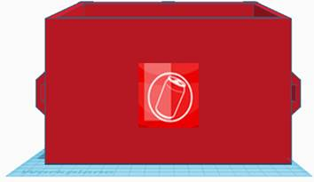

<html xmlns:v="urn:schemas-microsoft-com:vml"
xmlns:o="urn:schemas-microsoft-com:office:office"
xmlns:w="urn:schemas-microsoft-com:office:word"
xmlns:m="http://schemas.microsoft.com/office/2004/12/omml"
xmlns="http://www.w3.org/TR/REC-html40">

<head>
<meta http-equiv=Content-Type content="text/html; charset=utf-8">
<meta name=ProgId content=Word.Document>
<meta name=Generator content="Microsoft Word 15">
<meta name=Originator content="Microsoft Word 15">
<link rel=File-List href="SmartThrashCollector_file/filelist.xml">
<link rel=Edit-Time-Data href="SmartThrashCollector_file/editdata.mso">
<!--[if !mso]>

<![endif]--><!--[if gte mso 9]><xml>
 <o:DocumentProperties>
  <o:Author>PC08</o:Author>
  <o:LastAuthor>Georgiod Zachariadis</o:LastAuthor>
  <o:Revision>2</o:Revision>
  <o:TotalTime>226</o:TotalTime>
  <o:Created>2022-06-12T18:46:00Z</o:Created>
  <o:LastSaved>2022-06-12T18:46:00Z</o:LastSaved>
  <o:Pages>15</o:Pages>
  <o:Words>1191</o:Words>
  <o:Characters>6791</o:Characters>
  <o:Lines>56</o:Lines>
  <o:Paragraphs>15</o:Paragraphs>
  <o:CharactersWithSpaces>7967</o:CharactersWithSpaces>
  <o:Version>16.00</o:Version>
 </o:DocumentProperties>
</xml><![endif]-->
<link rel=dataStoreItem href="SmartThrashCollector_file/item0001.xml"
target="SmartThrashCollector_file/props002.xml">
<link rel=themeData href="SmartThrashCollector_file/themedata.thmx">
<link rel=colorSchemeMapping
href="SmartThrashCollector_file/colorschememapping.xml">
<!--[if gte mso 9]><xml>
 <w:WordDocument>
  <w:SpellingState>Clean</w:SpellingState>
  <w:GrammarState>Clean</w:GrammarState>
  <w:TrackMoves>false</w:TrackMoves>
  <w:TrackFormatting/>
  <w:HyphenationZone>14</w:HyphenationZone>
  <w:PunctuationKerning/>
  <w:ValidateAgainstSchemas/>
  <w:SaveIfXMLInvalid>false</w:SaveIfXMLInvalid>
  <w:IgnoreMixedContent>false</w:IgnoreMixedContent>
  <w:AlwaysShowPlaceholderText>false</w:AlwaysShowPlaceholderText>
  <w:DoNotPromoteQF/>
  <w:LidThemeOther>EN-US</w:LidThemeOther>
  <w:LidThemeAsian>ZH-CN</w:LidThemeAsian>
  <w:LidThemeComplexScript>X-NONE</w:LidThemeComplexScript>
  <w:Compatibility>
   <w:BreakWrappedTables/>
   <w:SnapToGridInCell/>
   <w:WrapTextWithPunct/>
   <w:UseAsianBreakRules/>
   <w:DontGrowAutofit/>
   <w:SplitPgBreakAndParaMark/>
   <w:EnableOpenTypeKerning/>
   <w:DontFlipMirrorIndents/>
   <w:OverrideTableStyleHps/>
  </w:Compatibility>
  <m:mathPr>
   <m:mathFont m:val="Cambria Math"/>
   <m:brkBin m:val="before"/>
   <m:brkBinSub m:val="&#45;-"/>
   <m:smallFrac m:val="off"/>
   <m:dispDef/>
   <m:lMargin m:val="0"/>
   <m:rMargin m:val="0"/>
   <m:defJc m:val="centerGroup"/>
   <m:wrapIndent m:val="1440"/>
   <m:intLim m:val="subSup"/>
   <m:naryLim m:val="undOvr"/>
  </m:mathPr></w:WordDocument>
</xml><![endif]--><!--[if gte mso 9]><xml>
 <w:LatentStyles DefLockedState="false" DefUnhideWhenUsed="false"
  DefSemiHidden="false" DefQFormat="false" DefPriority="99"
  LatentStyleCount="375">
  <w:LsdException Locked="false" Priority="0" QFormat="true" Name="Normal"/>
  <w:LsdException Locked="false" Priority="9" QFormat="true" Name="heading 1"/>
  <w:LsdException Locked="false" Priority="9" SemiHidden="true"
   UnhideWhenUsed="true" QFormat="true" Name="heading 2"/>
  <w:LsdException Locked="false" Priority="9" SemiHidden="true"
   UnhideWhenUsed="true" QFormat="true" Name="heading 3"/>
  <w:LsdException Locked="false" Priority="9" SemiHidden="true"
   UnhideWhenUsed="true" QFormat="true" Name="heading 4"/>
  <w:LsdException Locked="false" Priority="9" SemiHidden="true"
   UnhideWhenUsed="true" QFormat="true" Name="heading 5"/>
  <w:LsdException Locked="false" Priority="9" SemiHidden="true"
   UnhideWhenUsed="true" QFormat="true" Name="heading 6"/>
  <w:LsdException Locked="false" Priority="9" SemiHidden="true"
   UnhideWhenUsed="true" QFormat="true" Name="heading 7"/>
  <w:LsdException Locked="false" Priority="9" SemiHidden="true"
   UnhideWhenUsed="true" QFormat="true" Name="heading 8"/>
  <w:LsdException Locked="false" Priority="9" SemiHidden="true"
   UnhideWhenUsed="true" QFormat="true" Name="heading 9"/>
  <w:LsdException Locked="false" SemiHidden="true" UnhideWhenUsed="true"
   Name="index 1"/>
  <w:LsdException Locked="false" SemiHidden="true" UnhideWhenUsed="true"
   Name="index 2"/>
  <w:LsdException Locked="false" SemiHidden="true" UnhideWhenUsed="true"
   Name="index 3"/>
  <w:LsdException Locked="false" SemiHidden="true" UnhideWhenUsed="true"
   Name="index 4"/>
  <w:LsdException Locked="false" SemiHidden="true" UnhideWhenUsed="true"
   Name="index 5"/>
  <w:LsdException Locked="false" SemiHidden="true" UnhideWhenUsed="true"
   Name="index 6"/>
  <w:LsdException Locked="false" SemiHidden="true" UnhideWhenUsed="true"
   Name="index 7"/>
  <w:LsdException Locked="false" SemiHidden="true" UnhideWhenUsed="true"
   Name="index 8"/>
  <w:LsdException Locked="false" SemiHidden="true" UnhideWhenUsed="true"
   Name="index 9"/>
  <w:LsdException Locked="false" Priority="39" SemiHidden="true"
   UnhideWhenUsed="true" Name="toc 1"/>
  <w:LsdException Locked="false" Priority="39" SemiHidden="true"
   UnhideWhenUsed="true" Name="toc 2"/>
  <w:LsdException Locked="false" Priority="39" SemiHidden="true"
   UnhideWhenUsed="true" Name="toc 3"/>
  <w:LsdException Locked="false" Priority="39" SemiHidden="true"
   UnhideWhenUsed="true" Name="toc 4"/>
  <w:LsdException Locked="false" Priority="39" SemiHidden="true"
   UnhideWhenUsed="true" Name="toc 5"/>
  <w:LsdException Locked="false" Priority="39" SemiHidden="true"
   UnhideWhenUsed="true" Name="toc 6"/>
  <w:LsdException Locked="false" Priority="39" SemiHidden="true"
   UnhideWhenUsed="true" Name="toc 7"/>
  <w:LsdException Locked="false" Priority="39" SemiHidden="true"
   UnhideWhenUsed="true" Name="toc 8"/>
  <w:LsdException Locked="false" Priority="39" SemiHidden="true"
   UnhideWhenUsed="true" Name="toc 9"/>
  <w:LsdException Locked="false" SemiHidden="true" UnhideWhenUsed="true"
   Name="Normal Indent"/>
  <w:LsdException Locked="false" SemiHidden="true" UnhideWhenUsed="true"
   Name="footnote text"/>
  <w:LsdException Locked="false" SemiHidden="true" UnhideWhenUsed="true"
   Name="annotation text"/>
  <w:LsdException Locked="false" SemiHidden="true" UnhideWhenUsed="true"
   Name="header"/>
  <w:LsdException Locked="false" SemiHidden="true" UnhideWhenUsed="true"
   Name="footer"/>
  <w:LsdException Locked="false" SemiHidden="true" UnhideWhenUsed="true"
   Name="index heading"/>
  <w:LsdException Locked="false" Priority="35" SemiHidden="true"
   UnhideWhenUsed="true" QFormat="true" Name="caption"/>
  <w:LsdException Locked="false" SemiHidden="true" UnhideWhenUsed="true"
   Name="table of figures"/>
  <w:LsdException Locked="false" SemiHidden="true" UnhideWhenUsed="true"
   Name="envelope address"/>
  <w:LsdException Locked="false" SemiHidden="true" UnhideWhenUsed="true"
   Name="envelope return"/>
  <w:LsdException Locked="false" SemiHidden="true" UnhideWhenUsed="true"
   Name="footnote reference"/>
  <w:LsdException Locked="false" SemiHidden="true" UnhideWhenUsed="true"
   Name="annotation reference"/>
  <w:LsdException Locked="false" SemiHidden="true" UnhideWhenUsed="true"
   Name="line number"/>
  <w:LsdException Locked="false" SemiHidden="true" UnhideWhenUsed="true"
   Name="page number"/>
  <w:LsdException Locked="false" SemiHidden="true" UnhideWhenUsed="true"
   Name="endnote reference"/>
  <w:LsdException Locked="false" SemiHidden="true" UnhideWhenUsed="true"
   Name="endnote text"/>
  <w:LsdException Locked="false" SemiHidden="true" UnhideWhenUsed="true"
   Name="table of authorities"/>
  <w:LsdException Locked="false" SemiHidden="true" UnhideWhenUsed="true"
   Name="macro"/>
  <w:LsdException Locked="false" SemiHidden="true" UnhideWhenUsed="true"
   Name="toa heading"/>
  <w:LsdException Locked="false" SemiHidden="true" UnhideWhenUsed="true"
   Name="List"/>
  <w:LsdException Locked="false" SemiHidden="true" UnhideWhenUsed="true"
   Name="List Bullet"/>
  <w:LsdException Locked="false" SemiHidden="true" UnhideWhenUsed="true"
   Name="List Number"/>
  <w:LsdException Locked="false" SemiHidden="true" UnhideWhenUsed="true"
   Name="List 2"/>
  <w:LsdException Locked="false" SemiHidden="true" UnhideWhenUsed="true"
   Name="List 3"/>
  <w:LsdException Locked="false" SemiHidden="true" UnhideWhenUsed="true"
   Name="List 4"/>
  <w:LsdException Locked="false" SemiHidden="true" UnhideWhenUsed="true"
   Name="List 5"/>
  <w:LsdException Locked="false" SemiHidden="true" UnhideWhenUsed="true"
   Name="List Bullet 2"/>
  <w:LsdException Locked="false" SemiHidden="true" UnhideWhenUsed="true"
   Name="List Bullet 3"/>
  <w:LsdException Locked="false" SemiHidden="true" UnhideWhenUsed="true"
   Name="List Bullet 4"/>
  <w:LsdException Locked="false" SemiHidden="true" UnhideWhenUsed="true"
   Name="List Bullet 5"/>
  <w:LsdException Locked="false" SemiHidden="true" UnhideWhenUsed="true"
   Name="List Number 2"/>
  <w:LsdException Locked="false" SemiHidden="true" UnhideWhenUsed="true"
   Name="List Number 3"/>
  <w:LsdException Locked="false" SemiHidden="true" UnhideWhenUsed="true"
   Name="List Number 4"/>
  <w:LsdException Locked="false" SemiHidden="true" UnhideWhenUsed="true"
   Name="List Number 5"/>
  <w:LsdException Locked="false" Priority="10" QFormat="true" Name="Title"/>
  <w:LsdException Locked="false" SemiHidden="true" UnhideWhenUsed="true"
   Name="Closing"/>
  <w:LsdException Locked="false" SemiHidden="true" UnhideWhenUsed="true"
   Name="Signature"/>
  <w:LsdException Locked="false" Priority="1" SemiHidden="true"
   UnhideWhenUsed="true" Name="Default Paragraph Font"/>
  <w:LsdException Locked="false" SemiHidden="true" UnhideWhenUsed="true"
   Name="Body Text"/>
  <w:LsdException Locked="false" SemiHidden="true" UnhideWhenUsed="true"
   Name="Body Text Indent"/>
  <w:LsdException Locked="false" SemiHidden="true" UnhideWhenUsed="true"
   Name="List Continue"/>
  <w:LsdException Locked="false" SemiHidden="true" UnhideWhenUsed="true"
   Name="List Continue 2"/>
  <w:LsdException Locked="false" SemiHidden="true" UnhideWhenUsed="true"
   Name="List Continue 3"/>
  <w:LsdException Locked="false" SemiHidden="true" UnhideWhenUsed="true"
   Name="List Continue 4"/>
  <w:LsdException Locked="false" SemiHidden="true" UnhideWhenUsed="true"
   Name="List Continue 5"/>
  <w:LsdException Locked="false" SemiHidden="true" UnhideWhenUsed="true"
   Name="Message Header"/>
  <w:LsdException Locked="false" Priority="11" QFormat="true" Name="Subtitle"/>
  <w:LsdException Locked="false" SemiHidden="true" UnhideWhenUsed="true"
   Name="Salutation"/>
  <w:LsdException Locked="false" SemiHidden="true" UnhideWhenUsed="true"
   Name="Date"/>
  <w:LsdException Locked="false" SemiHidden="true" UnhideWhenUsed="true"
   Name="Body Text First Indent"/>
  <w:LsdException Locked="false" SemiHidden="true" UnhideWhenUsed="true"
   Name="Body Text First Indent 2"/>
  <w:LsdException Locked="false" SemiHidden="true" UnhideWhenUsed="true"
   Name="Note Heading"/>
  <w:LsdException Locked="false" SemiHidden="true" UnhideWhenUsed="true"
   Name="Body Text 2"/>
  <w:LsdException Locked="false" SemiHidden="true" UnhideWhenUsed="true"
   Name="Body Text 3"/>
  <w:LsdException Locked="false" SemiHidden="true" UnhideWhenUsed="true"
   Name="Body Text Indent 2"/>
  <w:LsdException Locked="false" SemiHidden="true" UnhideWhenUsed="true"
   Name="Body Text Indent 3"/>
  <w:LsdException Locked="false" SemiHidden="true" UnhideWhenUsed="true"
   Name="Block Text"/>
  <w:LsdException Locked="false" SemiHidden="true" UnhideWhenUsed="true"
   Name="Hyperlink"/>
  <w:LsdException Locked="false" SemiHidden="true" UnhideWhenUsed="true"
   Name="FollowedHyperlink"/>
  <w:LsdException Locked="false" Priority="22" QFormat="true" Name="Strong"/>
  <w:LsdException Locked="false" Priority="20" QFormat="true" Name="Emphasis"/>
  <w:LsdException Locked="false" SemiHidden="true" UnhideWhenUsed="true"
   Name="Document Map"/>
  <w:LsdException Locked="false" SemiHidden="true" UnhideWhenUsed="true"
   Name="Plain Text"/>
  <w:LsdException Locked="false" SemiHidden="true" UnhideWhenUsed="true"
   Name="E-mail Signature"/>
  <w:LsdException Locked="false" SemiHidden="true" UnhideWhenUsed="true"
   Name="HTML Top of Form"/>
  <w:LsdException Locked="false" SemiHidden="true" UnhideWhenUsed="true"
   Name="HTML Bottom of Form"/>
  <w:LsdException Locked="false" SemiHidden="true" UnhideWhenUsed="true"
   Name="Normal (Web)"/>
  <w:LsdException Locked="false" SemiHidden="true" UnhideWhenUsed="true"
   Name="HTML Acronym"/>
  <w:LsdException Locked="false" SemiHidden="true" UnhideWhenUsed="true"
   Name="HTML Address"/>
  <w:LsdException Locked="false" SemiHidden="true" UnhideWhenUsed="true"
   Name="HTML Cite"/>
  <w:LsdException Locked="false" SemiHidden="true" UnhideWhenUsed="true"
   Name="HTML Code"/>
  <w:LsdException Locked="false" SemiHidden="true" UnhideWhenUsed="true"
   Name="HTML Definition"/>
  <w:LsdException Locked="false" SemiHidden="true" UnhideWhenUsed="true"
   Name="HTML Keyboard"/>
  <w:LsdException Locked="false" SemiHidden="true" UnhideWhenUsed="true"
   Name="HTML Preformatted"/>
  <w:LsdException Locked="false" SemiHidden="true" UnhideWhenUsed="true"
   Name="HTML Sample"/>
  <w:LsdException Locked="false" SemiHidden="true" UnhideWhenUsed="true"
   Name="HTML Typewriter"/>
  <w:LsdException Locked="false" SemiHidden="true" UnhideWhenUsed="true"
   Name="HTML Variable"/>
  <w:LsdException Locked="false" SemiHidden="true" UnhideWhenUsed="true"
   Name="Normal Table"/>
  <w:LsdException Locked="false" SemiHidden="true" UnhideWhenUsed="true"
   Name="annotation subject"/>
  <w:LsdException Locked="false" SemiHidden="true" UnhideWhenUsed="true"
   Name="No List"/>
  <w:LsdException Locked="false" SemiHidden="true" UnhideWhenUsed="true"
   Name="Outline List 1"/>
  <w:LsdException Locked="false" SemiHidden="true" UnhideWhenUsed="true"
   Name="Outline List 2"/>
  <w:LsdException Locked="false" SemiHidden="true" UnhideWhenUsed="true"
   Name="Outline List 3"/>
  <w:LsdException Locked="false" SemiHidden="true" UnhideWhenUsed="true"
   Name="Table Simple 1"/>
  <w:LsdException Locked="false" SemiHidden="true" UnhideWhenUsed="true"
   Name="Table Simple 2"/>
  <w:LsdException Locked="false" SemiHidden="true" UnhideWhenUsed="true"
   Name="Table Simple 3"/>
  <w:LsdException Locked="false" SemiHidden="true" UnhideWhenUsed="true"
   Name="Table Classic 1"/>
  <w:LsdException Locked="false" SemiHidden="true" UnhideWhenUsed="true"
   Name="Table Classic 2"/>
  <w:LsdException Locked="false" SemiHidden="true" UnhideWhenUsed="true"
   Name="Table Classic 3"/>
  <w:LsdException Locked="false" SemiHidden="true" UnhideWhenUsed="true"
   Name="Table Classic 4"/>
  <w:LsdException Locked="false" SemiHidden="true" UnhideWhenUsed="true"
   Name="Table Colorful 1"/>
  <w:LsdException Locked="false" SemiHidden="true" UnhideWhenUsed="true"
   Name="Table Colorful 2"/>
  <w:LsdException Locked="false" SemiHidden="true" UnhideWhenUsed="true"
   Name="Table Colorful 3"/>
  <w:LsdException Locked="false" SemiHidden="true" UnhideWhenUsed="true"
   Name="Table Columns 1"/>
  <w:LsdException Locked="false" SemiHidden="true" UnhideWhenUsed="true"
   Name="Table Columns 2"/>
  <w:LsdException Locked="false" SemiHidden="true" UnhideWhenUsed="true"
   Name="Table Columns 3"/>
  <w:LsdException Locked="false" SemiHidden="true" UnhideWhenUsed="true"
   Name="Table Columns 4"/>
  <w:LsdException Locked="false" SemiHidden="true" UnhideWhenUsed="true"
   Name="Table Columns 5"/>
  <w:LsdException Locked="false" SemiHidden="true" UnhideWhenUsed="true"
   Name="Table Grid 1"/>
  <w:LsdException Locked="false" SemiHidden="true" UnhideWhenUsed="true"
   Name="Table Grid 2"/>
  <w:LsdException Locked="false" SemiHidden="true" UnhideWhenUsed="true"
   Name="Table Grid 3"/>
  <w:LsdException Locked="false" SemiHidden="true" UnhideWhenUsed="true"
   Name="Table Grid 4"/>
  <w:LsdException Locked="false" SemiHidden="true" UnhideWhenUsed="true"
   Name="Table Grid 5"/>
  <w:LsdException Locked="false" SemiHidden="true" UnhideWhenUsed="true"
   Name="Table Grid 6"/>
  <w:LsdException Locked="false" SemiHidden="true" UnhideWhenUsed="true"
   Name="Table Grid 7"/>
  <w:LsdException Locked="false" SemiHidden="true" UnhideWhenUsed="true"
   Name="Table Grid 8"/>
  <w:LsdException Locked="false" SemiHidden="true" UnhideWhenUsed="true"
   Name="Table List 1"/>
  <w:LsdException Locked="false" SemiHidden="true" UnhideWhenUsed="true"
   Name="Table List 2"/>
  <w:LsdException Locked="false" SemiHidden="true" UnhideWhenUsed="true"
   Name="Table List 3"/>
  <w:LsdException Locked="false" SemiHidden="true" UnhideWhenUsed="true"
   Name="Table List 4"/>
  <w:LsdException Locked="false" SemiHidden="true" UnhideWhenUsed="true"
   Name="Table List 5"/>
  <w:LsdException Locked="false" SemiHidden="true" UnhideWhenUsed="true"
   Name="Table List 6"/>
  <w:LsdException Locked="false" SemiHidden="true" UnhideWhenUsed="true"
   Name="Table List 7"/>
  <w:LsdException Locked="false" SemiHidden="true" UnhideWhenUsed="true"
   Name="Table List 8"/>
  <w:LsdException Locked="false" SemiHidden="true" UnhideWhenUsed="true"
   Name="Table 3D effects 1"/>
  <w:LsdException Locked="false" SemiHidden="true" UnhideWhenUsed="true"
   Name="Table 3D effects 2"/>
  <w:LsdException Locked="false" SemiHidden="true" UnhideWhenUsed="true"
   Name="Table 3D effects 3"/>
  <w:LsdException Locked="false" SemiHidden="true" UnhideWhenUsed="true"
   Name="Table Contemporary"/>
  <w:LsdException Locked="false" SemiHidden="true" UnhideWhenUsed="true"
   Name="Table Elegant"/>
  <w:LsdException Locked="false" SemiHidden="true" UnhideWhenUsed="true"
   Name="Table Professional"/>
  <w:LsdException Locked="false" SemiHidden="true" UnhideWhenUsed="true"
   Name="Table Subtle 1"/>
  <w:LsdException Locked="false" SemiHidden="true" UnhideWhenUsed="true"
   Name="Table Subtle 2"/>
  <w:LsdException Locked="false" SemiHidden="true" UnhideWhenUsed="true"
   Name="Table Web 1"/>
  <w:LsdException Locked="false" SemiHidden="true" UnhideWhenUsed="true"
   Name="Table Web 2"/>
  <w:LsdException Locked="false" SemiHidden="true" UnhideWhenUsed="true"
   Name="Table Web 3"/>
  <w:LsdException Locked="false" SemiHidden="true" UnhideWhenUsed="true"
   Name="Balloon Text"/>
  <w:LsdException Locked="false" Priority="59" SemiHidden="true"
   UnhideWhenUsed="true" Name="Table Grid"/>
  <w:LsdException Locked="false" SemiHidden="true" UnhideWhenUsed="true"
   Name="Table Theme"/>
  <w:LsdException Locked="false" SemiHidden="true" Name="Placeholder Text"/>
  <w:LsdException Locked="false" Priority="1" QFormat="true" Name="No Spacing"/>
  <w:LsdException Locked="false" Priority="60" Name="Light Shading"/>
  <w:LsdException Locked="false" Priority="61" Name="Light List"/>
  <w:LsdException Locked="false" Priority="62" Name="Light Grid"/>
  <w:LsdException Locked="false" Priority="63" Name="Medium Shading 1"/>
  <w:LsdException Locked="false" Priority="64" Name="Medium Shading 2"/>
  <w:LsdException Locked="false" Priority="65" Name="Medium List 1"/>
  <w:LsdException Locked="false" Priority="66" Name="Medium List 2"/>
  <w:LsdException Locked="false" Priority="67" Name="Medium Grid 1"/>
  <w:LsdException Locked="false" Priority="68" Name="Medium Grid 2"/>
  <w:LsdException Locked="false" Priority="69" Name="Medium Grid 3"/>
  <w:LsdException Locked="false" Priority="70" Name="Dark List"/>
  <w:LsdException Locked="false" Priority="71" Name="Colorful Shading"/>
  <w:LsdException Locked="false" Priority="72" Name="Colorful List"/>
  <w:LsdException Locked="false" Priority="73" Name="Colorful Grid"/>
  <w:LsdException Locked="false" Priority="60" Name="Light Shading Accent 1"/>
  <w:LsdException Locked="false" Priority="61" Name="Light List Accent 1"/>
  <w:LsdException Locked="false" Priority="62" Name="Light Grid Accent 1"/>
  <w:LsdException Locked="false" Priority="63" Name="Medium Shading 1 Accent 1"/>
  <w:LsdException Locked="false" Priority="64" Name="Medium Shading 2 Accent 1"/>
  <w:LsdException Locked="false" Priority="65" Name="Medium List 1 Accent 1"/>
  <w:LsdException Locked="false" SemiHidden="true" Name="Revision"/>
  <w:LsdException Locked="false" Priority="34" QFormat="true"
   Name="List Paragraph"/>
  <w:LsdException Locked="false" Priority="29" QFormat="true" Name="Quote"/>
  <w:LsdException Locked="false" Priority="30" QFormat="true"
   Name="Intense Quote"/>
  <w:LsdException Locked="false" Priority="66" Name="Medium List 2 Accent 1"/>
  <w:LsdException Locked="false" Priority="67" Name="Medium Grid 1 Accent 1"/>
  <w:LsdException Locked="false" Priority="68" Name="Medium Grid 2 Accent 1"/>
  <w:LsdException Locked="false" Priority="69" Name="Medium Grid 3 Accent 1"/>
  <w:LsdException Locked="false" Priority="70" Name="Dark List Accent 1"/>
  <w:LsdException Locked="false" Priority="71" Name="Colorful Shading Accent 1"/>
  <w:LsdException Locked="false" Priority="72" Name="Colorful List Accent 1"/>
  <w:LsdException Locked="false" Priority="73" Name="Colorful Grid Accent 1"/>
  <w:LsdException Locked="false" Priority="60" Name="Light Shading Accent 2"/>
  <w:LsdException Locked="false" Priority="61" Name="Light List Accent 2"/>
  <w:LsdException Locked="false" Priority="62" Name="Light Grid Accent 2"/>
  <w:LsdException Locked="false" Priority="63" Name="Medium Shading 1 Accent 2"/>
  <w:LsdException Locked="false" Priority="64" Name="Medium Shading 2 Accent 2"/>
  <w:LsdException Locked="false" Priority="65" Name="Medium List 1 Accent 2"/>
  <w:LsdException Locked="false" Priority="66" Name="Medium List 2 Accent 2"/>
  <w:LsdException Locked="false" Priority="67" Name="Medium Grid 1 Accent 2"/>
  <w:LsdException Locked="false" Priority="68" Name="Medium Grid 2 Accent 2"/>
  <w:LsdException Locked="false" Priority="69" Name="Medium Grid 3 Accent 2"/>
  <w:LsdException Locked="false" Priority="70" Name="Dark List Accent 2"/>
  <w:LsdException Locked="false" Priority="71" Name="Colorful Shading Accent 2"/>
  <w:LsdException Locked="false" Priority="72" Name="Colorful List Accent 2"/>
  <w:LsdException Locked="false" Priority="73" Name="Colorful Grid Accent 2"/>
  <w:LsdException Locked="false" Priority="60" Name="Light Shading Accent 3"/>
  <w:LsdException Locked="false" Priority="61" Name="Light List Accent 3"/>
  <w:LsdException Locked="false" Priority="62" Name="Light Grid Accent 3"/>
  <w:LsdException Locked="false" Priority="63" Name="Medium Shading 1 Accent 3"/>
  <w:LsdException Locked="false" Priority="64" Name="Medium Shading 2 Accent 3"/>
  <w:LsdException Locked="false" Priority="65" Name="Medium List 1 Accent 3"/>
  <w:LsdException Locked="false" Priority="66" Name="Medium List 2 Accent 3"/>
  <w:LsdException Locked="false" Priority="67" Name="Medium Grid 1 Accent 3"/>
  <w:LsdException Locked="false" Priority="68" Name="Medium Grid 2 Accent 3"/>
  <w:LsdException Locked="false" Priority="69" Name="Medium Grid 3 Accent 3"/>
  <w:LsdException Locked="false" Priority="70" Name="Dark List Accent 3"/>
  <w:LsdException Locked="false" Priority="71" Name="Colorful Shading Accent 3"/>
  <w:LsdException Locked="false" Priority="72" Name="Colorful List Accent 3"/>
  <w:LsdException Locked="false" Priority="73" Name="Colorful Grid Accent 3"/>
  <w:LsdException Locked="false" Priority="60" Name="Light Shading Accent 4"/>
  <w:LsdException Locked="false" Priority="61" Name="Light List Accent 4"/>
  <w:LsdException Locked="false" Priority="62" Name="Light Grid Accent 4"/>
  <w:LsdException Locked="false" Priority="63" Name="Medium Shading 1 Accent 4"/>
  <w:LsdException Locked="false" Priority="64" Name="Medium Shading 2 Accent 4"/>
  <w:LsdException Locked="false" Priority="65" Name="Medium List 1 Accent 4"/>
  <w:LsdException Locked="false" Priority="66" Name="Medium List 2 Accent 4"/>
  <w:LsdException Locked="false" Priority="67" Name="Medium Grid 1 Accent 4"/>
  <w:LsdException Locked="false" Priority="68" Name="Medium Grid 2 Accent 4"/>
  <w:LsdException Locked="false" Priority="69" Name="Medium Grid 3 Accent 4"/>
  <w:LsdException Locked="false" Priority="70" Name="Dark List Accent 4"/>
  <w:LsdException Locked="false" Priority="71" Name="Colorful Shading Accent 4"/>
  <w:LsdException Locked="false" Priority="72" Name="Colorful List Accent 4"/>
  <w:LsdException Locked="false" Priority="73" Name="Colorful Grid Accent 4"/>
  <w:LsdException Locked="false" Priority="60" Name="Light Shading Accent 5"/>
  <w:LsdException Locked="false" Priority="61" Name="Light List Accent 5"/>
  <w:LsdException Locked="false" Priority="62" Name="Light Grid Accent 5"/>
  <w:LsdException Locked="false" Priority="63" Name="Medium Shading 1 Accent 5"/>
  <w:LsdException Locked="false" Priority="64" Name="Medium Shading 2 Accent 5"/>
  <w:LsdException Locked="false" Priority="65" Name="Medium List 1 Accent 5"/>
  <w:LsdException Locked="false" Priority="66" Name="Medium List 2 Accent 5"/>
  <w:LsdException Locked="false" Priority="67" Name="Medium Grid 1 Accent 5"/>
  <w:LsdException Locked="false" Priority="68" Name="Medium Grid 2 Accent 5"/>
  <w:LsdException Locked="false" Priority="69" Name="Medium Grid 3 Accent 5"/>
  <w:LsdException Locked="false" Priority="70" Name="Dark List Accent 5"/>
  <w:LsdException Locked="false" Priority="71" Name="Colorful Shading Accent 5"/>
  <w:LsdException Locked="false" Priority="72" Name="Colorful List Accent 5"/>
  <w:LsdException Locked="false" Priority="73" Name="Colorful Grid Accent 5"/>
  <w:LsdException Locked="false" Priority="60" Name="Light Shading Accent 6"/>
  <w:LsdException Locked="false" Priority="61" Name="Light List Accent 6"/>
  <w:LsdException Locked="false" Priority="62" Name="Light Grid Accent 6"/>
  <w:LsdException Locked="false" Priority="63" Name="Medium Shading 1 Accent 6"/>
  <w:LsdException Locked="false" Priority="64" Name="Medium Shading 2 Accent 6"/>
  <w:LsdException Locked="false" Priority="65" Name="Medium List 1 Accent 6"/>
  <w:LsdException Locked="false" Priority="66" Name="Medium List 2 Accent 6"/>
  <w:LsdException Locked="false" Priority="67" Name="Medium Grid 1 Accent 6"/>
  <w:LsdException Locked="false" Priority="68" Name="Medium Grid 2 Accent 6"/>
  <w:LsdException Locked="false" Priority="69" Name="Medium Grid 3 Accent 6"/>
  <w:LsdException Locked="false" Priority="70" Name="Dark List Accent 6"/>
  <w:LsdException Locked="false" Priority="71" Name="Colorful Shading Accent 6"/>
  <w:LsdException Locked="false" Priority="72" Name="Colorful List Accent 6"/>
  <w:LsdException Locked="false" Priority="73" Name="Colorful Grid Accent 6"/>
  <w:LsdException Locked="false" Priority="19" QFormat="true"
   Name="Subtle Emphasis"/>
  <w:LsdException Locked="false" Priority="21" QFormat="true"
   Name="Intense Emphasis"/>
  <w:LsdException Locked="false" Priority="31" QFormat="true"
   Name="Subtle Reference"/>
  <w:LsdException Locked="false" Priority="32" QFormat="true"
   Name="Intense Reference"/>
  <w:LsdException Locked="false" Priority="33" QFormat="true" Name="Book Title"/>
  <w:LsdException Locked="false" Priority="37" SemiHidden="true"
   UnhideWhenUsed="true" Name="Bibliography"/>
  <w:LsdException Locked="false" Priority="39" SemiHidden="true"
   UnhideWhenUsed="true" QFormat="true" Name="TOC Heading"/>
  <w:LsdException Locked="false" Priority="41" Name="Plain Table 1"/>
  <w:LsdException Locked="false" Priority="42" Name="Plain Table 2"/>
  <w:LsdException Locked="false" Priority="43" Name="Plain Table 3"/>
  <w:LsdException Locked="false" Priority="44" Name="Plain Table 4"/>
  <w:LsdException Locked="false" Priority="45" Name="Plain Table 5"/>
  <w:LsdException Locked="false" Priority="40" Name="Grid Table Light"/>
  <w:LsdException Locked="false" Priority="46" Name="Grid Table 1 Light"/>
  <w:LsdException Locked="false" Priority="47" Name="Grid Table 2"/>
  <w:LsdException Locked="false" Priority="48" Name="Grid Table 3"/>
  <w:LsdException Locked="false" Priority="49" Name="Grid Table 4"/>
  <w:LsdException Locked="false" Priority="50" Name="Grid Table 5 Dark"/>
  <w:LsdException Locked="false" Priority="51" Name="Grid Table 6 Colorful"/>
  <w:LsdException Locked="false" Priority="52" Name="Grid Table 7 Colorful"/>
  <w:LsdException Locked="false" Priority="46"
   Name="Grid Table 1 Light Accent 1"/>
  <w:LsdException Locked="false" Priority="47" Name="Grid Table 2 Accent 1"/>
  <w:LsdException Locked="false" Priority="48" Name="Grid Table 3 Accent 1"/>
  <w:LsdException Locked="false" Priority="49" Name="Grid Table 4 Accent 1"/>
  <w:LsdException Locked="false" Priority="50" Name="Grid Table 5 Dark Accent 1"/>
  <w:LsdException Locked="false" Priority="51"
   Name="Grid Table 6 Colorful Accent 1"/>
  <w:LsdException Locked="false" Priority="52"
   Name="Grid Table 7 Colorful Accent 1"/>
  <w:LsdException Locked="false" Priority="46"
   Name="Grid Table 1 Light Accent 2"/>
  <w:LsdException Locked="false" Priority="47" Name="Grid Table 2 Accent 2"/>
  <w:LsdException Locked="false" Priority="48" Name="Grid Table 3 Accent 2"/>
  <w:LsdException Locked="false" Priority="49" Name="Grid Table 4 Accent 2"/>
  <w:LsdException Locked="false" Priority="50" Name="Grid Table 5 Dark Accent 2"/>
  <w:LsdException Locked="false" Priority="51"
   Name="Grid Table 6 Colorful Accent 2"/>
  <w:LsdException Locked="false" Priority="52"
   Name="Grid Table 7 Colorful Accent 2"/>
  <w:LsdException Locked="false" Priority="46"
   Name="Grid Table 1 Light Accent 3"/>
  <w:LsdException Locked="false" Priority="47" Name="Grid Table 2 Accent 3"/>
  <w:LsdException Locked="false" Priority="48" Name="Grid Table 3 Accent 3"/>
  <w:LsdException Locked="false" Priority="49" Name="Grid Table 4 Accent 3"/>
  <w:LsdException Locked="false" Priority="50" Name="Grid Table 5 Dark Accent 3"/>
  <w:LsdException Locked="false" Priority="51"
   Name="Grid Table 6 Colorful Accent 3"/>
  <w:LsdException Locked="false" Priority="52"
   Name="Grid Table 7 Colorful Accent 3"/>
  <w:LsdException Locked="false" Priority="46"
   Name="Grid Table 1 Light Accent 4"/>
  <w:LsdException Locked="false" Priority="47" Name="Grid Table 2 Accent 4"/>
  <w:LsdException Locked="false" Priority="48" Name="Grid Table 3 Accent 4"/>
  <w:LsdException Locked="false" Priority="49" Name="Grid Table 4 Accent 4"/>
  <w:LsdException Locked="false" Priority="50" Name="Grid Table 5 Dark Accent 4"/>
  <w:LsdException Locked="false" Priority="51"
   Name="Grid Table 6 Colorful Accent 4"/>
  <w:LsdException Locked="false" Priority="52"
   Name="Grid Table 7 Colorful Accent 4"/>
  <w:LsdException Locked="false" Priority="46"
   Name="Grid Table 1 Light Accent 5"/>
  <w:LsdException Locked="false" Priority="47" Name="Grid Table 2 Accent 5"/>
  <w:LsdException Locked="false" Priority="48" Name="Grid Table 3 Accent 5"/>
  <w:LsdException Locked="false" Priority="49" Name="Grid Table 4 Accent 5"/>
  <w:LsdException Locked="false" Priority="50" Name="Grid Table 5 Dark Accent 5"/>
  <w:LsdException Locked="false" Priority="51"
   Name="Grid Table 6 Colorful Accent 5"/>
  <w:LsdException Locked="false" Priority="52"
   Name="Grid Table 7 Colorful Accent 5"/>
  <w:LsdException Locked="false" Priority="46"
   Name="Grid Table 1 Light Accent 6"/>
  <w:LsdException Locked="false" Priority="47" Name="Grid Table 2 Accent 6"/>
  <w:LsdException Locked="false" Priority="48" Name="Grid Table 3 Accent 6"/>
  <w:LsdException Locked="false" Priority="49" Name="Grid Table 4 Accent 6"/>
  <w:LsdException Locked="false" Priority="50" Name="Grid Table 5 Dark Accent 6"/>
  <w:LsdException Locked="false" Priority="51"
   Name="Grid Table 6 Colorful Accent 6"/>
  <w:LsdException Locked="false" Priority="52"
   Name="Grid Table 7 Colorful Accent 6"/>
  <w:LsdException Locked="false" Priority="46" Name="List Table 1 Light"/>
  <w:LsdException Locked="false" Priority="47" Name="List Table 2"/>
  <w:LsdException Locked="false" Priority="48" Name="List Table 3"/>
  <w:LsdException Locked="false" Priority="49" Name="List Table 4"/>
  <w:LsdException Locked="false" Priority="50" Name="List Table 5 Dark"/>
  <w:LsdException Locked="false" Priority="51" Name="List Table 6 Colorful"/>
  <w:LsdException Locked="false" Priority="52" Name="List Table 7 Colorful"/>
  <w:LsdException Locked="false" Priority="46"
   Name="List Table 1 Light Accent 1"/>
  <w:LsdException Locked="false" Priority="47" Name="List Table 2 Accent 1"/>
  <w:LsdException Locked="false" Priority="48" Name="List Table 3 Accent 1"/>
  <w:LsdException Locked="false" Priority="49" Name="List Table 4 Accent 1"/>
  <w:LsdException Locked="false" Priority="50" Name="List Table 5 Dark Accent 1"/>
  <w:LsdException Locked="false" Priority="51"
   Name="List Table 6 Colorful Accent 1"/>
  <w:LsdException Locked="false" Priority="52"
   Name="List Table 7 Colorful Accent 1"/>
  <w:LsdException Locked="false" Priority="46"
   Name="List Table 1 Light Accent 2"/>
  <w:LsdException Locked="false" Priority="47" Name="List Table 2 Accent 2"/>
  <w:LsdException Locked="false" Priority="48" Name="List Table 3 Accent 2"/>
  <w:LsdException Locked="false" Priority="49" Name="List Table 4 Accent 2"/>
  <w:LsdException Locked="false" Priority="50" Name="List Table 5 Dark Accent 2"/>
  <w:LsdException Locked="false" Priority="51"
   Name="List Table 6 Colorful Accent 2"/>
  <w:LsdException Locked="false" Priority="52"
   Name="List Table 7 Colorful Accent 2"/>
  <w:LsdException Locked="false" Priority="46"
   Name="List Table 1 Light Accent 3"/>
  <w:LsdException Locked="false" Priority="47" Name="List Table 2 Accent 3"/>
  <w:LsdException Locked="false" Priority="48" Name="List Table 3 Accent 3"/>
  <w:LsdException Locked="false" Priority="49" Name="List Table 4 Accent 3"/>
  <w:LsdException Locked="false" Priority="50" Name="List Table 5 Dark Accent 3"/>
  <w:LsdException Locked="false" Priority="51"
   Name="List Table 6 Colorful Accent 3"/>
  <w:LsdException Locked="false" Priority="52"
   Name="List Table 7 Colorful Accent 3"/>
  <w:LsdException Locked="false" Priority="46"
   Name="List Table 1 Light Accent 4"/>
  <w:LsdException Locked="false" Priority="47" Name="List Table 2 Accent 4"/>
  <w:LsdException Locked="false" Priority="48" Name="List Table 3 Accent 4"/>
  <w:LsdException Locked="false" Priority="49" Name="List Table 4 Accent 4"/>
  <w:LsdException Locked="false" Priority="50" Name="List Table 5 Dark Accent 4"/>
  <w:LsdException Locked="false" Priority="51"
   Name="List Table 6 Colorful Accent 4"/>
  <w:LsdException Locked="false" Priority="52"
   Name="List Table 7 Colorful Accent 4"/>
  <w:LsdException Locked="false" Priority="46"
   Name="List Table 1 Light Accent 5"/>
  <w:LsdException Locked="false" Priority="47" Name="List Table 2 Accent 5"/>
  <w:LsdException Locked="false" Priority="48" Name="List Table 3 Accent 5"/>
  <w:LsdException Locked="false" Priority="49" Name="List Table 4 Accent 5"/>
  <w:LsdException Locked="false" Priority="50" Name="List Table 5 Dark Accent 5"/>
  <w:LsdException Locked="false" Priority="51"
   Name="List Table 6 Colorful Accent 5"/>
  <w:LsdException Locked="false" Priority="52"
   Name="List Table 7 Colorful Accent 5"/>
  <w:LsdException Locked="false" Priority="46"
   Name="List Table 1 Light Accent 6"/>
  <w:LsdException Locked="false" Priority="47" Name="List Table 2 Accent 6"/>
  <w:LsdException Locked="false" Priority="48" Name="List Table 3 Accent 6"/>
  <w:LsdException Locked="false" Priority="49" Name="List Table 4 Accent 6"/>
  <w:LsdException Locked="false" Priority="50" Name="List Table 5 Dark Accent 6"/>
  <w:LsdException Locked="false" Priority="51"
   Name="List Table 6 Colorful Accent 6"/>
  <w:LsdException Locked="false" Priority="52"
   Name="List Table 7 Colorful Accent 6"/>
  <w:LsdException Locked="false" SemiHidden="true" UnhideWhenUsed="true"
   Name="Mention"/>
  <w:LsdException Locked="false" SemiHidden="true" UnhideWhenUsed="true"
   Name="Smart Hyperlink"/>
  <w:LsdException Locked="false" SemiHidden="true" UnhideWhenUsed="true"
   Name="Hashtag"/>
  <w:LsdException Locked="false" SemiHidden="true" UnhideWhenUsed="true"
   Name="Unresolved Mention"/>
 </w:LatentStyles>
</xml><![endif]-->
<style>
<!--
 /* Font Definitions */
 @font-face
	{font-family:Wingdings;
	panose-1:5 0 0 0 0 0 0 0 0 0;
	mso-font-charset:2;
	mso-generic-font-family:auto;
	mso-font-pitch:variable;
	mso-font-signature:0 268435456 0 0 -2147483648 0;}
@font-face
	{font-family:"Cambria Math";
	panose-1:2 4 5 3 5 4 6 3 2 4;
	mso-font-charset:0;
	mso-generic-font-family:roman;
	mso-font-pitch:variable;
	mso-font-signature:-536870145 1107305727 0 0 415 0;}
@font-face
	{font-family:Calibri;
	panose-1:2 15 5 2 2 2 4 3 2 4;
	mso-font-charset:0;
	mso-generic-font-family:swiss;
	mso-font-pitch:variable;
	mso-font-signature:-469750017 -1073732485 9 0 511 0;}
@font-face
	{font-family:"Calibri Light";
	panose-1:2 15 3 2 2 2 4 3 2 4;
	mso-font-charset:0;
	mso-generic-font-family:swiss;
	mso-font-pitch:variable;
	mso-font-signature:-469750017 -1073732485 9 0 511 0;}
@font-face
	{font-family:"Segoe UI";
	panose-1:2 11 5 2 4 2 4 2 2 3;
	mso-font-charset:0;
	mso-generic-font-family:swiss;
	mso-font-pitch:variable;
	mso-font-signature:-469750017 -1073683329 9 0 511 0;}
 /* Style Definitions */
 p.MsoNormal, li.MsoNormal, div.MsoNormal
	{mso-style-unhide:no;
	mso-style-qformat:yes;
	mso-style-parent:"";
	margin-top:0cm;
	margin-right:0cm;
	margin-bottom:8.0pt;
	margin-left:0cm;
	line-height:107%;
	mso-pagination:widow-orphan;
	border:none;
	mso-border-alt:none black 0cm;
	padding:0cm;
	mso-padding-alt:0cm 0cm 0cm 0cm;
	font-size:11.0pt;
	font-family:"Calibri",sans-serif;
	mso-fareast-font-family:Calibri;
	mso-ansi-language:EL;
	mso-fareast-language:EN-US;}
h1
	{mso-style-priority:9;
	mso-style-unhide:no;
	mso-style-qformat:yes;
	mso-style-link:"Titolo 1 Carattere";
	mso-style-next:Normale;
	margin-top:12.0pt;
	margin-right:0cm;
	margin-bottom:0cm;
	margin-left:21.6pt;
	margin-bottom:.0001pt;
	text-indent:-21.6pt;
	line-height:107%;
	mso-pagination:widow-orphan lines-together;
	page-break-after:avoid;
	mso-outline-level:1;
	mso-list:l12 level1 lfo11;
	border:none;
	mso-border-alt:none black 0cm;
	padding:0cm;
	mso-padding-alt:0cm 0cm 0cm 0cm;
	font-size:16.0pt;
	font-family:"Calibri Light",sans-serif;
	mso-fareast-font-family:"Calibri Light";
	color:#2E74B5;
	mso-themecolor:accent1;
	mso-themeshade:191;
	mso-font-kerning:0pt;
	mso-ansi-language:EL;
	mso-fareast-language:EN-US;
	font-weight:normal;}
h2
	{mso-style-priority:9;
	mso-style-qformat:yes;
	mso-style-link:"Titolo 2 Carattere";
	mso-style-next:Normale;
	margin-top:2.0pt;
	margin-right:0cm;
	margin-bottom:0cm;
	margin-left:28.8pt;
	margin-bottom:.0001pt;
	text-indent:-28.8pt;
	line-height:107%;
	mso-pagination:widow-orphan lines-together;
	page-break-after:avoid;
	mso-outline-level:2;
	mso-list:l12 level2 lfo11;
	border:none;
	mso-border-alt:none black 0cm;
	padding:0cm;
	mso-padding-alt:0cm 0cm 0cm 0cm;
	font-size:13.0pt;
	font-family:"Calibri Light",sans-serif;
	mso-fareast-font-family:"Calibri Light";
	color:#2E74B5;
	mso-themecolor:accent1;
	mso-themeshade:191;
	mso-ansi-language:EL;
	mso-fareast-language:EN-US;
	font-weight:normal;}
h3
	{mso-style-noshow:yes;
	mso-style-priority:9;
	mso-style-qformat:yes;
	mso-style-link:"Titolo 3 Carattere";
	mso-style-next:Normale;
	margin-top:2.0pt;
	margin-right:0cm;
	margin-bottom:0cm;
	margin-left:36.0pt;
	margin-bottom:.0001pt;
	text-indent:-36.0pt;
	line-height:107%;
	mso-pagination:widow-orphan lines-together;
	page-break-after:avoid;
	mso-outline-level:3;
	mso-list:l12 level3 lfo11;
	border:none;
	mso-border-alt:none black 0cm;
	padding:0cm;
	mso-padding-alt:0cm 0cm 0cm 0cm;
	font-size:12.0pt;
	font-family:"Calibri Light",sans-serif;
	mso-fareast-font-family:"Calibri Light";
	color:#1F4D78;
	mso-themecolor:accent1;
	mso-themeshade:127;
	mso-ansi-language:EL;
	mso-fareast-language:EN-US;
	font-weight:normal;}
h4
	{mso-style-noshow:yes;
	mso-style-priority:9;
	mso-style-qformat:yes;
	mso-style-link:"Titolo 4 Carattere";
	mso-style-next:Normale;
	margin-top:2.0pt;
	margin-right:0cm;
	margin-bottom:0cm;
	margin-left:43.2pt;
	margin-bottom:.0001pt;
	text-indent:-43.2pt;
	line-height:107%;
	mso-pagination:widow-orphan lines-together;
	page-break-after:avoid;
	mso-outline-level:4;
	mso-list:l12 level4 lfo11;
	border:none;
	mso-border-alt:none black 0cm;
	padding:0cm;
	mso-padding-alt:0cm 0cm 0cm 0cm;
	font-size:11.0pt;
	font-family:"Calibri Light",sans-serif;
	mso-fareast-font-family:"Calibri Light";
	color:#2E74B5;
	mso-themecolor:accent1;
	mso-themeshade:191;
	mso-ansi-language:EL;
	mso-fareast-language:EN-US;
	font-weight:normal;
	font-style:italic;}
h5
	{mso-style-noshow:yes;
	mso-style-priority:9;
	mso-style-qformat:yes;
	mso-style-link:"Titolo 5 Carattere";
	mso-style-next:Normale;
	margin-top:2.0pt;
	margin-right:0cm;
	margin-bottom:0cm;
	margin-left:50.4pt;
	margin-bottom:.0001pt;
	text-indent:-50.4pt;
	line-height:107%;
	mso-pagination:widow-orphan lines-together;
	page-break-after:avoid;
	mso-outline-level:5;
	mso-list:l12 level5 lfo11;
	border:none;
	mso-border-alt:none black 0cm;
	padding:0cm;
	mso-padding-alt:0cm 0cm 0cm 0cm;
	font-size:11.0pt;
	font-family:"Calibri Light",sans-serif;
	mso-fareast-font-family:"Calibri Light";
	color:#2E74B5;
	mso-themecolor:accent1;
	mso-themeshade:191;
	mso-ansi-language:EL;
	mso-fareast-language:EN-US;
	font-weight:normal;}
h6
	{mso-style-noshow:yes;
	mso-style-priority:9;
	mso-style-qformat:yes;
	mso-style-link:"Titolo 6 Carattere";
	mso-style-next:Normale;
	margin-top:2.0pt;
	margin-right:0cm;
	margin-bottom:0cm;
	margin-left:57.6pt;
	margin-bottom:.0001pt;
	text-indent:-57.6pt;
	line-height:107%;
	mso-pagination:widow-orphan lines-together;
	page-break-after:avoid;
	mso-outline-level:6;
	mso-list:l12 level6 lfo11;
	border:none;
	mso-border-alt:none black 0cm;
	padding:0cm;
	mso-padding-alt:0cm 0cm 0cm 0cm;
	font-size:11.0pt;
	font-family:"Calibri Light",sans-serif;
	mso-fareast-font-family:"Calibri Light";
	color:#1F4D78;
	mso-themecolor:accent1;
	mso-themeshade:127;
	mso-ansi-language:EL;
	mso-fareast-language:EN-US;
	font-weight:normal;}
p.MsoHeading7, li.MsoHeading7, div.MsoHeading7
	{mso-style-noshow:yes;
	mso-style-priority:9;
	mso-style-qformat:yes;
	mso-style-link:"Titolo 7 Carattere";
	mso-style-next:Normale;
	margin-top:2.0pt;
	margin-right:0cm;
	margin-bottom:0cm;
	margin-left:64.8pt;
	margin-bottom:.0001pt;
	text-indent:-64.8pt;
	line-height:107%;
	mso-pagination:widow-orphan lines-together;
	page-break-after:avoid;
	mso-outline-level:7;
	mso-list:l12 level7 lfo11;
	border:none;
	mso-border-alt:none black 0cm;
	padding:0cm;
	mso-padding-alt:0cm 0cm 0cm 0cm;
	font-size:11.0pt;
	font-family:"Calibri Light",sans-serif;
	mso-fareast-font-family:"Calibri Light";
	color:#1F4D78;
	mso-themecolor:accent1;
	mso-themeshade:127;
	mso-ansi-language:EL;
	mso-fareast-language:EN-US;
	font-style:italic;}
p.MsoHeading8, li.MsoHeading8, div.MsoHeading8
	{mso-style-noshow:yes;
	mso-style-priority:9;
	mso-style-qformat:yes;
	mso-style-link:"Titolo 8 Carattere";
	mso-style-next:Normale;
	margin-top:2.0pt;
	margin-right:0cm;
	margin-bottom:0cm;
	margin-left:72.0pt;
	margin-bottom:.0001pt;
	text-indent:-72.0pt;
	line-height:107%;
	mso-pagination:widow-orphan lines-together;
	page-break-after:avoid;
	mso-outline-level:8;
	mso-list:l12 level8 lfo11;
	border:none;
	mso-border-alt:none black 0cm;
	padding:0cm;
	mso-padding-alt:0cm 0cm 0cm 0cm;
	font-size:10.5pt;
	font-family:"Calibri Light",sans-serif;
	mso-fareast-font-family:"Calibri Light";
	color:#272727;
	mso-themecolor:text1;
	mso-themetint:216;
	mso-ansi-language:EL;
	mso-fareast-language:EN-US;}
p.MsoHeading9, li.MsoHeading9, div.MsoHeading9
	{mso-style-noshow:yes;
	mso-style-priority:9;
	mso-style-qformat:yes;
	mso-style-link:"Titolo 9 Carattere";
	mso-style-next:Normale;
	margin-top:2.0pt;
	margin-right:0cm;
	margin-bottom:0cm;
	margin-left:79.2pt;
	margin-bottom:.0001pt;
	text-indent:-79.2pt;
	line-height:107%;
	mso-pagination:widow-orphan lines-together;
	page-break-after:avoid;
	mso-outline-level:9;
	mso-list:l12 level9 lfo11;
	border:none;
	mso-border-alt:none black 0cm;
	padding:0cm;
	mso-padding-alt:0cm 0cm 0cm 0cm;
	font-size:10.5pt;
	font-family:"Calibri Light",sans-serif;
	mso-fareast-font-family:"Calibri Light";
	color:#272727;
	mso-themecolor:text1;
	mso-themetint:216;
	mso-ansi-language:EL;
	mso-fareast-language:EN-US;
	font-style:italic;}
p.MsoToc1, li.MsoToc1, div.MsoToc1
	{mso-style-priority:39;
	mso-style-next:Normale;
	margin-top:0cm;
	margin-right:0cm;
	margin-bottom:2.85pt;
	margin-left:0cm;
	line-height:107%;
	mso-pagination:widow-orphan;
	border:none;
	mso-border-alt:none black 0cm;
	padding:0cm;
	mso-padding-alt:0cm 0cm 0cm 0cm;
	font-size:11.0pt;
	font-family:"Calibri",sans-serif;
	mso-fareast-font-family:Calibri;
	mso-ansi-language:EL;
	mso-fareast-language:EN-US;}
p.MsoToc2, li.MsoToc2, div.MsoToc2
	{mso-style-priority:39;
	mso-style-next:Normale;
	margin-top:0cm;
	margin-right:0cm;
	margin-bottom:2.85pt;
	margin-left:14.15pt;
	line-height:107%;
	mso-pagination:widow-orphan;
	border:none;
	mso-border-alt:none black 0cm;
	padding:0cm;
	mso-padding-alt:0cm 0cm 0cm 0cm;
	font-size:11.0pt;
	font-family:"Calibri",sans-serif;
	mso-fareast-font-family:Calibri;
	mso-ansi-language:EL;
	mso-fareast-language:EN-US;}
p.MsoToc3, li.MsoToc3, div.MsoToc3
	{mso-style-priority:39;
	mso-style-next:Normale;
	margin-top:0cm;
	margin-right:0cm;
	margin-bottom:2.85pt;
	margin-left:1.0cm;
	line-height:107%;
	mso-pagination:widow-orphan;
	border:none;
	mso-border-alt:none black 0cm;
	padding:0cm;
	mso-padding-alt:0cm 0cm 0cm 0cm;
	font-size:11.0pt;
	font-family:"Calibri",sans-serif;
	mso-fareast-font-family:Calibri;
	mso-ansi-language:EL;
	mso-fareast-language:EN-US;}
p.MsoToc4, li.MsoToc4, div.MsoToc4
	{mso-style-priority:39;
	mso-style-next:Normale;
	margin-top:0cm;
	margin-right:0cm;
	margin-bottom:2.85pt;
	margin-left:42.5pt;
	line-height:107%;
	mso-pagination:widow-orphan;
	border:none;
	mso-border-alt:none black 0cm;
	padding:0cm;
	mso-padding-alt:0cm 0cm 0cm 0cm;
	font-size:11.0pt;
	font-family:"Calibri",sans-serif;
	mso-fareast-font-family:Calibri;
	mso-ansi-language:EL;
	mso-fareast-language:EN-US;}
p.MsoToc5, li.MsoToc5, div.MsoToc5
	{mso-style-priority:39;
	mso-style-next:Normale;
	margin-top:0cm;
	margin-right:0cm;
	margin-bottom:2.85pt;
	margin-left:2.0cm;
	line-height:107%;
	mso-pagination:widow-orphan;
	border:none;
	mso-border-alt:none black 0cm;
	padding:0cm;
	mso-padding-alt:0cm 0cm 0cm 0cm;
	font-size:11.0pt;
	font-family:"Calibri",sans-serif;
	mso-fareast-font-family:Calibri;
	mso-ansi-language:EL;
	mso-fareast-language:EN-US;}
p.MsoToc6, li.MsoToc6, div.MsoToc6
	{mso-style-priority:39;
	mso-style-next:Normale;
	margin-top:0cm;
	margin-right:0cm;
	margin-bottom:2.85pt;
	margin-left:70.85pt;
	line-height:107%;
	mso-pagination:widow-orphan;
	border:none;
	mso-border-alt:none black 0cm;
	padding:0cm;
	mso-padding-alt:0cm 0cm 0cm 0cm;
	font-size:11.0pt;
	font-family:"Calibri",sans-serif;
	mso-fareast-font-family:Calibri;
	mso-ansi-language:EL;
	mso-fareast-language:EN-US;}
p.MsoToc7, li.MsoToc7, div.MsoToc7
	{mso-style-priority:39;
	mso-style-next:Normale;
	margin-top:0cm;
	margin-right:0cm;
	margin-bottom:2.85pt;
	margin-left:3.0cm;
	line-height:107%;
	mso-pagination:widow-orphan;
	border:none;
	mso-border-alt:none black 0cm;
	padding:0cm;
	mso-padding-alt:0cm 0cm 0cm 0cm;
	font-size:11.0pt;
	font-family:"Calibri",sans-serif;
	mso-fareast-font-family:Calibri;
	mso-ansi-language:EL;
	mso-fareast-language:EN-US;}
p.MsoToc8, li.MsoToc8, div.MsoToc8
	{mso-style-priority:39;
	mso-style-next:Normale;
	margin-top:0cm;
	margin-right:0cm;
	margin-bottom:2.85pt;
	margin-left:99.2pt;
	line-height:107%;
	mso-pagination:widow-orphan;
	border:none;
	mso-border-alt:none black 0cm;
	padding:0cm;
	mso-padding-alt:0cm 0cm 0cm 0cm;
	font-size:11.0pt;
	font-family:"Calibri",sans-serif;
	mso-fareast-font-family:Calibri;
	mso-ansi-language:EL;
	mso-fareast-language:EN-US;}
p.MsoToc9, li.MsoToc9, div.MsoToc9
	{mso-style-priority:39;
	mso-style-next:Normale;
	margin-top:0cm;
	margin-right:0cm;
	margin-bottom:2.85pt;
	margin-left:4.0cm;
	line-height:107%;
	mso-pagination:widow-orphan;
	border:none;
	mso-border-alt:none black 0cm;
	padding:0cm;
	mso-padding-alt:0cm 0cm 0cm 0cm;
	font-size:11.0pt;
	font-family:"Calibri",sans-serif;
	mso-fareast-font-family:Calibri;
	mso-ansi-language:EL;
	mso-fareast-language:EN-US;}
p.MsoFootnoteText, li.MsoFootnoteText, div.MsoFootnoteText
	{mso-style-noshow:yes;
	mso-style-priority:99;
	mso-style-link:"Testo nota a piè di pagina Carattere";
	margin-top:0cm;
	margin-right:0cm;
	margin-bottom:2.0pt;
	margin-left:0cm;
	mso-pagination:widow-orphan;
	border:none;
	mso-border-alt:none black 0cm;
	padding:0cm;
	mso-padding-alt:0cm 0cm 0cm 0cm;
	font-size:9.0pt;
	mso-bidi-font-size:11.0pt;
	font-family:"Calibri",sans-serif;
	mso-fareast-font-family:Calibri;
	mso-ansi-language:EL;
	mso-fareast-language:EN-US;}
p.MsoHeader, li.MsoHeader, div.MsoHeader
	{mso-style-priority:99;
	mso-style-link:"Intestazione Carattere";
	margin:0cm;
	margin-bottom:.0001pt;
	mso-pagination:widow-orphan;
	tab-stops:center 207.65pt right 415.3pt;
	border:none;
	mso-border-alt:none black 0cm;
	padding:0cm;
	mso-padding-alt:0cm 0cm 0cm 0cm;
	font-size:11.0pt;
	font-family:"Calibri",sans-serif;
	mso-fareast-font-family:Calibri;
	mso-ansi-language:EL;
	mso-fareast-language:EN-US;}
p.MsoFooter, li.MsoFooter, div.MsoFooter
	{mso-style-priority:99;
	mso-style-link:"Piè di pagina Carattere";
	margin:0cm;
	margin-bottom:.0001pt;
	mso-pagination:widow-orphan;
	tab-stops:center 207.65pt right 415.3pt;
	border:none;
	mso-border-alt:none black 0cm;
	padding:0cm;
	mso-padding-alt:0cm 0cm 0cm 0cm;
	font-size:11.0pt;
	font-family:"Calibri",sans-serif;
	mso-fareast-font-family:Calibri;
	mso-ansi-language:EL;
	mso-fareast-language:EN-US;}
p.MsoCaption, li.MsoCaption, div.MsoCaption
	{mso-style-priority:35;
	mso-style-qformat:yes;
	mso-style-next:Normale;
	margin-top:0cm;
	margin-right:0cm;
	margin-bottom:10.0pt;
	margin-left:0cm;
	mso-pagination:widow-orphan;
	border:none;
	mso-border-alt:none black 0cm;
	padding:0cm;
	mso-padding-alt:0cm 0cm 0cm 0cm;
	font-size:9.0pt;
	font-family:"Calibri",sans-serif;
	mso-fareast-font-family:Calibri;
	color:#44546A;
	mso-themecolor:text2;
	mso-ansi-language:EL;
	mso-fareast-language:EN-US;
	font-style:italic;}
span.MsoFootnoteReference
	{mso-style-priority:99;
	vertical-align:super;}
p.MsoTitle, li.MsoTitle, div.MsoTitle
	{mso-style-priority:10;
	mso-style-unhide:no;
	mso-style-qformat:yes;
	mso-style-link:"Titolo Carattere";
	mso-style-next:Normale;
	margin:0cm;
	margin-bottom:.0001pt;
	mso-add-space:auto;
	mso-pagination:widow-orphan;
	border:none;
	mso-border-alt:none black 0cm;
	padding:0cm;
	mso-padding-alt:0cm 0cm 0cm 0cm;
	font-size:28.0pt;
	font-family:"Calibri Light",sans-serif;
	mso-fareast-font-family:"Calibri Light";
	letter-spacing:-.5pt;
	mso-ansi-language:EL;
	mso-fareast-language:EN-US;}
p.MsoTitleCxSpFirst, li.MsoTitleCxSpFirst, div.MsoTitleCxSpFirst
	{mso-style-priority:10;
	mso-style-unhide:no;
	mso-style-qformat:yes;
	mso-style-link:"Titolo Carattere";
	mso-style-next:Normale;
	mso-style-type:export-only;
	margin:0cm;
	margin-bottom:.0001pt;
	mso-add-space:auto;
	mso-pagination:widow-orphan;
	border:none;
	mso-border-alt:none black 0cm;
	padding:0cm;
	mso-padding-alt:0cm 0cm 0cm 0cm;
	font-size:28.0pt;
	font-family:"Calibri Light",sans-serif;
	mso-fareast-font-family:"Calibri Light";
	letter-spacing:-.5pt;
	mso-ansi-language:EL;
	mso-fareast-language:EN-US;}
p.MsoTitleCxSpMiddle, li.MsoTitleCxSpMiddle, div.MsoTitleCxSpMiddle
	{mso-style-priority:10;
	mso-style-unhide:no;
	mso-style-qformat:yes;
	mso-style-link:"Titolo Carattere";
	mso-style-next:Normale;
	mso-style-type:export-only;
	margin:0cm;
	margin-bottom:.0001pt;
	mso-add-space:auto;
	mso-pagination:widow-orphan;
	border:none;
	mso-border-alt:none black 0cm;
	padding:0cm;
	mso-padding-alt:0cm 0cm 0cm 0cm;
	font-size:28.0pt;
	font-family:"Calibri Light",sans-serif;
	mso-fareast-font-family:"Calibri Light";
	letter-spacing:-.5pt;
	mso-ansi-language:EL;
	mso-fareast-language:EN-US;}
p.MsoTitleCxSpLast, li.MsoTitleCxSpLast, div.MsoTitleCxSpLast
	{mso-style-priority:10;
	mso-style-unhide:no;
	mso-style-qformat:yes;
	mso-style-link:"Titolo Carattere";
	mso-style-next:Normale;
	mso-style-type:export-only;
	margin:0cm;
	margin-bottom:.0001pt;
	mso-add-space:auto;
	mso-pagination:widow-orphan;
	border:none;
	mso-border-alt:none black 0cm;
	padding:0cm;
	mso-padding-alt:0cm 0cm 0cm 0cm;
	font-size:28.0pt;
	font-family:"Calibri Light",sans-serif;
	mso-fareast-font-family:"Calibri Light";
	letter-spacing:-.5pt;
	mso-ansi-language:EL;
	mso-fareast-language:EN-US;}
p.MsoSubtitle, li.MsoSubtitle, div.MsoSubtitle
	{mso-style-priority:11;
	mso-style-unhide:no;
	mso-style-qformat:yes;
	mso-style-link:"Sottotitolo Carattere";
	mso-style-next:Normale;
	margin-top:10.0pt;
	margin-right:0cm;
	margin-bottom:10.0pt;
	margin-left:0cm;
	line-height:107%;
	mso-pagination:widow-orphan;
	border:none;
	mso-border-alt:none black 0cm;
	padding:0cm;
	mso-padding-alt:0cm 0cm 0cm 0cm;
	font-size:12.0pt;
	font-family:"Calibri",sans-serif;
	mso-fareast-font-family:Calibri;
	mso-ansi-language:EL;
	mso-fareast-language:EN-US;}
a:link, span.MsoHyperlink
	{mso-style-priority:99;
	mso-style-parent:"";
	color:#0563C1;
	mso-themecolor:hyperlink;
	text-decoration:underline;
	text-underline:single;}
a:visited, span.MsoHyperlinkFollowed
	{mso-style-noshow:yes;
	mso-style-priority:99;
	color:#954F72;
	mso-themecolor:followedhyperlink;
	text-decoration:underline;
	text-underline:single;}
p
	{mso-style-noshow:yes;
	mso-style-priority:99;
	mso-margin-top-alt:auto;
	margin-right:0cm;
	mso-margin-bottom-alt:auto;
	margin-left:0cm;
	mso-pagination:widow-orphan;
	font-size:12.0pt;
	font-family:"Times New Roman",serif;
	mso-fareast-font-family:"Times New Roman";}
p.MsoAcetate, li.MsoAcetate, div.MsoAcetate
	{mso-style-noshow:yes;
	mso-style-priority:99;
	mso-style-link:"Testo fumetto Carattere";
	margin:0cm;
	margin-bottom:.0001pt;
	mso-pagination:widow-orphan;
	border:none;
	mso-border-alt:none black 0cm;
	padding:0cm;
	mso-padding-alt:0cm 0cm 0cm 0cm;
	font-size:9.0pt;
	font-family:"Segoe UI",sans-serif;
	mso-fareast-font-family:Calibri;
	mso-ansi-language:EL;
	mso-fareast-language:EN-US;}
p.MsoNoSpacing, li.MsoNoSpacing, div.MsoNoSpacing
	{mso-style-priority:1;
	mso-style-unhide:no;
	mso-style-qformat:yes;
	mso-style-parent:"";
	margin:0cm;
	margin-bottom:.0001pt;
	mso-pagination:widow-orphan;
	border:none;
	mso-border-alt:none black 0cm;
	padding:0cm;
	mso-padding-alt:0cm 0cm 0cm 0cm;
	font-size:11.0pt;
	font-family:"Calibri",sans-serif;
	mso-fareast-font-family:Calibri;
	mso-ansi-language:EL;
	mso-fareast-language:EN-US;}
p.MsoListParagraph, li.MsoListParagraph, div.MsoListParagraph
	{mso-style-priority:34;
	mso-style-unhide:no;
	mso-style-qformat:yes;
	margin-top:0cm;
	margin-right:0cm;
	margin-bottom:8.0pt;
	margin-left:36.0pt;
	mso-add-space:auto;
	line-height:107%;
	mso-pagination:widow-orphan;
	border:none;
	mso-border-alt:none black 0cm;
	padding:0cm;
	mso-padding-alt:0cm 0cm 0cm 0cm;
	font-size:11.0pt;
	font-family:"Calibri",sans-serif;
	mso-fareast-font-family:Calibri;
	mso-ansi-language:EL;
	mso-fareast-language:EN-US;}
p.MsoListParagraphCxSpFirst, li.MsoListParagraphCxSpFirst, div.MsoListParagraphCxSpFirst
	{mso-style-priority:34;
	mso-style-unhide:no;
	mso-style-qformat:yes;
	mso-style-type:export-only;
	margin-top:0cm;
	margin-right:0cm;
	margin-bottom:0cm;
	margin-left:36.0pt;
	margin-bottom:.0001pt;
	mso-add-space:auto;
	line-height:107%;
	mso-pagination:widow-orphan;
	border:none;
	mso-border-alt:none black 0cm;
	padding:0cm;
	mso-padding-alt:0cm 0cm 0cm 0cm;
	font-size:11.0pt;
	font-family:"Calibri",sans-serif;
	mso-fareast-font-family:Calibri;
	mso-ansi-language:EL;
	mso-fareast-language:EN-US;}
p.MsoListParagraphCxSpMiddle, li.MsoListParagraphCxSpMiddle, div.MsoListParagraphCxSpMiddle
	{mso-style-priority:34;
	mso-style-unhide:no;
	mso-style-qformat:yes;
	mso-style-type:export-only;
	margin-top:0cm;
	margin-right:0cm;
	margin-bottom:0cm;
	margin-left:36.0pt;
	margin-bottom:.0001pt;
	mso-add-space:auto;
	line-height:107%;
	mso-pagination:widow-orphan;
	border:none;
	mso-border-alt:none black 0cm;
	padding:0cm;
	mso-padding-alt:0cm 0cm 0cm 0cm;
	font-size:11.0pt;
	font-family:"Calibri",sans-serif;
	mso-fareast-font-family:Calibri;
	mso-ansi-language:EL;
	mso-fareast-language:EN-US;}
p.MsoListParagraphCxSpLast, li.MsoListParagraphCxSpLast, div.MsoListParagraphCxSpLast
	{mso-style-priority:34;
	mso-style-unhide:no;
	mso-style-qformat:yes;
	mso-style-type:export-only;
	margin-top:0cm;
	margin-right:0cm;
	margin-bottom:8.0pt;
	margin-left:36.0pt;
	mso-add-space:auto;
	line-height:107%;
	mso-pagination:widow-orphan;
	border:none;
	mso-border-alt:none black 0cm;
	padding:0cm;
	mso-padding-alt:0cm 0cm 0cm 0cm;
	font-size:11.0pt;
	font-family:"Calibri",sans-serif;
	mso-fareast-font-family:Calibri;
	mso-ansi-language:EL;
	mso-fareast-language:EN-US;}
p.MsoQuote, li.MsoQuote, div.MsoQuote
	{mso-style-priority:29;
	mso-style-unhide:no;
	mso-style-qformat:yes;
	mso-style-link:"Citazione Carattere";
	mso-style-next:Normale;
	margin-top:0cm;
	margin-right:36.0pt;
	margin-bottom:8.0pt;
	margin-left:36.0pt;
	line-height:107%;
	mso-pagination:widow-orphan;
	border:none;
	mso-border-alt:none black 0cm;
	padding:0cm;
	mso-padding-alt:0cm 0cm 0cm 0cm;
	font-size:11.0pt;
	font-family:"Calibri",sans-serif;
	mso-fareast-font-family:Calibri;
	mso-ansi-language:EL;
	mso-fareast-language:EN-US;
	font-style:italic;
	mso-bidi-font-style:normal;}
p.MsoIntenseQuote, li.MsoIntenseQuote, div.MsoIntenseQuote
	{mso-style-priority:30;
	mso-style-unhide:no;
	mso-style-qformat:yes;
	mso-style-link:"Citazione intensa Carattere";
	mso-style-next:Normale;
	margin-top:0cm;
	margin-right:36.0pt;
	margin-bottom:8.0pt;
	margin-left:36.0pt;
	line-height:107%;
	mso-pagination:widow-orphan;
	background:#F2F2F2;
	border:none;
	mso-border-alt:solid white .5pt;
	padding:0cm;
	mso-padding-alt:5.0pt 10.0pt 5.0pt 10.0pt;
	font-size:11.0pt;
	font-family:"Calibri",sans-serif;
	mso-fareast-font-family:Calibri;
	mso-ansi-language:EL;
	mso-fareast-language:EN-US;
	font-style:italic;
	mso-bidi-font-style:normal;}
p.MsoTocHeading, li.MsoTocHeading, div.MsoTocHeading
	{mso-style-priority:39;
	mso-style-qformat:yes;
	mso-style-parent:"";
	margin-top:0cm;
	margin-right:0cm;
	margin-bottom:8.0pt;
	margin-left:0cm;
	line-height:107%;
	mso-pagination:widow-orphan;
	border:none;
	mso-border-alt:none black 0cm;
	padding:0cm;
	mso-padding-alt:0cm 0cm 0cm 0cm;
	font-size:11.0pt;
	font-family:"Calibri",sans-serif;
	mso-fareast-font-family:Calibri;
	mso-ansi-language:EL;
	mso-fareast-language:EN-US;}
span.Heading1Char
	{mso-style-name:"Heading 1 Char";
	mso-style-priority:9;
	mso-style-unhide:no;
	mso-ansi-font-size:20.0pt;
	mso-bidi-font-size:20.0pt;
	font-family:"Arial",sans-serif;
	mso-ascii-font-family:Arial;
	mso-fareast-font-family:Arial;
	mso-hansi-font-family:Arial;
	mso-bidi-font-family:Arial;}
span.Heading2Char
	{mso-style-name:"Heading 2 Char";
	mso-style-priority:9;
	mso-style-unhide:no;
	mso-ansi-font-size:17.0pt;
	font-family:"Arial",sans-serif;
	mso-ascii-font-family:Arial;
	mso-fareast-font-family:Arial;
	mso-hansi-font-family:Arial;
	mso-bidi-font-family:Arial;}
span.Heading3Char
	{mso-style-name:"Heading 3 Char";
	mso-style-priority:9;
	mso-style-unhide:no;
	mso-ansi-font-size:15.0pt;
	mso-bidi-font-size:15.0pt;
	font-family:"Arial",sans-serif;
	mso-ascii-font-family:Arial;
	mso-fareast-font-family:Arial;
	mso-hansi-font-family:Arial;
	mso-bidi-font-family:Arial;}
span.Heading4Char
	{mso-style-name:"Heading 4 Char";
	mso-style-priority:9;
	mso-style-unhide:no;
	mso-ansi-font-size:13.0pt;
	mso-bidi-font-size:13.0pt;
	font-family:"Arial",sans-serif;
	mso-ascii-font-family:Arial;
	mso-fareast-font-family:Arial;
	mso-hansi-font-family:Arial;
	mso-bidi-font-family:Arial;
	font-weight:bold;}
span.Heading5Char
	{mso-style-name:"Heading 5 Char";
	mso-style-priority:9;
	mso-style-unhide:no;
	mso-ansi-font-size:12.0pt;
	mso-bidi-font-size:12.0pt;
	font-family:"Arial",sans-serif;
	mso-ascii-font-family:Arial;
	mso-fareast-font-family:Arial;
	mso-hansi-font-family:Arial;
	mso-bidi-font-family:Arial;
	font-weight:bold;}
span.Heading6Char
	{mso-style-name:"Heading 6 Char";
	mso-style-priority:9;
	mso-style-unhide:no;
	mso-ansi-font-size:11.0pt;
	mso-bidi-font-size:11.0pt;
	font-family:"Arial",sans-serif;
	mso-ascii-font-family:Arial;
	mso-fareast-font-family:Arial;
	mso-hansi-font-family:Arial;
	mso-bidi-font-family:Arial;
	font-weight:bold;}
span.Heading7Char
	{mso-style-name:"Heading 7 Char";
	mso-style-priority:9;
	mso-style-unhide:no;
	mso-ansi-font-size:11.0pt;
	mso-bidi-font-size:11.0pt;
	font-family:"Arial",sans-serif;
	mso-ascii-font-family:Arial;
	mso-fareast-font-family:Arial;
	mso-hansi-font-family:Arial;
	mso-bidi-font-family:Arial;
	font-weight:bold;
	font-style:italic;}
span.Heading8Char
	{mso-style-name:"Heading 8 Char";
	mso-style-priority:9;
	mso-style-unhide:no;
	mso-ansi-font-size:11.0pt;
	mso-bidi-font-size:11.0pt;
	font-family:"Arial",sans-serif;
	mso-ascii-font-family:Arial;
	mso-fareast-font-family:Arial;
	mso-hansi-font-family:Arial;
	mso-bidi-font-family:Arial;
	font-style:italic;}
span.Heading9Char
	{mso-style-name:"Heading 9 Char";
	mso-style-priority:9;
	mso-style-unhide:no;
	mso-ansi-font-size:10.5pt;
	mso-bidi-font-size:10.5pt;
	font-family:"Arial",sans-serif;
	mso-ascii-font-family:Arial;
	mso-fareast-font-family:Arial;
	mso-hansi-font-family:Arial;
	mso-bidi-font-family:Arial;
	font-style:italic;}
span.TitleChar
	{mso-style-name:"Title Char";
	mso-style-priority:10;
	mso-style-unhide:no;
	mso-ansi-font-size:24.0pt;
	mso-bidi-font-size:24.0pt;}
span.SottotitoloCarattere
	{mso-style-name:"Sottotitolo Carattere";
	mso-style-priority:11;
	mso-style-unhide:no;
	mso-style-locked:yes;
	mso-style-link:Sottotitolo;
	mso-ansi-font-size:12.0pt;
	mso-bidi-font-size:12.0pt;}
span.CitazioneCarattere
	{mso-style-name:"Citazione Carattere";
	mso-style-priority:29;
	mso-style-unhide:no;
	mso-style-locked:yes;
	mso-style-parent:"";
	mso-style-link:Citazione;
	font-style:italic;
	mso-bidi-font-style:normal;}
span.CitazioneintensaCarattere
	{mso-style-name:"Citazione intensa Carattere";
	mso-style-priority:30;
	mso-style-unhide:no;
	mso-style-locked:yes;
	mso-style-parent:"";
	mso-style-link:"Citazione intensa";
	font-style:italic;
	mso-bidi-font-style:normal;}
span.HeaderChar
	{mso-style-name:"Header Char";
	mso-style-priority:99;
	mso-style-unhide:no;}
span.FooterChar
	{mso-style-name:"Footer Char";
	mso-style-priority:99;
	mso-style-unhide:no;}
span.CaptionChar
	{mso-style-name:"Caption Char";
	mso-style-priority:99;
	mso-style-unhide:no;
	mso-style-parent:"";}
span.TestonotaapidipaginaCarattere
	{mso-style-name:"Testo nota a piè di pagina Carattere";
	mso-style-priority:99;
	mso-style-unhide:no;
	mso-style-locked:yes;
	mso-style-parent:"";
	mso-style-link:"Testo nota a piè di pagina";
	mso-ansi-font-size:9.0pt;}
span.Titolo2Carattere
	{mso-style-name:"Titolo 2 Carattere";
	mso-style-priority:9;
	mso-style-unhide:no;
	mso-style-locked:yes;
	mso-style-link:"Titolo 2";
	mso-ansi-font-size:13.0pt;
	mso-bidi-font-size:13.0pt;
	font-family:"Calibri Light",sans-serif;
	mso-ascii-font-family:"Calibri Light";
	mso-fareast-font-family:"Calibri Light";
	mso-hansi-font-family:"Calibri Light";
	mso-bidi-font-family:"Calibri Light";
	color:#2E74B5;
	mso-themecolor:accent1;
	mso-themeshade:191;}
span.TitoloCarattere
	{mso-style-name:"Titolo Carattere";
	mso-style-priority:10;
	mso-style-unhide:no;
	mso-style-locked:yes;
	mso-style-link:Titolo;
	mso-ansi-font-size:28.0pt;
	mso-bidi-font-size:28.0pt;
	font-family:"Calibri Light",sans-serif;
	mso-ascii-font-family:"Calibri Light";
	mso-fareast-font-family:"Calibri Light";
	mso-hansi-font-family:"Calibri Light";
	mso-bidi-font-family:"Calibri Light";
	letter-spacing:-.5pt;}
span.IntestazioneCarattere
	{mso-style-name:"Intestazione Carattere";
	mso-style-priority:99;
	mso-style-unhide:no;
	mso-style-locked:yes;
	mso-style-link:Intestazione;}
span.PidipaginaCarattere
	{mso-style-name:"Piè di pagina Carattere";
	mso-style-priority:99;
	mso-style-unhide:no;
	mso-style-locked:yes;
	mso-style-link:"Piè di pagina";}
span.TestofumettoCarattere
	{mso-style-name:"Testo fumetto Carattere";
	mso-style-noshow:yes;
	mso-style-priority:99;
	mso-style-unhide:no;
	mso-style-locked:yes;
	mso-style-link:"Testo fumetto";
	mso-ansi-font-size:9.0pt;
	mso-bidi-font-size:9.0pt;
	font-family:"Segoe UI",sans-serif;
	mso-ascii-font-family:"Segoe UI";
	mso-hansi-font-family:"Segoe UI";
	mso-bidi-font-family:"Segoe UI";}
span.Titolo1Carattere
	{mso-style-name:"Titolo 1 Carattere";
	mso-style-priority:9;
	mso-style-unhide:no;
	mso-style-locked:yes;
	mso-style-link:"Titolo 1";
	mso-ansi-font-size:16.0pt;
	mso-bidi-font-size:16.0pt;
	font-family:"Calibri Light",sans-serif;
	mso-ascii-font-family:"Calibri Light";
	mso-fareast-font-family:"Calibri Light";
	mso-hansi-font-family:"Calibri Light";
	mso-bidi-font-family:"Calibri Light";
	color:#2E74B5;
	mso-themecolor:accent1;
	mso-themeshade:191;}
span.Titolo3Carattere
	{mso-style-name:"Titolo 3 Carattere";
	mso-style-noshow:yes;
	mso-style-priority:9;
	mso-style-unhide:no;
	mso-style-locked:yes;
	mso-style-link:"Titolo 3";
	mso-ansi-font-size:12.0pt;
	mso-bidi-font-size:12.0pt;
	font-family:"Calibri Light",sans-serif;
	mso-ascii-font-family:"Calibri Light";
	mso-fareast-font-family:"Calibri Light";
	mso-hansi-font-family:"Calibri Light";
	mso-bidi-font-family:"Calibri Light";
	color:#1F4D78;
	mso-themecolor:accent1;
	mso-themeshade:127;}
span.Titolo4Carattere
	{mso-style-name:"Titolo 4 Carattere";
	mso-style-noshow:yes;
	mso-style-priority:9;
	mso-style-unhide:no;
	mso-style-locked:yes;
	mso-style-link:"Titolo 4";
	font-family:"Calibri Light",sans-serif;
	mso-ascii-font-family:"Calibri Light";
	mso-fareast-font-family:"Calibri Light";
	mso-hansi-font-family:"Calibri Light";
	mso-bidi-font-family:"Calibri Light";
	color:#2E74B5;
	mso-themecolor:accent1;
	mso-themeshade:191;
	font-style:italic;}
span.Titolo5Carattere
	{mso-style-name:"Titolo 5 Carattere";
	mso-style-noshow:yes;
	mso-style-priority:9;
	mso-style-unhide:no;
	mso-style-locked:yes;
	mso-style-link:"Titolo 5";
	font-family:"Calibri Light",sans-serif;
	mso-ascii-font-family:"Calibri Light";
	mso-fareast-font-family:"Calibri Light";
	mso-hansi-font-family:"Calibri Light";
	mso-bidi-font-family:"Calibri Light";
	color:#2E74B5;
	mso-themecolor:accent1;
	mso-themeshade:191;}
span.Titolo6Carattere
	{mso-style-name:"Titolo 6 Carattere";
	mso-style-noshow:yes;
	mso-style-priority:9;
	mso-style-unhide:no;
	mso-style-locked:yes;
	mso-style-link:"Titolo 6";
	font-family:"Calibri Light",sans-serif;
	mso-ascii-font-family:"Calibri Light";
	mso-fareast-font-family:"Calibri Light";
	mso-hansi-font-family:"Calibri Light";
	mso-bidi-font-family:"Calibri Light";
	color:#1F4D78;
	mso-themecolor:accent1;
	mso-themeshade:127;}
span.Titolo7Carattere
	{mso-style-name:"Titolo 7 Carattere";
	mso-style-noshow:yes;
	mso-style-priority:9;
	mso-style-unhide:no;
	mso-style-locked:yes;
	mso-style-link:"Titolo 7";
	font-family:"Calibri Light",sans-serif;
	mso-ascii-font-family:"Calibri Light";
	mso-fareast-font-family:"Calibri Light";
	mso-hansi-font-family:"Calibri Light";
	mso-bidi-font-family:"Calibri Light";
	color:#1F4D78;
	mso-themecolor:accent1;
	mso-themeshade:127;
	font-style:italic;}
span.Titolo8Carattere
	{mso-style-name:"Titolo 8 Carattere";
	mso-style-noshow:yes;
	mso-style-priority:9;
	mso-style-unhide:no;
	mso-style-locked:yes;
	mso-style-link:"Titolo 8";
	mso-ansi-font-size:10.5pt;
	mso-bidi-font-size:10.5pt;
	font-family:"Calibri Light",sans-serif;
	mso-ascii-font-family:"Calibri Light";
	mso-fareast-font-family:"Calibri Light";
	mso-hansi-font-family:"Calibri Light";
	mso-bidi-font-family:"Calibri Light";
	color:#272727;
	mso-themecolor:text1;
	mso-themetint:216;}
span.Titolo9Carattere
	{mso-style-name:"Titolo 9 Carattere";
	mso-style-noshow:yes;
	mso-style-priority:9;
	mso-style-unhide:no;
	mso-style-locked:yes;
	mso-style-link:"Titolo 9";
	mso-ansi-font-size:10.5pt;
	mso-bidi-font-size:10.5pt;
	font-family:"Calibri Light",sans-serif;
	mso-ascii-font-family:"Calibri Light";
	mso-fareast-font-family:"Calibri Light";
	mso-hansi-font-family:"Calibri Light";
	mso-bidi-font-family:"Calibri Light";
	color:#272727;
	mso-themecolor:text1;
	mso-themetint:216;
	font-style:italic;}
span.SpellE
	{mso-style-name:"";
	mso-spl-e:yes;}
span.GramE
	{mso-style-name:"";
	mso-gram-e:yes;}
.MsoChpDefault
	{mso-style-type:export-only;
	mso-default-props:yes;
	mso-ascii-font-family:Calibri;
	mso-fareast-font-family:Calibri;
	mso-hansi-font-family:Calibri;
	mso-bidi-font-family:Calibri;
	mso-ansi-language:EL;
	mso-fareast-language:EN-US;}
.MsoPapDefault
	{mso-style-type:export-only;
	margin-bottom:8.0pt;
	line-height:107%;
	border:none;
	mso-border-alt:none black 0cm;
	padding:0cm;
	mso-padding-alt:0cm 0cm 0cm 0cm;}
 /* Page Definitions */
 @page
	{mso-footnote-separator:url("SmartThrashCollector_file/header.htm") fs;
	mso-footnote-continuation-separator:url("SmartThrashCollector_file/header.htm") fcs;
	mso-endnote-separator:url("SmartThrashCollector_file/header.htm") es;
	mso-endnote-continuation-separator:url("SmartThrashCollector_file/header.htm") ecs;}
@page WordSection1
	{size:595.3pt 841.9pt;
	margin:72.0pt 35.35pt 72.0pt 90.0pt;
	mso-header-margin:35.4pt;
	mso-footer-margin:35.4pt;
	mso-paper-source:0;}
div.WordSection1
	{page:WordSection1;}
 /* List Definitions */
 @list l0
	{mso-list-id:56130071;
	mso-list-template-ids:-813248562;}
@list l0:level1
	{mso-level-tab-stop:none;
	mso-level-number-position:left;
	margin-left:18.0pt;
	text-indent:-18.0pt;}
@list l0:level2
	{mso-level-text:"%1\.%2\.";
	mso-level-tab-stop:none;
	mso-level-number-position:left;
	margin-left:39.6pt;
	text-indent:-21.6pt;}
@list l0:level3
	{mso-level-text:"%1\.%2\.%3\.";
	mso-level-tab-stop:none;
	mso-level-number-position:left;
	margin-left:61.2pt;
	text-indent:-25.2pt;}
@list l0:level4
	{mso-level-text:"%1\.%2\.%3\.%4\.";
	mso-level-tab-stop:none;
	mso-level-number-position:left;
	margin-left:86.4pt;
	text-indent:-32.4pt;}
@list l0:level5
	{mso-level-text:"%1\.%2\.%3\.%4\.%5\.";
	mso-level-tab-stop:none;
	mso-level-number-position:left;
	margin-left:111.6pt;
	text-indent:-39.6pt;}
@list l0:level6
	{mso-level-text:"%1\.%2\.%3\.%4\.%5\.%6\.";
	mso-level-tab-stop:none;
	mso-level-number-position:left;
	margin-left:136.8pt;
	text-indent:-46.8pt;}
@list l0:level7
	{mso-level-text:"%1\.%2\.%3\.%4\.%5\.%6\.%7\.";
	mso-level-tab-stop:none;
	mso-level-number-position:left;
	margin-left:162.0pt;
	text-indent:-54.0pt;}
@list l0:level8
	{mso-level-text:"%1\.%2\.%3\.%4\.%5\.%6\.%7\.%8\.";
	mso-level-tab-stop:none;
	mso-level-number-position:left;
	margin-left:187.2pt;
	text-indent:-61.2pt;}
@list l0:level9
	{mso-level-text:"%1\.%2\.%3\.%4\.%5\.%6\.%7\.%8\.%9\.";
	mso-level-tab-stop:none;
	mso-level-number-position:left;
	margin-left:216.0pt;
	text-indent:-72.0pt;}
@list l1
	{mso-list-id:98453182;
	mso-list-template-ids:836523166;}
@list l1:level1
	{mso-level-number-format:bullet;
	mso-level-text:;
	mso-level-tab-stop:36.0pt;
	mso-level-number-position:left;
	text-indent:-18.0pt;
	mso-ansi-font-size:10.0pt;
	font-family:Symbol;}
@list l1:level2
	{mso-level-number-format:bullet;
	mso-level-text:;
	mso-level-tab-stop:72.0pt;
	mso-level-number-position:left;
	text-indent:-18.0pt;
	mso-ansi-font-size:10.0pt;
	font-family:Symbol;}
@list l1:level3
	{mso-level-number-format:bullet;
	mso-level-text:;
	mso-level-tab-stop:108.0pt;
	mso-level-number-position:left;
	text-indent:-18.0pt;
	mso-ansi-font-size:10.0pt;
	font-family:Symbol;}
@list l1:level4
	{mso-level-number-format:bullet;
	mso-level-text:;
	mso-level-tab-stop:144.0pt;
	mso-level-number-position:left;
	text-indent:-18.0pt;
	mso-ansi-font-size:10.0pt;
	font-family:Symbol;}
@list l1:level5
	{mso-level-number-format:bullet;
	mso-level-text:;
	mso-level-tab-stop:180.0pt;
	mso-level-number-position:left;
	text-indent:-18.0pt;
	mso-ansi-font-size:10.0pt;
	font-family:Symbol;}
@list l1:level6
	{mso-level-number-format:bullet;
	mso-level-text:;
	mso-level-tab-stop:216.0pt;
	mso-level-number-position:left;
	text-indent:-18.0pt;
	mso-ansi-font-size:10.0pt;
	font-family:Symbol;}
@list l1:level7
	{mso-level-number-format:bullet;
	mso-level-text:;
	mso-level-tab-stop:252.0pt;
	mso-level-number-position:left;
	text-indent:-18.0pt;
	mso-ansi-font-size:10.0pt;
	font-family:Symbol;}
@list l1:level8
	{mso-level-number-format:bullet;
	mso-level-text:;
	mso-level-tab-stop:288.0pt;
	mso-level-number-position:left;
	text-indent:-18.0pt;
	mso-ansi-font-size:10.0pt;
	font-family:Symbol;}
@list l1:level9
	{mso-level-number-format:bullet;
	mso-level-text:;
	mso-level-tab-stop:324.0pt;
	mso-level-number-position:left;
	text-indent:-18.0pt;
	mso-ansi-font-size:10.0pt;
	font-family:Symbol;}
@list l2
	{mso-list-id:192156495;
	mso-list-type:hybrid;
	mso-list-template-ids:-629233204 1765672172 351698420 -2110482288 868023588 -37047288 888849882 -1249333906 15991184 1330953884;}
@list l2:level1
	{mso-level-number-format:bullet;
	mso-level-text:;
	mso-level-tab-stop:none;
	mso-level-number-position:left;
	margin-left:54.0pt;
	text-indent:-18.0pt;
	font-family:Symbol;}
@list l2:level2
	{mso-level-number-format:bullet;
	mso-level-text:o;
	mso-level-tab-stop:none;
	mso-level-number-position:left;
	margin-left:90.0pt;
	text-indent:-18.0pt;
	font-family:"Courier New";}
@list l2:level3
	{mso-level-number-format:bullet;
	mso-level-text:;
	mso-level-tab-stop:none;
	mso-level-number-position:left;
	margin-left:126.0pt;
	text-indent:-18.0pt;
	font-family:Wingdings;}
@list l2:level4
	{mso-level-number-format:bullet;
	mso-level-text:;
	mso-level-tab-stop:none;
	mso-level-number-position:left;
	margin-left:162.0pt;
	text-indent:-18.0pt;
	font-family:Symbol;}
@list l2:level5
	{mso-level-number-format:bullet;
	mso-level-text:o;
	mso-level-tab-stop:none;
	mso-level-number-position:left;
	margin-left:198.0pt;
	text-indent:-18.0pt;
	font-family:"Courier New";}
@list l2:level6
	{mso-level-number-format:bullet;
	mso-level-text:;
	mso-level-tab-stop:none;
	mso-level-number-position:left;
	margin-left:234.0pt;
	text-indent:-18.0pt;
	font-family:Wingdings;}
@list l2:level7
	{mso-level-number-format:bullet;
	mso-level-text:;
	mso-level-tab-stop:none;
	mso-level-number-position:left;
	margin-left:270.0pt;
	text-indent:-18.0pt;
	font-family:Symbol;}
@list l2:level8
	{mso-level-number-format:bullet;
	mso-level-text:o;
	mso-level-tab-stop:none;
	mso-level-number-position:left;
	margin-left:306.0pt;
	text-indent:-18.0pt;
	font-family:"Courier New";}
@list l2:level9
	{mso-level-number-format:bullet;
	mso-level-text:;
	mso-level-tab-stop:none;
	mso-level-number-position:left;
	margin-left:342.0pt;
	text-indent:-18.0pt;
	font-family:Wingdings;}
@list l3
	{mso-list-id:632444394;
	mso-list-template-ids:1868336246;}
@list l3:level1
	{mso-level-number-format:bullet;
	mso-level-text:;
	mso-level-tab-stop:36.0pt;
	mso-level-number-position:left;
	text-indent:-18.0pt;
	mso-ansi-font-size:10.0pt;
	font-family:Symbol;}
@list l3:level2
	{mso-level-number-format:bullet;
	mso-level-text:;
	mso-level-tab-stop:72.0pt;
	mso-level-number-position:left;
	text-indent:-18.0pt;
	mso-ansi-font-size:10.0pt;
	font-family:Symbol;}
@list l3:level3
	{mso-level-number-format:bullet;
	mso-level-text:;
	mso-level-tab-stop:108.0pt;
	mso-level-number-position:left;
	text-indent:-18.0pt;
	mso-ansi-font-size:10.0pt;
	font-family:Symbol;}
@list l3:level4
	{mso-level-number-format:bullet;
	mso-level-text:;
	mso-level-tab-stop:144.0pt;
	mso-level-number-position:left;
	text-indent:-18.0pt;
	mso-ansi-font-size:10.0pt;
	font-family:Symbol;}
@list l3:level5
	{mso-level-number-format:bullet;
	mso-level-text:;
	mso-level-tab-stop:180.0pt;
	mso-level-number-position:left;
	text-indent:-18.0pt;
	mso-ansi-font-size:10.0pt;
	font-family:Symbol;}
@list l3:level6
	{mso-level-number-format:bullet;
	mso-level-text:;
	mso-level-tab-stop:216.0pt;
	mso-level-number-position:left;
	text-indent:-18.0pt;
	mso-ansi-font-size:10.0pt;
	font-family:Symbol;}
@list l3:level7
	{mso-level-number-format:bullet;
	mso-level-text:;
	mso-level-tab-stop:252.0pt;
	mso-level-number-position:left;
	text-indent:-18.0pt;
	mso-ansi-font-size:10.0pt;
	font-family:Symbol;}
@list l3:level8
	{mso-level-number-format:bullet;
	mso-level-text:;
	mso-level-tab-stop:288.0pt;
	mso-level-number-position:left;
	text-indent:-18.0pt;
	mso-ansi-font-size:10.0pt;
	font-family:Symbol;}
@list l3:level9
	{mso-level-number-format:bullet;
	mso-level-text:;
	mso-level-tab-stop:324.0pt;
	mso-level-number-position:left;
	text-indent:-18.0pt;
	mso-ansi-font-size:10.0pt;
	font-family:Symbol;}
@list l4
	{mso-list-id:698556121;
	mso-list-template-ids:-1656206864;}
@list l4:level1
	{mso-level-tab-stop:none;
	mso-level-number-position:left;
	margin-left:18.0pt;
	text-indent:-18.0pt;}
@list l4:level2
	{mso-level-text:"%1\.%2\.";
	mso-level-tab-stop:none;
	mso-level-number-position:left;
	margin-left:39.6pt;
	text-indent:-21.6pt;}
@list l4:level3
	{mso-level-text:"%1\.%2\.%3\.";
	mso-level-tab-stop:none;
	mso-level-number-position:left;
	margin-left:61.2pt;
	text-indent:-25.2pt;}
@list l4:level4
	{mso-level-text:"%1\.%2\.%3\.%4\.";
	mso-level-tab-stop:none;
	mso-level-number-position:left;
	margin-left:86.4pt;
	text-indent:-32.4pt;}
@list l4:level5
	{mso-level-text:"%1\.%2\.%3\.%4\.%5\.";
	mso-level-tab-stop:none;
	mso-level-number-position:left;
	margin-left:111.6pt;
	text-indent:-39.6pt;}
@list l4:level6
	{mso-level-text:"%1\.%2\.%3\.%4\.%5\.%6\.";
	mso-level-tab-stop:none;
	mso-level-number-position:left;
	margin-left:136.8pt;
	text-indent:-46.8pt;}
@list l4:level7
	{mso-level-text:"%1\.%2\.%3\.%4\.%5\.%6\.%7\.";
	mso-level-tab-stop:none;
	mso-level-number-position:left;
	margin-left:162.0pt;
	text-indent:-54.0pt;}
@list l4:level8
	{mso-level-text:"%1\.%2\.%3\.%4\.%5\.%6\.%7\.%8\.";
	mso-level-tab-stop:none;
	mso-level-number-position:left;
	margin-left:187.2pt;
	text-indent:-61.2pt;}
@list l4:level9
	{mso-level-text:"%1\.%2\.%3\.%4\.%5\.%6\.%7\.%8\.%9\.";
	mso-level-tab-stop:none;
	mso-level-number-position:left;
	margin-left:216.0pt;
	text-indent:-72.0pt;}
@list l5
	{mso-list-id:714501764;
	mso-list-template-ids:294807154;}
@list l5:level1
	{mso-level-number-format:bullet;
	mso-level-text:;
	mso-level-tab-stop:36.0pt;
	mso-level-number-position:left;
	text-indent:-18.0pt;
	mso-ansi-font-size:10.0pt;
	font-family:Symbol;}
@list l5:level2
	{mso-level-number-format:bullet;
	mso-level-text:;
	mso-level-tab-stop:72.0pt;
	mso-level-number-position:left;
	text-indent:-18.0pt;
	mso-ansi-font-size:10.0pt;
	font-family:Symbol;}
@list l5:level3
	{mso-level-number-format:bullet;
	mso-level-text:;
	mso-level-tab-stop:108.0pt;
	mso-level-number-position:left;
	text-indent:-18.0pt;
	mso-ansi-font-size:10.0pt;
	font-family:Symbol;}
@list l5:level4
	{mso-level-number-format:bullet;
	mso-level-text:;
	mso-level-tab-stop:144.0pt;
	mso-level-number-position:left;
	text-indent:-18.0pt;
	mso-ansi-font-size:10.0pt;
	font-family:Symbol;}
@list l5:level5
	{mso-level-number-format:bullet;
	mso-level-text:;
	mso-level-tab-stop:180.0pt;
	mso-level-number-position:left;
	text-indent:-18.0pt;
	mso-ansi-font-size:10.0pt;
	font-family:Symbol;}
@list l5:level6
	{mso-level-number-format:bullet;
	mso-level-text:;
	mso-level-tab-stop:216.0pt;
	mso-level-number-position:left;
	text-indent:-18.0pt;
	mso-ansi-font-size:10.0pt;
	font-family:Symbol;}
@list l5:level7
	{mso-level-number-format:bullet;
	mso-level-text:;
	mso-level-tab-stop:252.0pt;
	mso-level-number-position:left;
	text-indent:-18.0pt;
	mso-ansi-font-size:10.0pt;
	font-family:Symbol;}
@list l5:level8
	{mso-level-number-format:bullet;
	mso-level-text:;
	mso-level-tab-stop:288.0pt;
	mso-level-number-position:left;
	text-indent:-18.0pt;
	mso-ansi-font-size:10.0pt;
	font-family:Symbol;}
@list l5:level9
	{mso-level-number-format:bullet;
	mso-level-text:;
	mso-level-tab-stop:324.0pt;
	mso-level-number-position:left;
	text-indent:-18.0pt;
	mso-ansi-font-size:10.0pt;
	font-family:Symbol;}
@list l6
	{mso-list-id:724985612;
	mso-list-type:hybrid;
	mso-list-template-ids:245545002 -678411262 -1757883664 -775626848 -1489844230 1258430484 -512738058 -6267900 -1572556282 197197506;}
@list l6:level1
	{mso-level-number-format:bullet;
	mso-level-text:;
	mso-level-tab-stop:none;
	mso-level-number-position:left;
	text-indent:-18.0pt;
	font-family:Symbol;}
@list l6:level2
	{mso-level-number-format:bullet;
	mso-level-text:o;
	mso-level-tab-stop:none;
	mso-level-number-position:left;
	text-indent:-18.0pt;
	font-family:"Courier New";}
@list l6:level3
	{mso-level-number-format:bullet;
	mso-level-text:;
	mso-level-tab-stop:none;
	mso-level-number-position:left;
	text-indent:-18.0pt;
	font-family:Wingdings;}
@list l6:level4
	{mso-level-number-format:bullet;
	mso-level-text:;
	mso-level-tab-stop:none;
	mso-level-number-position:left;
	text-indent:-18.0pt;
	font-family:Symbol;}
@list l6:level5
	{mso-level-number-format:bullet;
	mso-level-text:o;
	mso-level-tab-stop:none;
	mso-level-number-position:left;
	text-indent:-18.0pt;
	font-family:"Courier New";}
@list l6:level6
	{mso-level-number-format:bullet;
	mso-level-text:;
	mso-level-tab-stop:none;
	mso-level-number-position:left;
	text-indent:-18.0pt;
	font-family:Wingdings;}
@list l6:level7
	{mso-level-number-format:bullet;
	mso-level-text:;
	mso-level-tab-stop:none;
	mso-level-number-position:left;
	text-indent:-18.0pt;
	font-family:Symbol;}
@list l6:level8
	{mso-level-number-format:bullet;
	mso-level-text:o;
	mso-level-tab-stop:none;
	mso-level-number-position:left;
	text-indent:-18.0pt;
	font-family:"Courier New";}
@list l6:level9
	{mso-level-number-format:bullet;
	mso-level-text:;
	mso-level-tab-stop:none;
	mso-level-number-position:left;
	text-indent:-18.0pt;
	font-family:Wingdings;}
@list l7
	{mso-list-id:726538531;
	mso-list-template-ids:-172721196;}
@list l7:level1
	{mso-level-tab-stop:36.0pt;
	mso-level-number-position:left;
	text-indent:-18.0pt;}
@list l7:level2
	{mso-level-tab-stop:72.0pt;
	mso-level-number-position:left;
	text-indent:-18.0pt;}
@list l7:level3
	{mso-level-tab-stop:108.0pt;
	mso-level-number-position:left;
	text-indent:-18.0pt;}
@list l7:level4
	{mso-level-tab-stop:144.0pt;
	mso-level-number-position:left;
	text-indent:-18.0pt;}
@list l7:level5
	{mso-level-tab-stop:180.0pt;
	mso-level-number-position:left;
	text-indent:-18.0pt;}
@list l7:level6
	{mso-level-tab-stop:216.0pt;
	mso-level-number-position:left;
	text-indent:-18.0pt;}
@list l7:level7
	{mso-level-tab-stop:252.0pt;
	mso-level-number-position:left;
	text-indent:-18.0pt;}
@list l7:level8
	{mso-level-tab-stop:288.0pt;
	mso-level-number-position:left;
	text-indent:-18.0pt;}
@list l7:level9
	{mso-level-tab-stop:324.0pt;
	mso-level-number-position:left;
	text-indent:-18.0pt;}
@list l8
	{mso-list-id:816341027;
	mso-list-type:hybrid;
	mso-list-template-ids:-684430892 2132985976 1095297954 1812135202 -1647808216 -1765217568 652269682 539110306 1354012732 -784408356;}
@list l8:level1
	{mso-level-number-format:bullet;
	mso-level-text:;
	mso-level-tab-stop:none;
	mso-level-number-position:left;
	text-indent:-18.0pt;
	font-family:Symbol;}
@list l8:level2
	{mso-level-number-format:bullet;
	mso-level-text:o;
	mso-level-tab-stop:none;
	mso-level-number-position:left;
	text-indent:-18.0pt;
	font-family:"Courier New";}
@list l8:level3
	{mso-level-number-format:bullet;
	mso-level-text:;
	mso-level-tab-stop:none;
	mso-level-number-position:left;
	text-indent:-18.0pt;
	font-family:Wingdings;}
@list l8:level4
	{mso-level-number-format:bullet;
	mso-level-text:;
	mso-level-tab-stop:none;
	mso-level-number-position:left;
	text-indent:-18.0pt;
	font-family:Symbol;}
@list l8:level5
	{mso-level-number-format:bullet;
	mso-level-text:o;
	mso-level-tab-stop:none;
	mso-level-number-position:left;
	text-indent:-18.0pt;
	font-family:"Courier New";}
@list l8:level6
	{mso-level-number-format:bullet;
	mso-level-text:;
	mso-level-tab-stop:none;
	mso-level-number-position:left;
	text-indent:-18.0pt;
	font-family:Wingdings;}
@list l8:level7
	{mso-level-number-format:bullet;
	mso-level-text:;
	mso-level-tab-stop:none;
	mso-level-number-position:left;
	text-indent:-18.0pt;
	font-family:Symbol;}
@list l8:level8
	{mso-level-number-format:bullet;
	mso-level-text:o;
	mso-level-tab-stop:none;
	mso-level-number-position:left;
	text-indent:-18.0pt;
	font-family:"Courier New";}
@list l8:level9
	{mso-level-number-format:bullet;
	mso-level-text:;
	mso-level-tab-stop:none;
	mso-level-number-position:left;
	text-indent:-18.0pt;
	font-family:Wingdings;}
@list l9
	{mso-list-id:875384671;
	mso-list-type:hybrid;
	mso-list-template-ids:-2060449760 939969412 614880776 191133242 141084148 -1322718452 -278782562 -2105481612 -1602311266 1824166676;}
@list l9:level1
	{mso-level-number-format:bullet;
	mso-level-text:;
	mso-level-tab-stop:none;
	mso-level-number-position:left;
	text-indent:-18.0pt;
	font-family:Symbol;}
@list l9:level2
	{mso-level-number-format:bullet;
	mso-level-text:o;
	mso-level-tab-stop:none;
	mso-level-number-position:left;
	text-indent:-18.0pt;
	font-family:"Courier New";}
@list l9:level3
	{mso-level-number-format:bullet;
	mso-level-text:;
	mso-level-tab-stop:none;
	mso-level-number-position:left;
	text-indent:-18.0pt;
	font-family:Wingdings;}
@list l9:level4
	{mso-level-number-format:bullet;
	mso-level-text:;
	mso-level-tab-stop:none;
	mso-level-number-position:left;
	text-indent:-18.0pt;
	font-family:Symbol;}
@list l9:level5
	{mso-level-number-format:bullet;
	mso-level-text:o;
	mso-level-tab-stop:none;
	mso-level-number-position:left;
	text-indent:-18.0pt;
	font-family:"Courier New";}
@list l9:level6
	{mso-level-number-format:bullet;
	mso-level-text:;
	mso-level-tab-stop:none;
	mso-level-number-position:left;
	text-indent:-18.0pt;
	font-family:Wingdings;}
@list l9:level7
	{mso-level-number-format:bullet;
	mso-level-text:;
	mso-level-tab-stop:none;
	mso-level-number-position:left;
	text-indent:-18.0pt;
	font-family:Symbol;}
@list l9:level8
	{mso-level-number-format:bullet;
	mso-level-text:o;
	mso-level-tab-stop:none;
	mso-level-number-position:left;
	text-indent:-18.0pt;
	font-family:"Courier New";}
@list l9:level9
	{mso-level-number-format:bullet;
	mso-level-text:;
	mso-level-tab-stop:none;
	mso-level-number-position:left;
	text-indent:-18.0pt;
	font-family:Wingdings;}
@list l10
	{mso-list-id:908417525;
	mso-list-type:hybrid;
	mso-list-template-ids:-1909820514 -659909418 2135689228 -156368228 -1842826128 -568166208 -852168116 -637479184 941516860 732824650;}
@list l10:level1
	{mso-level-tab-stop:none;
	mso-level-number-position:left;
	text-indent:-18.0pt;}
@list l10:level2
	{mso-level-number-format:alpha-lower;
	mso-level-tab-stop:none;
	mso-level-number-position:left;
	text-indent:-18.0pt;}
@list l10:level3
	{mso-level-number-format:roman-lower;
	mso-level-tab-stop:none;
	mso-level-number-position:right;
	text-indent:-9.0pt;}
@list l10:level4
	{mso-level-tab-stop:none;
	mso-level-number-position:left;
	text-indent:-18.0pt;}
@list l10:level5
	{mso-level-number-format:alpha-lower;
	mso-level-tab-stop:none;
	mso-level-number-position:left;
	text-indent:-18.0pt;}
@list l10:level6
	{mso-level-number-format:roman-lower;
	mso-level-tab-stop:none;
	mso-level-number-position:right;
	text-indent:-9.0pt;}
@list l10:level7
	{mso-level-tab-stop:none;
	mso-level-number-position:left;
	text-indent:-18.0pt;}
@list l10:level8
	{mso-level-number-format:alpha-lower;
	mso-level-tab-stop:none;
	mso-level-number-position:left;
	text-indent:-18.0pt;}
@list l10:level9
	{mso-level-number-format:roman-lower;
	mso-level-tab-stop:none;
	mso-level-number-position:right;
	text-indent:-9.0pt;}
@list l11
	{mso-list-id:1010915149;
	mso-list-template-ids:-620054802;}
@list l11:level1
	{mso-level-number-format:bullet;
	mso-level-text:;
	mso-level-tab-stop:36.0pt;
	mso-level-number-position:left;
	text-indent:-18.0pt;
	mso-ansi-font-size:10.0pt;
	font-family:Symbol;}
@list l11:level2
	{mso-level-number-format:bullet;
	mso-level-text:;
	mso-level-tab-stop:72.0pt;
	mso-level-number-position:left;
	text-indent:-18.0pt;
	mso-ansi-font-size:10.0pt;
	font-family:Symbol;}
@list l11:level3
	{mso-level-number-format:bullet;
	mso-level-text:;
	mso-level-tab-stop:108.0pt;
	mso-level-number-position:left;
	text-indent:-18.0pt;
	mso-ansi-font-size:10.0pt;
	font-family:Symbol;}
@list l11:level4
	{mso-level-number-format:bullet;
	mso-level-text:;
	mso-level-tab-stop:144.0pt;
	mso-level-number-position:left;
	text-indent:-18.0pt;
	mso-ansi-font-size:10.0pt;
	font-family:Symbol;}
@list l11:level5
	{mso-level-number-format:bullet;
	mso-level-text:;
	mso-level-tab-stop:180.0pt;
	mso-level-number-position:left;
	text-indent:-18.0pt;
	mso-ansi-font-size:10.0pt;
	font-family:Symbol;}
@list l11:level6
	{mso-level-number-format:bullet;
	mso-level-text:;
	mso-level-tab-stop:216.0pt;
	mso-level-number-position:left;
	text-indent:-18.0pt;
	mso-ansi-font-size:10.0pt;
	font-family:Symbol;}
@list l11:level7
	{mso-level-number-format:bullet;
	mso-level-text:;
	mso-level-tab-stop:252.0pt;
	mso-level-number-position:left;
	text-indent:-18.0pt;
	mso-ansi-font-size:10.0pt;
	font-family:Symbol;}
@list l11:level8
	{mso-level-number-format:bullet;
	mso-level-text:;
	mso-level-tab-stop:288.0pt;
	mso-level-number-position:left;
	text-indent:-18.0pt;
	mso-ansi-font-size:10.0pt;
	font-family:Symbol;}
@list l11:level9
	{mso-level-number-format:bullet;
	mso-level-text:;
	mso-level-tab-stop:324.0pt;
	mso-level-number-position:left;
	text-indent:-18.0pt;
	mso-ansi-font-size:10.0pt;
	font-family:Symbol;}
@list l12
	{mso-list-id:1292125355;
	mso-list-template-ids:-164843992;}
@list l12:level1
	{mso-level-style-link:"Titolo 1";
	mso-level-text:%1;
	mso-level-tab-stop:none;
	mso-level-number-position:left;
	margin-left:21.6pt;
	text-indent:-21.6pt;}
@list l12:level2
	{mso-level-style-link:"Titolo 2";
	mso-level-text:"%1\.%2";
	mso-level-tab-stop:none;
	mso-level-number-position:left;
	margin-left:28.8pt;
	text-indent:-28.8pt;}
@list l12:level3
	{mso-level-style-link:"Titolo 3";
	mso-level-text:"%1\.%2\.%3";
	mso-level-tab-stop:none;
	mso-level-number-position:left;
	margin-left:36.0pt;
	text-indent:-36.0pt;}
@list l12:level4
	{mso-level-style-link:"Titolo 4";
	mso-level-text:"%1\.%2\.%3\.%4";
	mso-level-tab-stop:none;
	mso-level-number-position:left;
	margin-left:43.2pt;
	text-indent:-43.2pt;}
@list l12:level5
	{mso-level-style-link:"Titolo 5";
	mso-level-text:"%1\.%2\.%3\.%4\.%5";
	mso-level-tab-stop:none;
	mso-level-number-position:left;
	margin-left:50.4pt;
	text-indent:-50.4pt;}
@list l12:level6
	{mso-level-style-link:"Titolo 6";
	mso-level-text:"%1\.%2\.%3\.%4\.%5\.%6";
	mso-level-tab-stop:none;
	mso-level-number-position:left;
	margin-left:57.6pt;
	text-indent:-57.6pt;}
@list l12:level7
	{mso-level-style-link:"Titolo 7";
	mso-level-text:"%1\.%2\.%3\.%4\.%5\.%6\.%7";
	mso-level-tab-stop:none;
	mso-level-number-position:left;
	margin-left:64.8pt;
	text-indent:-64.8pt;}
@list l12:level8
	{mso-level-style-link:"Titolo 8";
	mso-level-text:"%1\.%2\.%3\.%4\.%5\.%6\.%7\.%8";
	mso-level-tab-stop:none;
	mso-level-number-position:left;
	margin-left:72.0pt;
	text-indent:-72.0pt;}
@list l12:level9
	{mso-level-style-link:"Titolo 9";
	mso-level-text:"%1\.%2\.%3\.%4\.%5\.%6\.%7\.%8\.%9";
	mso-level-tab-stop:none;
	mso-level-number-position:left;
	margin-left:79.2pt;
	text-indent:-79.2pt;}
@list l13
	{mso-list-id:1328166402;
	mso-list-template-ids:1935555264;}
@list l13:level1
	{mso-level-tab-stop:36.0pt;
	mso-level-number-position:left;
	text-indent:-18.0pt;}
@list l13:level2
	{mso-level-tab-stop:72.0pt;
	mso-level-number-position:left;
	text-indent:-18.0pt;}
@list l13:level3
	{mso-level-tab-stop:108.0pt;
	mso-level-number-position:left;
	text-indent:-18.0pt;}
@list l13:level4
	{mso-level-tab-stop:144.0pt;
	mso-level-number-position:left;
	text-indent:-18.0pt;}
@list l13:level5
	{mso-level-tab-stop:180.0pt;
	mso-level-number-position:left;
	text-indent:-18.0pt;}
@list l13:level6
	{mso-level-tab-stop:216.0pt;
	mso-level-number-position:left;
	text-indent:-18.0pt;}
@list l13:level7
	{mso-level-tab-stop:252.0pt;
	mso-level-number-position:left;
	text-indent:-18.0pt;}
@list l13:level8
	{mso-level-tab-stop:288.0pt;
	mso-level-number-position:left;
	text-indent:-18.0pt;}
@list l13:level9
	{mso-level-tab-stop:324.0pt;
	mso-level-number-position:left;
	text-indent:-18.0pt;}
@list l14
	{mso-list-id:1703945403;
	mso-list-template-ids:-1365726190;}
@list l14:level1
	{mso-level-number-format:bullet;
	mso-level-text:;
	mso-level-tab-stop:36.0pt;
	mso-level-number-position:left;
	text-indent:-18.0pt;
	mso-ansi-font-size:10.0pt;
	font-family:Symbol;}
@list l14:level2
	{mso-level-number-format:bullet;
	mso-level-text:;
	mso-level-tab-stop:72.0pt;
	mso-level-number-position:left;
	text-indent:-18.0pt;
	mso-ansi-font-size:10.0pt;
	font-family:Symbol;}
@list l14:level3
	{mso-level-number-format:bullet;
	mso-level-text:;
	mso-level-tab-stop:108.0pt;
	mso-level-number-position:left;
	text-indent:-18.0pt;
	mso-ansi-font-size:10.0pt;
	font-family:Symbol;}
@list l14:level4
	{mso-level-number-format:bullet;
	mso-level-text:;
	mso-level-tab-stop:144.0pt;
	mso-level-number-position:left;
	text-indent:-18.0pt;
	mso-ansi-font-size:10.0pt;
	font-family:Symbol;}
@list l14:level5
	{mso-level-number-format:bullet;
	mso-level-text:;
	mso-level-tab-stop:180.0pt;
	mso-level-number-position:left;
	text-indent:-18.0pt;
	mso-ansi-font-size:10.0pt;
	font-family:Symbol;}
@list l14:level6
	{mso-level-number-format:bullet;
	mso-level-text:;
	mso-level-tab-stop:216.0pt;
	mso-level-number-position:left;
	text-indent:-18.0pt;
	mso-ansi-font-size:10.0pt;
	font-family:Symbol;}
@list l14:level7
	{mso-level-number-format:bullet;
	mso-level-text:;
	mso-level-tab-stop:252.0pt;
	mso-level-number-position:left;
	text-indent:-18.0pt;
	mso-ansi-font-size:10.0pt;
	font-family:Symbol;}
@list l14:level8
	{mso-level-number-format:bullet;
	mso-level-text:;
	mso-level-tab-stop:288.0pt;
	mso-level-number-position:left;
	text-indent:-18.0pt;
	mso-ansi-font-size:10.0pt;
	font-family:Symbol;}
@list l14:level9
	{mso-level-number-format:bullet;
	mso-level-text:;
	mso-level-tab-stop:324.0pt;
	mso-level-number-position:left;
	text-indent:-18.0pt;
	mso-ansi-font-size:10.0pt;
	font-family:Symbol;}
@list l15
	{mso-list-id:1735201549;
	mso-list-template-ids:-1523301274;}
@list l15:level1
	{mso-level-tab-stop:none;
	mso-level-number-position:left;
	margin-left:18.0pt;
	text-indent:-18.0pt;}
@list l15:level2
	{mso-level-text:"%1\.%2\.";
	mso-level-tab-stop:none;
	mso-level-number-position:left;
	margin-left:39.6pt;
	text-indent:-21.6pt;}
@list l15:level3
	{mso-level-text:"%1\.%2\.%3\.";
	mso-level-tab-stop:none;
	mso-level-number-position:left;
	margin-left:61.2pt;
	text-indent:-25.2pt;}
@list l15:level4
	{mso-level-text:"%1\.%2\.%3\.%4\.";
	mso-level-tab-stop:none;
	mso-level-number-position:left;
	margin-left:86.4pt;
	text-indent:-32.4pt;}
@list l15:level5
	{mso-level-text:"%1\.%2\.%3\.%4\.%5\.";
	mso-level-tab-stop:none;
	mso-level-number-position:left;
	margin-left:111.6pt;
	text-indent:-39.6pt;}
@list l15:level6
	{mso-level-text:"%1\.%2\.%3\.%4\.%5\.%6\.";
	mso-level-tab-stop:none;
	mso-level-number-position:left;
	margin-left:136.8pt;
	text-indent:-46.8pt;}
@list l15:level7
	{mso-level-text:"%1\.%2\.%3\.%4\.%5\.%6\.%7\.";
	mso-level-tab-stop:none;
	mso-level-number-position:left;
	margin-left:162.0pt;
	text-indent:-54.0pt;}
@list l15:level8
	{mso-level-text:"%1\.%2\.%3\.%4\.%5\.%6\.%7\.%8\.";
	mso-level-tab-stop:none;
	mso-level-number-position:left;
	margin-left:187.2pt;
	text-indent:-61.2pt;}
@list l15:level9
	{mso-level-text:"%1\.%2\.%3\.%4\.%5\.%6\.%7\.%8\.%9\.";
	mso-level-tab-stop:none;
	mso-level-number-position:left;
	margin-left:216.0pt;
	text-indent:-72.0pt;}
@list l16
	{mso-list-id:1889805690;
	mso-list-type:hybrid;
	mso-list-template-ids:-774473222 -198378356 1088206690 -1406206980 -1526537930 -2012429982 1160139908 -714187474 812295462 903793642;}
@list l16:level1
	{mso-level-number-format:bullet;
	mso-level-text:;
	mso-level-tab-stop:none;
	mso-level-number-position:left;
	text-indent:-18.0pt;
	font-family:Symbol;}
@list l16:level2
	{mso-level-number-format:bullet;
	mso-level-text:o;
	mso-level-tab-stop:none;
	mso-level-number-position:left;
	text-indent:-18.0pt;
	font-family:"Courier New";}
@list l16:level3
	{mso-level-number-format:bullet;
	mso-level-text:;
	mso-level-tab-stop:none;
	mso-level-number-position:left;
	text-indent:-18.0pt;
	font-family:Wingdings;}
@list l16:level4
	{mso-level-number-format:bullet;
	mso-level-text:;
	mso-level-tab-stop:none;
	mso-level-number-position:left;
	text-indent:-18.0pt;
	font-family:Symbol;}
@list l16:level5
	{mso-level-number-format:bullet;
	mso-level-text:o;
	mso-level-tab-stop:none;
	mso-level-number-position:left;
	text-indent:-18.0pt;
	font-family:"Courier New";}
@list l16:level6
	{mso-level-number-format:bullet;
	mso-level-text:;
	mso-level-tab-stop:none;
	mso-level-number-position:left;
	text-indent:-18.0pt;
	font-family:Wingdings;}
@list l16:level7
	{mso-level-number-format:bullet;
	mso-level-text:;
	mso-level-tab-stop:none;
	mso-level-number-position:left;
	text-indent:-18.0pt;
	font-family:Symbol;}
@list l16:level8
	{mso-level-number-format:bullet;
	mso-level-text:o;
	mso-level-tab-stop:none;
	mso-level-number-position:left;
	text-indent:-18.0pt;
	font-family:"Courier New";}
@list l16:level9
	{mso-level-number-format:bullet;
	mso-level-text:;
	mso-level-tab-stop:none;
	mso-level-number-position:left;
	text-indent:-18.0pt;
	font-family:Wingdings;}
@list l17
	{mso-list-id:1903523995;
	mso-list-type:hybrid;
	mso-list-template-ids:1862326572 591530722 59690226 14290128 -324263182 164758404 443820506 -16999984 1488515450 -1781769300;}
@list l17:level1
	{mso-level-number-format:bullet;
	mso-level-text:;
	mso-level-tab-stop:none;
	mso-level-number-position:left;
	margin-left:54.0pt;
	text-indent:-18.0pt;
	font-family:Symbol;}
@list l17:level2
	{mso-level-number-format:bullet;
	mso-level-text:o;
	mso-level-tab-stop:none;
	mso-level-number-position:left;
	margin-left:90.0pt;
	text-indent:-18.0pt;
	font-family:"Courier New";}
@list l17:level3
	{mso-level-number-format:bullet;
	mso-level-text:;
	mso-level-tab-stop:none;
	mso-level-number-position:left;
	margin-left:126.0pt;
	text-indent:-18.0pt;
	font-family:Wingdings;}
@list l17:level4
	{mso-level-number-format:bullet;
	mso-level-text:;
	mso-level-tab-stop:none;
	mso-level-number-position:left;
	margin-left:162.0pt;
	text-indent:-18.0pt;
	font-family:Symbol;}
@list l17:level5
	{mso-level-number-format:bullet;
	mso-level-text:o;
	mso-level-tab-stop:none;
	mso-level-number-position:left;
	margin-left:198.0pt;
	text-indent:-18.0pt;
	font-family:"Courier New";}
@list l17:level6
	{mso-level-number-format:bullet;
	mso-level-text:;
	mso-level-tab-stop:none;
	mso-level-number-position:left;
	margin-left:234.0pt;
	text-indent:-18.0pt;
	font-family:Wingdings;}
@list l17:level7
	{mso-level-number-format:bullet;
	mso-level-text:;
	mso-level-tab-stop:none;
	mso-level-number-position:left;
	margin-left:270.0pt;
	text-indent:-18.0pt;
	font-family:Symbol;}
@list l17:level8
	{mso-level-number-format:bullet;
	mso-level-text:o;
	mso-level-tab-stop:none;
	mso-level-number-position:left;
	margin-left:306.0pt;
	text-indent:-18.0pt;
	font-family:"Courier New";}
@list l17:level9
	{mso-level-number-format:bullet;
	mso-level-text:;
	mso-level-tab-stop:none;
	mso-level-number-position:left;
	margin-left:342.0pt;
	text-indent:-18.0pt;
	font-family:Wingdings;}
@list l18
	{mso-list-id:1984041432;
	mso-list-template-ids:2109474258;}
@list l18:level1
	{mso-level-tab-stop:none;
	mso-level-number-position:left;
	margin-left:18.0pt;
	text-indent:-18.0pt;}
@list l18:level2
	{mso-level-text:"%1\.%2\.";
	mso-level-tab-stop:none;
	mso-level-number-position:left;
	margin-left:39.6pt;
	text-indent:-21.6pt;}
@list l18:level3
	{mso-level-text:"%1\.%2\.%3\.";
	mso-level-tab-stop:none;
	mso-level-number-position:left;
	margin-left:61.2pt;
	text-indent:-25.2pt;}
@list l18:level4
	{mso-level-text:"%1\.%2\.%3\.%4\.";
	mso-level-tab-stop:none;
	mso-level-number-position:left;
	margin-left:86.4pt;
	text-indent:-32.4pt;}
@list l18:level5
	{mso-level-text:"%1\.%2\.%3\.%4\.%5\.";
	mso-level-tab-stop:none;
	mso-level-number-position:left;
	margin-left:111.6pt;
	text-indent:-39.6pt;}
@list l18:level6
	{mso-level-text:"%1\.%2\.%3\.%4\.%5\.%6\.";
	mso-level-tab-stop:none;
	mso-level-number-position:left;
	margin-left:136.8pt;
	text-indent:-46.8pt;}
@list l18:level7
	{mso-level-text:"%1\.%2\.%3\.%4\.%5\.%6\.%7\.";
	mso-level-tab-stop:none;
	mso-level-number-position:left;
	margin-left:162.0pt;
	text-indent:-54.0pt;}
@list l18:level8
	{mso-level-text:"%1\.%2\.%3\.%4\.%5\.%6\.%7\.%8\.";
	mso-level-tab-stop:none;
	mso-level-number-position:left;
	margin-left:187.2pt;
	text-indent:-61.2pt;}
@list l18:level9
	{mso-level-text:"%1\.%2\.%3\.%4\.%5\.%6\.%7\.%8\.%9\.";
	mso-level-tab-stop:none;
	mso-level-number-position:left;
	margin-left:216.0pt;
	text-indent:-72.0pt;}
@list l19
	{mso-list-id:1996761410;
	mso-list-type:hybrid;
	mso-list-template-ids:237002830 35797554 529013050 932483720 402816550 -72184972 1535407240 539494324 -244254528 1924687008;}
@list l19:level1
	{mso-level-number-format:bullet;
	mso-level-text:;
	mso-level-tab-stop:none;
	mso-level-number-position:left;
	text-indent:-18.0pt;
	font-family:Symbol;}
@list l19:level2
	{mso-level-number-format:bullet;
	mso-level-text:o;
	mso-level-tab-stop:none;
	mso-level-number-position:left;
	text-indent:-18.0pt;
	font-family:"Courier New";}
@list l19:level3
	{mso-level-number-format:bullet;
	mso-level-text:;
	mso-level-tab-stop:none;
	mso-level-number-position:left;
	text-indent:-18.0pt;
	font-family:Wingdings;}
@list l19:level4
	{mso-level-number-format:bullet;
	mso-level-text:;
	mso-level-tab-stop:none;
	mso-level-number-position:left;
	text-indent:-18.0pt;
	font-family:Symbol;}
@list l19:level5
	{mso-level-number-format:bullet;
	mso-level-text:o;
	mso-level-tab-stop:none;
	mso-level-number-position:left;
	text-indent:-18.0pt;
	font-family:"Courier New";}
@list l19:level6
	{mso-level-number-format:bullet;
	mso-level-text:;
	mso-level-tab-stop:none;
	mso-level-number-position:left;
	text-indent:-18.0pt;
	font-family:Wingdings;}
@list l19:level7
	{mso-level-number-format:bullet;
	mso-level-text:;
	mso-level-tab-stop:none;
	mso-level-number-position:left;
	text-indent:-18.0pt;
	font-family:Symbol;}
@list l19:level8
	{mso-level-number-format:bullet;
	mso-level-text:o;
	mso-level-tab-stop:none;
	mso-level-number-position:left;
	text-indent:-18.0pt;
	font-family:"Courier New";}
@list l19:level9
	{mso-level-number-format:bullet;
	mso-level-text:;
	mso-level-tab-stop:none;
	mso-level-number-position:left;
	text-indent:-18.0pt;
	font-family:Wingdings;}
@list l20
	{mso-list-id:2043700281;
	mso-list-type:hybrid;
	mso-list-template-ids:1118349996 235983912 -1359962160 -1743851716 1494629730 686036078 763813656 1558371946 64536802 537415020;}
@list l20:level1
	{mso-level-number-format:bullet;
	mso-level-text:;
	mso-level-tab-stop:none;
	mso-level-number-position:left;
	margin-left:54.0pt;
	text-indent:-18.0pt;
	font-family:Symbol;}
@list l20:level2
	{mso-level-number-format:bullet;
	mso-level-text:o;
	mso-level-tab-stop:none;
	mso-level-number-position:left;
	margin-left:90.0pt;
	text-indent:-18.0pt;
	font-family:"Courier New";}
@list l20:level3
	{mso-level-number-format:bullet;
	mso-level-text:;
	mso-level-tab-stop:none;
	mso-level-number-position:left;
	margin-left:126.0pt;
	text-indent:-18.0pt;
	font-family:Wingdings;}
@list l20:level4
	{mso-level-number-format:bullet;
	mso-level-text:;
	mso-level-tab-stop:none;
	mso-level-number-position:left;
	margin-left:162.0pt;
	text-indent:-18.0pt;
	font-family:Symbol;}
@list l20:level5
	{mso-level-number-format:bullet;
	mso-level-text:o;
	mso-level-tab-stop:none;
	mso-level-number-position:left;
	margin-left:198.0pt;
	text-indent:-18.0pt;
	font-family:"Courier New";}
@list l20:level6
	{mso-level-number-format:bullet;
	mso-level-text:;
	mso-level-tab-stop:none;
	mso-level-number-position:left;
	margin-left:234.0pt;
	text-indent:-18.0pt;
	font-family:Wingdings;}
@list l20:level7
	{mso-level-number-format:bullet;
	mso-level-text:;
	mso-level-tab-stop:none;
	mso-level-number-position:left;
	margin-left:270.0pt;
	text-indent:-18.0pt;
	font-family:Symbol;}
@list l20:level8
	{mso-level-number-format:bullet;
	mso-level-text:o;
	mso-level-tab-stop:none;
	mso-level-number-position:left;
	margin-left:306.0pt;
	text-indent:-18.0pt;
	font-family:"Courier New";}
@list l20:level9
	{mso-level-number-format:bullet;
	mso-level-text:;
	mso-level-tab-stop:none;
	mso-level-number-position:left;
	margin-left:342.0pt;
	text-indent:-18.0pt;
	font-family:Wingdings;}
ol
	{margin-bottom:0cm;}
ul
	{margin-bottom:0cm;}
-->
</style>
<!--[if gte mso 10]>
<style>
 /* Style Definitions */
 table.MsoNormalTable
	{mso-style-name:"Tabella normale";
	mso-tstyle-rowband-size:0;
	mso-tstyle-colband-size:0;
	mso-style-noshow:yes;
	mso-style-priority:99;
	mso-style-parent:"";
	mso-padding-alt:0cm 5.4pt 0cm 5.4pt;
	mso-para-margin-top:0cm;
	mso-para-margin-right:0cm;
	mso-para-margin-bottom:8.0pt;
	mso-para-margin-left:0cm;
	line-height:107%;
	mso-pagination:widow-orphan;
	border:none;
	mso-border-alt:none black 0cm;
	padding:0cm;
	mso-padding-alt:0cm 0cm 0cm 0cm;
	font-size:11.0pt;
	font-family:"Calibri",sans-serif;
	mso-ansi-language:EL;
	mso-fareast-language:EN-US;}
table.MsoTableGrid
	{mso-style-name:"Griglia tabella";
	mso-tstyle-rowband-size:0;
	mso-tstyle-colband-size:0;
	mso-style-priority:39;
	mso-style-unhide:no;
	border:solid black 1.0pt;
	mso-border-alt:solid black .5pt;
	mso-padding-alt:0cm 5.4pt 0cm 5.4pt;
	mso-border-insideh:.5pt solid black;
	mso-border-insidev:.5pt solid black;
	mso-para-margin:0cm;
	mso-para-margin-bottom:.0001pt;
	mso-pagination:widow-orphan;
	border:none;
	mso-border-alt:none black 0cm;
	padding:0cm;
	mso-padding-alt:0cm 0cm 0cm 0cm;
	font-size:11.0pt;
	font-family:"Calibri",sans-serif;
	mso-ansi-language:EL;
	mso-fareast-language:EN-US;}
table.MsoTable15Plain1
	{mso-style-name:"Tabella semplice - 1";
	mso-tstyle-rowband-size:0;
	mso-tstyle-colband-size:0;
	mso-style-priority:59;
	mso-style-unhide:no;
	border:solid #AFAFAF 1.0pt;
	mso-border-themecolor:text1;
	mso-border-themetint:80;
	mso-border-alt:solid #AFAFAF .5pt;
	mso-border-themecolor:text1;
	mso-border-themetint:80;
	mso-padding-alt:0cm 5.4pt 0cm 5.4pt;
	mso-border-insideh:.5pt solid #AFAFAF;
	mso-border-insideh-themecolor:text1;
	mso-border-insideh-themetint:80;
	mso-border-insidev:.5pt solid #AFAFAF;
	mso-border-insidev-themecolor:text1;
	mso-border-insidev-themetint:80;
	mso-para-margin:0cm;
	mso-para-margin-bottom:.0001pt;
	mso-pagination:widow-orphan;
	border:none;
	mso-border-alt:none black 0cm;
	padding:0cm;
	mso-padding-alt:0cm 0cm 0cm 0cm;
	font-size:11.0pt;
	font-family:"Calibri",sans-serif;
	mso-ansi-language:EL;
	mso-fareast-language:EN-US;}
table.MsoTable15Plain1FirstRow
	{mso-style-name:"Tabella semplice - 1";
	mso-table-condition:first-row;
	mso-style-priority:59;
	mso-style-unhide:no;
	font-size:11.0pt;
	mso-ansi-font-size:11.0pt;
	font-family:"Arial",sans-serif;
	mso-ascii-font-family:Arial;
	mso-hansi-font-family:Arial;
	color:#404040;
	mso-ansi-font-weight:bold;}
table.MsoTable15Plain1LastRow
	{mso-style-name:"Tabella semplice - 1";
	mso-table-condition:last-row;
	mso-style-priority:59;
	mso-style-unhide:no;
	font-size:11.0pt;
	mso-ansi-font-size:11.0pt;
	font-family:"Arial",sans-serif;
	mso-ascii-font-family:Arial;
	mso-hansi-font-family:Arial;
	color:#404040;
	mso-ansi-font-weight:bold;}
table.MsoTable15Plain1FirstCol
	{mso-style-name:"Tabella semplice - 1";
	mso-table-condition:first-column;
	mso-style-priority:59;
	mso-style-unhide:no;
	font-size:11.0pt;
	mso-ansi-font-size:11.0pt;
	font-family:"Arial",sans-serif;
	mso-ascii-font-family:Arial;
	mso-hansi-font-family:Arial;
	color:#404040;
	mso-ansi-font-weight:bold;}
table.MsoTable15Plain1LastCol
	{mso-style-name:"Tabella semplice - 1";
	mso-table-condition:last-column;
	mso-style-priority:59;
	mso-style-unhide:no;
	font-size:11.0pt;
	mso-ansi-font-size:11.0pt;
	font-family:"Arial",sans-serif;
	mso-ascii-font-family:Arial;
	mso-hansi-font-family:Arial;
	color:#404040;
	mso-ansi-font-weight:bold;}
table.MsoTable15Plain1OddColumn
	{mso-style-name:"Tabella semplice - 1";
	mso-table-condition:odd-column;
	mso-style-priority:59;
	mso-style-unhide:no;
	mso-tstyle-shading:#F2F2F2;
	mso-tstyle-shading-themecolor:text1;
	mso-tstyle-shading-themetint:13;}
table.MsoTable15Plain1OddRow
	{mso-style-name:"Tabella semplice - 1";
	mso-table-condition:odd-row;
	mso-style-priority:59;
	mso-style-unhide:no;
	mso-tstyle-shading:#F2F2F2;
	mso-tstyle-shading-themecolor:text1;
	mso-tstyle-shading-themetint:13;}
table.MsoTable15Plain2
	{mso-style-name:"Tabella semplice - 2";
	mso-tstyle-rowband-size:0;
	mso-tstyle-colband-size:0;
	mso-style-priority:59;
	mso-style-unhide:no;
	border-top:solid;
	border-left:none;
	border-bottom:solid;
	border-right:none;
	border-color:black;
	border-width:1.0pt;
	mso-border-top-alt:solid .5pt;
	mso-border-left-alt:none 0cm;
	mso-border-bottom-alt:solid .5pt;
	mso-border-right-alt:none 0cm;
	mso-border-color-alt:black;
	mso-border-themecolor:text1;
	mso-padding-alt:0cm 5.4pt 0cm 5.4pt;
	mso-para-margin:0cm;
	mso-para-margin-bottom:.0001pt;
	mso-pagination:widow-orphan;
	border:none;
	mso-border-alt:none black 0cm;
	padding:0cm;
	mso-padding-alt:0cm 0cm 0cm 0cm;
	font-size:11.0pt;
	font-family:"Calibri",sans-serif;
	mso-ansi-language:EL;
	mso-fareast-language:EN-US;}
table.MsoTable15Plain2FirstRow
	{mso-style-name:"Tabella semplice - 2";
	mso-table-condition:first-row;
	mso-style-priority:59;
	mso-style-unhide:no;
	mso-tstyle-border-top:.5pt solid black;
	mso-tstyle-border-top-themecolor:text1;
	mso-tstyle-border-bottom:.5pt solid black;
	mso-tstyle-border-bottom-themecolor:text1;
	font-size:11.0pt;
	mso-ansi-font-size:11.0pt;
	font-family:"Arial",sans-serif;
	mso-ascii-font-family:Arial;
	mso-hansi-font-family:Arial;
	color:#404040;
	mso-ansi-font-weight:bold;}
table.MsoTable15Plain2LastRow
	{mso-style-name:"Tabella semplice - 2";
	mso-table-condition:last-row;
	mso-style-priority:59;
	mso-style-unhide:no;
	font-size:11.0pt;
	mso-ansi-font-size:11.0pt;
	font-family:"Arial",sans-serif;
	mso-ascii-font-family:Arial;
	mso-hansi-font-family:Arial;
	color:#404040;
	mso-ansi-font-weight:bold;}
table.MsoTable15Plain2FirstCol
	{mso-style-name:"Tabella semplice - 2";
	mso-table-condition:first-column;
	mso-style-priority:59;
	mso-style-unhide:no;
	font-size:11.0pt;
	mso-ansi-font-size:11.0pt;
	font-family:"Arial",sans-serif;
	mso-ascii-font-family:Arial;
	mso-hansi-font-family:Arial;
	color:#404040;
	mso-ansi-font-weight:bold;}
table.MsoTable15Plain2LastCol
	{mso-style-name:"Tabella semplice - 2";
	mso-table-condition:last-column;
	mso-style-priority:59;
	mso-style-unhide:no;
	font-size:11.0pt;
	mso-ansi-font-size:11.0pt;
	font-family:"Arial",sans-serif;
	mso-ascii-font-family:Arial;
	mso-hansi-font-family:Arial;
	color:#404040;
	mso-ansi-font-weight:bold;}
table.MsoTable15Plain2OddColumn
	{mso-style-name:"Tabella semplice - 2";
	mso-table-condition:odd-column;
	mso-style-priority:59;
	mso-style-unhide:no;
	mso-tstyle-border-left:.5pt solid black;
	mso-tstyle-border-left-themecolor:text1;
	mso-tstyle-border-right:.5pt solid black;
	mso-tstyle-border-right-themecolor:text1;}
table.MsoTable15Plain2EvenColumn
	{mso-style-name:"Tabella semplice - 2";
	mso-table-condition:even-column;
	mso-style-priority:59;
	mso-style-unhide:no;
	mso-tstyle-border-left:.5pt solid black;
	mso-tstyle-border-left-themecolor:text1;
	mso-tstyle-border-right:.5pt solid black;
	mso-tstyle-border-right-themecolor:text1;}
table.MsoTable15Plain2OddRow
	{mso-style-name:"Tabella semplice - 2";
	mso-table-condition:odd-row;
	mso-style-priority:59;
	mso-style-unhide:no;
	mso-tstyle-border-top:.5pt solid black;
	mso-tstyle-border-top-themecolor:text1;
	mso-tstyle-border-bottom:.5pt solid black;
	mso-tstyle-border-bottom-themecolor:text1;}
table.MsoTable15Plain3
	{mso-style-name:"Tabella semplice - 3";
	mso-tstyle-rowband-size:1;
	mso-tstyle-colband-size:1;
	mso-style-priority:99;
	mso-style-unhide:no;
	mso-padding-alt:0cm 5.4pt 0cm 5.4pt;
	mso-para-margin:0cm;
	mso-para-margin-bottom:.0001pt;
	mso-pagination:widow-orphan;
	border:none;
	mso-border-alt:none black 0cm;
	padding:0cm;
	mso-padding-alt:0cm 0cm 0cm 0cm;
	font-size:11.0pt;
	font-family:"Calibri",sans-serif;
	mso-ansi-language:EL;
	mso-fareast-language:EN-US;}
table.MsoTable15Plain3FirstRow
	{mso-style-name:"Tabella semplice - 3";
	mso-table-condition:first-row;
	mso-style-priority:99;
	mso-style-unhide:no;
	mso-tstyle-border-top:0cm none black;
	mso-tstyle-border-left:0cm none black;
	mso-tstyle-border-bottom:.5pt solid #404040;
	mso-tstyle-border-right:0cm none black;
	color:#404040;
	text-transform:uppercase;
	mso-ansi-font-weight:bold;}
table.MsoTable15Plain3LastRow
	{mso-style-name:"Tabella semplice - 3";
	mso-table-condition:last-row;
	mso-style-priority:99;
	mso-style-unhide:no;
	color:#404040;
	text-transform:uppercase;
	mso-ansi-font-weight:bold;}
table.MsoTable15Plain3FirstCol
	{mso-style-name:"Tabella semplice - 3";
	mso-table-condition:first-column;
	mso-style-priority:99;
	mso-style-unhide:no;
	mso-tstyle-border-top:0cm none black;
	mso-tstyle-border-left:0cm none black;
	mso-tstyle-border-bottom:0cm none black;
	mso-tstyle-border-right:.5pt solid #404040;
	color:#404040;
	text-transform:uppercase;
	mso-ansi-font-weight:bold;}
table.MsoTable15Plain3LastCol
	{mso-style-name:"Tabella semplice - 3";
	mso-table-condition:last-column;
	mso-style-priority:99;
	mso-style-unhide:no;
	color:#404040;
	text-transform:uppercase;
	mso-ansi-font-weight:bold;}
table.MsoTable15Plain3OddColumn
	{mso-style-name:"Tabella semplice - 3";
	mso-table-condition:odd-column;
	mso-style-priority:99;
	mso-style-unhide:no;
	mso-tstyle-shading:#F2F2F2;
	mso-tstyle-shading-themecolor:text1;
	mso-tstyle-shading-themetint:13;
	font-size:11.0pt;
	mso-ansi-font-size:11.0pt;
	font-family:"Arial",sans-serif;
	mso-ascii-font-family:Arial;
	mso-hansi-font-family:Arial;
	color:#404040;}
table.MsoTable15Plain3OddRow
	{mso-style-name:"Tabella semplice - 3";
	mso-table-condition:odd-row;
	mso-style-priority:99;
	mso-style-unhide:no;
	mso-tstyle-shading:#F2F2F2;
	mso-tstyle-shading-themecolor:text1;
	mso-tstyle-shading-themetint:13;
	font-size:11.0pt;
	mso-ansi-font-size:11.0pt;
	font-family:"Arial",sans-serif;
	mso-ascii-font-family:Arial;
	mso-hansi-font-family:Arial;
	color:#404040;}
table.MsoTable15Plain4
	{mso-style-name:"Tabella semplice 4";
	mso-tstyle-rowband-size:1;
	mso-tstyle-colband-size:1;
	mso-style-priority:99;
	mso-style-unhide:no;
	mso-padding-alt:0cm 5.4pt 0cm 5.4pt;
	mso-para-margin:0cm;
	mso-para-margin-bottom:.0001pt;
	mso-pagination:widow-orphan;
	border:none;
	mso-border-alt:none black 0cm;
	padding:0cm;
	mso-padding-alt:0cm 0cm 0cm 0cm;
	font-size:11.0pt;
	font-family:"Calibri",sans-serif;
	mso-ansi-language:EL;
	mso-fareast-language:EN-US;}
table.MsoTable15Plain4FirstRow
	{mso-style-name:"Tabella semplice 4";
	mso-table-condition:first-row;
	mso-style-priority:99;
	mso-style-unhide:no;
	color:#404040;
	mso-ansi-font-weight:bold;}
table.MsoTable15Plain4LastRow
	{mso-style-name:"Tabella semplice 4";
	mso-table-condition:last-row;
	mso-style-priority:99;
	mso-style-unhide:no;
	color:#404040;
	mso-ansi-font-weight:bold;}
table.MsoTable15Plain4FirstCol
	{mso-style-name:"Tabella semplice 4";
	mso-table-condition:first-column;
	mso-style-priority:99;
	mso-style-unhide:no;
	color:#404040;
	mso-ansi-font-weight:bold;}
table.MsoTable15Plain4LastCol
	{mso-style-name:"Tabella semplice 4";
	mso-table-condition:last-column;
	mso-style-priority:99;
	mso-style-unhide:no;
	color:#404040;
	mso-ansi-font-weight:bold;}
table.MsoTable15Plain4OddColumn
	{mso-style-name:"Tabella semplice 4";
	mso-table-condition:odd-column;
	mso-style-priority:99;
	mso-style-unhide:no;
	mso-tstyle-shading:#F2F2F2;
	mso-tstyle-shading-themecolor:text1;
	mso-tstyle-shading-themetint:13;
	font-size:11.0pt;
	mso-ansi-font-size:11.0pt;
	font-family:"Arial",sans-serif;
	mso-ascii-font-family:Arial;
	mso-hansi-font-family:Arial;
	color:#404040;}
table.MsoTable15Plain4OddRow
	{mso-style-name:"Tabella semplice 4";
	mso-table-condition:odd-row;
	mso-style-priority:99;
	mso-style-unhide:no;
	mso-tstyle-shading:#F2F2F2;
	mso-tstyle-shading-themecolor:text1;
	mso-tstyle-shading-themetint:13;
	font-size:11.0pt;
	mso-ansi-font-size:11.0pt;
	font-family:"Arial",sans-serif;
	mso-ascii-font-family:Arial;
	mso-hansi-font-family:Arial;
	color:#404040;}
table.MsoTable15Plain5
	{mso-style-name:"Tabella semplice 5";
	mso-tstyle-rowband-size:1;
	mso-tstyle-colband-size:1;
	mso-style-priority:99;
	mso-style-unhide:no;
	mso-padding-alt:0cm 5.4pt 0cm 5.4pt;
	mso-para-margin:0cm;
	mso-para-margin-bottom:.0001pt;
	mso-pagination:widow-orphan;
	border:none;
	mso-border-alt:none black 0cm;
	padding:0cm;
	mso-padding-alt:0cm 0cm 0cm 0cm;
	font-size:11.0pt;
	font-family:"Calibri",sans-serif;
	mso-ansi-language:EL;
	mso-fareast-language:EN-US;}
table.MsoTable15Plain5FirstRow
	{mso-style-name:"Tabella semplice 5";
	mso-table-condition:first-row;
	mso-style-priority:99;
	mso-style-unhide:no;
	mso-tstyle-shading:white;
	mso-tstyle-border-left:0cm none black;
	mso-tstyle-border-bottom:.5pt solid #404040;
	mso-tstyle-border-right:0cm none black;
	color:#404040;
	mso-ansi-font-style:italic;}
table.MsoTable15Plain5LastRow
	{mso-style-name:"Tabella semplice 5";
	mso-table-condition:last-row;
	mso-style-priority:99;
	mso-style-unhide:no;
	mso-tstyle-shading:white;
	mso-tstyle-border-top:.5pt solid #404040;
	mso-tstyle-border-left:0cm none black;
	mso-tstyle-border-right:0cm none black;
	color:#404040;
	mso-ansi-font-style:italic;}
table.MsoTable15Plain5FirstCol
	{mso-style-name:"Tabella semplice 5";
	mso-table-condition:first-column;
	mso-style-priority:99;
	mso-style-unhide:no;
	mso-tstyle-shading:white;
	mso-tstyle-border-right:.5pt solid #404040;
	text-align:right;
	color:#404040;
	mso-ansi-font-style:italic;}
table.MsoTable15Plain5LastCol
	{mso-style-name:"Tabella semplice 5";
	mso-table-condition:last-column;
	mso-style-priority:99;
	mso-style-unhide:no;
	mso-tstyle-shading:white;
	mso-tstyle-border-left:.5pt solid #404040;
	color:#404040;
	mso-ansi-font-style:italic;}
table.MsoTable15Plain5OddColumn
	{mso-style-name:"Tabella semplice 5";
	mso-table-condition:odd-column;
	mso-style-priority:99;
	mso-style-unhide:no;
	mso-tstyle-shading:#F2F2F2;
	mso-tstyle-shading-themecolor:text1;
	mso-tstyle-shading-themetint:13;
	font-size:11.0pt;
	mso-ansi-font-size:11.0pt;
	font-family:"Arial",sans-serif;
	mso-ascii-font-family:Arial;
	mso-hansi-font-family:Arial;
	color:#404040;}
table.MsoTable15Plain5OddRow
	{mso-style-name:"Tabella semplice 5";
	mso-table-condition:odd-row;
	mso-style-priority:99;
	mso-style-unhide:no;
	mso-tstyle-shading:#F2F2F2;
	mso-tstyle-shading-themecolor:text1;
	mso-tstyle-shading-themetint:13;
	font-size:11.0pt;
	mso-ansi-font-size:11.0pt;
	font-family:"Arial",sans-serif;
	mso-ascii-font-family:Arial;
	mso-hansi-font-family:Arial;
	color:#404040;}
table.MsoTable15Grid1Light
	{mso-style-name:"Tabella griglia 1 chiara";
	mso-tstyle-rowband-size:1;
	mso-tstyle-colband-size:1;
	mso-style-priority:99;
	mso-style-unhide:no;
	border:solid #989898 1.0pt;
	mso-border-themecolor:text1;
	mso-border-themetint:103;
	mso-border-alt:solid #989898 .5pt;
	mso-border-themecolor:text1;
	mso-border-themetint:103;
	mso-padding-alt:0cm 5.4pt 0cm 5.4pt;
	mso-border-insideh:.5pt solid #989898;
	mso-border-insideh-themecolor:text1;
	mso-border-insideh-themetint:103;
	mso-border-insidev:.5pt solid #989898;
	mso-border-insidev-themecolor:text1;
	mso-border-insidev-themetint:103;
	mso-para-margin:0cm;
	mso-para-margin-bottom:.0001pt;
	mso-pagination:widow-orphan;
	border:none;
	mso-border-alt:none black 0cm;
	padding:0cm;
	mso-padding-alt:0cm 0cm 0cm 0cm;
	font-size:11.0pt;
	font-family:"Calibri",sans-serif;
	mso-ansi-language:EL;
	mso-fareast-language:EN-US;}
table.MsoTable15Grid1LightFirstRow
	{mso-style-name:"Tabella griglia 1 chiara";
	mso-table-condition:first-row;
	mso-style-priority:99;
	mso-style-unhide:no;
	mso-tstyle-border-bottom:1.5pt solid #6A6A6A;
	mso-tstyle-border-bottom-themecolor:text1;
	mso-tstyle-border-bottom-themetint:149;
	color:#404040;
	mso-ansi-font-weight:bold;}
table.MsoTable15Grid1LightLastRow
	{mso-style-name:"Tabella griglia 1 chiara";
	mso-table-condition:last-row;
	mso-style-priority:99;
	mso-style-unhide:no;
	color:#404040;
	mso-ansi-font-weight:bold;}
table.MsoTable15Grid1LightFirstCol
	{mso-style-name:"Tabella griglia 1 chiara";
	mso-table-condition:first-column;
	mso-style-priority:99;
	mso-style-unhide:no;
	color:#404040;
	mso-ansi-font-weight:bold;}
table.MsoTable15Grid1LightLastCol
	{mso-style-name:"Tabella griglia 1 chiara";
	mso-table-condition:last-column;
	mso-style-priority:99;
	mso-style-unhide:no;
	color:#404040;
	mso-ansi-font-weight:bold;}
table.MsoTable15Grid1LightOddRow
	{mso-style-name:"Tabella griglia 1 chiara";
	mso-table-condition:odd-row;
	mso-style-priority:99;
	mso-style-unhide:no;
	mso-tstyle-border-top:.5pt solid #989898;
	mso-tstyle-border-top-themecolor:text1;
	mso-tstyle-border-top-themetint:103;
	mso-tstyle-border-left:.5pt solid #989898;
	mso-tstyle-border-left-themecolor:text1;
	mso-tstyle-border-left-themetint:103;
	mso-tstyle-border-bottom:.5pt solid #989898;
	mso-tstyle-border-bottom-themecolor:text1;
	mso-tstyle-border-bottom-themetint:103;
	mso-tstyle-border-right:.5pt solid #989898;
	mso-tstyle-border-right-themecolor:text1;
	mso-tstyle-border-right-themetint:103;
	font-size:11.0pt;
	mso-ansi-font-size:11.0pt;
	font-family:"Arial",sans-serif;
	mso-ascii-font-family:Arial;
	mso-hansi-font-family:Arial;
	color:#404040;}
table.MsoTable15Grid2
	{mso-style-name:"Tabella griglia 2";
	mso-tstyle-rowband-size:1;
	mso-tstyle-colband-size:1;
	mso-style-priority:99;
	mso-style-unhide:no;
	border:none;
	border-bottom:solid #6A6A6A 1.0pt;
	mso-border-bottom-themecolor:text1;
	mso-border-bottom-themetint:149;
	mso-border-bottom-alt:solid #6A6A6A .5pt;
	mso-border-bottom-themecolor:text1;
	mso-border-bottom-themetint:149;
	mso-padding-alt:0cm 5.4pt 0cm 5.4pt;
	mso-border-insideh:.5pt solid #6A6A6A;
	mso-border-insideh-themecolor:text1;
	mso-border-insideh-themetint:149;
	mso-border-insidev:.5pt solid #6A6A6A;
	mso-border-insidev-themecolor:text1;
	mso-border-insidev-themetint:149;
	mso-para-margin:0cm;
	mso-para-margin-bottom:.0001pt;
	mso-pagination:widow-orphan;
	border:none;
	mso-border-alt:none black 0cm;
	padding:0cm;
	mso-padding-alt:0cm 0cm 0cm 0cm;
	font-size:11.0pt;
	font-family:"Calibri",sans-serif;
	mso-ansi-language:EL;
	mso-fareast-language:EN-US;}
table.MsoTable15Grid2FirstRow
	{mso-style-name:"Tabella griglia 2";
	mso-table-condition:first-row;
	mso-style-priority:99;
	mso-style-unhide:no;
	mso-tstyle-shading:white;
	mso-tstyle-border-top:0cm none black;
	mso-tstyle-border-left:0cm none black;
	mso-tstyle-border-bottom:1.5pt solid #6A6A6A;
	mso-tstyle-border-bottom-themecolor:text1;
	mso-tstyle-border-bottom-themetint:149;
	mso-tstyle-border-right:0cm none black;
	color:#404040;
	mso-ansi-font-weight:bold;}
table.MsoTable15Grid2LastRow
	{mso-style-name:"Tabella griglia 2";
	mso-table-condition:last-row;
	mso-style-priority:99;
	mso-style-unhide:no;
	mso-tstyle-shading:white;
	mso-tstyle-border-top:.5pt solid #6A6A6A;
	mso-tstyle-border-top-themecolor:text1;
	mso-tstyle-border-top-themetint:149;
	mso-tstyle-border-left:0cm none black;
	mso-tstyle-border-bottom:0cm none black;
	mso-tstyle-border-right:0cm none black;
	color:#404040;
	mso-ansi-font-weight:bold;}
table.MsoTable15Grid2FirstCol
	{mso-style-name:"Tabella griglia 2";
	mso-table-condition:first-column;
	mso-style-priority:99;
	mso-style-unhide:no;
	color:#404040;
	mso-ansi-font-weight:bold;}
table.MsoTable15Grid2LastCol
	{mso-style-name:"Tabella griglia 2";
	mso-table-condition:last-column;
	mso-style-priority:99;
	mso-style-unhide:no;
	color:#404040;
	mso-ansi-font-weight:bold;}
table.MsoTable15Grid2OddColumn
	{mso-style-name:"Tabella griglia 2";
	mso-table-condition:odd-column;
	mso-style-priority:99;
	mso-style-unhide:no;
	mso-tstyle-shading:#CBCBCB;
	mso-tstyle-shading-themecolor:text1;
	mso-tstyle-shading-themetint:52;
	font-size:11.0pt;
	mso-ansi-font-size:11.0pt;
	font-family:"Arial",sans-serif;
	mso-ascii-font-family:Arial;
	mso-hansi-font-family:Arial;
	color:#404040;}
table.MsoTable15Grid2OddRow
	{mso-style-name:"Tabella griglia 2";
	mso-table-condition:odd-row;
	mso-style-priority:99;
	mso-style-unhide:no;
	mso-tstyle-shading:#CBCBCB;
	mso-tstyle-shading-themecolor:text1;
	mso-tstyle-shading-themetint:52;
	font-size:11.0pt;
	mso-ansi-font-size:11.0pt;
	font-family:"Arial",sans-serif;
	mso-ascii-font-family:Arial;
	mso-hansi-font-family:Arial;
	color:#404040;}
table.MsoTable15Grid3
	{mso-style-name:"Griglia tab\. 3";
	mso-tstyle-rowband-size:1;
	mso-tstyle-colband-size:1;
	mso-style-priority:99;
	mso-style-unhide:no;
	border:none;
	border-bottom:solid #6A6A6A 1.0pt;
	mso-border-bottom-themecolor:text1;
	mso-border-bottom-themetint:149;
	mso-border-bottom-alt:solid #6A6A6A .5pt;
	mso-border-bottom-themecolor:text1;
	mso-border-bottom-themetint:149;
	mso-padding-alt:0cm 5.4pt 0cm 5.4pt;
	mso-border-insideh:.5pt solid #6A6A6A;
	mso-border-insideh-themecolor:text1;
	mso-border-insideh-themetint:149;
	mso-border-insidev:.5pt solid #6A6A6A;
	mso-border-insidev-themecolor:text1;
	mso-border-insidev-themetint:149;
	mso-para-margin:0cm;
	mso-para-margin-bottom:.0001pt;
	mso-pagination:widow-orphan;
	border:none;
	mso-border-alt:none black 0cm;
	padding:0cm;
	mso-padding-alt:0cm 0cm 0cm 0cm;
	font-size:11.0pt;
	font-family:"Calibri",sans-serif;
	mso-ansi-language:EL;
	mso-fareast-language:EN-US;}
table.MsoTable15Grid3FirstRow
	{mso-style-name:"Griglia tab\. 3";
	mso-table-condition:first-row;
	mso-style-priority:99;
	mso-style-unhide:no;
	mso-tstyle-shading:white;
	mso-tstyle-border-top:0cm none black;
	mso-tstyle-border-left:0cm none black;
	mso-tstyle-border-bottom:0cm none black;
	mso-tstyle-border-right:0cm none black;
	color:#404040;
	mso-ansi-font-weight:bold;}
table.MsoTable15Grid3LastRow
	{mso-style-name:"Griglia tab\. 3";
	mso-table-condition:last-row;
	mso-style-priority:99;
	mso-style-unhide:no;
	mso-tstyle-shading:white;
	mso-tstyle-border-top:0cm none black;
	mso-tstyle-border-left:0cm none black;
	mso-tstyle-border-bottom:0cm none black;
	mso-tstyle-border-right:0cm none black;
	color:#404040;
	mso-ansi-font-weight:bold;}
table.MsoTable15Grid3FirstCol
	{mso-style-name:"Griglia tab\. 3";
	mso-table-condition:first-column;
	mso-style-priority:99;
	mso-style-unhide:no;
	mso-tstyle-shading:white;
	mso-tstyle-border-top:0cm none black;
	mso-tstyle-border-left:0cm none black;
	mso-tstyle-border-bottom:0cm none black;
	mso-tstyle-border-right:0cm none black;
	text-align:right;
	color:#404040;
	mso-ansi-font-style:italic;}
table.MsoTable15Grid3LastCol
	{mso-style-name:"Griglia tab\. 3";
	mso-table-condition:last-column;
	mso-style-priority:99;
	mso-style-unhide:no;
	mso-tstyle-shading:white;
	mso-tstyle-border-top:0cm none black;
	mso-tstyle-border-left:0cm none black;
	mso-tstyle-border-bottom:0cm none black;
	mso-tstyle-border-right:0cm none black;
	color:#404040;
	mso-ansi-font-style:italic;}
table.MsoTable15Grid3OddColumn
	{mso-style-name:"Griglia tab\. 3";
	mso-table-condition:odd-column;
	mso-style-priority:99;
	mso-style-unhide:no;
	mso-tstyle-shading:#CBCBCB;
	mso-tstyle-shading-themecolor:text1;
	mso-tstyle-shading-themetint:52;
	font-size:11.0pt;
	mso-ansi-font-size:11.0pt;
	font-family:"Arial",sans-serif;
	mso-ascii-font-family:Arial;
	mso-hansi-font-family:Arial;
	color:#404040;}
table.MsoTable15Grid3OddRow
	{mso-style-name:"Griglia tab\. 3";
	mso-table-condition:odd-row;
	mso-style-priority:99;
	mso-style-unhide:no;
	mso-tstyle-shading:#CBCBCB;
	mso-tstyle-shading-themecolor:text1;
	mso-tstyle-shading-themetint:52;
	font-size:11.0pt;
	mso-ansi-font-size:11.0pt;
	font-family:"Arial",sans-serif;
	mso-ascii-font-family:Arial;
	mso-hansi-font-family:Arial;
	color:#404040;}
table.MsoTable15Grid4
	{mso-style-name:"Griglia tab\. 4";
	mso-tstyle-rowband-size:1;
	mso-tstyle-colband-size:1;
	mso-style-priority:59;
	mso-style-unhide:no;
	border:solid #6F6F6F 1.0pt;
	mso-border-themecolor:text1;
	mso-border-themetint:144;
	mso-border-alt:solid #6F6F6F .5pt;
	mso-border-themecolor:text1;
	mso-border-themetint:144;
	mso-padding-alt:0cm 5.4pt 0cm 5.4pt;
	mso-border-insideh:.5pt solid #6F6F6F;
	mso-border-insideh-themecolor:text1;
	mso-border-insideh-themetint:144;
	mso-border-insidev:.5pt solid #6F6F6F;
	mso-border-insidev-themecolor:text1;
	mso-border-insidev-themetint:144;
	mso-para-margin:0cm;
	mso-para-margin-bottom:.0001pt;
	mso-pagination:widow-orphan;
	border:none;
	mso-border-alt:none black 0cm;
	padding:0cm;
	mso-padding-alt:0cm 0cm 0cm 0cm;
	font-size:11.0pt;
	font-family:"Calibri",sans-serif;
	mso-ansi-language:EL;
	mso-fareast-language:EN-US;}
table.MsoTable15Grid4FirstRow
	{mso-style-name:"Griglia tab\. 4";
	mso-table-condition:first-row;
	mso-style-priority:59;
	mso-style-unhide:no;
	mso-tstyle-shading:black;
	mso-tstyle-shading-themecolor:text1;
	mso-tstyle-border-top:.5pt solid black;
	mso-tstyle-border-top-themecolor:text1;
	mso-tstyle-border-left:.5pt solid black;
	mso-tstyle-border-left-themecolor:text1;
	mso-tstyle-border-bottom:.5pt solid black;
	mso-tstyle-border-bottom-themecolor:text1;
	mso-tstyle-border-right:.5pt solid black;
	mso-tstyle-border-right-themecolor:text1;
	font-size:11.0pt;
	mso-ansi-font-size:11.0pt;
	font-family:"Arial",sans-serif;
	mso-ascii-font-family:Arial;
	mso-hansi-font-family:Arial;
	color:white;
	mso-ansi-font-weight:bold;}
table.MsoTable15Grid4LastRow
	{mso-style-name:"Griglia tab\. 4";
	mso-table-condition:last-row;
	mso-style-priority:59;
	mso-style-unhide:no;
	mso-tstyle-border-top:.5pt solid black;
	mso-tstyle-border-top-themecolor:text1;
	color:#404040;
	mso-ansi-font-weight:bold;}
table.MsoTable15Grid4FirstCol
	{mso-style-name:"Griglia tab\. 4";
	mso-table-condition:first-column;
	mso-style-priority:59;
	mso-style-unhide:no;
	color:#404040;
	mso-ansi-font-weight:bold;}
table.MsoTable15Grid4LastCol
	{mso-style-name:"Griglia tab\. 4";
	mso-table-condition:last-column;
	mso-style-priority:59;
	mso-style-unhide:no;
	color:#404040;
	mso-ansi-font-weight:bold;}
table.MsoTable15Grid4OddColumn
	{mso-style-name:"Griglia tab\. 4";
	mso-table-condition:odd-column;
	mso-style-priority:59;
	mso-style-unhide:no;
	mso-tstyle-shading:#CBCBCB;
	mso-tstyle-shading-themecolor:text1;
	mso-tstyle-shading-themetint:52;
	font-size:11.0pt;
	mso-ansi-font-size:11.0pt;
	font-family:"Arial",sans-serif;
	mso-ascii-font-family:Arial;
	mso-hansi-font-family:Arial;
	color:#404040;}
table.MsoTable15Grid4OddRow
	{mso-style-name:"Griglia tab\. 4";
	mso-table-condition:odd-row;
	mso-style-priority:59;
	mso-style-unhide:no;
	mso-tstyle-shading:#CBCBCB;
	mso-tstyle-shading-themecolor:text1;
	mso-tstyle-shading-themetint:52;
	font-size:11.0pt;
	mso-ansi-font-size:11.0pt;
	font-family:"Arial",sans-serif;
	mso-ascii-font-family:Arial;
	mso-hansi-font-family:Arial;
	color:#404040;}
table.MsoTable15Grid5Dark
	{mso-style-name:"Tabella griglia 5 scura";
	mso-tstyle-rowband-size:1;
	mso-tstyle-colband-size:1;
	mso-style-priority:99;
	mso-style-unhide:no;
	background:#BFBFBF;
	mso-background-themecolor:text1;
	mso-background-themetint:64;
	border:solid white 1.0pt;
	mso-border-themecolor:light1;
	mso-border-alt:solid white .5pt;
	mso-border-themecolor:light1;
	mso-padding-alt:0cm 5.4pt 0cm 5.4pt;
	mso-border-insideh:.5pt solid white;
	mso-border-insideh-themecolor:light1;
	mso-border-insidev:.5pt solid white;
	mso-border-insidev-themecolor:light1;
	mso-para-margin:0cm;
	mso-para-margin-bottom:.0001pt;
	mso-pagination:widow-orphan;
	border:none;
	mso-border-alt:none black 0cm;
	padding:0cm;
	mso-padding-alt:0cm 0cm 0cm 0cm;
	font-size:11.0pt;
	font-family:"Calibri",sans-serif;
	mso-ansi-language:EL;
	mso-fareast-language:EN-US;}
table.MsoTable15Grid5DarkFirstRow
	{mso-style-name:"Tabella griglia 5 scura";
	mso-table-condition:first-row;
	mso-style-priority:99;
	mso-style-unhide:no;
	mso-tstyle-shading:black;
	mso-tstyle-shading-themecolor:text1;
	font-size:11.0pt;
	mso-ansi-font-size:11.0pt;
	font-family:"Arial",sans-serif;
	mso-ascii-font-family:Arial;
	mso-hansi-font-family:Arial;
	color:white;
	mso-ansi-font-weight:bold;}
table.MsoTable15Grid5DarkLastRow
	{mso-style-name:"Tabella griglia 5 scura";
	mso-table-condition:last-row;
	mso-style-priority:99;
	mso-style-unhide:no;
	mso-tstyle-shading:black;
	mso-tstyle-shading-themecolor:text1;
	mso-tstyle-border-top:.5pt solid white;
	mso-tstyle-border-top-themecolor:light1;
	font-size:11.0pt;
	mso-ansi-font-size:11.0pt;
	font-family:"Arial",sans-serif;
	mso-ascii-font-family:Arial;
	mso-hansi-font-family:Arial;
	color:white;
	mso-ansi-font-weight:bold;}
table.MsoTable15Grid5DarkFirstCol
	{mso-style-name:"Tabella griglia 5 scura";
	mso-table-condition:first-column;
	mso-style-priority:99;
	mso-style-unhide:no;
	mso-tstyle-shading:black;
	mso-tstyle-shading-themecolor:text1;
	font-size:11.0pt;
	mso-ansi-font-size:11.0pt;
	font-family:"Arial",sans-serif;
	mso-ascii-font-family:Arial;
	mso-hansi-font-family:Arial;
	color:white;
	mso-ansi-font-weight:bold;}
table.MsoTable15Grid5DarkLastCol
	{mso-style-name:"Tabella griglia 5 scura";
	mso-table-condition:last-column;
	mso-style-priority:99;
	mso-style-unhide:no;
	mso-tstyle-shading:black;
	mso-tstyle-shading-themecolor:text1;
	font-size:11.0pt;
	mso-ansi-font-size:11.0pt;
	font-family:"Arial",sans-serif;
	mso-ascii-font-family:Arial;
	mso-hansi-font-family:Arial;
	color:white;
	mso-ansi-font-weight:bold;}
table.MsoTable15Grid5DarkOddColumn
	{mso-style-name:"Tabella griglia 5 scura";
	mso-table-condition:odd-column;
	mso-style-priority:99;
	mso-style-unhide:no;
	mso-tstyle-shading:#8A8A8A;
	mso-tstyle-shading-themecolor:text1;
	mso-tstyle-shading-themetint:117;}
table.MsoTable15Grid5DarkOddRow
	{mso-style-name:"Tabella griglia 5 scura";
	mso-table-condition:odd-row;
	mso-style-priority:99;
	mso-style-unhide:no;
	mso-tstyle-shading:#8A8A8A;
	mso-tstyle-shading-themecolor:text1;
	mso-tstyle-shading-themetint:117;}
table.MsoTable15Grid6Colorful
	{mso-style-name:"Tabella griglia 6 a colori";
	mso-tstyle-rowband-size:1;
	mso-tstyle-colband-size:1;
	mso-style-priority:99;
	mso-style-unhide:no;
	border:solid #7F7F7F 1.0pt;
	mso-border-themecolor:text1;
	mso-border-themetint:128;
	mso-border-alt:solid #7F7F7F .5pt;
	mso-border-themecolor:text1;
	mso-border-themetint:128;
	mso-padding-alt:0cm 5.4pt 0cm 5.4pt;
	mso-border-insideh:.5pt solid #7F7F7F;
	mso-border-insideh-themecolor:text1;
	mso-border-insideh-themetint:128;
	mso-border-insidev:.5pt solid #7F7F7F;
	mso-border-insidev-themecolor:text1;
	mso-border-insidev-themetint:128;
	mso-para-margin:0cm;
	mso-para-margin-bottom:.0001pt;
	mso-pagination:widow-orphan;
	border:none;
	mso-border-alt:none black 0cm;
	padding:0cm;
	mso-padding-alt:0cm 0cm 0cm 0cm;
	font-size:11.0pt;
	font-family:"Calibri",sans-serif;
	mso-ansi-language:EL;
	mso-fareast-language:EN-US;}
table.MsoTable15Grid6ColorfulFirstRow
	{mso-style-name:"Tabella griglia 6 a colori";
	mso-table-condition:first-row;
	mso-style-priority:99;
	mso-style-unhide:no;
	mso-tstyle-border-bottom:1.5pt solid #7F7F7F;
	mso-tstyle-border-bottom-themecolor:text1;
	mso-tstyle-border-bottom-themetint:128;
	color:#7F7F7F;
	mso-themecolor:text1;
	mso-themetint:128;
	mso-themeshade:149;
	mso-ansi-font-weight:bold;}
table.MsoTable15Grid6ColorfulLastRow
	{mso-style-name:"Tabella griglia 6 a colori";
	mso-table-condition:last-row;
	mso-style-priority:99;
	mso-style-unhide:no;
	color:#7F7F7F;
	mso-themecolor:text1;
	mso-themetint:128;
	mso-themeshade:149;
	mso-ansi-font-weight:bold;}
table.MsoTable15Grid6ColorfulFirstCol
	{mso-style-name:"Tabella griglia 6 a colori";
	mso-table-condition:first-column;
	mso-style-priority:99;
	mso-style-unhide:no;
	color:#7F7F7F;
	mso-themecolor:text1;
	mso-themetint:128;
	mso-themeshade:149;
	mso-ansi-font-weight:bold;}
table.MsoTable15Grid6ColorfulLastCol
	{mso-style-name:"Tabella griglia 6 a colori";
	mso-table-condition:last-column;
	mso-style-priority:99;
	mso-style-unhide:no;
	color:#7F7F7F;
	mso-themecolor:text1;
	mso-themetint:128;
	mso-themeshade:149;
	mso-ansi-font-weight:bold;}
table.MsoTable15Grid6ColorfulOddColumn
	{mso-style-name:"Tabella griglia 6 a colori";
	mso-table-condition:odd-column;
	mso-style-priority:99;
	mso-style-unhide:no;
	mso-tstyle-shading:#CBCBCB;
	mso-tstyle-shading-themecolor:text1;
	mso-tstyle-shading-themetint:52;}
table.MsoTable15Grid6ColorfulOddRow
	{mso-style-name:"Tabella griglia 6 a colori";
	mso-table-condition:odd-row;
	mso-style-priority:99;
	mso-style-unhide:no;
	mso-tstyle-shading:#CBCBCB;
	mso-tstyle-shading-themecolor:text1;
	mso-tstyle-shading-themetint:52;
	font-size:11.0pt;
	mso-ansi-font-size:11.0pt;
	font-family:"Arial",sans-serif;
	mso-ascii-font-family:Arial;
	mso-hansi-font-family:Arial;
	color:#7F7F7F;
	mso-themecolor:text1;
	mso-themetint:128;
	mso-themeshade:149;}
table.MsoTable15Grid6ColorfulEvenRow
	{mso-style-name:"Tabella griglia 6 a colori";
	mso-table-condition:even-row;
	mso-style-priority:99;
	mso-style-unhide:no;
	font-size:11.0pt;
	mso-ansi-font-size:11.0pt;
	font-family:"Arial",sans-serif;
	mso-ascii-font-family:Arial;
	mso-hansi-font-family:Arial;
	color:#7F7F7F;
	mso-themecolor:text1;
	mso-themetint:128;
	mso-themeshade:149;}
table.MsoTable15Grid7Colorful
	{mso-style-name:"Tabella griglia 7 a colori";
	mso-tstyle-rowband-size:1;
	mso-tstyle-colband-size:1;
	mso-style-priority:99;
	mso-style-unhide:no;
	border-top:none;
	border-left:none;
	border-bottom:solid #7F7F7F 1.0pt;
	mso-border-bottom-themecolor:text1;
	mso-border-bottom-themetint:128;
	border-right:solid #7F7F7F 1.0pt;
	mso-border-right-themecolor:text1;
	mso-border-right-themetint:128;
	mso-border-bottom-alt:solid #7F7F7F .5pt;
	mso-border-bottom-themecolor:text1;
	mso-border-bottom-themetint:128;
	mso-border-right-alt:solid #7F7F7F .5pt;
	mso-border-right-themecolor:text1;
	mso-border-right-themetint:128;
	mso-padding-alt:0cm 5.4pt 0cm 5.4pt;
	mso-border-insideh:.5pt solid #7F7F7F;
	mso-border-insideh-themecolor:text1;
	mso-border-insideh-themetint:128;
	mso-border-insidev:.5pt solid #7F7F7F;
	mso-border-insidev-themecolor:text1;
	mso-border-insidev-themetint:128;
	mso-para-margin:0cm;
	mso-para-margin-bottom:.0001pt;
	mso-pagination:widow-orphan;
	border:none;
	mso-border-alt:none black 0cm;
	padding:0cm;
	mso-padding-alt:0cm 0cm 0cm 0cm;
	font-size:11.0pt;
	font-family:"Calibri",sans-serif;
	mso-ansi-language:EL;
	mso-fareast-language:EN-US;}
table.MsoTable15Grid7ColorfulFirstRow
	{mso-style-name:"Tabella griglia 7 a colori";
	mso-table-condition:first-row;
	mso-style-priority:99;
	mso-style-unhide:no;
	mso-tstyle-shading:white;
	mso-tstyle-shading-themecolor:light1;
	mso-tstyle-border-top:none;
	mso-tstyle-border-left:none;
	mso-tstyle-border-bottom:.5pt solid #7F7F7F;
	mso-tstyle-border-bottom-themecolor:text1;
	mso-tstyle-border-bottom-themetint:128;
	mso-tstyle-border-right:none;
	font-size:11.0pt;
	mso-ansi-font-size:11.0pt;
	font-family:"Arial",sans-serif;
	mso-ascii-font-family:Arial;
	mso-hansi-font-family:Arial;
	color:#7F7F7F;
	mso-themecolor:text1;
	mso-themetint:128;
	mso-themeshade:149;
	mso-ansi-font-weight:bold;}
table.MsoTable15Grid7ColorfulLastRow
	{mso-style-name:"Tabella griglia 7 a colori";
	mso-table-condition:last-row;
	mso-style-priority:99;
	mso-style-unhide:no;
	mso-tstyle-shading:white;
	mso-tstyle-shading-themecolor:light1;
	mso-tstyle-border-top:.5pt solid #7F7F7F;
	mso-tstyle-border-top-themecolor:text1;
	mso-tstyle-border-top-themetint:128;
	mso-tstyle-border-left:none;
	mso-tstyle-border-bottom:none;
	mso-tstyle-border-right:none;
	font-size:11.0pt;
	mso-ansi-font-size:11.0pt;
	font-family:"Arial",sans-serif;
	mso-ascii-font-family:Arial;
	mso-hansi-font-family:Arial;
	color:#7F7F7F;
	mso-themecolor:text1;
	mso-themetint:128;
	mso-themeshade:149;
	mso-ansi-font-weight:bold;}
table.MsoTable15Grid7ColorfulFirstCol
	{mso-style-name:"Tabella griglia 7 a colori";
	mso-table-condition:first-column;
	mso-style-priority:99;
	mso-style-unhide:no;
	mso-tstyle-shading:white;
	mso-tstyle-border-top:none;
	mso-tstyle-border-left:none;
	mso-tstyle-border-bottom:none;
	mso-tstyle-border-right:.5pt solid #7F7F7F;
	mso-tstyle-border-right-themecolor:text1;
	mso-tstyle-border-right-themetint:128;
	text-align:right;
	font-size:11.0pt;
	mso-ansi-font-size:11.0pt;
	font-family:"Arial",sans-serif;
	mso-ascii-font-family:Arial;
	mso-hansi-font-family:Arial;
	color:#7F7F7F;
	mso-themecolor:text1;
	mso-themetint:128;
	mso-themeshade:149;
	mso-ansi-font-style:italic;}
table.MsoTable15Grid7ColorfulLastCol
	{mso-style-name:"Tabella griglia 7 a colori";
	mso-table-condition:last-column;
	mso-style-priority:99;
	mso-style-unhide:no;
	mso-tstyle-shading:white;
	mso-tstyle-border-top:none;
	mso-tstyle-border-left:.5pt solid #7F7F7F;
	mso-tstyle-border-left-themecolor:text1;
	mso-tstyle-border-left-themetint:128;
	mso-tstyle-border-bottom:none;
	mso-tstyle-border-right:none;
	font-size:11.0pt;
	mso-ansi-font-size:11.0pt;
	font-family:"Arial",sans-serif;
	mso-ascii-font-family:Arial;
	mso-hansi-font-family:Arial;
	color:#7F7F7F;
	mso-themecolor:text1;
	mso-themetint:128;
	mso-themeshade:149;
	mso-ansi-font-style:italic;}
table.MsoTable15Grid7ColorfulOddColumn
	{mso-style-name:"Tabella griglia 7 a colori";
	mso-table-condition:odd-column;
	mso-style-priority:99;
	mso-style-unhide:no;
	mso-tstyle-shading:#F2F2F2;
	mso-tstyle-shading-themecolor:text1;
	mso-tstyle-shading-themetint:13;}
table.MsoTable15Grid7ColorfulOddRow
	{mso-style-name:"Tabella griglia 7 a colori";
	mso-table-condition:odd-row;
	mso-style-priority:99;
	mso-style-unhide:no;
	mso-tstyle-shading:#F2F2F2;
	mso-tstyle-shading-themecolor:text1;
	mso-tstyle-shading-themetint:13;
	font-size:11.0pt;
	mso-ansi-font-size:11.0pt;
	font-family:"Arial",sans-serif;
	mso-ascii-font-family:Arial;
	mso-hansi-font-family:Arial;
	color:#7F7F7F;
	mso-themecolor:text1;
	mso-themetint:128;
	mso-themeshade:149;}
table.MsoTable15Grid7ColorfulEvenRow
	{mso-style-name:"Tabella griglia 7 a colori";
	mso-table-condition:even-row;
	mso-style-priority:99;
	mso-style-unhide:no;
	font-size:11.0pt;
	mso-ansi-font-size:11.0pt;
	font-family:"Arial",sans-serif;
	mso-ascii-font-family:Arial;
	mso-hansi-font-family:Arial;
	color:#7F7F7F;
	mso-themecolor:text1;
	mso-themetint:128;
	mso-themeshade:149;}
table.MsoTable15List1Light
	{mso-style-name:"Tabella elenco 1 chiara";
	mso-tstyle-rowband-size:1;
	mso-tstyle-colband-size:1;
	mso-style-priority:99;
	mso-style-unhide:no;
	mso-padding-alt:0cm 5.4pt 0cm 5.4pt;
	mso-para-margin:0cm;
	mso-para-margin-bottom:.0001pt;
	mso-pagination:widow-orphan;
	border:none;
	mso-border-alt:none black 0cm;
	padding:0cm;
	mso-padding-alt:0cm 0cm 0cm 0cm;
	font-size:11.0pt;
	font-family:"Calibri",sans-serif;
	mso-ansi-language:EL;
	mso-fareast-language:EN-US;}
table.MsoTable15List1LightFirstRow
	{mso-style-name:"Tabella elenco 1 chiara";
	mso-table-condition:first-row;
	mso-style-priority:99;
	mso-style-unhide:no;
	mso-tstyle-border-top:0cm none black;
	mso-tstyle-border-left:0cm none black;
	mso-tstyle-border-bottom:.5pt solid black;
	mso-tstyle-border-bottom-themecolor:text1;
	mso-tstyle-border-right:0cm none black;
	color:#404040;
	mso-ansi-font-weight:bold;}
table.MsoTable15List1LightLastRow
	{mso-style-name:"Tabella elenco 1 chiara";
	mso-table-condition:last-row;
	mso-style-priority:99;
	mso-style-unhide:no;
	mso-tstyle-border-top:.5pt solid black;
	mso-tstyle-border-top-themecolor:text1;
	mso-tstyle-border-left:0cm none black;
	mso-tstyle-border-bottom:0cm none black;
	mso-tstyle-border-right:0cm none black;
	color:#404040;
	mso-ansi-font-weight:bold;}
table.MsoTable15List1LightFirstCol
	{mso-style-name:"Tabella elenco 1 chiara";
	mso-table-condition:first-column;
	mso-style-priority:99;
	mso-style-unhide:no;
	color:#404040;
	mso-ansi-font-weight:bold;}
table.MsoTable15List1LightLastCol
	{mso-style-name:"Tabella elenco 1 chiara";
	mso-table-condition:last-column;
	mso-style-priority:99;
	mso-style-unhide:no;
	color:#404040;
	mso-ansi-font-weight:bold;}
table.MsoTable15List1LightOddColumn
	{mso-style-name:"Tabella elenco 1 chiara";
	mso-table-condition:odd-column;
	mso-style-priority:99;
	mso-style-unhide:no;
	mso-tstyle-shading:#BFBFBF;
	mso-tstyle-shading-themecolor:text1;
	mso-tstyle-shading-themetint:64;}
table.MsoTable15List1LightOddRow
	{mso-style-name:"Tabella elenco 1 chiara";
	mso-table-condition:odd-row;
	mso-style-priority:99;
	mso-style-unhide:no;
	mso-tstyle-shading:#BFBFBF;
	mso-tstyle-shading-themecolor:text1;
	mso-tstyle-shading-themetint:64;}
table.MsoTable15List2
	{mso-style-name:"Tabella elenco 2";
	mso-tstyle-rowband-size:1;
	mso-tstyle-colband-size:1;
	mso-style-priority:99;
	mso-style-unhide:no;
	border-top:solid #6F6F6F 1.0pt;
	mso-border-top-themecolor:text1;
	mso-border-top-themetint:144;
	border-left:none;
	border-bottom:solid #6F6F6F 1.0pt;
	mso-border-bottom-themecolor:text1;
	mso-border-bottom-themetint:144;
	border-right:none;
	mso-border-top-alt:solid #6F6F6F .5pt;
	mso-border-top-themecolor:text1;
	mso-border-top-themetint:144;
	mso-border-bottom-alt:solid #6F6F6F .5pt;
	mso-border-bottom-themecolor:text1;
	mso-border-bottom-themetint:144;
	mso-padding-alt:0cm 5.4pt 0cm 5.4pt;
	mso-border-insideh:.5pt solid #6F6F6F;
	mso-border-insideh-themecolor:text1;
	mso-border-insideh-themetint:144;
	mso-para-margin:0cm;
	mso-para-margin-bottom:.0001pt;
	mso-pagination:widow-orphan;
	border:none;
	mso-border-alt:none black 0cm;
	padding:0cm;
	mso-padding-alt:0cm 0cm 0cm 0cm;
	font-size:11.0pt;
	font-family:"Calibri",sans-serif;
	mso-ansi-language:EL;
	mso-fareast-language:EN-US;}
table.MsoTable15List2FirstRow
	{mso-style-name:"Tabella elenco 2";
	mso-table-condition:first-row;
	mso-style-priority:99;
	mso-style-unhide:no;
	mso-tstyle-border-top:.5pt solid #6F6F6F;
	mso-tstyle-border-top-themecolor:text1;
	mso-tstyle-border-top-themetint:144;
	mso-tstyle-border-left:0cm none black;
	mso-tstyle-border-bottom:.5pt solid #6F6F6F;
	mso-tstyle-border-bottom-themecolor:text1;
	mso-tstyle-border-bottom-themetint:144;
	mso-tstyle-border-right:0cm none black;
	font-size:11.0pt;
	mso-ansi-font-size:11.0pt;
	font-family:"Arial",sans-serif;
	mso-ascii-font-family:Arial;
	mso-hansi-font-family:Arial;
	color:#404040;
	mso-ansi-font-weight:bold;}
table.MsoTable15List2LastRow
	{mso-style-name:"Tabella elenco 2";
	mso-table-condition:last-row;
	mso-style-priority:99;
	mso-style-unhide:no;
	mso-tstyle-border-top:.5pt solid #6F6F6F;
	mso-tstyle-border-top-themecolor:text1;
	mso-tstyle-border-top-themetint:144;
	mso-tstyle-border-left:0cm none black;
	mso-tstyle-border-bottom:.5pt solid #6F6F6F;
	mso-tstyle-border-bottom-themecolor:text1;
	mso-tstyle-border-bottom-themetint:144;
	mso-tstyle-border-right:0cm none black;
	font-size:11.0pt;
	mso-ansi-font-size:11.0pt;
	font-family:"Arial",sans-serif;
	mso-ascii-font-family:Arial;
	mso-hansi-font-family:Arial;
	color:#404040;
	mso-ansi-font-weight:bold;}
table.MsoTable15List2FirstCol
	{mso-style-name:"Tabella elenco 2";
	mso-table-condition:first-column;
	mso-style-priority:99;
	mso-style-unhide:no;
	font-size:11.0pt;
	mso-ansi-font-size:11.0pt;
	font-family:"Arial",sans-serif;
	mso-ascii-font-family:Arial;
	mso-hansi-font-family:Arial;
	color:#404040;
	mso-ansi-font-weight:bold;}
table.MsoTable15List2LastCol
	{mso-style-name:"Tabella elenco 2";
	mso-table-condition:last-column;
	mso-style-priority:99;
	mso-style-unhide:no;
	font-size:11.0pt;
	mso-ansi-font-size:11.0pt;
	font-family:"Arial",sans-serif;
	mso-ascii-font-family:Arial;
	mso-hansi-font-family:Arial;
	color:#404040;
	mso-ansi-font-weight:bold;}
table.MsoTable15List2OddColumn
	{mso-style-name:"Tabella elenco 2";
	mso-table-condition:odd-column;
	mso-style-priority:99;
	mso-style-unhide:no;
	mso-tstyle-shading:#BFBFBF;
	mso-tstyle-shading-themecolor:text1;
	mso-tstyle-shading-themetint:64;
	font-size:11.0pt;
	mso-ansi-font-size:11.0pt;
	font-family:"Arial",sans-serif;
	mso-ascii-font-family:Arial;
	mso-hansi-font-family:Arial;
	color:#404040;}
table.MsoTable15List2OddRow
	{mso-style-name:"Tabella elenco 2";
	mso-table-condition:odd-row;
	mso-style-priority:99;
	mso-style-unhide:no;
	mso-tstyle-shading:#BFBFBF;
	mso-tstyle-shading-themecolor:text1;
	mso-tstyle-shading-themetint:64;
	font-size:11.0pt;
	mso-ansi-font-size:11.0pt;
	font-family:"Arial",sans-serif;
	mso-ascii-font-family:Arial;
	mso-hansi-font-family:Arial;
	color:#404040;}
table.MsoTable15List3
	{mso-style-name:"Elenco tab\. 3";
	mso-tstyle-rowband-size:1;
	mso-tstyle-colband-size:1;
	mso-style-priority:99;
	mso-style-unhide:no;
	border:solid black 1.0pt;
	mso-border-themecolor:text1;
	mso-border-alt:solid black .5pt;
	mso-border-themecolor:text1;
	mso-padding-alt:0cm 5.4pt 0cm 5.4pt;
	mso-para-margin:0cm;
	mso-para-margin-bottom:.0001pt;
	mso-pagination:widow-orphan;
	border:none;
	mso-border-alt:none black 0cm;
	padding:0cm;
	mso-padding-alt:0cm 0cm 0cm 0cm;
	font-size:11.0pt;
	font-family:"Calibri",sans-serif;
	mso-ansi-language:EL;
	mso-fareast-language:EN-US;}
table.MsoTable15List3FirstRow
	{mso-style-name:"Elenco tab\. 3";
	mso-table-condition:first-row;
	mso-style-priority:99;
	mso-style-unhide:no;
	mso-tstyle-shading:black;
	mso-tstyle-shading-themecolor:text1;
	font-size:11.0pt;
	mso-ansi-font-size:11.0pt;
	font-family:"Arial",sans-serif;
	mso-ascii-font-family:Arial;
	mso-hansi-font-family:Arial;
	color:white;
	mso-ansi-font-weight:bold;}
table.MsoTable15List3LastRow
	{mso-style-name:"Elenco tab\. 3";
	mso-table-condition:last-row;
	mso-style-priority:99;
	mso-style-unhide:no;
	color:#404040;
	mso-ansi-font-weight:bold;}
table.MsoTable15List3FirstCol
	{mso-style-name:"Elenco tab\. 3";
	mso-table-condition:first-column;
	mso-style-priority:99;
	mso-style-unhide:no;
	color:#404040;
	mso-ansi-font-weight:bold;}
table.MsoTable15List3LastCol
	{mso-style-name:"Elenco tab\. 3";
	mso-table-condition:last-column;
	mso-style-priority:99;
	mso-style-unhide:no;
	color:#404040;
	mso-ansi-font-weight:bold;}
table.MsoTable15List3OddColumn
	{mso-style-name:"Elenco tab\. 3";
	mso-table-condition:odd-column;
	mso-style-priority:99;
	mso-style-unhide:no;
	mso-tstyle-border-left:.5pt solid black;
	mso-tstyle-border-left-themecolor:text1;
	mso-tstyle-border-right:.5pt solid black;
	mso-tstyle-border-right-themecolor:text1;
	font-size:11.0pt;
	mso-ansi-font-size:11.0pt;
	font-family:"Arial",sans-serif;
	mso-ascii-font-family:Arial;
	mso-hansi-font-family:Arial;
	color:#404040;}
table.MsoTable15List3OddRow
	{mso-style-name:"Elenco tab\. 3";
	mso-table-condition:odd-row;
	mso-style-priority:99;
	mso-style-unhide:no;
	mso-tstyle-border-top:.5pt solid black;
	mso-tstyle-border-top-themecolor:text1;
	mso-tstyle-border-bottom:.5pt solid black;
	mso-tstyle-border-bottom-themecolor:text1;
	font-size:11.0pt;
	mso-ansi-font-size:11.0pt;
	font-family:"Arial",sans-serif;
	mso-ascii-font-family:Arial;
	mso-hansi-font-family:Arial;
	color:#404040;}
table.MsoTable15List4
	{mso-style-name:"Elenco tab\. 4";
	mso-tstyle-rowband-size:1;
	mso-tstyle-colband-size:1;
	mso-style-priority:99;
	mso-style-unhide:no;
	border:solid black 1.0pt;
	mso-border-themecolor:text1;
	mso-border-alt:solid black .5pt;
	mso-border-themecolor:text1;
	mso-padding-alt:0cm 5.4pt 0cm 5.4pt;
	mso-border-insideh:.5pt solid black;
	mso-border-insideh-themecolor:text1;
	mso-para-margin:0cm;
	mso-para-margin-bottom:.0001pt;
	mso-pagination:widow-orphan;
	border:none;
	mso-border-alt:none black 0cm;
	padding:0cm;
	mso-padding-alt:0cm 0cm 0cm 0cm;
	font-size:11.0pt;
	font-family:"Calibri",sans-serif;
	mso-ansi-language:EL;
	mso-fareast-language:EN-US;}
table.MsoTable15List4FirstRow
	{mso-style-name:"Elenco tab\. 4";
	mso-table-condition:first-row;
	mso-style-priority:99;
	mso-style-unhide:no;
	mso-tstyle-shading:black;
	mso-tstyle-shading-themecolor:text1;
	font-size:11.0pt;
	mso-ansi-font-size:11.0pt;
	font-family:"Arial",sans-serif;
	mso-ascii-font-family:Arial;
	mso-hansi-font-family:Arial;
	color:white;
	mso-ansi-font-weight:bold;}
table.MsoTable15List4LastRow
	{mso-style-name:"Elenco tab\. 4";
	mso-table-condition:last-row;
	mso-style-priority:99;
	mso-style-unhide:no;
	color:#404040;
	mso-ansi-font-weight:bold;}
table.MsoTable15List4FirstCol
	{mso-style-name:"Elenco tab\. 4";
	mso-table-condition:first-column;
	mso-style-priority:99;
	mso-style-unhide:no;
	color:#404040;
	mso-ansi-font-weight:bold;}
table.MsoTable15List4LastCol
	{mso-style-name:"Elenco tab\. 4";
	mso-table-condition:last-column;
	mso-style-priority:99;
	mso-style-unhide:no;
	color:#404040;
	mso-ansi-font-weight:bold;}
table.MsoTable15List4OddColumn
	{mso-style-name:"Elenco tab\. 4";
	mso-table-condition:odd-column;
	mso-style-priority:99;
	mso-style-unhide:no;
	mso-tstyle-shading:#BFBFBF;
	mso-tstyle-shading-themecolor:text1;
	mso-tstyle-shading-themetint:64;
	font-size:11.0pt;
	mso-ansi-font-size:11.0pt;
	font-family:"Arial",sans-serif;
	mso-ascii-font-family:Arial;
	mso-hansi-font-family:Arial;
	color:#404040;}
table.MsoTable15List4OddRow
	{mso-style-name:"Elenco tab\. 4";
	mso-table-condition:odd-row;
	mso-style-priority:99;
	mso-style-unhide:no;
	mso-tstyle-shading:#BFBFBF;
	mso-tstyle-shading-themecolor:text1;
	mso-tstyle-shading-themetint:64;
	font-size:11.0pt;
	mso-ansi-font-size:11.0pt;
	font-family:"Arial",sans-serif;
	mso-ascii-font-family:Arial;
	mso-hansi-font-family:Arial;
	color:#404040;}
table.MsoTable15List5Dark
	{mso-style-name:"Tabella elenco 5 scura";
	mso-tstyle-rowband-size:1;
	mso-tstyle-colband-size:1;
	mso-style-priority:99;
	mso-style-unhide:no;
	background:#7F7F7F;
	mso-background-themecolor:text1;
	mso-background-themetint:128;
	border:solid #7F7F7F 4.5pt;
	mso-border-themecolor:text1;
	mso-border-themetint:128;
	mso-padding-alt:0cm 5.4pt 0cm 5.4pt;
	mso-para-margin:0cm;
	mso-para-margin-bottom:.0001pt;
	mso-pagination:widow-orphan;
	border:none;
	mso-border-alt:none black 0cm;
	padding:0cm;
	mso-padding-alt:0cm 0cm 0cm 0cm;
	font-size:11.0pt;
	font-family:"Calibri",sans-serif;
	mso-ansi-language:EL;
	mso-fareast-language:EN-US;}
table.MsoTable15List5DarkFirstRow
	{mso-style-name:"Tabella elenco 5 scura";
	mso-table-condition:first-row;
	mso-style-priority:99;
	mso-style-unhide:no;
	mso-tstyle-shading:#7F7F7F;
	mso-tstyle-shading-themecolor:text1;
	mso-tstyle-shading-themetint:128;
	mso-tstyle-border-top:4.5pt solid #7F7F7F;
	mso-tstyle-border-top-themecolor:text1;
	mso-tstyle-border-top-themetint:128;
	mso-tstyle-border-bottom:1.5pt solid white;
	mso-tstyle-border-bottom-themecolor:light1;
	font-size:11.0pt;
	mso-ansi-font-size:11.0pt;
	font-family:"Arial",sans-serif;
	mso-ascii-font-family:Arial;
	mso-hansi-font-family:Arial;
	color:white;
	mso-themecolor:light1;
	mso-ansi-font-weight:bold;}
table.MsoTable15List5DarkLastRow
	{mso-style-name:"Tabella elenco 5 scura";
	mso-table-condition:last-row;
	mso-style-priority:99;
	mso-style-unhide:no;
	font-size:11.0pt;
	mso-ansi-font-size:11.0pt;
	font-family:"Arial",sans-serif;
	mso-ascii-font-family:Arial;
	mso-hansi-font-family:Arial;
	color:white;
	mso-themecolor:light1;
	mso-ansi-font-weight:bold;}
table.MsoTable15List5DarkFirstCol
	{mso-style-name:"Tabella elenco 5 scura";
	mso-table-condition:first-column;
	mso-style-priority:99;
	mso-style-unhide:no;
	mso-tstyle-border-left:4.5pt solid #7F7F7F;
	mso-tstyle-border-left-themecolor:text1;
	mso-tstyle-border-left-themetint:128;
	mso-tstyle-border-right:.5pt solid white;
	mso-tstyle-border-right-themecolor:light1;
	font-size:11.0pt;
	mso-ansi-font-size:11.0pt;
	font-family:"Arial",sans-serif;
	mso-ascii-font-family:Arial;
	mso-hansi-font-family:Arial;
	color:white;
	mso-themecolor:light1;
	mso-ansi-font-weight:bold;}
table.MsoTable15List5DarkLastCol
	{mso-style-name:"Tabella elenco 5 scura";
	mso-table-condition:last-column;
	mso-style-priority:99;
	mso-style-unhide:no;
	mso-tstyle-border-left:.5pt solid white;
	mso-tstyle-border-left-themecolor:light1;
	mso-tstyle-border-right:4.5pt solid #7F7F7F;
	mso-tstyle-border-right-themecolor:text1;
	mso-tstyle-border-right-themetint:128;}
table.MsoTable15List5DarkOddColumn
	{mso-style-name:"Tabella elenco 5 scura";
	mso-table-condition:odd-column;
	mso-style-priority:99;
	mso-style-unhide:no;
	mso-tstyle-shading:#7F7F7F;
	mso-tstyle-shading-themecolor:text1;
	mso-tstyle-shading-themetint:128;
	mso-tstyle-border-left:.5pt solid white;
	mso-tstyle-border-left-themecolor:light1;
	mso-tstyle-border-right:.5pt solid white;
	mso-tstyle-border-right-themecolor:light1;}
table.MsoTable15List5DarkEvenColumn
	{mso-style-name:"Tabella elenco 5 scura";
	mso-table-condition:even-column;
	mso-style-priority:99;
	mso-style-unhide:no;
	mso-tstyle-border-left:.5pt solid white;
	mso-tstyle-border-left-themecolor:light1;
	mso-tstyle-border-right:.5pt solid white;
	mso-tstyle-border-right-themecolor:light1;}
table.MsoTable15List5DarkOddRow
	{mso-style-name:"Tabella elenco 5 scura";
	mso-table-condition:odd-row;
	mso-style-priority:99;
	mso-style-unhide:no;
	mso-tstyle-shading:#7F7F7F;
	mso-tstyle-shading-themecolor:text1;
	mso-tstyle-shading-themetint:128;
	mso-tstyle-border-top:.5pt solid white;
	mso-tstyle-border-top-themecolor:light1;
	mso-tstyle-border-bottom:.5pt solid white;
	mso-tstyle-border-bottom-themecolor:light1;}
table.MsoTable15List5DarkEvenRow
	{mso-style-name:"Tabella elenco 5 scura";
	mso-table-condition:even-row;
	mso-style-priority:99;
	mso-style-unhide:no;
	mso-tstyle-shading:#7F7F7F;
	mso-tstyle-shading-themecolor:text1;
	mso-tstyle-shading-themetint:128;
	mso-tstyle-border-top:.5pt solid white;
	mso-tstyle-border-top-themecolor:light1;
	mso-tstyle-border-bottom:.5pt solid white;
	mso-tstyle-border-bottom-themecolor:light1;}
table.MsoTable15List6Colorful
	{mso-style-name:"Tabella elenco 6 a colori";
	mso-tstyle-rowband-size:1;
	mso-tstyle-colband-size:1;
	mso-style-priority:99;
	mso-style-unhide:no;
	border-top:solid #7F7F7F 1.0pt;
	mso-border-top-themecolor:text1;
	mso-border-top-themetint:128;
	border-left:none;
	border-bottom:solid #7F7F7F 1.0pt;
	mso-border-bottom-themecolor:text1;
	mso-border-bottom-themetint:128;
	border-right:none;
	mso-border-top-alt:solid #7F7F7F .5pt;
	mso-border-top-themecolor:text1;
	mso-border-top-themetint:128;
	mso-border-bottom-alt:solid #7F7F7F .5pt;
	mso-border-bottom-themecolor:text1;
	mso-border-bottom-themetint:128;
	mso-padding-alt:0cm 5.4pt 0cm 5.4pt;
	mso-para-margin:0cm;
	mso-para-margin-bottom:.0001pt;
	mso-pagination:widow-orphan;
	border:none;
	mso-border-alt:none black 0cm;
	padding:0cm;
	mso-padding-alt:0cm 0cm 0cm 0cm;
	font-size:11.0pt;
	font-family:"Calibri",sans-serif;
	mso-ansi-language:EL;
	mso-fareast-language:EN-US;}
table.MsoTable15List6ColorfulFirstRow
	{mso-style-name:"Tabella elenco 6 a colori";
	mso-table-condition:first-row;
	mso-style-priority:99;
	mso-style-unhide:no;
	mso-tstyle-border-bottom:.5pt solid #7F7F7F;
	mso-tstyle-border-bottom-themecolor:text1;
	mso-tstyle-border-bottom-themetint:128;
	color:black;
	mso-themecolor:text1;
	mso-ansi-font-weight:bold;}
table.MsoTable15List6ColorfulLastRow
	{mso-style-name:"Tabella elenco 6 a colori";
	mso-table-condition:last-row;
	mso-style-priority:99;
	mso-style-unhide:no;
	mso-tstyle-border-top:.5pt solid #7F7F7F;
	mso-tstyle-border-top-themecolor:text1;
	mso-tstyle-border-top-themetint:128;
	color:black;
	mso-themecolor:text1;
	mso-ansi-font-weight:bold;}
table.MsoTable15List6ColorfulFirstCol
	{mso-style-name:"Tabella elenco 6 a colori";
	mso-table-condition:first-column;
	mso-style-priority:99;
	mso-style-unhide:no;
	color:black;
	mso-themecolor:text1;
	mso-ansi-font-weight:bold;}
table.MsoTable15List6ColorfulLastCol
	{mso-style-name:"Tabella elenco 6 a colori";
	mso-table-condition:last-column;
	mso-style-priority:99;
	mso-style-unhide:no;
	color:black;
	mso-themecolor:text1;
	mso-ansi-font-weight:bold;}
table.MsoTable15List6ColorfulOddColumn
	{mso-style-name:"Tabella elenco 6 a colori";
	mso-table-condition:odd-column;
	mso-style-priority:99;
	mso-style-unhide:no;
	mso-tstyle-shading:#BFBFBF;
	mso-tstyle-shading-themecolor:text1;
	mso-tstyle-shading-themetint:64;}
table.MsoTable15List6ColorfulOddRow
	{mso-style-name:"Tabella elenco 6 a colori";
	mso-table-condition:odd-row;
	mso-style-priority:99;
	mso-style-unhide:no;
	mso-tstyle-shading:#BFBFBF;
	mso-tstyle-shading-themecolor:text1;
	mso-tstyle-shading-themetint:64;
	font-size:11.0pt;
	mso-ansi-font-size:11.0pt;
	font-family:"Arial",sans-serif;
	mso-ascii-font-family:Arial;
	mso-hansi-font-family:Arial;
	color:black;
	mso-themecolor:text1;}
table.MsoTable15List6ColorfulEvenRow
	{mso-style-name:"Tabella elenco 6 a colori";
	mso-table-condition:even-row;
	mso-style-priority:99;
	mso-style-unhide:no;
	font-size:11.0pt;
	mso-ansi-font-size:11.0pt;
	font-family:"Arial",sans-serif;
	mso-ascii-font-family:Arial;
	mso-hansi-font-family:Arial;
	color:black;
	mso-themecolor:text1;}
table.MsoTable15List7Colorful
	{mso-style-name:"Tabella elenco 7 a colori";
	mso-tstyle-rowband-size:1;
	mso-tstyle-colband-size:1;
	mso-style-priority:99;
	mso-style-unhide:no;
	border:none;
	border-right:solid #7F7F7F 1.0pt;
	mso-border-right-themecolor:text1;
	mso-border-right-themetint:128;
	mso-border-right-alt:solid #7F7F7F .5pt;
	mso-border-right-themecolor:text1;
	mso-border-right-themetint:128;
	mso-padding-alt:0cm 5.4pt 0cm 5.4pt;
	mso-para-margin:0cm;
	mso-para-margin-bottom:.0001pt;
	mso-pagination:widow-orphan;
	border:none;
	mso-border-alt:none black 0cm;
	padding:0cm;
	mso-padding-alt:0cm 0cm 0cm 0cm;
	font-size:11.0pt;
	font-family:"Calibri",sans-serif;
	mso-ansi-language:EL;
	mso-fareast-language:EN-US;}
table.MsoTable15List7ColorfulFirstRow
	{mso-style-name:"Tabella elenco 7 a colori";
	mso-table-condition:first-row;
	mso-style-priority:99;
	mso-style-unhide:no;
	mso-tstyle-shading:white;
	mso-tstyle-shading-themecolor:light1;
	mso-tstyle-border-top:none;
	mso-tstyle-border-left:none;
	mso-tstyle-border-bottom:.5pt solid #7F7F7F;
	mso-tstyle-border-bottom-themecolor:text1;
	mso-tstyle-border-bottom-themetint:128;
	mso-tstyle-border-right:none;
	font-size:11.0pt;
	mso-ansi-font-size:11.0pt;
	font-family:"Arial",sans-serif;
	mso-ascii-font-family:Arial;
	mso-hansi-font-family:Arial;
	color:#7F7F7F;
	mso-themecolor:text1;
	mso-themetint:128;
	mso-themeshade:149;
	mso-ansi-font-style:italic;}
table.MsoTable15List7ColorfulLastRow
	{mso-style-name:"Tabella elenco 7 a colori";
	mso-table-condition:last-row;
	mso-style-priority:99;
	mso-style-unhide:no;
	mso-tstyle-shading:white;
	mso-tstyle-shading-themecolor:light1;
	mso-tstyle-border-top:.5pt solid #7F7F7F;
	mso-tstyle-border-top-themecolor:text1;
	mso-tstyle-border-top-themetint:128;
	mso-tstyle-border-left:none;
	mso-tstyle-border-bottom:none;
	mso-tstyle-border-right:none;
	font-size:11.0pt;
	mso-ansi-font-size:11.0pt;
	font-family:"Arial",sans-serif;
	mso-ascii-font-family:Arial;
	mso-hansi-font-family:Arial;
	color:#7F7F7F;
	mso-themecolor:text1;
	mso-themetint:128;
	mso-themeshade:149;
	mso-ansi-font-style:italic;}
table.MsoTable15List7ColorfulFirstCol
	{mso-style-name:"Tabella elenco 7 a colori";
	mso-table-condition:first-column;
	mso-style-priority:99;
	mso-style-unhide:no;
	mso-tstyle-shading:white;
	mso-tstyle-border-top:none;
	mso-tstyle-border-left:none;
	mso-tstyle-border-bottom:none;
	mso-tstyle-border-right:.5pt solid #7F7F7F;
	mso-tstyle-border-right-themecolor:text1;
	mso-tstyle-border-right-themetint:128;
	text-align:right;
	font-size:11.0pt;
	mso-ansi-font-size:11.0pt;
	font-family:"Arial",sans-serif;
	mso-ascii-font-family:Arial;
	mso-hansi-font-family:Arial;
	color:#7F7F7F;
	mso-themecolor:text1;
	mso-themetint:128;
	mso-themeshade:149;
	mso-ansi-font-style:italic;}
table.MsoTable15List7ColorfulLastCol
	{mso-style-name:"Tabella elenco 7 a colori";
	mso-table-condition:last-column;
	mso-style-priority:99;
	mso-style-unhide:no;
	mso-tstyle-shading:white;
	mso-tstyle-border-top:none;
	mso-tstyle-border-left:.5pt solid #7F7F7F;
	mso-tstyle-border-left-themecolor:text1;
	mso-tstyle-border-left-themetint:128;
	mso-tstyle-border-bottom:none;
	mso-tstyle-border-right:none;
	font-size:11.0pt;
	mso-ansi-font-size:11.0pt;
	font-family:"Arial",sans-serif;
	mso-ascii-font-family:Arial;
	mso-hansi-font-family:Arial;
	color:#7F7F7F;
	mso-themecolor:text1;
	mso-themetint:128;
	mso-themeshade:149;
	mso-ansi-font-style:italic;}
table.MsoTable15List7ColorfulOddColumn
	{mso-style-name:"Tabella elenco 7 a colori";
	mso-table-condition:odd-column;
	mso-style-priority:99;
	mso-style-unhide:no;
	mso-tstyle-shading:#BFBFBF;
	mso-tstyle-shading-themecolor:text1;
	mso-tstyle-shading-themetint:64;}
table.MsoTable15List7ColorfulOddRow
	{mso-style-name:"Tabella elenco 7 a colori";
	mso-table-condition:odd-row;
	mso-style-priority:99;
	mso-style-unhide:no;
	mso-tstyle-shading:#BFBFBF;
	mso-tstyle-shading-themecolor:text1;
	mso-tstyle-shading-themetint:64;
	font-size:11.0pt;
	mso-ansi-font-size:11.0pt;
	font-family:"Arial",sans-serif;
	mso-ascii-font-family:Arial;
	mso-hansi-font-family:Arial;
	color:#7F7F7F;
	mso-themecolor:text1;
	mso-themetint:128;
	mso-themeshade:149;}
table.MsoTable15List7ColorfulEvenRow
	{mso-style-name:"Tabella elenco 7 a colori";
	mso-table-condition:even-row;
	mso-style-priority:99;
	mso-style-unhide:no;
	font-size:11.0pt;
	mso-ansi-font-size:11.0pt;
	font-family:"Arial",sans-serif;
	mso-ascii-font-family:Arial;
	mso-hansi-font-family:Arial;
	color:#7F7F7F;
	mso-themecolor:text1;
	mso-themetint:128;
	mso-themeshade:149;}
table.TableGridLight
	{mso-style-name:"Table Grid Light";
	mso-tstyle-rowband-size:0;
	mso-tstyle-colband-size:0;
	mso-style-priority:59;
	mso-style-unhide:no;
	border:solid #AFAFAF 1.0pt;
	mso-border-themecolor:text1;
	mso-border-themetint:80;
	mso-border-alt:solid #AFAFAF .5pt;
	mso-border-themecolor:text1;
	mso-border-themetint:80;
	mso-padding-alt:0cm 5.4pt 0cm 5.4pt;
	mso-border-insideh:.5pt solid #AFAFAF;
	mso-border-insideh-themecolor:text1;
	mso-border-insideh-themetint:80;
	mso-border-insidev:.5pt solid #AFAFAF;
	mso-border-insidev-themecolor:text1;
	mso-border-insidev-themetint:80;
	mso-para-margin:0cm;
	mso-para-margin-bottom:.0001pt;
	mso-pagination:widow-orphan;
	border:none;
	mso-border-alt:none black 0cm;
	padding:0cm;
	mso-padding-alt:0cm 0cm 0cm 0cm;
	font-size:11.0pt;
	font-family:"Calibri",sans-serif;
	mso-ansi-language:EL;
	mso-fareast-language:EN-US;}
table.GridTable1Light-Accent1
	{mso-style-name:"Grid Table 1 Light - Accent 1";
	mso-tstyle-rowband-size:1;
	mso-tstyle-colband-size:1;
	mso-style-priority:99;
	mso-style-unhide:no;
	border:solid #BCD6EE 1.0pt;
	mso-border-themecolor:accent1;
	mso-border-themetint:103;
	mso-border-alt:solid #BCD6EE .5pt;
	mso-border-themecolor:accent1;
	mso-border-themetint:103;
	mso-padding-alt:0cm 5.4pt 0cm 5.4pt;
	mso-border-insideh:.5pt solid #BCD6EE;
	mso-border-insideh-themecolor:accent1;
	mso-border-insideh-themetint:103;
	mso-border-insidev:.5pt solid #BCD6EE;
	mso-border-insidev-themecolor:accent1;
	mso-border-insidev-themetint:103;
	mso-para-margin:0cm;
	mso-para-margin-bottom:.0001pt;
	mso-pagination:widow-orphan;
	border:none;
	mso-border-alt:none black 0cm;
	padding:0cm;
	mso-padding-alt:0cm 0cm 0cm 0cm;
	font-size:11.0pt;
	font-family:"Calibri",sans-serif;
	mso-ansi-language:EL;
	mso-fareast-language:EN-US;}
table.GridTable1Light-Accent1FirstRow
	{mso-style-name:"Grid Table 1 Light - Accent 1";
	mso-table-condition:first-row;
	mso-style-priority:99;
	mso-style-unhide:no;
	mso-tstyle-border-bottom:1.5pt solid #9EC4E6;
	mso-tstyle-border-bottom-themecolor:accent1;
	mso-tstyle-border-bottom-themetint:149;
	color:#404040;
	mso-ansi-font-weight:bold;}
table.GridTable1Light-Accent1LastRow
	{mso-style-name:"Grid Table 1 Light - Accent 1";
	mso-table-condition:last-row;
	mso-style-priority:99;
	mso-style-unhide:no;
	color:#404040;
	mso-ansi-font-weight:bold;}
table.GridTable1Light-Accent1FirstCol
	{mso-style-name:"Grid Table 1 Light - Accent 1";
	mso-table-condition:first-column;
	mso-style-priority:99;
	mso-style-unhide:no;
	color:#404040;
	mso-ansi-font-weight:bold;}
table.GridTable1Light-Accent1LastCol
	{mso-style-name:"Grid Table 1 Light - Accent 1";
	mso-table-condition:last-column;
	mso-style-priority:99;
	mso-style-unhide:no;
	color:#404040;
	mso-ansi-font-weight:bold;}
table.GridTable1Light-Accent1OddRow
	{mso-style-name:"Grid Table 1 Light - Accent 1";
	mso-table-condition:odd-row;
	mso-style-priority:99;
	mso-style-unhide:no;
	mso-tstyle-border-top:.5pt solid #BCD6EE;
	mso-tstyle-border-top-themecolor:accent1;
	mso-tstyle-border-top-themetint:103;
	mso-tstyle-border-left:.5pt solid #BCD6EE;
	mso-tstyle-border-left-themecolor:accent1;
	mso-tstyle-border-left-themetint:103;
	mso-tstyle-border-bottom:.5pt solid #BCD6EE;
	mso-tstyle-border-bottom-themecolor:accent1;
	mso-tstyle-border-bottom-themetint:103;
	mso-tstyle-border-right:.5pt solid #BCD6EE;
	mso-tstyle-border-right-themecolor:accent1;
	mso-tstyle-border-right-themetint:103;
	font-size:11.0pt;
	mso-ansi-font-size:11.0pt;
	font-family:"Arial",sans-serif;
	mso-ascii-font-family:Arial;
	mso-hansi-font-family:Arial;
	color:#404040;}
table.GridTable1Light-Accent2
	{mso-style-name:"Grid Table 1 Light - Accent 2";
	mso-tstyle-rowband-size:1;
	mso-tstyle-colband-size:1;
	mso-style-priority:99;
	mso-style-unhide:no;
	border:solid #F7CAAB 1.0pt;
	mso-border-themecolor:accent2;
	mso-border-themetint:103;
	mso-border-alt:solid #F7CAAB .5pt;
	mso-border-themecolor:accent2;
	mso-border-themetint:103;
	mso-padding-alt:0cm 5.4pt 0cm 5.4pt;
	mso-border-insideh:.5pt solid #F7CAAB;
	mso-border-insideh-themecolor:accent2;
	mso-border-insideh-themetint:103;
	mso-border-insidev:.5pt solid #F7CAAB;
	mso-border-insidev-themecolor:accent2;
	mso-border-insidev-themetint:103;
	mso-para-margin:0cm;
	mso-para-margin-bottom:.0001pt;
	mso-pagination:widow-orphan;
	border:none;
	mso-border-alt:none black 0cm;
	padding:0cm;
	mso-padding-alt:0cm 0cm 0cm 0cm;
	font-size:11.0pt;
	font-family:"Calibri",sans-serif;
	mso-ansi-language:EL;
	mso-fareast-language:EN-US;}
table.GridTable1Light-Accent2FirstRow
	{mso-style-name:"Grid Table 1 Light - Accent 2";
	mso-table-condition:first-row;
	mso-style-priority:99;
	mso-style-unhide:no;
	mso-tstyle-border-bottom:1.5pt solid #F4B286;
	mso-tstyle-border-bottom-themecolor:accent2;
	mso-tstyle-border-bottom-themetint:149;
	color:#404040;
	mso-ansi-font-weight:bold;}
table.GridTable1Light-Accent2LastRow
	{mso-style-name:"Grid Table 1 Light - Accent 2";
	mso-table-condition:last-row;
	mso-style-priority:99;
	mso-style-unhide:no;
	color:#404040;
	mso-ansi-font-weight:bold;}
table.GridTable1Light-Accent2FirstCol
	{mso-style-name:"Grid Table 1 Light - Accent 2";
	mso-table-condition:first-column;
	mso-style-priority:99;
	mso-style-unhide:no;
	color:#404040;
	mso-ansi-font-weight:bold;}
table.GridTable1Light-Accent2LastCol
	{mso-style-name:"Grid Table 1 Light - Accent 2";
	mso-table-condition:last-column;
	mso-style-priority:99;
	mso-style-unhide:no;
	color:#404040;
	mso-ansi-font-weight:bold;}
table.GridTable1Light-Accent2OddRow
	{mso-style-name:"Grid Table 1 Light - Accent 2";
	mso-table-condition:odd-row;
	mso-style-priority:99;
	mso-style-unhide:no;
	mso-tstyle-border-top:.5pt solid #F7CAAB;
	mso-tstyle-border-top-themecolor:accent2;
	mso-tstyle-border-top-themetint:103;
	mso-tstyle-border-left:.5pt solid #F7CAAB;
	mso-tstyle-border-left-themecolor:accent2;
	mso-tstyle-border-left-themetint:103;
	mso-tstyle-border-bottom:.5pt solid #F7CAAB;
	mso-tstyle-border-bottom-themecolor:accent2;
	mso-tstyle-border-bottom-themetint:103;
	mso-tstyle-border-right:.5pt solid #F7CAAB;
	mso-tstyle-border-right-themecolor:accent2;
	mso-tstyle-border-right-themetint:103;
	font-size:11.0pt;
	mso-ansi-font-size:11.0pt;
	font-family:"Arial",sans-serif;
	mso-ascii-font-family:Arial;
	mso-hansi-font-family:Arial;
	color:#404040;}
table.GridTable1Light-Accent3
	{mso-style-name:"Grid Table 1 Light - Accent 3";
	mso-tstyle-rowband-size:1;
	mso-tstyle-colband-size:1;
	mso-style-priority:99;
	mso-style-unhide:no;
	border:solid #DADADA 1.0pt;
	mso-border-themecolor:accent3;
	mso-border-themetint:103;
	mso-border-alt:solid #DADADA .5pt;
	mso-border-themecolor:accent3;
	mso-border-themetint:103;
	mso-padding-alt:0cm 5.4pt 0cm 5.4pt;
	mso-border-insideh:.5pt solid #DADADA;
	mso-border-insideh-themecolor:accent3;
	mso-border-insideh-themetint:103;
	mso-border-insidev:.5pt solid #DADADA;
	mso-border-insidev-themecolor:accent3;
	mso-border-insidev-themetint:103;
	mso-para-margin:0cm;
	mso-para-margin-bottom:.0001pt;
	mso-pagination:widow-orphan;
	border:none;
	mso-border-alt:none black 0cm;
	padding:0cm;
	mso-padding-alt:0cm 0cm 0cm 0cm;
	font-size:11.0pt;
	font-family:"Calibri",sans-serif;
	mso-ansi-language:EL;
	mso-fareast-language:EN-US;}
table.GridTable1Light-Accent3FirstRow
	{mso-style-name:"Grid Table 1 Light - Accent 3";
	mso-table-condition:first-row;
	mso-style-priority:99;
	mso-style-unhide:no;
	mso-tstyle-border-bottom:1.5pt solid #CACACA;
	mso-tstyle-border-bottom-themecolor:accent3;
	mso-tstyle-border-bottom-themetint:149;
	color:#404040;
	mso-ansi-font-weight:bold;}
table.GridTable1Light-Accent3LastRow
	{mso-style-name:"Grid Table 1 Light - Accent 3";
	mso-table-condition:last-row;
	mso-style-priority:99;
	mso-style-unhide:no;
	color:#404040;
	mso-ansi-font-weight:bold;}
table.GridTable1Light-Accent3FirstCol
	{mso-style-name:"Grid Table 1 Light - Accent 3";
	mso-table-condition:first-column;
	mso-style-priority:99;
	mso-style-unhide:no;
	color:#404040;
	mso-ansi-font-weight:bold;}
table.GridTable1Light-Accent3LastCol
	{mso-style-name:"Grid Table 1 Light - Accent 3";
	mso-table-condition:last-column;
	mso-style-priority:99;
	mso-style-unhide:no;
	color:#404040;
	mso-ansi-font-weight:bold;}
table.GridTable1Light-Accent3OddRow
	{mso-style-name:"Grid Table 1 Light - Accent 3";
	mso-table-condition:odd-row;
	mso-style-priority:99;
	mso-style-unhide:no;
	mso-tstyle-border-top:.5pt solid #DADADA;
	mso-tstyle-border-top-themecolor:accent3;
	mso-tstyle-border-top-themetint:103;
	mso-tstyle-border-left:.5pt solid #DADADA;
	mso-tstyle-border-left-themecolor:accent3;
	mso-tstyle-border-left-themetint:103;
	mso-tstyle-border-bottom:.5pt solid #DADADA;
	mso-tstyle-border-bottom-themecolor:accent3;
	mso-tstyle-border-bottom-themetint:103;
	mso-tstyle-border-right:.5pt solid #DADADA;
	mso-tstyle-border-right-themecolor:accent3;
	mso-tstyle-border-right-themetint:103;
	font-size:11.0pt;
	mso-ansi-font-size:11.0pt;
	font-family:"Arial",sans-serif;
	mso-ascii-font-family:Arial;
	mso-hansi-font-family:Arial;
	color:#404040;}
table.GridTable1Light-Accent4
	{mso-style-name:"Grid Table 1 Light - Accent 4";
	mso-tstyle-rowband-size:1;
	mso-tstyle-colband-size:1;
	mso-style-priority:99;
	mso-style-unhide:no;
	border:solid #FFE598 1.0pt;
	mso-border-themecolor:accent4;
	mso-border-themetint:103;
	mso-border-alt:solid #FFE598 .5pt;
	mso-border-themecolor:accent4;
	mso-border-themetint:103;
	mso-padding-alt:0cm 5.4pt 0cm 5.4pt;
	mso-border-insideh:.5pt solid #FFE598;
	mso-border-insideh-themecolor:accent4;
	mso-border-insideh-themetint:103;
	mso-border-insidev:.5pt solid #FFE598;
	mso-border-insidev-themecolor:accent4;
	mso-border-insidev-themetint:103;
	mso-para-margin:0cm;
	mso-para-margin-bottom:.0001pt;
	mso-pagination:widow-orphan;
	border:none;
	mso-border-alt:none black 0cm;
	padding:0cm;
	mso-padding-alt:0cm 0cm 0cm 0cm;
	font-size:11.0pt;
	font-family:"Calibri",sans-serif;
	mso-ansi-language:EL;
	mso-fareast-language:EN-US;}
table.GridTable1Light-Accent4FirstRow
	{mso-style-name:"Grid Table 1 Light - Accent 4";
	mso-table-condition:first-row;
	mso-style-priority:99;
	mso-style-unhide:no;
	mso-tstyle-border-bottom:1.5pt solid #FFDA6A;
	mso-tstyle-border-bottom-themecolor:accent4;
	mso-tstyle-border-bottom-themetint:149;
	color:#404040;
	mso-ansi-font-weight:bold;}
table.GridTable1Light-Accent4LastRow
	{mso-style-name:"Grid Table 1 Light - Accent 4";
	mso-table-condition:last-row;
	mso-style-priority:99;
	mso-style-unhide:no;
	color:#404040;
	mso-ansi-font-weight:bold;}
table.GridTable1Light-Accent4FirstCol
	{mso-style-name:"Grid Table 1 Light - Accent 4";
	mso-table-condition:first-column;
	mso-style-priority:99;
	mso-style-unhide:no;
	color:#404040;
	mso-ansi-font-weight:bold;}
table.GridTable1Light-Accent4LastCol
	{mso-style-name:"Grid Table 1 Light - Accent 4";
	mso-table-condition:last-column;
	mso-style-priority:99;
	mso-style-unhide:no;
	color:#404040;
	mso-ansi-font-weight:bold;}
table.GridTable1Light-Accent4OddRow
	{mso-style-name:"Grid Table 1 Light - Accent 4";
	mso-table-condition:odd-row;
	mso-style-priority:99;
	mso-style-unhide:no;
	mso-tstyle-border-top:.5pt solid #FFE598;
	mso-tstyle-border-top-themecolor:accent4;
	mso-tstyle-border-top-themetint:103;
	mso-tstyle-border-left:.5pt solid #FFE598;
	mso-tstyle-border-left-themecolor:accent4;
	mso-tstyle-border-left-themetint:103;
	mso-tstyle-border-bottom:.5pt solid #FFE598;
	mso-tstyle-border-bottom-themecolor:accent4;
	mso-tstyle-border-bottom-themetint:103;
	mso-tstyle-border-right:.5pt solid #FFE598;
	mso-tstyle-border-right-themecolor:accent4;
	mso-tstyle-border-right-themetint:103;
	font-size:11.0pt;
	mso-ansi-font-size:11.0pt;
	font-family:"Arial",sans-serif;
	mso-ascii-font-family:Arial;
	mso-hansi-font-family:Arial;
	color:#404040;}
table.GridTable1Light-Accent5
	{mso-style-name:"Grid Table 1 Light - Accent 5";
	mso-tstyle-rowband-size:1;
	mso-tstyle-colband-size:1;
	mso-style-priority:99;
	mso-style-unhide:no;
	border:solid #B3C5E7 1.0pt;
	mso-border-themecolor:accent5;
	mso-border-themetint:103;
	mso-border-alt:solid #B3C5E7 .5pt;
	mso-border-themecolor:accent5;
	mso-border-themetint:103;
	mso-padding-alt:0cm 5.4pt 0cm 5.4pt;
	mso-border-insideh:.5pt solid #B3C5E7;
	mso-border-insideh-themecolor:accent5;
	mso-border-insideh-themetint:103;
	mso-border-insidev:.5pt solid #B3C5E7;
	mso-border-insidev-themecolor:accent5;
	mso-border-insidev-themetint:103;
	mso-para-margin:0cm;
	mso-para-margin-bottom:.0001pt;
	mso-pagination:widow-orphan;
	border:none;
	mso-border-alt:none black 0cm;
	padding:0cm;
	mso-padding-alt:0cm 0cm 0cm 0cm;
	font-size:11.0pt;
	font-family:"Calibri",sans-serif;
	mso-ansi-language:EL;
	mso-fareast-language:EN-US;}
table.GridTable1Light-Accent5FirstRow
	{mso-style-name:"Grid Table 1 Light - Accent 5";
	mso-table-condition:first-row;
	mso-style-priority:99;
	mso-style-unhide:no;
	mso-tstyle-border-bottom:1.5pt solid #91ACDC;
	mso-tstyle-border-bottom-themecolor:accent5;
	mso-tstyle-border-bottom-themetint:149;
	color:#404040;
	mso-ansi-font-weight:bold;}
table.GridTable1Light-Accent5LastRow
	{mso-style-name:"Grid Table 1 Light - Accent 5";
	mso-table-condition:last-row;
	mso-style-priority:99;
	mso-style-unhide:no;
	color:#404040;
	mso-ansi-font-weight:bold;}
table.GridTable1Light-Accent5FirstCol
	{mso-style-name:"Grid Table 1 Light - Accent 5";
	mso-table-condition:first-column;
	mso-style-priority:99;
	mso-style-unhide:no;
	color:#404040;
	mso-ansi-font-weight:bold;}
table.GridTable1Light-Accent5LastCol
	{mso-style-name:"Grid Table 1 Light - Accent 5";
	mso-table-condition:last-column;
	mso-style-priority:99;
	mso-style-unhide:no;
	color:#404040;
	mso-ansi-font-weight:bold;}
table.GridTable1Light-Accent5OddRow
	{mso-style-name:"Grid Table 1 Light - Accent 5";
	mso-table-condition:odd-row;
	mso-style-priority:99;
	mso-style-unhide:no;
	mso-tstyle-border-top:.5pt solid #B3C5E7;
	mso-tstyle-border-top-themecolor:accent5;
	mso-tstyle-border-top-themetint:103;
	mso-tstyle-border-left:.5pt solid #B3C5E7;
	mso-tstyle-border-left-themecolor:accent5;
	mso-tstyle-border-left-themetint:103;
	mso-tstyle-border-bottom:.5pt solid #B3C5E7;
	mso-tstyle-border-bottom-themecolor:accent5;
	mso-tstyle-border-bottom-themetint:103;
	mso-tstyle-border-right:.5pt solid #B3C5E7;
	mso-tstyle-border-right-themecolor:accent5;
	mso-tstyle-border-right-themetint:103;
	font-size:11.0pt;
	mso-ansi-font-size:11.0pt;
	font-family:"Arial",sans-serif;
	mso-ascii-font-family:Arial;
	mso-hansi-font-family:Arial;
	color:#404040;}
table.GridTable1Light-Accent6
	{mso-style-name:"Grid Table 1 Light - Accent 6";
	mso-tstyle-rowband-size:1;
	mso-tstyle-colband-size:1;
	mso-style-priority:99;
	mso-style-unhide:no;
	border:solid #C4DFB2 1.0pt;
	mso-border-themecolor:accent6;
	mso-border-themetint:103;
	mso-border-alt:solid #C4DFB2 .5pt;
	mso-border-themecolor:accent6;
	mso-border-themetint:103;
	mso-padding-alt:0cm 5.4pt 0cm 5.4pt;
	mso-border-insideh:.5pt solid #C4DFB2;
	mso-border-insideh-themecolor:accent6;
	mso-border-insideh-themetint:103;
	mso-border-insidev:.5pt solid #C4DFB2;
	mso-border-insidev-themecolor:accent6;
	mso-border-insidev-themetint:103;
	mso-para-margin:0cm;
	mso-para-margin-bottom:.0001pt;
	mso-pagination:widow-orphan;
	border:none;
	mso-border-alt:none black 0cm;
	padding:0cm;
	mso-padding-alt:0cm 0cm 0cm 0cm;
	font-size:11.0pt;
	font-family:"Calibri",sans-serif;
	mso-ansi-language:EL;
	mso-fareast-language:EN-US;}
table.GridTable1Light-Accent6FirstRow
	{mso-style-name:"Grid Table 1 Light - Accent 6";
	mso-table-condition:first-row;
	mso-style-priority:99;
	mso-style-unhide:no;
	mso-tstyle-border-bottom:1.5pt solid #AAD190;
	mso-tstyle-border-bottom-themecolor:accent6;
	mso-tstyle-border-bottom-themetint:149;
	color:#404040;
	mso-ansi-font-weight:bold;}
table.GridTable1Light-Accent6LastRow
	{mso-style-name:"Grid Table 1 Light - Accent 6";
	mso-table-condition:last-row;
	mso-style-priority:99;
	mso-style-unhide:no;
	color:#404040;
	mso-ansi-font-weight:bold;}
table.GridTable1Light-Accent6FirstCol
	{mso-style-name:"Grid Table 1 Light - Accent 6";
	mso-table-condition:first-column;
	mso-style-priority:99;
	mso-style-unhide:no;
	color:#404040;
	mso-ansi-font-weight:bold;}
table.GridTable1Light-Accent6LastCol
	{mso-style-name:"Grid Table 1 Light - Accent 6";
	mso-table-condition:last-column;
	mso-style-priority:99;
	mso-style-unhide:no;
	color:#404040;
	mso-ansi-font-weight:bold;}
table.GridTable1Light-Accent6OddRow
	{mso-style-name:"Grid Table 1 Light - Accent 6";
	mso-table-condition:odd-row;
	mso-style-priority:99;
	mso-style-unhide:no;
	mso-tstyle-border-top:.5pt solid #C4DFB2;
	mso-tstyle-border-top-themecolor:accent6;
	mso-tstyle-border-top-themetint:103;
	mso-tstyle-border-left:.5pt solid #C4DFB2;
	mso-tstyle-border-left-themecolor:accent6;
	mso-tstyle-border-left-themetint:103;
	mso-tstyle-border-bottom:.5pt solid #C4DFB2;
	mso-tstyle-border-bottom-themecolor:accent6;
	mso-tstyle-border-bottom-themetint:103;
	mso-tstyle-border-right:.5pt solid #C4DFB2;
	mso-tstyle-border-right-themecolor:accent6;
	mso-tstyle-border-right-themetint:103;
	font-size:11.0pt;
	mso-ansi-font-size:11.0pt;
	font-family:"Arial",sans-serif;
	mso-ascii-font-family:Arial;
	mso-hansi-font-family:Arial;
	color:#404040;}
table.GridTable2-Accent1
	{mso-style-name:"Grid Table 2 - Accent 1";
	mso-tstyle-rowband-size:1;
	mso-tstyle-colband-size:1;
	mso-style-priority:99;
	mso-style-unhide:no;
	border:none;
	border-bottom:solid #68A2D8 1.0pt;
	mso-border-bottom-themecolor:accent1;
	mso-border-bottom-themetint:234;
	mso-border-bottom-alt:solid #68A2D8 .5pt;
	mso-border-bottom-themecolor:accent1;
	mso-border-bottom-themetint:234;
	mso-padding-alt:0cm 5.4pt 0cm 5.4pt;
	mso-border-insideh:.5pt solid #68A2D8;
	mso-border-insideh-themecolor:accent1;
	mso-border-insideh-themetint:234;
	mso-border-insidev:.5pt solid #68A2D8;
	mso-border-insidev-themecolor:accent1;
	mso-border-insidev-themetint:234;
	mso-para-margin:0cm;
	mso-para-margin-bottom:.0001pt;
	mso-pagination:widow-orphan;
	border:none;
	mso-border-alt:none black 0cm;
	padding:0cm;
	mso-padding-alt:0cm 0cm 0cm 0cm;
	font-size:11.0pt;
	font-family:"Calibri",sans-serif;
	mso-ansi-language:EL;
	mso-fareast-language:EN-US;}
table.GridTable2-Accent1FirstRow
	{mso-style-name:"Grid Table 2 - Accent 1";
	mso-table-condition:first-row;
	mso-style-priority:99;
	mso-style-unhide:no;
	mso-tstyle-shading:white;
	mso-tstyle-border-top:0cm none black;
	mso-tstyle-border-left:0cm none black;
	mso-tstyle-border-bottom:1.5pt solid #68A2D8;
	mso-tstyle-border-bottom-themecolor:accent1;
	mso-tstyle-border-bottom-themetint:234;
	mso-tstyle-border-right:0cm none black;
	color:#404040;
	mso-ansi-font-weight:bold;}
table.GridTable2-Accent1LastRow
	{mso-style-name:"Grid Table 2 - Accent 1";
	mso-table-condition:last-row;
	mso-style-priority:99;
	mso-style-unhide:no;
	mso-tstyle-shading:white;
	mso-tstyle-border-top:.5pt solid #68A2D8;
	mso-tstyle-border-top-themecolor:accent1;
	mso-tstyle-border-top-themetint:234;
	mso-tstyle-border-left:0cm none black;
	mso-tstyle-border-bottom:0cm none black;
	mso-tstyle-border-right:0cm none black;
	color:#404040;
	mso-ansi-font-weight:bold;}
table.GridTable2-Accent1FirstCol
	{mso-style-name:"Grid Table 2 - Accent 1";
	mso-table-condition:first-column;
	mso-style-priority:99;
	mso-style-unhide:no;
	color:#404040;
	mso-ansi-font-weight:bold;}
table.GridTable2-Accent1LastCol
	{mso-style-name:"Grid Table 2 - Accent 1";
	mso-table-condition:last-column;
	mso-style-priority:99;
	mso-style-unhide:no;
	color:#404040;
	mso-ansi-font-weight:bold;}
table.GridTable2-Accent1OddColumn
	{mso-style-name:"Grid Table 2 - Accent 1";
	mso-table-condition:odd-column;
	mso-style-priority:99;
	mso-style-unhide:no;
	mso-tstyle-shading:#DDEAF6;
	mso-tstyle-shading-themecolor:accent1;
	mso-tstyle-shading-themetint:52;
	font-size:11.0pt;
	mso-ansi-font-size:11.0pt;
	font-family:"Arial",sans-serif;
	mso-ascii-font-family:Arial;
	mso-hansi-font-family:Arial;
	color:#404040;}
table.GridTable2-Accent1OddRow
	{mso-style-name:"Grid Table 2 - Accent 1";
	mso-table-condition:odd-row;
	mso-style-priority:99;
	mso-style-unhide:no;
	mso-tstyle-shading:#DDEAF6;
	mso-tstyle-shading-themecolor:accent1;
	mso-tstyle-shading-themetint:52;
	font-size:11.0pt;
	mso-ansi-font-size:11.0pt;
	font-family:"Arial",sans-serif;
	mso-ascii-font-family:Arial;
	mso-hansi-font-family:Arial;
	color:#404040;}
table.GridTable2-Accent2
	{mso-style-name:"Grid Table 2 - Accent 2";
	mso-tstyle-rowband-size:1;
	mso-tstyle-colband-size:1;
	mso-style-priority:99;
	mso-style-unhide:no;
	border:none;
	border-bottom:solid #F4B184 1.0pt;
	mso-border-bottom-themecolor:accent2;
	mso-border-bottom-themetint:151;
	mso-border-bottom-alt:solid #F4B184 .5pt;
	mso-border-bottom-themecolor:accent2;
	mso-border-bottom-themetint:151;
	mso-padding-alt:0cm 5.4pt 0cm 5.4pt;
	mso-border-insideh:.5pt solid #F4B184;
	mso-border-insideh-themecolor:accent2;
	mso-border-insideh-themetint:151;
	mso-border-insidev:.5pt solid #F4B184;
	mso-border-insidev-themecolor:accent2;
	mso-border-insidev-themetint:151;
	mso-para-margin:0cm;
	mso-para-margin-bottom:.0001pt;
	mso-pagination:widow-orphan;
	border:none;
	mso-border-alt:none black 0cm;
	padding:0cm;
	mso-padding-alt:0cm 0cm 0cm 0cm;
	font-size:11.0pt;
	font-family:"Calibri",sans-serif;
	mso-ansi-language:EL;
	mso-fareast-language:EN-US;}
table.GridTable2-Accent2FirstRow
	{mso-style-name:"Grid Table 2 - Accent 2";
	mso-table-condition:first-row;
	mso-style-priority:99;
	mso-style-unhide:no;
	mso-tstyle-shading:white;
	mso-tstyle-border-top:0cm none black;
	mso-tstyle-border-left:0cm none black;
	mso-tstyle-border-bottom:1.5pt solid #F4B184;
	mso-tstyle-border-bottom-themecolor:accent2;
	mso-tstyle-border-bottom-themetint:151;
	mso-tstyle-border-right:0cm none black;
	color:#404040;
	mso-ansi-font-weight:bold;}
table.GridTable2-Accent2LastRow
	{mso-style-name:"Grid Table 2 - Accent 2";
	mso-table-condition:last-row;
	mso-style-priority:99;
	mso-style-unhide:no;
	mso-tstyle-shading:white;
	mso-tstyle-border-top:.5pt solid #F4B184;
	mso-tstyle-border-top-themecolor:accent2;
	mso-tstyle-border-top-themetint:151;
	mso-tstyle-border-left:0cm none black;
	mso-tstyle-border-bottom:0cm none black;
	mso-tstyle-border-right:0cm none black;
	color:#404040;
	mso-ansi-font-weight:bold;}
table.GridTable2-Accent2FirstCol
	{mso-style-name:"Grid Table 2 - Accent 2";
	mso-table-condition:first-column;
	mso-style-priority:99;
	mso-style-unhide:no;
	color:#404040;
	mso-ansi-font-weight:bold;}
table.GridTable2-Accent2LastCol
	{mso-style-name:"Grid Table 2 - Accent 2";
	mso-table-condition:last-column;
	mso-style-priority:99;
	mso-style-unhide:no;
	color:#404040;
	mso-ansi-font-weight:bold;}
table.GridTable2-Accent2OddColumn
	{mso-style-name:"Grid Table 2 - Accent 2";
	mso-table-condition:odd-column;
	mso-style-priority:99;
	mso-style-unhide:no;
	mso-tstyle-shading:#FBE5D6;
	mso-tstyle-shading-themecolor:accent2;
	mso-tstyle-shading-themetint:50;
	font-size:11.0pt;
	mso-ansi-font-size:11.0pt;
	font-family:"Arial",sans-serif;
	mso-ascii-font-family:Arial;
	mso-hansi-font-family:Arial;
	color:#404040;}
table.GridTable2-Accent2OddRow
	{mso-style-name:"Grid Table 2 - Accent 2";
	mso-table-condition:odd-row;
	mso-style-priority:99;
	mso-style-unhide:no;
	mso-tstyle-shading:#FBE5D6;
	mso-tstyle-shading-themecolor:accent2;
	mso-tstyle-shading-themetint:50;
	font-size:11.0pt;
	mso-ansi-font-size:11.0pt;
	font-family:"Arial",sans-serif;
	mso-ascii-font-family:Arial;
	mso-hansi-font-family:Arial;
	color:#404040;}
table.GridTable2-Accent3
	{mso-style-name:"Grid Table 2 - Accent 3";
	mso-tstyle-rowband-size:1;
	mso-tstyle-colband-size:1;
	mso-style-priority:99;
	mso-style-unhide:no;
	border:none;
	border-bottom:solid #A5A5A5 1.0pt;
	mso-border-bottom-themecolor:accent3;
	mso-border-bottom-themetint:254;
	mso-border-bottom-alt:solid #A5A5A5 .5pt;
	mso-border-bottom-themecolor:accent3;
	mso-border-bottom-themetint:254;
	mso-padding-alt:0cm 5.4pt 0cm 5.4pt;
	mso-border-insideh:.5pt solid #A5A5A5;
	mso-border-insideh-themecolor:accent3;
	mso-border-insideh-themetint:254;
	mso-border-insidev:.5pt solid #A5A5A5;
	mso-border-insidev-themecolor:accent3;
	mso-border-insidev-themetint:254;
	mso-para-margin:0cm;
	mso-para-margin-bottom:.0001pt;
	mso-pagination:widow-orphan;
	border:none;
	mso-border-alt:none black 0cm;
	padding:0cm;
	mso-padding-alt:0cm 0cm 0cm 0cm;
	font-size:11.0pt;
	font-family:"Calibri",sans-serif;
	mso-ansi-language:EL;
	mso-fareast-language:EN-US;}
table.GridTable2-Accent3FirstRow
	{mso-style-name:"Grid Table 2 - Accent 3";
	mso-table-condition:first-row;
	mso-style-priority:99;
	mso-style-unhide:no;
	mso-tstyle-shading:white;
	mso-tstyle-border-top:0cm none black;
	mso-tstyle-border-left:0cm none black;
	mso-tstyle-border-bottom:1.5pt solid #A5A5A5;
	mso-tstyle-border-bottom-themecolor:accent3;
	mso-tstyle-border-bottom-themetint:254;
	mso-tstyle-border-right:0cm none black;
	color:#404040;
	mso-ansi-font-weight:bold;}
table.GridTable2-Accent3LastRow
	{mso-style-name:"Grid Table 2 - Accent 3";
	mso-table-condition:last-row;
	mso-style-priority:99;
	mso-style-unhide:no;
	mso-tstyle-shading:white;
	mso-tstyle-border-top:.5pt solid #A5A5A5;
	mso-tstyle-border-top-themecolor:accent3;
	mso-tstyle-border-top-themetint:254;
	mso-tstyle-border-left:0cm none black;
	mso-tstyle-border-bottom:0cm none black;
	mso-tstyle-border-right:0cm none black;
	color:#404040;
	mso-ansi-font-weight:bold;}
table.GridTable2-Accent3FirstCol
	{mso-style-name:"Grid Table 2 - Accent 3";
	mso-table-condition:first-column;
	mso-style-priority:99;
	mso-style-unhide:no;
	color:#404040;
	mso-ansi-font-weight:bold;}
table.GridTable2-Accent3LastCol
	{mso-style-name:"Grid Table 2 - Accent 3";
	mso-table-condition:last-column;
	mso-style-priority:99;
	mso-style-unhide:no;
	color:#404040;
	mso-ansi-font-weight:bold;}
table.GridTable2-Accent3OddColumn
	{mso-style-name:"Grid Table 2 - Accent 3";
	mso-table-condition:odd-column;
	mso-style-priority:99;
	mso-style-unhide:no;
	mso-tstyle-shading:#ECECEC;
	mso-tstyle-shading-themecolor:accent3;
	mso-tstyle-shading-themetint:52;
	font-size:11.0pt;
	mso-ansi-font-size:11.0pt;
	font-family:"Arial",sans-serif;
	mso-ascii-font-family:Arial;
	mso-hansi-font-family:Arial;
	color:#404040;}
table.GridTable2-Accent3OddRow
	{mso-style-name:"Grid Table 2 - Accent 3";
	mso-table-condition:odd-row;
	mso-style-priority:99;
	mso-style-unhide:no;
	mso-tstyle-shading:#ECECEC;
	mso-tstyle-shading-themecolor:accent3;
	mso-tstyle-shading-themetint:52;
	font-size:11.0pt;
	mso-ansi-font-size:11.0pt;
	font-family:"Arial",sans-serif;
	mso-ascii-font-family:Arial;
	mso-hansi-font-family:Arial;
	color:#404040;}
table.GridTable2-Accent4
	{mso-style-name:"Grid Table 2 - Accent 4";
	mso-tstyle-rowband-size:1;
	mso-tstyle-colband-size:1;
	mso-style-priority:99;
	mso-style-unhide:no;
	border:none;
	border-bottom:solid #FFD865 1.0pt;
	mso-border-bottom-themecolor:accent4;
	mso-border-bottom-themetint:154;
	mso-border-bottom-alt:solid #FFD865 .5pt;
	mso-border-bottom-themecolor:accent4;
	mso-border-bottom-themetint:154;
	mso-padding-alt:0cm 5.4pt 0cm 5.4pt;
	mso-border-insideh:.5pt solid #FFD865;
	mso-border-insideh-themecolor:accent4;
	mso-border-insideh-themetint:154;
	mso-border-insidev:.5pt solid #FFD865;
	mso-border-insidev-themecolor:accent4;
	mso-border-insidev-themetint:154;
	mso-para-margin:0cm;
	mso-para-margin-bottom:.0001pt;
	mso-pagination:widow-orphan;
	border:none;
	mso-border-alt:none black 0cm;
	padding:0cm;
	mso-padding-alt:0cm 0cm 0cm 0cm;
	font-size:11.0pt;
	font-family:"Calibri",sans-serif;
	mso-ansi-language:EL;
	mso-fareast-language:EN-US;}
table.GridTable2-Accent4FirstRow
	{mso-style-name:"Grid Table 2 - Accent 4";
	mso-table-condition:first-row;
	mso-style-priority:99;
	mso-style-unhide:no;
	mso-tstyle-shading:white;
	mso-tstyle-border-top:0cm none black;
	mso-tstyle-border-left:0cm none black;
	mso-tstyle-border-bottom:1.5pt solid #FFD865;
	mso-tstyle-border-bottom-themecolor:accent4;
	mso-tstyle-border-bottom-themetint:154;
	mso-tstyle-border-right:0cm none black;
	color:#404040;
	mso-ansi-font-weight:bold;}
table.GridTable2-Accent4LastRow
	{mso-style-name:"Grid Table 2 - Accent 4";
	mso-table-condition:last-row;
	mso-style-priority:99;
	mso-style-unhide:no;
	mso-tstyle-shading:white;
	mso-tstyle-border-top:.5pt solid #FFD865;
	mso-tstyle-border-top-themecolor:accent4;
	mso-tstyle-border-top-themetint:154;
	mso-tstyle-border-left:0cm none black;
	mso-tstyle-border-bottom:0cm none black;
	mso-tstyle-border-right:0cm none black;
	color:#404040;
	mso-ansi-font-weight:bold;}
table.GridTable2-Accent4FirstCol
	{mso-style-name:"Grid Table 2 - Accent 4";
	mso-table-condition:first-column;
	mso-style-priority:99;
	mso-style-unhide:no;
	color:#404040;
	mso-ansi-font-weight:bold;}
table.GridTable2-Accent4LastCol
	{mso-style-name:"Grid Table 2 - Accent 4";
	mso-table-condition:last-column;
	mso-style-priority:99;
	mso-style-unhide:no;
	color:#404040;
	mso-ansi-font-weight:bold;}
table.GridTable2-Accent4OddColumn
	{mso-style-name:"Grid Table 2 - Accent 4";
	mso-table-condition:odd-column;
	mso-style-priority:99;
	mso-style-unhide:no;
	mso-tstyle-shading:#FFF2CB;
	mso-tstyle-shading-themecolor:accent4;
	mso-tstyle-shading-themetint:52;
	font-size:11.0pt;
	mso-ansi-font-size:11.0pt;
	font-family:"Arial",sans-serif;
	mso-ascii-font-family:Arial;
	mso-hansi-font-family:Arial;
	color:#404040;}
table.GridTable2-Accent4OddRow
	{mso-style-name:"Grid Table 2 - Accent 4";
	mso-table-condition:odd-row;
	mso-style-priority:99;
	mso-style-unhide:no;
	mso-tstyle-shading:#FFF2CB;
	mso-tstyle-shading-themecolor:accent4;
	mso-tstyle-shading-themetint:52;
	font-size:11.0pt;
	mso-ansi-font-size:11.0pt;
	font-family:"Arial",sans-serif;
	mso-ascii-font-family:Arial;
	mso-hansi-font-family:Arial;
	color:#404040;}
table.GridTable2-Accent5
	{mso-style-name:"Grid Table 2 - Accent 5";
	mso-tstyle-rowband-size:1;
	mso-tstyle-colband-size:1;
	mso-style-priority:99;
	mso-style-unhide:no;
	border:none;
	border-bottom:solid #4472C4 1.0pt;
	mso-border-bottom-themecolor:accent5;
	mso-border-bottom-alt:solid #4472C4 .5pt;
	mso-border-bottom-themecolor:accent5;
	mso-padding-alt:0cm 5.4pt 0cm 5.4pt;
	mso-border-insideh:.5pt solid #4472C4;
	mso-border-insideh-themecolor:accent5;
	mso-border-insidev:.5pt solid #4472C4;
	mso-border-insidev-themecolor:accent5;
	mso-para-margin:0cm;
	mso-para-margin-bottom:.0001pt;
	mso-pagination:widow-orphan;
	border:none;
	mso-border-alt:none black 0cm;
	padding:0cm;
	mso-padding-alt:0cm 0cm 0cm 0cm;
	font-size:11.0pt;
	font-family:"Calibri",sans-serif;
	mso-ansi-language:EL;
	mso-fareast-language:EN-US;}
table.GridTable2-Accent5FirstRow
	{mso-style-name:"Grid Table 2 - Accent 5";
	mso-table-condition:first-row;
	mso-style-priority:99;
	mso-style-unhide:no;
	mso-tstyle-shading:white;
	mso-tstyle-border-top:0cm none black;
	mso-tstyle-border-left:0cm none black;
	mso-tstyle-border-bottom:1.5pt solid #4472C4;
	mso-tstyle-border-bottom-themecolor:accent5;
	mso-tstyle-border-right:0cm none black;
	color:#404040;
	mso-ansi-font-weight:bold;}
table.GridTable2-Accent5LastRow
	{mso-style-name:"Grid Table 2 - Accent 5";
	mso-table-condition:last-row;
	mso-style-priority:99;
	mso-style-unhide:no;
	mso-tstyle-shading:white;
	mso-tstyle-border-top:.5pt solid #4472C4;
	mso-tstyle-border-top-themecolor:accent5;
	mso-tstyle-border-left:0cm none black;
	mso-tstyle-border-bottom:0cm none black;
	mso-tstyle-border-right:0cm none black;
	color:#404040;
	mso-ansi-font-weight:bold;}
table.GridTable2-Accent5FirstCol
	{mso-style-name:"Grid Table 2 - Accent 5";
	mso-table-condition:first-column;
	mso-style-priority:99;
	mso-style-unhide:no;
	color:#404040;
	mso-ansi-font-weight:bold;}
table.GridTable2-Accent5LastCol
	{mso-style-name:"Grid Table 2 - Accent 5";
	mso-table-condition:last-column;
	mso-style-priority:99;
	mso-style-unhide:no;
	color:#404040;
	mso-ansi-font-weight:bold;}
table.GridTable2-Accent5OddColumn
	{mso-style-name:"Grid Table 2 - Accent 5";
	mso-table-condition:odd-column;
	mso-style-priority:99;
	mso-style-unhide:no;
	mso-tstyle-shading:#D8E2F3;
	mso-tstyle-shading-themecolor:accent5;
	mso-tstyle-shading-themetint:52;
	font-size:11.0pt;
	mso-ansi-font-size:11.0pt;
	font-family:"Arial",sans-serif;
	mso-ascii-font-family:Arial;
	mso-hansi-font-family:Arial;
	color:#404040;}
table.GridTable2-Accent5OddRow
	{mso-style-name:"Grid Table 2 - Accent 5";
	mso-table-condition:odd-row;
	mso-style-priority:99;
	mso-style-unhide:no;
	mso-tstyle-shading:#D8E2F3;
	mso-tstyle-shading-themecolor:accent5;
	mso-tstyle-shading-themetint:52;
	font-size:11.0pt;
	mso-ansi-font-size:11.0pt;
	font-family:"Arial",sans-serif;
	mso-ascii-font-family:Arial;
	mso-hansi-font-family:Arial;
	color:#404040;}
table.GridTable2-Accent6
	{mso-style-name:"Grid Table 2 - Accent 6";
	mso-tstyle-rowband-size:1;
	mso-tstyle-colband-size:1;
	mso-style-priority:99;
	mso-style-unhide:no;
	border:none;
	border-bottom:solid #70AD47 1.0pt;
	mso-border-bottom-themecolor:accent6;
	mso-border-bottom-alt:solid #70AD47 .5pt;
	mso-border-bottom-themecolor:accent6;
	mso-padding-alt:0cm 5.4pt 0cm 5.4pt;
	mso-border-insideh:.5pt solid #70AD47;
	mso-border-insideh-themecolor:accent6;
	mso-border-insidev:.5pt solid #70AD47;
	mso-border-insidev-themecolor:accent6;
	mso-para-margin:0cm;
	mso-para-margin-bottom:.0001pt;
	mso-pagination:widow-orphan;
	border:none;
	mso-border-alt:none black 0cm;
	padding:0cm;
	mso-padding-alt:0cm 0cm 0cm 0cm;
	font-size:11.0pt;
	font-family:"Calibri",sans-serif;
	mso-ansi-language:EL;
	mso-fareast-language:EN-US;}
table.GridTable2-Accent6FirstRow
	{mso-style-name:"Grid Table 2 - Accent 6";
	mso-table-condition:first-row;
	mso-style-priority:99;
	mso-style-unhide:no;
	mso-tstyle-shading:white;
	mso-tstyle-border-top:0cm none black;
	mso-tstyle-border-left:0cm none black;
	mso-tstyle-border-bottom:1.5pt solid #70AD47;
	mso-tstyle-border-bottom-themecolor:accent6;
	mso-tstyle-border-right:0cm none black;
	color:#404040;
	mso-ansi-font-weight:bold;}
table.GridTable2-Accent6LastRow
	{mso-style-name:"Grid Table 2 - Accent 6";
	mso-table-condition:last-row;
	mso-style-priority:99;
	mso-style-unhide:no;
	mso-tstyle-shading:white;
	mso-tstyle-border-top:.5pt solid #70AD47;
	mso-tstyle-border-top-themecolor:accent6;
	mso-tstyle-border-left:0cm none black;
	mso-tstyle-border-bottom:0cm none black;
	mso-tstyle-border-right:0cm none black;
	color:#404040;
	mso-ansi-font-weight:bold;}
table.GridTable2-Accent6FirstCol
	{mso-style-name:"Grid Table 2 - Accent 6";
	mso-table-condition:first-column;
	mso-style-priority:99;
	mso-style-unhide:no;
	color:#404040;
	mso-ansi-font-weight:bold;}
table.GridTable2-Accent6LastCol
	{mso-style-name:"Grid Table 2 - Accent 6";
	mso-table-condition:last-column;
	mso-style-priority:99;
	mso-style-unhide:no;
	color:#404040;
	mso-ansi-font-weight:bold;}
table.GridTable2-Accent6OddColumn
	{mso-style-name:"Grid Table 2 - Accent 6";
	mso-table-condition:odd-column;
	mso-style-priority:99;
	mso-style-unhide:no;
	mso-tstyle-shading:#E1EFD8;
	mso-tstyle-shading-themecolor:accent6;
	mso-tstyle-shading-themetint:52;
	font-size:11.0pt;
	mso-ansi-font-size:11.0pt;
	font-family:"Arial",sans-serif;
	mso-ascii-font-family:Arial;
	mso-hansi-font-family:Arial;
	color:#404040;}
table.GridTable2-Accent6OddRow
	{mso-style-name:"Grid Table 2 - Accent 6";
	mso-table-condition:odd-row;
	mso-style-priority:99;
	mso-style-unhide:no;
	mso-tstyle-shading:#E1EFD8;
	mso-tstyle-shading-themecolor:accent6;
	mso-tstyle-shading-themetint:52;
	font-size:11.0pt;
	mso-ansi-font-size:11.0pt;
	font-family:"Arial",sans-serif;
	mso-ascii-font-family:Arial;
	mso-hansi-font-family:Arial;
	color:#404040;}
table.GridTable3-Accent1
	{mso-style-name:"Grid Table 3 - Accent 1";
	mso-tstyle-rowband-size:1;
	mso-tstyle-colband-size:1;
	mso-style-priority:99;
	mso-style-unhide:no;
	border:none;
	border-bottom:solid #68A2D8 1.0pt;
	mso-border-bottom-themecolor:accent1;
	mso-border-bottom-themetint:234;
	mso-border-bottom-alt:solid #68A2D8 .5pt;
	mso-border-bottom-themecolor:accent1;
	mso-border-bottom-themetint:234;
	mso-padding-alt:0cm 5.4pt 0cm 5.4pt;
	mso-border-insideh:.5pt solid #68A2D8;
	mso-border-insideh-themecolor:accent1;
	mso-border-insideh-themetint:234;
	mso-border-insidev:.5pt solid #68A2D8;
	mso-border-insidev-themecolor:accent1;
	mso-border-insidev-themetint:234;
	mso-para-margin:0cm;
	mso-para-margin-bottom:.0001pt;
	mso-pagination:widow-orphan;
	border:none;
	mso-border-alt:none black 0cm;
	padding:0cm;
	mso-padding-alt:0cm 0cm 0cm 0cm;
	font-size:11.0pt;
	font-family:"Calibri",sans-serif;
	mso-ansi-language:EL;
	mso-fareast-language:EN-US;}
table.GridTable3-Accent1FirstRow
	{mso-style-name:"Grid Table 3 - Accent 1";
	mso-table-condition:first-row;
	mso-style-priority:99;
	mso-style-unhide:no;
	mso-tstyle-shading:white;
	mso-tstyle-border-top:0cm none black;
	mso-tstyle-border-left:0cm none black;
	mso-tstyle-border-bottom:0cm none black;
	mso-tstyle-border-right:0cm none black;
	color:#404040;
	mso-ansi-font-weight:bold;}
table.GridTable3-Accent1LastRow
	{mso-style-name:"Grid Table 3 - Accent 1";
	mso-table-condition:last-row;
	mso-style-priority:99;
	mso-style-unhide:no;
	mso-tstyle-shading:white;
	mso-tstyle-border-top:0cm none black;
	mso-tstyle-border-left:0cm none black;
	mso-tstyle-border-bottom:0cm none black;
	mso-tstyle-border-right:0cm none black;
	color:#404040;
	mso-ansi-font-weight:bold;}
table.GridTable3-Accent1FirstCol
	{mso-style-name:"Grid Table 3 - Accent 1";
	mso-table-condition:first-column;
	mso-style-priority:99;
	mso-style-unhide:no;
	mso-tstyle-shading:white;
	mso-tstyle-border-top:0cm none black;
	mso-tstyle-border-left:0cm none black;
	mso-tstyle-border-bottom:0cm none black;
	mso-tstyle-border-right:0cm none black;
	text-align:right;
	color:#404040;
	mso-ansi-font-style:italic;}
table.GridTable3-Accent1LastCol
	{mso-style-name:"Grid Table 3 - Accent 1";
	mso-table-condition:last-column;
	mso-style-priority:99;
	mso-style-unhide:no;
	mso-tstyle-shading:white;
	mso-tstyle-border-top:0cm none black;
	mso-tstyle-border-left:0cm none black;
	mso-tstyle-border-bottom:0cm none black;
	mso-tstyle-border-right:0cm none black;
	color:#404040;
	mso-ansi-font-style:italic;}
table.GridTable3-Accent1OddColumn
	{mso-style-name:"Grid Table 3 - Accent 1";
	mso-table-condition:odd-column;
	mso-style-priority:99;
	mso-style-unhide:no;
	mso-tstyle-shading:#DDEAF6;
	mso-tstyle-shading-themecolor:accent1;
	mso-tstyle-shading-themetint:52;
	font-size:11.0pt;
	mso-ansi-font-size:11.0pt;
	font-family:"Arial",sans-serif;
	mso-ascii-font-family:Arial;
	mso-hansi-font-family:Arial;
	color:#404040;}
table.GridTable3-Accent1OddRow
	{mso-style-name:"Grid Table 3 - Accent 1";
	mso-table-condition:odd-row;
	mso-style-priority:99;
	mso-style-unhide:no;
	mso-tstyle-shading:#DDEAF6;
	mso-tstyle-shading-themecolor:accent1;
	mso-tstyle-shading-themetint:52;
	font-size:11.0pt;
	mso-ansi-font-size:11.0pt;
	font-family:"Arial",sans-serif;
	mso-ascii-font-family:Arial;
	mso-hansi-font-family:Arial;
	color:#404040;}
table.GridTable3-Accent2
	{mso-style-name:"Grid Table 3 - Accent 2";
	mso-tstyle-rowband-size:1;
	mso-tstyle-colband-size:1;
	mso-style-priority:99;
	mso-style-unhide:no;
	border:none;
	border-bottom:solid #F4B184 1.0pt;
	mso-border-bottom-themecolor:accent2;
	mso-border-bottom-themetint:151;
	mso-border-bottom-alt:solid #F4B184 .5pt;
	mso-border-bottom-themecolor:accent2;
	mso-border-bottom-themetint:151;
	mso-padding-alt:0cm 5.4pt 0cm 5.4pt;
	mso-border-insideh:.5pt solid #F4B184;
	mso-border-insideh-themecolor:accent2;
	mso-border-insideh-themetint:151;
	mso-border-insidev:.5pt solid #F4B184;
	mso-border-insidev-themecolor:accent2;
	mso-border-insidev-themetint:151;
	mso-para-margin:0cm;
	mso-para-margin-bottom:.0001pt;
	mso-pagination:widow-orphan;
	border:none;
	mso-border-alt:none black 0cm;
	padding:0cm;
	mso-padding-alt:0cm 0cm 0cm 0cm;
	font-size:11.0pt;
	font-family:"Calibri",sans-serif;
	mso-ansi-language:EL;
	mso-fareast-language:EN-US;}
table.GridTable3-Accent2FirstRow
	{mso-style-name:"Grid Table 3 - Accent 2";
	mso-table-condition:first-row;
	mso-style-priority:99;
	mso-style-unhide:no;
	mso-tstyle-shading:white;
	mso-tstyle-border-top:0cm none black;
	mso-tstyle-border-left:0cm none black;
	mso-tstyle-border-bottom:0cm none black;
	mso-tstyle-border-right:0cm none black;
	color:#404040;
	mso-ansi-font-weight:bold;}
table.GridTable3-Accent2LastRow
	{mso-style-name:"Grid Table 3 - Accent 2";
	mso-table-condition:last-row;
	mso-style-priority:99;
	mso-style-unhide:no;
	mso-tstyle-shading:white;
	mso-tstyle-border-top:0cm none black;
	mso-tstyle-border-left:0cm none black;
	mso-tstyle-border-bottom:0cm none black;
	mso-tstyle-border-right:0cm none black;
	color:#404040;
	mso-ansi-font-weight:bold;}
table.GridTable3-Accent2FirstCol
	{mso-style-name:"Grid Table 3 - Accent 2";
	mso-table-condition:first-column;
	mso-style-priority:99;
	mso-style-unhide:no;
	mso-tstyle-shading:white;
	mso-tstyle-border-top:0cm none black;
	mso-tstyle-border-left:0cm none black;
	mso-tstyle-border-bottom:0cm none black;
	mso-tstyle-border-right:0cm none black;
	text-align:right;
	color:#404040;
	mso-ansi-font-style:italic;}
table.GridTable3-Accent2LastCol
	{mso-style-name:"Grid Table 3 - Accent 2";
	mso-table-condition:last-column;
	mso-style-priority:99;
	mso-style-unhide:no;
	mso-tstyle-shading:white;
	mso-tstyle-border-top:0cm none black;
	mso-tstyle-border-left:0cm none black;
	mso-tstyle-border-bottom:0cm none black;
	mso-tstyle-border-right:0cm none black;
	color:#404040;
	mso-ansi-font-style:italic;}
table.GridTable3-Accent2OddColumn
	{mso-style-name:"Grid Table 3 - Accent 2";
	mso-table-condition:odd-column;
	mso-style-priority:99;
	mso-style-unhide:no;
	mso-tstyle-shading:#FBE5D6;
	mso-tstyle-shading-themecolor:accent2;
	mso-tstyle-shading-themetint:50;
	font-size:11.0pt;
	mso-ansi-font-size:11.0pt;
	font-family:"Arial",sans-serif;
	mso-ascii-font-family:Arial;
	mso-hansi-font-family:Arial;
	color:#404040;}
table.GridTable3-Accent2OddRow
	{mso-style-name:"Grid Table 3 - Accent 2";
	mso-table-condition:odd-row;
	mso-style-priority:99;
	mso-style-unhide:no;
	mso-tstyle-shading:#FBE5D6;
	mso-tstyle-shading-themecolor:accent2;
	mso-tstyle-shading-themetint:50;
	font-size:11.0pt;
	mso-ansi-font-size:11.0pt;
	font-family:"Arial",sans-serif;
	mso-ascii-font-family:Arial;
	mso-hansi-font-family:Arial;
	color:#404040;}
table.GridTable3-Accent3
	{mso-style-name:"Grid Table 3 - Accent 3";
	mso-tstyle-rowband-size:1;
	mso-tstyle-colband-size:1;
	mso-style-priority:99;
	mso-style-unhide:no;
	border:none;
	border-bottom:solid #A5A5A5 1.0pt;
	mso-border-bottom-themecolor:accent3;
	mso-border-bottom-themetint:254;
	mso-border-bottom-alt:solid #A5A5A5 .5pt;
	mso-border-bottom-themecolor:accent3;
	mso-border-bottom-themetint:254;
	mso-padding-alt:0cm 5.4pt 0cm 5.4pt;
	mso-border-insideh:.5pt solid #A5A5A5;
	mso-border-insideh-themecolor:accent3;
	mso-border-insideh-themetint:254;
	mso-border-insidev:.5pt solid #A5A5A5;
	mso-border-insidev-themecolor:accent3;
	mso-border-insidev-themetint:254;
	mso-para-margin:0cm;
	mso-para-margin-bottom:.0001pt;
	mso-pagination:widow-orphan;
	border:none;
	mso-border-alt:none black 0cm;
	padding:0cm;
	mso-padding-alt:0cm 0cm 0cm 0cm;
	font-size:11.0pt;
	font-family:"Calibri",sans-serif;
	mso-ansi-language:EL;
	mso-fareast-language:EN-US;}
table.GridTable3-Accent3FirstRow
	{mso-style-name:"Grid Table 3 - Accent 3";
	mso-table-condition:first-row;
	mso-style-priority:99;
	mso-style-unhide:no;
	mso-tstyle-shading:white;
	mso-tstyle-border-top:0cm none black;
	mso-tstyle-border-left:0cm none black;
	mso-tstyle-border-bottom:0cm none black;
	mso-tstyle-border-right:0cm none black;
	color:#404040;
	mso-ansi-font-weight:bold;}
table.GridTable3-Accent3LastRow
	{mso-style-name:"Grid Table 3 - Accent 3";
	mso-table-condition:last-row;
	mso-style-priority:99;
	mso-style-unhide:no;
	mso-tstyle-shading:white;
	mso-tstyle-border-top:0cm none black;
	mso-tstyle-border-left:0cm none black;
	mso-tstyle-border-bottom:0cm none black;
	mso-tstyle-border-right:0cm none black;
	color:#404040;
	mso-ansi-font-weight:bold;}
table.GridTable3-Accent3FirstCol
	{mso-style-name:"Grid Table 3 - Accent 3";
	mso-table-condition:first-column;
	mso-style-priority:99;
	mso-style-unhide:no;
	mso-tstyle-shading:white;
	mso-tstyle-border-top:0cm none black;
	mso-tstyle-border-left:0cm none black;
	mso-tstyle-border-bottom:0cm none black;
	mso-tstyle-border-right:0cm none black;
	text-align:right;
	color:#404040;
	mso-ansi-font-style:italic;}
table.GridTable3-Accent3LastCol
	{mso-style-name:"Grid Table 3 - Accent 3";
	mso-table-condition:last-column;
	mso-style-priority:99;
	mso-style-unhide:no;
	mso-tstyle-shading:white;
	mso-tstyle-border-top:0cm none black;
	mso-tstyle-border-left:0cm none black;
	mso-tstyle-border-bottom:0cm none black;
	mso-tstyle-border-right:0cm none black;
	color:#404040;
	mso-ansi-font-style:italic;}
table.GridTable3-Accent3OddColumn
	{mso-style-name:"Grid Table 3 - Accent 3";
	mso-table-condition:odd-column;
	mso-style-priority:99;
	mso-style-unhide:no;
	mso-tstyle-shading:#ECECEC;
	mso-tstyle-shading-themecolor:accent3;
	mso-tstyle-shading-themetint:52;
	font-size:11.0pt;
	mso-ansi-font-size:11.0pt;
	font-family:"Arial",sans-serif;
	mso-ascii-font-family:Arial;
	mso-hansi-font-family:Arial;
	color:#404040;}
table.GridTable3-Accent3OddRow
	{mso-style-name:"Grid Table 3 - Accent 3";
	mso-table-condition:odd-row;
	mso-style-priority:99;
	mso-style-unhide:no;
	mso-tstyle-shading:#ECECEC;
	mso-tstyle-shading-themecolor:accent3;
	mso-tstyle-shading-themetint:52;
	font-size:11.0pt;
	mso-ansi-font-size:11.0pt;
	font-family:"Arial",sans-serif;
	mso-ascii-font-family:Arial;
	mso-hansi-font-family:Arial;
	color:#404040;}
table.GridTable3-Accent4
	{mso-style-name:"Grid Table 3 - Accent 4";
	mso-tstyle-rowband-size:1;
	mso-tstyle-colband-size:1;
	mso-style-priority:99;
	mso-style-unhide:no;
	border:none;
	border-bottom:solid #FFD865 1.0pt;
	mso-border-bottom-themecolor:accent4;
	mso-border-bottom-themetint:154;
	mso-border-bottom-alt:solid #FFD865 .5pt;
	mso-border-bottom-themecolor:accent4;
	mso-border-bottom-themetint:154;
	mso-padding-alt:0cm 5.4pt 0cm 5.4pt;
	mso-border-insideh:.5pt solid #FFD865;
	mso-border-insideh-themecolor:accent4;
	mso-border-insideh-themetint:154;
	mso-border-insidev:.5pt solid #FFD865;
	mso-border-insidev-themecolor:accent4;
	mso-border-insidev-themetint:154;
	mso-para-margin:0cm;
	mso-para-margin-bottom:.0001pt;
	mso-pagination:widow-orphan;
	border:none;
	mso-border-alt:none black 0cm;
	padding:0cm;
	mso-padding-alt:0cm 0cm 0cm 0cm;
	font-size:11.0pt;
	font-family:"Calibri",sans-serif;
	mso-ansi-language:EL;
	mso-fareast-language:EN-US;}
table.GridTable3-Accent4FirstRow
	{mso-style-name:"Grid Table 3 - Accent 4";
	mso-table-condition:first-row;
	mso-style-priority:99;
	mso-style-unhide:no;
	mso-tstyle-shading:white;
	mso-tstyle-border-top:0cm none black;
	mso-tstyle-border-left:0cm none black;
	mso-tstyle-border-bottom:0cm none black;
	mso-tstyle-border-right:0cm none black;
	color:#404040;
	mso-ansi-font-weight:bold;}
table.GridTable3-Accent4LastRow
	{mso-style-name:"Grid Table 3 - Accent 4";
	mso-table-condition:last-row;
	mso-style-priority:99;
	mso-style-unhide:no;
	mso-tstyle-shading:white;
	mso-tstyle-border-top:0cm none black;
	mso-tstyle-border-left:0cm none black;
	mso-tstyle-border-bottom:0cm none black;
	mso-tstyle-border-right:0cm none black;
	color:#404040;
	mso-ansi-font-weight:bold;}
table.GridTable3-Accent4FirstCol
	{mso-style-name:"Grid Table 3 - Accent 4";
	mso-table-condition:first-column;
	mso-style-priority:99;
	mso-style-unhide:no;
	mso-tstyle-shading:white;
	mso-tstyle-border-top:0cm none black;
	mso-tstyle-border-left:0cm none black;
	mso-tstyle-border-bottom:0cm none black;
	mso-tstyle-border-right:0cm none black;
	text-align:right;
	color:#404040;
	mso-ansi-font-style:italic;}
table.GridTable3-Accent4LastCol
	{mso-style-name:"Grid Table 3 - Accent 4";
	mso-table-condition:last-column;
	mso-style-priority:99;
	mso-style-unhide:no;
	mso-tstyle-shading:white;
	mso-tstyle-border-top:0cm none black;
	mso-tstyle-border-left:0cm none black;
	mso-tstyle-border-bottom:0cm none black;
	mso-tstyle-border-right:0cm none black;
	color:#404040;
	mso-ansi-font-style:italic;}
table.GridTable3-Accent4OddColumn
	{mso-style-name:"Grid Table 3 - Accent 4";
	mso-table-condition:odd-column;
	mso-style-priority:99;
	mso-style-unhide:no;
	mso-tstyle-shading:#FFF2CB;
	mso-tstyle-shading-themecolor:accent4;
	mso-tstyle-shading-themetint:52;
	font-size:11.0pt;
	mso-ansi-font-size:11.0pt;
	font-family:"Arial",sans-serif;
	mso-ascii-font-family:Arial;
	mso-hansi-font-family:Arial;
	color:#404040;}
table.GridTable3-Accent4OddRow
	{mso-style-name:"Grid Table 3 - Accent 4";
	mso-table-condition:odd-row;
	mso-style-priority:99;
	mso-style-unhide:no;
	mso-tstyle-shading:#FFF2CB;
	mso-tstyle-shading-themecolor:accent4;
	mso-tstyle-shading-themetint:52;
	font-size:11.0pt;
	mso-ansi-font-size:11.0pt;
	font-family:"Arial",sans-serif;
	mso-ascii-font-family:Arial;
	mso-hansi-font-family:Arial;
	color:#404040;}
table.GridTable3-Accent5
	{mso-style-name:"Grid Table 3 - Accent 5";
	mso-tstyle-rowband-size:1;
	mso-tstyle-colband-size:1;
	mso-style-priority:99;
	mso-style-unhide:no;
	border:none;
	border-bottom:solid #4472C4 1.0pt;
	mso-border-bottom-themecolor:accent5;
	mso-border-bottom-alt:solid #4472C4 .5pt;
	mso-border-bottom-themecolor:accent5;
	mso-padding-alt:0cm 5.4pt 0cm 5.4pt;
	mso-border-insideh:.5pt solid #4472C4;
	mso-border-insideh-themecolor:accent5;
	mso-border-insidev:.5pt solid #4472C4;
	mso-border-insidev-themecolor:accent5;
	mso-para-margin:0cm;
	mso-para-margin-bottom:.0001pt;
	mso-pagination:widow-orphan;
	border:none;
	mso-border-alt:none black 0cm;
	padding:0cm;
	mso-padding-alt:0cm 0cm 0cm 0cm;
	font-size:11.0pt;
	font-family:"Calibri",sans-serif;
	mso-ansi-language:EL;
	mso-fareast-language:EN-US;}
table.GridTable3-Accent5FirstRow
	{mso-style-name:"Grid Table 3 - Accent 5";
	mso-table-condition:first-row;
	mso-style-priority:99;
	mso-style-unhide:no;
	mso-tstyle-shading:white;
	mso-tstyle-border-top:0cm none black;
	mso-tstyle-border-left:0cm none black;
	mso-tstyle-border-bottom:0cm none black;
	mso-tstyle-border-right:0cm none black;
	color:#404040;
	mso-ansi-font-weight:bold;}
table.GridTable3-Accent5LastRow
	{mso-style-name:"Grid Table 3 - Accent 5";
	mso-table-condition:last-row;
	mso-style-priority:99;
	mso-style-unhide:no;
	mso-tstyle-shading:white;
	mso-tstyle-border-top:0cm none black;
	mso-tstyle-border-left:0cm none black;
	mso-tstyle-border-bottom:0cm none black;
	mso-tstyle-border-right:0cm none black;
	color:#404040;
	mso-ansi-font-weight:bold;}
table.GridTable3-Accent5FirstCol
	{mso-style-name:"Grid Table 3 - Accent 5";
	mso-table-condition:first-column;
	mso-style-priority:99;
	mso-style-unhide:no;
	mso-tstyle-shading:white;
	mso-tstyle-border-top:0cm none black;
	mso-tstyle-border-left:0cm none black;
	mso-tstyle-border-bottom:0cm none black;
	mso-tstyle-border-right:0cm none black;
	text-align:right;
	color:#404040;
	mso-ansi-font-style:italic;}
table.GridTable3-Accent5LastCol
	{mso-style-name:"Grid Table 3 - Accent 5";
	mso-table-condition:last-column;
	mso-style-priority:99;
	mso-style-unhide:no;
	mso-tstyle-shading:white;
	mso-tstyle-border-top:0cm none black;
	mso-tstyle-border-left:0cm none black;
	mso-tstyle-border-bottom:0cm none black;
	mso-tstyle-border-right:0cm none black;
	color:#404040;
	mso-ansi-font-style:italic;}
table.GridTable3-Accent5OddColumn
	{mso-style-name:"Grid Table 3 - Accent 5";
	mso-table-condition:odd-column;
	mso-style-priority:99;
	mso-style-unhide:no;
	mso-tstyle-shading:#D8E2F3;
	mso-tstyle-shading-themecolor:accent5;
	mso-tstyle-shading-themetint:52;
	font-size:11.0pt;
	mso-ansi-font-size:11.0pt;
	font-family:"Arial",sans-serif;
	mso-ascii-font-family:Arial;
	mso-hansi-font-family:Arial;
	color:#404040;}
table.GridTable3-Accent5OddRow
	{mso-style-name:"Grid Table 3 - Accent 5";
	mso-table-condition:odd-row;
	mso-style-priority:99;
	mso-style-unhide:no;
	mso-tstyle-shading:#D8E2F3;
	mso-tstyle-shading-themecolor:accent5;
	mso-tstyle-shading-themetint:52;
	font-size:11.0pt;
	mso-ansi-font-size:11.0pt;
	font-family:"Arial",sans-serif;
	mso-ascii-font-family:Arial;
	mso-hansi-font-family:Arial;
	color:#404040;}
table.GridTable3-Accent6
	{mso-style-name:"Grid Table 3 - Accent 6";
	mso-tstyle-rowband-size:1;
	mso-tstyle-colband-size:1;
	mso-style-priority:99;
	mso-style-unhide:no;
	border:none;
	border-bottom:solid #70AD47 1.0pt;
	mso-border-bottom-themecolor:accent6;
	mso-border-bottom-alt:solid #70AD47 .5pt;
	mso-border-bottom-themecolor:accent6;
	mso-padding-alt:0cm 5.4pt 0cm 5.4pt;
	mso-border-insideh:.5pt solid #70AD47;
	mso-border-insideh-themecolor:accent6;
	mso-border-insidev:.5pt solid #70AD47;
	mso-border-insidev-themecolor:accent6;
	mso-para-margin:0cm;
	mso-para-margin-bottom:.0001pt;
	mso-pagination:widow-orphan;
	border:none;
	mso-border-alt:none black 0cm;
	padding:0cm;
	mso-padding-alt:0cm 0cm 0cm 0cm;
	font-size:11.0pt;
	font-family:"Calibri",sans-serif;
	mso-ansi-language:EL;
	mso-fareast-language:EN-US;}
table.GridTable3-Accent6FirstRow
	{mso-style-name:"Grid Table 3 - Accent 6";
	mso-table-condition:first-row;
	mso-style-priority:99;
	mso-style-unhide:no;
	mso-tstyle-shading:white;
	mso-tstyle-border-top:0cm none black;
	mso-tstyle-border-left:0cm none black;
	mso-tstyle-border-bottom:0cm none black;
	mso-tstyle-border-right:0cm none black;
	color:#404040;
	mso-ansi-font-weight:bold;}
table.GridTable3-Accent6LastRow
	{mso-style-name:"Grid Table 3 - Accent 6";
	mso-table-condition:last-row;
	mso-style-priority:99;
	mso-style-unhide:no;
	mso-tstyle-shading:white;
	mso-tstyle-border-top:0cm none black;
	mso-tstyle-border-left:0cm none black;
	mso-tstyle-border-bottom:0cm none black;
	mso-tstyle-border-right:0cm none black;
	color:#404040;
	mso-ansi-font-weight:bold;}
table.GridTable3-Accent6FirstCol
	{mso-style-name:"Grid Table 3 - Accent 6";
	mso-table-condition:first-column;
	mso-style-priority:99;
	mso-style-unhide:no;
	mso-tstyle-shading:white;
	mso-tstyle-border-top:0cm none black;
	mso-tstyle-border-left:0cm none black;
	mso-tstyle-border-bottom:0cm none black;
	mso-tstyle-border-right:0cm none black;
	text-align:right;
	color:#404040;
	mso-ansi-font-style:italic;}
table.GridTable3-Accent6LastCol
	{mso-style-name:"Grid Table 3 - Accent 6";
	mso-table-condition:last-column;
	mso-style-priority:99;
	mso-style-unhide:no;
	mso-tstyle-shading:white;
	mso-tstyle-border-top:0cm none black;
	mso-tstyle-border-left:0cm none black;
	mso-tstyle-border-bottom:0cm none black;
	mso-tstyle-border-right:0cm none black;
	color:#404040;
	mso-ansi-font-style:italic;}
table.GridTable3-Accent6OddColumn
	{mso-style-name:"Grid Table 3 - Accent 6";
	mso-table-condition:odd-column;
	mso-style-priority:99;
	mso-style-unhide:no;
	mso-tstyle-shading:#E1EFD8;
	mso-tstyle-shading-themecolor:accent6;
	mso-tstyle-shading-themetint:52;
	font-size:11.0pt;
	mso-ansi-font-size:11.0pt;
	font-family:"Arial",sans-serif;
	mso-ascii-font-family:Arial;
	mso-hansi-font-family:Arial;
	color:#404040;}
table.GridTable3-Accent6OddRow
	{mso-style-name:"Grid Table 3 - Accent 6";
	mso-table-condition:odd-row;
	mso-style-priority:99;
	mso-style-unhide:no;
	mso-tstyle-shading:#E1EFD8;
	mso-tstyle-shading-themecolor:accent6;
	mso-tstyle-shading-themetint:52;
	font-size:11.0pt;
	mso-ansi-font-size:11.0pt;
	font-family:"Arial",sans-serif;
	mso-ascii-font-family:Arial;
	mso-hansi-font-family:Arial;
	color:#404040;}
table.GridTable4-Accent1
	{mso-style-name:"Grid Table 4 - Accent 1";
	mso-tstyle-rowband-size:1;
	mso-tstyle-colband-size:1;
	mso-style-priority:59;
	mso-style-unhide:no;
	border:solid #A2C6E7 1.0pt;
	mso-border-themecolor:accent1;
	mso-border-themetint:144;
	mso-border-alt:solid #A2C6E7 .5pt;
	mso-border-themecolor:accent1;
	mso-border-themetint:144;
	mso-padding-alt:0cm 5.4pt 0cm 5.4pt;
	mso-border-insideh:.5pt solid #A2C6E7;
	mso-border-insideh-themecolor:accent1;
	mso-border-insideh-themetint:144;
	mso-border-insidev:.5pt solid #A2C6E7;
	mso-border-insidev-themecolor:accent1;
	mso-border-insidev-themetint:144;
	mso-para-margin:0cm;
	mso-para-margin-bottom:.0001pt;
	mso-pagination:widow-orphan;
	border:none;
	mso-border-alt:none black 0cm;
	padding:0cm;
	mso-padding-alt:0cm 0cm 0cm 0cm;
	font-size:11.0pt;
	font-family:"Calibri",sans-serif;
	mso-ansi-language:EL;
	mso-fareast-language:EN-US;}
table.GridTable4-Accent1FirstRow
	{mso-style-name:"Grid Table 4 - Accent 1";
	mso-table-condition:first-row;
	mso-style-priority:59;
	mso-style-unhide:no;
	mso-tstyle-shading:#68A2D8;
	mso-tstyle-shading-themecolor:accent1;
	mso-tstyle-shading-themetint:234;
	mso-tstyle-border-top:.5pt solid #68A2D8;
	mso-tstyle-border-top-themecolor:accent1;
	mso-tstyle-border-top-themetint:234;
	mso-tstyle-border-left:.5pt solid #68A2D8;
	mso-tstyle-border-left-themecolor:accent1;
	mso-tstyle-border-left-themetint:234;
	mso-tstyle-border-bottom:.5pt solid #68A2D8;
	mso-tstyle-border-bottom-themecolor:accent1;
	mso-tstyle-border-bottom-themetint:234;
	mso-tstyle-border-right:.5pt solid #68A2D8;
	mso-tstyle-border-right-themecolor:accent1;
	mso-tstyle-border-right-themetint:234;
	font-size:11.0pt;
	mso-ansi-font-size:11.0pt;
	font-family:"Arial",sans-serif;
	mso-ascii-font-family:Arial;
	mso-hansi-font-family:Arial;
	color:white;
	mso-ansi-font-weight:bold;}
table.GridTable4-Accent1LastRow
	{mso-style-name:"Grid Table 4 - Accent 1";
	mso-table-condition:last-row;
	mso-style-priority:59;
	mso-style-unhide:no;
	mso-tstyle-border-top:.5pt solid #68A2D8;
	mso-tstyle-border-top-themecolor:accent1;
	mso-tstyle-border-top-themetint:234;
	color:#404040;
	mso-ansi-font-weight:bold;}
table.GridTable4-Accent1FirstCol
	{mso-style-name:"Grid Table 4 - Accent 1";
	mso-table-condition:first-column;
	mso-style-priority:59;
	mso-style-unhide:no;
	color:#404040;
	mso-ansi-font-weight:bold;}
table.GridTable4-Accent1LastCol
	{mso-style-name:"Grid Table 4 - Accent 1";
	mso-table-condition:last-column;
	mso-style-priority:59;
	mso-style-unhide:no;
	color:#404040;
	mso-ansi-font-weight:bold;}
table.GridTable4-Accent1OddColumn
	{mso-style-name:"Grid Table 4 - Accent 1";
	mso-table-condition:odd-column;
	mso-style-priority:59;
	mso-style-unhide:no;
	mso-tstyle-shading:#DEEBF6;
	mso-tstyle-shading-themecolor:accent1;
	mso-tstyle-shading-themetint:50;
	font-size:11.0pt;
	mso-ansi-font-size:11.0pt;
	font-family:"Arial",sans-serif;
	mso-ascii-font-family:Arial;
	mso-hansi-font-family:Arial;
	color:#404040;}
table.GridTable4-Accent1OddRow
	{mso-style-name:"Grid Table 4 - Accent 1";
	mso-table-condition:odd-row;
	mso-style-priority:59;
	mso-style-unhide:no;
	mso-tstyle-shading:#DEEBF6;
	mso-tstyle-shading-themecolor:accent1;
	mso-tstyle-shading-themetint:50;
	font-size:11.0pt;
	mso-ansi-font-size:11.0pt;
	font-family:"Arial",sans-serif;
	mso-ascii-font-family:Arial;
	mso-hansi-font-family:Arial;
	color:#404040;}
table.GridTable4-Accent2
	{mso-style-name:"Grid Table 4 - Accent 2";
	mso-tstyle-rowband-size:1;
	mso-tstyle-colband-size:1;
	mso-style-priority:59;
	mso-style-unhide:no;
	border:solid #F4B58A 1.0pt;
	mso-border-themecolor:accent2;
	mso-border-themetint:144;
	mso-border-alt:solid #F4B58A .5pt;
	mso-border-themecolor:accent2;
	mso-border-themetint:144;
	mso-padding-alt:0cm 5.4pt 0cm 5.4pt;
	mso-border-insideh:.5pt solid #F4B58A;
	mso-border-insideh-themecolor:accent2;
	mso-border-insideh-themetint:144;
	mso-border-insidev:.5pt solid #F4B58A;
	mso-border-insidev-themecolor:accent2;
	mso-border-insidev-themetint:144;
	mso-para-margin:0cm;
	mso-para-margin-bottom:.0001pt;
	mso-pagination:widow-orphan;
	border:none;
	mso-border-alt:none black 0cm;
	padding:0cm;
	mso-padding-alt:0cm 0cm 0cm 0cm;
	font-size:11.0pt;
	font-family:"Calibri",sans-serif;
	mso-ansi-language:EL;
	mso-fareast-language:EN-US;}
table.GridTable4-Accent2FirstRow
	{mso-style-name:"Grid Table 4 - Accent 2";
	mso-table-condition:first-row;
	mso-style-priority:59;
	mso-style-unhide:no;
	mso-tstyle-shading:#F4B184;
	mso-tstyle-shading-themecolor:accent2;
	mso-tstyle-shading-themetint:151;
	mso-tstyle-border-top:.5pt solid #F4B184;
	mso-tstyle-border-top-themecolor:accent2;
	mso-tstyle-border-top-themetint:151;
	mso-tstyle-border-left:.5pt solid #F4B184;
	mso-tstyle-border-left-themecolor:accent2;
	mso-tstyle-border-left-themetint:151;
	mso-tstyle-border-bottom:.5pt solid #F4B184;
	mso-tstyle-border-bottom-themecolor:accent2;
	mso-tstyle-border-bottom-themetint:151;
	mso-tstyle-border-right:.5pt solid #F4B184;
	mso-tstyle-border-right-themecolor:accent2;
	mso-tstyle-border-right-themetint:151;
	font-size:11.0pt;
	mso-ansi-font-size:11.0pt;
	font-family:"Arial",sans-serif;
	mso-ascii-font-family:Arial;
	mso-hansi-font-family:Arial;
	color:white;
	mso-ansi-font-weight:bold;}
table.GridTable4-Accent2LastRow
	{mso-style-name:"Grid Table 4 - Accent 2";
	mso-table-condition:last-row;
	mso-style-priority:59;
	mso-style-unhide:no;
	mso-tstyle-border-top:.5pt solid #F4B184;
	mso-tstyle-border-top-themecolor:accent2;
	mso-tstyle-border-top-themetint:151;
	color:#404040;
	mso-ansi-font-weight:bold;}
table.GridTable4-Accent2FirstCol
	{mso-style-name:"Grid Table 4 - Accent 2";
	mso-table-condition:first-column;
	mso-style-priority:59;
	mso-style-unhide:no;
	color:#404040;
	mso-ansi-font-weight:bold;}
table.GridTable4-Accent2LastCol
	{mso-style-name:"Grid Table 4 - Accent 2";
	mso-table-condition:last-column;
	mso-style-priority:59;
	mso-style-unhide:no;
	color:#404040;
	mso-ansi-font-weight:bold;}
table.GridTable4-Accent2OddColumn
	{mso-style-name:"Grid Table 4 - Accent 2";
	mso-table-condition:odd-column;
	mso-style-priority:59;
	mso-style-unhide:no;
	mso-tstyle-shading:#FBE5D6;
	mso-tstyle-shading-themecolor:accent2;
	mso-tstyle-shading-themetint:50;
	font-size:11.0pt;
	mso-ansi-font-size:11.0pt;
	font-family:"Arial",sans-serif;
	mso-ascii-font-family:Arial;
	mso-hansi-font-family:Arial;
	color:#404040;}
table.GridTable4-Accent2OddRow
	{mso-style-name:"Grid Table 4 - Accent 2";
	mso-table-condition:odd-row;
	mso-style-priority:59;
	mso-style-unhide:no;
	mso-tstyle-shading:#FBE5D6;
	mso-tstyle-shading-themecolor:accent2;
	mso-tstyle-shading-themetint:50;
	font-size:11.0pt;
	mso-ansi-font-size:11.0pt;
	font-family:"Arial",sans-serif;
	mso-ascii-font-family:Arial;
	mso-hansi-font-family:Arial;
	color:#404040;}
table.GridTable4-Accent3
	{mso-style-name:"Grid Table 4 - Accent 3";
	mso-tstyle-rowband-size:1;
	mso-tstyle-colband-size:1;
	mso-style-priority:59;
	mso-style-unhide:no;
	border:solid #CCCCCC 1.0pt;
	mso-border-themecolor:accent3;
	mso-border-themetint:144;
	mso-border-alt:solid #CCCCCC .5pt;
	mso-border-themecolor:accent3;
	mso-border-themetint:144;
	mso-padding-alt:0cm 5.4pt 0cm 5.4pt;
	mso-border-insideh:.5pt solid #CCCCCC;
	mso-border-insideh-themecolor:accent3;
	mso-border-insideh-themetint:144;
	mso-border-insidev:.5pt solid #CCCCCC;
	mso-border-insidev-themecolor:accent3;
	mso-border-insidev-themetint:144;
	mso-para-margin:0cm;
	mso-para-margin-bottom:.0001pt;
	mso-pagination:widow-orphan;
	border:none;
	mso-border-alt:none black 0cm;
	padding:0cm;
	mso-padding-alt:0cm 0cm 0cm 0cm;
	font-size:11.0pt;
	font-family:"Calibri",sans-serif;
	mso-ansi-language:EL;
	mso-fareast-language:EN-US;}
table.GridTable4-Accent3FirstRow
	{mso-style-name:"Grid Table 4 - Accent 3";
	mso-table-condition:first-row;
	mso-style-priority:59;
	mso-style-unhide:no;
	mso-tstyle-shading:#A5A5A5;
	mso-tstyle-shading-themecolor:accent3;
	mso-tstyle-shading-themetint:254;
	mso-tstyle-border-top:.5pt solid #A5A5A5;
	mso-tstyle-border-top-themecolor:accent3;
	mso-tstyle-border-top-themetint:254;
	mso-tstyle-border-left:.5pt solid #A5A5A5;
	mso-tstyle-border-left-themecolor:accent3;
	mso-tstyle-border-left-themetint:254;
	mso-tstyle-border-bottom:.5pt solid #A5A5A5;
	mso-tstyle-border-bottom-themecolor:accent3;
	mso-tstyle-border-bottom-themetint:254;
	mso-tstyle-border-right:.5pt solid #A5A5A5;
	mso-tstyle-border-right-themecolor:accent3;
	mso-tstyle-border-right-themetint:254;
	font-size:11.0pt;
	mso-ansi-font-size:11.0pt;
	font-family:"Arial",sans-serif;
	mso-ascii-font-family:Arial;
	mso-hansi-font-family:Arial;
	color:white;
	mso-ansi-font-weight:bold;}
table.GridTable4-Accent3LastRow
	{mso-style-name:"Grid Table 4 - Accent 3";
	mso-table-condition:last-row;
	mso-style-priority:59;
	mso-style-unhide:no;
	mso-tstyle-border-top:.5pt solid #A5A5A5;
	mso-tstyle-border-top-themecolor:accent3;
	mso-tstyle-border-top-themetint:254;
	color:#404040;
	mso-ansi-font-weight:bold;}
table.GridTable4-Accent3FirstCol
	{mso-style-name:"Grid Table 4 - Accent 3";
	mso-table-condition:first-column;
	mso-style-priority:59;
	mso-style-unhide:no;
	color:#404040;
	mso-ansi-font-weight:bold;}
table.GridTable4-Accent3LastCol
	{mso-style-name:"Grid Table 4 - Accent 3";
	mso-table-condition:last-column;
	mso-style-priority:59;
	mso-style-unhide:no;
	color:#404040;
	mso-ansi-font-weight:bold;}
table.GridTable4-Accent3OddColumn
	{mso-style-name:"Grid Table 4 - Accent 3";
	mso-table-condition:odd-column;
	mso-style-priority:59;
	mso-style-unhide:no;
	mso-tstyle-shading:#ECECEC;
	mso-tstyle-shading-themecolor:accent3;
	mso-tstyle-shading-themetint:52;
	font-size:11.0pt;
	mso-ansi-font-size:11.0pt;
	font-family:"Arial",sans-serif;
	mso-ascii-font-family:Arial;
	mso-hansi-font-family:Arial;
	color:#404040;}
table.GridTable4-Accent3OddRow
	{mso-style-name:"Grid Table 4 - Accent 3";
	mso-table-condition:odd-row;
	mso-style-priority:59;
	mso-style-unhide:no;
	mso-tstyle-shading:#ECECEC;
	mso-tstyle-shading-themecolor:accent3;
	mso-tstyle-shading-themetint:52;
	font-size:11.0pt;
	mso-ansi-font-size:11.0pt;
	font-family:"Arial",sans-serif;
	mso-ascii-font-family:Arial;
	mso-hansi-font-family:Arial;
	color:#404040;}
table.GridTable4-Accent4
	{mso-style-name:"Grid Table 4 - Accent 4";
	mso-tstyle-rowband-size:1;
	mso-tstyle-colband-size:1;
	mso-style-priority:59;
	mso-style-unhide:no;
	border:solid #FFDB6F 1.0pt;
	mso-border-themecolor:accent4;
	mso-border-themetint:144;
	mso-border-alt:solid #FFDB6F .5pt;
	mso-border-themecolor:accent4;
	mso-border-themetint:144;
	mso-padding-alt:0cm 5.4pt 0cm 5.4pt;
	mso-border-insideh:.5pt solid #FFDB6F;
	mso-border-insideh-themecolor:accent4;
	mso-border-insideh-themetint:144;
	mso-border-insidev:.5pt solid #FFDB6F;
	mso-border-insidev-themecolor:accent4;
	mso-border-insidev-themetint:144;
	mso-para-margin:0cm;
	mso-para-margin-bottom:.0001pt;
	mso-pagination:widow-orphan;
	border:none;
	mso-border-alt:none black 0cm;
	padding:0cm;
	mso-padding-alt:0cm 0cm 0cm 0cm;
	font-size:11.0pt;
	font-family:"Calibri",sans-serif;
	mso-ansi-language:EL;
	mso-fareast-language:EN-US;}
table.GridTable4-Accent4FirstRow
	{mso-style-name:"Grid Table 4 - Accent 4";
	mso-table-condition:first-row;
	mso-style-priority:59;
	mso-style-unhide:no;
	mso-tstyle-shading:#FFD865;
	mso-tstyle-shading-themecolor:accent4;
	mso-tstyle-shading-themetint:154;
	mso-tstyle-border-top:.5pt solid #FFD865;
	mso-tstyle-border-top-themecolor:accent4;
	mso-tstyle-border-top-themetint:154;
	mso-tstyle-border-left:.5pt solid #FFD865;
	mso-tstyle-border-left-themecolor:accent4;
	mso-tstyle-border-left-themetint:154;
	mso-tstyle-border-bottom:.5pt solid #FFD865;
	mso-tstyle-border-bottom-themecolor:accent4;
	mso-tstyle-border-bottom-themetint:154;
	mso-tstyle-border-right:.5pt solid #FFD865;
	mso-tstyle-border-right-themecolor:accent4;
	mso-tstyle-border-right-themetint:154;
	font-size:11.0pt;
	mso-ansi-font-size:11.0pt;
	font-family:"Arial",sans-serif;
	mso-ascii-font-family:Arial;
	mso-hansi-font-family:Arial;
	color:white;
	mso-ansi-font-weight:bold;}
table.GridTable4-Accent4LastRow
	{mso-style-name:"Grid Table 4 - Accent 4";
	mso-table-condition:last-row;
	mso-style-priority:59;
	mso-style-unhide:no;
	mso-tstyle-border-top:.5pt solid #FFD865;
	mso-tstyle-border-top-themecolor:accent4;
	mso-tstyle-border-top-themetint:154;
	color:#404040;
	mso-ansi-font-weight:bold;}
table.GridTable4-Accent4FirstCol
	{mso-style-name:"Grid Table 4 - Accent 4";
	mso-table-condition:first-column;
	mso-style-priority:59;
	mso-style-unhide:no;
	color:#404040;
	mso-ansi-font-weight:bold;}
table.GridTable4-Accent4LastCol
	{mso-style-name:"Grid Table 4 - Accent 4";
	mso-table-condition:last-column;
	mso-style-priority:59;
	mso-style-unhide:no;
	color:#404040;
	mso-ansi-font-weight:bold;}
table.GridTable4-Accent4OddColumn
	{mso-style-name:"Grid Table 4 - Accent 4";
	mso-table-condition:odd-column;
	mso-style-priority:59;
	mso-style-unhide:no;
	mso-tstyle-shading:#FFF2CB;
	mso-tstyle-shading-themecolor:accent4;
	mso-tstyle-shading-themetint:52;
	font-size:11.0pt;
	mso-ansi-font-size:11.0pt;
	font-family:"Arial",sans-serif;
	mso-ascii-font-family:Arial;
	mso-hansi-font-family:Arial;
	color:#404040;}
table.GridTable4-Accent4OddRow
	{mso-style-name:"Grid Table 4 - Accent 4";
	mso-table-condition:odd-row;
	mso-style-priority:59;
	mso-style-unhide:no;
	mso-tstyle-shading:#FFF2CB;
	mso-tstyle-shading-themecolor:accent4;
	mso-tstyle-shading-themetint:52;
	font-size:11.0pt;
	mso-ansi-font-size:11.0pt;
	font-family:"Arial",sans-serif;
	mso-ascii-font-family:Arial;
	mso-hansi-font-family:Arial;
	color:#404040;}
table.GridTable4-Accent5
	{mso-style-name:"Grid Table 4 - Accent 5";
	mso-tstyle-rowband-size:1;
	mso-tstyle-colband-size:1;
	mso-style-priority:59;
	mso-style-unhide:no;
	border:solid #95AFDD 1.0pt;
	mso-border-themecolor:accent5;
	mso-border-themetint:144;
	mso-border-alt:solid #95AFDD .5pt;
	mso-border-themecolor:accent5;
	mso-border-themetint:144;
	mso-padding-alt:0cm 5.4pt 0cm 5.4pt;
	mso-border-insideh:.5pt solid #95AFDD;
	mso-border-insideh-themecolor:accent5;
	mso-border-insideh-themetint:144;
	mso-border-insidev:.5pt solid #95AFDD;
	mso-border-insidev-themecolor:accent5;
	mso-border-insidev-themetint:144;
	mso-para-margin:0cm;
	mso-para-margin-bottom:.0001pt;
	mso-pagination:widow-orphan;
	border:none;
	mso-border-alt:none black 0cm;
	padding:0cm;
	mso-padding-alt:0cm 0cm 0cm 0cm;
	font-size:11.0pt;
	font-family:"Calibri",sans-serif;
	mso-ansi-language:EL;
	mso-fareast-language:EN-US;}
table.GridTable4-Accent5FirstRow
	{mso-style-name:"Grid Table 4 - Accent 5";
	mso-table-condition:first-row;
	mso-style-priority:59;
	mso-style-unhide:no;
	mso-tstyle-shading:#4472C4;
	mso-tstyle-shading-themecolor:accent5;
	mso-tstyle-border-top:.5pt solid #4472C4;
	mso-tstyle-border-top-themecolor:accent5;
	mso-tstyle-border-left:.5pt solid #4472C4;
	mso-tstyle-border-left-themecolor:accent5;
	mso-tstyle-border-bottom:.5pt solid #4472C4;
	mso-tstyle-border-bottom-themecolor:accent5;
	mso-tstyle-border-right:.5pt solid #4472C4;
	mso-tstyle-border-right-themecolor:accent5;
	font-size:11.0pt;
	mso-ansi-font-size:11.0pt;
	font-family:"Arial",sans-serif;
	mso-ascii-font-family:Arial;
	mso-hansi-font-family:Arial;
	color:white;
	mso-ansi-font-weight:bold;}
table.GridTable4-Accent5LastRow
	{mso-style-name:"Grid Table 4 - Accent 5";
	mso-table-condition:last-row;
	mso-style-priority:59;
	mso-style-unhide:no;
	mso-tstyle-border-top:.5pt solid #4472C4;
	mso-tstyle-border-top-themecolor:accent5;
	color:#404040;
	mso-ansi-font-weight:bold;}
table.GridTable4-Accent5FirstCol
	{mso-style-name:"Grid Table 4 - Accent 5";
	mso-table-condition:first-column;
	mso-style-priority:59;
	mso-style-unhide:no;
	color:#404040;
	mso-ansi-font-weight:bold;}
table.GridTable4-Accent5LastCol
	{mso-style-name:"Grid Table 4 - Accent 5";
	mso-table-condition:last-column;
	mso-style-priority:59;
	mso-style-unhide:no;
	color:#404040;
	mso-ansi-font-weight:bold;}
table.GridTable4-Accent5OddColumn
	{mso-style-name:"Grid Table 4 - Accent 5";
	mso-table-condition:odd-column;
	mso-style-priority:59;
	mso-style-unhide:no;
	mso-tstyle-shading:#D8E2F3;
	mso-tstyle-shading-themecolor:accent5;
	mso-tstyle-shading-themetint:52;
	font-size:11.0pt;
	mso-ansi-font-size:11.0pt;
	font-family:"Arial",sans-serif;
	mso-ascii-font-family:Arial;
	mso-hansi-font-family:Arial;
	color:#404040;}
table.GridTable4-Accent5OddRow
	{mso-style-name:"Grid Table 4 - Accent 5";
	mso-table-condition:odd-row;
	mso-style-priority:59;
	mso-style-unhide:no;
	mso-tstyle-shading:#D8E2F3;
	mso-tstyle-shading-themecolor:accent5;
	mso-tstyle-shading-themetint:52;
	font-size:11.0pt;
	mso-ansi-font-size:11.0pt;
	font-family:"Arial",sans-serif;
	mso-ascii-font-family:Arial;
	mso-hansi-font-family:Arial;
	color:#404040;}
table.GridTable4-Accent6
	{mso-style-name:"Grid Table 4 - Accent 6";
	mso-tstyle-rowband-size:1;
	mso-tstyle-colband-size:1;
	mso-style-priority:59;
	mso-style-unhide:no;
	border:solid #ADD394 1.0pt;
	mso-border-themecolor:accent6;
	mso-border-themetint:144;
	mso-border-alt:solid #ADD394 .5pt;
	mso-border-themecolor:accent6;
	mso-border-themetint:144;
	mso-padding-alt:0cm 5.4pt 0cm 5.4pt;
	mso-border-insideh:.5pt solid #ADD394;
	mso-border-insideh-themecolor:accent6;
	mso-border-insideh-themetint:144;
	mso-border-insidev:.5pt solid #ADD394;
	mso-border-insidev-themecolor:accent6;
	mso-border-insidev-themetint:144;
	mso-para-margin:0cm;
	mso-para-margin-bottom:.0001pt;
	mso-pagination:widow-orphan;
	border:none;
	mso-border-alt:none black 0cm;
	padding:0cm;
	mso-padding-alt:0cm 0cm 0cm 0cm;
	font-size:11.0pt;
	font-family:"Calibri",sans-serif;
	mso-ansi-language:EL;
	mso-fareast-language:EN-US;}
table.GridTable4-Accent6FirstRow
	{mso-style-name:"Grid Table 4 - Accent 6";
	mso-table-condition:first-row;
	mso-style-priority:59;
	mso-style-unhide:no;
	mso-tstyle-shading:#70AD47;
	mso-tstyle-shading-themecolor:accent6;
	mso-tstyle-border-top:.5pt solid #70AD47;
	mso-tstyle-border-top-themecolor:accent6;
	mso-tstyle-border-left:.5pt solid #70AD47;
	mso-tstyle-border-left-themecolor:accent6;
	mso-tstyle-border-bottom:.5pt solid #70AD47;
	mso-tstyle-border-bottom-themecolor:accent6;
	mso-tstyle-border-right:.5pt solid #70AD47;
	mso-tstyle-border-right-themecolor:accent6;
	font-size:11.0pt;
	mso-ansi-font-size:11.0pt;
	font-family:"Arial",sans-serif;
	mso-ascii-font-family:Arial;
	mso-hansi-font-family:Arial;
	color:white;
	mso-ansi-font-weight:bold;}
table.GridTable4-Accent6LastRow
	{mso-style-name:"Grid Table 4 - Accent 6";
	mso-table-condition:last-row;
	mso-style-priority:59;
	mso-style-unhide:no;
	mso-tstyle-border-top:.5pt solid #70AD47;
	mso-tstyle-border-top-themecolor:accent6;
	color:#404040;
	mso-ansi-font-weight:bold;}
table.GridTable4-Accent6FirstCol
	{mso-style-name:"Grid Table 4 - Accent 6";
	mso-table-condition:first-column;
	mso-style-priority:59;
	mso-style-unhide:no;
	color:#404040;
	mso-ansi-font-weight:bold;}
table.GridTable4-Accent6LastCol
	{mso-style-name:"Grid Table 4 - Accent 6";
	mso-table-condition:last-column;
	mso-style-priority:59;
	mso-style-unhide:no;
	color:#404040;
	mso-ansi-font-weight:bold;}
table.GridTable4-Accent6OddColumn
	{mso-style-name:"Grid Table 4 - Accent 6";
	mso-table-condition:odd-column;
	mso-style-priority:59;
	mso-style-unhide:no;
	mso-tstyle-shading:#E1EFD8;
	mso-tstyle-shading-themecolor:accent6;
	mso-tstyle-shading-themetint:52;
	font-size:11.0pt;
	mso-ansi-font-size:11.0pt;
	font-family:"Arial",sans-serif;
	mso-ascii-font-family:Arial;
	mso-hansi-font-family:Arial;
	color:#404040;}
table.GridTable4-Accent6OddRow
	{mso-style-name:"Grid Table 4 - Accent 6";
	mso-table-condition:odd-row;
	mso-style-priority:59;
	mso-style-unhide:no;
	mso-tstyle-shading:#E1EFD8;
	mso-tstyle-shading-themecolor:accent6;
	mso-tstyle-shading-themetint:52;
	font-size:11.0pt;
	mso-ansi-font-size:11.0pt;
	font-family:"Arial",sans-serif;
	mso-ascii-font-family:Arial;
	mso-hansi-font-family:Arial;
	color:#404040;}
table.GridTable5Dark-Accent1
	{mso-style-name:"Grid Table 5 Dark- Accent 1";
	mso-tstyle-rowband-size:1;
	mso-tstyle-colband-size:1;
	mso-style-priority:99;
	mso-style-unhide:no;
	background:#DDEAF6;
	mso-background-themecolor:accent1;
	mso-background-themetint:52;
	border:solid white 1.0pt;
	mso-border-themecolor:light1;
	mso-border-alt:solid white .5pt;
	mso-border-themecolor:light1;
	mso-padding-alt:0cm 5.4pt 0cm 5.4pt;
	mso-border-insideh:.5pt solid white;
	mso-border-insideh-themecolor:light1;
	mso-border-insidev:.5pt solid white;
	mso-border-insidev-themecolor:light1;
	mso-para-margin:0cm;
	mso-para-margin-bottom:.0001pt;
	mso-pagination:widow-orphan;
	border:none;
	mso-border-alt:none black 0cm;
	padding:0cm;
	mso-padding-alt:0cm 0cm 0cm 0cm;
	font-size:11.0pt;
	font-family:"Calibri",sans-serif;
	mso-ansi-language:EL;
	mso-fareast-language:EN-US;}
table.GridTable5Dark-Accent1FirstRow
	{mso-style-name:"Grid Table 5 Dark- Accent 1";
	mso-table-condition:first-row;
	mso-style-priority:99;
	mso-style-unhide:no;
	mso-tstyle-shading:#5B9BD5;
	mso-tstyle-shading-themecolor:accent1;
	font-size:11.0pt;
	mso-ansi-font-size:11.0pt;
	font-family:"Arial",sans-serif;
	mso-ascii-font-family:Arial;
	mso-hansi-font-family:Arial;
	color:white;
	mso-ansi-font-weight:bold;}
table.GridTable5Dark-Accent1LastRow
	{mso-style-name:"Grid Table 5 Dark- Accent 1";
	mso-table-condition:last-row;
	mso-style-priority:99;
	mso-style-unhide:no;
	mso-tstyle-shading:#5B9BD5;
	mso-tstyle-shading-themecolor:accent1;
	mso-tstyle-border-top:.5pt solid white;
	mso-tstyle-border-top-themecolor:light1;
	font-size:11.0pt;
	mso-ansi-font-size:11.0pt;
	font-family:"Arial",sans-serif;
	mso-ascii-font-family:Arial;
	mso-hansi-font-family:Arial;
	color:white;
	mso-ansi-font-weight:bold;}
table.GridTable5Dark-Accent1FirstCol
	{mso-style-name:"Grid Table 5 Dark- Accent 1";
	mso-table-condition:first-column;
	mso-style-priority:99;
	mso-style-unhide:no;
	mso-tstyle-shading:#5B9BD5;
	mso-tstyle-shading-themecolor:accent1;
	font-size:11.0pt;
	mso-ansi-font-size:11.0pt;
	font-family:"Arial",sans-serif;
	mso-ascii-font-family:Arial;
	mso-hansi-font-family:Arial;
	color:white;
	mso-ansi-font-weight:bold;}
table.GridTable5Dark-Accent1LastCol
	{mso-style-name:"Grid Table 5 Dark- Accent 1";
	mso-table-condition:last-column;
	mso-style-priority:99;
	mso-style-unhide:no;
	mso-tstyle-shading:#5B9BD5;
	mso-tstyle-shading-themecolor:accent1;
	font-size:11.0pt;
	mso-ansi-font-size:11.0pt;
	font-family:"Arial",sans-serif;
	mso-ascii-font-family:Arial;
	mso-hansi-font-family:Arial;
	color:white;
	mso-ansi-font-weight:bold;}
table.GridTable5Dark-Accent1OddColumn
	{mso-style-name:"Grid Table 5 Dark- Accent 1";
	mso-table-condition:odd-column;
	mso-style-priority:99;
	mso-style-unhide:no;
	mso-tstyle-shading:#B3D0EB;
	mso-tstyle-shading-themecolor:accent1;
	mso-tstyle-shading-themetint:117;}
table.GridTable5Dark-Accent1OddRow
	{mso-style-name:"Grid Table 5 Dark- Accent 1";
	mso-table-condition:odd-row;
	mso-style-priority:99;
	mso-style-unhide:no;
	mso-tstyle-shading:#B3D0EB;
	mso-tstyle-shading-themecolor:accent1;
	mso-tstyle-shading-themetint:117;}
table.GridTable5Dark-Accent2
	{mso-style-name:"Grid Table 5 Dark - Accent 2";
	mso-tstyle-rowband-size:1;
	mso-tstyle-colband-size:1;
	mso-style-priority:99;
	mso-style-unhide:no;
	background:#FBE5D6;
	mso-background-themecolor:accent2;
	mso-background-themetint:50;
	border:solid white 1.0pt;
	mso-border-themecolor:light1;
	mso-border-alt:solid white .5pt;
	mso-border-themecolor:light1;
	mso-padding-alt:0cm 5.4pt 0cm 5.4pt;
	mso-border-insideh:.5pt solid white;
	mso-border-insideh-themecolor:light1;
	mso-border-insidev:.5pt solid white;
	mso-border-insidev-themecolor:light1;
	mso-para-margin:0cm;
	mso-para-margin-bottom:.0001pt;
	mso-pagination:widow-orphan;
	border:none;
	mso-border-alt:none black 0cm;
	padding:0cm;
	mso-padding-alt:0cm 0cm 0cm 0cm;
	font-size:11.0pt;
	font-family:"Calibri",sans-serif;
	mso-ansi-language:EL;
	mso-fareast-language:EN-US;}
table.GridTable5Dark-Accent2FirstRow
	{mso-style-name:"Grid Table 5 Dark - Accent 2";
	mso-table-condition:first-row;
	mso-style-priority:99;
	mso-style-unhide:no;
	mso-tstyle-shading:#ED7D31;
	mso-tstyle-shading-themecolor:accent2;
	font-size:11.0pt;
	mso-ansi-font-size:11.0pt;
	font-family:"Arial",sans-serif;
	mso-ascii-font-family:Arial;
	mso-hansi-font-family:Arial;
	color:white;
	mso-ansi-font-weight:bold;}
table.GridTable5Dark-Accent2LastRow
	{mso-style-name:"Grid Table 5 Dark - Accent 2";
	mso-table-condition:last-row;
	mso-style-priority:99;
	mso-style-unhide:no;
	mso-tstyle-shading:#ED7D31;
	mso-tstyle-shading-themecolor:accent2;
	mso-tstyle-border-top:.5pt solid white;
	mso-tstyle-border-top-themecolor:light1;
	font-size:11.0pt;
	mso-ansi-font-size:11.0pt;
	font-family:"Arial",sans-serif;
	mso-ascii-font-family:Arial;
	mso-hansi-font-family:Arial;
	color:white;
	mso-ansi-font-weight:bold;}
table.GridTable5Dark-Accent2FirstCol
	{mso-style-name:"Grid Table 5 Dark - Accent 2";
	mso-table-condition:first-column;
	mso-style-priority:99;
	mso-style-unhide:no;
	mso-tstyle-shading:#ED7D31;
	mso-tstyle-shading-themecolor:accent2;
	font-size:11.0pt;
	mso-ansi-font-size:11.0pt;
	font-family:"Arial",sans-serif;
	mso-ascii-font-family:Arial;
	mso-hansi-font-family:Arial;
	color:white;
	mso-ansi-font-weight:bold;}
table.GridTable5Dark-Accent2LastCol
	{mso-style-name:"Grid Table 5 Dark - Accent 2";
	mso-table-condition:last-column;
	mso-style-priority:99;
	mso-style-unhide:no;
	mso-tstyle-shading:#ED7D31;
	mso-tstyle-shading-themecolor:accent2;
	font-size:11.0pt;
	mso-ansi-font-size:11.0pt;
	font-family:"Arial",sans-serif;
	mso-ascii-font-family:Arial;
	mso-hansi-font-family:Arial;
	color:white;
	mso-ansi-font-weight:bold;}
table.GridTable5Dark-Accent2OddColumn
	{mso-style-name:"Grid Table 5 Dark - Accent 2";
	mso-table-condition:odd-column;
	mso-style-priority:99;
	mso-style-unhide:no;
	mso-tstyle-shading:#F6C3A0;
	mso-tstyle-shading-themecolor:accent2;
	mso-tstyle-shading-themetint:117;}
table.GridTable5Dark-Accent2OddRow
	{mso-style-name:"Grid Table 5 Dark - Accent 2";
	mso-table-condition:odd-row;
	mso-style-priority:99;
	mso-style-unhide:no;
	mso-tstyle-shading:#F6C3A0;
	mso-tstyle-shading-themecolor:accent2;
	mso-tstyle-shading-themetint:117;}
table.GridTable5Dark-Accent3
	{mso-style-name:"Grid Table 5 Dark - Accent 3";
	mso-tstyle-rowband-size:1;
	mso-tstyle-colband-size:1;
	mso-style-priority:99;
	mso-style-unhide:no;
	background:#ECECEC;
	mso-background-themecolor:accent3;
	mso-background-themetint:52;
	border:solid white 1.0pt;
	mso-border-themecolor:light1;
	mso-border-alt:solid white .5pt;
	mso-border-themecolor:light1;
	mso-padding-alt:0cm 5.4pt 0cm 5.4pt;
	mso-border-insideh:.5pt solid white;
	mso-border-insideh-themecolor:light1;
	mso-border-insidev:.5pt solid white;
	mso-border-insidev-themecolor:light1;
	mso-para-margin:0cm;
	mso-para-margin-bottom:.0001pt;
	mso-pagination:widow-orphan;
	border:none;
	mso-border-alt:none black 0cm;
	padding:0cm;
	mso-padding-alt:0cm 0cm 0cm 0cm;
	font-size:11.0pt;
	font-family:"Calibri",sans-serif;
	mso-ansi-language:EL;
	mso-fareast-language:EN-US;}
table.GridTable5Dark-Accent3FirstRow
	{mso-style-name:"Grid Table 5 Dark - Accent 3";
	mso-table-condition:first-row;
	mso-style-priority:99;
	mso-style-unhide:no;
	mso-tstyle-shading:#A5A5A5;
	mso-tstyle-shading-themecolor:accent3;
	font-size:11.0pt;
	mso-ansi-font-size:11.0pt;
	font-family:"Arial",sans-serif;
	mso-ascii-font-family:Arial;
	mso-hansi-font-family:Arial;
	color:white;
	mso-ansi-font-weight:bold;}
table.GridTable5Dark-Accent3LastRow
	{mso-style-name:"Grid Table 5 Dark - Accent 3";
	mso-table-condition:last-row;
	mso-style-priority:99;
	mso-style-unhide:no;
	mso-tstyle-shading:#A5A5A5;
	mso-tstyle-shading-themecolor:accent3;
	mso-tstyle-border-top:.5pt solid white;
	mso-tstyle-border-top-themecolor:light1;
	font-size:11.0pt;
	mso-ansi-font-size:11.0pt;
	font-family:"Arial",sans-serif;
	mso-ascii-font-family:Arial;
	mso-hansi-font-family:Arial;
	color:white;
	mso-ansi-font-weight:bold;}
table.GridTable5Dark-Accent3FirstCol
	{mso-style-name:"Grid Table 5 Dark - Accent 3";
	mso-table-condition:first-column;
	mso-style-priority:99;
	mso-style-unhide:no;
	mso-tstyle-shading:#A5A5A5;
	mso-tstyle-shading-themecolor:accent3;
	font-size:11.0pt;
	mso-ansi-font-size:11.0pt;
	font-family:"Arial",sans-serif;
	mso-ascii-font-family:Arial;
	mso-hansi-font-family:Arial;
	color:white;
	mso-ansi-font-weight:bold;}
table.GridTable5Dark-Accent3LastCol
	{mso-style-name:"Grid Table 5 Dark - Accent 3";
	mso-table-condition:last-column;
	mso-style-priority:99;
	mso-style-unhide:no;
	mso-tstyle-shading:#A5A5A5;
	mso-tstyle-shading-themecolor:accent3;
	font-size:11.0pt;
	mso-ansi-font-size:11.0pt;
	font-family:"Arial",sans-serif;
	mso-ascii-font-family:Arial;
	mso-hansi-font-family:Arial;
	color:white;
	mso-ansi-font-weight:bold;}
table.GridTable5Dark-Accent3OddColumn
	{mso-style-name:"Grid Table 5 Dark - Accent 3";
	mso-table-condition:odd-column;
	mso-style-priority:99;
	mso-style-unhide:no;
	mso-tstyle-shading:#D5D5D5;
	mso-tstyle-shading-themecolor:accent3;
	mso-tstyle-shading-themetint:117;}
table.GridTable5Dark-Accent3OddRow
	{mso-style-name:"Grid Table 5 Dark - Accent 3";
	mso-table-condition:odd-row;
	mso-style-priority:99;
	mso-style-unhide:no;
	mso-tstyle-shading:#D5D5D5;
	mso-tstyle-shading-themecolor:accent3;
	mso-tstyle-shading-themetint:117;}
table.GridTable5Dark-Accent4
	{mso-style-name:"Grid Table 5 Dark- Accent 4";
	mso-tstyle-rowband-size:1;
	mso-tstyle-colband-size:1;
	mso-style-priority:99;
	mso-style-unhide:no;
	background:#FFF2CB;
	mso-background-themecolor:accent4;
	mso-background-themetint:52;
	border:solid white 1.0pt;
	mso-border-themecolor:light1;
	mso-border-alt:solid white .5pt;
	mso-border-themecolor:light1;
	mso-padding-alt:0cm 5.4pt 0cm 5.4pt;
	mso-border-insideh:.5pt solid white;
	mso-border-insideh-themecolor:light1;
	mso-border-insidev:.5pt solid white;
	mso-border-insidev-themecolor:light1;
	mso-para-margin:0cm;
	mso-para-margin-bottom:.0001pt;
	mso-pagination:widow-orphan;
	border:none;
	mso-border-alt:none black 0cm;
	padding:0cm;
	mso-padding-alt:0cm 0cm 0cm 0cm;
	font-size:11.0pt;
	font-family:"Calibri",sans-serif;
	mso-ansi-language:EL;
	mso-fareast-language:EN-US;}
table.GridTable5Dark-Accent4FirstRow
	{mso-style-name:"Grid Table 5 Dark- Accent 4";
	mso-table-condition:first-row;
	mso-style-priority:99;
	mso-style-unhide:no;
	mso-tstyle-shading:#FFC000;
	mso-tstyle-shading-themecolor:accent4;
	font-size:11.0pt;
	mso-ansi-font-size:11.0pt;
	font-family:"Arial",sans-serif;
	mso-ascii-font-family:Arial;
	mso-hansi-font-family:Arial;
	color:white;
	mso-ansi-font-weight:bold;}
table.GridTable5Dark-Accent4LastRow
	{mso-style-name:"Grid Table 5 Dark- Accent 4";
	mso-table-condition:last-row;
	mso-style-priority:99;
	mso-style-unhide:no;
	mso-tstyle-shading:#FFC000;
	mso-tstyle-shading-themecolor:accent4;
	mso-tstyle-border-top:.5pt solid white;
	mso-tstyle-border-top-themecolor:light1;
	font-size:11.0pt;
	mso-ansi-font-size:11.0pt;
	font-family:"Arial",sans-serif;
	mso-ascii-font-family:Arial;
	mso-hansi-font-family:Arial;
	color:white;
	mso-ansi-font-weight:bold;}
table.GridTable5Dark-Accent4FirstCol
	{mso-style-name:"Grid Table 5 Dark- Accent 4";
	mso-table-condition:first-column;
	mso-style-priority:99;
	mso-style-unhide:no;
	mso-tstyle-shading:#FFC000;
	mso-tstyle-shading-themecolor:accent4;
	font-size:11.0pt;
	mso-ansi-font-size:11.0pt;
	font-family:"Arial",sans-serif;
	mso-ascii-font-family:Arial;
	mso-hansi-font-family:Arial;
	color:white;
	mso-ansi-font-weight:bold;}
table.GridTable5Dark-Accent4LastCol
	{mso-style-name:"Grid Table 5 Dark- Accent 4";
	mso-table-condition:last-column;
	mso-style-priority:99;
	mso-style-unhide:no;
	mso-tstyle-shading:#FFC000;
	mso-tstyle-shading-themecolor:accent4;
	font-size:11.0pt;
	mso-ansi-font-size:11.0pt;
	font-family:"Arial",sans-serif;
	mso-ascii-font-family:Arial;
	mso-hansi-font-family:Arial;
	color:white;
	mso-ansi-font-weight:bold;}
table.GridTable5Dark-Accent4OddColumn
	{mso-style-name:"Grid Table 5 Dark- Accent 4";
	mso-table-condition:odd-column;
	mso-style-priority:99;
	mso-style-unhide:no;
	mso-tstyle-shading:#FFE28A;
	mso-tstyle-shading-themecolor:accent4;
	mso-tstyle-shading-themetint:117;}
table.GridTable5Dark-Accent4OddRow
	{mso-style-name:"Grid Table 5 Dark- Accent 4";
	mso-table-condition:odd-row;
	mso-style-priority:99;
	mso-style-unhide:no;
	mso-tstyle-shading:#FFE28A;
	mso-tstyle-shading-themecolor:accent4;
	mso-tstyle-shading-themetint:117;}
table.GridTable5Dark-Accent5
	{mso-style-name:"Grid Table 5 Dark - Accent 5";
	mso-tstyle-rowband-size:1;
	mso-tstyle-colband-size:1;
	mso-style-priority:99;
	mso-style-unhide:no;
	background:#D8E2F3;
	mso-background-themecolor:accent5;
	mso-background-themetint:52;
	border:solid white 1.0pt;
	mso-border-themecolor:light1;
	mso-border-alt:solid white .5pt;
	mso-border-themecolor:light1;
	mso-padding-alt:0cm 5.4pt 0cm 5.4pt;
	mso-border-insideh:.5pt solid white;
	mso-border-insideh-themecolor:light1;
	mso-border-insidev:.5pt solid white;
	mso-border-insidev-themecolor:light1;
	mso-para-margin:0cm;
	mso-para-margin-bottom:.0001pt;
	mso-pagination:widow-orphan;
	border:none;
	mso-border-alt:none black 0cm;
	padding:0cm;
	mso-padding-alt:0cm 0cm 0cm 0cm;
	font-size:11.0pt;
	font-family:"Calibri",sans-serif;
	mso-ansi-language:EL;
	mso-fareast-language:EN-US;}
table.GridTable5Dark-Accent5FirstRow
	{mso-style-name:"Grid Table 5 Dark - Accent 5";
	mso-table-condition:first-row;
	mso-style-priority:99;
	mso-style-unhide:no;
	mso-tstyle-shading:#4472C4;
	mso-tstyle-shading-themecolor:accent5;
	font-size:11.0pt;
	mso-ansi-font-size:11.0pt;
	font-family:"Arial",sans-serif;
	mso-ascii-font-family:Arial;
	mso-hansi-font-family:Arial;
	color:white;
	mso-ansi-font-weight:bold;}
table.GridTable5Dark-Accent5LastRow
	{mso-style-name:"Grid Table 5 Dark - Accent 5";
	mso-table-condition:last-row;
	mso-style-priority:99;
	mso-style-unhide:no;
	mso-tstyle-shading:#4472C4;
	mso-tstyle-shading-themecolor:accent5;
	mso-tstyle-border-top:.5pt solid white;
	mso-tstyle-border-top-themecolor:light1;
	font-size:11.0pt;
	mso-ansi-font-size:11.0pt;
	font-family:"Arial",sans-serif;
	mso-ascii-font-family:Arial;
	mso-hansi-font-family:Arial;
	color:white;
	mso-ansi-font-weight:bold;}
table.GridTable5Dark-Accent5FirstCol
	{mso-style-name:"Grid Table 5 Dark - Accent 5";
	mso-table-condition:first-column;
	mso-style-priority:99;
	mso-style-unhide:no;
	mso-tstyle-shading:#4472C4;
	mso-tstyle-shading-themecolor:accent5;
	font-size:11.0pt;
	mso-ansi-font-size:11.0pt;
	font-family:"Arial",sans-serif;
	mso-ascii-font-family:Arial;
	mso-hansi-font-family:Arial;
	color:white;
	mso-ansi-font-weight:bold;}
table.GridTable5Dark-Accent5LastCol
	{mso-style-name:"Grid Table 5 Dark - Accent 5";
	mso-table-condition:last-column;
	mso-style-priority:99;
	mso-style-unhide:no;
	mso-tstyle-shading:#4472C4;
	mso-tstyle-shading-themecolor:accent5;
	font-size:11.0pt;
	mso-ansi-font-size:11.0pt;
	font-family:"Arial",sans-serif;
	mso-ascii-font-family:Arial;
	mso-hansi-font-family:Arial;
	color:white;
	mso-ansi-font-weight:bold;}
table.GridTable5Dark-Accent5OddColumn
	{mso-style-name:"Grid Table 5 Dark - Accent 5";
	mso-table-condition:odd-column;
	mso-style-priority:99;
	mso-style-unhide:no;
	mso-tstyle-shading:#A9BEE4;
	mso-tstyle-shading-themecolor:accent5;
	mso-tstyle-shading-themetint:117;}
table.GridTable5Dark-Accent5OddRow
	{mso-style-name:"Grid Table 5 Dark - Accent 5";
	mso-table-condition:odd-row;
	mso-style-priority:99;
	mso-style-unhide:no;
	mso-tstyle-shading:#A9BEE4;
	mso-tstyle-shading-themecolor:accent5;
	mso-tstyle-shading-themetint:117;}
table.GridTable5Dark-Accent6
	{mso-style-name:"Grid Table 5 Dark - Accent 6";
	mso-tstyle-rowband-size:1;
	mso-tstyle-colband-size:1;
	mso-style-priority:99;
	mso-style-unhide:no;
	background:#E1EFD8;
	mso-background-themecolor:accent6;
	mso-background-themetint:52;
	border:solid white 1.0pt;
	mso-border-themecolor:light1;
	mso-border-alt:solid white .5pt;
	mso-border-themecolor:light1;
	mso-padding-alt:0cm 5.4pt 0cm 5.4pt;
	mso-border-insideh:.5pt solid white;
	mso-border-insideh-themecolor:light1;
	mso-border-insidev:.5pt solid white;
	mso-border-insidev-themecolor:light1;
	mso-para-margin:0cm;
	mso-para-margin-bottom:.0001pt;
	mso-pagination:widow-orphan;
	border:none;
	mso-border-alt:none black 0cm;
	padding:0cm;
	mso-padding-alt:0cm 0cm 0cm 0cm;
	font-size:11.0pt;
	font-family:"Calibri",sans-serif;
	mso-ansi-language:EL;
	mso-fareast-language:EN-US;}
table.GridTable5Dark-Accent6FirstRow
	{mso-style-name:"Grid Table 5 Dark - Accent 6";
	mso-table-condition:first-row;
	mso-style-priority:99;
	mso-style-unhide:no;
	mso-tstyle-shading:#70AD47;
	mso-tstyle-shading-themecolor:accent6;
	font-size:11.0pt;
	mso-ansi-font-size:11.0pt;
	font-family:"Arial",sans-serif;
	mso-ascii-font-family:Arial;
	mso-hansi-font-family:Arial;
	color:white;
	mso-ansi-font-weight:bold;}
table.GridTable5Dark-Accent6LastRow
	{mso-style-name:"Grid Table 5 Dark - Accent 6";
	mso-table-condition:last-row;
	mso-style-priority:99;
	mso-style-unhide:no;
	mso-tstyle-shading:#70AD47;
	mso-tstyle-shading-themecolor:accent6;
	mso-tstyle-border-top:.5pt solid white;
	mso-tstyle-border-top-themecolor:light1;
	font-size:11.0pt;
	mso-ansi-font-size:11.0pt;
	font-family:"Arial",sans-serif;
	mso-ascii-font-family:Arial;
	mso-hansi-font-family:Arial;
	color:white;
	mso-ansi-font-weight:bold;}
table.GridTable5Dark-Accent6FirstCol
	{mso-style-name:"Grid Table 5 Dark - Accent 6";
	mso-table-condition:first-column;
	mso-style-priority:99;
	mso-style-unhide:no;
	mso-tstyle-shading:#70AD47;
	mso-tstyle-shading-themecolor:accent6;
	font-size:11.0pt;
	mso-ansi-font-size:11.0pt;
	font-family:"Arial",sans-serif;
	mso-ascii-font-family:Arial;
	mso-hansi-font-family:Arial;
	color:white;
	mso-ansi-font-weight:bold;}
table.GridTable5Dark-Accent6LastCol
	{mso-style-name:"Grid Table 5 Dark - Accent 6";
	mso-table-condition:last-column;
	mso-style-priority:99;
	mso-style-unhide:no;
	mso-tstyle-shading:#70AD47;
	mso-tstyle-shading-themecolor:accent6;
	font-size:11.0pt;
	mso-ansi-font-size:11.0pt;
	font-family:"Arial",sans-serif;
	mso-ascii-font-family:Arial;
	mso-hansi-font-family:Arial;
	color:white;
	mso-ansi-font-weight:bold;}
table.GridTable5Dark-Accent6OddColumn
	{mso-style-name:"Grid Table 5 Dark - Accent 6";
	mso-table-condition:odd-column;
	mso-style-priority:99;
	mso-style-unhide:no;
	mso-tstyle-shading:#BCDBA8;
	mso-tstyle-shading-themecolor:accent6;
	mso-tstyle-shading-themetint:117;}
table.GridTable5Dark-Accent6OddRow
	{mso-style-name:"Grid Table 5 Dark - Accent 6";
	mso-table-condition:odd-row;
	mso-style-priority:99;
	mso-style-unhide:no;
	mso-tstyle-shading:#BCDBA8;
	mso-tstyle-shading-themecolor:accent6;
	mso-tstyle-shading-themetint:117;}
table.GridTable6Colorful-Accent1
	{mso-style-name:"Grid Table 6 Colorful - Accent 1";
	mso-tstyle-rowband-size:1;
	mso-tstyle-colband-size:1;
	mso-style-priority:99;
	mso-style-unhide:no;
	border:solid #ACCCEA 1.0pt;
	mso-border-themecolor:accent1;
	mso-border-themetint:128;
	mso-border-alt:solid #ACCCEA .5pt;
	mso-border-themecolor:accent1;
	mso-border-themetint:128;
	mso-padding-alt:0cm 5.4pt 0cm 5.4pt;
	mso-border-insideh:.5pt solid #ACCCEA;
	mso-border-insideh-themecolor:accent1;
	mso-border-insideh-themetint:128;
	mso-border-insidev:.5pt solid #ACCCEA;
	mso-border-insidev-themecolor:accent1;
	mso-border-insidev-themetint:128;
	mso-para-margin:0cm;
	mso-para-margin-bottom:.0001pt;
	mso-pagination:widow-orphan;
	border:none;
	mso-border-alt:none black 0cm;
	padding:0cm;
	mso-padding-alt:0cm 0cm 0cm 0cm;
	font-size:11.0pt;
	font-family:"Calibri",sans-serif;
	mso-ansi-language:EL;
	mso-fareast-language:EN-US;}
table.GridTable6Colorful-Accent1FirstRow
	{mso-style-name:"Grid Table 6 Colorful - Accent 1";
	mso-table-condition:first-row;
	mso-style-priority:99;
	mso-style-unhide:no;
	mso-tstyle-border-bottom:1.5pt solid #ACCCEA;
	mso-tstyle-border-bottom-themecolor:accent1;
	mso-tstyle-border-bottom-themetint:128;
	color:#ACCCEA;
	mso-themecolor:accent1;
	mso-themetint:128;
	mso-themeshade:149;
	mso-ansi-font-weight:bold;}
table.GridTable6Colorful-Accent1LastRow
	{mso-style-name:"Grid Table 6 Colorful - Accent 1";
	mso-table-condition:last-row;
	mso-style-priority:99;
	mso-style-unhide:no;
	color:#ACCCEA;
	mso-themecolor:accent1;
	mso-themetint:128;
	mso-themeshade:149;
	mso-ansi-font-weight:bold;}
table.GridTable6Colorful-Accent1FirstCol
	{mso-style-name:"Grid Table 6 Colorful - Accent 1";
	mso-table-condition:first-column;
	mso-style-priority:99;
	mso-style-unhide:no;
	color:#ACCCEA;
	mso-themecolor:accent1;
	mso-themetint:128;
	mso-themeshade:149;
	mso-ansi-font-weight:bold;}
table.GridTable6Colorful-Accent1LastCol
	{mso-style-name:"Grid Table 6 Colorful - Accent 1";
	mso-table-condition:last-column;
	mso-style-priority:99;
	mso-style-unhide:no;
	color:#ACCCEA;
	mso-themecolor:accent1;
	mso-themetint:128;
	mso-themeshade:149;
	mso-ansi-font-weight:bold;}
table.GridTable6Colorful-Accent1OddColumn
	{mso-style-name:"Grid Table 6 Colorful - Accent 1";
	mso-table-condition:odd-column;
	mso-style-priority:99;
	mso-style-unhide:no;
	mso-tstyle-shading:#DDEAF6;
	mso-tstyle-shading-themecolor:accent1;
	mso-tstyle-shading-themetint:52;}
table.GridTable6Colorful-Accent1OddRow
	{mso-style-name:"Grid Table 6 Colorful - Accent 1";
	mso-table-condition:odd-row;
	mso-style-priority:99;
	mso-style-unhide:no;
	mso-tstyle-shading:#DDEAF6;
	mso-tstyle-shading-themecolor:accent1;
	mso-tstyle-shading-themetint:52;
	font-size:11.0pt;
	mso-ansi-font-size:11.0pt;
	font-family:"Arial",sans-serif;
	mso-ascii-font-family:Arial;
	mso-hansi-font-family:Arial;
	color:#ACCCEA;
	mso-themecolor:accent1;
	mso-themetint:128;
	mso-themeshade:149;}
table.GridTable6Colorful-Accent1EvenRow
	{mso-style-name:"Grid Table 6 Colorful - Accent 1";
	mso-table-condition:even-row;
	mso-style-priority:99;
	mso-style-unhide:no;
	font-size:11.0pt;
	mso-ansi-font-size:11.0pt;
	font-family:"Arial",sans-serif;
	mso-ascii-font-family:Arial;
	mso-hansi-font-family:Arial;
	color:#ACCCEA;
	mso-themecolor:accent1;
	mso-themetint:128;
	mso-themeshade:149;}
table.GridTable6Colorful-Accent2
	{mso-style-name:"Grid Table 6 Colorful - Accent 2";
	mso-tstyle-rowband-size:1;
	mso-tstyle-colband-size:1;
	mso-style-priority:99;
	mso-style-unhide:no;
	border:solid #F4B184 1.0pt;
	mso-border-themecolor:accent2;
	mso-border-themetint:151;
	mso-border-alt:solid #F4B184 .5pt;
	mso-border-themecolor:accent2;
	mso-border-themetint:151;
	mso-padding-alt:0cm 5.4pt 0cm 5.4pt;
	mso-border-insideh:.5pt solid #F4B184;
	mso-border-insideh-themecolor:accent2;
	mso-border-insideh-themetint:151;
	mso-border-insidev:.5pt solid #F4B184;
	mso-border-insidev-themecolor:accent2;
	mso-border-insidev-themetint:151;
	mso-para-margin:0cm;
	mso-para-margin-bottom:.0001pt;
	mso-pagination:widow-orphan;
	border:none;
	mso-border-alt:none black 0cm;
	padding:0cm;
	mso-padding-alt:0cm 0cm 0cm 0cm;
	font-size:11.0pt;
	font-family:"Calibri",sans-serif;
	mso-ansi-language:EL;
	mso-fareast-language:EN-US;}
table.GridTable6Colorful-Accent2FirstRow
	{mso-style-name:"Grid Table 6 Colorful - Accent 2";
	mso-table-condition:first-row;
	mso-style-priority:99;
	mso-style-unhide:no;
	mso-tstyle-border-bottom:1.5pt solid #F4B184;
	mso-tstyle-border-bottom-themecolor:accent2;
	mso-tstyle-border-bottom-themetint:151;
	color:#F4B184;
	mso-themecolor:accent2;
	mso-themetint:151;
	mso-themeshade:149;
	mso-ansi-font-weight:bold;}
table.GridTable6Colorful-Accent2LastRow
	{mso-style-name:"Grid Table 6 Colorful - Accent 2";
	mso-table-condition:last-row;
	mso-style-priority:99;
	mso-style-unhide:no;
	color:#F4B184;
	mso-themecolor:accent2;
	mso-themetint:151;
	mso-themeshade:149;
	mso-ansi-font-weight:bold;}
table.GridTable6Colorful-Accent2FirstCol
	{mso-style-name:"Grid Table 6 Colorful - Accent 2";
	mso-table-condition:first-column;
	mso-style-priority:99;
	mso-style-unhide:no;
	color:#F4B184;
	mso-themecolor:accent2;
	mso-themetint:151;
	mso-themeshade:149;
	mso-ansi-font-weight:bold;}
table.GridTable6Colorful-Accent2LastCol
	{mso-style-name:"Grid Table 6 Colorful - Accent 2";
	mso-table-condition:last-column;
	mso-style-priority:99;
	mso-style-unhide:no;
	color:#F4B184;
	mso-themecolor:accent2;
	mso-themetint:151;
	mso-themeshade:149;
	mso-ansi-font-weight:bold;}
table.GridTable6Colorful-Accent2OddColumn
	{mso-style-name:"Grid Table 6 Colorful - Accent 2";
	mso-table-condition:odd-column;
	mso-style-priority:99;
	mso-style-unhide:no;
	mso-tstyle-shading:#FBE5D6;
	mso-tstyle-shading-themecolor:accent2;
	mso-tstyle-shading-themetint:50;}
table.GridTable6Colorful-Accent2OddRow
	{mso-style-name:"Grid Table 6 Colorful - Accent 2";
	mso-table-condition:odd-row;
	mso-style-priority:99;
	mso-style-unhide:no;
	mso-tstyle-shading:#FBE5D6;
	mso-tstyle-shading-themecolor:accent2;
	mso-tstyle-shading-themetint:50;
	font-size:11.0pt;
	mso-ansi-font-size:11.0pt;
	font-family:"Arial",sans-serif;
	mso-ascii-font-family:Arial;
	mso-hansi-font-family:Arial;
	color:#F4B184;
	mso-themecolor:accent2;
	mso-themetint:151;
	mso-themeshade:149;}
table.GridTable6Colorful-Accent2EvenRow
	{mso-style-name:"Grid Table 6 Colorful - Accent 2";
	mso-table-condition:even-row;
	mso-style-priority:99;
	mso-style-unhide:no;
	font-size:11.0pt;
	mso-ansi-font-size:11.0pt;
	font-family:"Arial",sans-serif;
	mso-ascii-font-family:Arial;
	mso-hansi-font-family:Arial;
	color:#F4B184;
	mso-themecolor:accent2;
	mso-themetint:151;
	mso-themeshade:149;}
table.GridTable6Colorful-Accent3
	{mso-style-name:"Grid Table 6 Colorful - Accent 3";
	mso-tstyle-rowband-size:1;
	mso-tstyle-colband-size:1;
	mso-style-priority:99;
	mso-style-unhide:no;
	border:solid #A5A5A5 1.0pt;
	mso-border-themecolor:accent3;
	mso-border-themetint:254;
	mso-border-alt:solid #A5A5A5 .5pt;
	mso-border-themecolor:accent3;
	mso-border-themetint:254;
	mso-padding-alt:0cm 5.4pt 0cm 5.4pt;
	mso-border-insideh:.5pt solid #A5A5A5;
	mso-border-insideh-themecolor:accent3;
	mso-border-insideh-themetint:254;
	mso-border-insidev:.5pt solid #A5A5A5;
	mso-border-insidev-themecolor:accent3;
	mso-border-insidev-themetint:254;
	mso-para-margin:0cm;
	mso-para-margin-bottom:.0001pt;
	mso-pagination:widow-orphan;
	border:none;
	mso-border-alt:none black 0cm;
	padding:0cm;
	mso-padding-alt:0cm 0cm 0cm 0cm;
	font-size:11.0pt;
	font-family:"Calibri",sans-serif;
	mso-ansi-language:EL;
	mso-fareast-language:EN-US;}
table.GridTable6Colorful-Accent3FirstRow
	{mso-style-name:"Grid Table 6 Colorful - Accent 3";
	mso-table-condition:first-row;
	mso-style-priority:99;
	mso-style-unhide:no;
	mso-tstyle-border-bottom:1.5pt solid #A5A5A5;
	mso-tstyle-border-bottom-themecolor:accent3;
	mso-tstyle-border-bottom-themetint:254;
	color:#A5A5A5;
	mso-themecolor:accent3;
	mso-themetint:254;
	mso-themeshade:149;
	mso-ansi-font-weight:bold;}
table.GridTable6Colorful-Accent3LastRow
	{mso-style-name:"Grid Table 6 Colorful - Accent 3";
	mso-table-condition:last-row;
	mso-style-priority:99;
	mso-style-unhide:no;
	color:#A5A5A5;
	mso-themecolor:accent3;
	mso-themetint:254;
	mso-themeshade:149;
	mso-ansi-font-weight:bold;}
table.GridTable6Colorful-Accent3FirstCol
	{mso-style-name:"Grid Table 6 Colorful - Accent 3";
	mso-table-condition:first-column;
	mso-style-priority:99;
	mso-style-unhide:no;
	color:#A5A5A5;
	mso-themecolor:accent3;
	mso-themetint:254;
	mso-themeshade:149;
	mso-ansi-font-weight:bold;}
table.GridTable6Colorful-Accent3LastCol
	{mso-style-name:"Grid Table 6 Colorful - Accent 3";
	mso-table-condition:last-column;
	mso-style-priority:99;
	mso-style-unhide:no;
	color:#A5A5A5;
	mso-themecolor:accent3;
	mso-themetint:254;
	mso-themeshade:149;
	mso-ansi-font-weight:bold;}
table.GridTable6Colorful-Accent3OddColumn
	{mso-style-name:"Grid Table 6 Colorful - Accent 3";
	mso-table-condition:odd-column;
	mso-style-priority:99;
	mso-style-unhide:no;
	mso-tstyle-shading:#ECECEC;
	mso-tstyle-shading-themecolor:accent3;
	mso-tstyle-shading-themetint:52;}
table.GridTable6Colorful-Accent3OddRow
	{mso-style-name:"Grid Table 6 Colorful - Accent 3";
	mso-table-condition:odd-row;
	mso-style-priority:99;
	mso-style-unhide:no;
	mso-tstyle-shading:#ECECEC;
	mso-tstyle-shading-themecolor:accent3;
	mso-tstyle-shading-themetint:52;
	font-size:11.0pt;
	mso-ansi-font-size:11.0pt;
	font-family:"Arial",sans-serif;
	mso-ascii-font-family:Arial;
	mso-hansi-font-family:Arial;
	color:#A5A5A5;
	mso-themecolor:accent3;
	mso-themetint:254;
	mso-themeshade:149;}
table.GridTable6Colorful-Accent3EvenRow
	{mso-style-name:"Grid Table 6 Colorful - Accent 3";
	mso-table-condition:even-row;
	mso-style-priority:99;
	mso-style-unhide:no;
	font-size:11.0pt;
	mso-ansi-font-size:11.0pt;
	font-family:"Arial",sans-serif;
	mso-ascii-font-family:Arial;
	mso-hansi-font-family:Arial;
	color:#A5A5A5;
	mso-themecolor:accent3;
	mso-themetint:254;
	mso-themeshade:149;}
table.GridTable6Colorful-Accent4
	{mso-style-name:"Grid Table 6 Colorful - Accent 4";
	mso-tstyle-rowband-size:1;
	mso-tstyle-colband-size:1;
	mso-style-priority:99;
	mso-style-unhide:no;
	border:solid #FFD865 1.0pt;
	mso-border-themecolor:accent4;
	mso-border-themetint:154;
	mso-border-alt:solid #FFD865 .5pt;
	mso-border-themecolor:accent4;
	mso-border-themetint:154;
	mso-padding-alt:0cm 5.4pt 0cm 5.4pt;
	mso-border-insideh:.5pt solid #FFD865;
	mso-border-insideh-themecolor:accent4;
	mso-border-insideh-themetint:154;
	mso-border-insidev:.5pt solid #FFD865;
	mso-border-insidev-themecolor:accent4;
	mso-border-insidev-themetint:154;
	mso-para-margin:0cm;
	mso-para-margin-bottom:.0001pt;
	mso-pagination:widow-orphan;
	border:none;
	mso-border-alt:none black 0cm;
	padding:0cm;
	mso-padding-alt:0cm 0cm 0cm 0cm;
	font-size:11.0pt;
	font-family:"Calibri",sans-serif;
	mso-ansi-language:EL;
	mso-fareast-language:EN-US;}
table.GridTable6Colorful-Accent4FirstRow
	{mso-style-name:"Grid Table 6 Colorful - Accent 4";
	mso-table-condition:first-row;
	mso-style-priority:99;
	mso-style-unhide:no;
	mso-tstyle-border-bottom:1.5pt solid #FFD865;
	mso-tstyle-border-bottom-themecolor:accent4;
	mso-tstyle-border-bottom-themetint:154;
	color:#FFD865;
	mso-themecolor:accent4;
	mso-themetint:154;
	mso-themeshade:149;
	mso-ansi-font-weight:bold;}
table.GridTable6Colorful-Accent4LastRow
	{mso-style-name:"Grid Table 6 Colorful - Accent 4";
	mso-table-condition:last-row;
	mso-style-priority:99;
	mso-style-unhide:no;
	color:#FFD865;
	mso-themecolor:accent4;
	mso-themetint:154;
	mso-themeshade:149;
	mso-ansi-font-weight:bold;}
table.GridTable6Colorful-Accent4FirstCol
	{mso-style-name:"Grid Table 6 Colorful - Accent 4";
	mso-table-condition:first-column;
	mso-style-priority:99;
	mso-style-unhide:no;
	color:#FFD865;
	mso-themecolor:accent4;
	mso-themetint:154;
	mso-themeshade:149;
	mso-ansi-font-weight:bold;}
table.GridTable6Colorful-Accent4LastCol
	{mso-style-name:"Grid Table 6 Colorful - Accent 4";
	mso-table-condition:last-column;
	mso-style-priority:99;
	mso-style-unhide:no;
	color:#FFD865;
	mso-themecolor:accent4;
	mso-themetint:154;
	mso-themeshade:149;
	mso-ansi-font-weight:bold;}
table.GridTable6Colorful-Accent4OddColumn
	{mso-style-name:"Grid Table 6 Colorful - Accent 4";
	mso-table-condition:odd-column;
	mso-style-priority:99;
	mso-style-unhide:no;
	mso-tstyle-shading:#FFF2CB;
	mso-tstyle-shading-themecolor:accent4;
	mso-tstyle-shading-themetint:52;}
table.GridTable6Colorful-Accent4OddRow
	{mso-style-name:"Grid Table 6 Colorful - Accent 4";
	mso-table-condition:odd-row;
	mso-style-priority:99;
	mso-style-unhide:no;
	mso-tstyle-shading:#FFF2CB;
	mso-tstyle-shading-themecolor:accent4;
	mso-tstyle-shading-themetint:52;
	font-size:11.0pt;
	mso-ansi-font-size:11.0pt;
	font-family:"Arial",sans-serif;
	mso-ascii-font-family:Arial;
	mso-hansi-font-family:Arial;
	color:#FFD865;
	mso-themecolor:accent4;
	mso-themetint:154;
	mso-themeshade:149;}
table.GridTable6Colorful-Accent4EvenRow
	{mso-style-name:"Grid Table 6 Colorful - Accent 4";
	mso-table-condition:even-row;
	mso-style-priority:99;
	mso-style-unhide:no;
	font-size:11.0pt;
	mso-ansi-font-size:11.0pt;
	font-family:"Arial",sans-serif;
	mso-ascii-font-family:Arial;
	mso-hansi-font-family:Arial;
	color:#FFD865;
	mso-themecolor:accent4;
	mso-themetint:154;
	mso-themeshade:149;}
table.GridTable6Colorful-Accent5
	{mso-style-name:"Grid Table 6 Colorful - Accent 5";
	mso-tstyle-rowband-size:1;
	mso-tstyle-colband-size:1;
	mso-style-priority:99;
	mso-style-unhide:no;
	border:solid #4472C4 1.0pt;
	mso-border-themecolor:accent5;
	mso-border-alt:solid #4472C4 .5pt;
	mso-border-themecolor:accent5;
	mso-padding-alt:0cm 5.4pt 0cm 5.4pt;
	mso-border-insideh:.5pt solid #4472C4;
	mso-border-insideh-themecolor:accent5;
	mso-border-insidev:.5pt solid #4472C4;
	mso-border-insidev-themecolor:accent5;
	mso-para-margin:0cm;
	mso-para-margin-bottom:.0001pt;
	mso-pagination:widow-orphan;
	border:none;
	mso-border-alt:none black 0cm;
	padding:0cm;
	mso-padding-alt:0cm 0cm 0cm 0cm;
	font-size:11.0pt;
	font-family:"Calibri",sans-serif;
	mso-ansi-language:EL;
	mso-fareast-language:EN-US;}
table.GridTable6Colorful-Accent5FirstRow
	{mso-style-name:"Grid Table 6 Colorful - Accent 5";
	mso-table-condition:first-row;
	mso-style-priority:99;
	mso-style-unhide:no;
	mso-tstyle-border-bottom:1.5pt solid #4472C4;
	mso-tstyle-border-bottom-themecolor:accent5;
	color:#254175;
	mso-themecolor:accent5;
	mso-themeshade:149;
	mso-ansi-font-weight:bold;}
table.GridTable6Colorful-Accent5LastRow
	{mso-style-name:"Grid Table 6 Colorful - Accent 5";
	mso-table-condition:last-row;
	mso-style-priority:99;
	mso-style-unhide:no;
	color:#254175;
	mso-themecolor:accent5;
	mso-themeshade:149;
	mso-ansi-font-weight:bold;}
table.GridTable6Colorful-Accent5FirstCol
	{mso-style-name:"Grid Table 6 Colorful - Accent 5";
	mso-table-condition:first-column;
	mso-style-priority:99;
	mso-style-unhide:no;
	color:#254175;
	mso-themecolor:accent5;
	mso-themeshade:149;
	mso-ansi-font-weight:bold;}
table.GridTable6Colorful-Accent5LastCol
	{mso-style-name:"Grid Table 6 Colorful - Accent 5";
	mso-table-condition:last-column;
	mso-style-priority:99;
	mso-style-unhide:no;
	color:#254175;
	mso-themecolor:accent5;
	mso-themeshade:149;
	mso-ansi-font-weight:bold;}
table.GridTable6Colorful-Accent5OddColumn
	{mso-style-name:"Grid Table 6 Colorful - Accent 5";
	mso-table-condition:odd-column;
	mso-style-priority:99;
	mso-style-unhide:no;
	mso-tstyle-shading:#D8E2F3;
	mso-tstyle-shading-themecolor:accent5;
	mso-tstyle-shading-themetint:52;}
table.GridTable6Colorful-Accent5OddRow
	{mso-style-name:"Grid Table 6 Colorful - Accent 5";
	mso-table-condition:odd-row;
	mso-style-priority:99;
	mso-style-unhide:no;
	mso-tstyle-shading:#D8E2F3;
	mso-tstyle-shading-themecolor:accent5;
	mso-tstyle-shading-themetint:52;
	font-size:11.0pt;
	mso-ansi-font-size:11.0pt;
	font-family:"Arial",sans-serif;
	mso-ascii-font-family:Arial;
	mso-hansi-font-family:Arial;
	color:#254175;
	mso-themecolor:accent5;
	mso-themeshade:149;}
table.GridTable6Colorful-Accent5EvenRow
	{mso-style-name:"Grid Table 6 Colorful - Accent 5";
	mso-table-condition:even-row;
	mso-style-priority:99;
	mso-style-unhide:no;
	font-size:11.0pt;
	mso-ansi-font-size:11.0pt;
	font-family:"Arial",sans-serif;
	mso-ascii-font-family:Arial;
	mso-hansi-font-family:Arial;
	color:#254175;
	mso-themecolor:accent5;
	mso-themeshade:149;}
table.GridTable6Colorful-Accent6
	{mso-style-name:"Grid Table 6 Colorful - Accent 6";
	mso-tstyle-rowband-size:1;
	mso-tstyle-colband-size:1;
	mso-style-priority:99;
	mso-style-unhide:no;
	border:solid #70AD47 1.0pt;
	mso-border-themecolor:accent6;
	mso-border-alt:solid #70AD47 .5pt;
	mso-border-themecolor:accent6;
	mso-padding-alt:0cm 5.4pt 0cm 5.4pt;
	mso-border-insideh:.5pt solid #70AD47;
	mso-border-insideh-themecolor:accent6;
	mso-border-insidev:.5pt solid #70AD47;
	mso-border-insidev-themecolor:accent6;
	mso-para-margin:0cm;
	mso-para-margin-bottom:.0001pt;
	mso-pagination:widow-orphan;
	border:none;
	mso-border-alt:none black 0cm;
	padding:0cm;
	mso-padding-alt:0cm 0cm 0cm 0cm;
	font-size:11.0pt;
	font-family:"Calibri",sans-serif;
	mso-ansi-language:EL;
	mso-fareast-language:EN-US;}
table.GridTable6Colorful-Accent6FirstRow
	{mso-style-name:"Grid Table 6 Colorful - Accent 6";
	mso-table-condition:first-row;
	mso-style-priority:99;
	mso-style-unhide:no;
	mso-tstyle-border-bottom:1.5pt solid #70AD47;
	mso-tstyle-border-bottom-themecolor:accent6;
	color:#254175;
	mso-themecolor:accent5;
	mso-themeshade:149;
	mso-ansi-font-weight:bold;}
table.GridTable6Colorful-Accent6LastRow
	{mso-style-name:"Grid Table 6 Colorful - Accent 6";
	mso-table-condition:last-row;
	mso-style-priority:99;
	mso-style-unhide:no;
	color:#254175;
	mso-themecolor:accent5;
	mso-themeshade:149;
	mso-ansi-font-weight:bold;}
table.GridTable6Colorful-Accent6FirstCol
	{mso-style-name:"Grid Table 6 Colorful - Accent 6";
	mso-table-condition:first-column;
	mso-style-priority:99;
	mso-style-unhide:no;
	color:#254175;
	mso-themecolor:accent5;
	mso-themeshade:149;
	mso-ansi-font-weight:bold;}
table.GridTable6Colorful-Accent6LastCol
	{mso-style-name:"Grid Table 6 Colorful - Accent 6";
	mso-table-condition:last-column;
	mso-style-priority:99;
	mso-style-unhide:no;
	color:#254175;
	mso-themecolor:accent5;
	mso-themeshade:149;
	mso-ansi-font-weight:bold;}
table.GridTable6Colorful-Accent6OddColumn
	{mso-style-name:"Grid Table 6 Colorful - Accent 6";
	mso-table-condition:odd-column;
	mso-style-priority:99;
	mso-style-unhide:no;
	mso-tstyle-shading:#E1EFD8;
	mso-tstyle-shading-themecolor:accent6;
	mso-tstyle-shading-themetint:52;}
table.GridTable6Colorful-Accent6OddRow
	{mso-style-name:"Grid Table 6 Colorful - Accent 6";
	mso-table-condition:odd-row;
	mso-style-priority:99;
	mso-style-unhide:no;
	mso-tstyle-shading:#E1EFD8;
	mso-tstyle-shading-themecolor:accent6;
	mso-tstyle-shading-themetint:52;
	font-size:11.0pt;
	mso-ansi-font-size:11.0pt;
	font-family:"Arial",sans-serif;
	mso-ascii-font-family:Arial;
	mso-hansi-font-family:Arial;
	color:#254175;
	mso-themecolor:accent5;
	mso-themeshade:149;}
table.GridTable6Colorful-Accent6EvenRow
	{mso-style-name:"Grid Table 6 Colorful - Accent 6";
	mso-table-condition:even-row;
	mso-style-priority:99;
	mso-style-unhide:no;
	font-size:11.0pt;
	mso-ansi-font-size:11.0pt;
	font-family:"Arial",sans-serif;
	mso-ascii-font-family:Arial;
	mso-hansi-font-family:Arial;
	color:#254175;
	mso-themecolor:accent5;
	mso-themeshade:149;}
table.GridTable7Colorful-Accent1
	{mso-style-name:"Grid Table 7 Colorful - Accent 1";
	mso-tstyle-rowband-size:1;
	mso-tstyle-colband-size:1;
	mso-style-priority:99;
	mso-style-unhide:no;
	border-top:none;
	border-left:none;
	border-bottom:solid #ACCCEA 1.0pt;
	mso-border-bottom-themecolor:accent1;
	mso-border-bottom-themetint:128;
	border-right:solid #ACCCEA 1.0pt;
	mso-border-right-themecolor:accent1;
	mso-border-right-themetint:128;
	mso-border-bottom-alt:solid #ACCCEA .5pt;
	mso-border-bottom-themecolor:accent1;
	mso-border-bottom-themetint:128;
	mso-border-right-alt:solid #ACCCEA .5pt;
	mso-border-right-themecolor:accent1;
	mso-border-right-themetint:128;
	mso-padding-alt:0cm 5.4pt 0cm 5.4pt;
	mso-border-insideh:.5pt solid #ACCCEA;
	mso-border-insideh-themecolor:accent1;
	mso-border-insideh-themetint:128;
	mso-border-insidev:.5pt solid #ACCCEA;
	mso-border-insidev-themecolor:accent1;
	mso-border-insidev-themetint:128;
	mso-para-margin:0cm;
	mso-para-margin-bottom:.0001pt;
	mso-pagination:widow-orphan;
	border:none;
	mso-border-alt:none black 0cm;
	padding:0cm;
	mso-padding-alt:0cm 0cm 0cm 0cm;
	font-size:11.0pt;
	font-family:"Calibri",sans-serif;
	mso-ansi-language:EL;
	mso-fareast-language:EN-US;}
table.GridTable7Colorful-Accent1FirstRow
	{mso-style-name:"Grid Table 7 Colorful - Accent 1";
	mso-table-condition:first-row;
	mso-style-priority:99;
	mso-style-unhide:no;
	mso-tstyle-shading:white;
	mso-tstyle-shading-themecolor:light1;
	mso-tstyle-border-top:none;
	mso-tstyle-border-left:none;
	mso-tstyle-border-bottom:.5pt solid #ACCCEA;
	mso-tstyle-border-bottom-themecolor:accent1;
	mso-tstyle-border-bottom-themetint:128;
	mso-tstyle-border-right:none;
	font-size:11.0pt;
	mso-ansi-font-size:11.0pt;
	font-family:"Arial",sans-serif;
	mso-ascii-font-family:Arial;
	mso-hansi-font-family:Arial;
	color:#ACCCEA;
	mso-themecolor:accent1;
	mso-themetint:128;
	mso-themeshade:149;
	mso-ansi-font-weight:bold;}
table.GridTable7Colorful-Accent1LastRow
	{mso-style-name:"Grid Table 7 Colorful - Accent 1";
	mso-table-condition:last-row;
	mso-style-priority:99;
	mso-style-unhide:no;
	mso-tstyle-shading:white;
	mso-tstyle-shading-themecolor:light1;
	mso-tstyle-border-top:.5pt solid #ACCCEA;
	mso-tstyle-border-top-themecolor:accent1;
	mso-tstyle-border-top-themetint:128;
	mso-tstyle-border-left:none;
	mso-tstyle-border-bottom:none;
	mso-tstyle-border-right:none;
	font-size:11.0pt;
	mso-ansi-font-size:11.0pt;
	font-family:"Arial",sans-serif;
	mso-ascii-font-family:Arial;
	mso-hansi-font-family:Arial;
	color:#ACCCEA;
	mso-themecolor:accent1;
	mso-themetint:128;
	mso-themeshade:149;
	mso-ansi-font-weight:bold;}
table.GridTable7Colorful-Accent1FirstCol
	{mso-style-name:"Grid Table 7 Colorful - Accent 1";
	mso-table-condition:first-column;
	mso-style-priority:99;
	mso-style-unhide:no;
	mso-tstyle-shading:white;
	mso-tstyle-border-top:none;
	mso-tstyle-border-left:none;
	mso-tstyle-border-bottom:none;
	mso-tstyle-border-right:.5pt solid #ACCCEA;
	mso-tstyle-border-right-themecolor:accent1;
	mso-tstyle-border-right-themetint:128;
	text-align:right;
	font-size:11.0pt;
	mso-ansi-font-size:11.0pt;
	font-family:"Arial",sans-serif;
	mso-ascii-font-family:Arial;
	mso-hansi-font-family:Arial;
	color:#ACCCEA;
	mso-themecolor:accent1;
	mso-themetint:128;
	mso-themeshade:149;
	mso-ansi-font-style:italic;}
table.GridTable7Colorful-Accent1LastCol
	{mso-style-name:"Grid Table 7 Colorful - Accent 1";
	mso-table-condition:last-column;
	mso-style-priority:99;
	mso-style-unhide:no;
	mso-tstyle-shading:white;
	mso-tstyle-border-top:none;
	mso-tstyle-border-left:.5pt solid #ACCCEA;
	mso-tstyle-border-left-themecolor:accent1;
	mso-tstyle-border-left-themetint:128;
	mso-tstyle-border-bottom:none;
	mso-tstyle-border-right:none;
	font-size:11.0pt;
	mso-ansi-font-size:11.0pt;
	font-family:"Arial",sans-serif;
	mso-ascii-font-family:Arial;
	mso-hansi-font-family:Arial;
	color:#ACCCEA;
	mso-themecolor:accent1;
	mso-themetint:128;
	mso-themeshade:149;
	mso-ansi-font-style:italic;}
table.GridTable7Colorful-Accent1OddColumn
	{mso-style-name:"Grid Table 7 Colorful - Accent 1";
	mso-table-condition:odd-column;
	mso-style-priority:99;
	mso-style-unhide:no;
	mso-tstyle-shading:#DDEAF6;
	mso-tstyle-shading-themecolor:accent1;
	mso-tstyle-shading-themetint:52;}
table.GridTable7Colorful-Accent1OddRow
	{mso-style-name:"Grid Table 7 Colorful - Accent 1";
	mso-table-condition:odd-row;
	mso-style-priority:99;
	mso-style-unhide:no;
	mso-tstyle-shading:#DDEAF6;
	mso-tstyle-shading-themecolor:accent1;
	mso-tstyle-shading-themetint:52;
	font-size:11.0pt;
	mso-ansi-font-size:11.0pt;
	font-family:"Arial",sans-serif;
	mso-ascii-font-family:Arial;
	mso-hansi-font-family:Arial;
	color:#ACCCEA;
	mso-themecolor:accent1;
	mso-themetint:128;
	mso-themeshade:149;}
table.GridTable7Colorful-Accent1EvenRow
	{mso-style-name:"Grid Table 7 Colorful - Accent 1";
	mso-table-condition:even-row;
	mso-style-priority:99;
	mso-style-unhide:no;
	font-size:11.0pt;
	mso-ansi-font-size:11.0pt;
	font-family:"Arial",sans-serif;
	mso-ascii-font-family:Arial;
	mso-hansi-font-family:Arial;
	color:#ACCCEA;
	mso-themecolor:accent1;
	mso-themetint:128;
	mso-themeshade:149;}
table.GridTable7Colorful-Accent2
	{mso-style-name:"Grid Table 7 Colorful - Accent 2";
	mso-tstyle-rowband-size:1;
	mso-tstyle-colband-size:1;
	mso-style-priority:99;
	mso-style-unhide:no;
	border-top:none;
	border-left:none;
	border-bottom:solid #F4B184 1.0pt;
	mso-border-bottom-themecolor:accent2;
	mso-border-bottom-themetint:151;
	border-right:solid #F4B184 1.0pt;
	mso-border-right-themecolor:accent2;
	mso-border-right-themetint:151;
	mso-border-bottom-alt:solid #F4B184 .5pt;
	mso-border-bottom-themecolor:accent2;
	mso-border-bottom-themetint:151;
	mso-border-right-alt:solid #F4B184 .5pt;
	mso-border-right-themecolor:accent2;
	mso-border-right-themetint:151;
	mso-padding-alt:0cm 5.4pt 0cm 5.4pt;
	mso-border-insideh:.5pt solid #F4B184;
	mso-border-insideh-themecolor:accent2;
	mso-border-insideh-themetint:151;
	mso-border-insidev:.5pt solid #F4B184;
	mso-border-insidev-themecolor:accent2;
	mso-border-insidev-themetint:151;
	mso-para-margin:0cm;
	mso-para-margin-bottom:.0001pt;
	mso-pagination:widow-orphan;
	border:none;
	mso-border-alt:none black 0cm;
	padding:0cm;
	mso-padding-alt:0cm 0cm 0cm 0cm;
	font-size:11.0pt;
	font-family:"Calibri",sans-serif;
	mso-ansi-language:EL;
	mso-fareast-language:EN-US;}
table.GridTable7Colorful-Accent2FirstRow
	{mso-style-name:"Grid Table 7 Colorful - Accent 2";
	mso-table-condition:first-row;
	mso-style-priority:99;
	mso-style-unhide:no;
	mso-tstyle-shading:white;
	mso-tstyle-shading-themecolor:light1;
	mso-tstyle-border-top:none;
	mso-tstyle-border-left:none;
	mso-tstyle-border-bottom:.5pt solid #F4B184;
	mso-tstyle-border-bottom-themecolor:accent2;
	mso-tstyle-border-bottom-themetint:151;
	mso-tstyle-border-right:none;
	font-size:11.0pt;
	mso-ansi-font-size:11.0pt;
	font-family:"Arial",sans-serif;
	mso-ascii-font-family:Arial;
	mso-hansi-font-family:Arial;
	color:#F4B184;
	mso-themecolor:accent2;
	mso-themetint:151;
	mso-themeshade:149;
	mso-ansi-font-weight:bold;}
table.GridTable7Colorful-Accent2LastRow
	{mso-style-name:"Grid Table 7 Colorful - Accent 2";
	mso-table-condition:last-row;
	mso-style-priority:99;
	mso-style-unhide:no;
	mso-tstyle-shading:white;
	mso-tstyle-shading-themecolor:light1;
	mso-tstyle-border-top:.5pt solid #F4B184;
	mso-tstyle-border-top-themecolor:accent2;
	mso-tstyle-border-top-themetint:151;
	mso-tstyle-border-left:none;
	mso-tstyle-border-bottom:none;
	mso-tstyle-border-right:none;
	font-size:11.0pt;
	mso-ansi-font-size:11.0pt;
	font-family:"Arial",sans-serif;
	mso-ascii-font-family:Arial;
	mso-hansi-font-family:Arial;
	color:#F4B184;
	mso-themecolor:accent2;
	mso-themetint:151;
	mso-themeshade:149;
	mso-ansi-font-weight:bold;}
table.GridTable7Colorful-Accent2FirstCol
	{mso-style-name:"Grid Table 7 Colorful - Accent 2";
	mso-table-condition:first-column;
	mso-style-priority:99;
	mso-style-unhide:no;
	mso-tstyle-shading:white;
	mso-tstyle-border-top:none;
	mso-tstyle-border-left:none;
	mso-tstyle-border-bottom:none;
	mso-tstyle-border-right:.5pt solid #F4B184;
	mso-tstyle-border-right-themecolor:accent2;
	mso-tstyle-border-right-themetint:151;
	text-align:right;
	font-size:11.0pt;
	mso-ansi-font-size:11.0pt;
	font-family:"Arial",sans-serif;
	mso-ascii-font-family:Arial;
	mso-hansi-font-family:Arial;
	color:#F4B184;
	mso-themecolor:accent2;
	mso-themetint:151;
	mso-themeshade:149;
	mso-ansi-font-style:italic;}
table.GridTable7Colorful-Accent2LastCol
	{mso-style-name:"Grid Table 7 Colorful - Accent 2";
	mso-table-condition:last-column;
	mso-style-priority:99;
	mso-style-unhide:no;
	mso-tstyle-shading:white;
	mso-tstyle-border-top:none;
	mso-tstyle-border-left:.5pt solid #F4B184;
	mso-tstyle-border-left-themecolor:accent2;
	mso-tstyle-border-left-themetint:151;
	mso-tstyle-border-bottom:none;
	mso-tstyle-border-right:none;
	font-size:11.0pt;
	mso-ansi-font-size:11.0pt;
	font-family:"Arial",sans-serif;
	mso-ascii-font-family:Arial;
	mso-hansi-font-family:Arial;
	color:#F4B184;
	mso-themecolor:accent2;
	mso-themetint:151;
	mso-themeshade:149;
	mso-ansi-font-style:italic;}
table.GridTable7Colorful-Accent2OddColumn
	{mso-style-name:"Grid Table 7 Colorful - Accent 2";
	mso-table-condition:odd-column;
	mso-style-priority:99;
	mso-style-unhide:no;
	mso-tstyle-shading:#FBE5D6;
	mso-tstyle-shading-themecolor:accent2;
	mso-tstyle-shading-themetint:50;}
table.GridTable7Colorful-Accent2OddRow
	{mso-style-name:"Grid Table 7 Colorful - Accent 2";
	mso-table-condition:odd-row;
	mso-style-priority:99;
	mso-style-unhide:no;
	mso-tstyle-shading:#FBE5D6;
	mso-tstyle-shading-themecolor:accent2;
	mso-tstyle-shading-themetint:50;
	font-size:11.0pt;
	mso-ansi-font-size:11.0pt;
	font-family:"Arial",sans-serif;
	mso-ascii-font-family:Arial;
	mso-hansi-font-family:Arial;
	color:#F4B184;
	mso-themecolor:accent2;
	mso-themetint:151;
	mso-themeshade:149;}
table.GridTable7Colorful-Accent2EvenRow
	{mso-style-name:"Grid Table 7 Colorful - Accent 2";
	mso-table-condition:even-row;
	mso-style-priority:99;
	mso-style-unhide:no;
	font-size:11.0pt;
	mso-ansi-font-size:11.0pt;
	font-family:"Arial",sans-serif;
	mso-ascii-font-family:Arial;
	mso-hansi-font-family:Arial;
	color:#F4B184;
	mso-themecolor:accent2;
	mso-themetint:151;
	mso-themeshade:149;}
table.GridTable7Colorful-Accent3
	{mso-style-name:"Grid Table 7 Colorful - Accent 3";
	mso-tstyle-rowband-size:1;
	mso-tstyle-colband-size:1;
	mso-style-priority:99;
	mso-style-unhide:no;
	border-top:none;
	border-left:none;
	border-bottom:solid #A5A5A5 1.0pt;
	mso-border-bottom-themecolor:accent3;
	mso-border-bottom-themetint:254;
	border-right:solid #A5A5A5 1.0pt;
	mso-border-right-themecolor:accent3;
	mso-border-right-themetint:254;
	mso-border-bottom-alt:solid #A5A5A5 .5pt;
	mso-border-bottom-themecolor:accent3;
	mso-border-bottom-themetint:254;
	mso-border-right-alt:solid #A5A5A5 .5pt;
	mso-border-right-themecolor:accent3;
	mso-border-right-themetint:254;
	mso-padding-alt:0cm 5.4pt 0cm 5.4pt;
	mso-border-insideh:.5pt solid #A5A5A5;
	mso-border-insideh-themecolor:accent3;
	mso-border-insideh-themetint:254;
	mso-border-insidev:.5pt solid #A5A5A5;
	mso-border-insidev-themecolor:accent3;
	mso-border-insidev-themetint:254;
	mso-para-margin:0cm;
	mso-para-margin-bottom:.0001pt;
	mso-pagination:widow-orphan;
	border:none;
	mso-border-alt:none black 0cm;
	padding:0cm;
	mso-padding-alt:0cm 0cm 0cm 0cm;
	font-size:11.0pt;
	font-family:"Calibri",sans-serif;
	mso-ansi-language:EL;
	mso-fareast-language:EN-US;}
table.GridTable7Colorful-Accent3FirstRow
	{mso-style-name:"Grid Table 7 Colorful - Accent 3";
	mso-table-condition:first-row;
	mso-style-priority:99;
	mso-style-unhide:no;
	mso-tstyle-shading:white;
	mso-tstyle-shading-themecolor:light1;
	mso-tstyle-border-top:none;
	mso-tstyle-border-left:none;
	mso-tstyle-border-bottom:.5pt solid #A5A5A5;
	mso-tstyle-border-bottom-themecolor:accent3;
	mso-tstyle-border-bottom-themetint:254;
	mso-tstyle-border-right:none;
	font-size:11.0pt;
	mso-ansi-font-size:11.0pt;
	font-family:"Arial",sans-serif;
	mso-ascii-font-family:Arial;
	mso-hansi-font-family:Arial;
	color:#A5A5A5;
	mso-themecolor:accent3;
	mso-themetint:254;
	mso-themeshade:149;
	mso-ansi-font-weight:bold;}
table.GridTable7Colorful-Accent3LastRow
	{mso-style-name:"Grid Table 7 Colorful - Accent 3";
	mso-table-condition:last-row;
	mso-style-priority:99;
	mso-style-unhide:no;
	mso-tstyle-shading:white;
	mso-tstyle-shading-themecolor:light1;
	mso-tstyle-border-top:.5pt solid #A5A5A5;
	mso-tstyle-border-top-themecolor:accent3;
	mso-tstyle-border-top-themetint:254;
	mso-tstyle-border-left:none;
	mso-tstyle-border-bottom:none;
	mso-tstyle-border-right:none;
	font-size:11.0pt;
	mso-ansi-font-size:11.0pt;
	font-family:"Arial",sans-serif;
	mso-ascii-font-family:Arial;
	mso-hansi-font-family:Arial;
	color:#A5A5A5;
	mso-themecolor:accent3;
	mso-themetint:254;
	mso-themeshade:149;
	mso-ansi-font-weight:bold;}
table.GridTable7Colorful-Accent3FirstCol
	{mso-style-name:"Grid Table 7 Colorful - Accent 3";
	mso-table-condition:first-column;
	mso-style-priority:99;
	mso-style-unhide:no;
	mso-tstyle-shading:white;
	mso-tstyle-border-top:none;
	mso-tstyle-border-left:none;
	mso-tstyle-border-bottom:none;
	mso-tstyle-border-right:.5pt solid #A5A5A5;
	mso-tstyle-border-right-themecolor:accent3;
	mso-tstyle-border-right-themetint:254;
	text-align:right;
	font-size:11.0pt;
	mso-ansi-font-size:11.0pt;
	font-family:"Arial",sans-serif;
	mso-ascii-font-family:Arial;
	mso-hansi-font-family:Arial;
	color:#A5A5A5;
	mso-themecolor:accent3;
	mso-themetint:254;
	mso-themeshade:149;
	mso-ansi-font-style:italic;}
table.GridTable7Colorful-Accent3LastCol
	{mso-style-name:"Grid Table 7 Colorful - Accent 3";
	mso-table-condition:last-column;
	mso-style-priority:99;
	mso-style-unhide:no;
	mso-tstyle-shading:white;
	mso-tstyle-border-top:none;
	mso-tstyle-border-left:.5pt solid #A5A5A5;
	mso-tstyle-border-left-themecolor:accent3;
	mso-tstyle-border-left-themetint:254;
	mso-tstyle-border-bottom:none;
	mso-tstyle-border-right:none;
	font-size:11.0pt;
	mso-ansi-font-size:11.0pt;
	font-family:"Arial",sans-serif;
	mso-ascii-font-family:Arial;
	mso-hansi-font-family:Arial;
	color:#A5A5A5;
	mso-themecolor:accent3;
	mso-themetint:254;
	mso-themeshade:149;
	mso-ansi-font-style:italic;}
table.GridTable7Colorful-Accent3OddColumn
	{mso-style-name:"Grid Table 7 Colorful - Accent 3";
	mso-table-condition:odd-column;
	mso-style-priority:99;
	mso-style-unhide:no;
	mso-tstyle-shading:#ECECEC;
	mso-tstyle-shading-themecolor:accent3;
	mso-tstyle-shading-themetint:52;}
table.GridTable7Colorful-Accent3OddRow
	{mso-style-name:"Grid Table 7 Colorful - Accent 3";
	mso-table-condition:odd-row;
	mso-style-priority:99;
	mso-style-unhide:no;
	mso-tstyle-shading:#ECECEC;
	mso-tstyle-shading-themecolor:accent3;
	mso-tstyle-shading-themetint:52;
	font-size:11.0pt;
	mso-ansi-font-size:11.0pt;
	font-family:"Arial",sans-serif;
	mso-ascii-font-family:Arial;
	mso-hansi-font-family:Arial;
	color:#A5A5A5;
	mso-themecolor:accent3;
	mso-themetint:254;
	mso-themeshade:149;}
table.GridTable7Colorful-Accent3EvenRow
	{mso-style-name:"Grid Table 7 Colorful - Accent 3";
	mso-table-condition:even-row;
	mso-style-priority:99;
	mso-style-unhide:no;
	font-size:11.0pt;
	mso-ansi-font-size:11.0pt;
	font-family:"Arial",sans-serif;
	mso-ascii-font-family:Arial;
	mso-hansi-font-family:Arial;
	color:#A5A5A5;
	mso-themecolor:accent3;
	mso-themetint:254;
	mso-themeshade:149;}
table.GridTable7Colorful-Accent4
	{mso-style-name:"Grid Table 7 Colorful - Accent 4";
	mso-tstyle-rowband-size:1;
	mso-tstyle-colband-size:1;
	mso-style-priority:99;
	mso-style-unhide:no;
	border-top:none;
	border-left:none;
	border-bottom:solid #FFD865 1.0pt;
	mso-border-bottom-themecolor:accent4;
	mso-border-bottom-themetint:154;
	border-right:solid #FFD865 1.0pt;
	mso-border-right-themecolor:accent4;
	mso-border-right-themetint:154;
	mso-border-bottom-alt:solid #FFD865 .5pt;
	mso-border-bottom-themecolor:accent4;
	mso-border-bottom-themetint:154;
	mso-border-right-alt:solid #FFD865 .5pt;
	mso-border-right-themecolor:accent4;
	mso-border-right-themetint:154;
	mso-padding-alt:0cm 5.4pt 0cm 5.4pt;
	mso-border-insideh:.5pt solid #FFD865;
	mso-border-insideh-themecolor:accent4;
	mso-border-insideh-themetint:154;
	mso-border-insidev:.5pt solid #FFD865;
	mso-border-insidev-themecolor:accent4;
	mso-border-insidev-themetint:154;
	mso-para-margin:0cm;
	mso-para-margin-bottom:.0001pt;
	mso-pagination:widow-orphan;
	border:none;
	mso-border-alt:none black 0cm;
	padding:0cm;
	mso-padding-alt:0cm 0cm 0cm 0cm;
	font-size:11.0pt;
	font-family:"Calibri",sans-serif;
	mso-ansi-language:EL;
	mso-fareast-language:EN-US;}
table.GridTable7Colorful-Accent4FirstRow
	{mso-style-name:"Grid Table 7 Colorful - Accent 4";
	mso-table-condition:first-row;
	mso-style-priority:99;
	mso-style-unhide:no;
	mso-tstyle-shading:white;
	mso-tstyle-shading-themecolor:light1;
	mso-tstyle-border-top:none;
	mso-tstyle-border-left:none;
	mso-tstyle-border-bottom:.5pt solid #FFD865;
	mso-tstyle-border-bottom-themecolor:accent4;
	mso-tstyle-border-bottom-themetint:154;
	mso-tstyle-border-right:none;
	font-size:11.0pt;
	mso-ansi-font-size:11.0pt;
	font-family:"Arial",sans-serif;
	mso-ascii-font-family:Arial;
	mso-hansi-font-family:Arial;
	color:#FFD865;
	mso-themecolor:accent4;
	mso-themetint:154;
	mso-themeshade:149;
	mso-ansi-font-weight:bold;}
table.GridTable7Colorful-Accent4LastRow
	{mso-style-name:"Grid Table 7 Colorful - Accent 4";
	mso-table-condition:last-row;
	mso-style-priority:99;
	mso-style-unhide:no;
	mso-tstyle-shading:white;
	mso-tstyle-shading-themecolor:light1;
	mso-tstyle-border-top:.5pt solid #FFD865;
	mso-tstyle-border-top-themecolor:accent4;
	mso-tstyle-border-top-themetint:154;
	mso-tstyle-border-left:none;
	mso-tstyle-border-bottom:none;
	mso-tstyle-border-right:none;
	font-size:11.0pt;
	mso-ansi-font-size:11.0pt;
	font-family:"Arial",sans-serif;
	mso-ascii-font-family:Arial;
	mso-hansi-font-family:Arial;
	color:#FFD865;
	mso-themecolor:accent4;
	mso-themetint:154;
	mso-themeshade:149;
	mso-ansi-font-weight:bold;}
table.GridTable7Colorful-Accent4FirstCol
	{mso-style-name:"Grid Table 7 Colorful - Accent 4";
	mso-table-condition:first-column;
	mso-style-priority:99;
	mso-style-unhide:no;
	mso-tstyle-shading:white;
	mso-tstyle-border-top:none;
	mso-tstyle-border-left:none;
	mso-tstyle-border-bottom:none;
	mso-tstyle-border-right:.5pt solid #FFD865;
	mso-tstyle-border-right-themecolor:accent4;
	mso-tstyle-border-right-themetint:154;
	text-align:right;
	font-size:11.0pt;
	mso-ansi-font-size:11.0pt;
	font-family:"Arial",sans-serif;
	mso-ascii-font-family:Arial;
	mso-hansi-font-family:Arial;
	color:#FFD865;
	mso-themecolor:accent4;
	mso-themetint:154;
	mso-themeshade:149;
	mso-ansi-font-style:italic;}
table.GridTable7Colorful-Accent4LastCol
	{mso-style-name:"Grid Table 7 Colorful - Accent 4";
	mso-table-condition:last-column;
	mso-style-priority:99;
	mso-style-unhide:no;
	mso-tstyle-shading:white;
	mso-tstyle-border-top:none;
	mso-tstyle-border-left:.5pt solid #FFD865;
	mso-tstyle-border-left-themecolor:accent4;
	mso-tstyle-border-left-themetint:154;
	mso-tstyle-border-bottom:none;
	mso-tstyle-border-right:none;
	font-size:11.0pt;
	mso-ansi-font-size:11.0pt;
	font-family:"Arial",sans-serif;
	mso-ascii-font-family:Arial;
	mso-hansi-font-family:Arial;
	color:#FFD865;
	mso-themecolor:accent4;
	mso-themetint:154;
	mso-themeshade:149;
	mso-ansi-font-style:italic;}
table.GridTable7Colorful-Accent4OddColumn
	{mso-style-name:"Grid Table 7 Colorful - Accent 4";
	mso-table-condition:odd-column;
	mso-style-priority:99;
	mso-style-unhide:no;
	mso-tstyle-shading:#FFF2CB;
	mso-tstyle-shading-themecolor:accent4;
	mso-tstyle-shading-themetint:52;}
table.GridTable7Colorful-Accent4OddRow
	{mso-style-name:"Grid Table 7 Colorful - Accent 4";
	mso-table-condition:odd-row;
	mso-style-priority:99;
	mso-style-unhide:no;
	mso-tstyle-shading:#FFF2CB;
	mso-tstyle-shading-themecolor:accent4;
	mso-tstyle-shading-themetint:52;
	font-size:11.0pt;
	mso-ansi-font-size:11.0pt;
	font-family:"Arial",sans-serif;
	mso-ascii-font-family:Arial;
	mso-hansi-font-family:Arial;
	color:#FFD865;
	mso-themecolor:accent4;
	mso-themetint:154;
	mso-themeshade:149;}
table.GridTable7Colorful-Accent4EvenRow
	{mso-style-name:"Grid Table 7 Colorful - Accent 4";
	mso-table-condition:even-row;
	mso-style-priority:99;
	mso-style-unhide:no;
	font-size:11.0pt;
	mso-ansi-font-size:11.0pt;
	font-family:"Arial",sans-serif;
	mso-ascii-font-family:Arial;
	mso-hansi-font-family:Arial;
	color:#FFD865;
	mso-themecolor:accent4;
	mso-themetint:154;
	mso-themeshade:149;}
table.GridTable7Colorful-Accent5
	{mso-style-name:"Grid Table 7 Colorful - Accent 5";
	mso-tstyle-rowband-size:1;
	mso-tstyle-colband-size:1;
	mso-style-priority:99;
	mso-style-unhide:no;
	border-top:none;
	border-left:none;
	border-bottom:solid #95AFDD 1.0pt;
	mso-border-bottom-themecolor:accent5;
	mso-border-bottom-themetint:144;
	border-right:solid #95AFDD 1.0pt;
	mso-border-right-themecolor:accent5;
	mso-border-right-themetint:144;
	mso-border-bottom-alt:solid #95AFDD .5pt;
	mso-border-bottom-themecolor:accent5;
	mso-border-bottom-themetint:144;
	mso-border-right-alt:solid #95AFDD .5pt;
	mso-border-right-themecolor:accent5;
	mso-border-right-themetint:144;
	mso-padding-alt:0cm 5.4pt 0cm 5.4pt;
	mso-border-insideh:.5pt solid #95AFDD;
	mso-border-insideh-themecolor:accent5;
	mso-border-insideh-themetint:144;
	mso-border-insidev:.5pt solid #95AFDD;
	mso-border-insidev-themecolor:accent5;
	mso-border-insidev-themetint:144;
	mso-para-margin:0cm;
	mso-para-margin-bottom:.0001pt;
	mso-pagination:widow-orphan;
	border:none;
	mso-border-alt:none black 0cm;
	padding:0cm;
	mso-padding-alt:0cm 0cm 0cm 0cm;
	font-size:11.0pt;
	font-family:"Calibri",sans-serif;
	mso-ansi-language:EL;
	mso-fareast-language:EN-US;}
table.GridTable7Colorful-Accent5FirstRow
	{mso-style-name:"Grid Table 7 Colorful - Accent 5";
	mso-table-condition:first-row;
	mso-style-priority:99;
	mso-style-unhide:no;
	mso-tstyle-shading:white;
	mso-tstyle-shading-themecolor:light1;
	mso-tstyle-border-top:none;
	mso-tstyle-border-left:none;
	mso-tstyle-border-bottom:.5pt solid #95AFDD;
	mso-tstyle-border-bottom-themecolor:accent5;
	mso-tstyle-border-bottom-themetint:144;
	mso-tstyle-border-right:none;
	font-size:11.0pt;
	mso-ansi-font-size:11.0pt;
	font-family:"Arial",sans-serif;
	mso-ascii-font-family:Arial;
	mso-hansi-font-family:Arial;
	color:#254175;
	mso-themecolor:accent5;
	mso-themeshade:149;
	mso-ansi-font-weight:bold;}
table.GridTable7Colorful-Accent5LastRow
	{mso-style-name:"Grid Table 7 Colorful - Accent 5";
	mso-table-condition:last-row;
	mso-style-priority:99;
	mso-style-unhide:no;
	mso-tstyle-shading:white;
	mso-tstyle-shading-themecolor:light1;
	mso-tstyle-border-top:.5pt solid #95AFDD;
	mso-tstyle-border-top-themecolor:accent5;
	mso-tstyle-border-top-themetint:144;
	mso-tstyle-border-left:none;
	mso-tstyle-border-bottom:none;
	mso-tstyle-border-right:none;
	font-size:11.0pt;
	mso-ansi-font-size:11.0pt;
	font-family:"Arial",sans-serif;
	mso-ascii-font-family:Arial;
	mso-hansi-font-family:Arial;
	color:#254175;
	mso-themecolor:accent5;
	mso-themeshade:149;
	mso-ansi-font-weight:bold;}
table.GridTable7Colorful-Accent5FirstCol
	{mso-style-name:"Grid Table 7 Colorful - Accent 5";
	mso-table-condition:first-column;
	mso-style-priority:99;
	mso-style-unhide:no;
	mso-tstyle-shading:white;
	mso-tstyle-border-top:none;
	mso-tstyle-border-left:none;
	mso-tstyle-border-bottom:none;
	mso-tstyle-border-right:.5pt solid #95AFDD;
	mso-tstyle-border-right-themecolor:accent5;
	mso-tstyle-border-right-themetint:144;
	text-align:right;
	font-size:11.0pt;
	mso-ansi-font-size:11.0pt;
	font-family:"Arial",sans-serif;
	mso-ascii-font-family:Arial;
	mso-hansi-font-family:Arial;
	color:#254175;
	mso-themecolor:accent5;
	mso-themeshade:149;
	mso-ansi-font-style:italic;}
table.GridTable7Colorful-Accent5LastCol
	{mso-style-name:"Grid Table 7 Colorful - Accent 5";
	mso-table-condition:last-column;
	mso-style-priority:99;
	mso-style-unhide:no;
	mso-tstyle-shading:white;
	mso-tstyle-border-top:none;
	mso-tstyle-border-left:.5pt solid #95AFDD;
	mso-tstyle-border-left-themecolor:accent5;
	mso-tstyle-border-left-themetint:144;
	mso-tstyle-border-bottom:none;
	mso-tstyle-border-right:none;
	font-size:11.0pt;
	mso-ansi-font-size:11.0pt;
	font-family:"Arial",sans-serif;
	mso-ascii-font-family:Arial;
	mso-hansi-font-family:Arial;
	color:#254175;
	mso-themecolor:accent5;
	mso-themeshade:149;
	mso-ansi-font-style:italic;}
table.GridTable7Colorful-Accent5OddColumn
	{mso-style-name:"Grid Table 7 Colorful - Accent 5";
	mso-table-condition:odd-column;
	mso-style-priority:99;
	mso-style-unhide:no;
	mso-tstyle-shading:#D8E2F3;
	mso-tstyle-shading-themecolor:accent5;
	mso-tstyle-shading-themetint:52;}
table.GridTable7Colorful-Accent5OddRow
	{mso-style-name:"Grid Table 7 Colorful - Accent 5";
	mso-table-condition:odd-row;
	mso-style-priority:99;
	mso-style-unhide:no;
	mso-tstyle-shading:#D8E2F3;
	mso-tstyle-shading-themecolor:accent5;
	mso-tstyle-shading-themetint:52;
	font-size:11.0pt;
	mso-ansi-font-size:11.0pt;
	font-family:"Arial",sans-serif;
	mso-ascii-font-family:Arial;
	mso-hansi-font-family:Arial;
	color:#254175;
	mso-themecolor:accent5;
	mso-themeshade:149;}
table.GridTable7Colorful-Accent5EvenRow
	{mso-style-name:"Grid Table 7 Colorful - Accent 5";
	mso-table-condition:even-row;
	mso-style-priority:99;
	mso-style-unhide:no;
	font-size:11.0pt;
	mso-ansi-font-size:11.0pt;
	font-family:"Arial",sans-serif;
	mso-ascii-font-family:Arial;
	mso-hansi-font-family:Arial;
	color:#254175;
	mso-themecolor:accent5;
	mso-themeshade:149;}
table.GridTable7Colorful-Accent6
	{mso-style-name:"Grid Table 7 Colorful - Accent 6";
	mso-tstyle-rowband-size:1;
	mso-tstyle-colband-size:1;
	mso-style-priority:99;
	mso-style-unhide:no;
	border-top:none;
	border-left:none;
	border-bottom:solid #ADD394 1.0pt;
	mso-border-bottom-themecolor:accent6;
	mso-border-bottom-themetint:144;
	border-right:solid #ADD394 1.0pt;
	mso-border-right-themecolor:accent6;
	mso-border-right-themetint:144;
	mso-border-bottom-alt:solid #ADD394 .5pt;
	mso-border-bottom-themecolor:accent6;
	mso-border-bottom-themetint:144;
	mso-border-right-alt:solid #ADD394 .5pt;
	mso-border-right-themecolor:accent6;
	mso-border-right-themetint:144;
	mso-padding-alt:0cm 5.4pt 0cm 5.4pt;
	mso-border-insideh:.5pt solid #ADD394;
	mso-border-insideh-themecolor:accent6;
	mso-border-insideh-themetint:144;
	mso-border-insidev:.5pt solid #ADD394;
	mso-border-insidev-themecolor:accent6;
	mso-border-insidev-themetint:144;
	mso-para-margin:0cm;
	mso-para-margin-bottom:.0001pt;
	mso-pagination:widow-orphan;
	border:none;
	mso-border-alt:none black 0cm;
	padding:0cm;
	mso-padding-alt:0cm 0cm 0cm 0cm;
	font-size:11.0pt;
	font-family:"Calibri",sans-serif;
	mso-ansi-language:EL;
	mso-fareast-language:EN-US;}
table.GridTable7Colorful-Accent6FirstRow
	{mso-style-name:"Grid Table 7 Colorful - Accent 6";
	mso-table-condition:first-row;
	mso-style-priority:99;
	mso-style-unhide:no;
	mso-tstyle-shading:white;
	mso-tstyle-shading-themecolor:light1;
	mso-tstyle-border-top:none;
	mso-tstyle-border-left:none;
	mso-tstyle-border-bottom:.5pt solid #ADD394;
	mso-tstyle-border-bottom-themecolor:accent6;
	mso-tstyle-border-bottom-themetint:144;
	mso-tstyle-border-right:none;
	font-size:11.0pt;
	mso-ansi-font-size:11.0pt;
	font-family:"Arial",sans-serif;
	mso-ascii-font-family:Arial;
	mso-hansi-font-family:Arial;
	color:#416429;
	mso-themecolor:accent6;
	mso-themeshade:149;
	mso-ansi-font-weight:bold;}
table.GridTable7Colorful-Accent6LastRow
	{mso-style-name:"Grid Table 7 Colorful - Accent 6";
	mso-table-condition:last-row;
	mso-style-priority:99;
	mso-style-unhide:no;
	mso-tstyle-shading:white;
	mso-tstyle-shading-themecolor:light1;
	mso-tstyle-border-top:.5pt solid #ADD394;
	mso-tstyle-border-top-themecolor:accent6;
	mso-tstyle-border-top-themetint:144;
	mso-tstyle-border-left:none;
	mso-tstyle-border-bottom:none;
	mso-tstyle-border-right:none;
	font-size:11.0pt;
	mso-ansi-font-size:11.0pt;
	font-family:"Arial",sans-serif;
	mso-ascii-font-family:Arial;
	mso-hansi-font-family:Arial;
	color:#416429;
	mso-themecolor:accent6;
	mso-themeshade:149;
	mso-ansi-font-weight:bold;}
table.GridTable7Colorful-Accent6FirstCol
	{mso-style-name:"Grid Table 7 Colorful - Accent 6";
	mso-table-condition:first-column;
	mso-style-priority:99;
	mso-style-unhide:no;
	mso-tstyle-shading:white;
	mso-tstyle-border-top:none;
	mso-tstyle-border-left:none;
	mso-tstyle-border-bottom:none;
	mso-tstyle-border-right:.5pt solid #ADD394;
	mso-tstyle-border-right-themecolor:accent6;
	mso-tstyle-border-right-themetint:144;
	text-align:right;
	font-size:11.0pt;
	mso-ansi-font-size:11.0pt;
	font-family:"Arial",sans-serif;
	mso-ascii-font-family:Arial;
	mso-hansi-font-family:Arial;
	color:#416429;
	mso-themecolor:accent6;
	mso-themeshade:149;
	mso-ansi-font-style:italic;}
table.GridTable7Colorful-Accent6LastCol
	{mso-style-name:"Grid Table 7 Colorful - Accent 6";
	mso-table-condition:last-column;
	mso-style-priority:99;
	mso-style-unhide:no;
	mso-tstyle-shading:white;
	mso-tstyle-border-top:none;
	mso-tstyle-border-left:.5pt solid #ADD394;
	mso-tstyle-border-left-themecolor:accent6;
	mso-tstyle-border-left-themetint:144;
	mso-tstyle-border-bottom:none;
	mso-tstyle-border-right:none;
	font-size:11.0pt;
	mso-ansi-font-size:11.0pt;
	font-family:"Arial",sans-serif;
	mso-ascii-font-family:Arial;
	mso-hansi-font-family:Arial;
	color:#416429;
	mso-themecolor:accent6;
	mso-themeshade:149;
	mso-ansi-font-style:italic;}
table.GridTable7Colorful-Accent6OddColumn
	{mso-style-name:"Grid Table 7 Colorful - Accent 6";
	mso-table-condition:odd-column;
	mso-style-priority:99;
	mso-style-unhide:no;
	mso-tstyle-shading:#E1EFD8;
	mso-tstyle-shading-themecolor:accent6;
	mso-tstyle-shading-themetint:52;}
table.GridTable7Colorful-Accent6OddRow
	{mso-style-name:"Grid Table 7 Colorful - Accent 6";
	mso-table-condition:odd-row;
	mso-style-priority:99;
	mso-style-unhide:no;
	mso-tstyle-shading:#E1EFD8;
	mso-tstyle-shading-themecolor:accent6;
	mso-tstyle-shading-themetint:52;
	font-size:11.0pt;
	mso-ansi-font-size:11.0pt;
	font-family:"Arial",sans-serif;
	mso-ascii-font-family:Arial;
	mso-hansi-font-family:Arial;
	color:#416429;
	mso-themecolor:accent6;
	mso-themeshade:149;}
table.GridTable7Colorful-Accent6EvenRow
	{mso-style-name:"Grid Table 7 Colorful - Accent 6";
	mso-table-condition:even-row;
	mso-style-priority:99;
	mso-style-unhide:no;
	font-size:11.0pt;
	mso-ansi-font-size:11.0pt;
	font-family:"Arial",sans-serif;
	mso-ascii-font-family:Arial;
	mso-hansi-font-family:Arial;
	color:#416429;
	mso-themecolor:accent6;
	mso-themeshade:149;}
table.ListTable1Light-Accent1
	{mso-style-name:"List Table 1 Light - Accent 1";
	mso-tstyle-rowband-size:1;
	mso-tstyle-colband-size:1;
	mso-style-priority:99;
	mso-style-unhide:no;
	mso-padding-alt:0cm 5.4pt 0cm 5.4pt;
	mso-para-margin:0cm;
	mso-para-margin-bottom:.0001pt;
	mso-pagination:widow-orphan;
	border:none;
	mso-border-alt:none black 0cm;
	padding:0cm;
	mso-padding-alt:0cm 0cm 0cm 0cm;
	font-size:11.0pt;
	font-family:"Calibri",sans-serif;
	mso-ansi-language:EL;
	mso-fareast-language:EN-US;}
table.ListTable1Light-Accent1FirstRow
	{mso-style-name:"List Table 1 Light - Accent 1";
	mso-table-condition:first-row;
	mso-style-priority:99;
	mso-style-unhide:no;
	mso-tstyle-border-top:0cm none black;
	mso-tstyle-border-left:0cm none black;
	mso-tstyle-border-bottom:.5pt solid #5B9BD5;
	mso-tstyle-border-bottom-themecolor:accent1;
	mso-tstyle-border-right:0cm none black;
	color:#404040;
	mso-ansi-font-weight:bold;}
table.ListTable1Light-Accent1LastRow
	{mso-style-name:"List Table 1 Light - Accent 1";
	mso-table-condition:last-row;
	mso-style-priority:99;
	mso-style-unhide:no;
	mso-tstyle-border-top:.5pt solid #5B9BD5;
	mso-tstyle-border-top-themecolor:accent1;
	mso-tstyle-border-left:0cm none black;
	mso-tstyle-border-bottom:0cm none black;
	mso-tstyle-border-right:0cm none black;
	color:#404040;
	mso-ansi-font-weight:bold;}
table.ListTable1Light-Accent1FirstCol
	{mso-style-name:"List Table 1 Light - Accent 1";
	mso-table-condition:first-column;
	mso-style-priority:99;
	mso-style-unhide:no;
	color:#404040;
	mso-ansi-font-weight:bold;}
table.ListTable1Light-Accent1LastCol
	{mso-style-name:"List Table 1 Light - Accent 1";
	mso-table-condition:last-column;
	mso-style-priority:99;
	mso-style-unhide:no;
	color:#404040;
	mso-ansi-font-weight:bold;}
table.ListTable1Light-Accent1OddColumn
	{mso-style-name:"List Table 1 Light - Accent 1";
	mso-table-condition:odd-column;
	mso-style-priority:99;
	mso-style-unhide:no;
	mso-tstyle-shading:#D5E5F4;
	mso-tstyle-shading-themecolor:accent1;
	mso-tstyle-shading-themetint:64;}
table.ListTable1Light-Accent1OddRow
	{mso-style-name:"List Table 1 Light - Accent 1";
	mso-table-condition:odd-row;
	mso-style-priority:99;
	mso-style-unhide:no;
	mso-tstyle-shading:#D5E5F4;
	mso-tstyle-shading-themecolor:accent1;
	mso-tstyle-shading-themetint:64;}
table.ListTable1Light-Accent2
	{mso-style-name:"List Table 1 Light - Accent 2";
	mso-tstyle-rowband-size:1;
	mso-tstyle-colband-size:1;
	mso-style-priority:99;
	mso-style-unhide:no;
	mso-padding-alt:0cm 5.4pt 0cm 5.4pt;
	mso-para-margin:0cm;
	mso-para-margin-bottom:.0001pt;
	mso-pagination:widow-orphan;
	border:none;
	mso-border-alt:none black 0cm;
	padding:0cm;
	mso-padding-alt:0cm 0cm 0cm 0cm;
	font-size:11.0pt;
	font-family:"Calibri",sans-serif;
	mso-ansi-language:EL;
	mso-fareast-language:EN-US;}
table.ListTable1Light-Accent2FirstRow
	{mso-style-name:"List Table 1 Light - Accent 2";
	mso-table-condition:first-row;
	mso-style-priority:99;
	mso-style-unhide:no;
	mso-tstyle-border-top:0cm none black;
	mso-tstyle-border-left:0cm none black;
	mso-tstyle-border-bottom:.5pt solid #ED7D31;
	mso-tstyle-border-bottom-themecolor:accent2;
	mso-tstyle-border-right:0cm none black;
	color:#404040;
	mso-ansi-font-weight:bold;}
table.ListTable1Light-Accent2LastRow
	{mso-style-name:"List Table 1 Light - Accent 2";
	mso-table-condition:last-row;
	mso-style-priority:99;
	mso-style-unhide:no;
	mso-tstyle-border-top:.5pt solid #ED7D31;
	mso-tstyle-border-top-themecolor:accent2;
	mso-tstyle-border-left:0cm none black;
	mso-tstyle-border-bottom:0cm none black;
	mso-tstyle-border-right:0cm none black;
	color:#404040;
	mso-ansi-font-weight:bold;}
table.ListTable1Light-Accent2FirstCol
	{mso-style-name:"List Table 1 Light - Accent 2";
	mso-table-condition:first-column;
	mso-style-priority:99;
	mso-style-unhide:no;
	color:#404040;
	mso-ansi-font-weight:bold;}
table.ListTable1Light-Accent2LastCol
	{mso-style-name:"List Table 1 Light - Accent 2";
	mso-table-condition:last-column;
	mso-style-priority:99;
	mso-style-unhide:no;
	color:#404040;
	mso-ansi-font-weight:bold;}
table.ListTable1Light-Accent2OddColumn
	{mso-style-name:"List Table 1 Light - Accent 2";
	mso-table-condition:odd-column;
	mso-style-priority:99;
	mso-style-unhide:no;
	mso-tstyle-shading:#FADECB;
	mso-tstyle-shading-themecolor:accent2;
	mso-tstyle-shading-themetint:64;}
table.ListTable1Light-Accent2OddRow
	{mso-style-name:"List Table 1 Light - Accent 2";
	mso-table-condition:odd-row;
	mso-style-priority:99;
	mso-style-unhide:no;
	mso-tstyle-shading:#FADECB;
	mso-tstyle-shading-themecolor:accent2;
	mso-tstyle-shading-themetint:64;}
table.ListTable1Light-Accent3
	{mso-style-name:"List Table 1 Light - Accent 3";
	mso-tstyle-rowband-size:1;
	mso-tstyle-colband-size:1;
	mso-style-priority:99;
	mso-style-unhide:no;
	mso-padding-alt:0cm 5.4pt 0cm 5.4pt;
	mso-para-margin:0cm;
	mso-para-margin-bottom:.0001pt;
	mso-pagination:widow-orphan;
	border:none;
	mso-border-alt:none black 0cm;
	padding:0cm;
	mso-padding-alt:0cm 0cm 0cm 0cm;
	font-size:11.0pt;
	font-family:"Calibri",sans-serif;
	mso-ansi-language:EL;
	mso-fareast-language:EN-US;}
table.ListTable1Light-Accent3FirstRow
	{mso-style-name:"List Table 1 Light - Accent 3";
	mso-table-condition:first-row;
	mso-style-priority:99;
	mso-style-unhide:no;
	mso-tstyle-border-top:0cm none black;
	mso-tstyle-border-left:0cm none black;
	mso-tstyle-border-bottom:.5pt solid #A5A5A5;
	mso-tstyle-border-bottom-themecolor:accent3;
	mso-tstyle-border-right:0cm none black;
	color:#404040;
	mso-ansi-font-weight:bold;}
table.ListTable1Light-Accent3LastRow
	{mso-style-name:"List Table 1 Light - Accent 3";
	mso-table-condition:last-row;
	mso-style-priority:99;
	mso-style-unhide:no;
	mso-tstyle-border-top:.5pt solid #A5A5A5;
	mso-tstyle-border-top-themecolor:accent3;
	mso-tstyle-border-left:0cm none black;
	mso-tstyle-border-bottom:0cm none black;
	mso-tstyle-border-right:0cm none black;
	color:#404040;
	mso-ansi-font-weight:bold;}
table.ListTable1Light-Accent3FirstCol
	{mso-style-name:"List Table 1 Light - Accent 3";
	mso-table-condition:first-column;
	mso-style-priority:99;
	mso-style-unhide:no;
	color:#404040;
	mso-ansi-font-weight:bold;}
table.ListTable1Light-Accent3LastCol
	{mso-style-name:"List Table 1 Light - Accent 3";
	mso-table-condition:last-column;
	mso-style-priority:99;
	mso-style-unhide:no;
	color:#404040;
	mso-ansi-font-weight:bold;}
table.ListTable1Light-Accent3OddColumn
	{mso-style-name:"List Table 1 Light - Accent 3";
	mso-table-condition:odd-column;
	mso-style-priority:99;
	mso-style-unhide:no;
	mso-tstyle-shading:#E8E8E8;
	mso-tstyle-shading-themecolor:accent3;
	mso-tstyle-shading-themetint:64;}
table.ListTable1Light-Accent3OddRow
	{mso-style-name:"List Table 1 Light - Accent 3";
	mso-table-condition:odd-row;
	mso-style-priority:99;
	mso-style-unhide:no;
	mso-tstyle-shading:#E8E8E8;
	mso-tstyle-shading-themecolor:accent3;
	mso-tstyle-shading-themetint:64;}
table.ListTable1Light-Accent4
	{mso-style-name:"List Table 1 Light - Accent 4";
	mso-tstyle-rowband-size:1;
	mso-tstyle-colband-size:1;
	mso-style-priority:99;
	mso-style-unhide:no;
	mso-padding-alt:0cm 5.4pt 0cm 5.4pt;
	mso-para-margin:0cm;
	mso-para-margin-bottom:.0001pt;
	mso-pagination:widow-orphan;
	border:none;
	mso-border-alt:none black 0cm;
	padding:0cm;
	mso-padding-alt:0cm 0cm 0cm 0cm;
	font-size:11.0pt;
	font-family:"Calibri",sans-serif;
	mso-ansi-language:EL;
	mso-fareast-language:EN-US;}
table.ListTable1Light-Accent4FirstRow
	{mso-style-name:"List Table 1 Light - Accent 4";
	mso-table-condition:first-row;
	mso-style-priority:99;
	mso-style-unhide:no;
	mso-tstyle-border-top:0cm none black;
	mso-tstyle-border-left:0cm none black;
	mso-tstyle-border-bottom:.5pt solid #FFC000;
	mso-tstyle-border-bottom-themecolor:accent4;
	mso-tstyle-border-right:0cm none black;
	color:#404040;
	mso-ansi-font-weight:bold;}
table.ListTable1Light-Accent4LastRow
	{mso-style-name:"List Table 1 Light - Accent 4";
	mso-table-condition:last-row;
	mso-style-priority:99;
	mso-style-unhide:no;
	mso-tstyle-border-top:.5pt solid #FFC000;
	mso-tstyle-border-top-themecolor:accent4;
	mso-tstyle-border-left:0cm none black;
	mso-tstyle-border-bottom:0cm none black;
	mso-tstyle-border-right:0cm none black;
	color:#404040;
	mso-ansi-font-weight:bold;}
table.ListTable1Light-Accent4FirstCol
	{mso-style-name:"List Table 1 Light - Accent 4";
	mso-table-condition:first-column;
	mso-style-priority:99;
	mso-style-unhide:no;
	color:#404040;
	mso-ansi-font-weight:bold;}
table.ListTable1Light-Accent4LastCol
	{mso-style-name:"List Table 1 Light - Accent 4";
	mso-table-condition:last-column;
	mso-style-priority:99;
	mso-style-unhide:no;
	color:#404040;
	mso-ansi-font-weight:bold;}
table.ListTable1Light-Accent4OddColumn
	{mso-style-name:"List Table 1 Light - Accent 4";
	mso-table-condition:odd-column;
	mso-style-priority:99;
	mso-style-unhide:no;
	mso-tstyle-shading:#FFEFBF;
	mso-tstyle-shading-themecolor:accent4;
	mso-tstyle-shading-themetint:64;}
table.ListTable1Light-Accent4OddRow
	{mso-style-name:"List Table 1 Light - Accent 4";
	mso-table-condition:odd-row;
	mso-style-priority:99;
	mso-style-unhide:no;
	mso-tstyle-shading:#FFEFBF;
	mso-tstyle-shading-themecolor:accent4;
	mso-tstyle-shading-themetint:64;}
table.ListTable1Light-Accent5
	{mso-style-name:"List Table 1 Light - Accent 5";
	mso-tstyle-rowband-size:1;
	mso-tstyle-colband-size:1;
	mso-style-priority:99;
	mso-style-unhide:no;
	mso-padding-alt:0cm 5.4pt 0cm 5.4pt;
	mso-para-margin:0cm;
	mso-para-margin-bottom:.0001pt;
	mso-pagination:widow-orphan;
	border:none;
	mso-border-alt:none black 0cm;
	padding:0cm;
	mso-padding-alt:0cm 0cm 0cm 0cm;
	font-size:11.0pt;
	font-family:"Calibri",sans-serif;
	mso-ansi-language:EL;
	mso-fareast-language:EN-US;}
table.ListTable1Light-Accent5FirstRow
	{mso-style-name:"List Table 1 Light - Accent 5";
	mso-table-condition:first-row;
	mso-style-priority:99;
	mso-style-unhide:no;
	mso-tstyle-border-top:0cm none black;
	mso-tstyle-border-left:0cm none black;
	mso-tstyle-border-bottom:.5pt solid #4472C4;
	mso-tstyle-border-bottom-themecolor:accent5;
	mso-tstyle-border-right:0cm none black;
	color:#404040;
	mso-ansi-font-weight:bold;}
table.ListTable1Light-Accent5LastRow
	{mso-style-name:"List Table 1 Light - Accent 5";
	mso-table-condition:last-row;
	mso-style-priority:99;
	mso-style-unhide:no;
	mso-tstyle-border-top:.5pt solid #4472C4;
	mso-tstyle-border-top-themecolor:accent5;
	mso-tstyle-border-left:0cm none black;
	mso-tstyle-border-bottom:0cm none black;
	mso-tstyle-border-right:0cm none black;
	color:#404040;
	mso-ansi-font-weight:bold;}
table.ListTable1Light-Accent5FirstCol
	{mso-style-name:"List Table 1 Light - Accent 5";
	mso-table-condition:first-column;
	mso-style-priority:99;
	mso-style-unhide:no;
	color:#404040;
	mso-ansi-font-weight:bold;}
table.ListTable1Light-Accent5LastCol
	{mso-style-name:"List Table 1 Light - Accent 5";
	mso-table-condition:last-column;
	mso-style-priority:99;
	mso-style-unhide:no;
	color:#404040;
	mso-ansi-font-weight:bold;}
table.ListTable1Light-Accent5OddColumn
	{mso-style-name:"List Table 1 Light - Accent 5";
	mso-table-condition:odd-column;
	mso-style-priority:99;
	mso-style-unhide:no;
	mso-tstyle-shading:#CFDBF0;
	mso-tstyle-shading-themecolor:accent5;
	mso-tstyle-shading-themetint:64;}
table.ListTable1Light-Accent5OddRow
	{mso-style-name:"List Table 1 Light - Accent 5";
	mso-table-condition:odd-row;
	mso-style-priority:99;
	mso-style-unhide:no;
	mso-tstyle-shading:#CFDBF0;
	mso-tstyle-shading-themecolor:accent5;
	mso-tstyle-shading-themetint:64;}
table.ListTable1Light-Accent6
	{mso-style-name:"List Table 1 Light - Accent 6";
	mso-tstyle-rowband-size:1;
	mso-tstyle-colband-size:1;
	mso-style-priority:99;
	mso-style-unhide:no;
	mso-padding-alt:0cm 5.4pt 0cm 5.4pt;
	mso-para-margin:0cm;
	mso-para-margin-bottom:.0001pt;
	mso-pagination:widow-orphan;
	border:none;
	mso-border-alt:none black 0cm;
	padding:0cm;
	mso-padding-alt:0cm 0cm 0cm 0cm;
	font-size:11.0pt;
	font-family:"Calibri",sans-serif;
	mso-ansi-language:EL;
	mso-fareast-language:EN-US;}
table.ListTable1Light-Accent6FirstRow
	{mso-style-name:"List Table 1 Light - Accent 6";
	mso-table-condition:first-row;
	mso-style-priority:99;
	mso-style-unhide:no;
	mso-tstyle-border-top:0cm none black;
	mso-tstyle-border-left:0cm none black;
	mso-tstyle-border-bottom:.5pt solid #70AD47;
	mso-tstyle-border-bottom-themecolor:accent6;
	mso-tstyle-border-right:0cm none black;
	color:#404040;
	mso-ansi-font-weight:bold;}
table.ListTable1Light-Accent6LastRow
	{mso-style-name:"List Table 1 Light - Accent 6";
	mso-table-condition:last-row;
	mso-style-priority:99;
	mso-style-unhide:no;
	mso-tstyle-border-top:.5pt solid #70AD47;
	mso-tstyle-border-top-themecolor:accent6;
	mso-tstyle-border-left:0cm none black;
	mso-tstyle-border-bottom:0cm none black;
	mso-tstyle-border-right:0cm none black;
	color:#404040;
	mso-ansi-font-weight:bold;}
table.ListTable1Light-Accent6FirstCol
	{mso-style-name:"List Table 1 Light - Accent 6";
	mso-table-condition:first-column;
	mso-style-priority:99;
	mso-style-unhide:no;
	color:#404040;
	mso-ansi-font-weight:bold;}
table.ListTable1Light-Accent6LastCol
	{mso-style-name:"List Table 1 Light - Accent 6";
	mso-table-condition:last-column;
	mso-style-priority:99;
	mso-style-unhide:no;
	color:#404040;
	mso-ansi-font-weight:bold;}
table.ListTable1Light-Accent6OddColumn
	{mso-style-name:"List Table 1 Light - Accent 6";
	mso-table-condition:odd-column;
	mso-style-priority:99;
	mso-style-unhide:no;
	mso-tstyle-shading:#DAEBCF;
	mso-tstyle-shading-themecolor:accent6;
	mso-tstyle-shading-themetint:64;}
table.ListTable1Light-Accent6OddRow
	{mso-style-name:"List Table 1 Light - Accent 6";
	mso-table-condition:odd-row;
	mso-style-priority:99;
	mso-style-unhide:no;
	mso-tstyle-shading:#DAEBCF;
	mso-tstyle-shading-themecolor:accent6;
	mso-tstyle-shading-themetint:64;}
table.ListTable2-Accent1
	{mso-style-name:"List Table 2 - Accent 1";
	mso-tstyle-rowband-size:1;
	mso-tstyle-colband-size:1;
	mso-style-priority:99;
	mso-style-unhide:no;
	border-top:solid #A2C6E7 1.0pt;
	mso-border-top-themecolor:accent1;
	mso-border-top-themetint:144;
	border-left:none;
	border-bottom:solid #A2C6E7 1.0pt;
	mso-border-bottom-themecolor:accent1;
	mso-border-bottom-themetint:144;
	border-right:none;
	mso-border-top-alt:solid #A2C6E7 .5pt;
	mso-border-top-themecolor:accent1;
	mso-border-top-themetint:144;
	mso-border-bottom-alt:solid #A2C6E7 .5pt;
	mso-border-bottom-themecolor:accent1;
	mso-border-bottom-themetint:144;
	mso-padding-alt:0cm 5.4pt 0cm 5.4pt;
	mso-border-insideh:.5pt solid #A2C6E7;
	mso-border-insideh-themecolor:accent1;
	mso-border-insideh-themetint:144;
	mso-para-margin:0cm;
	mso-para-margin-bottom:.0001pt;
	mso-pagination:widow-orphan;
	border:none;
	mso-border-alt:none black 0cm;
	padding:0cm;
	mso-padding-alt:0cm 0cm 0cm 0cm;
	font-size:11.0pt;
	font-family:"Calibri",sans-serif;
	mso-ansi-language:EL;
	mso-fareast-language:EN-US;}
table.ListTable2-Accent1FirstRow
	{mso-style-name:"List Table 2 - Accent 1";
	mso-table-condition:first-row;
	mso-style-priority:99;
	mso-style-unhide:no;
	mso-tstyle-border-top:.5pt solid #A2C6E7;
	mso-tstyle-border-top-themecolor:accent1;
	mso-tstyle-border-top-themetint:144;
	mso-tstyle-border-left:0cm none black;
	mso-tstyle-border-bottom:.5pt solid #A2C6E7;
	mso-tstyle-border-bottom-themecolor:accent1;
	mso-tstyle-border-bottom-themetint:144;
	mso-tstyle-border-right:0cm none black;
	font-size:11.0pt;
	mso-ansi-font-size:11.0pt;
	font-family:"Arial",sans-serif;
	mso-ascii-font-family:Arial;
	mso-hansi-font-family:Arial;
	color:#404040;
	mso-ansi-font-weight:bold;}
table.ListTable2-Accent1LastRow
	{mso-style-name:"List Table 2 - Accent 1";
	mso-table-condition:last-row;
	mso-style-priority:99;
	mso-style-unhide:no;
	mso-tstyle-border-top:.5pt solid #A2C6E7;
	mso-tstyle-border-top-themecolor:accent1;
	mso-tstyle-border-top-themetint:144;
	mso-tstyle-border-left:0cm none black;
	mso-tstyle-border-bottom:.5pt solid #A2C6E7;
	mso-tstyle-border-bottom-themecolor:accent1;
	mso-tstyle-border-bottom-themetint:144;
	mso-tstyle-border-right:0cm none black;
	font-size:11.0pt;
	mso-ansi-font-size:11.0pt;
	font-family:"Arial",sans-serif;
	mso-ascii-font-family:Arial;
	mso-hansi-font-family:Arial;
	color:#404040;
	mso-ansi-font-weight:bold;}
table.ListTable2-Accent1FirstCol
	{mso-style-name:"List Table 2 - Accent 1";
	mso-table-condition:first-column;
	mso-style-priority:99;
	mso-style-unhide:no;
	font-size:11.0pt;
	mso-ansi-font-size:11.0pt;
	font-family:"Arial",sans-serif;
	mso-ascii-font-family:Arial;
	mso-hansi-font-family:Arial;
	color:#404040;
	mso-ansi-font-weight:bold;}
table.ListTable2-Accent1LastCol
	{mso-style-name:"List Table 2 - Accent 1";
	mso-table-condition:last-column;
	mso-style-priority:99;
	mso-style-unhide:no;
	font-size:11.0pt;
	mso-ansi-font-size:11.0pt;
	font-family:"Arial",sans-serif;
	mso-ascii-font-family:Arial;
	mso-hansi-font-family:Arial;
	color:#404040;
	mso-ansi-font-weight:bold;}
table.ListTable2-Accent1OddColumn
	{mso-style-name:"List Table 2 - Accent 1";
	mso-table-condition:odd-column;
	mso-style-priority:99;
	mso-style-unhide:no;
	mso-tstyle-shading:#D5E5F4;
	mso-tstyle-shading-themecolor:accent1;
	mso-tstyle-shading-themetint:64;
	font-size:11.0pt;
	mso-ansi-font-size:11.0pt;
	font-family:"Arial",sans-serif;
	mso-ascii-font-family:Arial;
	mso-hansi-font-family:Arial;
	color:#404040;}
table.ListTable2-Accent1OddRow
	{mso-style-name:"List Table 2 - Accent 1";
	mso-table-condition:odd-row;
	mso-style-priority:99;
	mso-style-unhide:no;
	mso-tstyle-shading:#D5E5F4;
	mso-tstyle-shading-themecolor:accent1;
	mso-tstyle-shading-themetint:64;
	font-size:11.0pt;
	mso-ansi-font-size:11.0pt;
	font-family:"Arial",sans-serif;
	mso-ascii-font-family:Arial;
	mso-hansi-font-family:Arial;
	color:#404040;}
table.ListTable2-Accent2
	{mso-style-name:"List Table 2 - Accent 2";
	mso-tstyle-rowband-size:1;
	mso-tstyle-colband-size:1;
	mso-style-priority:99;
	mso-style-unhide:no;
	border-top:solid #F4B58A 1.0pt;
	mso-border-top-themecolor:accent2;
	mso-border-top-themetint:144;
	border-left:none;
	border-bottom:solid #F4B58A 1.0pt;
	mso-border-bottom-themecolor:accent2;
	mso-border-bottom-themetint:144;
	border-right:none;
	mso-border-top-alt:solid #F4B58A .5pt;
	mso-border-top-themecolor:accent2;
	mso-border-top-themetint:144;
	mso-border-bottom-alt:solid #F4B58A .5pt;
	mso-border-bottom-themecolor:accent2;
	mso-border-bottom-themetint:144;
	mso-padding-alt:0cm 5.4pt 0cm 5.4pt;
	mso-border-insideh:.5pt solid #F4B58A;
	mso-border-insideh-themecolor:accent2;
	mso-border-insideh-themetint:144;
	mso-para-margin:0cm;
	mso-para-margin-bottom:.0001pt;
	mso-pagination:widow-orphan;
	border:none;
	mso-border-alt:none black 0cm;
	padding:0cm;
	mso-padding-alt:0cm 0cm 0cm 0cm;
	font-size:11.0pt;
	font-family:"Calibri",sans-serif;
	mso-ansi-language:EL;
	mso-fareast-language:EN-US;}
table.ListTable2-Accent2FirstRow
	{mso-style-name:"List Table 2 - Accent 2";
	mso-table-condition:first-row;
	mso-style-priority:99;
	mso-style-unhide:no;
	mso-tstyle-border-top:.5pt solid #F4B58A;
	mso-tstyle-border-top-themecolor:accent2;
	mso-tstyle-border-top-themetint:144;
	mso-tstyle-border-left:0cm none black;
	mso-tstyle-border-bottom:.5pt solid #F4B58A;
	mso-tstyle-border-bottom-themecolor:accent2;
	mso-tstyle-border-bottom-themetint:144;
	mso-tstyle-border-right:0cm none black;
	font-size:11.0pt;
	mso-ansi-font-size:11.0pt;
	font-family:"Arial",sans-serif;
	mso-ascii-font-family:Arial;
	mso-hansi-font-family:Arial;
	color:#404040;
	mso-ansi-font-weight:bold;}
table.ListTable2-Accent2LastRow
	{mso-style-name:"List Table 2 - Accent 2";
	mso-table-condition:last-row;
	mso-style-priority:99;
	mso-style-unhide:no;
	mso-tstyle-border-top:.5pt solid #F4B58A;
	mso-tstyle-border-top-themecolor:accent2;
	mso-tstyle-border-top-themetint:144;
	mso-tstyle-border-left:0cm none black;
	mso-tstyle-border-bottom:.5pt solid #F4B58A;
	mso-tstyle-border-bottom-themecolor:accent2;
	mso-tstyle-border-bottom-themetint:144;
	mso-tstyle-border-right:0cm none black;
	font-size:11.0pt;
	mso-ansi-font-size:11.0pt;
	font-family:"Arial",sans-serif;
	mso-ascii-font-family:Arial;
	mso-hansi-font-family:Arial;
	color:#404040;
	mso-ansi-font-weight:bold;}
table.ListTable2-Accent2FirstCol
	{mso-style-name:"List Table 2 - Accent 2";
	mso-table-condition:first-column;
	mso-style-priority:99;
	mso-style-unhide:no;
	font-size:11.0pt;
	mso-ansi-font-size:11.0pt;
	font-family:"Arial",sans-serif;
	mso-ascii-font-family:Arial;
	mso-hansi-font-family:Arial;
	color:#404040;
	mso-ansi-font-weight:bold;}
table.ListTable2-Accent2LastCol
	{mso-style-name:"List Table 2 - Accent 2";
	mso-table-condition:last-column;
	mso-style-priority:99;
	mso-style-unhide:no;
	font-size:11.0pt;
	mso-ansi-font-size:11.0pt;
	font-family:"Arial",sans-serif;
	mso-ascii-font-family:Arial;
	mso-hansi-font-family:Arial;
	color:#404040;
	mso-ansi-font-weight:bold;}
table.ListTable2-Accent2OddColumn
	{mso-style-name:"List Table 2 - Accent 2";
	mso-table-condition:odd-column;
	mso-style-priority:99;
	mso-style-unhide:no;
	mso-tstyle-shading:#FADECB;
	mso-tstyle-shading-themecolor:accent2;
	mso-tstyle-shading-themetint:64;
	font-size:11.0pt;
	mso-ansi-font-size:11.0pt;
	font-family:"Arial",sans-serif;
	mso-ascii-font-family:Arial;
	mso-hansi-font-family:Arial;
	color:#404040;}
table.ListTable2-Accent2OddRow
	{mso-style-name:"List Table 2 - Accent 2";
	mso-table-condition:odd-row;
	mso-style-priority:99;
	mso-style-unhide:no;
	mso-tstyle-shading:#FADECB;
	mso-tstyle-shading-themecolor:accent2;
	mso-tstyle-shading-themetint:64;
	font-size:11.0pt;
	mso-ansi-font-size:11.0pt;
	font-family:"Arial",sans-serif;
	mso-ascii-font-family:Arial;
	mso-hansi-font-family:Arial;
	color:#404040;}
table.ListTable2-Accent3
	{mso-style-name:"List Table 2 - Accent 3";
	mso-tstyle-rowband-size:1;
	mso-tstyle-colband-size:1;
	mso-style-priority:99;
	mso-style-unhide:no;
	border-top:solid #CCCCCC 1.0pt;
	mso-border-top-themecolor:accent3;
	mso-border-top-themetint:144;
	border-left:none;
	border-bottom:solid #CCCCCC 1.0pt;
	mso-border-bottom-themecolor:accent3;
	mso-border-bottom-themetint:144;
	border-right:none;
	mso-border-top-alt:solid #CCCCCC .5pt;
	mso-border-top-themecolor:accent3;
	mso-border-top-themetint:144;
	mso-border-bottom-alt:solid #CCCCCC .5pt;
	mso-border-bottom-themecolor:accent3;
	mso-border-bottom-themetint:144;
	mso-padding-alt:0cm 5.4pt 0cm 5.4pt;
	mso-border-insideh:.5pt solid #CCCCCC;
	mso-border-insideh-themecolor:accent3;
	mso-border-insideh-themetint:144;
	mso-para-margin:0cm;
	mso-para-margin-bottom:.0001pt;
	mso-pagination:widow-orphan;
	border:none;
	mso-border-alt:none black 0cm;
	padding:0cm;
	mso-padding-alt:0cm 0cm 0cm 0cm;
	font-size:11.0pt;
	font-family:"Calibri",sans-serif;
	mso-ansi-language:EL;
	mso-fareast-language:EN-US;}
table.ListTable2-Accent3FirstRow
	{mso-style-name:"List Table 2 - Accent 3";
	mso-table-condition:first-row;
	mso-style-priority:99;
	mso-style-unhide:no;
	mso-tstyle-border-top:.5pt solid #CCCCCC;
	mso-tstyle-border-top-themecolor:accent3;
	mso-tstyle-border-top-themetint:144;
	mso-tstyle-border-left:0cm none black;
	mso-tstyle-border-bottom:.5pt solid #CCCCCC;
	mso-tstyle-border-bottom-themecolor:accent3;
	mso-tstyle-border-bottom-themetint:144;
	mso-tstyle-border-right:0cm none black;
	font-size:11.0pt;
	mso-ansi-font-size:11.0pt;
	font-family:"Arial",sans-serif;
	mso-ascii-font-family:Arial;
	mso-hansi-font-family:Arial;
	color:#404040;
	mso-ansi-font-weight:bold;}
table.ListTable2-Accent3LastRow
	{mso-style-name:"List Table 2 - Accent 3";
	mso-table-condition:last-row;
	mso-style-priority:99;
	mso-style-unhide:no;
	mso-tstyle-border-top:.5pt solid #CCCCCC;
	mso-tstyle-border-top-themecolor:accent3;
	mso-tstyle-border-top-themetint:144;
	mso-tstyle-border-left:0cm none black;
	mso-tstyle-border-bottom:.5pt solid #CCCCCC;
	mso-tstyle-border-bottom-themecolor:accent3;
	mso-tstyle-border-bottom-themetint:144;
	mso-tstyle-border-right:0cm none black;
	font-size:11.0pt;
	mso-ansi-font-size:11.0pt;
	font-family:"Arial",sans-serif;
	mso-ascii-font-family:Arial;
	mso-hansi-font-family:Arial;
	color:#404040;
	mso-ansi-font-weight:bold;}
table.ListTable2-Accent3FirstCol
	{mso-style-name:"List Table 2 - Accent 3";
	mso-table-condition:first-column;
	mso-style-priority:99;
	mso-style-unhide:no;
	font-size:11.0pt;
	mso-ansi-font-size:11.0pt;
	font-family:"Arial",sans-serif;
	mso-ascii-font-family:Arial;
	mso-hansi-font-family:Arial;
	color:#404040;
	mso-ansi-font-weight:bold;}
table.ListTable2-Accent3LastCol
	{mso-style-name:"List Table 2 - Accent 3";
	mso-table-condition:last-column;
	mso-style-priority:99;
	mso-style-unhide:no;
	font-size:11.0pt;
	mso-ansi-font-size:11.0pt;
	font-family:"Arial",sans-serif;
	mso-ascii-font-family:Arial;
	mso-hansi-font-family:Arial;
	color:#404040;
	mso-ansi-font-weight:bold;}
table.ListTable2-Accent3OddColumn
	{mso-style-name:"List Table 2 - Accent 3";
	mso-table-condition:odd-column;
	mso-style-priority:99;
	mso-style-unhide:no;
	mso-tstyle-shading:#E8E8E8;
	mso-tstyle-shading-themecolor:accent3;
	mso-tstyle-shading-themetint:64;
	font-size:11.0pt;
	mso-ansi-font-size:11.0pt;
	font-family:"Arial",sans-serif;
	mso-ascii-font-family:Arial;
	mso-hansi-font-family:Arial;
	color:#404040;}
table.ListTable2-Accent3OddRow
	{mso-style-name:"List Table 2 - Accent 3";
	mso-table-condition:odd-row;
	mso-style-priority:99;
	mso-style-unhide:no;
	mso-tstyle-shading:#E8E8E8;
	mso-tstyle-shading-themecolor:accent3;
	mso-tstyle-shading-themetint:64;
	font-size:11.0pt;
	mso-ansi-font-size:11.0pt;
	font-family:"Arial",sans-serif;
	mso-ascii-font-family:Arial;
	mso-hansi-font-family:Arial;
	color:#404040;}
table.ListTable2-Accent4
	{mso-style-name:"List Table 2 - Accent 4";
	mso-tstyle-rowband-size:1;
	mso-tstyle-colband-size:1;
	mso-style-priority:99;
	mso-style-unhide:no;
	border-top:solid #FFDB6F 1.0pt;
	mso-border-top-themecolor:accent4;
	mso-border-top-themetint:144;
	border-left:none;
	border-bottom:solid #FFDB6F 1.0pt;
	mso-border-bottom-themecolor:accent4;
	mso-border-bottom-themetint:144;
	border-right:none;
	mso-border-top-alt:solid #FFDB6F .5pt;
	mso-border-top-themecolor:accent4;
	mso-border-top-themetint:144;
	mso-border-bottom-alt:solid #FFDB6F .5pt;
	mso-border-bottom-themecolor:accent4;
	mso-border-bottom-themetint:144;
	mso-padding-alt:0cm 5.4pt 0cm 5.4pt;
	mso-border-insideh:.5pt solid #FFDB6F;
	mso-border-insideh-themecolor:accent4;
	mso-border-insideh-themetint:144;
	mso-para-margin:0cm;
	mso-para-margin-bottom:.0001pt;
	mso-pagination:widow-orphan;
	border:none;
	mso-border-alt:none black 0cm;
	padding:0cm;
	mso-padding-alt:0cm 0cm 0cm 0cm;
	font-size:11.0pt;
	font-family:"Calibri",sans-serif;
	mso-ansi-language:EL;
	mso-fareast-language:EN-US;}
table.ListTable2-Accent4FirstRow
	{mso-style-name:"List Table 2 - Accent 4";
	mso-table-condition:first-row;
	mso-style-priority:99;
	mso-style-unhide:no;
	mso-tstyle-border-top:.5pt solid #FFDB6F;
	mso-tstyle-border-top-themecolor:accent4;
	mso-tstyle-border-top-themetint:144;
	mso-tstyle-border-left:0cm none black;
	mso-tstyle-border-bottom:.5pt solid #FFDB6F;
	mso-tstyle-border-bottom-themecolor:accent4;
	mso-tstyle-border-bottom-themetint:144;
	mso-tstyle-border-right:0cm none black;
	font-size:11.0pt;
	mso-ansi-font-size:11.0pt;
	font-family:"Arial",sans-serif;
	mso-ascii-font-family:Arial;
	mso-hansi-font-family:Arial;
	color:#404040;
	mso-ansi-font-weight:bold;}
table.ListTable2-Accent4LastRow
	{mso-style-name:"List Table 2 - Accent 4";
	mso-table-condition:last-row;
	mso-style-priority:99;
	mso-style-unhide:no;
	mso-tstyle-border-top:.5pt solid #FFDB6F;
	mso-tstyle-border-top-themecolor:accent4;
	mso-tstyle-border-top-themetint:144;
	mso-tstyle-border-left:0cm none black;
	mso-tstyle-border-bottom:.5pt solid #FFDB6F;
	mso-tstyle-border-bottom-themecolor:accent4;
	mso-tstyle-border-bottom-themetint:144;
	mso-tstyle-border-right:0cm none black;
	font-size:11.0pt;
	mso-ansi-font-size:11.0pt;
	font-family:"Arial",sans-serif;
	mso-ascii-font-family:Arial;
	mso-hansi-font-family:Arial;
	color:#404040;
	mso-ansi-font-weight:bold;}
table.ListTable2-Accent4FirstCol
	{mso-style-name:"List Table 2 - Accent 4";
	mso-table-condition:first-column;
	mso-style-priority:99;
	mso-style-unhide:no;
	font-size:11.0pt;
	mso-ansi-font-size:11.0pt;
	font-family:"Arial",sans-serif;
	mso-ascii-font-family:Arial;
	mso-hansi-font-family:Arial;
	color:#404040;
	mso-ansi-font-weight:bold;}
table.ListTable2-Accent4LastCol
	{mso-style-name:"List Table 2 - Accent 4";
	mso-table-condition:last-column;
	mso-style-priority:99;
	mso-style-unhide:no;
	font-size:11.0pt;
	mso-ansi-font-size:11.0pt;
	font-family:"Arial",sans-serif;
	mso-ascii-font-family:Arial;
	mso-hansi-font-family:Arial;
	color:#404040;
	mso-ansi-font-weight:bold;}
table.ListTable2-Accent4OddColumn
	{mso-style-name:"List Table 2 - Accent 4";
	mso-table-condition:odd-column;
	mso-style-priority:99;
	mso-style-unhide:no;
	mso-tstyle-shading:#FFEFBF;
	mso-tstyle-shading-themecolor:accent4;
	mso-tstyle-shading-themetint:64;
	font-size:11.0pt;
	mso-ansi-font-size:11.0pt;
	font-family:"Arial",sans-serif;
	mso-ascii-font-family:Arial;
	mso-hansi-font-family:Arial;
	color:#404040;}
table.ListTable2-Accent4OddRow
	{mso-style-name:"List Table 2 - Accent 4";
	mso-table-condition:odd-row;
	mso-style-priority:99;
	mso-style-unhide:no;
	mso-tstyle-shading:#FFEFBF;
	mso-tstyle-shading-themecolor:accent4;
	mso-tstyle-shading-themetint:64;
	font-size:11.0pt;
	mso-ansi-font-size:11.0pt;
	font-family:"Arial",sans-serif;
	mso-ascii-font-family:Arial;
	mso-hansi-font-family:Arial;
	color:#404040;}
table.ListTable2-Accent5
	{mso-style-name:"List Table 2 - Accent 5";
	mso-tstyle-rowband-size:1;
	mso-tstyle-colband-size:1;
	mso-style-priority:99;
	mso-style-unhide:no;
	border-top:solid #95AFDD 1.0pt;
	mso-border-top-themecolor:accent5;
	mso-border-top-themetint:144;
	border-left:none;
	border-bottom:solid #95AFDD 1.0pt;
	mso-border-bottom-themecolor:accent5;
	mso-border-bottom-themetint:144;
	border-right:none;
	mso-border-top-alt:solid #95AFDD .5pt;
	mso-border-top-themecolor:accent5;
	mso-border-top-themetint:144;
	mso-border-bottom-alt:solid #95AFDD .5pt;
	mso-border-bottom-themecolor:accent5;
	mso-border-bottom-themetint:144;
	mso-padding-alt:0cm 5.4pt 0cm 5.4pt;
	mso-border-insideh:.5pt solid #95AFDD;
	mso-border-insideh-themecolor:accent5;
	mso-border-insideh-themetint:144;
	mso-para-margin:0cm;
	mso-para-margin-bottom:.0001pt;
	mso-pagination:widow-orphan;
	border:none;
	mso-border-alt:none black 0cm;
	padding:0cm;
	mso-padding-alt:0cm 0cm 0cm 0cm;
	font-size:11.0pt;
	font-family:"Calibri",sans-serif;
	mso-ansi-language:EL;
	mso-fareast-language:EN-US;}
table.ListTable2-Accent5FirstRow
	{mso-style-name:"List Table 2 - Accent 5";
	mso-table-condition:first-row;
	mso-style-priority:99;
	mso-style-unhide:no;
	mso-tstyle-border-top:.5pt solid #95AFDD;
	mso-tstyle-border-top-themecolor:accent5;
	mso-tstyle-border-top-themetint:144;
	mso-tstyle-border-left:0cm none black;
	mso-tstyle-border-bottom:.5pt solid #95AFDD;
	mso-tstyle-border-bottom-themecolor:accent5;
	mso-tstyle-border-bottom-themetint:144;
	mso-tstyle-border-right:0cm none black;
	font-size:11.0pt;
	mso-ansi-font-size:11.0pt;
	font-family:"Arial",sans-serif;
	mso-ascii-font-family:Arial;
	mso-hansi-font-family:Arial;
	color:#404040;
	mso-ansi-font-weight:bold;}
table.ListTable2-Accent5LastRow
	{mso-style-name:"List Table 2 - Accent 5";
	mso-table-condition:last-row;
	mso-style-priority:99;
	mso-style-unhide:no;
	mso-tstyle-border-top:.5pt solid #95AFDD;
	mso-tstyle-border-top-themecolor:accent5;
	mso-tstyle-border-top-themetint:144;
	mso-tstyle-border-left:0cm none black;
	mso-tstyle-border-bottom:.5pt solid #95AFDD;
	mso-tstyle-border-bottom-themecolor:accent5;
	mso-tstyle-border-bottom-themetint:144;
	mso-tstyle-border-right:0cm none black;
	font-size:11.0pt;
	mso-ansi-font-size:11.0pt;
	font-family:"Arial",sans-serif;
	mso-ascii-font-family:Arial;
	mso-hansi-font-family:Arial;
	color:#404040;
	mso-ansi-font-weight:bold;}
table.ListTable2-Accent5FirstCol
	{mso-style-name:"List Table 2 - Accent 5";
	mso-table-condition:first-column;
	mso-style-priority:99;
	mso-style-unhide:no;
	font-size:11.0pt;
	mso-ansi-font-size:11.0pt;
	font-family:"Arial",sans-serif;
	mso-ascii-font-family:Arial;
	mso-hansi-font-family:Arial;
	color:#404040;
	mso-ansi-font-weight:bold;}
table.ListTable2-Accent5LastCol
	{mso-style-name:"List Table 2 - Accent 5";
	mso-table-condition:last-column;
	mso-style-priority:99;
	mso-style-unhide:no;
	font-size:11.0pt;
	mso-ansi-font-size:11.0pt;
	font-family:"Arial",sans-serif;
	mso-ascii-font-family:Arial;
	mso-hansi-font-family:Arial;
	color:#404040;
	mso-ansi-font-weight:bold;}
table.ListTable2-Accent5OddColumn
	{mso-style-name:"List Table 2 - Accent 5";
	mso-table-condition:odd-column;
	mso-style-priority:99;
	mso-style-unhide:no;
	mso-tstyle-shading:#CFDBF0;
	mso-tstyle-shading-themecolor:accent5;
	mso-tstyle-shading-themetint:64;
	font-size:11.0pt;
	mso-ansi-font-size:11.0pt;
	font-family:"Arial",sans-serif;
	mso-ascii-font-family:Arial;
	mso-hansi-font-family:Arial;
	color:#404040;}
table.ListTable2-Accent5OddRow
	{mso-style-name:"List Table 2 - Accent 5";
	mso-table-condition:odd-row;
	mso-style-priority:99;
	mso-style-unhide:no;
	mso-tstyle-shading:#CFDBF0;
	mso-tstyle-shading-themecolor:accent5;
	mso-tstyle-shading-themetint:64;
	font-size:11.0pt;
	mso-ansi-font-size:11.0pt;
	font-family:"Arial",sans-serif;
	mso-ascii-font-family:Arial;
	mso-hansi-font-family:Arial;
	color:#404040;}
table.ListTable2-Accent6
	{mso-style-name:"List Table 2 - Accent 6";
	mso-tstyle-rowband-size:1;
	mso-tstyle-colband-size:1;
	mso-style-priority:99;
	mso-style-unhide:no;
	border-top:solid #ADD394 1.0pt;
	mso-border-top-themecolor:accent6;
	mso-border-top-themetint:144;
	border-left:none;
	border-bottom:solid #ADD394 1.0pt;
	mso-border-bottom-themecolor:accent6;
	mso-border-bottom-themetint:144;
	border-right:none;
	mso-border-top-alt:solid #ADD394 .5pt;
	mso-border-top-themecolor:accent6;
	mso-border-top-themetint:144;
	mso-border-bottom-alt:solid #ADD394 .5pt;
	mso-border-bottom-themecolor:accent6;
	mso-border-bottom-themetint:144;
	mso-padding-alt:0cm 5.4pt 0cm 5.4pt;
	mso-border-insideh:.5pt solid #ADD394;
	mso-border-insideh-themecolor:accent6;
	mso-border-insideh-themetint:144;
	mso-para-margin:0cm;
	mso-para-margin-bottom:.0001pt;
	mso-pagination:widow-orphan;
	border:none;
	mso-border-alt:none black 0cm;
	padding:0cm;
	mso-padding-alt:0cm 0cm 0cm 0cm;
	font-size:11.0pt;
	font-family:"Calibri",sans-serif;
	mso-ansi-language:EL;
	mso-fareast-language:EN-US;}
table.ListTable2-Accent6FirstRow
	{mso-style-name:"List Table 2 - Accent 6";
	mso-table-condition:first-row;
	mso-style-priority:99;
	mso-style-unhide:no;
	mso-tstyle-border-top:.5pt solid #ADD394;
	mso-tstyle-border-top-themecolor:accent6;
	mso-tstyle-border-top-themetint:144;
	mso-tstyle-border-left:0cm none black;
	mso-tstyle-border-bottom:.5pt solid #ADD394;
	mso-tstyle-border-bottom-themecolor:accent6;
	mso-tstyle-border-bottom-themetint:144;
	mso-tstyle-border-right:0cm none black;
	font-size:11.0pt;
	mso-ansi-font-size:11.0pt;
	font-family:"Arial",sans-serif;
	mso-ascii-font-family:Arial;
	mso-hansi-font-family:Arial;
	color:#404040;
	mso-ansi-font-weight:bold;}
table.ListTable2-Accent6LastRow
	{mso-style-name:"List Table 2 - Accent 6";
	mso-table-condition:last-row;
	mso-style-priority:99;
	mso-style-unhide:no;
	mso-tstyle-border-top:.5pt solid #ADD394;
	mso-tstyle-border-top-themecolor:accent6;
	mso-tstyle-border-top-themetint:144;
	mso-tstyle-border-left:0cm none black;
	mso-tstyle-border-bottom:.5pt solid #ADD394;
	mso-tstyle-border-bottom-themecolor:accent6;
	mso-tstyle-border-bottom-themetint:144;
	mso-tstyle-border-right:0cm none black;
	font-size:11.0pt;
	mso-ansi-font-size:11.0pt;
	font-family:"Arial",sans-serif;
	mso-ascii-font-family:Arial;
	mso-hansi-font-family:Arial;
	color:#404040;
	mso-ansi-font-weight:bold;}
table.ListTable2-Accent6FirstCol
	{mso-style-name:"List Table 2 - Accent 6";
	mso-table-condition:first-column;
	mso-style-priority:99;
	mso-style-unhide:no;
	font-size:11.0pt;
	mso-ansi-font-size:11.0pt;
	font-family:"Arial",sans-serif;
	mso-ascii-font-family:Arial;
	mso-hansi-font-family:Arial;
	color:#404040;
	mso-ansi-font-weight:bold;}
table.ListTable2-Accent6LastCol
	{mso-style-name:"List Table 2 - Accent 6";
	mso-table-condition:last-column;
	mso-style-priority:99;
	mso-style-unhide:no;
	font-size:11.0pt;
	mso-ansi-font-size:11.0pt;
	font-family:"Arial",sans-serif;
	mso-ascii-font-family:Arial;
	mso-hansi-font-family:Arial;
	color:#404040;
	mso-ansi-font-weight:bold;}
table.ListTable2-Accent6OddColumn
	{mso-style-name:"List Table 2 - Accent 6";
	mso-table-condition:odd-column;
	mso-style-priority:99;
	mso-style-unhide:no;
	mso-tstyle-shading:#DAEBCF;
	mso-tstyle-shading-themecolor:accent6;
	mso-tstyle-shading-themetint:64;
	font-size:11.0pt;
	mso-ansi-font-size:11.0pt;
	font-family:"Arial",sans-serif;
	mso-ascii-font-family:Arial;
	mso-hansi-font-family:Arial;
	color:#404040;}
table.ListTable2-Accent6OddRow
	{mso-style-name:"List Table 2 - Accent 6";
	mso-table-condition:odd-row;
	mso-style-priority:99;
	mso-style-unhide:no;
	mso-tstyle-shading:#DAEBCF;
	mso-tstyle-shading-themecolor:accent6;
	mso-tstyle-shading-themetint:64;
	font-size:11.0pt;
	mso-ansi-font-size:11.0pt;
	font-family:"Arial",sans-serif;
	mso-ascii-font-family:Arial;
	mso-hansi-font-family:Arial;
	color:#404040;}
table.ListTable3-Accent1
	{mso-style-name:"List Table 3 - Accent 1";
	mso-tstyle-rowband-size:1;
	mso-tstyle-colband-size:1;
	mso-style-priority:99;
	mso-style-unhide:no;
	border:solid #5B9BD5 1.0pt;
	mso-border-themecolor:accent1;
	mso-border-alt:solid #5B9BD5 .5pt;
	mso-border-themecolor:accent1;
	mso-padding-alt:0cm 5.4pt 0cm 5.4pt;
	mso-para-margin:0cm;
	mso-para-margin-bottom:.0001pt;
	mso-pagination:widow-orphan;
	border:none;
	mso-border-alt:none black 0cm;
	padding:0cm;
	mso-padding-alt:0cm 0cm 0cm 0cm;
	font-size:11.0pt;
	font-family:"Calibri",sans-serif;
	mso-ansi-language:EL;
	mso-fareast-language:EN-US;}
table.ListTable3-Accent1FirstRow
	{mso-style-name:"List Table 3 - Accent 1";
	mso-table-condition:first-row;
	mso-style-priority:99;
	mso-style-unhide:no;
	mso-tstyle-shading:#5B9BD5;
	mso-tstyle-shading-themecolor:accent1;
	font-size:11.0pt;
	mso-ansi-font-size:11.0pt;
	font-family:"Arial",sans-serif;
	mso-ascii-font-family:Arial;
	mso-hansi-font-family:Arial;
	color:white;
	mso-ansi-font-weight:bold;}
table.ListTable3-Accent1LastRow
	{mso-style-name:"List Table 3 - Accent 1";
	mso-table-condition:last-row;
	mso-style-priority:99;
	mso-style-unhide:no;
	color:#404040;
	mso-ansi-font-weight:bold;}
table.ListTable3-Accent1FirstCol
	{mso-style-name:"List Table 3 - Accent 1";
	mso-table-condition:first-column;
	mso-style-priority:99;
	mso-style-unhide:no;
	color:#404040;
	mso-ansi-font-weight:bold;}
table.ListTable3-Accent1LastCol
	{mso-style-name:"List Table 3 - Accent 1";
	mso-table-condition:last-column;
	mso-style-priority:99;
	mso-style-unhide:no;
	color:#404040;
	mso-ansi-font-weight:bold;}
table.ListTable3-Accent1OddColumn
	{mso-style-name:"List Table 3 - Accent 1";
	mso-table-condition:odd-column;
	mso-style-priority:99;
	mso-style-unhide:no;
	mso-tstyle-border-left:.5pt solid #5B9BD5;
	mso-tstyle-border-left-themecolor:accent1;
	mso-tstyle-border-right:.5pt solid #5B9BD5;
	mso-tstyle-border-right-themecolor:accent1;
	font-size:11.0pt;
	mso-ansi-font-size:11.0pt;
	font-family:"Arial",sans-serif;
	mso-ascii-font-family:Arial;
	mso-hansi-font-family:Arial;
	color:#404040;}
table.ListTable3-Accent1OddRow
	{mso-style-name:"List Table 3 - Accent 1";
	mso-table-condition:odd-row;
	mso-style-priority:99;
	mso-style-unhide:no;
	mso-tstyle-border-top:.5pt solid #5B9BD5;
	mso-tstyle-border-top-themecolor:accent1;
	mso-tstyle-border-bottom:.5pt solid #5B9BD5;
	mso-tstyle-border-bottom-themecolor:accent1;
	font-size:11.0pt;
	mso-ansi-font-size:11.0pt;
	font-family:"Arial",sans-serif;
	mso-ascii-font-family:Arial;
	mso-hansi-font-family:Arial;
	color:#404040;}
table.ListTable3-Accent2
	{mso-style-name:"List Table 3 - Accent 2";
	mso-tstyle-rowband-size:1;
	mso-tstyle-colband-size:1;
	mso-style-priority:99;
	mso-style-unhide:no;
	border:solid #F4B184 1.0pt;
	mso-border-themecolor:accent2;
	mso-border-themetint:151;
	mso-border-alt:solid #F4B184 .5pt;
	mso-border-themecolor:accent2;
	mso-border-themetint:151;
	mso-padding-alt:0cm 5.4pt 0cm 5.4pt;
	mso-para-margin:0cm;
	mso-para-margin-bottom:.0001pt;
	mso-pagination:widow-orphan;
	border:none;
	mso-border-alt:none black 0cm;
	padding:0cm;
	mso-padding-alt:0cm 0cm 0cm 0cm;
	font-size:11.0pt;
	font-family:"Calibri",sans-serif;
	mso-ansi-language:EL;
	mso-fareast-language:EN-US;}
table.ListTable3-Accent2FirstRow
	{mso-style-name:"List Table 3 - Accent 2";
	mso-table-condition:first-row;
	mso-style-priority:99;
	mso-style-unhide:no;
	mso-tstyle-shading:#F4B184;
	mso-tstyle-shading-themecolor:accent2;
	mso-tstyle-shading-themetint:151;
	font-size:11.0pt;
	mso-ansi-font-size:11.0pt;
	font-family:"Arial",sans-serif;
	mso-ascii-font-family:Arial;
	mso-hansi-font-family:Arial;
	color:white;
	mso-ansi-font-weight:bold;}
table.ListTable3-Accent2LastRow
	{mso-style-name:"List Table 3 - Accent 2";
	mso-table-condition:last-row;
	mso-style-priority:99;
	mso-style-unhide:no;
	color:#404040;
	mso-ansi-font-weight:bold;}
table.ListTable3-Accent2FirstCol
	{mso-style-name:"List Table 3 - Accent 2";
	mso-table-condition:first-column;
	mso-style-priority:99;
	mso-style-unhide:no;
	color:#404040;
	mso-ansi-font-weight:bold;}
table.ListTable3-Accent2LastCol
	{mso-style-name:"List Table 3 - Accent 2";
	mso-table-condition:last-column;
	mso-style-priority:99;
	mso-style-unhide:no;
	color:#404040;
	mso-ansi-font-weight:bold;}
table.ListTable3-Accent2OddColumn
	{mso-style-name:"List Table 3 - Accent 2";
	mso-table-condition:odd-column;
	mso-style-priority:99;
	mso-style-unhide:no;
	mso-tstyle-border-left:.5pt solid #F4B184;
	mso-tstyle-border-left-themecolor:accent2;
	mso-tstyle-border-left-themetint:151;
	mso-tstyle-border-right:.5pt solid #F4B184;
	mso-tstyle-border-right-themecolor:accent2;
	mso-tstyle-border-right-themetint:151;
	font-size:11.0pt;
	mso-ansi-font-size:11.0pt;
	font-family:"Arial",sans-serif;
	mso-ascii-font-family:Arial;
	mso-hansi-font-family:Arial;
	color:#404040;}
table.ListTable3-Accent2OddRow
	{mso-style-name:"List Table 3 - Accent 2";
	mso-table-condition:odd-row;
	mso-style-priority:99;
	mso-style-unhide:no;
	mso-tstyle-border-top:.5pt solid #F4B184;
	mso-tstyle-border-top-themecolor:accent2;
	mso-tstyle-border-top-themetint:151;
	mso-tstyle-border-bottom:.5pt solid #F4B184;
	mso-tstyle-border-bottom-themecolor:accent2;
	mso-tstyle-border-bottom-themetint:151;
	font-size:11.0pt;
	mso-ansi-font-size:11.0pt;
	font-family:"Arial",sans-serif;
	mso-ascii-font-family:Arial;
	mso-hansi-font-family:Arial;
	color:#404040;}
table.ListTable3-Accent3
	{mso-style-name:"List Table 3 - Accent 3";
	mso-tstyle-rowband-size:1;
	mso-tstyle-colband-size:1;
	mso-style-priority:99;
	mso-style-unhide:no;
	border:solid #C9C9C9 1.0pt;
	mso-border-themecolor:accent3;
	mso-border-themetint:152;
	mso-border-alt:solid #C9C9C9 .5pt;
	mso-border-themecolor:accent3;
	mso-border-themetint:152;
	mso-padding-alt:0cm 5.4pt 0cm 5.4pt;
	mso-para-margin:0cm;
	mso-para-margin-bottom:.0001pt;
	mso-pagination:widow-orphan;
	border:none;
	mso-border-alt:none black 0cm;
	padding:0cm;
	mso-padding-alt:0cm 0cm 0cm 0cm;
	font-size:11.0pt;
	font-family:"Calibri",sans-serif;
	mso-ansi-language:EL;
	mso-fareast-language:EN-US;}
table.ListTable3-Accent3FirstRow
	{mso-style-name:"List Table 3 - Accent 3";
	mso-table-condition:first-row;
	mso-style-priority:99;
	mso-style-unhide:no;
	mso-tstyle-shading:#C9C9C9;
	mso-tstyle-shading-themecolor:accent3;
	mso-tstyle-shading-themetint:152;
	font-size:11.0pt;
	mso-ansi-font-size:11.0pt;
	font-family:"Arial",sans-serif;
	mso-ascii-font-family:Arial;
	mso-hansi-font-family:Arial;
	color:white;
	mso-ansi-font-weight:bold;}
table.ListTable3-Accent3LastRow
	{mso-style-name:"List Table 3 - Accent 3";
	mso-table-condition:last-row;
	mso-style-priority:99;
	mso-style-unhide:no;
	color:#404040;
	mso-ansi-font-weight:bold;}
table.ListTable3-Accent3FirstCol
	{mso-style-name:"List Table 3 - Accent 3";
	mso-table-condition:first-column;
	mso-style-priority:99;
	mso-style-unhide:no;
	color:#404040;
	mso-ansi-font-weight:bold;}
table.ListTable3-Accent3LastCol
	{mso-style-name:"List Table 3 - Accent 3";
	mso-table-condition:last-column;
	mso-style-priority:99;
	mso-style-unhide:no;
	color:#404040;
	mso-ansi-font-weight:bold;}
table.ListTable3-Accent3OddColumn
	{mso-style-name:"List Table 3 - Accent 3";
	mso-table-condition:odd-column;
	mso-style-priority:99;
	mso-style-unhide:no;
	mso-tstyle-border-left:.5pt solid #C9C9C9;
	mso-tstyle-border-left-themecolor:accent3;
	mso-tstyle-border-left-themetint:152;
	mso-tstyle-border-right:.5pt solid #C9C9C9;
	mso-tstyle-border-right-themecolor:accent3;
	mso-tstyle-border-right-themetint:152;
	font-size:11.0pt;
	mso-ansi-font-size:11.0pt;
	font-family:"Arial",sans-serif;
	mso-ascii-font-family:Arial;
	mso-hansi-font-family:Arial;
	color:#404040;}
table.ListTable3-Accent3OddRow
	{mso-style-name:"List Table 3 - Accent 3";
	mso-table-condition:odd-row;
	mso-style-priority:99;
	mso-style-unhide:no;
	mso-tstyle-border-top:.5pt solid #C9C9C9;
	mso-tstyle-border-top-themecolor:accent3;
	mso-tstyle-border-top-themetint:152;
	mso-tstyle-border-bottom:.5pt solid #C9C9C9;
	mso-tstyle-border-bottom-themecolor:accent3;
	mso-tstyle-border-bottom-themetint:152;
	font-size:11.0pt;
	mso-ansi-font-size:11.0pt;
	font-family:"Arial",sans-serif;
	mso-ascii-font-family:Arial;
	mso-hansi-font-family:Arial;
	color:#404040;}
table.ListTable3-Accent4
	{mso-style-name:"List Table 3 - Accent 4";
	mso-tstyle-rowband-size:1;
	mso-tstyle-colband-size:1;
	mso-style-priority:99;
	mso-style-unhide:no;
	border:solid #FFD865 1.0pt;
	mso-border-themecolor:accent4;
	mso-border-themetint:154;
	mso-border-alt:solid #FFD865 .5pt;
	mso-border-themecolor:accent4;
	mso-border-themetint:154;
	mso-padding-alt:0cm 5.4pt 0cm 5.4pt;
	mso-para-margin:0cm;
	mso-para-margin-bottom:.0001pt;
	mso-pagination:widow-orphan;
	border:none;
	mso-border-alt:none black 0cm;
	padding:0cm;
	mso-padding-alt:0cm 0cm 0cm 0cm;
	font-size:11.0pt;
	font-family:"Calibri",sans-serif;
	mso-ansi-language:EL;
	mso-fareast-language:EN-US;}
table.ListTable3-Accent4FirstRow
	{mso-style-name:"List Table 3 - Accent 4";
	mso-table-condition:first-row;
	mso-style-priority:99;
	mso-style-unhide:no;
	mso-tstyle-shading:#FFD865;
	mso-tstyle-shading-themecolor:accent4;
	mso-tstyle-shading-themetint:154;
	font-size:11.0pt;
	mso-ansi-font-size:11.0pt;
	font-family:"Arial",sans-serif;
	mso-ascii-font-family:Arial;
	mso-hansi-font-family:Arial;
	color:white;
	mso-ansi-font-weight:bold;}
table.ListTable3-Accent4LastRow
	{mso-style-name:"List Table 3 - Accent 4";
	mso-table-condition:last-row;
	mso-style-priority:99;
	mso-style-unhide:no;
	color:#404040;
	mso-ansi-font-weight:bold;}
table.ListTable3-Accent4FirstCol
	{mso-style-name:"List Table 3 - Accent 4";
	mso-table-condition:first-column;
	mso-style-priority:99;
	mso-style-unhide:no;
	color:#404040;
	mso-ansi-font-weight:bold;}
table.ListTable3-Accent4LastCol
	{mso-style-name:"List Table 3 - Accent 4";
	mso-table-condition:last-column;
	mso-style-priority:99;
	mso-style-unhide:no;
	color:#404040;
	mso-ansi-font-weight:bold;}
table.ListTable3-Accent4OddColumn
	{mso-style-name:"List Table 3 - Accent 4";
	mso-table-condition:odd-column;
	mso-style-priority:99;
	mso-style-unhide:no;
	mso-tstyle-border-left:.5pt solid #FFD865;
	mso-tstyle-border-left-themecolor:accent4;
	mso-tstyle-border-left-themetint:154;
	mso-tstyle-border-right:.5pt solid #FFD865;
	mso-tstyle-border-right-themecolor:accent4;
	mso-tstyle-border-right-themetint:154;
	font-size:11.0pt;
	mso-ansi-font-size:11.0pt;
	font-family:"Arial",sans-serif;
	mso-ascii-font-family:Arial;
	mso-hansi-font-family:Arial;
	color:#404040;}
table.ListTable3-Accent4OddRow
	{mso-style-name:"List Table 3 - Accent 4";
	mso-table-condition:odd-row;
	mso-style-priority:99;
	mso-style-unhide:no;
	mso-tstyle-border-top:.5pt solid #FFD865;
	mso-tstyle-border-top-themecolor:accent4;
	mso-tstyle-border-top-themetint:154;
	mso-tstyle-border-bottom:.5pt solid #FFD865;
	mso-tstyle-border-bottom-themecolor:accent4;
	mso-tstyle-border-bottom-themetint:154;
	font-size:11.0pt;
	mso-ansi-font-size:11.0pt;
	font-family:"Arial",sans-serif;
	mso-ascii-font-family:Arial;
	mso-hansi-font-family:Arial;
	color:#404040;}
table.ListTable3-Accent5
	{mso-style-name:"List Table 3 - Accent 5";
	mso-tstyle-rowband-size:1;
	mso-tstyle-colband-size:1;
	mso-style-priority:99;
	mso-style-unhide:no;
	border:solid #8DA9DB 1.0pt;
	mso-border-themecolor:accent5;
	mso-border-themetint:154;
	mso-border-alt:solid #8DA9DB .5pt;
	mso-border-themecolor:accent5;
	mso-border-themetint:154;
	mso-padding-alt:0cm 5.4pt 0cm 5.4pt;
	mso-para-margin:0cm;
	mso-para-margin-bottom:.0001pt;
	mso-pagination:widow-orphan;
	border:none;
	mso-border-alt:none black 0cm;
	padding:0cm;
	mso-padding-alt:0cm 0cm 0cm 0cm;
	font-size:11.0pt;
	font-family:"Calibri",sans-serif;
	mso-ansi-language:EL;
	mso-fareast-language:EN-US;}
table.ListTable3-Accent5FirstRow
	{mso-style-name:"List Table 3 - Accent 5";
	mso-table-condition:first-row;
	mso-style-priority:99;
	mso-style-unhide:no;
	mso-tstyle-shading:#8DA9DB;
	mso-tstyle-shading-themecolor:accent5;
	mso-tstyle-shading-themetint:154;
	font-size:11.0pt;
	mso-ansi-font-size:11.0pt;
	font-family:"Arial",sans-serif;
	mso-ascii-font-family:Arial;
	mso-hansi-font-family:Arial;
	color:white;
	mso-ansi-font-weight:bold;}
table.ListTable3-Accent5LastRow
	{mso-style-name:"List Table 3 - Accent 5";
	mso-table-condition:last-row;
	mso-style-priority:99;
	mso-style-unhide:no;
	color:#404040;
	mso-ansi-font-weight:bold;}
table.ListTable3-Accent5FirstCol
	{mso-style-name:"List Table 3 - Accent 5";
	mso-table-condition:first-column;
	mso-style-priority:99;
	mso-style-unhide:no;
	color:#404040;
	mso-ansi-font-weight:bold;}
table.ListTable3-Accent5LastCol
	{mso-style-name:"List Table 3 - Accent 5";
	mso-table-condition:last-column;
	mso-style-priority:99;
	mso-style-unhide:no;
	color:#404040;
	mso-ansi-font-weight:bold;}
table.ListTable3-Accent5OddColumn
	{mso-style-name:"List Table 3 - Accent 5";
	mso-table-condition:odd-column;
	mso-style-priority:99;
	mso-style-unhide:no;
	mso-tstyle-border-left:.5pt solid #8DA9DB;
	mso-tstyle-border-left-themecolor:accent5;
	mso-tstyle-border-left-themetint:154;
	mso-tstyle-border-right:.5pt solid #8DA9DB;
	mso-tstyle-border-right-themecolor:accent5;
	mso-tstyle-border-right-themetint:154;
	font-size:11.0pt;
	mso-ansi-font-size:11.0pt;
	font-family:"Arial",sans-serif;
	mso-ascii-font-family:Arial;
	mso-hansi-font-family:Arial;
	color:#404040;}
table.ListTable3-Accent5OddRow
	{mso-style-name:"List Table 3 - Accent 5";
	mso-table-condition:odd-row;
	mso-style-priority:99;
	mso-style-unhide:no;
	mso-tstyle-border-top:.5pt solid #8DA9DB;
	mso-tstyle-border-top-themecolor:accent5;
	mso-tstyle-border-top-themetint:154;
	mso-tstyle-border-bottom:.5pt solid #8DA9DB;
	mso-tstyle-border-bottom-themecolor:accent5;
	mso-tstyle-border-bottom-themetint:154;
	font-size:11.0pt;
	mso-ansi-font-size:11.0pt;
	font-family:"Arial",sans-serif;
	mso-ascii-font-family:Arial;
	mso-hansi-font-family:Arial;
	color:#404040;}
table.ListTable3-Accent6
	{mso-style-name:"List Table 3 - Accent 6";
	mso-tstyle-rowband-size:1;
	mso-tstyle-colband-size:1;
	mso-style-priority:99;
	mso-style-unhide:no;
	border:solid #A9D08E 1.0pt;
	mso-border-themecolor:accent6;
	mso-border-themetint:152;
	mso-border-alt:solid #A9D08E .5pt;
	mso-border-themecolor:accent6;
	mso-border-themetint:152;
	mso-padding-alt:0cm 5.4pt 0cm 5.4pt;
	mso-para-margin:0cm;
	mso-para-margin-bottom:.0001pt;
	mso-pagination:widow-orphan;
	border:none;
	mso-border-alt:none black 0cm;
	padding:0cm;
	mso-padding-alt:0cm 0cm 0cm 0cm;
	font-size:11.0pt;
	font-family:"Calibri",sans-serif;
	mso-ansi-language:EL;
	mso-fareast-language:EN-US;}
table.ListTable3-Accent6FirstRow
	{mso-style-name:"List Table 3 - Accent 6";
	mso-table-condition:first-row;
	mso-style-priority:99;
	mso-style-unhide:no;
	mso-tstyle-shading:#A9D08E;
	mso-tstyle-shading-themecolor:accent6;
	mso-tstyle-shading-themetint:152;
	font-size:11.0pt;
	mso-ansi-font-size:11.0pt;
	font-family:"Arial",sans-serif;
	mso-ascii-font-family:Arial;
	mso-hansi-font-family:Arial;
	color:white;
	mso-ansi-font-weight:bold;}
table.ListTable3-Accent6LastRow
	{mso-style-name:"List Table 3 - Accent 6";
	mso-table-condition:last-row;
	mso-style-priority:99;
	mso-style-unhide:no;
	color:#404040;
	mso-ansi-font-weight:bold;}
table.ListTable3-Accent6FirstCol
	{mso-style-name:"List Table 3 - Accent 6";
	mso-table-condition:first-column;
	mso-style-priority:99;
	mso-style-unhide:no;
	color:#404040;
	mso-ansi-font-weight:bold;}
table.ListTable3-Accent6LastCol
	{mso-style-name:"List Table 3 - Accent 6";
	mso-table-condition:last-column;
	mso-style-priority:99;
	mso-style-unhide:no;
	color:#404040;
	mso-ansi-font-weight:bold;}
table.ListTable3-Accent6OddColumn
	{mso-style-name:"List Table 3 - Accent 6";
	mso-table-condition:odd-column;
	mso-style-priority:99;
	mso-style-unhide:no;
	mso-tstyle-border-left:.5pt solid #A9D08E;
	mso-tstyle-border-left-themecolor:accent6;
	mso-tstyle-border-left-themetint:152;
	mso-tstyle-border-right:.5pt solid #A9D08E;
	mso-tstyle-border-right-themecolor:accent6;
	mso-tstyle-border-right-themetint:152;
	font-size:11.0pt;
	mso-ansi-font-size:11.0pt;
	font-family:"Arial",sans-serif;
	mso-ascii-font-family:Arial;
	mso-hansi-font-family:Arial;
	color:#404040;}
table.ListTable3-Accent6OddRow
	{mso-style-name:"List Table 3 - Accent 6";
	mso-table-condition:odd-row;
	mso-style-priority:99;
	mso-style-unhide:no;
	mso-tstyle-border-top:.5pt solid #A9D08E;
	mso-tstyle-border-top-themecolor:accent6;
	mso-tstyle-border-top-themetint:152;
	mso-tstyle-border-bottom:.5pt solid #A9D08E;
	mso-tstyle-border-bottom-themecolor:accent6;
	mso-tstyle-border-bottom-themetint:152;
	font-size:11.0pt;
	mso-ansi-font-size:11.0pt;
	font-family:"Arial",sans-serif;
	mso-ascii-font-family:Arial;
	mso-hansi-font-family:Arial;
	color:#404040;}
table.ListTable4-Accent1
	{mso-style-name:"List Table 4 - Accent 1";
	mso-tstyle-rowband-size:1;
	mso-tstyle-colband-size:1;
	mso-style-priority:99;
	mso-style-unhide:no;
	border:solid #A2C6E7 1.0pt;
	mso-border-themecolor:accent1;
	mso-border-themetint:144;
	mso-border-alt:solid #A2C6E7 .5pt;
	mso-border-themecolor:accent1;
	mso-border-themetint:144;
	mso-padding-alt:0cm 5.4pt 0cm 5.4pt;
	mso-border-insideh:.5pt solid #A2C6E7;
	mso-border-insideh-themecolor:accent1;
	mso-border-insideh-themetint:144;
	mso-para-margin:0cm;
	mso-para-margin-bottom:.0001pt;
	mso-pagination:widow-orphan;
	border:none;
	mso-border-alt:none black 0cm;
	padding:0cm;
	mso-padding-alt:0cm 0cm 0cm 0cm;
	font-size:11.0pt;
	font-family:"Calibri",sans-serif;
	mso-ansi-language:EL;
	mso-fareast-language:EN-US;}
table.ListTable4-Accent1FirstRow
	{mso-style-name:"List Table 4 - Accent 1";
	mso-table-condition:first-row;
	mso-style-priority:99;
	mso-style-unhide:no;
	mso-tstyle-shading:#5B9BD5;
	mso-tstyle-shading-themecolor:accent1;
	font-size:11.0pt;
	mso-ansi-font-size:11.0pt;
	font-family:"Arial",sans-serif;
	mso-ascii-font-family:Arial;
	mso-hansi-font-family:Arial;
	color:white;
	mso-ansi-font-weight:bold;}
table.ListTable4-Accent1LastRow
	{mso-style-name:"List Table 4 - Accent 1";
	mso-table-condition:last-row;
	mso-style-priority:99;
	mso-style-unhide:no;
	color:#404040;
	mso-ansi-font-weight:bold;}
table.ListTable4-Accent1FirstCol
	{mso-style-name:"List Table 4 - Accent 1";
	mso-table-condition:first-column;
	mso-style-priority:99;
	mso-style-unhide:no;
	color:#404040;
	mso-ansi-font-weight:bold;}
table.ListTable4-Accent1LastCol
	{mso-style-name:"List Table 4 - Accent 1";
	mso-table-condition:last-column;
	mso-style-priority:99;
	mso-style-unhide:no;
	color:#404040;
	mso-ansi-font-weight:bold;}
table.ListTable4-Accent1OddColumn
	{mso-style-name:"List Table 4 - Accent 1";
	mso-table-condition:odd-column;
	mso-style-priority:99;
	mso-style-unhide:no;
	mso-tstyle-shading:#D5E5F4;
	mso-tstyle-shading-themecolor:accent1;
	mso-tstyle-shading-themetint:64;
	font-size:11.0pt;
	mso-ansi-font-size:11.0pt;
	font-family:"Arial",sans-serif;
	mso-ascii-font-family:Arial;
	mso-hansi-font-family:Arial;
	color:#404040;}
table.ListTable4-Accent1OddRow
	{mso-style-name:"List Table 4 - Accent 1";
	mso-table-condition:odd-row;
	mso-style-priority:99;
	mso-style-unhide:no;
	mso-tstyle-shading:#D5E5F4;
	mso-tstyle-shading-themecolor:accent1;
	mso-tstyle-shading-themetint:64;
	font-size:11.0pt;
	mso-ansi-font-size:11.0pt;
	font-family:"Arial",sans-serif;
	mso-ascii-font-family:Arial;
	mso-hansi-font-family:Arial;
	color:#404040;}
table.ListTable4-Accent2
	{mso-style-name:"List Table 4 - Accent 2";
	mso-tstyle-rowband-size:1;
	mso-tstyle-colband-size:1;
	mso-style-priority:99;
	mso-style-unhide:no;
	border:solid #F4B58A 1.0pt;
	mso-border-themecolor:accent2;
	mso-border-themetint:144;
	mso-border-alt:solid #F4B58A .5pt;
	mso-border-themecolor:accent2;
	mso-border-themetint:144;
	mso-padding-alt:0cm 5.4pt 0cm 5.4pt;
	mso-border-insideh:.5pt solid #F4B58A;
	mso-border-insideh-themecolor:accent2;
	mso-border-insideh-themetint:144;
	mso-para-margin:0cm;
	mso-para-margin-bottom:.0001pt;
	mso-pagination:widow-orphan;
	border:none;
	mso-border-alt:none black 0cm;
	padding:0cm;
	mso-padding-alt:0cm 0cm 0cm 0cm;
	font-size:11.0pt;
	font-family:"Calibri",sans-serif;
	mso-ansi-language:EL;
	mso-fareast-language:EN-US;}
table.ListTable4-Accent2FirstRow
	{mso-style-name:"List Table 4 - Accent 2";
	mso-table-condition:first-row;
	mso-style-priority:99;
	mso-style-unhide:no;
	mso-tstyle-shading:#ED7D31;
	mso-tstyle-shading-themecolor:accent2;
	font-size:11.0pt;
	mso-ansi-font-size:11.0pt;
	font-family:"Arial",sans-serif;
	mso-ascii-font-family:Arial;
	mso-hansi-font-family:Arial;
	color:white;
	mso-ansi-font-weight:bold;}
table.ListTable4-Accent2LastRow
	{mso-style-name:"List Table 4 - Accent 2";
	mso-table-condition:last-row;
	mso-style-priority:99;
	mso-style-unhide:no;
	color:#404040;
	mso-ansi-font-weight:bold;}
table.ListTable4-Accent2FirstCol
	{mso-style-name:"List Table 4 - Accent 2";
	mso-table-condition:first-column;
	mso-style-priority:99;
	mso-style-unhide:no;
	color:#404040;
	mso-ansi-font-weight:bold;}
table.ListTable4-Accent2LastCol
	{mso-style-name:"List Table 4 - Accent 2";
	mso-table-condition:last-column;
	mso-style-priority:99;
	mso-style-unhide:no;
	color:#404040;
	mso-ansi-font-weight:bold;}
table.ListTable4-Accent2OddColumn
	{mso-style-name:"List Table 4 - Accent 2";
	mso-table-condition:odd-column;
	mso-style-priority:99;
	mso-style-unhide:no;
	mso-tstyle-shading:#FADECB;
	mso-tstyle-shading-themecolor:accent2;
	mso-tstyle-shading-themetint:64;
	font-size:11.0pt;
	mso-ansi-font-size:11.0pt;
	font-family:"Arial",sans-serif;
	mso-ascii-font-family:Arial;
	mso-hansi-font-family:Arial;
	color:#404040;}
table.ListTable4-Accent2OddRow
	{mso-style-name:"List Table 4 - Accent 2";
	mso-table-condition:odd-row;
	mso-style-priority:99;
	mso-style-unhide:no;
	mso-tstyle-shading:#FADECB;
	mso-tstyle-shading-themecolor:accent2;
	mso-tstyle-shading-themetint:64;
	font-size:11.0pt;
	mso-ansi-font-size:11.0pt;
	font-family:"Arial",sans-serif;
	mso-ascii-font-family:Arial;
	mso-hansi-font-family:Arial;
	color:#404040;}
table.ListTable4-Accent3
	{mso-style-name:"List Table 4 - Accent 3";
	mso-tstyle-rowband-size:1;
	mso-tstyle-colband-size:1;
	mso-style-priority:99;
	mso-style-unhide:no;
	border:solid #CCCCCC 1.0pt;
	mso-border-themecolor:accent3;
	mso-border-themetint:144;
	mso-border-alt:solid #CCCCCC .5pt;
	mso-border-themecolor:accent3;
	mso-border-themetint:144;
	mso-padding-alt:0cm 5.4pt 0cm 5.4pt;
	mso-border-insideh:.5pt solid #CCCCCC;
	mso-border-insideh-themecolor:accent3;
	mso-border-insideh-themetint:144;
	mso-para-margin:0cm;
	mso-para-margin-bottom:.0001pt;
	mso-pagination:widow-orphan;
	border:none;
	mso-border-alt:none black 0cm;
	padding:0cm;
	mso-padding-alt:0cm 0cm 0cm 0cm;
	font-size:11.0pt;
	font-family:"Calibri",sans-serif;
	mso-ansi-language:EL;
	mso-fareast-language:EN-US;}
table.ListTable4-Accent3FirstRow
	{mso-style-name:"List Table 4 - Accent 3";
	mso-table-condition:first-row;
	mso-style-priority:99;
	mso-style-unhide:no;
	mso-tstyle-shading:#A5A5A5;
	mso-tstyle-shading-themecolor:accent3;
	font-size:11.0pt;
	mso-ansi-font-size:11.0pt;
	font-family:"Arial",sans-serif;
	mso-ascii-font-family:Arial;
	mso-hansi-font-family:Arial;
	color:white;
	mso-ansi-font-weight:bold;}
table.ListTable4-Accent3LastRow
	{mso-style-name:"List Table 4 - Accent 3";
	mso-table-condition:last-row;
	mso-style-priority:99;
	mso-style-unhide:no;
	color:#404040;
	mso-ansi-font-weight:bold;}
table.ListTable4-Accent3FirstCol
	{mso-style-name:"List Table 4 - Accent 3";
	mso-table-condition:first-column;
	mso-style-priority:99;
	mso-style-unhide:no;
	color:#404040;
	mso-ansi-font-weight:bold;}
table.ListTable4-Accent3LastCol
	{mso-style-name:"List Table 4 - Accent 3";
	mso-table-condition:last-column;
	mso-style-priority:99;
	mso-style-unhide:no;
	color:#404040;
	mso-ansi-font-weight:bold;}
table.ListTable4-Accent3OddColumn
	{mso-style-name:"List Table 4 - Accent 3";
	mso-table-condition:odd-column;
	mso-style-priority:99;
	mso-style-unhide:no;
	mso-tstyle-shading:#E8E8E8;
	mso-tstyle-shading-themecolor:accent3;
	mso-tstyle-shading-themetint:64;
	font-size:11.0pt;
	mso-ansi-font-size:11.0pt;
	font-family:"Arial",sans-serif;
	mso-ascii-font-family:Arial;
	mso-hansi-font-family:Arial;
	color:#404040;}
table.ListTable4-Accent3OddRow
	{mso-style-name:"List Table 4 - Accent 3";
	mso-table-condition:odd-row;
	mso-style-priority:99;
	mso-style-unhide:no;
	mso-tstyle-shading:#E8E8E8;
	mso-tstyle-shading-themecolor:accent3;
	mso-tstyle-shading-themetint:64;
	font-size:11.0pt;
	mso-ansi-font-size:11.0pt;
	font-family:"Arial",sans-serif;
	mso-ascii-font-family:Arial;
	mso-hansi-font-family:Arial;
	color:#404040;}
table.ListTable4-Accent4
	{mso-style-name:"List Table 4 - Accent 4";
	mso-tstyle-rowband-size:1;
	mso-tstyle-colband-size:1;
	mso-style-priority:99;
	mso-style-unhide:no;
	border:solid #FFDB6F 1.0pt;
	mso-border-themecolor:accent4;
	mso-border-themetint:144;
	mso-border-alt:solid #FFDB6F .5pt;
	mso-border-themecolor:accent4;
	mso-border-themetint:144;
	mso-padding-alt:0cm 5.4pt 0cm 5.4pt;
	mso-border-insideh:.5pt solid #FFDB6F;
	mso-border-insideh-themecolor:accent4;
	mso-border-insideh-themetint:144;
	mso-para-margin:0cm;
	mso-para-margin-bottom:.0001pt;
	mso-pagination:widow-orphan;
	border:none;
	mso-border-alt:none black 0cm;
	padding:0cm;
	mso-padding-alt:0cm 0cm 0cm 0cm;
	font-size:11.0pt;
	font-family:"Calibri",sans-serif;
	mso-ansi-language:EL;
	mso-fareast-language:EN-US;}
table.ListTable4-Accent4FirstRow
	{mso-style-name:"List Table 4 - Accent 4";
	mso-table-condition:first-row;
	mso-style-priority:99;
	mso-style-unhide:no;
	mso-tstyle-shading:#FFC000;
	mso-tstyle-shading-themecolor:accent4;
	font-size:11.0pt;
	mso-ansi-font-size:11.0pt;
	font-family:"Arial",sans-serif;
	mso-ascii-font-family:Arial;
	mso-hansi-font-family:Arial;
	color:white;
	mso-ansi-font-weight:bold;}
table.ListTable4-Accent4LastRow
	{mso-style-name:"List Table 4 - Accent 4";
	mso-table-condition:last-row;
	mso-style-priority:99;
	mso-style-unhide:no;
	color:#404040;
	mso-ansi-font-weight:bold;}
table.ListTable4-Accent4FirstCol
	{mso-style-name:"List Table 4 - Accent 4";
	mso-table-condition:first-column;
	mso-style-priority:99;
	mso-style-unhide:no;
	color:#404040;
	mso-ansi-font-weight:bold;}
table.ListTable4-Accent4LastCol
	{mso-style-name:"List Table 4 - Accent 4";
	mso-table-condition:last-column;
	mso-style-priority:99;
	mso-style-unhide:no;
	color:#404040;
	mso-ansi-font-weight:bold;}
table.ListTable4-Accent4OddColumn
	{mso-style-name:"List Table 4 - Accent 4";
	mso-table-condition:odd-column;
	mso-style-priority:99;
	mso-style-unhide:no;
	mso-tstyle-shading:#FFEFBF;
	mso-tstyle-shading-themecolor:accent4;
	mso-tstyle-shading-themetint:64;
	font-size:11.0pt;
	mso-ansi-font-size:11.0pt;
	font-family:"Arial",sans-serif;
	mso-ascii-font-family:Arial;
	mso-hansi-font-family:Arial;
	color:#404040;}
table.ListTable4-Accent4OddRow
	{mso-style-name:"List Table 4 - Accent 4";
	mso-table-condition:odd-row;
	mso-style-priority:99;
	mso-style-unhide:no;
	mso-tstyle-shading:#FFEFBF;
	mso-tstyle-shading-themecolor:accent4;
	mso-tstyle-shading-themetint:64;
	font-size:11.0pt;
	mso-ansi-font-size:11.0pt;
	font-family:"Arial",sans-serif;
	mso-ascii-font-family:Arial;
	mso-hansi-font-family:Arial;
	color:#404040;}
table.ListTable4-Accent5
	{mso-style-name:"List Table 4 - Accent 5";
	mso-tstyle-rowband-size:1;
	mso-tstyle-colband-size:1;
	mso-style-priority:99;
	mso-style-unhide:no;
	border:solid #95AFDD 1.0pt;
	mso-border-themecolor:accent5;
	mso-border-themetint:144;
	mso-border-alt:solid #95AFDD .5pt;
	mso-border-themecolor:accent5;
	mso-border-themetint:144;
	mso-padding-alt:0cm 5.4pt 0cm 5.4pt;
	mso-border-insideh:.5pt solid #95AFDD;
	mso-border-insideh-themecolor:accent5;
	mso-border-insideh-themetint:144;
	mso-para-margin:0cm;
	mso-para-margin-bottom:.0001pt;
	mso-pagination:widow-orphan;
	border:none;
	mso-border-alt:none black 0cm;
	padding:0cm;
	mso-padding-alt:0cm 0cm 0cm 0cm;
	font-size:11.0pt;
	font-family:"Calibri",sans-serif;
	mso-ansi-language:EL;
	mso-fareast-language:EN-US;}
table.ListTable4-Accent5FirstRow
	{mso-style-name:"List Table 4 - Accent 5";
	mso-table-condition:first-row;
	mso-style-priority:99;
	mso-style-unhide:no;
	mso-tstyle-shading:#4472C4;
	mso-tstyle-shading-themecolor:accent5;
	font-size:11.0pt;
	mso-ansi-font-size:11.0pt;
	font-family:"Arial",sans-serif;
	mso-ascii-font-family:Arial;
	mso-hansi-font-family:Arial;
	color:white;
	mso-ansi-font-weight:bold;}
table.ListTable4-Accent5LastRow
	{mso-style-name:"List Table 4 - Accent 5";
	mso-table-condition:last-row;
	mso-style-priority:99;
	mso-style-unhide:no;
	color:#404040;
	mso-ansi-font-weight:bold;}
table.ListTable4-Accent5FirstCol
	{mso-style-name:"List Table 4 - Accent 5";
	mso-table-condition:first-column;
	mso-style-priority:99;
	mso-style-unhide:no;
	color:#404040;
	mso-ansi-font-weight:bold;}
table.ListTable4-Accent5LastCol
	{mso-style-name:"List Table 4 - Accent 5";
	mso-table-condition:last-column;
	mso-style-priority:99;
	mso-style-unhide:no;
	color:#404040;
	mso-ansi-font-weight:bold;}
table.ListTable4-Accent5OddColumn
	{mso-style-name:"List Table 4 - Accent 5";
	mso-table-condition:odd-column;
	mso-style-priority:99;
	mso-style-unhide:no;
	mso-tstyle-shading:#CFDBF0;
	mso-tstyle-shading-themecolor:accent5;
	mso-tstyle-shading-themetint:64;
	font-size:11.0pt;
	mso-ansi-font-size:11.0pt;
	font-family:"Arial",sans-serif;
	mso-ascii-font-family:Arial;
	mso-hansi-font-family:Arial;
	color:#404040;}
table.ListTable4-Accent5OddRow
	{mso-style-name:"List Table 4 - Accent 5";
	mso-table-condition:odd-row;
	mso-style-priority:99;
	mso-style-unhide:no;
	mso-tstyle-shading:#CFDBF0;
	mso-tstyle-shading-themecolor:accent5;
	mso-tstyle-shading-themetint:64;
	font-size:11.0pt;
	mso-ansi-font-size:11.0pt;
	font-family:"Arial",sans-serif;
	mso-ascii-font-family:Arial;
	mso-hansi-font-family:Arial;
	color:#404040;}
table.ListTable4-Accent6
	{mso-style-name:"List Table 4 - Accent 6";
	mso-tstyle-rowband-size:1;
	mso-tstyle-colband-size:1;
	mso-style-priority:99;
	mso-style-unhide:no;
	border:solid #ADD394 1.0pt;
	mso-border-themecolor:accent6;
	mso-border-themetint:144;
	mso-border-alt:solid #ADD394 .5pt;
	mso-border-themecolor:accent6;
	mso-border-themetint:144;
	mso-padding-alt:0cm 5.4pt 0cm 5.4pt;
	mso-border-insideh:.5pt solid #ADD394;
	mso-border-insideh-themecolor:accent6;
	mso-border-insideh-themetint:144;
	mso-para-margin:0cm;
	mso-para-margin-bottom:.0001pt;
	mso-pagination:widow-orphan;
	border:none;
	mso-border-alt:none black 0cm;
	padding:0cm;
	mso-padding-alt:0cm 0cm 0cm 0cm;
	font-size:11.0pt;
	font-family:"Calibri",sans-serif;
	mso-ansi-language:EL;
	mso-fareast-language:EN-US;}
table.ListTable4-Accent6FirstRow
	{mso-style-name:"List Table 4 - Accent 6";
	mso-table-condition:first-row;
	mso-style-priority:99;
	mso-style-unhide:no;
	mso-tstyle-shading:#70AD47;
	mso-tstyle-shading-themecolor:accent6;
	font-size:11.0pt;
	mso-ansi-font-size:11.0pt;
	font-family:"Arial",sans-serif;
	mso-ascii-font-family:Arial;
	mso-hansi-font-family:Arial;
	color:white;
	mso-ansi-font-weight:bold;}
table.ListTable4-Accent6LastRow
	{mso-style-name:"List Table 4 - Accent 6";
	mso-table-condition:last-row;
	mso-style-priority:99;
	mso-style-unhide:no;
	color:#404040;
	mso-ansi-font-weight:bold;}
table.ListTable4-Accent6FirstCol
	{mso-style-name:"List Table 4 - Accent 6";
	mso-table-condition:first-column;
	mso-style-priority:99;
	mso-style-unhide:no;
	color:#404040;
	mso-ansi-font-weight:bold;}
table.ListTable4-Accent6LastCol
	{mso-style-name:"List Table 4 - Accent 6";
	mso-table-condition:last-column;
	mso-style-priority:99;
	mso-style-unhide:no;
	color:#404040;
	mso-ansi-font-weight:bold;}
table.ListTable4-Accent6OddColumn
	{mso-style-name:"List Table 4 - Accent 6";
	mso-table-condition:odd-column;
	mso-style-priority:99;
	mso-style-unhide:no;
	mso-tstyle-shading:#DAEBCF;
	mso-tstyle-shading-themecolor:accent6;
	mso-tstyle-shading-themetint:64;
	font-size:11.0pt;
	mso-ansi-font-size:11.0pt;
	font-family:"Arial",sans-serif;
	mso-ascii-font-family:Arial;
	mso-hansi-font-family:Arial;
	color:#404040;}
table.ListTable4-Accent6OddRow
	{mso-style-name:"List Table 4 - Accent 6";
	mso-table-condition:odd-row;
	mso-style-priority:99;
	mso-style-unhide:no;
	mso-tstyle-shading:#DAEBCF;
	mso-tstyle-shading-themecolor:accent6;
	mso-tstyle-shading-themetint:64;
	font-size:11.0pt;
	mso-ansi-font-size:11.0pt;
	font-family:"Arial",sans-serif;
	mso-ascii-font-family:Arial;
	mso-hansi-font-family:Arial;
	color:#404040;}
table.ListTable5Dark-Accent1
	{mso-style-name:"List Table 5 Dark - Accent 1";
	mso-tstyle-rowband-size:1;
	mso-tstyle-colband-size:1;
	mso-style-priority:99;
	mso-style-unhide:no;
	background:#5B9BD5;
	mso-background-themecolor:accent1;
	border:solid #5B9BD5 4.5pt;
	mso-border-themecolor:accent1;
	mso-padding-alt:0cm 5.4pt 0cm 5.4pt;
	mso-para-margin:0cm;
	mso-para-margin-bottom:.0001pt;
	mso-pagination:widow-orphan;
	border:none;
	mso-border-alt:none black 0cm;
	padding:0cm;
	mso-padding-alt:0cm 0cm 0cm 0cm;
	font-size:11.0pt;
	font-family:"Calibri",sans-serif;
	mso-ansi-language:EL;
	mso-fareast-language:EN-US;}
table.ListTable5Dark-Accent1FirstRow
	{mso-style-name:"List Table 5 Dark - Accent 1";
	mso-table-condition:first-row;
	mso-style-priority:99;
	mso-style-unhide:no;
	mso-tstyle-shading:#5B9BD5;
	mso-tstyle-shading-themecolor:accent1;
	mso-tstyle-border-top:4.5pt solid #5B9BD5;
	mso-tstyle-border-top-themecolor:accent1;
	mso-tstyle-border-bottom:1.5pt solid white;
	mso-tstyle-border-bottom-themecolor:light1;
	font-size:11.0pt;
	mso-ansi-font-size:11.0pt;
	font-family:"Arial",sans-serif;
	mso-ascii-font-family:Arial;
	mso-hansi-font-family:Arial;
	color:white;
	mso-themecolor:light1;
	mso-ansi-font-weight:bold;}
table.ListTable5Dark-Accent1LastRow
	{mso-style-name:"List Table 5 Dark - Accent 1";
	mso-table-condition:last-row;
	mso-style-priority:99;
	mso-style-unhide:no;
	font-size:11.0pt;
	mso-ansi-font-size:11.0pt;
	font-family:"Arial",sans-serif;
	mso-ascii-font-family:Arial;
	mso-hansi-font-family:Arial;
	color:white;
	mso-themecolor:light1;
	mso-ansi-font-weight:bold;}
table.ListTable5Dark-Accent1FirstCol
	{mso-style-name:"List Table 5 Dark - Accent 1";
	mso-table-condition:first-column;
	mso-style-priority:99;
	mso-style-unhide:no;
	mso-tstyle-border-left:4.5pt solid #5B9BD5;
	mso-tstyle-border-left-themecolor:accent1;
	mso-tstyle-border-right:.5pt solid white;
	mso-tstyle-border-right-themecolor:light1;
	font-size:11.0pt;
	mso-ansi-font-size:11.0pt;
	font-family:"Arial",sans-serif;
	mso-ascii-font-family:Arial;
	mso-hansi-font-family:Arial;
	color:white;
	mso-themecolor:light1;
	mso-ansi-font-weight:bold;}
table.ListTable5Dark-Accent1LastCol
	{mso-style-name:"List Table 5 Dark - Accent 1";
	mso-table-condition:last-column;
	mso-style-priority:99;
	mso-style-unhide:no;
	mso-tstyle-border-left:.5pt solid white;
	mso-tstyle-border-left-themecolor:light1;
	mso-tstyle-border-right:4.5pt solid #5B9BD5;
	mso-tstyle-border-right-themecolor:accent1;}
table.ListTable5Dark-Accent1OddColumn
	{mso-style-name:"List Table 5 Dark - Accent 1";
	mso-table-condition:odd-column;
	mso-style-priority:99;
	mso-style-unhide:no;
	mso-tstyle-shading:#5B9BD5;
	mso-tstyle-shading-themecolor:accent1;
	mso-tstyle-border-left:.5pt solid white;
	mso-tstyle-border-left-themecolor:light1;
	mso-tstyle-border-right:.5pt solid white;
	mso-tstyle-border-right-themecolor:light1;}
table.ListTable5Dark-Accent1EvenColumn
	{mso-style-name:"List Table 5 Dark - Accent 1";
	mso-table-condition:even-column;
	mso-style-priority:99;
	mso-style-unhide:no;
	mso-tstyle-border-left:.5pt solid white;
	mso-tstyle-border-left-themecolor:light1;
	mso-tstyle-border-right:.5pt solid white;
	mso-tstyle-border-right-themecolor:light1;}
table.ListTable5Dark-Accent1OddRow
	{mso-style-name:"List Table 5 Dark - Accent 1";
	mso-table-condition:odd-row;
	mso-style-priority:99;
	mso-style-unhide:no;
	mso-tstyle-shading:#5B9BD5;
	mso-tstyle-shading-themecolor:accent1;
	mso-tstyle-border-top:.5pt solid white;
	mso-tstyle-border-top-themecolor:light1;
	mso-tstyle-border-bottom:.5pt solid white;
	mso-tstyle-border-bottom-themecolor:light1;}
table.ListTable5Dark-Accent1EvenRow
	{mso-style-name:"List Table 5 Dark - Accent 1";
	mso-table-condition:even-row;
	mso-style-priority:99;
	mso-style-unhide:no;
	mso-tstyle-shading:#5B9BD5;
	mso-tstyle-shading-themecolor:accent1;
	mso-tstyle-border-top:.5pt solid white;
	mso-tstyle-border-top-themecolor:light1;
	mso-tstyle-border-bottom:.5pt solid white;
	mso-tstyle-border-bottom-themecolor:light1;}
table.ListTable5Dark-Accent2
	{mso-style-name:"List Table 5 Dark - Accent 2";
	mso-tstyle-rowband-size:1;
	mso-tstyle-colband-size:1;
	mso-style-priority:99;
	mso-style-unhide:no;
	background:#F4B184;
	mso-background-themecolor:accent2;
	mso-background-themetint:151;
	border:solid #F4B184 4.5pt;
	mso-border-themecolor:accent2;
	mso-border-themetint:151;
	mso-padding-alt:0cm 5.4pt 0cm 5.4pt;
	mso-para-margin:0cm;
	mso-para-margin-bottom:.0001pt;
	mso-pagination:widow-orphan;
	border:none;
	mso-border-alt:none black 0cm;
	padding:0cm;
	mso-padding-alt:0cm 0cm 0cm 0cm;
	font-size:11.0pt;
	font-family:"Calibri",sans-serif;
	mso-ansi-language:EL;
	mso-fareast-language:EN-US;}
table.ListTable5Dark-Accent2FirstRow
	{mso-style-name:"List Table 5 Dark - Accent 2";
	mso-table-condition:first-row;
	mso-style-priority:99;
	mso-style-unhide:no;
	mso-tstyle-shading:#F4B184;
	mso-tstyle-shading-themecolor:accent2;
	mso-tstyle-shading-themetint:151;
	mso-tstyle-border-top:4.5pt solid #F4B184;
	mso-tstyle-border-top-themecolor:accent2;
	mso-tstyle-border-top-themetint:151;
	mso-tstyle-border-bottom:1.5pt solid white;
	mso-tstyle-border-bottom-themecolor:light1;
	font-size:11.0pt;
	mso-ansi-font-size:11.0pt;
	font-family:"Arial",sans-serif;
	mso-ascii-font-family:Arial;
	mso-hansi-font-family:Arial;
	color:white;
	mso-themecolor:light1;
	mso-ansi-font-weight:bold;}
table.ListTable5Dark-Accent2LastRow
	{mso-style-name:"List Table 5 Dark - Accent 2";
	mso-table-condition:last-row;
	mso-style-priority:99;
	mso-style-unhide:no;
	font-size:11.0pt;
	mso-ansi-font-size:11.0pt;
	font-family:"Arial",sans-serif;
	mso-ascii-font-family:Arial;
	mso-hansi-font-family:Arial;
	color:white;
	mso-themecolor:light1;
	mso-ansi-font-weight:bold;}
table.ListTable5Dark-Accent2FirstCol
	{mso-style-name:"List Table 5 Dark - Accent 2";
	mso-table-condition:first-column;
	mso-style-priority:99;
	mso-style-unhide:no;
	mso-tstyle-border-left:4.5pt solid #F4B184;
	mso-tstyle-border-left-themecolor:accent2;
	mso-tstyle-border-left-themetint:151;
	mso-tstyle-border-right:.5pt solid white;
	mso-tstyle-border-right-themecolor:light1;
	font-size:11.0pt;
	mso-ansi-font-size:11.0pt;
	font-family:"Arial",sans-serif;
	mso-ascii-font-family:Arial;
	mso-hansi-font-family:Arial;
	color:white;
	mso-themecolor:light1;
	mso-ansi-font-weight:bold;}
table.ListTable5Dark-Accent2LastCol
	{mso-style-name:"List Table 5 Dark - Accent 2";
	mso-table-condition:last-column;
	mso-style-priority:99;
	mso-style-unhide:no;
	mso-tstyle-border-left:.5pt solid white;
	mso-tstyle-border-left-themecolor:light1;
	mso-tstyle-border-right:4.5pt solid #F4B184;
	mso-tstyle-border-right-themecolor:accent2;
	mso-tstyle-border-right-themetint:151;}
table.ListTable5Dark-Accent2OddColumn
	{mso-style-name:"List Table 5 Dark - Accent 2";
	mso-table-condition:odd-column;
	mso-style-priority:99;
	mso-style-unhide:no;
	mso-tstyle-shading:#F4B184;
	mso-tstyle-shading-themecolor:accent2;
	mso-tstyle-shading-themetint:151;
	mso-tstyle-border-left:.5pt solid white;
	mso-tstyle-border-left-themecolor:light1;
	mso-tstyle-border-right:.5pt solid white;
	mso-tstyle-border-right-themecolor:light1;}
table.ListTable5Dark-Accent2EvenColumn
	{mso-style-name:"List Table 5 Dark - Accent 2";
	mso-table-condition:even-column;
	mso-style-priority:99;
	mso-style-unhide:no;
	mso-tstyle-border-left:.5pt solid white;
	mso-tstyle-border-left-themecolor:light1;
	mso-tstyle-border-right:.5pt solid white;
	mso-tstyle-border-right-themecolor:light1;}
table.ListTable5Dark-Accent2OddRow
	{mso-style-name:"List Table 5 Dark - Accent 2";
	mso-table-condition:odd-row;
	mso-style-priority:99;
	mso-style-unhide:no;
	mso-tstyle-shading:#F4B184;
	mso-tstyle-shading-themecolor:accent2;
	mso-tstyle-shading-themetint:151;
	mso-tstyle-border-top:.5pt solid white;
	mso-tstyle-border-top-themecolor:light1;
	mso-tstyle-border-bottom:.5pt solid white;
	mso-tstyle-border-bottom-themecolor:light1;}
table.ListTable5Dark-Accent2EvenRow
	{mso-style-name:"List Table 5 Dark - Accent 2";
	mso-table-condition:even-row;
	mso-style-priority:99;
	mso-style-unhide:no;
	mso-tstyle-shading:#F4B184;
	mso-tstyle-shading-themecolor:accent2;
	mso-tstyle-shading-themetint:151;
	mso-tstyle-border-top:.5pt solid white;
	mso-tstyle-border-top-themecolor:light1;
	mso-tstyle-border-bottom:.5pt solid white;
	mso-tstyle-border-bottom-themecolor:light1;}
table.ListTable5Dark-Accent3
	{mso-style-name:"List Table 5 Dark - Accent 3";
	mso-tstyle-rowband-size:1;
	mso-tstyle-colband-size:1;
	mso-style-priority:99;
	mso-style-unhide:no;
	background:#C9C9C9;
	mso-background-themecolor:accent3;
	mso-background-themetint:152;
	border:solid #C9C9C9 4.5pt;
	mso-border-themecolor:accent3;
	mso-border-themetint:152;
	mso-padding-alt:0cm 5.4pt 0cm 5.4pt;
	mso-para-margin:0cm;
	mso-para-margin-bottom:.0001pt;
	mso-pagination:widow-orphan;
	border:none;
	mso-border-alt:none black 0cm;
	padding:0cm;
	mso-padding-alt:0cm 0cm 0cm 0cm;
	font-size:11.0pt;
	font-family:"Calibri",sans-serif;
	mso-ansi-language:EL;
	mso-fareast-language:EN-US;}
table.ListTable5Dark-Accent3FirstRow
	{mso-style-name:"List Table 5 Dark - Accent 3";
	mso-table-condition:first-row;
	mso-style-priority:99;
	mso-style-unhide:no;
	mso-tstyle-shading:#C9C9C9;
	mso-tstyle-shading-themecolor:accent3;
	mso-tstyle-shading-themetint:152;
	mso-tstyle-border-top:4.5pt solid #C9C9C9;
	mso-tstyle-border-top-themecolor:accent3;
	mso-tstyle-border-top-themetint:152;
	mso-tstyle-border-bottom:1.5pt solid white;
	mso-tstyle-border-bottom-themecolor:light1;
	font-size:11.0pt;
	mso-ansi-font-size:11.0pt;
	font-family:"Arial",sans-serif;
	mso-ascii-font-family:Arial;
	mso-hansi-font-family:Arial;
	color:white;
	mso-themecolor:light1;
	mso-ansi-font-weight:bold;}
table.ListTable5Dark-Accent3LastRow
	{mso-style-name:"List Table 5 Dark - Accent 3";
	mso-table-condition:last-row;
	mso-style-priority:99;
	mso-style-unhide:no;
	font-size:11.0pt;
	mso-ansi-font-size:11.0pt;
	font-family:"Arial",sans-serif;
	mso-ascii-font-family:Arial;
	mso-hansi-font-family:Arial;
	color:white;
	mso-themecolor:light1;
	mso-ansi-font-weight:bold;}
table.ListTable5Dark-Accent3FirstCol
	{mso-style-name:"List Table 5 Dark - Accent 3";
	mso-table-condition:first-column;
	mso-style-priority:99;
	mso-style-unhide:no;
	mso-tstyle-border-left:4.5pt solid #C9C9C9;
	mso-tstyle-border-left-themecolor:accent3;
	mso-tstyle-border-left-themetint:152;
	mso-tstyle-border-right:.5pt solid white;
	mso-tstyle-border-right-themecolor:light1;
	font-size:11.0pt;
	mso-ansi-font-size:11.0pt;
	font-family:"Arial",sans-serif;
	mso-ascii-font-family:Arial;
	mso-hansi-font-family:Arial;
	color:white;
	mso-themecolor:light1;
	mso-ansi-font-weight:bold;}
table.ListTable5Dark-Accent3LastCol
	{mso-style-name:"List Table 5 Dark - Accent 3";
	mso-table-condition:last-column;
	mso-style-priority:99;
	mso-style-unhide:no;
	mso-tstyle-border-left:.5pt solid white;
	mso-tstyle-border-left-themecolor:light1;
	mso-tstyle-border-right:4.5pt solid #C9C9C9;
	mso-tstyle-border-right-themecolor:accent3;
	mso-tstyle-border-right-themetint:152;}
table.ListTable5Dark-Accent3OddColumn
	{mso-style-name:"List Table 5 Dark - Accent 3";
	mso-table-condition:odd-column;
	mso-style-priority:99;
	mso-style-unhide:no;
	mso-tstyle-shading:#C9C9C9;
	mso-tstyle-shading-themecolor:accent3;
	mso-tstyle-shading-themetint:152;
	mso-tstyle-border-left:.5pt solid white;
	mso-tstyle-border-left-themecolor:light1;
	mso-tstyle-border-right:.5pt solid white;
	mso-tstyle-border-right-themecolor:light1;}
table.ListTable5Dark-Accent3EvenColumn
	{mso-style-name:"List Table 5 Dark - Accent 3";
	mso-table-condition:even-column;
	mso-style-priority:99;
	mso-style-unhide:no;
	mso-tstyle-border-left:.5pt solid white;
	mso-tstyle-border-left-themecolor:light1;
	mso-tstyle-border-right:.5pt solid white;
	mso-tstyle-border-right-themecolor:light1;}
table.ListTable5Dark-Accent3OddRow
	{mso-style-name:"List Table 5 Dark - Accent 3";
	mso-table-condition:odd-row;
	mso-style-priority:99;
	mso-style-unhide:no;
	mso-tstyle-shading:#C9C9C9;
	mso-tstyle-shading-themecolor:accent3;
	mso-tstyle-shading-themetint:152;
	mso-tstyle-border-top:.5pt solid white;
	mso-tstyle-border-top-themecolor:light1;
	mso-tstyle-border-bottom:.5pt solid white;
	mso-tstyle-border-bottom-themecolor:light1;}
table.ListTable5Dark-Accent3EvenRow
	{mso-style-name:"List Table 5 Dark - Accent 3";
	mso-table-condition:even-row;
	mso-style-priority:99;
	mso-style-unhide:no;
	mso-tstyle-shading:#C9C9C9;
	mso-tstyle-shading-themecolor:accent3;
	mso-tstyle-shading-themetint:152;
	mso-tstyle-border-top:.5pt solid white;
	mso-tstyle-border-top-themecolor:light1;
	mso-tstyle-border-bottom:.5pt solid white;
	mso-tstyle-border-bottom-themecolor:light1;}
table.ListTable5Dark-Accent4
	{mso-style-name:"List Table 5 Dark - Accent 4";
	mso-tstyle-rowband-size:1;
	mso-tstyle-colband-size:1;
	mso-style-priority:99;
	mso-style-unhide:no;
	background:#FFD865;
	mso-background-themecolor:accent4;
	mso-background-themetint:154;
	border:solid #FFD865 4.5pt;
	mso-border-themecolor:accent4;
	mso-border-themetint:154;
	mso-padding-alt:0cm 5.4pt 0cm 5.4pt;
	mso-para-margin:0cm;
	mso-para-margin-bottom:.0001pt;
	mso-pagination:widow-orphan;
	border:none;
	mso-border-alt:none black 0cm;
	padding:0cm;
	mso-padding-alt:0cm 0cm 0cm 0cm;
	font-size:11.0pt;
	font-family:"Calibri",sans-serif;
	mso-ansi-language:EL;
	mso-fareast-language:EN-US;}
table.ListTable5Dark-Accent4FirstRow
	{mso-style-name:"List Table 5 Dark - Accent 4";
	mso-table-condition:first-row;
	mso-style-priority:99;
	mso-style-unhide:no;
	mso-tstyle-shading:#FFD865;
	mso-tstyle-shading-themecolor:accent4;
	mso-tstyle-shading-themetint:154;
	mso-tstyle-border-top:4.5pt solid #FFD865;
	mso-tstyle-border-top-themecolor:accent4;
	mso-tstyle-border-top-themetint:154;
	mso-tstyle-border-bottom:1.5pt solid white;
	mso-tstyle-border-bottom-themecolor:light1;
	font-size:11.0pt;
	mso-ansi-font-size:11.0pt;
	font-family:"Arial",sans-serif;
	mso-ascii-font-family:Arial;
	mso-hansi-font-family:Arial;
	color:white;
	mso-themecolor:light1;
	mso-ansi-font-weight:bold;}
table.ListTable5Dark-Accent4LastRow
	{mso-style-name:"List Table 5 Dark - Accent 4";
	mso-table-condition:last-row;
	mso-style-priority:99;
	mso-style-unhide:no;
	font-size:11.0pt;
	mso-ansi-font-size:11.0pt;
	font-family:"Arial",sans-serif;
	mso-ascii-font-family:Arial;
	mso-hansi-font-family:Arial;
	color:white;
	mso-themecolor:light1;
	mso-ansi-font-weight:bold;}
table.ListTable5Dark-Accent4FirstCol
	{mso-style-name:"List Table 5 Dark - Accent 4";
	mso-table-condition:first-column;
	mso-style-priority:99;
	mso-style-unhide:no;
	mso-tstyle-border-left:4.5pt solid #FFD865;
	mso-tstyle-border-left-themecolor:accent4;
	mso-tstyle-border-left-themetint:154;
	mso-tstyle-border-right:.5pt solid white;
	mso-tstyle-border-right-themecolor:light1;
	font-size:11.0pt;
	mso-ansi-font-size:11.0pt;
	font-family:"Arial",sans-serif;
	mso-ascii-font-family:Arial;
	mso-hansi-font-family:Arial;
	color:white;
	mso-themecolor:light1;
	mso-ansi-font-weight:bold;}
table.ListTable5Dark-Accent4LastCol
	{mso-style-name:"List Table 5 Dark - Accent 4";
	mso-table-condition:last-column;
	mso-style-priority:99;
	mso-style-unhide:no;
	mso-tstyle-border-left:.5pt solid white;
	mso-tstyle-border-left-themecolor:light1;
	mso-tstyle-border-right:4.5pt solid #FFD865;
	mso-tstyle-border-right-themecolor:accent4;
	mso-tstyle-border-right-themetint:154;}
table.ListTable5Dark-Accent4OddColumn
	{mso-style-name:"List Table 5 Dark - Accent 4";
	mso-table-condition:odd-column;
	mso-style-priority:99;
	mso-style-unhide:no;
	mso-tstyle-shading:#FFD865;
	mso-tstyle-shading-themecolor:accent4;
	mso-tstyle-shading-themetint:154;
	mso-tstyle-border-left:.5pt solid white;
	mso-tstyle-border-left-themecolor:light1;
	mso-tstyle-border-right:.5pt solid white;
	mso-tstyle-border-right-themecolor:light1;}
table.ListTable5Dark-Accent4EvenColumn
	{mso-style-name:"List Table 5 Dark - Accent 4";
	mso-table-condition:even-column;
	mso-style-priority:99;
	mso-style-unhide:no;
	mso-tstyle-border-left:.5pt solid white;
	mso-tstyle-border-left-themecolor:light1;
	mso-tstyle-border-right:.5pt solid white;
	mso-tstyle-border-right-themecolor:light1;}
table.ListTable5Dark-Accent4OddRow
	{mso-style-name:"List Table 5 Dark - Accent 4";
	mso-table-condition:odd-row;
	mso-style-priority:99;
	mso-style-unhide:no;
	mso-tstyle-shading:#FFD865;
	mso-tstyle-shading-themecolor:accent4;
	mso-tstyle-shading-themetint:154;
	mso-tstyle-border-top:.5pt solid white;
	mso-tstyle-border-top-themecolor:light1;
	mso-tstyle-border-bottom:.5pt solid white;
	mso-tstyle-border-bottom-themecolor:light1;}
table.ListTable5Dark-Accent4EvenRow
	{mso-style-name:"List Table 5 Dark - Accent 4";
	mso-table-condition:even-row;
	mso-style-priority:99;
	mso-style-unhide:no;
	mso-tstyle-shading:#FFD865;
	mso-tstyle-shading-themecolor:accent4;
	mso-tstyle-shading-themetint:154;
	mso-tstyle-border-top:.5pt solid white;
	mso-tstyle-border-top-themecolor:light1;
	mso-tstyle-border-bottom:.5pt solid white;
	mso-tstyle-border-bottom-themecolor:light1;}
table.ListTable5Dark-Accent5
	{mso-style-name:"List Table 5 Dark - Accent 5";
	mso-tstyle-rowband-size:1;
	mso-tstyle-colband-size:1;
	mso-style-priority:99;
	mso-style-unhide:no;
	background:#8DA9DB;
	mso-background-themecolor:accent5;
	mso-background-themetint:154;
	border:solid #8DA9DB 4.5pt;
	mso-border-themecolor:accent5;
	mso-border-themetint:154;
	mso-padding-alt:0cm 5.4pt 0cm 5.4pt;
	mso-para-margin:0cm;
	mso-para-margin-bottom:.0001pt;
	mso-pagination:widow-orphan;
	border:none;
	mso-border-alt:none black 0cm;
	padding:0cm;
	mso-padding-alt:0cm 0cm 0cm 0cm;
	font-size:11.0pt;
	font-family:"Calibri",sans-serif;
	mso-ansi-language:EL;
	mso-fareast-language:EN-US;}
table.ListTable5Dark-Accent5FirstRow
	{mso-style-name:"List Table 5 Dark - Accent 5";
	mso-table-condition:first-row;
	mso-style-priority:99;
	mso-style-unhide:no;
	mso-tstyle-shading:#8DA9DB;
	mso-tstyle-shading-themecolor:accent5;
	mso-tstyle-shading-themetint:154;
	mso-tstyle-border-top:4.5pt solid #8DA9DB;
	mso-tstyle-border-top-themecolor:accent5;
	mso-tstyle-border-top-themetint:154;
	mso-tstyle-border-bottom:1.5pt solid white;
	mso-tstyle-border-bottom-themecolor:light1;
	font-size:11.0pt;
	mso-ansi-font-size:11.0pt;
	font-family:"Arial",sans-serif;
	mso-ascii-font-family:Arial;
	mso-hansi-font-family:Arial;
	color:white;
	mso-themecolor:light1;
	mso-ansi-font-weight:bold;}
table.ListTable5Dark-Accent5LastRow
	{mso-style-name:"List Table 5 Dark - Accent 5";
	mso-table-condition:last-row;
	mso-style-priority:99;
	mso-style-unhide:no;
	font-size:11.0pt;
	mso-ansi-font-size:11.0pt;
	font-family:"Arial",sans-serif;
	mso-ascii-font-family:Arial;
	mso-hansi-font-family:Arial;
	color:white;
	mso-themecolor:light1;
	mso-ansi-font-weight:bold;}
table.ListTable5Dark-Accent5FirstCol
	{mso-style-name:"List Table 5 Dark - Accent 5";
	mso-table-condition:first-column;
	mso-style-priority:99;
	mso-style-unhide:no;
	mso-tstyle-border-left:4.5pt solid #8DA9DB;
	mso-tstyle-border-left-themecolor:accent5;
	mso-tstyle-border-left-themetint:154;
	mso-tstyle-border-right:.5pt solid white;
	mso-tstyle-border-right-themecolor:light1;
	font-size:11.0pt;
	mso-ansi-font-size:11.0pt;
	font-family:"Arial",sans-serif;
	mso-ascii-font-family:Arial;
	mso-hansi-font-family:Arial;
	color:white;
	mso-themecolor:light1;
	mso-ansi-font-weight:bold;}
table.ListTable5Dark-Accent5LastCol
	{mso-style-name:"List Table 5 Dark - Accent 5";
	mso-table-condition:last-column;
	mso-style-priority:99;
	mso-style-unhide:no;
	mso-tstyle-border-left:.5pt solid white;
	mso-tstyle-border-left-themecolor:light1;
	mso-tstyle-border-right:4.5pt solid #8DA9DB;
	mso-tstyle-border-right-themecolor:accent5;
	mso-tstyle-border-right-themetint:154;}
table.ListTable5Dark-Accent5OddColumn
	{mso-style-name:"List Table 5 Dark - Accent 5";
	mso-table-condition:odd-column;
	mso-style-priority:99;
	mso-style-unhide:no;
	mso-tstyle-shading:#8DA9DB;
	mso-tstyle-shading-themecolor:accent5;
	mso-tstyle-shading-themetint:154;
	mso-tstyle-border-left:.5pt solid white;
	mso-tstyle-border-left-themecolor:light1;
	mso-tstyle-border-right:.5pt solid white;
	mso-tstyle-border-right-themecolor:light1;}
table.ListTable5Dark-Accent5EvenColumn
	{mso-style-name:"List Table 5 Dark - Accent 5";
	mso-table-condition:even-column;
	mso-style-priority:99;
	mso-style-unhide:no;
	mso-tstyle-border-left:.5pt solid white;
	mso-tstyle-border-left-themecolor:light1;
	mso-tstyle-border-right:.5pt solid white;
	mso-tstyle-border-right-themecolor:light1;}
table.ListTable5Dark-Accent5OddRow
	{mso-style-name:"List Table 5 Dark - Accent 5";
	mso-table-condition:odd-row;
	mso-style-priority:99;
	mso-style-unhide:no;
	mso-tstyle-shading:#8DA9DB;
	mso-tstyle-shading-themecolor:accent5;
	mso-tstyle-shading-themetint:154;
	mso-tstyle-border-top:.5pt solid white;
	mso-tstyle-border-top-themecolor:light1;
	mso-tstyle-border-bottom:.5pt solid white;
	mso-tstyle-border-bottom-themecolor:light1;}
table.ListTable5Dark-Accent5EvenRow
	{mso-style-name:"List Table 5 Dark - Accent 5";
	mso-table-condition:even-row;
	mso-style-priority:99;
	mso-style-unhide:no;
	mso-tstyle-shading:#8DA9DB;
	mso-tstyle-shading-themecolor:accent5;
	mso-tstyle-shading-themetint:154;
	mso-tstyle-border-top:.5pt solid white;
	mso-tstyle-border-top-themecolor:light1;
	mso-tstyle-border-bottom:.5pt solid white;
	mso-tstyle-border-bottom-themecolor:light1;}
table.ListTable5Dark-Accent6
	{mso-style-name:"List Table 5 Dark - Accent 6";
	mso-tstyle-rowband-size:1;
	mso-tstyle-colband-size:1;
	mso-style-priority:99;
	mso-style-unhide:no;
	background:#A9D08E;
	mso-background-themecolor:accent6;
	mso-background-themetint:152;
	border:solid #A9D08E 4.5pt;
	mso-border-themecolor:accent6;
	mso-border-themetint:152;
	mso-padding-alt:0cm 5.4pt 0cm 5.4pt;
	mso-para-margin:0cm;
	mso-para-margin-bottom:.0001pt;
	mso-pagination:widow-orphan;
	border:none;
	mso-border-alt:none black 0cm;
	padding:0cm;
	mso-padding-alt:0cm 0cm 0cm 0cm;
	font-size:11.0pt;
	font-family:"Calibri",sans-serif;
	mso-ansi-language:EL;
	mso-fareast-language:EN-US;}
table.ListTable5Dark-Accent6FirstRow
	{mso-style-name:"List Table 5 Dark - Accent 6";
	mso-table-condition:first-row;
	mso-style-priority:99;
	mso-style-unhide:no;
	mso-tstyle-shading:#A9D08E;
	mso-tstyle-shading-themecolor:accent6;
	mso-tstyle-shading-themetint:152;
	mso-tstyle-border-top:4.5pt solid #A9D08E;
	mso-tstyle-border-top-themecolor:accent6;
	mso-tstyle-border-top-themetint:152;
	mso-tstyle-border-bottom:1.5pt solid white;
	mso-tstyle-border-bottom-themecolor:light1;
	font-size:11.0pt;
	mso-ansi-font-size:11.0pt;
	font-family:"Arial",sans-serif;
	mso-ascii-font-family:Arial;
	mso-hansi-font-family:Arial;
	color:white;
	mso-themecolor:light1;
	mso-ansi-font-weight:bold;}
table.ListTable5Dark-Accent6LastRow
	{mso-style-name:"List Table 5 Dark - Accent 6";
	mso-table-condition:last-row;
	mso-style-priority:99;
	mso-style-unhide:no;
	font-size:11.0pt;
	mso-ansi-font-size:11.0pt;
	font-family:"Arial",sans-serif;
	mso-ascii-font-family:Arial;
	mso-hansi-font-family:Arial;
	color:white;
	mso-themecolor:light1;
	mso-ansi-font-weight:bold;}
table.ListTable5Dark-Accent6FirstCol
	{mso-style-name:"List Table 5 Dark - Accent 6";
	mso-table-condition:first-column;
	mso-style-priority:99;
	mso-style-unhide:no;
	mso-tstyle-border-left:4.5pt solid #A9D08E;
	mso-tstyle-border-left-themecolor:accent6;
	mso-tstyle-border-left-themetint:152;
	mso-tstyle-border-right:.5pt solid white;
	mso-tstyle-border-right-themecolor:light1;
	font-size:11.0pt;
	mso-ansi-font-size:11.0pt;
	font-family:"Arial",sans-serif;
	mso-ascii-font-family:Arial;
	mso-hansi-font-family:Arial;
	color:white;
	mso-themecolor:light1;
	mso-ansi-font-weight:bold;}
table.ListTable5Dark-Accent6LastCol
	{mso-style-name:"List Table 5 Dark - Accent 6";
	mso-table-condition:last-column;
	mso-style-priority:99;
	mso-style-unhide:no;
	mso-tstyle-border-left:.5pt solid white;
	mso-tstyle-border-left-themecolor:light1;
	mso-tstyle-border-right:4.5pt solid #A9D08E;
	mso-tstyle-border-right-themecolor:accent6;
	mso-tstyle-border-right-themetint:152;}
table.ListTable5Dark-Accent6OddColumn
	{mso-style-name:"List Table 5 Dark - Accent 6";
	mso-table-condition:odd-column;
	mso-style-priority:99;
	mso-style-unhide:no;
	mso-tstyle-shading:#A9D08E;
	mso-tstyle-shading-themecolor:accent6;
	mso-tstyle-shading-themetint:152;
	mso-tstyle-border-left:.5pt solid white;
	mso-tstyle-border-left-themecolor:light1;
	mso-tstyle-border-right:.5pt solid white;
	mso-tstyle-border-right-themecolor:light1;}
table.ListTable5Dark-Accent6EvenColumn
	{mso-style-name:"List Table 5 Dark - Accent 6";
	mso-table-condition:even-column;
	mso-style-priority:99;
	mso-style-unhide:no;
	mso-tstyle-border-left:.5pt solid white;
	mso-tstyle-border-left-themecolor:light1;
	mso-tstyle-border-right:.5pt solid white;
	mso-tstyle-border-right-themecolor:light1;}
table.ListTable5Dark-Accent6OddRow
	{mso-style-name:"List Table 5 Dark - Accent 6";
	mso-table-condition:odd-row;
	mso-style-priority:99;
	mso-style-unhide:no;
	mso-tstyle-shading:#A9D08E;
	mso-tstyle-shading-themecolor:accent6;
	mso-tstyle-shading-themetint:152;
	mso-tstyle-border-top:.5pt solid white;
	mso-tstyle-border-top-themecolor:light1;
	mso-tstyle-border-bottom:.5pt solid white;
	mso-tstyle-border-bottom-themecolor:light1;}
table.ListTable5Dark-Accent6EvenRow
	{mso-style-name:"List Table 5 Dark - Accent 6";
	mso-table-condition:even-row;
	mso-style-priority:99;
	mso-style-unhide:no;
	mso-tstyle-shading:#A9D08E;
	mso-tstyle-shading-themecolor:accent6;
	mso-tstyle-shading-themetint:152;
	mso-tstyle-border-top:.5pt solid white;
	mso-tstyle-border-top-themecolor:light1;
	mso-tstyle-border-bottom:.5pt solid white;
	mso-tstyle-border-bottom-themecolor:light1;}
table.ListTable6Colorful-Accent1
	{mso-style-name:"List Table 6 Colorful - Accent 1";
	mso-tstyle-rowband-size:1;
	mso-tstyle-colband-size:1;
	mso-style-priority:99;
	mso-style-unhide:no;
	border-top:solid #5B9BD5 1.0pt;
	mso-border-top-themecolor:accent1;
	border-left:none;
	border-bottom:solid #5B9BD5 1.0pt;
	mso-border-bottom-themecolor:accent1;
	border-right:none;
	mso-border-top-alt:solid #5B9BD5 .5pt;
	mso-border-top-themecolor:accent1;
	mso-border-bottom-alt:solid #5B9BD5 .5pt;
	mso-border-bottom-themecolor:accent1;
	mso-padding-alt:0cm 5.4pt 0cm 5.4pt;
	mso-para-margin:0cm;
	mso-para-margin-bottom:.0001pt;
	mso-pagination:widow-orphan;
	border:none;
	mso-border-alt:none black 0cm;
	padding:0cm;
	mso-padding-alt:0cm 0cm 0cm 0cm;
	font-size:11.0pt;
	font-family:"Calibri",sans-serif;
	mso-ansi-language:EL;
	mso-fareast-language:EN-US;}
table.ListTable6Colorful-Accent1FirstRow
	{mso-style-name:"List Table 6 Colorful - Accent 1";
	mso-table-condition:first-row;
	mso-style-priority:99;
	mso-style-unhide:no;
	mso-tstyle-border-bottom:.5pt solid #5B9BD5;
	mso-tstyle-border-bottom-themecolor:accent1;
	color:#245A8D;
	mso-themecolor:accent1;
	mso-themeshade:149;
	mso-ansi-font-weight:bold;}
table.ListTable6Colorful-Accent1LastRow
	{mso-style-name:"List Table 6 Colorful - Accent 1";
	mso-table-condition:last-row;
	mso-style-priority:99;
	mso-style-unhide:no;
	mso-tstyle-border-top:.5pt solid #5B9BD5;
	mso-tstyle-border-top-themecolor:accent1;
	color:#245A8D;
	mso-themecolor:accent1;
	mso-themeshade:149;
	mso-ansi-font-weight:bold;}
table.ListTable6Colorful-Accent1FirstCol
	{mso-style-name:"List Table 6 Colorful - Accent 1";
	mso-table-condition:first-column;
	mso-style-priority:99;
	mso-style-unhide:no;
	color:#245A8D;
	mso-themecolor:accent1;
	mso-themeshade:149;
	mso-ansi-font-weight:bold;}
table.ListTable6Colorful-Accent1LastCol
	{mso-style-name:"List Table 6 Colorful - Accent 1";
	mso-table-condition:last-column;
	mso-style-priority:99;
	mso-style-unhide:no;
	color:#245A8D;
	mso-themecolor:accent1;
	mso-themeshade:149;
	mso-ansi-font-weight:bold;}
table.ListTable6Colorful-Accent1OddColumn
	{mso-style-name:"List Table 6 Colorful - Accent 1";
	mso-table-condition:odd-column;
	mso-style-priority:99;
	mso-style-unhide:no;
	mso-tstyle-shading:#D5E5F4;
	mso-tstyle-shading-themecolor:accent1;
	mso-tstyle-shading-themetint:64;}
table.ListTable6Colorful-Accent1OddRow
	{mso-style-name:"List Table 6 Colorful - Accent 1";
	mso-table-condition:odd-row;
	mso-style-priority:99;
	mso-style-unhide:no;
	mso-tstyle-shading:#D5E5F4;
	mso-tstyle-shading-themecolor:accent1;
	mso-tstyle-shading-themetint:64;
	font-size:11.0pt;
	mso-ansi-font-size:11.0pt;
	font-family:"Arial",sans-serif;
	mso-ascii-font-family:Arial;
	mso-hansi-font-family:Arial;
	color:#245A8D;
	mso-themecolor:accent1;
	mso-themeshade:149;}
table.ListTable6Colorful-Accent1EvenRow
	{mso-style-name:"List Table 6 Colorful - Accent 1";
	mso-table-condition:even-row;
	mso-style-priority:99;
	mso-style-unhide:no;
	font-size:11.0pt;
	mso-ansi-font-size:11.0pt;
	font-family:"Arial",sans-serif;
	mso-ascii-font-family:Arial;
	mso-hansi-font-family:Arial;
	color:#245A8D;
	mso-themecolor:accent1;
	mso-themeshade:149;}
table.ListTable6Colorful-Accent2
	{mso-style-name:"List Table 6 Colorful - Accent 2";
	mso-tstyle-rowband-size:1;
	mso-tstyle-colband-size:1;
	mso-style-priority:99;
	mso-style-unhide:no;
	border-top:solid #F4B184 1.0pt;
	mso-border-top-themecolor:accent2;
	mso-border-top-themetint:151;
	border-left:none;
	border-bottom:solid #F4B184 1.0pt;
	mso-border-bottom-themecolor:accent2;
	mso-border-bottom-themetint:151;
	border-right:none;
	mso-border-top-alt:solid #F4B184 .5pt;
	mso-border-top-themecolor:accent2;
	mso-border-top-themetint:151;
	mso-border-bottom-alt:solid #F4B184 .5pt;
	mso-border-bottom-themecolor:accent2;
	mso-border-bottom-themetint:151;
	mso-padding-alt:0cm 5.4pt 0cm 5.4pt;
	mso-para-margin:0cm;
	mso-para-margin-bottom:.0001pt;
	mso-pagination:widow-orphan;
	border:none;
	mso-border-alt:none black 0cm;
	padding:0cm;
	mso-padding-alt:0cm 0cm 0cm 0cm;
	font-size:11.0pt;
	font-family:"Calibri",sans-serif;
	mso-ansi-language:EL;
	mso-fareast-language:EN-US;}
table.ListTable6Colorful-Accent2FirstRow
	{mso-style-name:"List Table 6 Colorful - Accent 2";
	mso-table-condition:first-row;
	mso-style-priority:99;
	mso-style-unhide:no;
	mso-tstyle-border-bottom:.5pt solid #F4B184;
	mso-tstyle-border-bottom-themecolor:accent2;
	mso-tstyle-border-bottom-themetint:151;
	color:#F4B184;
	mso-themecolor:accent2;
	mso-themetint:151;
	mso-themeshade:149;
	mso-ansi-font-weight:bold;}
table.ListTable6Colorful-Accent2LastRow
	{mso-style-name:"List Table 6 Colorful - Accent 2";
	mso-table-condition:last-row;
	mso-style-priority:99;
	mso-style-unhide:no;
	mso-tstyle-border-top:.5pt solid #F4B184;
	mso-tstyle-border-top-themecolor:accent2;
	mso-tstyle-border-top-themetint:151;
	color:#F4B184;
	mso-themecolor:accent2;
	mso-themetint:151;
	mso-themeshade:149;
	mso-ansi-font-weight:bold;}
table.ListTable6Colorful-Accent2FirstCol
	{mso-style-name:"List Table 6 Colorful - Accent 2";
	mso-table-condition:first-column;
	mso-style-priority:99;
	mso-style-unhide:no;
	color:#F4B184;
	mso-themecolor:accent2;
	mso-themetint:151;
	mso-themeshade:149;
	mso-ansi-font-weight:bold;}
table.ListTable6Colorful-Accent2LastCol
	{mso-style-name:"List Table 6 Colorful - Accent 2";
	mso-table-condition:last-column;
	mso-style-priority:99;
	mso-style-unhide:no;
	color:#F4B184;
	mso-themecolor:accent2;
	mso-themetint:151;
	mso-themeshade:149;
	mso-ansi-font-weight:bold;}
table.ListTable6Colorful-Accent2OddColumn
	{mso-style-name:"List Table 6 Colorful - Accent 2";
	mso-table-condition:odd-column;
	mso-style-priority:99;
	mso-style-unhide:no;
	mso-tstyle-shading:#FADECB;
	mso-tstyle-shading-themecolor:accent2;
	mso-tstyle-shading-themetint:64;}
table.ListTable6Colorful-Accent2OddRow
	{mso-style-name:"List Table 6 Colorful - Accent 2";
	mso-table-condition:odd-row;
	mso-style-priority:99;
	mso-style-unhide:no;
	mso-tstyle-shading:#FADECB;
	mso-tstyle-shading-themecolor:accent2;
	mso-tstyle-shading-themetint:64;
	font-size:11.0pt;
	mso-ansi-font-size:11.0pt;
	font-family:"Arial",sans-serif;
	mso-ascii-font-family:Arial;
	mso-hansi-font-family:Arial;
	color:#F4B184;
	mso-themecolor:accent2;
	mso-themetint:151;
	mso-themeshade:149;}
table.ListTable6Colorful-Accent2EvenRow
	{mso-style-name:"List Table 6 Colorful - Accent 2";
	mso-table-condition:even-row;
	mso-style-priority:99;
	mso-style-unhide:no;
	font-size:11.0pt;
	mso-ansi-font-size:11.0pt;
	font-family:"Arial",sans-serif;
	mso-ascii-font-family:Arial;
	mso-hansi-font-family:Arial;
	color:#F4B184;
	mso-themecolor:accent2;
	mso-themetint:151;
	mso-themeshade:149;}
table.ListTable6Colorful-Accent3
	{mso-style-name:"List Table 6 Colorful - Accent 3";
	mso-tstyle-rowband-size:1;
	mso-tstyle-colband-size:1;
	mso-style-priority:99;
	mso-style-unhide:no;
	border-top:solid #C9C9C9 1.0pt;
	mso-border-top-themecolor:accent3;
	mso-border-top-themetint:152;
	border-left:none;
	border-bottom:solid #C9C9C9 1.0pt;
	mso-border-bottom-themecolor:accent3;
	mso-border-bottom-themetint:152;
	border-right:none;
	mso-border-top-alt:solid #C9C9C9 .5pt;
	mso-border-top-themecolor:accent3;
	mso-border-top-themetint:152;
	mso-border-bottom-alt:solid #C9C9C9 .5pt;
	mso-border-bottom-themecolor:accent3;
	mso-border-bottom-themetint:152;
	mso-padding-alt:0cm 5.4pt 0cm 5.4pt;
	mso-para-margin:0cm;
	mso-para-margin-bottom:.0001pt;
	mso-pagination:widow-orphan;
	border:none;
	mso-border-alt:none black 0cm;
	padding:0cm;
	mso-padding-alt:0cm 0cm 0cm 0cm;
	font-size:11.0pt;
	font-family:"Calibri",sans-serif;
	mso-ansi-language:EL;
	mso-fareast-language:EN-US;}
table.ListTable6Colorful-Accent3FirstRow
	{mso-style-name:"List Table 6 Colorful - Accent 3";
	mso-table-condition:first-row;
	mso-style-priority:99;
	mso-style-unhide:no;
	mso-tstyle-border-bottom:.5pt solid #C9C9C9;
	mso-tstyle-border-bottom-themecolor:accent3;
	mso-tstyle-border-bottom-themetint:152;
	color:#C9C9C9;
	mso-themecolor:accent3;
	mso-themetint:152;
	mso-themeshade:149;
	mso-ansi-font-weight:bold;}
table.ListTable6Colorful-Accent3LastRow
	{mso-style-name:"List Table 6 Colorful - Accent 3";
	mso-table-condition:last-row;
	mso-style-priority:99;
	mso-style-unhide:no;
	mso-tstyle-border-top:.5pt solid #C9C9C9;
	mso-tstyle-border-top-themecolor:accent3;
	mso-tstyle-border-top-themetint:152;
	color:#C9C9C9;
	mso-themecolor:accent3;
	mso-themetint:152;
	mso-themeshade:149;
	mso-ansi-font-weight:bold;}
table.ListTable6Colorful-Accent3FirstCol
	{mso-style-name:"List Table 6 Colorful - Accent 3";
	mso-table-condition:first-column;
	mso-style-priority:99;
	mso-style-unhide:no;
	color:#C9C9C9;
	mso-themecolor:accent3;
	mso-themetint:152;
	mso-themeshade:149;
	mso-ansi-font-weight:bold;}
table.ListTable6Colorful-Accent3LastCol
	{mso-style-name:"List Table 6 Colorful - Accent 3";
	mso-table-condition:last-column;
	mso-style-priority:99;
	mso-style-unhide:no;
	color:#C9C9C9;
	mso-themecolor:accent3;
	mso-themetint:152;
	mso-themeshade:149;
	mso-ansi-font-weight:bold;}
table.ListTable6Colorful-Accent3OddColumn
	{mso-style-name:"List Table 6 Colorful - Accent 3";
	mso-table-condition:odd-column;
	mso-style-priority:99;
	mso-style-unhide:no;
	mso-tstyle-shading:#E8E8E8;
	mso-tstyle-shading-themecolor:accent3;
	mso-tstyle-shading-themetint:64;}
table.ListTable6Colorful-Accent3OddRow
	{mso-style-name:"List Table 6 Colorful - Accent 3";
	mso-table-condition:odd-row;
	mso-style-priority:99;
	mso-style-unhide:no;
	mso-tstyle-shading:#E8E8E8;
	mso-tstyle-shading-themecolor:accent3;
	mso-tstyle-shading-themetint:64;
	font-size:11.0pt;
	mso-ansi-font-size:11.0pt;
	font-family:"Arial",sans-serif;
	mso-ascii-font-family:Arial;
	mso-hansi-font-family:Arial;
	color:#C9C9C9;
	mso-themecolor:accent3;
	mso-themetint:152;
	mso-themeshade:149;}
table.ListTable6Colorful-Accent3EvenRow
	{mso-style-name:"List Table 6 Colorful - Accent 3";
	mso-table-condition:even-row;
	mso-style-priority:99;
	mso-style-unhide:no;
	font-size:11.0pt;
	mso-ansi-font-size:11.0pt;
	font-family:"Arial",sans-serif;
	mso-ascii-font-family:Arial;
	mso-hansi-font-family:Arial;
	color:#C9C9C9;
	mso-themecolor:accent3;
	mso-themetint:152;
	mso-themeshade:149;}
table.ListTable6Colorful-Accent4
	{mso-style-name:"List Table 6 Colorful - Accent 4";
	mso-tstyle-rowband-size:1;
	mso-tstyle-colband-size:1;
	mso-style-priority:99;
	mso-style-unhide:no;
	border-top:solid #FFD865 1.0pt;
	mso-border-top-themecolor:accent4;
	mso-border-top-themetint:154;
	border-left:none;
	border-bottom:solid #FFD865 1.0pt;
	mso-border-bottom-themecolor:accent4;
	mso-border-bottom-themetint:154;
	border-right:none;
	mso-border-top-alt:solid #FFD865 .5pt;
	mso-border-top-themecolor:accent4;
	mso-border-top-themetint:154;
	mso-border-bottom-alt:solid #FFD865 .5pt;
	mso-border-bottom-themecolor:accent4;
	mso-border-bottom-themetint:154;
	mso-padding-alt:0cm 5.4pt 0cm 5.4pt;
	mso-para-margin:0cm;
	mso-para-margin-bottom:.0001pt;
	mso-pagination:widow-orphan;
	border:none;
	mso-border-alt:none black 0cm;
	padding:0cm;
	mso-padding-alt:0cm 0cm 0cm 0cm;
	font-size:11.0pt;
	font-family:"Calibri",sans-serif;
	mso-ansi-language:EL;
	mso-fareast-language:EN-US;}
table.ListTable6Colorful-Accent4FirstRow
	{mso-style-name:"List Table 6 Colorful - Accent 4";
	mso-table-condition:first-row;
	mso-style-priority:99;
	mso-style-unhide:no;
	mso-tstyle-border-bottom:.5pt solid #FFD865;
	mso-tstyle-border-bottom-themecolor:accent4;
	mso-tstyle-border-bottom-themetint:154;
	color:#FFD865;
	mso-themecolor:accent4;
	mso-themetint:154;
	mso-themeshade:149;
	mso-ansi-font-weight:bold;}
table.ListTable6Colorful-Accent4LastRow
	{mso-style-name:"List Table 6 Colorful - Accent 4";
	mso-table-condition:last-row;
	mso-style-priority:99;
	mso-style-unhide:no;
	mso-tstyle-border-top:.5pt solid #FFD865;
	mso-tstyle-border-top-themecolor:accent4;
	mso-tstyle-border-top-themetint:154;
	color:#FFD865;
	mso-themecolor:accent4;
	mso-themetint:154;
	mso-themeshade:149;
	mso-ansi-font-weight:bold;}
table.ListTable6Colorful-Accent4FirstCol
	{mso-style-name:"List Table 6 Colorful - Accent 4";
	mso-table-condition:first-column;
	mso-style-priority:99;
	mso-style-unhide:no;
	color:#FFD865;
	mso-themecolor:accent4;
	mso-themetint:154;
	mso-themeshade:149;
	mso-ansi-font-weight:bold;}
table.ListTable6Colorful-Accent4LastCol
	{mso-style-name:"List Table 6 Colorful - Accent 4";
	mso-table-condition:last-column;
	mso-style-priority:99;
	mso-style-unhide:no;
	color:#FFD865;
	mso-themecolor:accent4;
	mso-themetint:154;
	mso-themeshade:149;
	mso-ansi-font-weight:bold;}
table.ListTable6Colorful-Accent4OddColumn
	{mso-style-name:"List Table 6 Colorful - Accent 4";
	mso-table-condition:odd-column;
	mso-style-priority:99;
	mso-style-unhide:no;
	mso-tstyle-shading:#FFEFBF;
	mso-tstyle-shading-themecolor:accent4;
	mso-tstyle-shading-themetint:64;}
table.ListTable6Colorful-Accent4OddRow
	{mso-style-name:"List Table 6 Colorful - Accent 4";
	mso-table-condition:odd-row;
	mso-style-priority:99;
	mso-style-unhide:no;
	mso-tstyle-shading:#FFEFBF;
	mso-tstyle-shading-themecolor:accent4;
	mso-tstyle-shading-themetint:64;
	font-size:11.0pt;
	mso-ansi-font-size:11.0pt;
	font-family:"Arial",sans-serif;
	mso-ascii-font-family:Arial;
	mso-hansi-font-family:Arial;
	color:#FFD865;
	mso-themecolor:accent4;
	mso-themetint:154;
	mso-themeshade:149;}
table.ListTable6Colorful-Accent4EvenRow
	{mso-style-name:"List Table 6 Colorful - Accent 4";
	mso-table-condition:even-row;
	mso-style-priority:99;
	mso-style-unhide:no;
	font-size:11.0pt;
	mso-ansi-font-size:11.0pt;
	font-family:"Arial",sans-serif;
	mso-ascii-font-family:Arial;
	mso-hansi-font-family:Arial;
	color:#FFD865;
	mso-themecolor:accent4;
	mso-themetint:154;
	mso-themeshade:149;}
table.ListTable6Colorful-Accent5
	{mso-style-name:"List Table 6 Colorful - Accent 5";
	mso-tstyle-rowband-size:1;
	mso-tstyle-colband-size:1;
	mso-style-priority:99;
	mso-style-unhide:no;
	border-top:solid #8DA9DB 1.0pt;
	mso-border-top-themecolor:accent5;
	mso-border-top-themetint:154;
	border-left:none;
	border-bottom:solid #8DA9DB 1.0pt;
	mso-border-bottom-themecolor:accent5;
	mso-border-bottom-themetint:154;
	border-right:none;
	mso-border-top-alt:solid #8DA9DB .5pt;
	mso-border-top-themecolor:accent5;
	mso-border-top-themetint:154;
	mso-border-bottom-alt:solid #8DA9DB .5pt;
	mso-border-bottom-themecolor:accent5;
	mso-border-bottom-themetint:154;
	mso-padding-alt:0cm 5.4pt 0cm 5.4pt;
	mso-para-margin:0cm;
	mso-para-margin-bottom:.0001pt;
	mso-pagination:widow-orphan;
	border:none;
	mso-border-alt:none black 0cm;
	padding:0cm;
	mso-padding-alt:0cm 0cm 0cm 0cm;
	font-size:11.0pt;
	font-family:"Calibri",sans-serif;
	mso-ansi-language:EL;
	mso-fareast-language:EN-US;}
table.ListTable6Colorful-Accent5FirstRow
	{mso-style-name:"List Table 6 Colorful - Accent 5";
	mso-table-condition:first-row;
	mso-style-priority:99;
	mso-style-unhide:no;
	mso-tstyle-border-bottom:.5pt solid #8DA9DB;
	mso-tstyle-border-bottom-themecolor:accent5;
	mso-tstyle-border-bottom-themetint:154;
	color:#8DA9DB;
	mso-themecolor:accent5;
	mso-themetint:154;
	mso-themeshade:149;
	mso-ansi-font-weight:bold;}
table.ListTable6Colorful-Accent5LastRow
	{mso-style-name:"List Table 6 Colorful - Accent 5";
	mso-table-condition:last-row;
	mso-style-priority:99;
	mso-style-unhide:no;
	mso-tstyle-border-top:.5pt solid #8DA9DB;
	mso-tstyle-border-top-themecolor:accent5;
	mso-tstyle-border-top-themetint:154;
	color:#8DA9DB;
	mso-themecolor:accent5;
	mso-themetint:154;
	mso-themeshade:149;
	mso-ansi-font-weight:bold;}
table.ListTable6Colorful-Accent5FirstCol
	{mso-style-name:"List Table 6 Colorful - Accent 5";
	mso-table-condition:first-column;
	mso-style-priority:99;
	mso-style-unhide:no;
	color:#8DA9DB;
	mso-themecolor:accent5;
	mso-themetint:154;
	mso-themeshade:149;
	mso-ansi-font-weight:bold;}
table.ListTable6Colorful-Accent5LastCol
	{mso-style-name:"List Table 6 Colorful - Accent 5";
	mso-table-condition:last-column;
	mso-style-priority:99;
	mso-style-unhide:no;
	color:#8DA9DB;
	mso-themecolor:accent5;
	mso-themetint:154;
	mso-themeshade:149;
	mso-ansi-font-weight:bold;}
table.ListTable6Colorful-Accent5OddColumn
	{mso-style-name:"List Table 6 Colorful - Accent 5";
	mso-table-condition:odd-column;
	mso-style-priority:99;
	mso-style-unhide:no;
	mso-tstyle-shading:#CFDBF0;
	mso-tstyle-shading-themecolor:accent5;
	mso-tstyle-shading-themetint:64;}
table.ListTable6Colorful-Accent5OddRow
	{mso-style-name:"List Table 6 Colorful - Accent 5";
	mso-table-condition:odd-row;
	mso-style-priority:99;
	mso-style-unhide:no;
	mso-tstyle-shading:#CFDBF0;
	mso-tstyle-shading-themecolor:accent5;
	mso-tstyle-shading-themetint:64;
	font-size:11.0pt;
	mso-ansi-font-size:11.0pt;
	font-family:"Arial",sans-serif;
	mso-ascii-font-family:Arial;
	mso-hansi-font-family:Arial;
	color:#8DA9DB;
	mso-themecolor:accent5;
	mso-themetint:154;
	mso-themeshade:149;}
table.ListTable6Colorful-Accent5EvenRow
	{mso-style-name:"List Table 6 Colorful - Accent 5";
	mso-table-condition:even-row;
	mso-style-priority:99;
	mso-style-unhide:no;
	font-size:11.0pt;
	mso-ansi-font-size:11.0pt;
	font-family:"Arial",sans-serif;
	mso-ascii-font-family:Arial;
	mso-hansi-font-family:Arial;
	color:#8DA9DB;
	mso-themecolor:accent5;
	mso-themetint:154;
	mso-themeshade:149;}
table.ListTable6Colorful-Accent6
	{mso-style-name:"List Table 6 Colorful - Accent 6";
	mso-tstyle-rowband-size:1;
	mso-tstyle-colband-size:1;
	mso-style-priority:99;
	mso-style-unhide:no;
	border-top:solid #A9D08E 1.0pt;
	mso-border-top-themecolor:accent6;
	mso-border-top-themetint:152;
	border-left:none;
	border-bottom:solid #A9D08E 1.0pt;
	mso-border-bottom-themecolor:accent6;
	mso-border-bottom-themetint:152;
	border-right:none;
	mso-border-top-alt:solid #A9D08E .5pt;
	mso-border-top-themecolor:accent6;
	mso-border-top-themetint:152;
	mso-border-bottom-alt:solid #A9D08E .5pt;
	mso-border-bottom-themecolor:accent6;
	mso-border-bottom-themetint:152;
	mso-padding-alt:0cm 5.4pt 0cm 5.4pt;
	mso-para-margin:0cm;
	mso-para-margin-bottom:.0001pt;
	mso-pagination:widow-orphan;
	border:none;
	mso-border-alt:none black 0cm;
	padding:0cm;
	mso-padding-alt:0cm 0cm 0cm 0cm;
	font-size:11.0pt;
	font-family:"Calibri",sans-serif;
	mso-ansi-language:EL;
	mso-fareast-language:EN-US;}
table.ListTable6Colorful-Accent6FirstRow
	{mso-style-name:"List Table 6 Colorful - Accent 6";
	mso-table-condition:first-row;
	mso-style-priority:99;
	mso-style-unhide:no;
	mso-tstyle-border-bottom:.5pt solid #A9D08E;
	mso-tstyle-border-bottom-themecolor:accent6;
	mso-tstyle-border-bottom-themetint:152;
	color:#A9D08E;
	mso-themecolor:accent6;
	mso-themetint:152;
	mso-themeshade:149;
	mso-ansi-font-weight:bold;}
table.ListTable6Colorful-Accent6LastRow
	{mso-style-name:"List Table 6 Colorful - Accent 6";
	mso-table-condition:last-row;
	mso-style-priority:99;
	mso-style-unhide:no;
	mso-tstyle-border-top:.5pt solid #A9D08E;
	mso-tstyle-border-top-themecolor:accent6;
	mso-tstyle-border-top-themetint:152;
	color:#A9D08E;
	mso-themecolor:accent6;
	mso-themetint:152;
	mso-themeshade:149;
	mso-ansi-font-weight:bold;}
table.ListTable6Colorful-Accent6FirstCol
	{mso-style-name:"List Table 6 Colorful - Accent 6";
	mso-table-condition:first-column;
	mso-style-priority:99;
	mso-style-unhide:no;
	color:#A9D08E;
	mso-themecolor:accent6;
	mso-themetint:152;
	mso-themeshade:149;
	mso-ansi-font-weight:bold;}
table.ListTable6Colorful-Accent6LastCol
	{mso-style-name:"List Table 6 Colorful - Accent 6";
	mso-table-condition:last-column;
	mso-style-priority:99;
	mso-style-unhide:no;
	color:#A9D08E;
	mso-themecolor:accent6;
	mso-themetint:152;
	mso-themeshade:149;
	mso-ansi-font-weight:bold;}
table.ListTable6Colorful-Accent6OddColumn
	{mso-style-name:"List Table 6 Colorful - Accent 6";
	mso-table-condition:odd-column;
	mso-style-priority:99;
	mso-style-unhide:no;
	mso-tstyle-shading:#DAEBCF;
	mso-tstyle-shading-themecolor:accent6;
	mso-tstyle-shading-themetint:64;}
table.ListTable6Colorful-Accent6OddRow
	{mso-style-name:"List Table 6 Colorful - Accent 6";
	mso-table-condition:odd-row;
	mso-style-priority:99;
	mso-style-unhide:no;
	mso-tstyle-shading:#DAEBCF;
	mso-tstyle-shading-themecolor:accent6;
	mso-tstyle-shading-themetint:64;
	font-size:11.0pt;
	mso-ansi-font-size:11.0pt;
	font-family:"Arial",sans-serif;
	mso-ascii-font-family:Arial;
	mso-hansi-font-family:Arial;
	color:#A9D08E;
	mso-themecolor:accent6;
	mso-themetint:152;
	mso-themeshade:149;}
table.ListTable6Colorful-Accent6EvenRow
	{mso-style-name:"List Table 6 Colorful - Accent 6";
	mso-table-condition:even-row;
	mso-style-priority:99;
	mso-style-unhide:no;
	font-size:11.0pt;
	mso-ansi-font-size:11.0pt;
	font-family:"Arial",sans-serif;
	mso-ascii-font-family:Arial;
	mso-hansi-font-family:Arial;
	color:#A9D08E;
	mso-themecolor:accent6;
	mso-themetint:152;
	mso-themeshade:149;}
table.ListTable7Colorful-Accent1
	{mso-style-name:"List Table 7 Colorful - Accent 1";
	mso-tstyle-rowband-size:1;
	mso-tstyle-colband-size:1;
	mso-style-priority:99;
	mso-style-unhide:no;
	border:none;
	border-right:solid #5B9BD5 1.0pt;
	mso-border-right-themecolor:accent1;
	mso-border-right-alt:solid #5B9BD5 .5pt;
	mso-border-right-themecolor:accent1;
	mso-padding-alt:0cm 5.4pt 0cm 5.4pt;
	mso-para-margin:0cm;
	mso-para-margin-bottom:.0001pt;
	mso-pagination:widow-orphan;
	border:none;
	mso-border-alt:none black 0cm;
	padding:0cm;
	mso-padding-alt:0cm 0cm 0cm 0cm;
	font-size:11.0pt;
	font-family:"Calibri",sans-serif;
	mso-ansi-language:EL;
	mso-fareast-language:EN-US;}
table.ListTable7Colorful-Accent1FirstRow
	{mso-style-name:"List Table 7 Colorful - Accent 1";
	mso-table-condition:first-row;
	mso-style-priority:99;
	mso-style-unhide:no;
	mso-tstyle-shading:white;
	mso-tstyle-shading-themecolor:light1;
	mso-tstyle-border-top:none;
	mso-tstyle-border-left:none;
	mso-tstyle-border-bottom:.5pt solid #5B9BD5;
	mso-tstyle-border-bottom-themecolor:accent1;
	mso-tstyle-border-right:none;
	font-size:11.0pt;
	mso-ansi-font-size:11.0pt;
	font-family:"Arial",sans-serif;
	mso-ascii-font-family:Arial;
	mso-hansi-font-family:Arial;
	color:#245A8D;
	mso-themecolor:accent1;
	mso-themeshade:149;
	mso-ansi-font-style:italic;}
table.ListTable7Colorful-Accent1LastRow
	{mso-style-name:"List Table 7 Colorful - Accent 1";
	mso-table-condition:last-row;
	mso-style-priority:99;
	mso-style-unhide:no;
	mso-tstyle-shading:white;
	mso-tstyle-shading-themecolor:light1;
	mso-tstyle-border-top:.5pt solid #5B9BD5;
	mso-tstyle-border-top-themecolor:accent1;
	mso-tstyle-border-left:none;
	mso-tstyle-border-bottom:none;
	mso-tstyle-border-right:none;
	font-size:11.0pt;
	mso-ansi-font-size:11.0pt;
	font-family:"Arial",sans-serif;
	mso-ascii-font-family:Arial;
	mso-hansi-font-family:Arial;
	color:#245A8D;
	mso-themecolor:accent1;
	mso-themeshade:149;
	mso-ansi-font-style:italic;}
table.ListTable7Colorful-Accent1FirstCol
	{mso-style-name:"List Table 7 Colorful - Accent 1";
	mso-table-condition:first-column;
	mso-style-priority:99;
	mso-style-unhide:no;
	mso-tstyle-shading:white;
	mso-tstyle-border-top:none;
	mso-tstyle-border-left:none;
	mso-tstyle-border-bottom:none;
	mso-tstyle-border-right:.5pt solid #5B9BD5;
	mso-tstyle-border-right-themecolor:accent1;
	text-align:right;
	font-size:11.0pt;
	mso-ansi-font-size:11.0pt;
	font-family:"Arial",sans-serif;
	mso-ascii-font-family:Arial;
	mso-hansi-font-family:Arial;
	color:#245A8D;
	mso-themecolor:accent1;
	mso-themeshade:149;
	mso-ansi-font-style:italic;}
table.ListTable7Colorful-Accent1LastCol
	{mso-style-name:"List Table 7 Colorful - Accent 1";
	mso-table-condition:last-column;
	mso-style-priority:99;
	mso-style-unhide:no;
	mso-tstyle-shading:white;
	mso-tstyle-border-top:none;
	mso-tstyle-border-left:.5pt solid #5B9BD5;
	mso-tstyle-border-left-themecolor:accent1;
	mso-tstyle-border-bottom:none;
	mso-tstyle-border-right:none;
	font-size:11.0pt;
	mso-ansi-font-size:11.0pt;
	font-family:"Arial",sans-serif;
	mso-ascii-font-family:Arial;
	mso-hansi-font-family:Arial;
	color:#245A8D;
	mso-themecolor:accent1;
	mso-themeshade:149;
	mso-ansi-font-style:italic;}
table.ListTable7Colorful-Accent1OddColumn
	{mso-style-name:"List Table 7 Colorful - Accent 1";
	mso-table-condition:odd-column;
	mso-style-priority:99;
	mso-style-unhide:no;
	mso-tstyle-shading:#D5E5F4;
	mso-tstyle-shading-themecolor:accent1;
	mso-tstyle-shading-themetint:64;}
table.ListTable7Colorful-Accent1OddRow
	{mso-style-name:"List Table 7 Colorful - Accent 1";
	mso-table-condition:odd-row;
	mso-style-priority:99;
	mso-style-unhide:no;
	mso-tstyle-shading:#D5E5F4;
	mso-tstyle-shading-themecolor:accent1;
	mso-tstyle-shading-themetint:64;
	font-size:11.0pt;
	mso-ansi-font-size:11.0pt;
	font-family:"Arial",sans-serif;
	mso-ascii-font-family:Arial;
	mso-hansi-font-family:Arial;
	color:#245A8D;
	mso-themecolor:accent1;
	mso-themeshade:149;}
table.ListTable7Colorful-Accent1EvenRow
	{mso-style-name:"List Table 7 Colorful - Accent 1";
	mso-table-condition:even-row;
	mso-style-priority:99;
	mso-style-unhide:no;
	font-size:11.0pt;
	mso-ansi-font-size:11.0pt;
	font-family:"Arial",sans-serif;
	mso-ascii-font-family:Arial;
	mso-hansi-font-family:Arial;
	color:#245A8D;
	mso-themecolor:accent1;
	mso-themeshade:149;}
table.ListTable7Colorful-Accent2
	{mso-style-name:"List Table 7 Colorful - Accent 2";
	mso-tstyle-rowband-size:1;
	mso-tstyle-colband-size:1;
	mso-style-priority:99;
	mso-style-unhide:no;
	border:none;
	border-right:solid #F4B184 1.0pt;
	mso-border-right-themecolor:accent2;
	mso-border-right-themetint:151;
	mso-border-right-alt:solid #F4B184 .5pt;
	mso-border-right-themecolor:accent2;
	mso-border-right-themetint:151;
	mso-padding-alt:0cm 5.4pt 0cm 5.4pt;
	mso-para-margin:0cm;
	mso-para-margin-bottom:.0001pt;
	mso-pagination:widow-orphan;
	border:none;
	mso-border-alt:none black 0cm;
	padding:0cm;
	mso-padding-alt:0cm 0cm 0cm 0cm;
	font-size:11.0pt;
	font-family:"Calibri",sans-serif;
	mso-ansi-language:EL;
	mso-fareast-language:EN-US;}
table.ListTable7Colorful-Accent2FirstRow
	{mso-style-name:"List Table 7 Colorful - Accent 2";
	mso-table-condition:first-row;
	mso-style-priority:99;
	mso-style-unhide:no;
	mso-tstyle-shading:white;
	mso-tstyle-shading-themecolor:light1;
	mso-tstyle-border-top:none;
	mso-tstyle-border-left:none;
	mso-tstyle-border-bottom:.5pt solid #F4B184;
	mso-tstyle-border-bottom-themecolor:accent2;
	mso-tstyle-border-bottom-themetint:151;
	mso-tstyle-border-right:none;
	font-size:11.0pt;
	mso-ansi-font-size:11.0pt;
	font-family:"Arial",sans-serif;
	mso-ascii-font-family:Arial;
	mso-hansi-font-family:Arial;
	color:#F4B184;
	mso-themecolor:accent2;
	mso-themetint:151;
	mso-themeshade:149;
	mso-ansi-font-style:italic;}
table.ListTable7Colorful-Accent2LastRow
	{mso-style-name:"List Table 7 Colorful - Accent 2";
	mso-table-condition:last-row;
	mso-style-priority:99;
	mso-style-unhide:no;
	mso-tstyle-shading:white;
	mso-tstyle-shading-themecolor:light1;
	mso-tstyle-border-top:.5pt solid #F4B184;
	mso-tstyle-border-top-themecolor:accent2;
	mso-tstyle-border-top-themetint:151;
	mso-tstyle-border-left:none;
	mso-tstyle-border-bottom:none;
	mso-tstyle-border-right:none;
	font-size:11.0pt;
	mso-ansi-font-size:11.0pt;
	font-family:"Arial",sans-serif;
	mso-ascii-font-family:Arial;
	mso-hansi-font-family:Arial;
	color:#F4B184;
	mso-themecolor:accent2;
	mso-themetint:151;
	mso-themeshade:149;
	mso-ansi-font-style:italic;}
table.ListTable7Colorful-Accent2FirstCol
	{mso-style-name:"List Table 7 Colorful - Accent 2";
	mso-table-condition:first-column;
	mso-style-priority:99;
	mso-style-unhide:no;
	mso-tstyle-shading:white;
	mso-tstyle-border-top:none;
	mso-tstyle-border-left:none;
	mso-tstyle-border-bottom:none;
	mso-tstyle-border-right:.5pt solid #F4B184;
	mso-tstyle-border-right-themecolor:accent2;
	mso-tstyle-border-right-themetint:151;
	text-align:right;
	font-size:11.0pt;
	mso-ansi-font-size:11.0pt;
	font-family:"Arial",sans-serif;
	mso-ascii-font-family:Arial;
	mso-hansi-font-family:Arial;
	color:#F4B184;
	mso-themecolor:accent2;
	mso-themetint:151;
	mso-themeshade:149;
	mso-ansi-font-style:italic;}
table.ListTable7Colorful-Accent2LastCol
	{mso-style-name:"List Table 7 Colorful - Accent 2";
	mso-table-condition:last-column;
	mso-style-priority:99;
	mso-style-unhide:no;
	mso-tstyle-shading:white;
	mso-tstyle-border-top:none;
	mso-tstyle-border-left:.5pt solid #F4B184;
	mso-tstyle-border-left-themecolor:accent2;
	mso-tstyle-border-left-themetint:151;
	mso-tstyle-border-bottom:none;
	mso-tstyle-border-right:none;
	font-size:11.0pt;
	mso-ansi-font-size:11.0pt;
	font-family:"Arial",sans-serif;
	mso-ascii-font-family:Arial;
	mso-hansi-font-family:Arial;
	color:#F4B184;
	mso-themecolor:accent2;
	mso-themetint:151;
	mso-themeshade:149;
	mso-ansi-font-style:italic;}
table.ListTable7Colorful-Accent2OddColumn
	{mso-style-name:"List Table 7 Colorful - Accent 2";
	mso-table-condition:odd-column;
	mso-style-priority:99;
	mso-style-unhide:no;
	mso-tstyle-shading:#FADECB;
	mso-tstyle-shading-themecolor:accent2;
	mso-tstyle-shading-themetint:64;}
table.ListTable7Colorful-Accent2OddRow
	{mso-style-name:"List Table 7 Colorful - Accent 2";
	mso-table-condition:odd-row;
	mso-style-priority:99;
	mso-style-unhide:no;
	mso-tstyle-shading:#FADECB;
	mso-tstyle-shading-themecolor:accent2;
	mso-tstyle-shading-themetint:64;
	font-size:11.0pt;
	mso-ansi-font-size:11.0pt;
	font-family:"Arial",sans-serif;
	mso-ascii-font-family:Arial;
	mso-hansi-font-family:Arial;
	color:#F4B184;
	mso-themecolor:accent2;
	mso-themetint:151;
	mso-themeshade:149;}
table.ListTable7Colorful-Accent2EvenRow
	{mso-style-name:"List Table 7 Colorful - Accent 2";
	mso-table-condition:even-row;
	mso-style-priority:99;
	mso-style-unhide:no;
	font-size:11.0pt;
	mso-ansi-font-size:11.0pt;
	font-family:"Arial",sans-serif;
	mso-ascii-font-family:Arial;
	mso-hansi-font-family:Arial;
	color:#F4B184;
	mso-themecolor:accent2;
	mso-themetint:151;
	mso-themeshade:149;}
table.ListTable7Colorful-Accent3
	{mso-style-name:"List Table 7 Colorful - Accent 3";
	mso-tstyle-rowband-size:1;
	mso-tstyle-colband-size:1;
	mso-style-priority:99;
	mso-style-unhide:no;
	border:none;
	border-right:solid #C9C9C9 1.0pt;
	mso-border-right-themecolor:accent3;
	mso-border-right-themetint:152;
	mso-border-right-alt:solid #C9C9C9 .5pt;
	mso-border-right-themecolor:accent3;
	mso-border-right-themetint:152;
	mso-padding-alt:0cm 5.4pt 0cm 5.4pt;
	mso-para-margin:0cm;
	mso-para-margin-bottom:.0001pt;
	mso-pagination:widow-orphan;
	border:none;
	mso-border-alt:none black 0cm;
	padding:0cm;
	mso-padding-alt:0cm 0cm 0cm 0cm;
	font-size:11.0pt;
	font-family:"Calibri",sans-serif;
	mso-ansi-language:EL;
	mso-fareast-language:EN-US;}
table.ListTable7Colorful-Accent3FirstRow
	{mso-style-name:"List Table 7 Colorful - Accent 3";
	mso-table-condition:first-row;
	mso-style-priority:99;
	mso-style-unhide:no;
	mso-tstyle-shading:white;
	mso-tstyle-shading-themecolor:light1;
	mso-tstyle-border-top:none;
	mso-tstyle-border-left:none;
	mso-tstyle-border-bottom:.5pt solid #C9C9C9;
	mso-tstyle-border-bottom-themecolor:accent3;
	mso-tstyle-border-bottom-themetint:152;
	mso-tstyle-border-right:none;
	font-size:11.0pt;
	mso-ansi-font-size:11.0pt;
	font-family:"Arial",sans-serif;
	mso-ascii-font-family:Arial;
	mso-hansi-font-family:Arial;
	color:#C9C9C9;
	mso-themecolor:accent3;
	mso-themetint:152;
	mso-themeshade:149;
	mso-ansi-font-style:italic;}
table.ListTable7Colorful-Accent3LastRow
	{mso-style-name:"List Table 7 Colorful - Accent 3";
	mso-table-condition:last-row;
	mso-style-priority:99;
	mso-style-unhide:no;
	mso-tstyle-shading:white;
	mso-tstyle-shading-themecolor:light1;
	mso-tstyle-border-top:.5pt solid #C9C9C9;
	mso-tstyle-border-top-themecolor:accent3;
	mso-tstyle-border-top-themetint:152;
	mso-tstyle-border-left:none;
	mso-tstyle-border-bottom:none;
	mso-tstyle-border-right:none;
	font-size:11.0pt;
	mso-ansi-font-size:11.0pt;
	font-family:"Arial",sans-serif;
	mso-ascii-font-family:Arial;
	mso-hansi-font-family:Arial;
	color:#C9C9C9;
	mso-themecolor:accent3;
	mso-themetint:152;
	mso-themeshade:149;
	mso-ansi-font-style:italic;}
table.ListTable7Colorful-Accent3FirstCol
	{mso-style-name:"List Table 7 Colorful - Accent 3";
	mso-table-condition:first-column;
	mso-style-priority:99;
	mso-style-unhide:no;
	mso-tstyle-shading:white;
	mso-tstyle-border-top:none;
	mso-tstyle-border-left:none;
	mso-tstyle-border-bottom:none;
	mso-tstyle-border-right:.5pt solid #C9C9C9;
	mso-tstyle-border-right-themecolor:accent3;
	mso-tstyle-border-right-themetint:152;
	text-align:right;
	font-size:11.0pt;
	mso-ansi-font-size:11.0pt;
	font-family:"Arial",sans-serif;
	mso-ascii-font-family:Arial;
	mso-hansi-font-family:Arial;
	color:#C9C9C9;
	mso-themecolor:accent3;
	mso-themetint:152;
	mso-themeshade:149;
	mso-ansi-font-style:italic;}
table.ListTable7Colorful-Accent3LastCol
	{mso-style-name:"List Table 7 Colorful - Accent 3";
	mso-table-condition:last-column;
	mso-style-priority:99;
	mso-style-unhide:no;
	mso-tstyle-shading:white;
	mso-tstyle-border-top:none;
	mso-tstyle-border-left:.5pt solid #C9C9C9;
	mso-tstyle-border-left-themecolor:accent3;
	mso-tstyle-border-left-themetint:152;
	mso-tstyle-border-bottom:none;
	mso-tstyle-border-right:none;
	font-size:11.0pt;
	mso-ansi-font-size:11.0pt;
	font-family:"Arial",sans-serif;
	mso-ascii-font-family:Arial;
	mso-hansi-font-family:Arial;
	color:#C9C9C9;
	mso-themecolor:accent3;
	mso-themetint:152;
	mso-themeshade:149;
	mso-ansi-font-style:italic;}
table.ListTable7Colorful-Accent3OddColumn
	{mso-style-name:"List Table 7 Colorful - Accent 3";
	mso-table-condition:odd-column;
	mso-style-priority:99;
	mso-style-unhide:no;
	mso-tstyle-shading:#E8E8E8;
	mso-tstyle-shading-themecolor:accent3;
	mso-tstyle-shading-themetint:64;}
table.ListTable7Colorful-Accent3OddRow
	{mso-style-name:"List Table 7 Colorful - Accent 3";
	mso-table-condition:odd-row;
	mso-style-priority:99;
	mso-style-unhide:no;
	mso-tstyle-shading:#E8E8E8;
	mso-tstyle-shading-themecolor:accent3;
	mso-tstyle-shading-themetint:64;
	font-size:11.0pt;
	mso-ansi-font-size:11.0pt;
	font-family:"Arial",sans-serif;
	mso-ascii-font-family:Arial;
	mso-hansi-font-family:Arial;
	color:#C9C9C9;
	mso-themecolor:accent3;
	mso-themetint:152;
	mso-themeshade:149;}
table.ListTable7Colorful-Accent3EvenRow
	{mso-style-name:"List Table 7 Colorful - Accent 3";
	mso-table-condition:even-row;
	mso-style-priority:99;
	mso-style-unhide:no;
	font-size:11.0pt;
	mso-ansi-font-size:11.0pt;
	font-family:"Arial",sans-serif;
	mso-ascii-font-family:Arial;
	mso-hansi-font-family:Arial;
	color:#C9C9C9;
	mso-themecolor:accent3;
	mso-themetint:152;
	mso-themeshade:149;}
table.ListTable7Colorful-Accent4
	{mso-style-name:"List Table 7 Colorful - Accent 4";
	mso-tstyle-rowband-size:1;
	mso-tstyle-colband-size:1;
	mso-style-priority:99;
	mso-style-unhide:no;
	border:none;
	border-right:solid #FFD865 1.0pt;
	mso-border-right-themecolor:accent4;
	mso-border-right-themetint:154;
	mso-border-right-alt:solid #FFD865 .5pt;
	mso-border-right-themecolor:accent4;
	mso-border-right-themetint:154;
	mso-padding-alt:0cm 5.4pt 0cm 5.4pt;
	mso-para-margin:0cm;
	mso-para-margin-bottom:.0001pt;
	mso-pagination:widow-orphan;
	border:none;
	mso-border-alt:none black 0cm;
	padding:0cm;
	mso-padding-alt:0cm 0cm 0cm 0cm;
	font-size:11.0pt;
	font-family:"Calibri",sans-serif;
	mso-ansi-language:EL;
	mso-fareast-language:EN-US;}
table.ListTable7Colorful-Accent4FirstRow
	{mso-style-name:"List Table 7 Colorful - Accent 4";
	mso-table-condition:first-row;
	mso-style-priority:99;
	mso-style-unhide:no;
	mso-tstyle-shading:white;
	mso-tstyle-shading-themecolor:light1;
	mso-tstyle-border-top:none;
	mso-tstyle-border-left:none;
	mso-tstyle-border-bottom:.5pt solid #FFD865;
	mso-tstyle-border-bottom-themecolor:accent4;
	mso-tstyle-border-bottom-themetint:154;
	mso-tstyle-border-right:none;
	font-size:11.0pt;
	mso-ansi-font-size:11.0pt;
	font-family:"Arial",sans-serif;
	mso-ascii-font-family:Arial;
	mso-hansi-font-family:Arial;
	color:#FFD865;
	mso-themecolor:accent4;
	mso-themetint:154;
	mso-themeshade:149;
	mso-ansi-font-style:italic;}
table.ListTable7Colorful-Accent4LastRow
	{mso-style-name:"List Table 7 Colorful - Accent 4";
	mso-table-condition:last-row;
	mso-style-priority:99;
	mso-style-unhide:no;
	mso-tstyle-shading:white;
	mso-tstyle-shading-themecolor:light1;
	mso-tstyle-border-top:.5pt solid #FFD865;
	mso-tstyle-border-top-themecolor:accent4;
	mso-tstyle-border-top-themetint:154;
	mso-tstyle-border-left:none;
	mso-tstyle-border-bottom:none;
	mso-tstyle-border-right:none;
	font-size:11.0pt;
	mso-ansi-font-size:11.0pt;
	font-family:"Arial",sans-serif;
	mso-ascii-font-family:Arial;
	mso-hansi-font-family:Arial;
	color:#FFD865;
	mso-themecolor:accent4;
	mso-themetint:154;
	mso-themeshade:149;
	mso-ansi-font-style:italic;}
table.ListTable7Colorful-Accent4FirstCol
	{mso-style-name:"List Table 7 Colorful - Accent 4";
	mso-table-condition:first-column;
	mso-style-priority:99;
	mso-style-unhide:no;
	mso-tstyle-shading:white;
	mso-tstyle-border-top:none;
	mso-tstyle-border-left:none;
	mso-tstyle-border-bottom:none;
	mso-tstyle-border-right:.5pt solid #FFD865;
	mso-tstyle-border-right-themecolor:accent4;
	mso-tstyle-border-right-themetint:154;
	text-align:right;
	font-size:11.0pt;
	mso-ansi-font-size:11.0pt;
	font-family:"Arial",sans-serif;
	mso-ascii-font-family:Arial;
	mso-hansi-font-family:Arial;
	color:#FFD865;
	mso-themecolor:accent4;
	mso-themetint:154;
	mso-themeshade:149;
	mso-ansi-font-style:italic;}
table.ListTable7Colorful-Accent4LastCol
	{mso-style-name:"List Table 7 Colorful - Accent 4";
	mso-table-condition:last-column;
	mso-style-priority:99;
	mso-style-unhide:no;
	mso-tstyle-shading:white;
	mso-tstyle-border-top:none;
	mso-tstyle-border-left:.5pt solid #FFD865;
	mso-tstyle-border-left-themecolor:accent4;
	mso-tstyle-border-left-themetint:154;
	mso-tstyle-border-bottom:none;
	mso-tstyle-border-right:none;
	font-size:11.0pt;
	mso-ansi-font-size:11.0pt;
	font-family:"Arial",sans-serif;
	mso-ascii-font-family:Arial;
	mso-hansi-font-family:Arial;
	color:#FFD865;
	mso-themecolor:accent4;
	mso-themetint:154;
	mso-themeshade:149;
	mso-ansi-font-style:italic;}
table.ListTable7Colorful-Accent4OddColumn
	{mso-style-name:"List Table 7 Colorful - Accent 4";
	mso-table-condition:odd-column;
	mso-style-priority:99;
	mso-style-unhide:no;
	mso-tstyle-shading:#FFEFBF;
	mso-tstyle-shading-themecolor:accent4;
	mso-tstyle-shading-themetint:64;}
table.ListTable7Colorful-Accent4OddRow
	{mso-style-name:"List Table 7 Colorful - Accent 4";
	mso-table-condition:odd-row;
	mso-style-priority:99;
	mso-style-unhide:no;
	mso-tstyle-shading:#FFEFBF;
	mso-tstyle-shading-themecolor:accent4;
	mso-tstyle-shading-themetint:64;
	font-size:11.0pt;
	mso-ansi-font-size:11.0pt;
	font-family:"Arial",sans-serif;
	mso-ascii-font-family:Arial;
	mso-hansi-font-family:Arial;
	color:#FFD865;
	mso-themecolor:accent4;
	mso-themetint:154;
	mso-themeshade:149;}
table.ListTable7Colorful-Accent4EvenRow
	{mso-style-name:"List Table 7 Colorful - Accent 4";
	mso-table-condition:even-row;
	mso-style-priority:99;
	mso-style-unhide:no;
	font-size:11.0pt;
	mso-ansi-font-size:11.0pt;
	font-family:"Arial",sans-serif;
	mso-ascii-font-family:Arial;
	mso-hansi-font-family:Arial;
	color:#FFD865;
	mso-themecolor:accent4;
	mso-themetint:154;
	mso-themeshade:149;}
table.ListTable7Colorful-Accent5
	{mso-style-name:"List Table 7 Colorful - Accent 5";
	mso-tstyle-rowband-size:1;
	mso-tstyle-colband-size:1;
	mso-style-priority:99;
	mso-style-unhide:no;
	border:none;
	border-right:solid #8DA9DB 1.0pt;
	mso-border-right-themecolor:accent5;
	mso-border-right-themetint:154;
	mso-border-right-alt:solid #8DA9DB .5pt;
	mso-border-right-themecolor:accent5;
	mso-border-right-themetint:154;
	mso-padding-alt:0cm 5.4pt 0cm 5.4pt;
	mso-para-margin:0cm;
	mso-para-margin-bottom:.0001pt;
	mso-pagination:widow-orphan;
	border:none;
	mso-border-alt:none black 0cm;
	padding:0cm;
	mso-padding-alt:0cm 0cm 0cm 0cm;
	font-size:11.0pt;
	font-family:"Calibri",sans-serif;
	mso-ansi-language:EL;
	mso-fareast-language:EN-US;}
table.ListTable7Colorful-Accent5FirstRow
	{mso-style-name:"List Table 7 Colorful - Accent 5";
	mso-table-condition:first-row;
	mso-style-priority:99;
	mso-style-unhide:no;
	mso-tstyle-shading:white;
	mso-tstyle-shading-themecolor:light1;
	mso-tstyle-border-top:none;
	mso-tstyle-border-left:none;
	mso-tstyle-border-bottom:.5pt solid #8DA9DB;
	mso-tstyle-border-bottom-themecolor:accent5;
	mso-tstyle-border-bottom-themetint:154;
	mso-tstyle-border-right:none;
	font-size:11.0pt;
	mso-ansi-font-size:11.0pt;
	font-family:"Arial",sans-serif;
	mso-ascii-font-family:Arial;
	mso-hansi-font-family:Arial;
	color:#8DA9DB;
	mso-themecolor:accent5;
	mso-themetint:154;
	mso-themeshade:149;
	mso-ansi-font-style:italic;}
table.ListTable7Colorful-Accent5LastRow
	{mso-style-name:"List Table 7 Colorful - Accent 5";
	mso-table-condition:last-row;
	mso-style-priority:99;
	mso-style-unhide:no;
	mso-tstyle-shading:white;
	mso-tstyle-shading-themecolor:light1;
	mso-tstyle-border-top:.5pt solid #8DA9DB;
	mso-tstyle-border-top-themecolor:accent5;
	mso-tstyle-border-top-themetint:154;
	mso-tstyle-border-left:none;
	mso-tstyle-border-bottom:none;
	mso-tstyle-border-right:none;
	font-size:11.0pt;
	mso-ansi-font-size:11.0pt;
	font-family:"Arial",sans-serif;
	mso-ascii-font-family:Arial;
	mso-hansi-font-family:Arial;
	color:#8DA9DB;
	mso-themecolor:accent5;
	mso-themetint:154;
	mso-themeshade:149;
	mso-ansi-font-style:italic;}
table.ListTable7Colorful-Accent5FirstCol
	{mso-style-name:"List Table 7 Colorful - Accent 5";
	mso-table-condition:first-column;
	mso-style-priority:99;
	mso-style-unhide:no;
	mso-tstyle-shading:white;
	mso-tstyle-border-top:none;
	mso-tstyle-border-left:none;
	mso-tstyle-border-bottom:none;
	mso-tstyle-border-right:.5pt solid #8DA9DB;
	mso-tstyle-border-right-themecolor:accent5;
	mso-tstyle-border-right-themetint:154;
	text-align:right;
	font-size:11.0pt;
	mso-ansi-font-size:11.0pt;
	font-family:"Arial",sans-serif;
	mso-ascii-font-family:Arial;
	mso-hansi-font-family:Arial;
	color:#8DA9DB;
	mso-themecolor:accent5;
	mso-themetint:154;
	mso-themeshade:149;
	mso-ansi-font-style:italic;}
table.ListTable7Colorful-Accent5LastCol
	{mso-style-name:"List Table 7 Colorful - Accent 5";
	mso-table-condition:last-column;
	mso-style-priority:99;
	mso-style-unhide:no;
	mso-tstyle-shading:white;
	mso-tstyle-border-top:none;
	mso-tstyle-border-left:.5pt solid #8DA9DB;
	mso-tstyle-border-left-themecolor:accent5;
	mso-tstyle-border-left-themetint:154;
	mso-tstyle-border-bottom:none;
	mso-tstyle-border-right:none;
	font-size:11.0pt;
	mso-ansi-font-size:11.0pt;
	font-family:"Arial",sans-serif;
	mso-ascii-font-family:Arial;
	mso-hansi-font-family:Arial;
	color:#8DA9DB;
	mso-themecolor:accent5;
	mso-themetint:154;
	mso-themeshade:149;
	mso-ansi-font-style:italic;}
table.ListTable7Colorful-Accent5OddColumn
	{mso-style-name:"List Table 7 Colorful - Accent 5";
	mso-table-condition:odd-column;
	mso-style-priority:99;
	mso-style-unhide:no;
	mso-tstyle-shading:#CFDBF0;
	mso-tstyle-shading-themecolor:accent5;
	mso-tstyle-shading-themetint:64;}
table.ListTable7Colorful-Accent5OddRow
	{mso-style-name:"List Table 7 Colorful - Accent 5";
	mso-table-condition:odd-row;
	mso-style-priority:99;
	mso-style-unhide:no;
	mso-tstyle-shading:#CFDBF0;
	mso-tstyle-shading-themecolor:accent5;
	mso-tstyle-shading-themetint:64;
	font-size:11.0pt;
	mso-ansi-font-size:11.0pt;
	font-family:"Arial",sans-serif;
	mso-ascii-font-family:Arial;
	mso-hansi-font-family:Arial;
	color:#8DA9DB;
	mso-themecolor:accent5;
	mso-themetint:154;
	mso-themeshade:149;}
table.ListTable7Colorful-Accent5EvenRow
	{mso-style-name:"List Table 7 Colorful - Accent 5";
	mso-table-condition:even-row;
	mso-style-priority:99;
	mso-style-unhide:no;
	font-size:11.0pt;
	mso-ansi-font-size:11.0pt;
	font-family:"Arial",sans-serif;
	mso-ascii-font-family:Arial;
	mso-hansi-font-family:Arial;
	color:#8DA9DB;
	mso-themecolor:accent5;
	mso-themetint:154;
	mso-themeshade:149;}
table.ListTable7Colorful-Accent6
	{mso-style-name:"List Table 7 Colorful - Accent 6";
	mso-tstyle-rowband-size:1;
	mso-tstyle-colband-size:1;
	mso-style-priority:99;
	mso-style-unhide:no;
	border:none;
	border-right:solid #A9D08E 1.0pt;
	mso-border-right-themecolor:accent6;
	mso-border-right-themetint:152;
	mso-border-right-alt:solid #A9D08E .5pt;
	mso-border-right-themecolor:accent6;
	mso-border-right-themetint:152;
	mso-padding-alt:0cm 5.4pt 0cm 5.4pt;
	mso-para-margin:0cm;
	mso-para-margin-bottom:.0001pt;
	mso-pagination:widow-orphan;
	border:none;
	mso-border-alt:none black 0cm;
	padding:0cm;
	mso-padding-alt:0cm 0cm 0cm 0cm;
	font-size:11.0pt;
	font-family:"Calibri",sans-serif;
	mso-ansi-language:EL;
	mso-fareast-language:EN-US;}
table.ListTable7Colorful-Accent6FirstRow
	{mso-style-name:"List Table 7 Colorful - Accent 6";
	mso-table-condition:first-row;
	mso-style-priority:99;
	mso-style-unhide:no;
	mso-tstyle-shading:white;
	mso-tstyle-shading-themecolor:light1;
	mso-tstyle-border-top:none;
	mso-tstyle-border-left:none;
	mso-tstyle-border-bottom:.5pt solid #A9D08E;
	mso-tstyle-border-bottom-themecolor:accent6;
	mso-tstyle-border-bottom-themetint:152;
	mso-tstyle-border-right:none;
	font-size:11.0pt;
	mso-ansi-font-size:11.0pt;
	font-family:"Arial",sans-serif;
	mso-ascii-font-family:Arial;
	mso-hansi-font-family:Arial;
	color:#A9D08E;
	mso-themecolor:accent6;
	mso-themetint:152;
	mso-themeshade:149;
	mso-ansi-font-style:italic;}
table.ListTable7Colorful-Accent6LastRow
	{mso-style-name:"List Table 7 Colorful - Accent 6";
	mso-table-condition:last-row;
	mso-style-priority:99;
	mso-style-unhide:no;
	mso-tstyle-shading:white;
	mso-tstyle-shading-themecolor:light1;
	mso-tstyle-border-top:.5pt solid #A9D08E;
	mso-tstyle-border-top-themecolor:accent6;
	mso-tstyle-border-top-themetint:152;
	mso-tstyle-border-left:none;
	mso-tstyle-border-bottom:none;
	mso-tstyle-border-right:none;
	font-size:11.0pt;
	mso-ansi-font-size:11.0pt;
	font-family:"Arial",sans-serif;
	mso-ascii-font-family:Arial;
	mso-hansi-font-family:Arial;
	color:#A9D08E;
	mso-themecolor:accent6;
	mso-themetint:152;
	mso-themeshade:149;
	mso-ansi-font-style:italic;}
table.ListTable7Colorful-Accent6FirstCol
	{mso-style-name:"List Table 7 Colorful - Accent 6";
	mso-table-condition:first-column;
	mso-style-priority:99;
	mso-style-unhide:no;
	mso-tstyle-shading:white;
	mso-tstyle-border-top:none;
	mso-tstyle-border-left:none;
	mso-tstyle-border-bottom:none;
	mso-tstyle-border-right:.5pt solid #A9D08E;
	mso-tstyle-border-right-themecolor:accent6;
	mso-tstyle-border-right-themetint:152;
	text-align:right;
	font-size:11.0pt;
	mso-ansi-font-size:11.0pt;
	font-family:"Arial",sans-serif;
	mso-ascii-font-family:Arial;
	mso-hansi-font-family:Arial;
	color:#A9D08E;
	mso-themecolor:accent6;
	mso-themetint:152;
	mso-themeshade:149;
	mso-ansi-font-style:italic;}
table.ListTable7Colorful-Accent6LastCol
	{mso-style-name:"List Table 7 Colorful - Accent 6";
	mso-table-condition:last-column;
	mso-style-priority:99;
	mso-style-unhide:no;
	mso-tstyle-shading:white;
	mso-tstyle-border-top:none;
	mso-tstyle-border-left:.5pt solid #A9D08E;
	mso-tstyle-border-left-themecolor:accent6;
	mso-tstyle-border-left-themetint:152;
	mso-tstyle-border-bottom:none;
	mso-tstyle-border-right:none;
	font-size:11.0pt;
	mso-ansi-font-size:11.0pt;
	font-family:"Arial",sans-serif;
	mso-ascii-font-family:Arial;
	mso-hansi-font-family:Arial;
	color:#A9D08E;
	mso-themecolor:accent6;
	mso-themetint:152;
	mso-themeshade:149;
	mso-ansi-font-style:italic;}
table.ListTable7Colorful-Accent6OddColumn
	{mso-style-name:"List Table 7 Colorful - Accent 6";
	mso-table-condition:odd-column;
	mso-style-priority:99;
	mso-style-unhide:no;
	mso-tstyle-shading:#DAEBCF;
	mso-tstyle-shading-themecolor:accent6;
	mso-tstyle-shading-themetint:64;}
table.ListTable7Colorful-Accent6OddRow
	{mso-style-name:"List Table 7 Colorful - Accent 6";
	mso-table-condition:odd-row;
	mso-style-priority:99;
	mso-style-unhide:no;
	mso-tstyle-shading:#DAEBCF;
	mso-tstyle-shading-themecolor:accent6;
	mso-tstyle-shading-themetint:64;
	font-size:11.0pt;
	mso-ansi-font-size:11.0pt;
	font-family:"Arial",sans-serif;
	mso-ascii-font-family:Arial;
	mso-hansi-font-family:Arial;
	color:#A9D08E;
	mso-themecolor:accent6;
	mso-themetint:152;
	mso-themeshade:149;}
table.ListTable7Colorful-Accent6EvenRow
	{mso-style-name:"List Table 7 Colorful - Accent 6";
	mso-table-condition:even-row;
	mso-style-priority:99;
	mso-style-unhide:no;
	font-size:11.0pt;
	mso-ansi-font-size:11.0pt;
	font-family:"Arial",sans-serif;
	mso-ascii-font-family:Arial;
	mso-hansi-font-family:Arial;
	color:#A9D08E;
	mso-themecolor:accent6;
	mso-themetint:152;
	mso-themeshade:149;}
table.Lined-Accent
	{mso-style-name:"Lined - Accent";
	mso-tstyle-rowband-size:1;
	mso-tstyle-colband-size:1;
	mso-style-priority:99;
	mso-style-unhide:no;
	mso-padding-alt:0cm 5.4pt 0cm 5.4pt;
	mso-para-margin:0cm;
	mso-para-margin-bottom:.0001pt;
	mso-pagination:widow-orphan;
	border:none;
	mso-border-alt:none black 0cm;
	padding:0cm;
	mso-padding-alt:0cm 0cm 0cm 0cm;
	font-size:10.0pt;
	font-family:"Calibri",sans-serif;
	color:#404040;}
table.Lined-AccentFirstRow
	{mso-style-name:"Lined - Accent";
	mso-table-condition:first-row;
	mso-style-priority:99;
	mso-style-unhide:no;
	mso-tstyle-shading:#7F7F7F;
	mso-tstyle-shading-themecolor:text1;
	mso-tstyle-shading-themetint:128;
	font-size:11.0pt;
	mso-ansi-font-size:11.0pt;
	font-family:"Arial",sans-serif;
	mso-ascii-font-family:Arial;
	mso-hansi-font-family:Arial;
	color:#F2F2F2;}
table.Lined-AccentLastRow
	{mso-style-name:"Lined - Accent";
	mso-table-condition:last-row;
	mso-style-priority:99;
	mso-style-unhide:no;
	mso-tstyle-shading:#7F7F7F;
	mso-tstyle-shading-themecolor:text1;
	mso-tstyle-shading-themetint:128;
	font-size:11.0pt;
	mso-ansi-font-size:11.0pt;
	font-family:"Arial",sans-serif;
	mso-ascii-font-family:Arial;
	mso-hansi-font-family:Arial;
	color:#F2F2F2;}
table.Lined-AccentFirstCol
	{mso-style-name:"Lined - Accent";
	mso-table-condition:first-column;
	mso-style-priority:99;
	mso-style-unhide:no;
	mso-tstyle-shading:#7F7F7F;
	mso-tstyle-shading-themecolor:text1;
	mso-tstyle-shading-themetint:128;
	font-size:11.0pt;
	mso-ansi-font-size:11.0pt;
	font-family:"Arial",sans-serif;
	mso-ascii-font-family:Arial;
	mso-hansi-font-family:Arial;
	color:#F2F2F2;}
table.Lined-AccentLastCol
	{mso-style-name:"Lined - Accent";
	mso-table-condition:last-column;
	mso-style-priority:99;
	mso-style-unhide:no;
	mso-tstyle-shading:#7F7F7F;
	mso-tstyle-shading-themecolor:text1;
	mso-tstyle-shading-themetint:128;
	font-size:11.0pt;
	mso-ansi-font-size:11.0pt;
	font-family:"Arial",sans-serif;
	mso-ascii-font-family:Arial;
	mso-hansi-font-family:Arial;
	color:#F2F2F2;}
table.Lined-AccentOddColumn
	{mso-style-name:"Lined - Accent";
	mso-table-condition:odd-column;
	mso-style-priority:99;
	mso-style-unhide:no;
	font-size:11.0pt;
	mso-ansi-font-size:11.0pt;
	font-family:"Arial",sans-serif;
	mso-ascii-font-family:Arial;
	mso-hansi-font-family:Arial;
	color:#404040;}
table.Lined-AccentEvenColumn
	{mso-style-name:"Lined - Accent";
	mso-table-condition:even-column;
	mso-style-priority:99;
	mso-style-unhide:no;
	mso-tstyle-shading:#F2F2F2;
	mso-tstyle-shading-themecolor:text1;
	mso-tstyle-shading-themetint:13;
	font-size:11.0pt;
	mso-ansi-font-size:11.0pt;
	font-family:"Arial",sans-serif;
	mso-ascii-font-family:Arial;
	mso-hansi-font-family:Arial;
	color:#404040;}
table.Lined-AccentOddRow
	{mso-style-name:"Lined - Accent";
	mso-table-condition:odd-row;
	mso-style-priority:99;
	mso-style-unhide:no;
	font-size:11.0pt;
	mso-ansi-font-size:11.0pt;
	font-family:"Arial",sans-serif;
	mso-ascii-font-family:Arial;
	mso-hansi-font-family:Arial;
	color:#404040;}
table.Lined-AccentEvenRow
	{mso-style-name:"Lined - Accent";
	mso-table-condition:even-row;
	mso-style-priority:99;
	mso-style-unhide:no;
	mso-tstyle-shading:#F2F2F2;
	mso-tstyle-shading-themecolor:text1;
	mso-tstyle-shading-themetint:13;
	font-size:11.0pt;
	mso-ansi-font-size:11.0pt;
	font-family:"Arial",sans-serif;
	mso-ascii-font-family:Arial;
	mso-hansi-font-family:Arial;
	color:#404040;}
table.Lined-Accent1
	{mso-style-name:"Lined - Accent 1";
	mso-tstyle-rowband-size:1;
	mso-tstyle-colband-size:1;
	mso-style-priority:99;
	mso-style-unhide:no;
	mso-padding-alt:0cm 5.4pt 0cm 5.4pt;
	mso-para-margin:0cm;
	mso-para-margin-bottom:.0001pt;
	mso-pagination:widow-orphan;
	border:none;
	mso-border-alt:none black 0cm;
	padding:0cm;
	mso-padding-alt:0cm 0cm 0cm 0cm;
	font-size:10.0pt;
	font-family:"Calibri",sans-serif;
	color:#404040;}
table.Lined-Accent1FirstRow
	{mso-style-name:"Lined - Accent 1";
	mso-table-condition:first-row;
	mso-style-priority:99;
	mso-style-unhide:no;
	mso-tstyle-shading:#68A2D8;
	mso-tstyle-shading-themecolor:accent1;
	mso-tstyle-shading-themetint:234;
	font-size:11.0pt;
	mso-ansi-font-size:11.0pt;
	font-family:"Arial",sans-serif;
	mso-ascii-font-family:Arial;
	mso-hansi-font-family:Arial;
	color:#F2F2F2;}
table.Lined-Accent1LastRow
	{mso-style-name:"Lined - Accent 1";
	mso-table-condition:last-row;
	mso-style-priority:99;
	mso-style-unhide:no;
	mso-tstyle-shading:#68A2D8;
	mso-tstyle-shading-themecolor:accent1;
	mso-tstyle-shading-themetint:234;
	font-size:11.0pt;
	mso-ansi-font-size:11.0pt;
	font-family:"Arial",sans-serif;
	mso-ascii-font-family:Arial;
	mso-hansi-font-family:Arial;
	color:#F2F2F2;}
table.Lined-Accent1FirstCol
	{mso-style-name:"Lined - Accent 1";
	mso-table-condition:first-column;
	mso-style-priority:99;
	mso-style-unhide:no;
	mso-tstyle-shading:#68A2D8;
	mso-tstyle-shading-themecolor:accent1;
	mso-tstyle-shading-themetint:234;
	font-size:11.0pt;
	mso-ansi-font-size:11.0pt;
	font-family:"Arial",sans-serif;
	mso-ascii-font-family:Arial;
	mso-hansi-font-family:Arial;
	color:#F2F2F2;}
table.Lined-Accent1LastCol
	{mso-style-name:"Lined - Accent 1";
	mso-table-condition:last-column;
	mso-style-priority:99;
	mso-style-unhide:no;
	mso-tstyle-shading:#68A2D8;
	mso-tstyle-shading-themecolor:accent1;
	mso-tstyle-shading-themetint:234;
	font-size:11.0pt;
	mso-ansi-font-size:11.0pt;
	font-family:"Arial",sans-serif;
	mso-ascii-font-family:Arial;
	mso-hansi-font-family:Arial;
	color:#F2F2F2;}
table.Lined-Accent1OddColumn
	{mso-style-name:"Lined - Accent 1";
	mso-table-condition:odd-column;
	mso-style-priority:99;
	mso-style-unhide:no;
	font-size:11.0pt;
	mso-ansi-font-size:11.0pt;
	font-family:"Arial",sans-serif;
	mso-ascii-font-family:Arial;
	mso-hansi-font-family:Arial;
	color:#404040;}
table.Lined-Accent1EvenColumn
	{mso-style-name:"Lined - Accent 1";
	mso-table-condition:even-column;
	mso-style-priority:99;
	mso-style-unhide:no;
	mso-tstyle-shading:#CBDFF1;
	mso-tstyle-shading-themecolor:accent1;
	mso-tstyle-shading-themetint:80;
	font-size:11.0pt;
	mso-ansi-font-size:11.0pt;
	font-family:"Arial",sans-serif;
	mso-ascii-font-family:Arial;
	mso-hansi-font-family:Arial;
	color:#404040;}
table.Lined-Accent1OddRow
	{mso-style-name:"Lined - Accent 1";
	mso-table-condition:odd-row;
	mso-style-priority:99;
	mso-style-unhide:no;
	font-size:11.0pt;
	mso-ansi-font-size:11.0pt;
	font-family:"Arial",sans-serif;
	mso-ascii-font-family:Arial;
	mso-hansi-font-family:Arial;
	color:#404040;}
table.Lined-Accent1EvenRow
	{mso-style-name:"Lined - Accent 1";
	mso-table-condition:even-row;
	mso-style-priority:99;
	mso-style-unhide:no;
	mso-tstyle-shading:#CBDFF1;
	mso-tstyle-shading-themecolor:accent1;
	mso-tstyle-shading-themetint:80;
	font-size:11.0pt;
	mso-ansi-font-size:11.0pt;
	font-family:"Arial",sans-serif;
	mso-ascii-font-family:Arial;
	mso-hansi-font-family:Arial;
	color:#404040;}
table.Lined-Accent2
	{mso-style-name:"Lined - Accent 2";
	mso-tstyle-rowband-size:1;
	mso-tstyle-colband-size:1;
	mso-style-priority:99;
	mso-style-unhide:no;
	mso-padding-alt:0cm 5.4pt 0cm 5.4pt;
	mso-para-margin:0cm;
	mso-para-margin-bottom:.0001pt;
	mso-pagination:widow-orphan;
	border:none;
	mso-border-alt:none black 0cm;
	padding:0cm;
	mso-padding-alt:0cm 0cm 0cm 0cm;
	font-size:10.0pt;
	font-family:"Calibri",sans-serif;
	color:#404040;}
table.Lined-Accent2FirstRow
	{mso-style-name:"Lined - Accent 2";
	mso-table-condition:first-row;
	mso-style-priority:99;
	mso-style-unhide:no;
	mso-tstyle-shading:#F4B184;
	mso-tstyle-shading-themecolor:accent2;
	mso-tstyle-shading-themetint:151;
	font-size:11.0pt;
	mso-ansi-font-size:11.0pt;
	font-family:"Arial",sans-serif;
	mso-ascii-font-family:Arial;
	mso-hansi-font-family:Arial;
	color:#F2F2F2;}
table.Lined-Accent2LastRow
	{mso-style-name:"Lined - Accent 2";
	mso-table-condition:last-row;
	mso-style-priority:99;
	mso-style-unhide:no;
	mso-tstyle-shading:#F4B184;
	mso-tstyle-shading-themecolor:accent2;
	mso-tstyle-shading-themetint:151;
	font-size:11.0pt;
	mso-ansi-font-size:11.0pt;
	font-family:"Arial",sans-serif;
	mso-ascii-font-family:Arial;
	mso-hansi-font-family:Arial;
	color:#F2F2F2;}
table.Lined-Accent2FirstCol
	{mso-style-name:"Lined - Accent 2";
	mso-table-condition:first-column;
	mso-style-priority:99;
	mso-style-unhide:no;
	mso-tstyle-shading:#F4B184;
	mso-tstyle-shading-themecolor:accent2;
	mso-tstyle-shading-themetint:151;
	font-size:11.0pt;
	mso-ansi-font-size:11.0pt;
	font-family:"Arial",sans-serif;
	mso-ascii-font-family:Arial;
	mso-hansi-font-family:Arial;
	color:#F2F2F2;}
table.Lined-Accent2LastCol
	{mso-style-name:"Lined - Accent 2";
	mso-table-condition:last-column;
	mso-style-priority:99;
	mso-style-unhide:no;
	mso-tstyle-shading:#F4B184;
	mso-tstyle-shading-themecolor:accent2;
	mso-tstyle-shading-themetint:151;
	font-size:11.0pt;
	mso-ansi-font-size:11.0pt;
	font-family:"Arial",sans-serif;
	mso-ascii-font-family:Arial;
	mso-hansi-font-family:Arial;
	color:#F2F2F2;}
table.Lined-Accent2OddColumn
	{mso-style-name:"Lined - Accent 2";
	mso-table-condition:odd-column;
	mso-style-priority:99;
	mso-style-unhide:no;
	font-size:11.0pt;
	mso-ansi-font-size:11.0pt;
	font-family:"Arial",sans-serif;
	mso-ascii-font-family:Arial;
	mso-hansi-font-family:Arial;
	color:#404040;}
table.Lined-Accent2EvenColumn
	{mso-style-name:"Lined - Accent 2";
	mso-table-condition:even-column;
	mso-style-priority:99;
	mso-style-unhide:no;
	mso-tstyle-shading:#FBE5D6;
	mso-tstyle-shading-themecolor:accent2;
	mso-tstyle-shading-themetint:50;
	font-size:11.0pt;
	mso-ansi-font-size:11.0pt;
	font-family:"Arial",sans-serif;
	mso-ascii-font-family:Arial;
	mso-hansi-font-family:Arial;
	color:#404040;}
table.Lined-Accent2OddRow
	{mso-style-name:"Lined - Accent 2";
	mso-table-condition:odd-row;
	mso-style-priority:99;
	mso-style-unhide:no;
	font-size:11.0pt;
	mso-ansi-font-size:11.0pt;
	font-family:"Arial",sans-serif;
	mso-ascii-font-family:Arial;
	mso-hansi-font-family:Arial;
	color:#404040;}
table.Lined-Accent2EvenRow
	{mso-style-name:"Lined - Accent 2";
	mso-table-condition:even-row;
	mso-style-priority:99;
	mso-style-unhide:no;
	mso-tstyle-shading:#FBE5D6;
	mso-tstyle-shading-themecolor:accent2;
	mso-tstyle-shading-themetint:50;
	font-size:11.0pt;
	mso-ansi-font-size:11.0pt;
	font-family:"Arial",sans-serif;
	mso-ascii-font-family:Arial;
	mso-hansi-font-family:Arial;
	color:#404040;}
table.Lined-Accent3
	{mso-style-name:"Lined - Accent 3";
	mso-tstyle-rowband-size:1;
	mso-tstyle-colband-size:1;
	mso-style-priority:99;
	mso-style-unhide:no;
	mso-padding-alt:0cm 5.4pt 0cm 5.4pt;
	mso-para-margin:0cm;
	mso-para-margin-bottom:.0001pt;
	mso-pagination:widow-orphan;
	border:none;
	mso-border-alt:none black 0cm;
	padding:0cm;
	mso-padding-alt:0cm 0cm 0cm 0cm;
	font-size:10.0pt;
	font-family:"Calibri",sans-serif;
	color:#404040;}
table.Lined-Accent3FirstRow
	{mso-style-name:"Lined - Accent 3";
	mso-table-condition:first-row;
	mso-style-priority:99;
	mso-style-unhide:no;
	mso-tstyle-shading:#A5A5A5;
	mso-tstyle-shading-themecolor:accent3;
	mso-tstyle-shading-themetint:254;
	font-size:11.0pt;
	mso-ansi-font-size:11.0pt;
	font-family:"Arial",sans-serif;
	mso-ascii-font-family:Arial;
	mso-hansi-font-family:Arial;
	color:#F2F2F2;}
table.Lined-Accent3LastRow
	{mso-style-name:"Lined - Accent 3";
	mso-table-condition:last-row;
	mso-style-priority:99;
	mso-style-unhide:no;
	mso-tstyle-shading:#A5A5A5;
	mso-tstyle-shading-themecolor:accent3;
	mso-tstyle-shading-themetint:254;
	font-size:11.0pt;
	mso-ansi-font-size:11.0pt;
	font-family:"Arial",sans-serif;
	mso-ascii-font-family:Arial;
	mso-hansi-font-family:Arial;
	color:#F2F2F2;}
table.Lined-Accent3FirstCol
	{mso-style-name:"Lined - Accent 3";
	mso-table-condition:first-column;
	mso-style-priority:99;
	mso-style-unhide:no;
	mso-tstyle-shading:#A5A5A5;
	mso-tstyle-shading-themecolor:accent3;
	mso-tstyle-shading-themetint:254;
	font-size:11.0pt;
	mso-ansi-font-size:11.0pt;
	font-family:"Arial",sans-serif;
	mso-ascii-font-family:Arial;
	mso-hansi-font-family:Arial;
	color:#F2F2F2;}
table.Lined-Accent3LastCol
	{mso-style-name:"Lined - Accent 3";
	mso-table-condition:last-column;
	mso-style-priority:99;
	mso-style-unhide:no;
	mso-tstyle-shading:#A5A5A5;
	mso-tstyle-shading-themecolor:accent3;
	mso-tstyle-shading-themetint:254;
	font-size:11.0pt;
	mso-ansi-font-size:11.0pt;
	font-family:"Arial",sans-serif;
	mso-ascii-font-family:Arial;
	mso-hansi-font-family:Arial;
	color:#F2F2F2;}
table.Lined-Accent3OddColumn
	{mso-style-name:"Lined - Accent 3";
	mso-table-condition:odd-column;
	mso-style-priority:99;
	mso-style-unhide:no;
	font-size:11.0pt;
	mso-ansi-font-size:11.0pt;
	font-family:"Arial",sans-serif;
	mso-ascii-font-family:Arial;
	mso-hansi-font-family:Arial;
	color:#404040;}
table.Lined-Accent3EvenColumn
	{mso-style-name:"Lined - Accent 3";
	mso-table-condition:even-column;
	mso-style-priority:99;
	mso-style-unhide:no;
	mso-tstyle-shading:#ECECEC;
	mso-tstyle-shading-themecolor:accent3;
	mso-tstyle-shading-themetint:52;
	font-size:11.0pt;
	mso-ansi-font-size:11.0pt;
	font-family:"Arial",sans-serif;
	mso-ascii-font-family:Arial;
	mso-hansi-font-family:Arial;
	color:#404040;}
table.Lined-Accent3OddRow
	{mso-style-name:"Lined - Accent 3";
	mso-table-condition:odd-row;
	mso-style-priority:99;
	mso-style-unhide:no;
	font-size:11.0pt;
	mso-ansi-font-size:11.0pt;
	font-family:"Arial",sans-serif;
	mso-ascii-font-family:Arial;
	mso-hansi-font-family:Arial;
	color:#404040;}
table.Lined-Accent3EvenRow
	{mso-style-name:"Lined - Accent 3";
	mso-table-condition:even-row;
	mso-style-priority:99;
	mso-style-unhide:no;
	mso-tstyle-shading:#ECECEC;
	mso-tstyle-shading-themecolor:accent3;
	mso-tstyle-shading-themetint:52;
	font-size:11.0pt;
	mso-ansi-font-size:11.0pt;
	font-family:"Arial",sans-serif;
	mso-ascii-font-family:Arial;
	mso-hansi-font-family:Arial;
	color:#404040;}
table.Lined-Accent4
	{mso-style-name:"Lined - Accent 4";
	mso-tstyle-rowband-size:1;
	mso-tstyle-colband-size:1;
	mso-style-priority:99;
	mso-style-unhide:no;
	mso-padding-alt:0cm 5.4pt 0cm 5.4pt;
	mso-para-margin:0cm;
	mso-para-margin-bottom:.0001pt;
	mso-pagination:widow-orphan;
	border:none;
	mso-border-alt:none black 0cm;
	padding:0cm;
	mso-padding-alt:0cm 0cm 0cm 0cm;
	font-size:10.0pt;
	font-family:"Calibri",sans-serif;
	color:#404040;}
table.Lined-Accent4FirstRow
	{mso-style-name:"Lined - Accent 4";
	mso-table-condition:first-row;
	mso-style-priority:99;
	mso-style-unhide:no;
	mso-tstyle-shading:#FFD865;
	mso-tstyle-shading-themecolor:accent4;
	mso-tstyle-shading-themetint:154;
	font-size:11.0pt;
	mso-ansi-font-size:11.0pt;
	font-family:"Arial",sans-serif;
	mso-ascii-font-family:Arial;
	mso-hansi-font-family:Arial;
	color:#F2F2F2;}
table.Lined-Accent4LastRow
	{mso-style-name:"Lined - Accent 4";
	mso-table-condition:last-row;
	mso-style-priority:99;
	mso-style-unhide:no;
	mso-tstyle-shading:#FFD865;
	mso-tstyle-shading-themecolor:accent4;
	mso-tstyle-shading-themetint:154;
	font-size:11.0pt;
	mso-ansi-font-size:11.0pt;
	font-family:"Arial",sans-serif;
	mso-ascii-font-family:Arial;
	mso-hansi-font-family:Arial;
	color:#F2F2F2;}
table.Lined-Accent4FirstCol
	{mso-style-name:"Lined - Accent 4";
	mso-table-condition:first-column;
	mso-style-priority:99;
	mso-style-unhide:no;
	mso-tstyle-shading:#FFD865;
	mso-tstyle-shading-themecolor:accent4;
	mso-tstyle-shading-themetint:154;
	font-size:11.0pt;
	mso-ansi-font-size:11.0pt;
	font-family:"Arial",sans-serif;
	mso-ascii-font-family:Arial;
	mso-hansi-font-family:Arial;
	color:#F2F2F2;}
table.Lined-Accent4LastCol
	{mso-style-name:"Lined - Accent 4";
	mso-table-condition:last-column;
	mso-style-priority:99;
	mso-style-unhide:no;
	mso-tstyle-shading:#FFD865;
	mso-tstyle-shading-themecolor:accent4;
	mso-tstyle-shading-themetint:154;
	font-size:11.0pt;
	mso-ansi-font-size:11.0pt;
	font-family:"Arial",sans-serif;
	mso-ascii-font-family:Arial;
	mso-hansi-font-family:Arial;
	color:#F2F2F2;}
table.Lined-Accent4OddColumn
	{mso-style-name:"Lined - Accent 4";
	mso-table-condition:odd-column;
	mso-style-priority:99;
	mso-style-unhide:no;
	font-size:11.0pt;
	mso-ansi-font-size:11.0pt;
	font-family:"Arial",sans-serif;
	mso-ascii-font-family:Arial;
	mso-hansi-font-family:Arial;
	color:#404040;}
table.Lined-Accent4EvenColumn
	{mso-style-name:"Lined - Accent 4";
	mso-table-condition:even-column;
	mso-style-priority:99;
	mso-style-unhide:no;
	mso-tstyle-shading:#FFF2CB;
	mso-tstyle-shading-themecolor:accent4;
	mso-tstyle-shading-themetint:52;
	font-size:11.0pt;
	mso-ansi-font-size:11.0pt;
	font-family:"Arial",sans-serif;
	mso-ascii-font-family:Arial;
	mso-hansi-font-family:Arial;
	color:#404040;}
table.Lined-Accent4OddRow
	{mso-style-name:"Lined - Accent 4";
	mso-table-condition:odd-row;
	mso-style-priority:99;
	mso-style-unhide:no;
	font-size:11.0pt;
	mso-ansi-font-size:11.0pt;
	font-family:"Arial",sans-serif;
	mso-ascii-font-family:Arial;
	mso-hansi-font-family:Arial;
	color:#404040;}
table.Lined-Accent4EvenRow
	{mso-style-name:"Lined - Accent 4";
	mso-table-condition:even-row;
	mso-style-priority:99;
	mso-style-unhide:no;
	mso-tstyle-shading:#FFF2CB;
	mso-tstyle-shading-themecolor:accent4;
	mso-tstyle-shading-themetint:52;
	font-size:11.0pt;
	mso-ansi-font-size:11.0pt;
	font-family:"Arial",sans-serif;
	mso-ascii-font-family:Arial;
	mso-hansi-font-family:Arial;
	color:#404040;}
table.Lined-Accent5
	{mso-style-name:"Lined - Accent 5";
	mso-tstyle-rowband-size:1;
	mso-tstyle-colband-size:1;
	mso-style-priority:99;
	mso-style-unhide:no;
	mso-padding-alt:0cm 5.4pt 0cm 5.4pt;
	mso-para-margin:0cm;
	mso-para-margin-bottom:.0001pt;
	mso-pagination:widow-orphan;
	border:none;
	mso-border-alt:none black 0cm;
	padding:0cm;
	mso-padding-alt:0cm 0cm 0cm 0cm;
	font-size:10.0pt;
	font-family:"Calibri",sans-serif;
	color:#404040;}
table.Lined-Accent5FirstRow
	{mso-style-name:"Lined - Accent 5";
	mso-table-condition:first-row;
	mso-style-priority:99;
	mso-style-unhide:no;
	mso-tstyle-shading:#4472C4;
	mso-tstyle-shading-themecolor:accent5;
	font-size:11.0pt;
	mso-ansi-font-size:11.0pt;
	font-family:"Arial",sans-serif;
	mso-ascii-font-family:Arial;
	mso-hansi-font-family:Arial;
	color:#F2F2F2;}
table.Lined-Accent5LastRow
	{mso-style-name:"Lined - Accent 5";
	mso-table-condition:last-row;
	mso-style-priority:99;
	mso-style-unhide:no;
	mso-tstyle-shading:#4472C4;
	mso-tstyle-shading-themecolor:accent5;
	font-size:11.0pt;
	mso-ansi-font-size:11.0pt;
	font-family:"Arial",sans-serif;
	mso-ascii-font-family:Arial;
	mso-hansi-font-family:Arial;
	color:#F2F2F2;}
table.Lined-Accent5FirstCol
	{mso-style-name:"Lined - Accent 5";
	mso-table-condition:first-column;
	mso-style-priority:99;
	mso-style-unhide:no;
	mso-tstyle-shading:#4472C4;
	mso-tstyle-shading-themecolor:accent5;
	font-size:11.0pt;
	mso-ansi-font-size:11.0pt;
	font-family:"Arial",sans-serif;
	mso-ascii-font-family:Arial;
	mso-hansi-font-family:Arial;
	color:#F2F2F2;}
table.Lined-Accent5LastCol
	{mso-style-name:"Lined - Accent 5";
	mso-table-condition:last-column;
	mso-style-priority:99;
	mso-style-unhide:no;
	mso-tstyle-shading:#4472C4;
	mso-tstyle-shading-themecolor:accent5;
	font-size:11.0pt;
	mso-ansi-font-size:11.0pt;
	font-family:"Arial",sans-serif;
	mso-ascii-font-family:Arial;
	mso-hansi-font-family:Arial;
	color:#F2F2F2;}
table.Lined-Accent5OddColumn
	{mso-style-name:"Lined - Accent 5";
	mso-table-condition:odd-column;
	mso-style-priority:99;
	mso-style-unhide:no;
	font-size:11.0pt;
	mso-ansi-font-size:11.0pt;
	font-family:"Arial",sans-serif;
	mso-ascii-font-family:Arial;
	mso-hansi-font-family:Arial;
	color:#404040;}
table.Lined-Accent5EvenColumn
	{mso-style-name:"Lined - Accent 5";
	mso-table-condition:even-column;
	mso-style-priority:99;
	mso-style-unhide:no;
	mso-tstyle-shading:#D8E2F3;
	mso-tstyle-shading-themecolor:accent5;
	mso-tstyle-shading-themetint:52;
	font-size:11.0pt;
	mso-ansi-font-size:11.0pt;
	font-family:"Arial",sans-serif;
	mso-ascii-font-family:Arial;
	mso-hansi-font-family:Arial;
	color:#404040;}
table.Lined-Accent5OddRow
	{mso-style-name:"Lined - Accent 5";
	mso-table-condition:odd-row;
	mso-style-priority:99;
	mso-style-unhide:no;
	font-size:11.0pt;
	mso-ansi-font-size:11.0pt;
	font-family:"Arial",sans-serif;
	mso-ascii-font-family:Arial;
	mso-hansi-font-family:Arial;
	color:#404040;}
table.Lined-Accent5EvenRow
	{mso-style-name:"Lined - Accent 5";
	mso-table-condition:even-row;
	mso-style-priority:99;
	mso-style-unhide:no;
	mso-tstyle-shading:#D8E2F3;
	mso-tstyle-shading-themecolor:accent5;
	mso-tstyle-shading-themetint:52;
	font-size:11.0pt;
	mso-ansi-font-size:11.0pt;
	font-family:"Arial",sans-serif;
	mso-ascii-font-family:Arial;
	mso-hansi-font-family:Arial;
	color:#404040;}
table.Lined-Accent6
	{mso-style-name:"Lined - Accent 6";
	mso-tstyle-rowband-size:1;
	mso-tstyle-colband-size:1;
	mso-style-priority:99;
	mso-style-unhide:no;
	mso-padding-alt:0cm 5.4pt 0cm 5.4pt;
	mso-para-margin:0cm;
	mso-para-margin-bottom:.0001pt;
	mso-pagination:widow-orphan;
	border:none;
	mso-border-alt:none black 0cm;
	padding:0cm;
	mso-padding-alt:0cm 0cm 0cm 0cm;
	font-size:10.0pt;
	font-family:"Calibri",sans-serif;
	color:#404040;}
table.Lined-Accent6FirstRow
	{mso-style-name:"Lined - Accent 6";
	mso-table-condition:first-row;
	mso-style-priority:99;
	mso-style-unhide:no;
	mso-tstyle-shading:#70AD47;
	mso-tstyle-shading-themecolor:accent6;
	font-size:11.0pt;
	mso-ansi-font-size:11.0pt;
	font-family:"Arial",sans-serif;
	mso-ascii-font-family:Arial;
	mso-hansi-font-family:Arial;
	color:#F2F2F2;}
table.Lined-Accent6LastRow
	{mso-style-name:"Lined - Accent 6";
	mso-table-condition:last-row;
	mso-style-priority:99;
	mso-style-unhide:no;
	mso-tstyle-shading:#70AD47;
	mso-tstyle-shading-themecolor:accent6;
	font-size:11.0pt;
	mso-ansi-font-size:11.0pt;
	font-family:"Arial",sans-serif;
	mso-ascii-font-family:Arial;
	mso-hansi-font-family:Arial;
	color:#F2F2F2;}
table.Lined-Accent6FirstCol
	{mso-style-name:"Lined - Accent 6";
	mso-table-condition:first-column;
	mso-style-priority:99;
	mso-style-unhide:no;
	mso-tstyle-shading:#70AD47;
	mso-tstyle-shading-themecolor:accent6;
	font-size:11.0pt;
	mso-ansi-font-size:11.0pt;
	font-family:"Arial",sans-serif;
	mso-ascii-font-family:Arial;
	mso-hansi-font-family:Arial;
	color:#F2F2F2;}
table.Lined-Accent6LastCol
	{mso-style-name:"Lined - Accent 6";
	mso-table-condition:last-column;
	mso-style-priority:99;
	mso-style-unhide:no;
	mso-tstyle-shading:#70AD47;
	mso-tstyle-shading-themecolor:accent6;
	font-size:11.0pt;
	mso-ansi-font-size:11.0pt;
	font-family:"Arial",sans-serif;
	mso-ascii-font-family:Arial;
	mso-hansi-font-family:Arial;
	color:#F2F2F2;}
table.Lined-Accent6OddColumn
	{mso-style-name:"Lined - Accent 6";
	mso-table-condition:odd-column;
	mso-style-priority:99;
	mso-style-unhide:no;
	font-size:11.0pt;
	mso-ansi-font-size:11.0pt;
	font-family:"Arial",sans-serif;
	mso-ascii-font-family:Arial;
	mso-hansi-font-family:Arial;
	color:#404040;}
table.Lined-Accent6EvenColumn
	{mso-style-name:"Lined - Accent 6";
	mso-table-condition:even-column;
	mso-style-priority:99;
	mso-style-unhide:no;
	mso-tstyle-shading:#E1EFD8;
	mso-tstyle-shading-themecolor:accent6;
	mso-tstyle-shading-themetint:52;
	font-size:11.0pt;
	mso-ansi-font-size:11.0pt;
	font-family:"Arial",sans-serif;
	mso-ascii-font-family:Arial;
	mso-hansi-font-family:Arial;
	color:#404040;}
table.Lined-Accent6OddRow
	{mso-style-name:"Lined - Accent 6";
	mso-table-condition:odd-row;
	mso-style-priority:99;
	mso-style-unhide:no;
	font-size:11.0pt;
	mso-ansi-font-size:11.0pt;
	font-family:"Arial",sans-serif;
	mso-ascii-font-family:Arial;
	mso-hansi-font-family:Arial;
	color:#404040;}
table.Lined-Accent6EvenRow
	{mso-style-name:"Lined - Accent 6";
	mso-table-condition:even-row;
	mso-style-priority:99;
	mso-style-unhide:no;
	mso-tstyle-shading:#E1EFD8;
	mso-tstyle-shading-themecolor:accent6;
	mso-tstyle-shading-themetint:52;
	font-size:11.0pt;
	mso-ansi-font-size:11.0pt;
	font-family:"Arial",sans-serif;
	mso-ascii-font-family:Arial;
	mso-hansi-font-family:Arial;
	color:#404040;}
table.BorderedLined-Accent
	{mso-style-name:"Bordered & Lined - Accent";
	mso-tstyle-rowband-size:1;
	mso-tstyle-colband-size:1;
	mso-style-priority:99;
	mso-style-unhide:no;
	border:solid #595959 1.0pt;
	mso-border-themecolor:text1;
	mso-border-themetint:166;
	mso-border-alt:solid #595959 .5pt;
	mso-border-themecolor:text1;
	mso-border-themetint:166;
	mso-padding-alt:0cm 5.4pt 0cm 5.4pt;
	mso-border-insideh:.5pt solid #595959;
	mso-border-insideh-themecolor:text1;
	mso-border-insideh-themetint:166;
	mso-border-insidev:.5pt solid #595959;
	mso-border-insidev-themecolor:text1;
	mso-border-insidev-themetint:166;
	mso-para-margin:0cm;
	mso-para-margin-bottom:.0001pt;
	mso-pagination:widow-orphan;
	border:none;
	mso-border-alt:none black 0cm;
	padding:0cm;
	mso-padding-alt:0cm 0cm 0cm 0cm;
	font-size:10.0pt;
	font-family:"Calibri",sans-serif;
	color:#404040;}
table.BorderedLined-AccentFirstRow
	{mso-style-name:"Bordered & Lined - Accent";
	mso-table-condition:first-row;
	mso-style-priority:99;
	mso-style-unhide:no;
	mso-tstyle-shading:#7F7F7F;
	mso-tstyle-shading-themecolor:text1;
	mso-tstyle-shading-themetint:128;
	font-size:11.0pt;
	mso-ansi-font-size:11.0pt;
	font-family:"Arial",sans-serif;
	mso-ascii-font-family:Arial;
	mso-hansi-font-family:Arial;
	color:#F2F2F2;}
table.BorderedLined-AccentLastRow
	{mso-style-name:"Bordered & Lined - Accent";
	mso-table-condition:last-row;
	mso-style-priority:99;
	mso-style-unhide:no;
	mso-tstyle-shading:#7F7F7F;
	mso-tstyle-shading-themecolor:text1;
	mso-tstyle-shading-themetint:128;
	font-size:11.0pt;
	mso-ansi-font-size:11.0pt;
	font-family:"Arial",sans-serif;
	mso-ascii-font-family:Arial;
	mso-hansi-font-family:Arial;
	color:#F2F2F2;}
table.BorderedLined-AccentFirstCol
	{mso-style-name:"Bordered & Lined - Accent";
	mso-table-condition:first-column;
	mso-style-priority:99;
	mso-style-unhide:no;
	mso-tstyle-shading:#7F7F7F;
	mso-tstyle-shading-themecolor:text1;
	mso-tstyle-shading-themetint:128;
	font-size:11.0pt;
	mso-ansi-font-size:11.0pt;
	font-family:"Arial",sans-serif;
	mso-ascii-font-family:Arial;
	mso-hansi-font-family:Arial;
	color:#F2F2F2;}
table.BorderedLined-AccentLastCol
	{mso-style-name:"Bordered & Lined - Accent";
	mso-table-condition:last-column;
	mso-style-priority:99;
	mso-style-unhide:no;
	mso-tstyle-shading:#7F7F7F;
	mso-tstyle-shading-themecolor:text1;
	mso-tstyle-shading-themetint:128;
	font-size:11.0pt;
	mso-ansi-font-size:11.0pt;
	font-family:"Arial",sans-serif;
	mso-ascii-font-family:Arial;
	mso-hansi-font-family:Arial;
	color:#F2F2F2;}
table.BorderedLined-AccentOddColumn
	{mso-style-name:"Bordered & Lined - Accent";
	mso-table-condition:odd-column;
	mso-style-priority:99;
	mso-style-unhide:no;
	font-size:11.0pt;
	mso-ansi-font-size:11.0pt;
	font-family:"Arial",sans-serif;
	mso-ascii-font-family:Arial;
	mso-hansi-font-family:Arial;
	color:#404040;}
table.BorderedLined-AccentEvenColumn
	{mso-style-name:"Bordered & Lined - Accent";
	mso-table-condition:even-column;
	mso-style-priority:99;
	mso-style-unhide:no;
	mso-tstyle-shading:#F2F2F2;
	mso-tstyle-shading-themecolor:text1;
	mso-tstyle-shading-themetint:13;
	font-size:11.0pt;
	mso-ansi-font-size:11.0pt;
	font-family:"Arial",sans-serif;
	mso-ascii-font-family:Arial;
	mso-hansi-font-family:Arial;
	color:#404040;}
table.BorderedLined-AccentOddRow
	{mso-style-name:"Bordered & Lined - Accent";
	mso-table-condition:odd-row;
	mso-style-priority:99;
	mso-style-unhide:no;
	font-size:11.0pt;
	mso-ansi-font-size:11.0pt;
	font-family:"Arial",sans-serif;
	mso-ascii-font-family:Arial;
	mso-hansi-font-family:Arial;
	color:#404040;}
table.BorderedLined-AccentEvenRow
	{mso-style-name:"Bordered & Lined - Accent";
	mso-table-condition:even-row;
	mso-style-priority:99;
	mso-style-unhide:no;
	mso-tstyle-shading:#F2F2F2;
	mso-tstyle-shading-themecolor:text1;
	mso-tstyle-shading-themetint:13;
	font-size:11.0pt;
	mso-ansi-font-size:11.0pt;
	font-family:"Arial",sans-serif;
	mso-ascii-font-family:Arial;
	mso-hansi-font-family:Arial;
	color:#404040;}
table.BorderedLined-Accent1
	{mso-style-name:"Bordered & Lined - Accent 1";
	mso-tstyle-rowband-size:1;
	mso-tstyle-colband-size:1;
	mso-style-priority:99;
	mso-style-unhide:no;
	border:solid #245A8D 1.0pt;
	mso-border-themecolor:accent1;
	mso-border-themeshade:149;
	mso-border-alt:solid #245A8D .5pt;
	mso-border-themecolor:accent1;
	mso-border-themeshade:149;
	mso-padding-alt:0cm 5.4pt 0cm 5.4pt;
	mso-border-insideh:.5pt solid #245A8D;
	mso-border-insideh-themecolor:accent1;
	mso-border-insideh-themeshade:149;
	mso-border-insidev:.5pt solid #245A8D;
	mso-border-insidev-themecolor:accent1;
	mso-border-insidev-themeshade:149;
	mso-para-margin:0cm;
	mso-para-margin-bottom:.0001pt;
	mso-pagination:widow-orphan;
	border:none;
	mso-border-alt:none black 0cm;
	padding:0cm;
	mso-padding-alt:0cm 0cm 0cm 0cm;
	font-size:10.0pt;
	font-family:"Calibri",sans-serif;
	color:#404040;}
table.BorderedLined-Accent1FirstRow
	{mso-style-name:"Bordered & Lined - Accent 1";
	mso-table-condition:first-row;
	mso-style-priority:99;
	mso-style-unhide:no;
	mso-tstyle-shading:#68A2D8;
	mso-tstyle-shading-themecolor:accent1;
	mso-tstyle-shading-themetint:234;
	font-size:11.0pt;
	mso-ansi-font-size:11.0pt;
	font-family:"Arial",sans-serif;
	mso-ascii-font-family:Arial;
	mso-hansi-font-family:Arial;
	color:#F2F2F2;}
table.BorderedLined-Accent1LastRow
	{mso-style-name:"Bordered & Lined - Accent 1";
	mso-table-condition:last-row;
	mso-style-priority:99;
	mso-style-unhide:no;
	mso-tstyle-shading:#68A2D8;
	mso-tstyle-shading-themecolor:accent1;
	mso-tstyle-shading-themetint:234;
	font-size:11.0pt;
	mso-ansi-font-size:11.0pt;
	font-family:"Arial",sans-serif;
	mso-ascii-font-family:Arial;
	mso-hansi-font-family:Arial;
	color:#F2F2F2;}
table.BorderedLined-Accent1FirstCol
	{mso-style-name:"Bordered & Lined - Accent 1";
	mso-table-condition:first-column;
	mso-style-priority:99;
	mso-style-unhide:no;
	mso-tstyle-shading:#68A2D8;
	mso-tstyle-shading-themecolor:accent1;
	mso-tstyle-shading-themetint:234;
	font-size:11.0pt;
	mso-ansi-font-size:11.0pt;
	font-family:"Arial",sans-serif;
	mso-ascii-font-family:Arial;
	mso-hansi-font-family:Arial;
	color:#F2F2F2;}
table.BorderedLined-Accent1LastCol
	{mso-style-name:"Bordered & Lined - Accent 1";
	mso-table-condition:last-column;
	mso-style-priority:99;
	mso-style-unhide:no;
	mso-tstyle-shading:#68A2D8;
	mso-tstyle-shading-themecolor:accent1;
	mso-tstyle-shading-themetint:234;
	font-size:11.0pt;
	mso-ansi-font-size:11.0pt;
	font-family:"Arial",sans-serif;
	mso-ascii-font-family:Arial;
	mso-hansi-font-family:Arial;
	color:#F2F2F2;}
table.BorderedLined-Accent1OddColumn
	{mso-style-name:"Bordered & Lined - Accent 1";
	mso-table-condition:odd-column;
	mso-style-priority:99;
	mso-style-unhide:no;
	font-size:11.0pt;
	mso-ansi-font-size:11.0pt;
	font-family:"Arial",sans-serif;
	mso-ascii-font-family:Arial;
	mso-hansi-font-family:Arial;
	color:#404040;}
table.BorderedLined-Accent1EvenColumn
	{mso-style-name:"Bordered & Lined - Accent 1";
	mso-table-condition:even-column;
	mso-style-priority:99;
	mso-style-unhide:no;
	mso-tstyle-shading:#CBDFF1;
	mso-tstyle-shading-themecolor:accent1;
	mso-tstyle-shading-themetint:80;
	font-size:11.0pt;
	mso-ansi-font-size:11.0pt;
	font-family:"Arial",sans-serif;
	mso-ascii-font-family:Arial;
	mso-hansi-font-family:Arial;
	color:#404040;}
table.BorderedLined-Accent1OddRow
	{mso-style-name:"Bordered & Lined - Accent 1";
	mso-table-condition:odd-row;
	mso-style-priority:99;
	mso-style-unhide:no;
	font-size:11.0pt;
	mso-ansi-font-size:11.0pt;
	font-family:"Arial",sans-serif;
	mso-ascii-font-family:Arial;
	mso-hansi-font-family:Arial;
	color:#404040;}
table.BorderedLined-Accent1EvenRow
	{mso-style-name:"Bordered & Lined - Accent 1";
	mso-table-condition:even-row;
	mso-style-priority:99;
	mso-style-unhide:no;
	mso-tstyle-shading:#CBDFF1;
	mso-tstyle-shading-themecolor:accent1;
	mso-tstyle-shading-themetint:80;
	font-size:11.0pt;
	mso-ansi-font-size:11.0pt;
	font-family:"Arial",sans-serif;
	mso-ascii-font-family:Arial;
	mso-hansi-font-family:Arial;
	color:#404040;}
table.BorderedLined-Accent2
	{mso-style-name:"Bordered & Lined - Accent 2";
	mso-tstyle-rowband-size:1;
	mso-tstyle-colband-size:1;
	mso-style-priority:99;
	mso-style-unhide:no;
	border:solid #99460D 1.0pt;
	mso-border-themecolor:accent2;
	mso-border-themeshade:149;
	mso-border-alt:solid #99460D .5pt;
	mso-border-themecolor:accent2;
	mso-border-themeshade:149;
	mso-padding-alt:0cm 5.4pt 0cm 5.4pt;
	mso-border-insideh:.5pt solid #99460D;
	mso-border-insideh-themecolor:accent2;
	mso-border-insideh-themeshade:149;
	mso-border-insidev:.5pt solid #99460D;
	mso-border-insidev-themecolor:accent2;
	mso-border-insidev-themeshade:149;
	mso-para-margin:0cm;
	mso-para-margin-bottom:.0001pt;
	mso-pagination:widow-orphan;
	border:none;
	mso-border-alt:none black 0cm;
	padding:0cm;
	mso-padding-alt:0cm 0cm 0cm 0cm;
	font-size:10.0pt;
	font-family:"Calibri",sans-serif;
	color:#404040;}
table.BorderedLined-Accent2FirstRow
	{mso-style-name:"Bordered & Lined - Accent 2";
	mso-table-condition:first-row;
	mso-style-priority:99;
	mso-style-unhide:no;
	mso-tstyle-shading:#F4B184;
	mso-tstyle-shading-themecolor:accent2;
	mso-tstyle-shading-themetint:151;
	font-size:11.0pt;
	mso-ansi-font-size:11.0pt;
	font-family:"Arial",sans-serif;
	mso-ascii-font-family:Arial;
	mso-hansi-font-family:Arial;
	color:#F2F2F2;}
table.BorderedLined-Accent2LastRow
	{mso-style-name:"Bordered & Lined - Accent 2";
	mso-table-condition:last-row;
	mso-style-priority:99;
	mso-style-unhide:no;
	mso-tstyle-shading:#F4B184;
	mso-tstyle-shading-themecolor:accent2;
	mso-tstyle-shading-themetint:151;
	font-size:11.0pt;
	mso-ansi-font-size:11.0pt;
	font-family:"Arial",sans-serif;
	mso-ascii-font-family:Arial;
	mso-hansi-font-family:Arial;
	color:#F2F2F2;}
table.BorderedLined-Accent2FirstCol
	{mso-style-name:"Bordered & Lined - Accent 2";
	mso-table-condition:first-column;
	mso-style-priority:99;
	mso-style-unhide:no;
	mso-tstyle-shading:#F4B184;
	mso-tstyle-shading-themecolor:accent2;
	mso-tstyle-shading-themetint:151;
	font-size:11.0pt;
	mso-ansi-font-size:11.0pt;
	font-family:"Arial",sans-serif;
	mso-ascii-font-family:Arial;
	mso-hansi-font-family:Arial;
	color:#F2F2F2;}
table.BorderedLined-Accent2LastCol
	{mso-style-name:"Bordered & Lined - Accent 2";
	mso-table-condition:last-column;
	mso-style-priority:99;
	mso-style-unhide:no;
	mso-tstyle-shading:#F4B184;
	mso-tstyle-shading-themecolor:accent2;
	mso-tstyle-shading-themetint:151;
	font-size:11.0pt;
	mso-ansi-font-size:11.0pt;
	font-family:"Arial",sans-serif;
	mso-ascii-font-family:Arial;
	mso-hansi-font-family:Arial;
	color:#F2F2F2;}
table.BorderedLined-Accent2OddColumn
	{mso-style-name:"Bordered & Lined - Accent 2";
	mso-table-condition:odd-column;
	mso-style-priority:99;
	mso-style-unhide:no;
	font-size:11.0pt;
	mso-ansi-font-size:11.0pt;
	font-family:"Arial",sans-serif;
	mso-ascii-font-family:Arial;
	mso-hansi-font-family:Arial;
	color:#404040;}
table.BorderedLined-Accent2EvenColumn
	{mso-style-name:"Bordered & Lined - Accent 2";
	mso-table-condition:even-column;
	mso-style-priority:99;
	mso-style-unhide:no;
	mso-tstyle-shading:#FBE5D6;
	mso-tstyle-shading-themecolor:accent2;
	mso-tstyle-shading-themetint:50;
	font-size:11.0pt;
	mso-ansi-font-size:11.0pt;
	font-family:"Arial",sans-serif;
	mso-ascii-font-family:Arial;
	mso-hansi-font-family:Arial;
	color:#404040;}
table.BorderedLined-Accent2OddRow
	{mso-style-name:"Bordered & Lined - Accent 2";
	mso-table-condition:odd-row;
	mso-style-priority:99;
	mso-style-unhide:no;
	font-size:11.0pt;
	mso-ansi-font-size:11.0pt;
	font-family:"Arial",sans-serif;
	mso-ascii-font-family:Arial;
	mso-hansi-font-family:Arial;
	color:#404040;}
table.BorderedLined-Accent2EvenRow
	{mso-style-name:"Bordered & Lined - Accent 2";
	mso-table-condition:even-row;
	mso-style-priority:99;
	mso-style-unhide:no;
	mso-tstyle-shading:#FBE5D6;
	mso-tstyle-shading-themecolor:accent2;
	mso-tstyle-shading-themetint:50;
	font-size:11.0pt;
	mso-ansi-font-size:11.0pt;
	font-family:"Arial",sans-serif;
	mso-ascii-font-family:Arial;
	mso-hansi-font-family:Arial;
	color:#404040;}
table.BorderedLined-Accent3
	{mso-style-name:"Bordered & Lined - Accent 3";
	mso-tstyle-rowband-size:1;
	mso-tstyle-colband-size:1;
	mso-style-priority:99;
	mso-style-unhide:no;
	border:solid #606060 1.0pt;
	mso-border-themecolor:accent3;
	mso-border-themeshade:149;
	mso-border-alt:solid #606060 .5pt;
	mso-border-themecolor:accent3;
	mso-border-themeshade:149;
	mso-padding-alt:0cm 5.4pt 0cm 5.4pt;
	mso-border-insideh:.5pt solid #606060;
	mso-border-insideh-themecolor:accent3;
	mso-border-insideh-themeshade:149;
	mso-border-insidev:.5pt solid #606060;
	mso-border-insidev-themecolor:accent3;
	mso-border-insidev-themeshade:149;
	mso-para-margin:0cm;
	mso-para-margin-bottom:.0001pt;
	mso-pagination:widow-orphan;
	border:none;
	mso-border-alt:none black 0cm;
	padding:0cm;
	mso-padding-alt:0cm 0cm 0cm 0cm;
	font-size:10.0pt;
	font-family:"Calibri",sans-serif;
	color:#404040;}
table.BorderedLined-Accent3FirstRow
	{mso-style-name:"Bordered & Lined - Accent 3";
	mso-table-condition:first-row;
	mso-style-priority:99;
	mso-style-unhide:no;
	mso-tstyle-shading:#A5A5A5;
	mso-tstyle-shading-themecolor:accent3;
	mso-tstyle-shading-themetint:254;
	font-size:11.0pt;
	mso-ansi-font-size:11.0pt;
	font-family:"Arial",sans-serif;
	mso-ascii-font-family:Arial;
	mso-hansi-font-family:Arial;
	color:#F2F2F2;}
table.BorderedLined-Accent3LastRow
	{mso-style-name:"Bordered & Lined - Accent 3";
	mso-table-condition:last-row;
	mso-style-priority:99;
	mso-style-unhide:no;
	mso-tstyle-shading:#A5A5A5;
	mso-tstyle-shading-themecolor:accent3;
	mso-tstyle-shading-themetint:254;
	font-size:11.0pt;
	mso-ansi-font-size:11.0pt;
	font-family:"Arial",sans-serif;
	mso-ascii-font-family:Arial;
	mso-hansi-font-family:Arial;
	color:#F2F2F2;}
table.BorderedLined-Accent3FirstCol
	{mso-style-name:"Bordered & Lined - Accent 3";
	mso-table-condition:first-column;
	mso-style-priority:99;
	mso-style-unhide:no;
	mso-tstyle-shading:#A5A5A5;
	mso-tstyle-shading-themecolor:accent3;
	mso-tstyle-shading-themetint:254;
	font-size:11.0pt;
	mso-ansi-font-size:11.0pt;
	font-family:"Arial",sans-serif;
	mso-ascii-font-family:Arial;
	mso-hansi-font-family:Arial;
	color:#F2F2F2;}
table.BorderedLined-Accent3LastCol
	{mso-style-name:"Bordered & Lined - Accent 3";
	mso-table-condition:last-column;
	mso-style-priority:99;
	mso-style-unhide:no;
	mso-tstyle-shading:#A5A5A5;
	mso-tstyle-shading-themecolor:accent3;
	mso-tstyle-shading-themetint:254;
	font-size:11.0pt;
	mso-ansi-font-size:11.0pt;
	font-family:"Arial",sans-serif;
	mso-ascii-font-family:Arial;
	mso-hansi-font-family:Arial;
	color:#F2F2F2;}
table.BorderedLined-Accent3OddColumn
	{mso-style-name:"Bordered & Lined - Accent 3";
	mso-table-condition:odd-column;
	mso-style-priority:99;
	mso-style-unhide:no;
	font-size:11.0pt;
	mso-ansi-font-size:11.0pt;
	font-family:"Arial",sans-serif;
	mso-ascii-font-family:Arial;
	mso-hansi-font-family:Arial;
	color:#404040;}
table.BorderedLined-Accent3EvenColumn
	{mso-style-name:"Bordered & Lined - Accent 3";
	mso-table-condition:even-column;
	mso-style-priority:99;
	mso-style-unhide:no;
	mso-tstyle-shading:#ECECEC;
	mso-tstyle-shading-themecolor:accent3;
	mso-tstyle-shading-themetint:52;
	font-size:11.0pt;
	mso-ansi-font-size:11.0pt;
	font-family:"Arial",sans-serif;
	mso-ascii-font-family:Arial;
	mso-hansi-font-family:Arial;
	color:#404040;}
table.BorderedLined-Accent3OddRow
	{mso-style-name:"Bordered & Lined - Accent 3";
	mso-table-condition:odd-row;
	mso-style-priority:99;
	mso-style-unhide:no;
	font-size:11.0pt;
	mso-ansi-font-size:11.0pt;
	font-family:"Arial",sans-serif;
	mso-ascii-font-family:Arial;
	mso-hansi-font-family:Arial;
	color:#404040;}
table.BorderedLined-Accent3EvenRow
	{mso-style-name:"Bordered & Lined - Accent 3";
	mso-table-condition:even-row;
	mso-style-priority:99;
	mso-style-unhide:no;
	mso-tstyle-shading:#ECECEC;
	mso-tstyle-shading-themecolor:accent3;
	mso-tstyle-shading-themetint:52;
	font-size:11.0pt;
	mso-ansi-font-size:11.0pt;
	font-family:"Arial",sans-serif;
	mso-ascii-font-family:Arial;
	mso-hansi-font-family:Arial;
	color:#404040;}
table.BorderedLined-Accent4
	{mso-style-name:"Bordered & Lined - Accent 4";
	mso-tstyle-rowband-size:1;
	mso-tstyle-colband-size:1;
	mso-style-priority:99;
	mso-style-unhide:no;
	border:solid #957000 1.0pt;
	mso-border-themecolor:accent4;
	mso-border-themeshade:149;
	mso-border-alt:solid #957000 .5pt;
	mso-border-themecolor:accent4;
	mso-border-themeshade:149;
	mso-padding-alt:0cm 5.4pt 0cm 5.4pt;
	mso-border-insideh:.5pt solid #957000;
	mso-border-insideh-themecolor:accent4;
	mso-border-insideh-themeshade:149;
	mso-border-insidev:.5pt solid #957000;
	mso-border-insidev-themecolor:accent4;
	mso-border-insidev-themeshade:149;
	mso-para-margin:0cm;
	mso-para-margin-bottom:.0001pt;
	mso-pagination:widow-orphan;
	border:none;
	mso-border-alt:none black 0cm;
	padding:0cm;
	mso-padding-alt:0cm 0cm 0cm 0cm;
	font-size:10.0pt;
	font-family:"Calibri",sans-serif;
	color:#404040;}
table.BorderedLined-Accent4FirstRow
	{mso-style-name:"Bordered & Lined - Accent 4";
	mso-table-condition:first-row;
	mso-style-priority:99;
	mso-style-unhide:no;
	mso-tstyle-shading:#FFD865;
	mso-tstyle-shading-themecolor:accent4;
	mso-tstyle-shading-themetint:154;
	font-size:11.0pt;
	mso-ansi-font-size:11.0pt;
	font-family:"Arial",sans-serif;
	mso-ascii-font-family:Arial;
	mso-hansi-font-family:Arial;
	color:#F2F2F2;}
table.BorderedLined-Accent4LastRow
	{mso-style-name:"Bordered & Lined - Accent 4";
	mso-table-condition:last-row;
	mso-style-priority:99;
	mso-style-unhide:no;
	mso-tstyle-shading:#FFD865;
	mso-tstyle-shading-themecolor:accent4;
	mso-tstyle-shading-themetint:154;
	font-size:11.0pt;
	mso-ansi-font-size:11.0pt;
	font-family:"Arial",sans-serif;
	mso-ascii-font-family:Arial;
	mso-hansi-font-family:Arial;
	color:#F2F2F2;}
table.BorderedLined-Accent4FirstCol
	{mso-style-name:"Bordered & Lined - Accent 4";
	mso-table-condition:first-column;
	mso-style-priority:99;
	mso-style-unhide:no;
	mso-tstyle-shading:#FFD865;
	mso-tstyle-shading-themecolor:accent4;
	mso-tstyle-shading-themetint:154;
	font-size:11.0pt;
	mso-ansi-font-size:11.0pt;
	font-family:"Arial",sans-serif;
	mso-ascii-font-family:Arial;
	mso-hansi-font-family:Arial;
	color:#F2F2F2;}
table.BorderedLined-Accent4LastCol
	{mso-style-name:"Bordered & Lined - Accent 4";
	mso-table-condition:last-column;
	mso-style-priority:99;
	mso-style-unhide:no;
	mso-tstyle-shading:#FFD865;
	mso-tstyle-shading-themecolor:accent4;
	mso-tstyle-shading-themetint:154;
	font-size:11.0pt;
	mso-ansi-font-size:11.0pt;
	font-family:"Arial",sans-serif;
	mso-ascii-font-family:Arial;
	mso-hansi-font-family:Arial;
	color:#F2F2F2;}
table.BorderedLined-Accent4OddColumn
	{mso-style-name:"Bordered & Lined - Accent 4";
	mso-table-condition:odd-column;
	mso-style-priority:99;
	mso-style-unhide:no;
	font-size:11.0pt;
	mso-ansi-font-size:11.0pt;
	font-family:"Arial",sans-serif;
	mso-ascii-font-family:Arial;
	mso-hansi-font-family:Arial;
	color:#404040;}
table.BorderedLined-Accent4EvenColumn
	{mso-style-name:"Bordered & Lined - Accent 4";
	mso-table-condition:even-column;
	mso-style-priority:99;
	mso-style-unhide:no;
	mso-tstyle-shading:#FFF2CB;
	mso-tstyle-shading-themecolor:accent4;
	mso-tstyle-shading-themetint:52;
	font-size:11.0pt;
	mso-ansi-font-size:11.0pt;
	font-family:"Arial",sans-serif;
	mso-ascii-font-family:Arial;
	mso-hansi-font-family:Arial;
	color:#404040;}
table.BorderedLined-Accent4OddRow
	{mso-style-name:"Bordered & Lined - Accent 4";
	mso-table-condition:odd-row;
	mso-style-priority:99;
	mso-style-unhide:no;
	font-size:11.0pt;
	mso-ansi-font-size:11.0pt;
	font-family:"Arial",sans-serif;
	mso-ascii-font-family:Arial;
	mso-hansi-font-family:Arial;
	color:#404040;}
table.BorderedLined-Accent4EvenRow
	{mso-style-name:"Bordered & Lined - Accent 4";
	mso-table-condition:even-row;
	mso-style-priority:99;
	mso-style-unhide:no;
	mso-tstyle-shading:#FFF2CB;
	mso-tstyle-shading-themecolor:accent4;
	mso-tstyle-shading-themetint:52;
	font-size:11.0pt;
	mso-ansi-font-size:11.0pt;
	font-family:"Arial",sans-serif;
	mso-ascii-font-family:Arial;
	mso-hansi-font-family:Arial;
	color:#404040;}
table.BorderedLined-Accent5
	{mso-style-name:"Bordered & Lined - Accent 5";
	mso-tstyle-rowband-size:1;
	mso-tstyle-colband-size:1;
	mso-style-priority:99;
	mso-style-unhide:no;
	border:solid #254175 1.0pt;
	mso-border-themecolor:accent5;
	mso-border-themeshade:149;
	mso-border-alt:solid #254175 .5pt;
	mso-border-themecolor:accent5;
	mso-border-themeshade:149;
	mso-padding-alt:0cm 5.4pt 0cm 5.4pt;
	mso-border-insideh:.5pt solid #254175;
	mso-border-insideh-themecolor:accent5;
	mso-border-insideh-themeshade:149;
	mso-border-insidev:.5pt solid #254175;
	mso-border-insidev-themecolor:accent5;
	mso-border-insidev-themeshade:149;
	mso-para-margin:0cm;
	mso-para-margin-bottom:.0001pt;
	mso-pagination:widow-orphan;
	border:none;
	mso-border-alt:none black 0cm;
	padding:0cm;
	mso-padding-alt:0cm 0cm 0cm 0cm;
	font-size:10.0pt;
	font-family:"Calibri",sans-serif;
	color:#404040;}
table.BorderedLined-Accent5FirstRow
	{mso-style-name:"Bordered & Lined - Accent 5";
	mso-table-condition:first-row;
	mso-style-priority:99;
	mso-style-unhide:no;
	mso-tstyle-shading:#4472C4;
	mso-tstyle-shading-themecolor:accent5;
	font-size:11.0pt;
	mso-ansi-font-size:11.0pt;
	font-family:"Arial",sans-serif;
	mso-ascii-font-family:Arial;
	mso-hansi-font-family:Arial;
	color:#F2F2F2;}
table.BorderedLined-Accent5LastRow
	{mso-style-name:"Bordered & Lined - Accent 5";
	mso-table-condition:last-row;
	mso-style-priority:99;
	mso-style-unhide:no;
	mso-tstyle-shading:#4472C4;
	mso-tstyle-shading-themecolor:accent5;
	font-size:11.0pt;
	mso-ansi-font-size:11.0pt;
	font-family:"Arial",sans-serif;
	mso-ascii-font-family:Arial;
	mso-hansi-font-family:Arial;
	color:#F2F2F2;}
table.BorderedLined-Accent5FirstCol
	{mso-style-name:"Bordered & Lined - Accent 5";
	mso-table-condition:first-column;
	mso-style-priority:99;
	mso-style-unhide:no;
	mso-tstyle-shading:#4472C4;
	mso-tstyle-shading-themecolor:accent5;
	font-size:11.0pt;
	mso-ansi-font-size:11.0pt;
	font-family:"Arial",sans-serif;
	mso-ascii-font-family:Arial;
	mso-hansi-font-family:Arial;
	color:#F2F2F2;}
table.BorderedLined-Accent5LastCol
	{mso-style-name:"Bordered & Lined - Accent 5";
	mso-table-condition:last-column;
	mso-style-priority:99;
	mso-style-unhide:no;
	mso-tstyle-shading:#4472C4;
	mso-tstyle-shading-themecolor:accent5;
	font-size:11.0pt;
	mso-ansi-font-size:11.0pt;
	font-family:"Arial",sans-serif;
	mso-ascii-font-family:Arial;
	mso-hansi-font-family:Arial;
	color:#F2F2F2;}
table.BorderedLined-Accent5OddColumn
	{mso-style-name:"Bordered & Lined - Accent 5";
	mso-table-condition:odd-column;
	mso-style-priority:99;
	mso-style-unhide:no;
	font-size:11.0pt;
	mso-ansi-font-size:11.0pt;
	font-family:"Arial",sans-serif;
	mso-ascii-font-family:Arial;
	mso-hansi-font-family:Arial;
	color:#404040;}
table.BorderedLined-Accent5EvenColumn
	{mso-style-name:"Bordered & Lined - Accent 5";
	mso-table-condition:even-column;
	mso-style-priority:99;
	mso-style-unhide:no;
	mso-tstyle-shading:#D8E2F3;
	mso-tstyle-shading-themecolor:accent5;
	mso-tstyle-shading-themetint:52;
	font-size:11.0pt;
	mso-ansi-font-size:11.0pt;
	font-family:"Arial",sans-serif;
	mso-ascii-font-family:Arial;
	mso-hansi-font-family:Arial;
	color:#404040;}
table.BorderedLined-Accent5OddRow
	{mso-style-name:"Bordered & Lined - Accent 5";
	mso-table-condition:odd-row;
	mso-style-priority:99;
	mso-style-unhide:no;
	font-size:11.0pt;
	mso-ansi-font-size:11.0pt;
	font-family:"Arial",sans-serif;
	mso-ascii-font-family:Arial;
	mso-hansi-font-family:Arial;
	color:#404040;}
table.BorderedLined-Accent5EvenRow
	{mso-style-name:"Bordered & Lined - Accent 5";
	mso-table-condition:even-row;
	mso-style-priority:99;
	mso-style-unhide:no;
	mso-tstyle-shading:#D8E2F3;
	mso-tstyle-shading-themecolor:accent5;
	mso-tstyle-shading-themetint:52;
	font-size:11.0pt;
	mso-ansi-font-size:11.0pt;
	font-family:"Arial",sans-serif;
	mso-ascii-font-family:Arial;
	mso-hansi-font-family:Arial;
	color:#404040;}
table.BorderedLined-Accent6
	{mso-style-name:"Bordered & Lined - Accent 6";
	mso-tstyle-rowband-size:1;
	mso-tstyle-colband-size:1;
	mso-style-priority:99;
	mso-style-unhide:no;
	border:solid #416429 1.0pt;
	mso-border-themecolor:accent6;
	mso-border-themeshade:149;
	mso-border-alt:solid #416429 .5pt;
	mso-border-themecolor:accent6;
	mso-border-themeshade:149;
	mso-padding-alt:0cm 5.4pt 0cm 5.4pt;
	mso-border-insideh:.5pt solid #416429;
	mso-border-insideh-themecolor:accent6;
	mso-border-insideh-themeshade:149;
	mso-border-insidev:.5pt solid #416429;
	mso-border-insidev-themecolor:accent6;
	mso-border-insidev-themeshade:149;
	mso-para-margin:0cm;
	mso-para-margin-bottom:.0001pt;
	mso-pagination:widow-orphan;
	border:none;
	mso-border-alt:none black 0cm;
	padding:0cm;
	mso-padding-alt:0cm 0cm 0cm 0cm;
	font-size:10.0pt;
	font-family:"Calibri",sans-serif;
	color:#404040;}
table.BorderedLined-Accent6FirstRow
	{mso-style-name:"Bordered & Lined - Accent 6";
	mso-table-condition:first-row;
	mso-style-priority:99;
	mso-style-unhide:no;
	mso-tstyle-shading:#70AD47;
	mso-tstyle-shading-themecolor:accent6;
	font-size:11.0pt;
	mso-ansi-font-size:11.0pt;
	font-family:"Arial",sans-serif;
	mso-ascii-font-family:Arial;
	mso-hansi-font-family:Arial;
	color:#F2F2F2;}
table.BorderedLined-Accent6LastRow
	{mso-style-name:"Bordered & Lined - Accent 6";
	mso-table-condition:last-row;
	mso-style-priority:99;
	mso-style-unhide:no;
	mso-tstyle-shading:#70AD47;
	mso-tstyle-shading-themecolor:accent6;
	font-size:11.0pt;
	mso-ansi-font-size:11.0pt;
	font-family:"Arial",sans-serif;
	mso-ascii-font-family:Arial;
	mso-hansi-font-family:Arial;
	color:#F2F2F2;}
table.BorderedLined-Accent6FirstCol
	{mso-style-name:"Bordered & Lined - Accent 6";
	mso-table-condition:first-column;
	mso-style-priority:99;
	mso-style-unhide:no;
	mso-tstyle-shading:#70AD47;
	mso-tstyle-shading-themecolor:accent6;
	font-size:11.0pt;
	mso-ansi-font-size:11.0pt;
	font-family:"Arial",sans-serif;
	mso-ascii-font-family:Arial;
	mso-hansi-font-family:Arial;
	color:#F2F2F2;}
table.BorderedLined-Accent6LastCol
	{mso-style-name:"Bordered & Lined - Accent 6";
	mso-table-condition:last-column;
	mso-style-priority:99;
	mso-style-unhide:no;
	mso-tstyle-shading:#70AD47;
	mso-tstyle-shading-themecolor:accent6;
	font-size:11.0pt;
	mso-ansi-font-size:11.0pt;
	font-family:"Arial",sans-serif;
	mso-ascii-font-family:Arial;
	mso-hansi-font-family:Arial;
	color:#F2F2F2;}
table.BorderedLined-Accent6OddColumn
	{mso-style-name:"Bordered & Lined - Accent 6";
	mso-table-condition:odd-column;
	mso-style-priority:99;
	mso-style-unhide:no;
	font-size:11.0pt;
	mso-ansi-font-size:11.0pt;
	font-family:"Arial",sans-serif;
	mso-ascii-font-family:Arial;
	mso-hansi-font-family:Arial;
	color:#404040;}
table.BorderedLined-Accent6EvenColumn
	{mso-style-name:"Bordered & Lined - Accent 6";
	mso-table-condition:even-column;
	mso-style-priority:99;
	mso-style-unhide:no;
	mso-tstyle-shading:#E1EFD8;
	mso-tstyle-shading-themecolor:accent6;
	mso-tstyle-shading-themetint:52;
	font-size:11.0pt;
	mso-ansi-font-size:11.0pt;
	font-family:"Arial",sans-serif;
	mso-ascii-font-family:Arial;
	mso-hansi-font-family:Arial;
	color:#404040;}
table.BorderedLined-Accent6OddRow
	{mso-style-name:"Bordered & Lined - Accent 6";
	mso-table-condition:odd-row;
	mso-style-priority:99;
	mso-style-unhide:no;
	font-size:11.0pt;
	mso-ansi-font-size:11.0pt;
	font-family:"Arial",sans-serif;
	mso-ascii-font-family:Arial;
	mso-hansi-font-family:Arial;
	color:#404040;}
table.BorderedLined-Accent6EvenRow
	{mso-style-name:"Bordered & Lined - Accent 6";
	mso-table-condition:even-row;
	mso-style-priority:99;
	mso-style-unhide:no;
	mso-tstyle-shading:#E1EFD8;
	mso-tstyle-shading-themecolor:accent6;
	mso-tstyle-shading-themetint:52;
	font-size:11.0pt;
	mso-ansi-font-size:11.0pt;
	font-family:"Arial",sans-serif;
	mso-ascii-font-family:Arial;
	mso-hansi-font-family:Arial;
	color:#404040;}
table.Bordered
	{mso-style-name:Bordered;
	mso-tstyle-rowband-size:1;
	mso-tstyle-colband-size:1;
	mso-style-priority:99;
	mso-style-unhide:no;
	border:solid #D9D9D9 1.0pt;
	mso-border-themecolor:text1;
	mso-border-themetint:38;
	mso-border-alt:solid #D9D9D9 .5pt;
	mso-border-themecolor:text1;
	mso-border-themetint:38;
	mso-padding-alt:0cm 5.4pt 0cm 5.4pt;
	mso-border-insideh:.5pt solid #D9D9D9;
	mso-border-insideh-themecolor:text1;
	mso-border-insideh-themetint:38;
	mso-border-insidev:.5pt solid #D9D9D9;
	mso-border-insidev-themecolor:text1;
	mso-border-insidev-themetint:38;
	mso-para-margin:0cm;
	mso-para-margin-bottom:.0001pt;
	mso-pagination:widow-orphan;
	border:none;
	mso-border-alt:none black 0cm;
	padding:0cm;
	mso-padding-alt:0cm 0cm 0cm 0cm;
	font-size:11.0pt;
	font-family:"Calibri",sans-serif;
	mso-ansi-language:EL;
	mso-fareast-language:EN-US;}
table.BorderedFirstRow
	{mso-style-name:Bordered;
	mso-table-condition:first-row;
	mso-style-priority:99;
	mso-style-unhide:no;
	mso-tstyle-border-bottom:1.5pt solid #7F7F7F;
	mso-tstyle-border-bottom-themecolor:text1;
	mso-tstyle-border-bottom-themetint:128;
	font-size:11.0pt;
	mso-ansi-font-size:11.0pt;
	font-family:"Arial",sans-serif;
	mso-ascii-font-family:Arial;
	mso-hansi-font-family:Arial;
	color:#404040;}
table.BorderedLastRow
	{mso-style-name:Bordered;
	mso-table-condition:last-row;
	mso-style-priority:99;
	mso-style-unhide:no;
	mso-tstyle-border-top:1.5pt solid #7F7F7F;
	mso-tstyle-border-top-themecolor:text1;
	mso-tstyle-border-top-themetint:128;
	font-size:11.0pt;
	mso-ansi-font-size:11.0pt;
	font-family:"Arial",sans-serif;
	mso-ascii-font-family:Arial;
	mso-hansi-font-family:Arial;
	color:#404040;}
table.BorderedFirstCol
	{mso-style-name:Bordered;
	mso-table-condition:first-column;
	mso-style-priority:99;
	mso-style-unhide:no;
	font-size:11.0pt;
	mso-ansi-font-size:11.0pt;
	font-family:"Arial",sans-serif;
	mso-ascii-font-family:Arial;
	mso-hansi-font-family:Arial;
	color:#404040;}
table.BorderedLastCol
	{mso-style-name:Bordered;
	mso-table-condition:last-column;
	mso-style-priority:99;
	mso-style-unhide:no;
	mso-tstyle-border-left:1.5pt solid #7F7F7F;
	mso-tstyle-border-left-themecolor:text1;
	mso-tstyle-border-left-themetint:128;
	font-size:11.0pt;
	mso-ansi-font-size:11.0pt;
	font-family:"Arial",sans-serif;
	mso-ascii-font-family:Arial;
	mso-hansi-font-family:Arial;
	color:#404040;}
table.BorderedOddRow
	{mso-style-name:Bordered;
	mso-table-condition:odd-row;
	mso-style-priority:99;
	mso-style-unhide:no;
	mso-tstyle-border-top:.5pt solid #D9D9D9;
	mso-tstyle-border-top-themecolor:text1;
	mso-tstyle-border-top-themetint:38;
	mso-tstyle-border-left:.5pt solid #D9D9D9;
	mso-tstyle-border-left-themecolor:text1;
	mso-tstyle-border-left-themetint:38;
	mso-tstyle-border-bottom:.5pt solid #D9D9D9;
	mso-tstyle-border-bottom-themecolor:text1;
	mso-tstyle-border-bottom-themetint:38;
	mso-tstyle-border-right:.5pt solid #D9D9D9;
	mso-tstyle-border-right-themecolor:text1;
	mso-tstyle-border-right-themetint:38;
	font-size:11.0pt;
	mso-ansi-font-size:11.0pt;
	font-family:"Arial",sans-serif;
	mso-ascii-font-family:Arial;
	mso-hansi-font-family:Arial;
	color:#404040;}
table.Bordered-Accent1
	{mso-style-name:"Bordered - Accent 1";
	mso-tstyle-rowband-size:1;
	mso-tstyle-colband-size:1;
	mso-style-priority:99;
	mso-style-unhide:no;
	border:solid #BCD6EE 1.0pt;
	mso-border-themecolor:accent1;
	mso-border-themetint:103;
	mso-border-alt:solid #BCD6EE .5pt;
	mso-border-themecolor:accent1;
	mso-border-themetint:103;
	mso-padding-alt:0cm 5.4pt 0cm 5.4pt;
	mso-border-insideh:.5pt solid #BCD6EE;
	mso-border-insideh-themecolor:accent1;
	mso-border-insideh-themetint:103;
	mso-border-insidev:.5pt solid #BCD6EE;
	mso-border-insidev-themecolor:accent1;
	mso-border-insidev-themetint:103;
	mso-para-margin:0cm;
	mso-para-margin-bottom:.0001pt;
	mso-pagination:widow-orphan;
	border:none;
	mso-border-alt:none black 0cm;
	padding:0cm;
	mso-padding-alt:0cm 0cm 0cm 0cm;
	font-size:11.0pt;
	font-family:"Calibri",sans-serif;
	mso-ansi-language:EL;
	mso-fareast-language:EN-US;}
table.Bordered-Accent1FirstRow
	{mso-style-name:"Bordered - Accent 1";
	mso-table-condition:first-row;
	mso-style-priority:99;
	mso-style-unhide:no;
	mso-tstyle-border-bottom:1.5pt solid #5B9BD5;
	mso-tstyle-border-bottom-themecolor:accent1;
	font-size:11.0pt;
	mso-ansi-font-size:11.0pt;
	font-family:"Arial",sans-serif;
	mso-ascii-font-family:Arial;
	mso-hansi-font-family:Arial;
	color:#404040;}
table.Bordered-Accent1LastRow
	{mso-style-name:"Bordered - Accent 1";
	mso-table-condition:last-row;
	mso-style-priority:99;
	mso-style-unhide:no;
	mso-tstyle-border-top:1.5pt solid #5B9BD5;
	mso-tstyle-border-top-themecolor:accent1;
	font-size:11.0pt;
	mso-ansi-font-size:11.0pt;
	font-family:"Arial",sans-serif;
	mso-ascii-font-family:Arial;
	mso-hansi-font-family:Arial;
	color:#404040;}
table.Bordered-Accent1FirstCol
	{mso-style-name:"Bordered - Accent 1";
	mso-table-condition:first-column;
	mso-style-priority:99;
	mso-style-unhide:no;
	font-size:11.0pt;
	mso-ansi-font-size:11.0pt;
	font-family:"Arial",sans-serif;
	mso-ascii-font-family:Arial;
	mso-hansi-font-family:Arial;
	color:#404040;}
table.Bordered-Accent1LastCol
	{mso-style-name:"Bordered - Accent 1";
	mso-table-condition:last-column;
	mso-style-priority:99;
	mso-style-unhide:no;
	mso-tstyle-border-left:1.5pt solid #5B9BD5;
	mso-tstyle-border-left-themecolor:accent1;
	font-size:11.0pt;
	mso-ansi-font-size:11.0pt;
	font-family:"Arial",sans-serif;
	mso-ascii-font-family:Arial;
	mso-hansi-font-family:Arial;
	color:#404040;}
table.Bordered-Accent1OddRow
	{mso-style-name:"Bordered - Accent 1";
	mso-table-condition:odd-row;
	mso-style-priority:99;
	mso-style-unhide:no;
	mso-tstyle-border-top:.5pt solid #BCD6EE;
	mso-tstyle-border-top-themecolor:accent1;
	mso-tstyle-border-top-themetint:103;
	mso-tstyle-border-left:.5pt solid #BCD6EE;
	mso-tstyle-border-left-themecolor:accent1;
	mso-tstyle-border-left-themetint:103;
	mso-tstyle-border-bottom:.5pt solid #BCD6EE;
	mso-tstyle-border-bottom-themecolor:accent1;
	mso-tstyle-border-bottom-themetint:103;
	mso-tstyle-border-right:.5pt solid #BCD6EE;
	mso-tstyle-border-right-themecolor:accent1;
	mso-tstyle-border-right-themetint:103;
	font-size:11.0pt;
	mso-ansi-font-size:11.0pt;
	font-family:"Arial",sans-serif;
	mso-ascii-font-family:Arial;
	mso-hansi-font-family:Arial;
	color:#404040;}
table.Bordered-Accent2
	{mso-style-name:"Bordered - Accent 2";
	mso-tstyle-rowband-size:1;
	mso-tstyle-colband-size:1;
	mso-style-priority:99;
	mso-style-unhide:no;
	border:solid #F7CAAB 1.0pt;
	mso-border-themecolor:accent2;
	mso-border-themetint:103;
	mso-border-alt:solid #F7CAAB .5pt;
	mso-border-themecolor:accent2;
	mso-border-themetint:103;
	mso-padding-alt:0cm 5.4pt 0cm 5.4pt;
	mso-border-insideh:.5pt solid #F7CAAB;
	mso-border-insideh-themecolor:accent2;
	mso-border-insideh-themetint:103;
	mso-border-insidev:.5pt solid #F7CAAB;
	mso-border-insidev-themecolor:accent2;
	mso-border-insidev-themetint:103;
	mso-para-margin:0cm;
	mso-para-margin-bottom:.0001pt;
	mso-pagination:widow-orphan;
	border:none;
	mso-border-alt:none black 0cm;
	padding:0cm;
	mso-padding-alt:0cm 0cm 0cm 0cm;
	font-size:11.0pt;
	font-family:"Calibri",sans-serif;
	mso-ansi-language:EL;
	mso-fareast-language:EN-US;}
table.Bordered-Accent2FirstRow
	{mso-style-name:"Bordered - Accent 2";
	mso-table-condition:first-row;
	mso-style-priority:99;
	mso-style-unhide:no;
	mso-tstyle-border-bottom:1.5pt solid #F4B184;
	mso-tstyle-border-bottom-themecolor:accent2;
	mso-tstyle-border-bottom-themetint:151;
	font-size:11.0pt;
	mso-ansi-font-size:11.0pt;
	font-family:"Arial",sans-serif;
	mso-ascii-font-family:Arial;
	mso-hansi-font-family:Arial;
	color:#404040;}
table.Bordered-Accent2LastRow
	{mso-style-name:"Bordered - Accent 2";
	mso-table-condition:last-row;
	mso-style-priority:99;
	mso-style-unhide:no;
	mso-tstyle-border-top:1.5pt solid #F4B184;
	mso-tstyle-border-top-themecolor:accent2;
	mso-tstyle-border-top-themetint:151;
	font-size:11.0pt;
	mso-ansi-font-size:11.0pt;
	font-family:"Arial",sans-serif;
	mso-ascii-font-family:Arial;
	mso-hansi-font-family:Arial;
	color:#404040;}
table.Bordered-Accent2FirstCol
	{mso-style-name:"Bordered - Accent 2";
	mso-table-condition:first-column;
	mso-style-priority:99;
	mso-style-unhide:no;
	font-size:11.0pt;
	mso-ansi-font-size:11.0pt;
	font-family:"Arial",sans-serif;
	mso-ascii-font-family:Arial;
	mso-hansi-font-family:Arial;
	color:#404040;}
table.Bordered-Accent2LastCol
	{mso-style-name:"Bordered - Accent 2";
	mso-table-condition:last-column;
	mso-style-priority:99;
	mso-style-unhide:no;
	mso-tstyle-border-left:1.5pt solid #F4B184;
	mso-tstyle-border-left-themecolor:accent2;
	mso-tstyle-border-left-themetint:151;
	font-size:11.0pt;
	mso-ansi-font-size:11.0pt;
	font-family:"Arial",sans-serif;
	mso-ascii-font-family:Arial;
	mso-hansi-font-family:Arial;
	color:#404040;}
table.Bordered-Accent2OddRow
	{mso-style-name:"Bordered - Accent 2";
	mso-table-condition:odd-row;
	mso-style-priority:99;
	mso-style-unhide:no;
	mso-tstyle-border-top:.5pt solid #F7CAAB;
	mso-tstyle-border-top-themecolor:accent2;
	mso-tstyle-border-top-themetint:103;
	mso-tstyle-border-left:.5pt solid #F7CAAB;
	mso-tstyle-border-left-themecolor:accent2;
	mso-tstyle-border-left-themetint:103;
	mso-tstyle-border-bottom:.5pt solid #F7CAAB;
	mso-tstyle-border-bottom-themecolor:accent2;
	mso-tstyle-border-bottom-themetint:103;
	mso-tstyle-border-right:.5pt solid #F7CAAB;
	mso-tstyle-border-right-themecolor:accent2;
	mso-tstyle-border-right-themetint:103;
	font-size:11.0pt;
	mso-ansi-font-size:11.0pt;
	font-family:"Arial",sans-serif;
	mso-ascii-font-family:Arial;
	mso-hansi-font-family:Arial;
	color:#404040;}
table.Bordered-Accent3
	{mso-style-name:"Bordered - Accent 3";
	mso-tstyle-rowband-size:1;
	mso-tstyle-colband-size:1;
	mso-style-priority:99;
	mso-style-unhide:no;
	border:solid #DADADA 1.0pt;
	mso-border-themecolor:accent3;
	mso-border-themetint:103;
	mso-border-alt:solid #DADADA .5pt;
	mso-border-themecolor:accent3;
	mso-border-themetint:103;
	mso-padding-alt:0cm 5.4pt 0cm 5.4pt;
	mso-border-insideh:.5pt solid #DADADA;
	mso-border-insideh-themecolor:accent3;
	mso-border-insideh-themetint:103;
	mso-border-insidev:.5pt solid #DADADA;
	mso-border-insidev-themecolor:accent3;
	mso-border-insidev-themetint:103;
	mso-para-margin:0cm;
	mso-para-margin-bottom:.0001pt;
	mso-pagination:widow-orphan;
	border:none;
	mso-border-alt:none black 0cm;
	padding:0cm;
	mso-padding-alt:0cm 0cm 0cm 0cm;
	font-size:11.0pt;
	font-family:"Calibri",sans-serif;
	mso-ansi-language:EL;
	mso-fareast-language:EN-US;}
table.Bordered-Accent3FirstRow
	{mso-style-name:"Bordered - Accent 3";
	mso-table-condition:first-row;
	mso-style-priority:99;
	mso-style-unhide:no;
	mso-tstyle-border-bottom:1.5pt solid #C9C9C9;
	mso-tstyle-border-bottom-themecolor:accent3;
	mso-tstyle-border-bottom-themetint:152;
	font-size:11.0pt;
	mso-ansi-font-size:11.0pt;
	font-family:"Arial",sans-serif;
	mso-ascii-font-family:Arial;
	mso-hansi-font-family:Arial;
	color:#404040;}
table.Bordered-Accent3LastRow
	{mso-style-name:"Bordered - Accent 3";
	mso-table-condition:last-row;
	mso-style-priority:99;
	mso-style-unhide:no;
	mso-tstyle-border-top:1.5pt solid #C9C9C9;
	mso-tstyle-border-top-themecolor:accent3;
	mso-tstyle-border-top-themetint:152;
	font-size:11.0pt;
	mso-ansi-font-size:11.0pt;
	font-family:"Arial",sans-serif;
	mso-ascii-font-family:Arial;
	mso-hansi-font-family:Arial;
	color:#404040;}
table.Bordered-Accent3FirstCol
	{mso-style-name:"Bordered - Accent 3";
	mso-table-condition:first-column;
	mso-style-priority:99;
	mso-style-unhide:no;
	font-size:11.0pt;
	mso-ansi-font-size:11.0pt;
	font-family:"Arial",sans-serif;
	mso-ascii-font-family:Arial;
	mso-hansi-font-family:Arial;
	color:#404040;}
table.Bordered-Accent3LastCol
	{mso-style-name:"Bordered - Accent 3";
	mso-table-condition:last-column;
	mso-style-priority:99;
	mso-style-unhide:no;
	mso-tstyle-border-left:1.5pt solid #C9C9C9;
	mso-tstyle-border-left-themecolor:accent3;
	mso-tstyle-border-left-themetint:152;
	font-size:11.0pt;
	mso-ansi-font-size:11.0pt;
	font-family:"Arial",sans-serif;
	mso-ascii-font-family:Arial;
	mso-hansi-font-family:Arial;
	color:#404040;}
table.Bordered-Accent3OddRow
	{mso-style-name:"Bordered - Accent 3";
	mso-table-condition:odd-row;
	mso-style-priority:99;
	mso-style-unhide:no;
	mso-tstyle-border-top:.5pt solid #DADADA;
	mso-tstyle-border-top-themecolor:accent3;
	mso-tstyle-border-top-themetint:103;
	mso-tstyle-border-left:.5pt solid #DADADA;
	mso-tstyle-border-left-themecolor:accent3;
	mso-tstyle-border-left-themetint:103;
	mso-tstyle-border-bottom:.5pt solid #DADADA;
	mso-tstyle-border-bottom-themecolor:accent3;
	mso-tstyle-border-bottom-themetint:103;
	mso-tstyle-border-right:.5pt solid #DADADA;
	mso-tstyle-border-right-themecolor:accent3;
	mso-tstyle-border-right-themetint:103;
	font-size:11.0pt;
	mso-ansi-font-size:11.0pt;
	font-family:"Arial",sans-serif;
	mso-ascii-font-family:Arial;
	mso-hansi-font-family:Arial;
	color:#404040;}
table.Bordered-Accent4
	{mso-style-name:"Bordered - Accent 4";
	mso-tstyle-rowband-size:1;
	mso-tstyle-colband-size:1;
	mso-style-priority:99;
	mso-style-unhide:no;
	border:solid #FFE598 1.0pt;
	mso-border-themecolor:accent4;
	mso-border-themetint:103;
	mso-border-alt:solid #FFE598 .5pt;
	mso-border-themecolor:accent4;
	mso-border-themetint:103;
	mso-padding-alt:0cm 5.4pt 0cm 5.4pt;
	mso-border-insideh:.5pt solid #FFE598;
	mso-border-insideh-themecolor:accent4;
	mso-border-insideh-themetint:103;
	mso-border-insidev:.5pt solid #FFE598;
	mso-border-insidev-themecolor:accent4;
	mso-border-insidev-themetint:103;
	mso-para-margin:0cm;
	mso-para-margin-bottom:.0001pt;
	mso-pagination:widow-orphan;
	border:none;
	mso-border-alt:none black 0cm;
	padding:0cm;
	mso-padding-alt:0cm 0cm 0cm 0cm;
	font-size:11.0pt;
	font-family:"Calibri",sans-serif;
	mso-ansi-language:EL;
	mso-fareast-language:EN-US;}
table.Bordered-Accent4FirstRow
	{mso-style-name:"Bordered - Accent 4";
	mso-table-condition:first-row;
	mso-style-priority:99;
	mso-style-unhide:no;
	mso-tstyle-border-bottom:1.5pt solid #FFD865;
	mso-tstyle-border-bottom-themecolor:accent4;
	mso-tstyle-border-bottom-themetint:154;
	font-size:11.0pt;
	mso-ansi-font-size:11.0pt;
	font-family:"Arial",sans-serif;
	mso-ascii-font-family:Arial;
	mso-hansi-font-family:Arial;
	color:#404040;}
table.Bordered-Accent4LastRow
	{mso-style-name:"Bordered - Accent 4";
	mso-table-condition:last-row;
	mso-style-priority:99;
	mso-style-unhide:no;
	mso-tstyle-border-top:1.5pt solid #FFD865;
	mso-tstyle-border-top-themecolor:accent4;
	mso-tstyle-border-top-themetint:154;
	font-size:11.0pt;
	mso-ansi-font-size:11.0pt;
	font-family:"Arial",sans-serif;
	mso-ascii-font-family:Arial;
	mso-hansi-font-family:Arial;
	color:#404040;}
table.Bordered-Accent4FirstCol
	{mso-style-name:"Bordered - Accent 4";
	mso-table-condition:first-column;
	mso-style-priority:99;
	mso-style-unhide:no;
	font-size:11.0pt;
	mso-ansi-font-size:11.0pt;
	font-family:"Arial",sans-serif;
	mso-ascii-font-family:Arial;
	mso-hansi-font-family:Arial;
	color:#404040;}
table.Bordered-Accent4LastCol
	{mso-style-name:"Bordered - Accent 4";
	mso-table-condition:last-column;
	mso-style-priority:99;
	mso-style-unhide:no;
	mso-tstyle-border-left:1.5pt solid #FFD865;
	mso-tstyle-border-left-themecolor:accent4;
	mso-tstyle-border-left-themetint:154;
	font-size:11.0pt;
	mso-ansi-font-size:11.0pt;
	font-family:"Arial",sans-serif;
	mso-ascii-font-family:Arial;
	mso-hansi-font-family:Arial;
	color:#404040;}
table.Bordered-Accent4OddRow
	{mso-style-name:"Bordered - Accent 4";
	mso-table-condition:odd-row;
	mso-style-priority:99;
	mso-style-unhide:no;
	mso-tstyle-border-top:.5pt solid #FFE598;
	mso-tstyle-border-top-themecolor:accent4;
	mso-tstyle-border-top-themetint:103;
	mso-tstyle-border-left:.5pt solid #FFE598;
	mso-tstyle-border-left-themecolor:accent4;
	mso-tstyle-border-left-themetint:103;
	mso-tstyle-border-bottom:.5pt solid #FFE598;
	mso-tstyle-border-bottom-themecolor:accent4;
	mso-tstyle-border-bottom-themetint:103;
	mso-tstyle-border-right:.5pt solid #FFE598;
	mso-tstyle-border-right-themecolor:accent4;
	mso-tstyle-border-right-themetint:103;
	font-size:11.0pt;
	mso-ansi-font-size:11.0pt;
	font-family:"Arial",sans-serif;
	mso-ascii-font-family:Arial;
	mso-hansi-font-family:Arial;
	color:#404040;}
table.Bordered-Accent5
	{mso-style-name:"Bordered - Accent 5";
	mso-tstyle-rowband-size:1;
	mso-tstyle-colband-size:1;
	mso-style-priority:99;
	mso-style-unhide:no;
	border:solid #B3C5E7 1.0pt;
	mso-border-themecolor:accent5;
	mso-border-themetint:103;
	mso-border-alt:solid #B3C5E7 .5pt;
	mso-border-themecolor:accent5;
	mso-border-themetint:103;
	mso-padding-alt:0cm 5.4pt 0cm 5.4pt;
	mso-border-insideh:.5pt solid #B3C5E7;
	mso-border-insideh-themecolor:accent5;
	mso-border-insideh-themetint:103;
	mso-border-insidev:.5pt solid #B3C5E7;
	mso-border-insidev-themecolor:accent5;
	mso-border-insidev-themetint:103;
	mso-para-margin:0cm;
	mso-para-margin-bottom:.0001pt;
	mso-pagination:widow-orphan;
	border:none;
	mso-border-alt:none black 0cm;
	padding:0cm;
	mso-padding-alt:0cm 0cm 0cm 0cm;
	font-size:11.0pt;
	font-family:"Calibri",sans-serif;
	mso-ansi-language:EL;
	mso-fareast-language:EN-US;}
table.Bordered-Accent5FirstRow
	{mso-style-name:"Bordered - Accent 5";
	mso-table-condition:first-row;
	mso-style-priority:99;
	mso-style-unhide:no;
	mso-tstyle-border-bottom:1.5pt solid #8DA9DB;
	mso-tstyle-border-bottom-themecolor:accent5;
	mso-tstyle-border-bottom-themetint:154;
	font-size:11.0pt;
	mso-ansi-font-size:11.0pt;
	font-family:"Arial",sans-serif;
	mso-ascii-font-family:Arial;
	mso-hansi-font-family:Arial;
	color:#404040;}
table.Bordered-Accent5LastRow
	{mso-style-name:"Bordered - Accent 5";
	mso-table-condition:last-row;
	mso-style-priority:99;
	mso-style-unhide:no;
	mso-tstyle-border-top:1.5pt solid #8DA9DB;
	mso-tstyle-border-top-themecolor:accent5;
	mso-tstyle-border-top-themetint:154;
	font-size:11.0pt;
	mso-ansi-font-size:11.0pt;
	font-family:"Arial",sans-serif;
	mso-ascii-font-family:Arial;
	mso-hansi-font-family:Arial;
	color:#404040;}
table.Bordered-Accent5FirstCol
	{mso-style-name:"Bordered - Accent 5";
	mso-table-condition:first-column;
	mso-style-priority:99;
	mso-style-unhide:no;
	font-size:11.0pt;
	mso-ansi-font-size:11.0pt;
	font-family:"Arial",sans-serif;
	mso-ascii-font-family:Arial;
	mso-hansi-font-family:Arial;
	color:#404040;}
table.Bordered-Accent5LastCol
	{mso-style-name:"Bordered - Accent 5";
	mso-table-condition:last-column;
	mso-style-priority:99;
	mso-style-unhide:no;
	mso-tstyle-border-left:1.5pt solid #8DA9DB;
	mso-tstyle-border-left-themecolor:accent5;
	mso-tstyle-border-left-themetint:154;
	font-size:11.0pt;
	mso-ansi-font-size:11.0pt;
	font-family:"Arial",sans-serif;
	mso-ascii-font-family:Arial;
	mso-hansi-font-family:Arial;
	color:#404040;}
table.Bordered-Accent5OddRow
	{mso-style-name:"Bordered - Accent 5";
	mso-table-condition:odd-row;
	mso-style-priority:99;
	mso-style-unhide:no;
	mso-tstyle-border-top:.5pt solid #B3C5E7;
	mso-tstyle-border-top-themecolor:accent5;
	mso-tstyle-border-top-themetint:103;
	mso-tstyle-border-left:.5pt solid #B3C5E7;
	mso-tstyle-border-left-themecolor:accent5;
	mso-tstyle-border-left-themetint:103;
	mso-tstyle-border-bottom:.5pt solid #B3C5E7;
	mso-tstyle-border-bottom-themecolor:accent5;
	mso-tstyle-border-bottom-themetint:103;
	mso-tstyle-border-right:.5pt solid #B3C5E7;
	mso-tstyle-border-right-themecolor:accent5;
	mso-tstyle-border-right-themetint:103;
	font-size:11.0pt;
	mso-ansi-font-size:11.0pt;
	font-family:"Arial",sans-serif;
	mso-ascii-font-family:Arial;
	mso-hansi-font-family:Arial;
	color:#404040;}
table.Bordered-Accent6
	{mso-style-name:"Bordered - Accent 6";
	mso-tstyle-rowband-size:1;
	mso-tstyle-colband-size:1;
	mso-style-priority:99;
	mso-style-unhide:no;
	border:solid #C4DFB2 1.0pt;
	mso-border-themecolor:accent6;
	mso-border-themetint:103;
	mso-border-alt:solid #C4DFB2 .5pt;
	mso-border-themecolor:accent6;
	mso-border-themetint:103;
	mso-padding-alt:0cm 5.4pt 0cm 5.4pt;
	mso-border-insideh:.5pt solid #C4DFB2;
	mso-border-insideh-themecolor:accent6;
	mso-border-insideh-themetint:103;
	mso-border-insidev:.5pt solid #C4DFB2;
	mso-border-insidev-themecolor:accent6;
	mso-border-insidev-themetint:103;
	mso-para-margin:0cm;
	mso-para-margin-bottom:.0001pt;
	mso-pagination:widow-orphan;
	border:none;
	mso-border-alt:none black 0cm;
	padding:0cm;
	mso-padding-alt:0cm 0cm 0cm 0cm;
	font-size:11.0pt;
	font-family:"Calibri",sans-serif;
	mso-ansi-language:EL;
	mso-fareast-language:EN-US;}
table.Bordered-Accent6FirstRow
	{mso-style-name:"Bordered - Accent 6";
	mso-table-condition:first-row;
	mso-style-priority:99;
	mso-style-unhide:no;
	mso-tstyle-border-bottom:1.5pt solid #A9D08E;
	mso-tstyle-border-bottom-themecolor:accent6;
	mso-tstyle-border-bottom-themetint:152;
	font-size:11.0pt;
	mso-ansi-font-size:11.0pt;
	font-family:"Arial",sans-serif;
	mso-ascii-font-family:Arial;
	mso-hansi-font-family:Arial;
	color:#404040;}
table.Bordered-Accent6LastRow
	{mso-style-name:"Bordered - Accent 6";
	mso-table-condition:last-row;
	mso-style-priority:99;
	mso-style-unhide:no;
	mso-tstyle-border-top:1.5pt solid #A9D08E;
	mso-tstyle-border-top-themecolor:accent6;
	mso-tstyle-border-top-themetint:152;
	font-size:11.0pt;
	mso-ansi-font-size:11.0pt;
	font-family:"Arial",sans-serif;
	mso-ascii-font-family:Arial;
	mso-hansi-font-family:Arial;
	color:#404040;}
table.Bordered-Accent6FirstCol
	{mso-style-name:"Bordered - Accent 6";
	mso-table-condition:first-column;
	mso-style-priority:99;
	mso-style-unhide:no;
	font-size:11.0pt;
	mso-ansi-font-size:11.0pt;
	font-family:"Arial",sans-serif;
	mso-ascii-font-family:Arial;
	mso-hansi-font-family:Arial;
	color:#404040;}
table.Bordered-Accent6LastCol
	{mso-style-name:"Bordered - Accent 6";
	mso-table-condition:last-column;
	mso-style-priority:99;
	mso-style-unhide:no;
	mso-tstyle-border-left:1.5pt solid #A9D08E;
	mso-tstyle-border-left-themecolor:accent6;
	mso-tstyle-border-left-themetint:152;
	font-size:11.0pt;
	mso-ansi-font-size:11.0pt;
	font-family:"Arial",sans-serif;
	mso-ascii-font-family:Arial;
	mso-hansi-font-family:Arial;
	color:#404040;}
table.Bordered-Accent6OddRow
	{mso-style-name:"Bordered - Accent 6";
	mso-table-condition:odd-row;
	mso-style-priority:99;
	mso-style-unhide:no;
	mso-tstyle-border-top:.5pt solid #C4DFB2;
	mso-tstyle-border-top-themecolor:accent6;
	mso-tstyle-border-top-themetint:103;
	mso-tstyle-border-left:.5pt solid #C4DFB2;
	mso-tstyle-border-left-themecolor:accent6;
	mso-tstyle-border-left-themetint:103;
	mso-tstyle-border-bottom:.5pt solid #C4DFB2;
	mso-tstyle-border-bottom-themecolor:accent6;
	mso-tstyle-border-bottom-themetint:103;
	mso-tstyle-border-right:.5pt solid #C4DFB2;
	mso-tstyle-border-right-themecolor:accent6;
	mso-tstyle-border-right-themetint:103;
	font-size:11.0pt;
	mso-ansi-font-size:11.0pt;
	font-family:"Arial",sans-serif;
	mso-ascii-font-family:Arial;
	mso-hansi-font-family:Arial;
	color:#404040;}
</style>
<![endif]--><!--[if gte mso 9]><xml>
 <o:shapedefaults v:ext="edit" spidmax="1026"/>
</xml><![endif]--><!--[if gte mso 9]><xml>
 <o:shapelayout v:ext="edit">
  <o:idmap v:ext="edit" data="1"/>
 </o:shapelayout></xml><![endif]-->
</head>

<body lang=IT link="#0563C1" vlink="#954F72" style='tab-interval:36.0pt'>

<a
href="https://openedtech.ellak.gr/wp-content/uploads/sites/31/2022/06/image004.png"><!--[if gte vml 1]><v:shapetype
 id="_x0000_t75" coordsize="21600,21600" o:spt="75" o:preferrelative="t"
 path="m@4@5l@4@11@9@11@9@5xe" filled="f" stroked="f">
 <v:stroke joinstyle="miter"/>
 <v:formulas>
  <v:f eqn="if lineDrawn pixelLineWidth 0"/>
  <v:f eqn="sum @0 1 0"/>
  <v:f eqn="sum 0 0 @1"/>
  <v:f eqn="prod @2 1 2"/>
  <v:f eqn="prod @3 21600 pixelWidth"/>
  <v:f eqn="prod @3 21600 pixelHeight"/>
  <v:f eqn="sum @0 0 1"/>
  <v:f eqn="prod @6 1 2"/>
  <v:f eqn="prod @7 21600 pixelWidth"/>
  <v:f eqn="sum @8 21600 0"/>
  <v:f eqn="prod @7 21600 pixelHeight"/>
  <v:f eqn="sum @10 21600 0"/>
 </v:formulas>
 <v:path o:extrusionok="f" gradientshapeok="t" o:connecttype="rect"/>
 <o:lock v:ext="edit" aspectratio="t"/>
</v:shapetype><v:shape id="Immagine_x0020_57" o:spid="_x0000_i1042" type="#_x0000_t75"
 alt="https://openedtech.ellak.gr/wp-content/uploads/sites/31/2022/06/image004.png"
 href="https://openedtech.ellak.gr/wp-content/uploads/sites/31/2022/06/image004.png"
 style='width:474pt;height:141pt;visibility:visible;mso-wrap-style:square'
 o:button="t">
 <v:imagedata src="SmartThrashCollector_file/image001.png" o:title="image004"/>
</v:shape><![endif]--><![if !vml]><![endif]></a><o:p></o:p>

<b><o:p>&nbsp;</o:p></b>

<w:Sdt SdtDocPart="t" DocPartType="Table of Contents" DocPartUnique="t"
 ID="-669721975">
 

 
<!--[if supportFields]> TOC \o &quot;1-3&quot; \n \h \z \u <![endif]--><a href="#_Toc105962768">1          ΣΕΝΑΡΙΟ ΧΡΗΣΗΣ</a><o:p></o:p><w:sdtPr></w:sdtPr>

 
<a href="#_Toc105962769">2          ΣΤΟΧΟΣ ΕΦΑΡΜΟΓΗΣ</a><o:p></o:p>

 
<a href="#_Toc105962770">3          Εισαγωγή</a><o:p></o:p>

 
<a href="#_Toc105962771">4          Σενάριο Δραστηριότητας</a><o:p></o:p>

 
<a href="#_Toc105962772">5          Φάση Προετοιμασίας</a><o:p></o:p>

 
<a href="#_Toc105962773">6          Σχεδιασμός</a><o:p></o:p>

 
<a href="#_Toc105962774">7          Υλοποίηση</a><o:p></o:p>

 
<a href="#_Toc105962775">8          Φάση δοκιμών</a><o:p></o:p>

 
<a href="#_Toc105962776">9          ΕΙΣΑΓΩΓΗ</a><o:p></o:p>

 
<a href="#_Toc105962777">10        ΠΛΑΤΦΟΡΜΕΣ ΠΟΥ ΧΡΗΣΙΜΟΠΟΙΗΘΗΚΑΝ</a><o:p></o:p>

 
<a href="#_Toc105962778">11        Κώδικας Arduino IDE</a><o:p></o:p>

 
<a href="#_Toc105962779">12        Λίστα υλικών</a><o:p></o:p>

 
<a href="#_Toc105962780">13        Δυσκολίες που αντιμετωπίσαμε :</a><o:p></o:p>

 
<a href="#_Toc105962781">14        Μελλοντικές εξελίξεις:</a><o:p></o:p>

 
<a href="#_Toc105962782">15        Συμπεράσματα</a><o:p></o:p>

 
<!--[if supportFields]><![endif]--><o:p>&nbsp;</o:p>

 

</w:Sdt>

<b><o:p>&nbsp;</o:p></b>

<h1 style='mso-list:l12 level1 lfo11;mso-border-between:0cm none black;
mso-padding-between:0cm'><a name="_Toc105962768"><![if !supportLists]>1&nbsp;&nbsp;&nbsp;&nbsp;&nbsp;&nbsp;&nbsp;&nbsp;
<![endif]>ΣΕΝΑΡΙΟ
ΧΡΗΣΗΣ</a><o:p></o:p></h1>

Ένας χρήστης θα μπορεί
να κάνει εγγραφή στο «έξυπνο» σύστημα, μέσω της εφαρμογής μας, το οποίο σύστημα
συνολικά θα διαχειρίζεται π.χ. ένας δήμος ή ένας φορέας διαχείρισης
ανακυκλώσιμων υλικών ή κάτι αντίστοιχο.<o:p></o:p>

Ο χρήστης με την
εγγραφή του θα λαμβάνει ένα μοναδικό QR code το οποίο θα μπορεί να
καταχωρείται μέσα στην βάση δεδομένων του συστήματος.<o:p></o:p>

Όταν ένας χρήστης
επιθυμεί να απορρίψει τα μη ανακυκλώσιμα απορρίμματα του, θα πρέπει να
πλησιάσει την φορητή συσκευή του (κινητό τηλέφωνο) στον έξυπνο κάδο ώστε η
εφαρμογή που είναι εγκατεστημένη στον κάδο να διαβάσει το QR code του χρήστη και να
ανοίξει αυτόματα τον κάδο (που σε διαφορετική περίπτωση δεν ανοίγει
χειροκίνητα). Ο κάδος με την αναγνώριση του QR code ανοίγει το καπάκι του
για συγκεκριμένο χρονικό διάστημα και στην συνέχεια κλείνει. Η απόρριψη αυτή
καταγράφεται στο σύστημα με τα στοιχεία του χρήστη και μπορεί έτσι να εκδίδεται
ένας μηνιαίος λογαριασμός χρήση του κάδου, ανάλογα με το πόσες φορές
χρησιμοποίησε κάποιος τον κάδο Μη ανακυκλώσιμων υλικών. Εναλλακτικά θα μπορούσε
να δοθεί ένα είδος bonus στους χρήστες (επιστροφή Δημοτικών
τελών ή φόρων) που χρησιμοποιήσαν λιγότερες φορές τον κάδο μέσα σε ένα μήνα.<o:p></o:p>

<h1 style='mso-list:l12 level1 lfo11;mso-border-between:0cm none black;
mso-padding-between:0cm'><a name="_Toc105962769"><![if !supportLists]>2&nbsp;&nbsp;&nbsp;&nbsp;&nbsp;&nbsp;&nbsp;&nbsp;
<![endif]>ΣΤΟΧΟΣ
ΕΦΑΡΜΟΓΗΣ</a><o:p></o:p></h1>

Η εφαρμογή και η χρήση
ενός τέτοιου συστήματος, δίνοντας ένα «οικονομικού τύπου» κίνητρο, θα μπορούσε
να βοηθήσει όλους εμάς σαν πολίτες να αναπτύξουμε περαιτέρω την κουλτούρα της
«σωστής» ανακύκλωσης και την ελαχιστοποίηση των υλικών που καταλήγουν σε
χωματερές ή χώρους υγειονομικής ταφής ενώ στην πραγματικότητα θα μπορούσαν να
είχαν ανακυκλωθεί με σωστό τρόπο.<o:p></o:p>

<!--[if gte vml 1]><v:shape id="Immagine_x0020_56" o:spid="_x0000_i1041"
 type="#_x0000_t75" alt="https://openedtech.ellak.gr/wp-content/uploads/sites/31/2022/06/image004-300x89.png"
 style='width:366pt;height:108.75pt;visibility:visible;mso-wrap-style:square'>
 <v:imagedata src="SmartThrashCollector_file/image003.png" o:title="image004-300x89"/>
</v:shape><![endif]--><![if !vml]><![endif]><o:p></o:p>

Εικόνα 1 Σχεδιάγραμμα
υψηλού επιπέδου εφαρμογής<o:p></o:p>

<o:p>&nbsp;</o:p>

<h1 style='mso-list:l12 level1 lfo11;mso-border-between:0cm none black;
mso-padding-between:0cm'><a name="_Toc105962770"><![if !supportLists]>3&nbsp;&nbsp;&nbsp;&nbsp;&nbsp;&nbsp;&nbsp;&nbsp;
<![endif]>Εισαγωγή</a><o:p></o:p></h1>

Είμαστε μια ομάδα
μαθητών της ΣΤ Τάξης του 4ου ΔΣ Καλαμαριάς και η εφαρμογή που σχεδιάσαμε και
θέλουμε να συμμετάσχει στον 4ο Πανελλήνιο Διαγωνισμό Ανοιχτών Τεχνολογιών
ονομάζεται SmartTrashCollector . Η εφαρμογή μας
βασίζεται σε μια ιδέα με την οποία , θα δημιουργηθεί ένας «έξυπνο» σύστημα
συλλογής σκουπιδιών που θα δίνει την δυνατότητα στους χρήστες να απορρίπτουν τα
μη ανακυκλώσιμα οικιακά τους απορρίμματα, μόνο με την χρήση μιας εφαρμογής<b>.</b><o:p></o:p>

<b>&nbsp;</b><o:p></o:p>

<h1 style='mso-list:l12 level1 lfo11;mso-border-between:0cm none black;
mso-padding-between:0cm'><a name="_Toc105962771"><![if !supportLists]>4&nbsp;&nbsp;&nbsp;&nbsp;&nbsp;&nbsp;&nbsp;&nbsp;
<![endif]>Σενάριο
Δραστηριότητας</a><o:p></o:p></h1>

Αριθμός μαθητών: 6<o:p></o:p>

Αριθμός ομάδων: 1<o:p></o:p>

Αριθμός Ατόμων ανά
ομάδα: 6<o:p></o:p>

Είδος Δραστηριότητας: Ομαδοσυνεργατική<o:p></o:p>

Ρόλοι: Δεν υπάρχουν
διακριτοί ρόλοι στην ομάδα<o:p></o:p>

Ηλικιακή Ομάδα: 11-12<o:p></o:p>

<h1 style='mso-list:l12 level1 lfo11;mso-border-between:0cm none black;
mso-padding-between:0cm'><a name="_Toc105962772"><![if !supportLists]>5&nbsp;&nbsp;&nbsp;&nbsp;&nbsp;&nbsp;&nbsp;&nbsp;
<![endif]>Φάση
Προετοιμασίας</a><o:p></o:p></h1>

Οι μαθητές:<o:p></o:p>

<![if !supportLists]>·&nbsp;&nbsp;&nbsp;&nbsp;&nbsp;&nbsp;&nbsp;&nbsp;
<![endif]>Βρήκαμε
την ιδέα<o:p></o:p>

<![if !supportLists]>·&nbsp;&nbsp;&nbsp;&nbsp;&nbsp;&nbsp;&nbsp;&nbsp;
<![endif]>Ορίσαμε
τις προδιαγραφές της εφαρμογής<o:p></o:p>

<![if !supportLists]>·&nbsp;&nbsp;&nbsp;&nbsp;&nbsp;&nbsp;&nbsp;&nbsp;
<![endif]>Σκεφτήκαμε
τις λειτουργίες της εφαρμογής<o:p></o:p>

<![if !supportLists]>·&nbsp;&nbsp;&nbsp;&nbsp;&nbsp;&nbsp;&nbsp;&nbsp;
<![endif]>Καταγράψαμε τις ανάγκες για
υλικά<o:p></o:p>

<![if !supportLists]>·&nbsp;&nbsp;&nbsp;&nbsp;&nbsp;&nbsp;&nbsp;&nbsp;
<![endif]>Παραγγείλαμε τα υλικά<o:p></o:p>

<![if !supportLists]>·&nbsp;&nbsp;&nbsp;&nbsp;&nbsp;&nbsp;&nbsp;&nbsp;
<![endif]>Ορίσαμε τις εργασίες που πρέπει να κάνει
κάθε μέλος της ομάδας<o:p></o:p>

<![if !supportLists]>·&nbsp;&nbsp;&nbsp;&nbsp;&nbsp;&nbsp;&nbsp;&nbsp;
<![endif]>Προετοιμάσαμε την περίληψη για την
συμμετοχή μας στον διαγωνισμό<o:p></o:p>

<![if !supportLists]>·&nbsp;&nbsp;&nbsp;&nbsp;&nbsp;&nbsp;&nbsp;&nbsp;
<![endif]>Αποστείλαμε την περίληψη της συμμετοχής
μας στον διαγωνισμό<o:p></o:p>

<h1 style='mso-list:l12 level1 lfo11;mso-border-between:0cm none black;
mso-padding-between:0cm'><a name="_Toc105962773"><![if !supportLists]>6&nbsp;&nbsp;&nbsp;&nbsp;&nbsp;&nbsp;&nbsp;&nbsp;
<![endif]></a>Σχεδιασμός<o:p></o:p></h1>

<![if !supportLists]>·&nbsp;&nbsp;&nbsp;&nbsp;&nbsp;&nbsp;&nbsp;&nbsp;
<![endif]>Βρήκαμε
τις εφαρμογές που χρειαζόμαστε<o:p></o:p>

<![if !supportLists]>·&nbsp;&nbsp;&nbsp;&nbsp;&nbsp;&nbsp;&nbsp;&nbsp;
<![endif]>Σχεδιάσαμε το λογικό σχεδιάγραμμα των
λειτουργιών<o:p></o:p>

<![if !supportLists]>·&nbsp;&nbsp;&nbsp;&nbsp;&nbsp;&nbsp;&nbsp;&nbsp;
<![endif]>Σχεδιάσαμε τον κάδο για εκτύπωση σε
τρισδιάστατο εκτυπωτή<o:p></o:p>

<![if !supportLists]>·&nbsp;&nbsp;&nbsp;&nbsp;&nbsp;&nbsp;&nbsp;&nbsp;
<![endif]>Δημιουργήσαμε το project στο app-inventor<o:p></o:p>

<![if !supportLists]>·&nbsp;&nbsp;&nbsp;&nbsp;&nbsp;&nbsp;&nbsp;&nbsp;
<![endif]>Σχεδιάσαμε το κύκλωμα ανοίγματος και
κλεισίματος του κάδου σε Arduino<o:p></o:p>

<h1 style='mso-list:l12 level1 lfo11;mso-border-between:0cm none black;
mso-padding-between:0cm'><![if !supportLists]>7&nbsp;&nbsp;&nbsp;&nbsp;&nbsp;&nbsp;&nbsp;&nbsp;
<![endif]>&nbsp;Υλοποίηση<o:p></o:p></h1>

<![if !supportLists]>·&nbsp;&nbsp;&nbsp;&nbsp;&nbsp;&nbsp;&nbsp;&nbsp;
<![endif]>Υλοποιήσαμε
ξεχωριστά τις λειτουργικότητες<o:p></o:p>

<![if !supportLists]>·&nbsp;&nbsp;&nbsp;&nbsp;&nbsp;&nbsp;&nbsp;&nbsp;
<![endif]>Συνδέσαμε όλες τις λειτουργικότητες μαζί
σε ένα project<o:p></o:p>

<![if !supportLists]>·&nbsp;&nbsp;&nbsp;&nbsp;&nbsp;&nbsp;&nbsp;&nbsp;
<![endif]>Τυπώσαμε
τον κάδο 3D<o:p></o:p>

<![if !supportLists]>·&nbsp;&nbsp;&nbsp;&nbsp;&nbsp;&nbsp;&nbsp;&nbsp;
<![endif]>Συνδέσαμε τον κάδο με το κύκλωμα
ανοίγματος<o:p></o:p>

<![if !supportLists]>·&nbsp;&nbsp;&nbsp;&nbsp;&nbsp;&nbsp;&nbsp;&nbsp;
<![endif]>Συνδέσαμε την εφαρμογή ανοίγματος με το project<o:p></o:p>

<h1 style='mso-list:l12 level1 lfo11;mso-border-between:0cm none black;
mso-padding-between:0cm'><a name="_Toc105962775"><![if !supportLists]>8&nbsp;&nbsp;&nbsp;&nbsp;&nbsp;&nbsp;&nbsp;&nbsp;
<![endif]></a>Φάση δοκιμών<o:p></o:p></h1>

<![if !supportLists]>·&nbsp;&nbsp;&nbsp;&nbsp;&nbsp;&nbsp;&nbsp;&nbsp;
<![endif]>Εγκαταστήσαμε την εφαρμογή του κάδου σε
μία συσκευή android (κινητό)<o:p></o:p>

<![if !supportLists]>·&nbsp;&nbsp;&nbsp;&nbsp;&nbsp;&nbsp;&nbsp;&nbsp;
<![endif]>Εγκαταστήσαμε την εφαρμογή του χρήστη σε
μία συσκευή android (κινητό)<o:p></o:p>

<![if !supportLists]>·&nbsp;&nbsp;&nbsp;&nbsp;&nbsp;&nbsp;&nbsp;&nbsp;
<![endif]>Δοκιμάσαμε
τις λειτουργικότητες του κάδου<o:p></o:p>

<![if !supportLists]>·&nbsp;&nbsp;&nbsp;&nbsp;&nbsp;&nbsp;&nbsp;&nbsp;
<![endif]>Δοκιμάσαμε την επικοινωνία των δύο
επιμέρους εφαρμογών<o:p></o:p>

<![if !supportLists]>·&nbsp;&nbsp;&nbsp;&nbsp;&nbsp;&nbsp;&nbsp;&nbsp;
<![endif]>Διορθώσαμε
τα προβλήματα των εφαρμογών<o:p></o:p>

<![if !supportLists]>·&nbsp;&nbsp;&nbsp;&nbsp;&nbsp;&nbsp;&nbsp;&nbsp;
<![endif]>Ολοκληρώσαμε
την φάση δοκιμών<o:p></o:p>

<h1 style='mso-list:l12 level1 lfo11;mso-border-between:0cm none black;
mso-padding-between:0cm'><a name="_Toc105962776"><![if !supportLists]>9&nbsp;&nbsp;&nbsp;&nbsp;&nbsp;&nbsp;&nbsp;&nbsp;
<![endif]>ΕΙΣΑΓΩΓΗ</a><o:p></o:p></h1>

Είμαστε μια ομάδα
μαθητών της ΣΤ Τάξης του 4ου ΔΣ Καλαμαριάς και η εφαρμογή που σχεδιάσαμε και
θέλουμε να συμμετάσχει στον 4ο Πανελλήνιο Διαγωνισμό Ανοιχτών Τεχνολογιών
ονομάζεται SmartTrashCollector. Η εφαρμογή μας
βασίζεται σε μια ιδέα με την οποία , θα δημιουργηθεί ένας «έξυπνο» σύστημα
συλλογής σκουπιδιών που θα δίνει την δυνατότητα στους χρήστες να απορρίπτουν τα
μη ανακυκλώσιμα οικιακά τους απορρίμματα, μόνο με την χρήση μιας εφαρμογής.<o:p></o:p>

<h1 style='mso-list:l12 level1 lfo11;mso-border-between:0cm none black;
mso-padding-between:0cm'><a name="_Toc105962777"><![if !supportLists]>10&nbsp;&nbsp;&nbsp; <![endif]>ΠΛΑΤΦΟΡΜΕΣ ΠΟΥ ΧΡΗΣΙΜΟΠΟΙΗΘΗΚΑΝ</a><o:p></o:p></h1>

<![if !supportLists]>·&nbsp;&nbsp;&nbsp;&nbsp;&nbsp;&nbsp;&nbsp;&nbsp;
<![endif]>App-inventor<o:p></o:p>

<![if !supportLists]>·&nbsp;&nbsp;&nbsp;&nbsp;&nbsp;&nbsp;&nbsp;&nbsp;
<![endif]>Arduino IDE<o:p></o:p>

<![if !supportLists]>·&nbsp;&nbsp;&nbsp;&nbsp;&nbsp;&nbsp;&nbsp;&nbsp;
<![endif]>Autodesk Tinkercad<o:p></o:p>

<h1 style='mso-list:l12 level1 lfo11;mso-border-between:0cm none black;
mso-padding-between:0cm'><a name="_Toc105962778"><![if !supportLists]>11&nbsp;&nbsp;&nbsp; <![endif]></a>Κώδικας Arduino IDE<o:p></o:p></h1>

#include
&lt;SoftwareSerial.h&gt; // TX RX software library
for bluetooth<o:p></o:p>

#include
&lt;Servo.h&gt; // servo library<o:p></o:p>

Servo
myservo; // servo name<o:p></o:p>

int
bluetoothTx = 10; // bluetooth
tx to 10 pin<o:p></o:p>

int
bluetoothRx = 11; // bluetooth
rx to 11 pin<o:p></o:p>

SoftwareSerial bluetooth(bluetoothTx, bluetoothRx);<o:p></o:p>

void
setup()<o:p></o:p>

{<o:p></o:p>

myservo.attach(9);
// attach servo signal wire to pin 9<o:p></o:p>

//Setup
usb serial connection to computer<o:p></o:p>

Serial.begin(9600);<o:p></o:p>

//Setup
Bluetooth serial connection to android<o:p></o:p>

bluetooth.begin(9600);<o:p></o:p>

servo.detach();<o:p></o:p>

delay(10000);<o:p></o:p>

servo.attach(7);<o:p></o:p>

servo.write(180);<o:p></o:p>

delay(10000);<o:p></o:p>

servo.detach();<o:p></o:p>

}<o:p></o:p>

void
loop()<o:p></o:p>

{<o:p></o:p>

//Read
from bluetooth and write to usb
serial<o:p></o:p>

while
(bluetooth.available()&gt; 0
) // receive number from bluetooth<o:p></o:p>

{<o:p></o:p>

int
servopos = bluetooth.read();
// save the received number to servopos<o:p></o:p>

Serial.println(servopos); // serial print servopos
current number received from bluetooth<o:p></o:p>

myservo.write(servopos); // roate the servo the
angle received from the android app<o:p></o:p>

delay(10000);<o:p></o:p>

}<o:p></o:p>

}<o:p></o:p>

<!--[if gte vml 1]><v:shape
 id="Immagine_x0020_55" o:spid="_x0000_i1040" type="#_x0000_t75" alt="https://openedtech.ellak.gr/wp-content/uploads/sites/31/2022/06/Screen_Start.png"
 style='width:242.25pt;height:402pt;visibility:visible;mso-wrap-style:square'>
 <v:imagedata src="SmartThrashCollector_file/image005.png" o:title="Screen_Start"/>
</v:shape><![endif]--><![if !vml]><![endif]><o:p></o:p>

<!--[if gte vml 1]><v:shape id="Immagine_x0020_54" o:spid="_x0000_i1039"
 type="#_x0000_t75" alt="https://openedtech.ellak.gr/wp-content/uploads/sites/31/2022/06/Start_screen.png"
 style='width:322.5pt;height:152.25pt;visibility:visible;mso-wrap-style:square'>
 <v:imagedata src="SmartThrashCollector_file/image007.png" o:title="Start_screen"/>
</v:shape><![endif]--><![if !vml]><![endif]><o:p></o:p>

Εικόνα 1: Κώδικας Αρχικής οθόνης<o:p></o:p>

&nbsp;<o:p></o:p>

<!--[if gte vml 1]><v:shape id="Immagine_x0020_53" o:spid="_x0000_i1038"
 type="#_x0000_t75" alt="https://openedtech.ellak.gr/wp-content/uploads/sites/31/2022/06/QRcode1.png"
 style='width:446.25pt;height:294pt;visibility:visible;mso-wrap-style:square'>
 <v:imagedata src="SmartThrashCollector_file/image009.png" o:title="QRcode1"/>
</v:shape><![endif]--><![if !vml]><![endif]><o:p></o:p>

Εικόνα 2: Κώδικας
δημιουργίας QR CODE.<o:p></o:p>

<!--[if gte vml 1]><v:shape
 id="Immagine_x0020_52" o:spid="_x0000_i1037" type="#_x0000_t75" alt="https://openedtech.ellak.gr/wp-content/uploads/sites/31/2022/06/Screen_Connect_Account.png"
 style='width:234.75pt;height:393.75pt;visibility:visible;mso-wrap-style:square'>
 <v:imagedata src="SmartThrashCollector_file/image011.png" o:title="Screen_Connect_Account"/>
</v:shape><![endif]--><![if !vml]><![endif]><o:p></o:p>

<!--[if gte vml 1]><v:shape id="Immagine_x0020_51" o:spid="_x0000_i1036"
 type="#_x0000_t75" alt="https://openedtech.ellak.gr/wp-content/uploads/sites/31/2022/06/Create_account.png"
 style='width:475.5pt;height:420pt;visibility:visible;mso-wrap-style:square'>
 <v:imagedata src="SmartThrashCollector_file/image013.png" o:title="Create_account"/>
</v:shape><![endif]--><![if !vml]><![endif]><o:p></o:p>

&nbsp;<o:p></o:p>

Εικόνα 3: Κώδικας Σύνδεσης Λογαριασμού.<o:p></o:p>

<!--[if gte vml 1]><v:shape
 id="Immagine_x0020_50" o:spid="_x0000_i1035" type="#_x0000_t75" alt="https://openedtech.ellak.gr/wp-content/uploads/sites/31/2022/06/Screen_Open_Bin.png"
 style='width:269.25pt;height:453.75pt;visibility:visible;mso-wrap-style:square'>
 <v:imagedata src="SmartThrashCollector_file/image015.png" o:title="Screen_Open_Bin"/>
</v:shape><![endif]--><![if !vml]><![endif]><o:p></o:p>

<!--[if gte vml 1]><v:shape
 id="Immagine_x0020_49" o:spid="_x0000_i1034" type="#_x0000_t75" alt="https://openedtech.ellak.gr/wp-content/uploads/sites/31/2022/06/Use-of-Bin.png"
 style='width:583.5pt;height:243.75pt;visibility:visible;mso-wrap-style:square'>
 <v:imagedata src="SmartThrashCollector_file/image017.png" o:title="Use-of-Bin"/>
</v:shape><![endif]--><![if !vml]><![endif]><o:p></o:p>

Εικόνα 4: Κώδικας
Σάρωσης Και Άνοιγμα Κάδου<o:p></o:p>

<table class=MsoNormalTable border=0 cellpadding=0 width="100%"
 style='width:100.0%;mso-cellspacing:1.5pt;mso-yfti-tbllook:1184'>
 <tr style='mso-yfti-irow:0;mso-yfti-firstrow:yes;mso-yfti-lastrow:yes'>
  <td style='border:none;border-bottom:solid windowtext 1.0pt;mso-border-bottom-alt:
  solid windowtext .75pt;padding:3.75pt 3.75pt 3.75pt 0cm'>
  
<!--[if gte vml 1]><v:shape
   id="Immagine_x0020_48" o:spid="_x0000_i1033" type="#_x0000_t75" alt="https://openedtech.ellak.gr/wp-content/uploads/sites/31/2022/06/Design_bin.png"
   style='width:387.75pt;height:315pt;visibility:visible;mso-wrap-style:square'>
   <v:imagedata src="SmartThrashCollector_file/image019.png" o:title="Design_bin"/>
  </v:shape><![endif]--><![if !vml]><![endif]><o:p></o:p>

  </td>
 </tr>
</table>

<o:p>&nbsp;</o:p>

<table class=MsoNormalTable border=0 cellpadding=0 width="100%"
 style='width:100.0%;mso-cellspacing:1.5pt;mso-yfti-tbllook:1184'>
 <tr style='mso-yfti-irow:0;mso-yfti-firstrow:yes;mso-yfti-lastrow:yes'>
  <td style='border:none;border-bottom:solid windowtext 1.0pt;mso-border-bottom-alt:
  solid windowtext .75pt;padding:3.75pt 3.75pt 3.75pt 0cm'>
  
Εικόνα 5 : Σχεδίαση του κάδου απορριμμάτων<o:p></o:p>

  </td>
 </tr>
</table>

<i
style='mso-bidi-font-style:normal'><!--[if gte vml 1]><v:shape
 id="Immagine_x0020_47" o:spid="_x0000_i1032" type="#_x0000_t75" alt="https://openedtech.ellak.gr/wp-content/uploads/sites/31/2022/06/Design_cover.png"
 style='width:261pt;height:171.75pt;visibility:visible;mso-wrap-style:square'>
 <v:imagedata src="SmartThrashCollector_file/image021.png" o:title="Design_cover"/>
</v:shape><![endif]--><![if !vml]><![endif]></i><o:p></o:p>

<table class=MsoNormalTable border=0 cellpadding=0 width="100%"
 style='width:100.0%;mso-cellspacing:1.5pt;mso-yfti-tbllook:1184'>
 <tr style='mso-yfti-irow:0;mso-yfti-firstrow:yes;mso-yfti-lastrow:yes'>
  <td style='border:none;border-bottom:solid windowtext 1.0pt;mso-border-bottom-alt:
  solid windowtext .75pt;padding:3.75pt 3.75pt 3.75pt 0cm'>
  
Εικόνα 6: Σχεδίαση των καπακιών του κάδου απορριμάτων<o:p></o:p>

  </td>
 </tr>
</table>

<o:p>&nbsp;</o:p>

<table class=MsoNormalTable border=0 cellpadding=0 width="100%"
 style='width:100.0%;mso-cellspacing:1.5pt;mso-yfti-tbllook:1184'>
 <tr style='mso-yfti-irow:0;mso-yfti-firstrow:yes;mso-yfti-lastrow:yes'>
  <td style='border:none;border-bottom:solid windowtext 1.0pt;mso-border-bottom-alt:
  solid windowtext .75pt;padding:3.75pt 3.75pt 3.75pt 0cm'>
  
<!--[if gte vml 1]><v:shape
   id="Immagine_x0020_46" o:spid="_x0000_i1031" type="#_x0000_t75" alt="https://openedtech.ellak.gr/wp-content/uploads/sites/31/2022/06/Bin_Paper.png"
   style='width:248.25pt;height:138pt;visibility:visible;mso-wrap-style:square'>
   <v:imagedata src="SmartThrashCollector_file/image023.png" o:title="Bin_Paper"/>
  </v:shape><![endif]--><![if !vml]><![endif]><o:p></o:p>

  
Εικόνα 7: Κάδος χαρτιού<o:p></o:p>

  </td>
 </tr>
</table>

<o:p>&nbsp;</o:p>

<table class=MsoNormalTable border=0 cellpadding=0 width="100%"
 style='width:100.0%;mso-cellspacing:1.5pt;mso-yfti-tbllook:1184'>
 <tr style='mso-yfti-irow:0;mso-yfti-firstrow:yes;mso-yfti-lastrow:yes'>
  <td style='border:none;border-bottom:solid windowtext 1.0pt;mso-border-bottom-alt:
  solid windowtext .75pt;padding:3.75pt 3.75pt 3.75pt 0cm'>
  
<!--[if gte vml 1]><v:shape
   id="Immagine_x0020_45" o:spid="_x0000_i1030" type="#_x0000_t75" alt="https://openedtech.ellak.gr/wp-content/uploads/sites/31/2022/06/Bin_Glass.png"
   style='width:281.25pt;height:153.75pt;visibility:visible;mso-wrap-style:square'>
   <v:imagedata src="SmartThrashCollector_file/image025.png" o:title="Bin_Glass"/>
  </v:shape><![endif]--><![if !vml]><![endif]><o:p></o:p>

  
Εικόνα 8: Κάδος γυαλιού<o:p></o:p>

  </td>
 </tr>
</table>

<o:p>&nbsp;</o:p>

<table class=MsoNormalTable border=0 cellpadding=0 width="100%"
 style='width:100.0%;mso-cellspacing:1.5pt;mso-yfti-tbllook:1184'>
 <tr style='mso-yfti-irow:0;mso-yfti-firstrow:yes;mso-yfti-lastrow:yes'>
  <td style='border:none;border-bottom:solid windowtext 1.0pt;mso-border-bottom-alt:
  solid windowtext .75pt;padding:3.75pt 3.75pt 3.75pt 0cm'>
  
<!--[if gte vml 1]><v:shape
   id="Immagine_x0020_44" o:spid="_x0000_i1029" type="#_x0000_t75" alt="https://openedtech.ellak.gr/wp-content/uploads/sites/31/2022/06/Bin_Aluminium.png"
   style='width:265.5pt;height:153.75pt;visibility:visible;mso-wrap-style:square'>
   <v:imagedata src="SmartThrashCollector_file/image027.png" o:title="Bin_Aluminium"/>
  </v:shape><![endif]--><![if !vml]><![endif]><o:p></o:p>

  
Εικόνα 9: Κάδος αλουμινίου<o:p></o:p>

  </td>
 </tr>
</table>

<o:p>&nbsp;</o:p>

<table class=MsoNormalTable border=0 cellpadding=0 width="100%"
 style='width:100.0%;mso-cellspacing:1.5pt;mso-yfti-tbllook:1184'>
 <tr style='mso-yfti-irow:0;mso-yfti-firstrow:yes;mso-yfti-lastrow:yes'>
  <td style='border:none;border-bottom:solid windowtext 1.0pt;mso-border-bottom-alt:
  solid windowtext .75pt;padding:3.75pt 3.75pt 3.75pt 0cm'>
  
<!--[if gte vml 1]><v:shape
   id="Immagine_x0020_43" o:spid="_x0000_i1028" type="#_x0000_t75" alt="https://openedtech.ellak.gr/wp-content/uploads/sites/31/2022/06/Bin_organic.png"
   style='width:275.25pt;height:152.25pt;visibility:visible;mso-wrap-style:square'>
   <v:imagedata src="SmartThrashCollector_file/image029.png" o:title="Bin_organic"/>
  </v:shape><![endif]--><![if !vml]><![endif]><o:p></o:p>

  
Εικόνα 10: Κάδος οργανικών απορριμμάτων<o:p></o:p>

  </td>
 </tr>
</table>

<o:p>&nbsp;</o:p>

<table class=MsoNormalTable border=0 cellpadding=0 width="100%"
 style='width:100.0%;mso-cellspacing:1.5pt;mso-yfti-tbllook:1184'>
 <tr style='mso-yfti-irow:0;mso-yfti-firstrow:yes;mso-yfti-lastrow:yes'>
  <td style='border:none;border-bottom:solid windowtext 1.0pt;mso-border-bottom-alt:
  solid windowtext .75pt;padding:3.75pt 3.75pt 3.75pt 0cm'>
  
<!--[if gte vml 1]><v:shape
   id="Immagine_x0020_42" o:spid="_x0000_i1027" type="#_x0000_t75" alt="https://openedtech.ellak.gr/wp-content/uploads/sites/31/2022/06/Bin_Plastic.png"
   style='width:4in;height:169.5pt;visibility:visible;mso-wrap-style:square'>
   <v:imagedata src="SmartThrashCollector_file/image031.png" o:title="Bin_Plastic"/>
  </v:shape><![endif]--><![if !vml]><![endif]><o:p></o:p>

  
Εικόνα 11: Κάδος πλαστικού<o:p></o:p>

  </td>
 </tr>
</table>

<b><o:p>&nbsp;</o:p></b>

<b>Εικόνες 13, 14: Οθόνες
από το </b><b>Tinkercad</b><o:p></o:p>

<!--[if gte vml 1]><v:shape
 id="Immagine_x0020_41" o:spid="_x0000_i1026" type="#_x0000_t75" alt="https://openedtech.ellak.gr/wp-content/uploads/sites/31/2022/06/Tinkercad1_cover.png"
 style='width:415.5pt;height:255pt;visibility:visible;mso-wrap-style:square'>
 <v:imagedata src="SmartThrashCollector_file/image033.png" o:title="Tinkercad1_cover"/>
</v:shape><![endif]--><![if !vml]><![endif]><o:p></o:p>

&nbsp;<o:p></o:p>

<!--[if gte vml 1]><v:shape
 id="Immagine_x0020_40" o:spid="_x0000_i1025" type="#_x0000_t75" alt="https://openedtech.ellak.gr/wp-content/uploads/sites/31/2022/06/Tinkercad1_Bin.png"
 style='width:415.5pt;height:255pt;visibility:visible;mso-wrap-style:square'>
 <v:imagedata src="SmartThrashCollector_file/image035.png" o:title="Tinkercad1_Bin"/>
</v:shape><![endif]--><![if !vml]><![endif]><o:p></o:p>

&nbsp;<o:p></o:p>

<h1 style='mso-list:l12 level1 lfo11;mso-border-between:0cm none black;
mso-padding-between:0cm'><![if !supportLists]>12&nbsp;&nbsp;&nbsp;
<![endif]>&nbsp;<a
name="_Toc105962779">Λίστα υλικών</a><o:p></o:p></h1>

<table class=MsoNormalTable border=0 cellpadding=0 style='mso-cellspacing:1.5pt;
 mso-yfti-tbllook:1184'>
 <tr style='mso-yfti-irow:0;mso-yfti-firstrow:yes'>
  <td width=47 style='width:35.25pt;padding:.75pt .75pt .75pt .75pt'>
  
Α/Α<o:p></o:p>

  </td>
  <td width=265 style='width:198.75pt;padding:.75pt .75pt .75pt .75pt'>
  
Περιγραφή<o:p></o:p>

  </td>
  <td width=103 style='width:77.25pt;padding:.75pt .75pt .75pt .75pt'>
  
Τεμάχια<o:p></o:p>

  </td>
  <td width=138 style='width:103.5pt;padding:.75pt .75pt .75pt .75pt'>
  
Κόστος<o:p></o:p>

  </td>
 </tr>
 <tr style='mso-yfti-irow:1'>
  <td width=47 style='width:35.25pt;padding:.75pt .75pt .75pt .75pt'>
  
1<o:p></o:p>

  </td>
  <td width=265 style='width:198.75pt;padding:.75pt .75pt .75pt .75pt'>
  
ARDUINO UNO REV3<o:p></o:p>

  </td>
  <td width=103 style='width:77.25pt;padding:.75pt .75pt .75pt .75pt'>
  
1<o:p></o:p>

  </td>
  <td width=138 style='width:103.5pt;padding:.75pt .75pt .75pt .75pt'>
  
17.74€<o:p></o:p>

  </td>
 </tr>
 <tr style='mso-yfti-irow:2'>
  <td width=47 style='width:35.25pt;padding:.75pt .75pt .75pt .75pt'>
  
2<o:p></o:p>

  </td>
  <td width=265 style='width:198.75pt;padding:.75pt .75pt .75pt .75pt'>
  
SERVO
  MICRO 2.2KG.CM PLASTIC GEARS (WAVESHARE SG90)<o:p></o:p>

  </td>
  <td width=103 style='width:77.25pt;padding:.75pt .75pt .75pt .75pt'>
  
1<o:p></o:p>

  </td>
  <td width=138 style='width:103.5pt;padding:.75pt .75pt .75pt .75pt'>
  
2.90€<o:p></o:p>

  </td>
 </tr>
 <tr style='mso-yfti-irow:3'>
  <td width=47 style='width:35.25pt;padding:.75pt .75pt .75pt .75pt'>
  
3<o:p></o:p>

  </td>
  <td width=265 style='width:198.75pt;padding:.75pt .75pt .75pt .75pt'>
  
ΤΡΟΦΟΔΟΤΙΚΟ 9V 1A – OUTPUT 5.5X2. 1MM<o:p></o:p>

  </td>
  <td width=103 style='width:77.25pt;padding:.75pt .75pt .75pt .75pt'>
  
1<o:p></o:p>

  </td>
  <td width=138 style='width:103.5pt;padding:.75pt .75pt .75pt .75pt'>
  
3.95€<o:p></o:p>

  </td>
 </tr>
 <tr style='mso-yfti-irow:4'>
  <td width=47 style='width:35.25pt;padding:.75pt .75pt .75pt .75pt'>
  
4<o:p></o:p>

  </td>
  <td width=265 style='width:198.75pt;padding:.75pt .75pt .75pt .75pt'>
  
&nbsp;Υλικό PLA για
  εκτύπωση 3D<o:p></o:p>

  </td>
  <td width=103 style='width:77.25pt;padding:.75pt .75pt .75pt .75pt'>
  
100gr<o:p></o:p>

  </td>
  <td width=138 style='width:103.5pt;padding:.75pt .75pt .75pt .75pt'>
  
δωρεάν<o:p></o:p>

  </td>
 </tr>
 <tr style='mso-yfti-irow:5'>
  <td width=47 style='width:35.25pt;padding:.75pt .75pt .75pt .75pt'>
  
5<o:p></o:p>

  </td>
  <td width=265 style='width:198.75pt;padding:.75pt .75pt .75pt .75pt'>
  
Tablet 10’’<o:p></o:p>

  </td>
  <td width=103 style='width:77.25pt;padding:.75pt .75pt .75pt .75pt'>
  
1<o:p></o:p>

  </td>
  <td width=138 style='width:103.5pt;padding:.75pt .75pt .75pt .75pt'>
  
δωρεάν<o:p></o:p>

  </td>
 </tr>
 <tr style='mso-yfti-irow:6'>
  <td width=47 style='width:35.25pt;padding:.75pt .75pt .75pt .75pt'>
  
6<o:p></o:p>

  </td>
  <td width=265 style='width:198.75pt;padding:.75pt .75pt .75pt .75pt'>
  
&nbsp;Διάφορα
  καλώδια συνδέσεων<o:p></o:p>

  </td>
  <td width=103 style='width:77.25pt;padding:.75pt .75pt .75pt .75pt'>
  
10<o:p></o:p>

  </td>
  <td width=138 style='width:103.5pt;padding:.75pt .75pt .75pt .75pt'>
  
0.30€<o:p></o:p>

  </td>
 </tr>
 <tr style='mso-yfti-irow:7;mso-yfti-lastrow:yes'>
  <td width=47 style='width:35.25pt;padding:.75pt .75pt .75pt .75pt'>
  
7<o:p></o:p>

  </td>
  <td width=265 style='width:198.75pt;padding:.75pt .75pt .75pt .75pt'>
  
BLUETOOTH MODULE- HC05 6PIN<o:p></o:p>

  </td>
  <td width=103 style='width:77.25pt;padding:.75pt .75pt .75pt .75pt'>
  
1<o:p></o:p>

  </td>
  <td width=138 style='width:103.5pt;padding:.75pt .75pt .75pt .75pt'>
  
5.48€<o:p></o:p>

  </td>
 </tr>
</table>

<h1 style='mso-list:l12 level1 lfo11;mso-border-between:0cm none black;
mso-padding-between:0cm'><a name="_Toc105962780"><![if !supportLists]>13&nbsp;&nbsp;&nbsp; <![endif]>Δυσκολίες που αντιμετωπίσαμε :</a><o:p></o:p></h1>

<![if !supportLists]>1.&nbsp;&nbsp;&nbsp; <![endif]>Δυσκολευτήκαμε στην
σύνδεση όλων των τμημάτων του κώδικα σε μία εφαρμογή<o:p></o:p>

<![if !supportLists]>2.&nbsp;&nbsp;&nbsp; <![endif]>Δεν μπορούσαμε να
συνδέσουμε την χρέωση του χρήστη, με κεντρική βάση δεδομένων ( η χρέωση στην
εφαρμογή είναι εικονική)<o:p></o:p>

<![if !supportLists]>3.&nbsp;&nbsp;&nbsp; <![endif]>Όταν πατούσαμε να
ανοίξει ο κάδος, κάποιες φορές το Bluetooth κολλούσε και δεν
άνοιγε αμέσως<o:p></o:p>

<![if !supportLists]>4.&nbsp;&nbsp;&nbsp; <![endif]>Ο χρόνος εκτύπωσης του
κάδου σε 3D εκτυπωτή ήταν πολύ μεγάλος και έπρεπε
να διορθώσουμε αρκετά τις παράμετρους εκτύπωσης για
να μειώσουμε το χρόνο εκτύπωσης<o:p></o:p>

<h1 style='mso-list:l12 level1 lfo11;mso-border-between:0cm none black;
mso-padding-between:0cm'><a name="_Toc105962781"><![if !supportLists]>14&nbsp;&nbsp;&nbsp; <![endif]></a>Μελλοντικές εξελίξεις:<o:p></o:p></h1>

<![if !supportLists]>1.&nbsp;&nbsp;&nbsp; <![endif]>Να γίνει καλύτερο user interface της εφαρμογής<o:p></o:p>

<![if !supportLists]>2.&nbsp;&nbsp;&nbsp; <![endif]>Να συνδέσουμε την
χρέωση του χρήστη με μια κεντρική βάση δεδομένων<o:p></o:p>

<![if !supportLists]>3.&nbsp;&nbsp;&nbsp; <![endif]>Να γίνει καλύτερη η
συνδεσιμότητα μέσω bluetooth<o:p></o:p>

<![if !supportLists]>4.&nbsp;&nbsp;&nbsp; <![endif]>Να γίνει βρούμε άλλον
τρόπο κατασκευής του κάδου του πρωτότυπου.<o:p></o:p>

<h1 style='mso-list:l12 level1 lfo11;mso-border-between:0cm none black;
mso-padding-between:0cm'><a name="_Toc105962782"><![if !supportLists]>15&nbsp;&nbsp;&nbsp; <![endif]>Συμπεράσματα</a><o:p></o:p></h1>

Η εφαρμογή που
υλοποιήσαμε θα μπορούσε με διάφορες τροποποιήσεις να χρησιμοποιηθεί από δήμους
ή οργανισμούς διαχείρισης απορριμμάτων με στόχο την καλύτερη και
αποτελεσματικότερη διαδικασία ανακύκλωσης απορριμμάτων.<o:p></o:p>

Η εφαρμογή τέτοιων
συγχρόνων μεθόδων ανακύκλωσης βοηθάει την κοινότητα και τους πολίτες να
αναπτύξουν βιωματική αντίληψη για την ανακυκλώσεις και βοηθάει τους δήμους και
τους φορείς να αναπτύξουν ένα ποιο δίκαιο και αντικειμενικό σύστημα χρέωσης
δημοτικών τελών για τους πολίτες.<o:p></o:p>

<o:p>&nbsp;</o:p>

</body>

</html>
